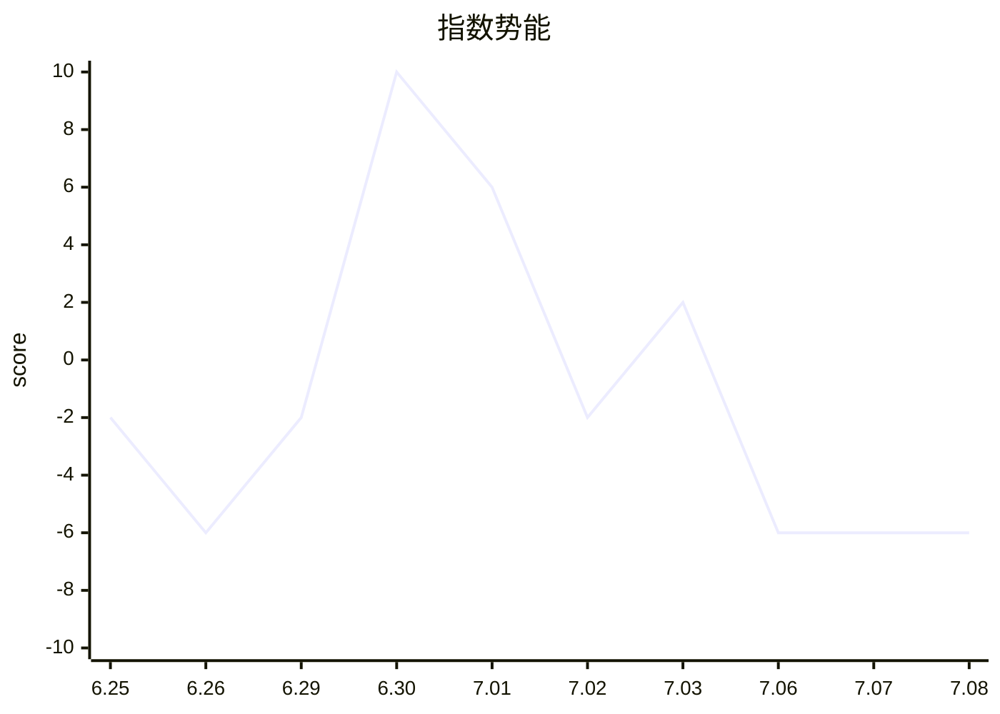
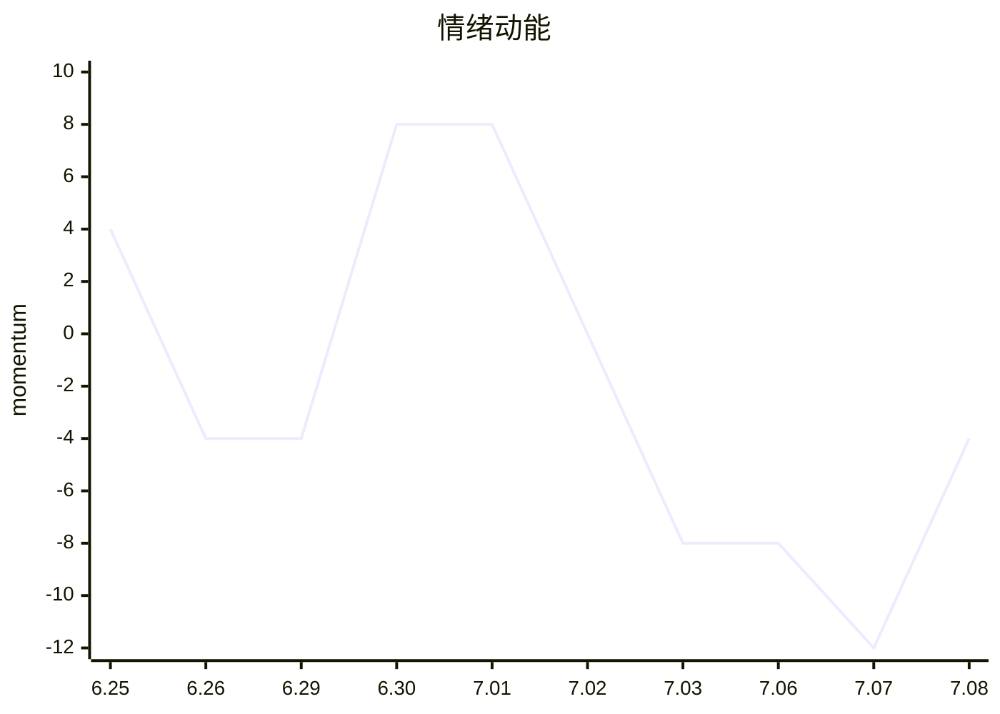
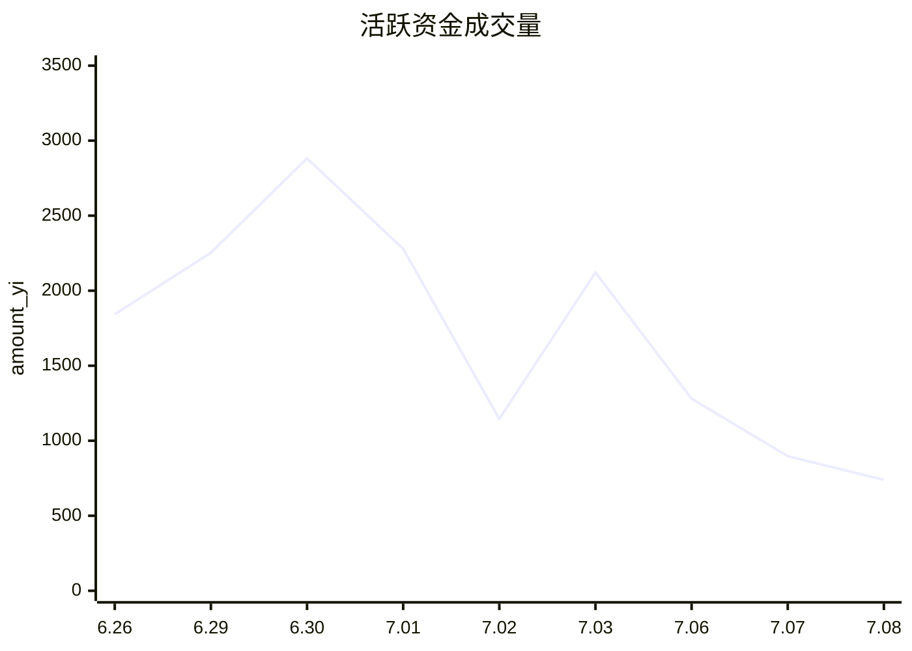
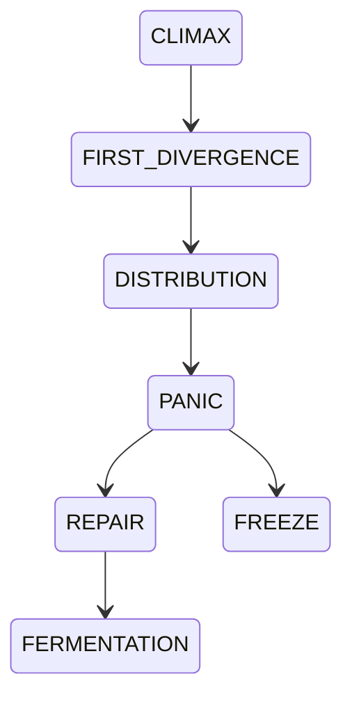

# 2026-07-08 A股涨停复盘（DeepSeek结构化版）

> 来源：用户上传《7:8日复盘(1).pdf》。  
> 目标：完整转换为适合 DeepSeek / M8 Market Cognition Engine 读取的 Markdown。  
> 处理方式：正文保留；图片图表全部转为 Markdown 表格、Mermaid 图、JSON/YAML 结构化数据。  
> 文件页数：10页。  

---

# 1. 今日核心结论

日期：2026-07-08

市场状态：

- 指数处于 12-24 天调整窗口内。
- 今日是深成指数风险信号后的第 5 个下跌日。
- 午盘指数一度翻红，但最终被韩国指数拖累。
- 韩国综合指数对 A 股科技硬件方向影响较大，参考权重甚至超过 A 股自身指数。
- 当前指数连续三根大阴线，临近支撑平台。
- 市场处于情绪冰点后的弱修复观察阶段。
- 国产算力服务器、半导体设备方向最强。
- 情绪连板玩法开始受到关注，重点观察龙头“锐捷网络 / 星网锐捷”。
- 若明日出现缩量十字星、深 V 等企稳迹象，并且韩国指数稳住，可以在指数关联性的科技硬件方向做快进快出的反弹套利。

核心观察：

1. 韩国指数崩盘对 A 股科技硬件抱团影响显著。
2. 存储芯片方向与韩国市场强相关，因为三星、SK 海力士在全球存储芯片中占据重要份额。
3. 韩国市场全民炒股、杠杆较高，类似 2015 年 A 股场外配资环境。
4. 韩国指数高位下来约 20% 跌幅，若再出现 5% 以上跌幅，可能引发穿仓、踩踏和系统性风险。
5. 指数仍在调整周期中，不是每天都跌，中间会有反弹，但阶段整体仍是持续下跌。
6. 7月上半月，在指数持续弱势环境下，市场风格可能聚焦在情绪连板玩法上。
7. 今日最强方向是国产算力服务器、半导体设备。
8. 当前要观察能否由冰点转向修复，以及是否有新的情绪连板方向走出来。

---

# 2. 原文完整正文转换

## 2.1 标题与连载说明

7/8日复盘

“窥探股市中，中短线交易的核心”的连载，放在周末给大家分享，每个星期都有。

午盘指数一度翻红，最终还是被韩国指数带崩了。

这是 7.2 昊哥文章中给大家分享的：

韩国指数一定要多看，参考权重，甚至超过我们自己指数。

---

## 2.2 韩国指数影响

早盘韩国股市崩了，很明显科技股下跌不可避免。

为什么？

这轮全球的科技抱团牛市中，最挣钱的是做存储芯片的三星和 SK 海力士，他们占韩国估值的一半权重份额。

现在韩国全民炒股，人均 3-4 杠杆，职业炒手更是 5-10 倍杠杆。

很像我们 2015 年的行情，场外配资的情况。

目前韩股指数从高点下来已经约 20% 的跌幅，明天再来 5% 以上的跌幅，不排除触发穿仓、踩踏，引发系统性风险。

韩国如果崩了，全球科技 AI 硬件抱团都不可能好。

---

## 2.3 指数梳理

深成指数，上周四出的风险信号，直播里面反复反复地在给大家做风险警告。

对应是 12-24 天的调整窗口。

不是每天都跌，中间会有反弹，回头看整体这个阶段是持续下跌的。

今天是下跌的第 5 天。

指数上连续三根大阴线，位置上也临近了这个支撑平台。

明天如有企稳迹象出现，如缩量十字星、深 V（韩国稳住的前提下），是值得在指数关联性的科技硬件方向做快进快出的反弹套利。

---

## 2.4 方向上

今天最强的是国产算力服务器、半导体设备，也有资金在关注。

昨天说了，是情绪冰点，今天必干竞价就带着大家关注了龙头“锐捷网络”。

希望七月上半月，在指数持续弱势的环境下，市场风格能聚焦在情绪连板的玩法上。

---

## 2.5 直播信息

晚上直播分享：

- 指数弱势行情下，怎么做情绪标的；
- 今天为什么“星网锐捷”必上。

今晚的直播地址，在昨天的文章里面。

7月9 早 8:50，盘前策略分享。

密码：947153。

7月9 晚 7:40，盘前策略分享。

密码：947153。

---

# 3. 指数梳理图表结构化

## 3.1 韩国综合指数 KS11 图表

图片内容转换：

|项目|数值|
|-|-:|
|指数名称|韩国综合指数 KS11|
|最新|7246.790|
|涨跌|-409.520|
|涨幅|-5.35%|
|开盘|7452.48|
|最高|7791.660|
|最低|7186.21|
|昨收|7656.310|
|图中关联指数|香港恒生指数|
|恒生指数涨跌幅|+2.99%|
|恒生指数现价|24199.460|

结构化解释：

```yaml
external_market:
  market: "韩国综合指数 KS11"
  close: 7246.790
  change: -409.520
  pct_change: -5.35
  impact:
    - "韩国指数重挫"
    - "存储芯片权重股影响全球科技硬件"
    - "A股科技硬件方向承压"
  analyst_weight: "参考权重甚至超过A股自身指数"
```

## 3.2 深成指数支撑平台图

图片内容转换：

|项目|结论|
|-|-|
|指数|深证成指|
|当前走势|连续三根大阴线|
|风险窗口|12-24天调整窗口|
|当前天数|第5天下跌|
|图中支撑|平台“1”附近|
|交易含义|若出现缩量十字星、深V，可做短线反弹套利|
|前提条件|韩国指数稳住|

结构化解释：

```yaml
index_context:
  index: "深证成指"
  cycle_window: "12-24 trading days"
  current_down_day: 5
  current_pattern:
    - "连续三根大阴线"
    - "接近支撑平台"
  potential_trade:
    condition:
      - "缩量十字星"
      - "深V"
      - "韩国指数企稳"
    action: "科技硬件方向快进快出反弹套利"
```

---

# 4. 大盘势能指标

## 4.1 情绪风向指标 - 大盘势能

|指标|7.02|7.03|7.06|7.07|7.08|
|-|-:|-:|-:|-:|-:|
|涨停数|93|105|64|33|46|
|连板股|18|16|7|5|8|
|在 -5 下个股数|526|301|637|650|650|
|大盘上涨比|0.39|0.67|0.35|0.12|0.28|
|亏钱效应比|5.66|2.87|9.95|19.70|14.13|
|综合值|-2|2|-6|-6|-6|

## 4.2 大盘势能 Mermaid 图



## 4.3 DeepSeek结构化数据

```json
{
  "indicator": "大盘势能",
  "dates": ["2026-07-02", "2026-07-03", "2026-07-06", "2026-07-07", "2026-07-08"],
  "limit_up_count": [93, 105, 64, 33, 46],
  "chain_board_count": [18, 16, 7, 5, 8],
  "down_below_minus5_count": [526, 301, 637, 650, 650],
  "market_up_ratio": [0.39, 0.67, 0.35, 0.12, 0.28],
  "loss_effect_ratio": [5.66, 2.87, 9.95, 19.70, 14.13],
  "composite_score": [-2, 2, -6, -6, -6],
  "interpretation": "7.08较7.07涨停数与连板数回升，但综合值仍为-6，说明指数与市场环境仍弱。"
}
```

---

# 5. 情绪动能

## 5.1 情绪动能主板指标

|指标|7.02|7.03|7.06|7.07|7.08|
|-|-:|-:|-:|-:|-:|
|昨日首板今天红盘比|0.21|0.48|0.38|0.32|0.50|
|昨日首板大面比|0.20|0.31|0.28|0.48|0.33|
|连板红盘比|0.42|0.39|0.56|0.57|0.60|
|连板比例|0.81|0.94|0.44|0.71|1.40|
|今日连板大面比|0.26|0.39|0.38|0.43|0.20|
|昨日连板未涨停绿盘比|0.75|0.71|0.82|0.83|0.80|
|综合值|0|-8|-8|-12|-4|
|周期|-2|-6|-14|-18|-10|

## 5.2 情绪动能曲线



## 5.3 DeepSeek结构化数据

```json
{
  "indicator": "情绪动能",
  "dates": ["2026-07-02", "2026-07-03", "2026-07-06", "2026-07-07", "2026-07-08"],
  "yesterday_first_board_red_ratio": [0.21, 0.48, 0.38, 0.32, 0.50],
  "yesterday_first_board_big_loss_ratio": [0.20, 0.31, 0.28, 0.48, 0.33],
  "chain_board_red_ratio": [0.42, 0.39, 0.56, 0.57, 0.60],
  "chain_board_ratio": [0.81, 0.94, 0.44, 0.71, 1.40],
  "today_chain_board_big_loss_ratio": [0.26, 0.39, 0.38, 0.43, 0.20],
  "yesterday_chain_board_green_ratio": [0.75, 0.71, 0.82, 0.83, 0.80],
  "emotion_composite": [0, -8, -8, -12, -4],
  "cycle_score": [-2, -6, -14, -18, -10],
  "interpretation": "7.08情绪动能从7.07的-12修复至-4，但周期仍为-10，属于冰点后的弱修复。"
}
```

---

# 6. 活跃资金成交量

## 6.1 午间与全天活跃资金表

|指标|7.02|7.03|7.06|7.07|7.08|
|-|-:|-:|-:|-:|-:|
|午盘：今日所有涨停及触及涨停个股成交量之和（亿）|771|913|826|605|498|
|午盘：昨日所有涨停及触及涨停个股今日成交量之和（亿）|2072|1024|1747|960|765|
|全天：今日所有涨停及触及涨停个股成交量之和（亿）|1146|2122|1280|897|739|
|全天：昨日所有涨停及触及涨停个股今日成交量之和（亿）|2891|1409|2342|1363|1024|

## 6.2 活跃资金成交量曲线



## 6.3 DeepSeek结构化数据

```json
{
  "indicator": "活跃资金成交量",
  "unit": "亿元",
  "series": [
    {"date": "2026-06-26", "value": 1843},
    {"date": "2026-06-29", "value": 2253},
    {"date": "2026-06-30", "value": 2882},
    {"date": "2026-07-01", "value": 2279},
    {"date": "2026-07-02", "value": 1146},
    {"date": "2026-07-03", "value": 2122},
    {"date": "2026-07-06", "value": 1280},
    {"date": "2026-07-07", "value": 897},
    {"date": "2026-07-08", "value": 739}
  ],
  "interpretation": "7.08活跃资金739亿，较7.07的897亿继续下降，说明反弹修复中资金活跃度仍不足。"
}
```

---

# 7. 连板生态

## 7.1 市场最高板与连板天梯

|日期|7.02|7.03|7.06|7.07|7.08|
|-|-|-|-|-|-|
|市场最高板|海南海药|恒尚节能|恒尚节能|恒尚节能|恒尚节能|
|市场赚钱效应最强|启迁联盟；中巨芯（20cm）|启迁联盟；中巨芯（20cm）|百合花；富满微（20cm）|百合花；富满微（20cm）|启迁联盟；富满微（20cm）|
|最高板高度|4|4|5|6|7|

## 7.2 晋级率矩阵

|指标|7.02|7.03|7.06|7.07|7.08|
|-|-|-|-|-|-|
|首板封板率|74/112 = 66%|92/144 = 64%|55/91 = 60%|28/51 = 55%|39/51 = 76%|
|一进二|15/128 = 12%|13/75 = 17%|5/90 = 6%|3/59 = 5%|6/28 = 21%|
|二进三|3/22 = 14%|2/14 = 14%|1/13 = 8%|0/4 = 0%|1/3 = 33%|
|三进四|1/3 = 33%|1/2 = 50%|1/2 = 50%|0/1 = 0%|-|
|四进五|-|0/1 = 0%|1/1 = 100%|1/1 = 100%|-|
|五进六|-|-|-|1/1 = 100%|0/1 = 0%|
|六进七|-|-|-|-|1/1 = 100%|

## 7.3 7月8日强势股连板天梯

|梯队|股票|
|-|-|
|7板|恒尚节能|
|3板|大恒科技|
|2板|魅视科技、天海电子、视源股份、金时科技、威尔高、大名城|

## 7.4 DeepSeek结构化数据

```json
{
  "relay_ecology": {
    "date": "2026-07-08",
    "max_board_height": 7,
    "max_board_stock": "恒尚节能",
    "first_board_success_rate": 0.76,
    "promotion_1_to_2": 0.21,
    "promotion_2_to_3": 0.33,
    "promotion_3_to_4": null,
    "promotion_4_to_5": null,
    "promotion_5_to_6": 0.0,
    "promotion_6_to_7": 1.0,
    "interpretation": "连板高度提升至7板，但五进六失败，说明高度由恒尚节能单点维持，整体接力仍需观察。"
  }
}
```

---

# 8. 核心板块节律

## 8.1 强势股结构

|维度|7.08数据|
|-|-:|
|全部涨停数量|46|
|一板数量|38|
|二板数量|6|
|二板晋级率|21.0%|
|三板数量|1|
|三板晋级率|33.0%|

## 8.2 核心板块节律图结构化说明

图中包含三条趋势线：

|线条|含义|
|-|-|
|红线|连板高度|
|黄线|次高高度|
|蓝线|创业板高度|

结构化结论：

```yaml
core_board_rhythm:
  date_range: "2026-06-29 至 2026-07-08"
  main_signal:
    - "连板高度持续抬升"
    - "7.08市场最高板为恒尚节能7板"
    - "次高高度在7.08回落至大恒科技3板"
    - "创业板高度较低，说明高度主要集中在主板连板"
  interpretation:
    - "市场高度打开，但并非全面扩散"
    - "情绪修复主要靠单一高标维持"
```

---

# 9. 机构资金审美方向

## 9.1 机构资金审美方向矩阵

|板块方向|26.7.02 周四|26.7.03 周五|26.7.06 周一|26.7.07 周二|26.7.08 周三|
|-|-|-|-|-|-|
|华为昇腾950|调整第2天|调整第3天|启动第1天|调整第1天|调整第2天，个别强|
|华为智算/华为链|—|—|启动第1天|启动第2天|调整第1天|
|存储芯片模组厂|调整第3天|启动第1天，弱启动，比指数强，多数收红，资金修复|启动第2天，弱启动，比指数强，多数收红，资金修复|调整第1天|调整第2天|
|国产服务器|调整第2天|调整第3天|调整第4天|调整第5天|启动第1天|
|半导体设备|调整第1天|调整第2天|调整第3天，个别强，部分有资金修复|启动第1天，弱启动，强于指数，资金回流|启动第2天，弱启动，强于指数，资金回流|
|半导体硅片|调整第3天|调整第4天|调整第5天|启动第1天，弱启动，强于指数，资金回流|调整第1天|
|碳化硅|调整第2天|调整第3天|调整第4天|调整第5天，有资金回流，弱于昨日|调整第6天|
|六氟化钨|调整第1天，个别强，多数冲高回落|调整第2天|调整第3天|调整第4天，有资金回流|调整第5天|
|靶材|调整第3天|调整第4天|调整第5天|调整第6天，有资金回流|调整第7天|
|光刻胶|调整第2天|调整第3天|调整第4天|调整第5天，有资金回流|调整第6天|
|金属钽|调整第8天|调整第9天|调整第10天|调整第11天|调整第12天|
|金属铟|调整第3天，个别强|调整第4天，个别强|调整第5天|调整第6天，有资金回流|调整第7天，个别强|
|金属钨|调整第5天，强于指数，尾盘回落|调整第6天|调整第7天|调整第8天|调整第9天|
|氧化锆|调整第2天，个别强|调整第3天|调整第4天|调整第5天|调整第6天|
|液冷服务器|调整第2天|调整第3天，别人强，部分冲高回落，有资金关注|调整第4天，别人强，部分冲高回落，有资金关注|调整第5天|调整第6天|

## 9.2 机构资金方向结论

```yaml
institutional_preference:
  strongest_on_2026_07_08:
    - "国产服务器：启动第1天"
    - "半导体设备：启动第2天，弱启动，强于指数，资金回流"
  weakening:
    - "华为昇腾950：调整第2天，个别强"
    - "存储芯片模组厂：调整第2天"
    - "半导体硅片：调整第1天"
  long_adjustment:
    - "金属钽：调整第12天"
    - "金属钨：调整第9天"
    - "光纤/MPO/CPO方向仍处调整"
```

---

# 10. 科技硬件细分方向节奏

|板块方向|26.7.02 周四|26.7.03 周五|26.7.06 周一|26.7.07 周二|26.7.08 周三|
|-|-|-|-|-|-|
|SST|调整第8天|调整第9天，有资金修复|调整第10天，有资金修复，强于指数|调整第11天|调整第12天|
|英伟达 Rubin 架构|调整第5天|启动第1天，弱启动，比指数强，多数收红，资金修复|调整第1天|调整第2天|调整第3天|
|光纤|调整第5天|调整第6天，部分有资金回流|调整第7天|调整第8天|调整第9天|
|MPO|调整第2天|调整第3天|调整第4天|调整第5天|调整第6天|
|CPO光模块|调整第2天|调整第3天，个别强，有资金回流|调整第4天|调整第5天，有资金回流，部分标的强于指数|调整第6天|
|PCB|调整第2天|启动第1天|调整第1天|调整第2天|调整第3天|
|MLCC|调整第5天|调整第6天|调整第7天|调整第8天|调整第9天|
|覆铜板|调整第5天|启动第1天，弱启动，比指数强，多数收红，资金修复|调整第1天|调整第2天|调整第3天|
|电子布|调整第4天|启动第1天，弱启动，比指数强，多数收红，资金修复|调整第1天|调整第2天|调整第3天|
|铜箔|调整第6天，个别强，冲高回落|启动第1天，弱启动，比指数强，多数收红，资金修复|调整第1天|调整第2天|调整第3天|
|环氧树脂|调整第5天|调整第6天|调整第7天|调整第8天|调整第9天|

---

# 11. 情绪资金 / 游资方向

|板块方向|26.7.02 周四|26.7.03 周五|26.7.06 周一|26.7.07 周二|26.7.08 周三|
|-|-|-|-|-|-|
|消费|启动第7天，7家涨停，跨境/跨境相关4板|启动第8天，4家涨停，天域生物2连板|启动第9天，9家涨停，农林牧渔3天2板，楚天集团4天2板|调整第1天|启动第1天，涨停5家，庄园牧场3天2板|
|医疗医药|启动第4天，5家涨停，海南海药8天6板|启动第5天，2家涨停，海南海药断板，石药集团2连板|启动第6天，弱延续，板块分歧较大，冲高回落，强于指数|调整第1天|调整第2天，个别强|
|算电协同|调整第1天|调整第2天|调整第3天，个别强|调整第4天，个别强|调整第5天|
|可控核聚变|调整第3天|调整第4天|调整第5天|调整第6天|调整第7天|
|长鑫长江存储|调整第6天，部分标的较关注|调整第7天，部分标的较关注|调整第8天|调整第9天|调整第10天|
|商业航天|调整第1天|启动第1天|调整第1天|调整第2天|调整第3天|

## 11.1 游资方向结论

```yaml
hot_money_style:
  2026_07_08:
    active:
      - "消费：启动第1天，涨停5家，庄园牧场3天2板"
    weak:
      - "医疗医药：调整第2天，个别强"
      - "算电协同：调整第5天"
      - "商业航天：调整第3天"
  interpretation:
    - "游资方向仍未形成强合力"
    - "消费有重新启动迹象，但是否成为新周期仍需观察"
```

---

# 12. 涨停股分类

|题材|26.7.02|26.7.03|26.7.06|26.7.07|26.7.08|
|-|-|-|-|-|-|
|氟化工（无水氢氟酸）|启动第4天|调整第1天|调整第2天|调整第3天|调整第4天|
|物理AI|调整第1天|启动第1天|调整第1天|调整第2天，港股标的强一点|调整第3天|
|机器人|启动第3天|启动第4天|调整第1天，板块分歧|调整第2天，板块分歧，埃斯顿和绿的强一点|调整观察|
|AIDC|调整第1天|调整第2天|调整第3天|调整第4天|启动第1天|
|玻璃基板|调整第2天，有资金关注|调整第3天|调整第4天|调整第5天，个别强|调整第6天，个别强|
|金刚石散热|启动第1天|调整第1天|启动第1天|调整第1天，冲高回落|调整第2天，冲高回落|
|AI应用|启动第4天|调整第1天|调整第2天|调整第3天|启动第1天|

## 12.1 涨停分类结论

```yaml
limitup_theme_classification:
  newly_started:
    - "AIDC：启动第1天"
    - "AI应用：启动第1天"
  weak_repair:
    - "机器人：调整观察"
    - "金刚石散热：调整第2天，冲高回落"
  still_adjusting:
    - "氟化工"
    - "物理AI"
    - "玻璃基板"
```

---

# 13. 热点复盘：07月08日 A股涨停复盘

## 13.1 总览

|指标|数值|
|-|-:|
|涨停个数|48只|
|总晋级率|24.24%|
|总炸板率|22.95%|
|总竞价涨幅|+2.00%|

---

## 13.2 算力 / 半导体产业链

主题说明：

> 浪潮信息中报预增；世界人工智能大会将展出昇腾 Atlas 950。

|梯队|代码|股票|时间|涨停原因|
|-|-|-|-|-|
|7板|603137|恒尚节能|14:23:06|拟收购存储公司 + 建筑幕墙 + 跨界转型|
|2板|600094|大名城|09:30:55|算力运营 + 6G通信 + 低空经济 + 地产转型|
|首板|000977|浪潮信息|09:25:00|中报预增 + AI服务器 + 液冷服务器 + 山东国资|
|首板|001208|华菱线缆|09:25:00|英伟达液冷 + 商业航天 + 机器人 + 湖南国资|
|首板|600756|浪潮软件|09:30:00|浪潮系联动 + AI政务 + 山东国资|
|首板|603380|易德龙|09:30:49|AI服务器 + 人形机器人 + 柔性EMS龙头|
|首板|002396|星网锐捷|09:34:57|半年报预增 + 数据中心交换机 + CPO + 福建国资|
|首板|603496|恒为科技|09:37:23|算力租赁 + 华为昇腾 + 拟收购数珩科技|
|首板|301202|朗威股份|09:38:24|液冷 + 数据中心 + 算力 + 维谛合作|
|首板|603928|兴业股份|09:54:23|半导体光刻胶 + CVD硅碳负极 + 铸造树脂|
|首板|300017|网宿科技|10:08:45|CDN涨价 + 液冷 + 算力租赁 + 边缘AI|
|首板|002467|二六三|10:25:45|数据中心 + 云网融合 + AI数字人|
|首板|002757|南兴股份|10:27:54|算力租赁 + CDN + 家具智造|
|首板|603881|数据港|10:31:46|算力租赁 + 智算业务 + 上海国资|
|首板|000948|南天信息|10:42:24|数据中心 + 金融科技 + 诉讼回款 + 国企改革|
|首板|002674|兴业科技|10:46:45|磷化铟收购 + 机器人电子皮肤 + 汽车内饰皮革|
|首板|600602|云赛智联|10:57:10|算力租赁 + 人工智能 + 上海国资|
|首板|002642|荣联科技|11:02:03|算力服务 + AI应用 + 股份转让 + 国企|
|首板|603661|恒林股份|11:12:10|投资GPU公司 + 培育钻石 + 家居用品 + 出口|
|首板|603296|华勤技术|11:20:33|超节点 + AI服务器 + 增持|
|首板|603339|四方科技|13:04:41|液冷服务器 + 冷链装备 + 员工持股|
|首板|301321|翰博高新|13:12:51|湿电子化学品 + Mini-LED + 车载显示 + 一季报扭亏|
|首板|300454|深信服|13:15:18|AI算力网关 + 算力租赁 + 间接持股宇树|
|首板|002152|广电运通|13:19:06|华为昇腾 + 算力 + 具身智能 + 广州国资|
|首板|603183|建研院|13:23:25|数据中心 + 成立人工智能公司 + 城市更新 + 工程检测|
|首板|603285|键邦股份|14:17:34|高分子助剂 + 电磁线漆 + AI算力 + 自动化设备收购|

---

## 13.3 大消费

主题说明：

> 大消费板块活跃。

|梯队|代码|股票|时间|涨停原因|
|-|-|-|-|-|
|首板|600749|西藏旅游|09:37:25|智慧旅游 + 入境游|
|首板|000759|中百集团|09:50:30|商业零售 + 本地生活 + 国企|
|首板|002910|庄园牧场|11:04:36|乳业 + 文创联名 + 国企改革|
|首板|002677|浙江美大|13:39:27|AI厨电 + 集成灶龙头 + 智能驾驶|
|首板|603313|梦百合|14:11:01|智能家居 + 跨境电商 + 美国产能|

---

## 13.4 机器人

主题说明：

> 特斯拉 Optimus 加速量产；宇树科技 IPO 注册。

|梯队|代码|股票|时间|涨停原因|
|-|-|-|-|-|
|3板|600288|大恒科技|13:08:05|机器视觉 + 半导体 + 机器人|
|2板|001229|魅视科技|09:25:00|AI视觉 + 边缘计算 + 光纤KVMS + 商业航天|
|2板|001365|天海电子|13:07:24|人形机器人 + 汽车线束龙头 + 广州国资|
|首板|920857|泓禧科技|11:03:18|扫地机器人 + AI PC + 高精度电子线组件|

---

## 13.5 电力 / 数据中心供电

主题说明：

> AI驱动数据中心供电需求。

|梯队|代码|股票|时间|涨停原因|
|-|-|-|-|-|
|2板|002951|金时科技|13:49:03|超级电容 + 间接投资光纤公司 + 储能|
|2板|301251|威尔高|15:00:00|AI电源PCB + DC/DC订单 + 产能释放|
|首板|002350|北京科锐|10:20:15|储能出海 + 电网中标 + 配电设备|

---

## 13.6 中报预增

主题说明：

> 市场中报预告密集披露。

|梯队|代码|股票|时间|涨停原因|
|-|-|-|-|-|
|2板|002841|视源股份|13:55:24|中报预增 + AI教育 + 机器人|
|首板|002546|新联电子|09:36:21|中报预增 + 虚拟电厂 + 用电信息采集|

---

## 13.7 医药

主题说明：

> 医药板块活跃。

|梯队|代码|股票|时间|涨停原因|
|-|-|-|-|-|
|首板|600129|太极集团|09:42:58|藿香正气口服液 + 创新药 + 央企|
|首板|600488|津药药业|15:10:51|创新药 + 甾体激素 + 海外注册|

---

## 13.8 其他概念

|梯队|代码|股票|时间|涨停原因|
|-|-|-|-|-|
|首板|000524|岭南控股|09:25:00|资产重组 + 复牌 + 旅游综合 + 广州国资|
|首板|002490|山东墨龙|09:52:15|油气装备 + 海外大单 + 山东国资|
|首板|000506|招金黄金|10:00:27|黄金 + 一季报扭亏 + 国企|
|首板|001207|联科科技|10:51:24|炭黑 + 高压电缆屏蔽料 + 固态电池 + 股份变动|
|首板|300369|绿盟科技|13:33:39|AI安全 + 数据安全 + 算力|
|首板|600350|山东高速|14:53:32|高速公路 + 高股息 + 山东国资|

---

# 14. 情绪周期判断



当前：

```json
{
  "date": "2026-07-08",
  "phase": "REPAIR_WATCH",
  "previous_phase": "PANIC",
  "risk": "MEDIUM_HIGH",
  "strategy": "等待核心方向确认；科技硬件可做快进快出反弹套利；关注情绪连板玩法是否走出",
  "key_conditions": [
    "韩国指数企稳",
    "缩量十字星",
    "深V反弹",
    "国产算力服务器持续强势",
    "半导体设备方向继续资金回流",
    "锐捷网络/星网锐捷等情绪标的能否继续强化"
  ]
}
```

---

# 15. M8 Market Cognition Engine 字段映射

|复盘字段|M8字段|
|-|-|
|韩国指数崩盘|ExternalEnvironment.korea_index_shock|
|深成指数调整窗口|MarketIndexContext.adjustment_window|
|涨停数量|LimitUpMetrics.limit_up_total_count|
|连板股|RelayEcologyMetrics.chain_board_count|
|在-5下个股数|LossEffectMetrics.down_below_minus5_count|
|大盘上涨比|MarketBreadthMetrics.market_up_ratio|
|亏钱效应比|LossEffectMetrics.loss_effect_ratio|
|指数势能|MarketPowerMetrics.index_power|
|情绪动能|EmotionMomentumMetrics.raw|
|活跃资金成交量|ActiveCapitalMetrics.amount_yi|
|最高板|LeaderEvolutionMetrics.max_board_height|
|连板天梯|RelayEcologyMetrics.ladder|
|机构资金审美方向|CapitalPreference.institutional_style|
|情绪资金/游资方向|CapitalPreference.hot_money_style|
|涨停股分类|LimitUpAttribution.theme_classification|
|涨停复盘股票池|LimitUpAttribution.stock_events|
|盘后结论|NarrativeEngine.market_story|
|策略建议|PlaybookEngine.strategy|

---

# 16. DeepSeek输入JSON

```json
{
  "date": "2026-07-08",
  "document_type": "analyst_replay_report",
  "market_phase": "REPAIR_WATCH",
  "risk": "MEDIUM_HIGH",
  "external_environment": {
    "korea_index": {
      "latest": 7246.790,
      "pct_change": -5.35,
      "impact": "科技硬件方向承压"
    }
  },
  "index_context": {
    "index": "深成指数",
    "adjustment_window": "12-24 trading days",
    "current_down_day": 5,
    "pattern": "连续三根大阴线，临近支撑平台",
    "rebound_conditions": [
      "缩量十字星",
      "深V",
      "韩国指数企稳"
    ]
  },
  "market_power": {
    "limit_up": 46,
    "chain_board": 8,
    "down_below_minus5": 650,
    "market_up_ratio": 0.28,
    "loss_effect_ratio": 14.13,
    "composite": -6
  },
  "emotion": {
    "emotion_momentum": -4,
    "cycle_score": -10,
    "interpretation": "冰点后的弱修复"
  },
  "active_capital": {
    "amount_yi": 739,
    "trend": "continued_decline"
  },
  "relay": {
    "max_board": 7,
    "max_board_stock": "恒尚节能",
    "first_board_success_rate": 0.76,
    "promotion_1_to_2": 0.21,
    "promotion_2_to_3": 0.33,
    "promotion_5_to_6": 0.0,
    "promotion_6_to_7": 1.0
  },
  "institutional_themes": [
    {"theme": "国产服务器", "state": "启动第1天"},
    {"theme": "半导体设备", "state": "启动第2天，弱启动，强于指数，资金回流"},
    {"theme": "华为昇腾950", "state": "调整第2天，个别强"}
  ],
  "hot_money_themes": [
    {"theme": "消费", "state": "启动第1天，涨停5家"},
    {"theme": "医疗医药", "state": "调整第2天，个别强"},
    {"theme": "商业航天", "state": "调整第3天"}
  ],
  "limitup_themes": [
    "算力/半导体产业链",
    "大消费",
    "机器人",
    "电力/数据中心供电",
    "中报预增",
    "医药",
    "其他概念"
  ],
  "key_stocks": [
    {"code": "603137", "name": "恒尚节能", "board": "7板"},
    {"code": "600094", "name": "大名城", "board": "2板"},
    {"code": "000977", "name": "浪潮信息", "board": "首板"},
    {"code": "002396", "name": "星网锐捷", "board": "首板"},
    {"code": "600288", "name": "大恒科技", "board": "3板"},
    {"code": "001229", "name": "魅视科技", "board": "2板"},
    {"code": "001365", "name": "天海电子", "board": "2板"},
    {"code": "002951", "name": "金时科技", "board": "2板"},
    {"code": "301251", "name": "威尔高", "board": "2板"}
  ],
  "analyst_conclusion": {
    "summary": "市场从情绪冰点后出现弱修复，但指数环境仍弱，韩国指数风险未完全解除。国产算力服务器、半导体设备方向最强，情绪连板玩法开始被关注。",
    "strategy": "等待指数企稳和核心方向确认；科技硬件方向可快进快出反弹套利；关注情绪连板能否走出。"
  }
}
```

---

# 17. AnalystReferenceDataset 格式

```json
{
  "trade_date": "2026-07-08",
  "source": "analyst_pdf",
  "facts": {
    "limit_up_count": 46,
    "chain_board_count": 8,
    "max_board_height": 7,
    "active_capital_yi": 739,
    "market_up_ratio": 0.28,
    "loss_effect_ratio": 14.13
  },
  "emotion_label": {
    "phase": "REPAIR_WATCH",
    "risk": "MEDIUM_HIGH",
    "emotion_momentum": -4,
    "cycle_score": -10
  },
  "relay_label": {
    "first_board_success_rate": 0.76,
    "promotion_1_to_2": 0.21,
    "promotion_2_to_3": 0.33,
    "max_board_stock": "恒尚节能"
  },
  "theme_labels": {
    "institutional_style": ["国产服务器", "半导体设备", "华为昇腾950"],
    "hot_money_style": ["消费", "医疗医药", "商业航天"],
    "limitup_classification": ["算力/半导体产业链", "大消费", "机器人", "电力/数据中心供电", "中报预增", "医药", "其他概念"]
  },
  "strategy_label": {
    "allowed": ["科技硬件快进快出反弹套利", "情绪连板观察", "核心方向确认后跟随"],
    "forbidden": ["指数未企稳前重仓追高", "韩国指数继续杀跌时主动进攻科技硬件"],
    "watch_points": ["韩国指数", "深成指数支撑平台", "星网锐捷/锐捷网络", "恒尚节能高度", "国产服务器/半导体设备持续性"]
  }
}
```
