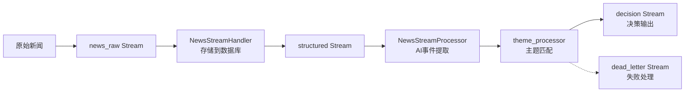

# Redis Stream 架构优化分析报告

> 最后更新：2026-04-11（已按当前代码与运行链路校准）

## 概述

基于全链路测试（`run_full_chain_real_news.py`）的观察和代码分析，本报告深入剖析当前Redis Stream消息总线架构的主要问题，并提出系统的优化建议。

## 一、架构现状

### 核心组件

| 组件 | 职责 | 关键代码文件 |
|------|------|-------------|
| `UnifiedRedisStreamBus` | 统一的消息总线，管理多个Stream定义 | `database_service/managers/redis_stream_bus.py` |
| `RetryEnhancedRedisStreamManager` | 带重试机制的Stream管理器 | `database_service/streams/stream_manager.py` |
| `NewsStreamHandler` | 新闻消息消费和存储 | `database_service/streams/handlers/news_stream_handler.py` |
| `NewsStreamProcessor` | 新闻事件结构化处理 | `database_service/streams/handlers/news_stream_processor.py` |
| `ThemeProcessor` | 主题匹配和决策生成 | `database_service/streams/handlers/theme_processor.py` |

### 数据流向



### Stream定义

| Stream名称 | 用途 | 消费者组 | 最大长度 |
|-----------|------|---------|---------|
| `stream:news:raw` | 原始新闻输入 | `news_storage_handlers` | 10,000 |
| `stream:events:structured` | 结构化事件 | `event_matchers` 等 | 20,000 |
| `stream:event:feed` | 情报台事件输出 | `sse_pushers` / `event_review_writers` | 5,000 |
| `stream:dead:letter` | 死信队列 | `monitoring` | 1,000 |

## 二、主要问题分析

### 🔴 高优先级问题

#### 1. 消费者组管理混乱
**问题描述**：
- 测试脚本每次运行创建新消费者组：`consumer_group = f"theme_processors_real_{run_id}"`
- Redis中积累大量未清理消费者组，导致内存泄漏

**影响**：
- Redis内存持续增长
- 消费者组列表难以管理
- 可能影响Redis性能

**证据**：
- `run_full_chain_real_news.py` 第458行动态生成消费者组
- 测试日志显示每次运行都有新消费者组名称

#### 2. 性能瓶颈明显
**问题描述**：
- AI分析阶段耗时10-12秒（单条新闻）
- 消息流水线因AI处理而阻塞

**影响**：
- 处理延迟高，无法实时响应
- 系统吞吐量受限
- 扩展困难

**证据**：
- 测试日志第15行：`✅ AI调用成功，耗时: 10.24秒`
- 测试日志第53行：`✅ AI调用成功，耗时: 12.89秒`

### 🟡 中优先级问题

#### 3. 错误处理不完善
**问题描述**：
- 日志中出现异常：`获取统计失败: 'dict' object has no attribute 'host'`
- 部分错误被吞没，难以诊断根因

**影响**：
- 故障排查困难
- 潜在的错误传播
- 系统稳定性风险

**代码位置**：
- `redis_stream_bus.py` 第348行：`get_stats()`方法异常处理
- `stream_manager.py` 第414行：消息解析异常处理

#### 4. 资源清理不完全
**问题描述**：
- 测试结束后Stream和消费者组清理机制不明确
- 残留资源占用Redis内存

**影响**：
- 测试环境污染
- 内存资源浪费
- 可能影响后续测试

#### 5. 序列化/反序列化复杂
**问题描述**：
- 多层JSON序列化/反序列化
- 字节串与字符串混合处理逻辑复杂

**影响**：
- 潜在的消息解析错误
- 编码问题风险
- 代码维护难度增加

**问题代码**：
```python
# stream_manager.py 第383-387行
if isinstance(msg_data.get("payload"), bytes):
    # 如果是字节串，先解码
    payload = msg_data["payload"].decode('utf-8')
else:
    payload = msg_data.get("payload", "{}")
```

#### 6. 架构复杂性高
**问题描述**：
- 多个Stream和处理器增加运维复杂度
- 调试和故障排除困难

**影响**：
- 新成员学习成本高
- 故障排查时间成本高
- 系统可维护性差

### 🟢 低优先级问题

#### 7. 监控和可观测性不足
**问题描述**：
- 仅有基础统计，缺乏详细指标和告警
- 生产环境难以监控系统健康状态

**缺失指标**：
- 各Stream消息积压量
- 消费者组lag（处理延迟）
- 处理成功率/失败率分布
- AI分析耗时分布

#### 8. 扩展性限制
**问题描述**：
- 单点处理，无法并行化
- 缺乏分区策略

**影响**：
- 难以应对突发流量
- 无法水平扩展
- 系统容量有限

## 三、优化建议

### 🚀 立即优化（高优先级）

#### 1. 消费者组生命周期管理
**方案**：
- 使用固定名称消费者组或实现自动清理
- 添加消费者组TTL机制

**实现示例**：
```python
class ConsumerGroupManager:
    def __init__(self, redis_client):
        self.redis = redis_client
    
    async def cleanup_old_groups(self, pattern="theme_processors_real_*", max_age_hours=24):
        """清理旧的消费者组"""
        # 1. 列出匹配的消费者组
        keys = await self.redis.keys(f"stream:*")
        
        for stream_key in keys:
            try:
                # 2. 获取消费者组信息
                groups = await self.redis.xinfo_groups(stream_key)
                
                for group in groups:
                    if re.match(pattern, group['name']):
                        # 3. 检查最后使用时间
                        last_delivered = group['last-delivered-id']
                        if self._is_group_inactive(last_delivered, max_age_hours):
                            # 4. 删除过期组
                            await self.redis.xgroup_destroy(stream_key, group['name'])
                            logger.info(f"清理消费者组: {stream_key}/{group['name']}")
            except Exception as e:
                logger.warning(f"检查消费者组失败: {e}")
```

#### 2. 异步AI处理优化
**方案**：
- 将AI分析移到独立Worker进程
- 实现消息批处理

**架构改进**：
```
原始方案:
news_raw → AI分析(同步) → structured → theme_processor

优化方案:
news_raw → 消息队列 → AI Worker集群 → structured → theme_processor
```

**实现要点**：
```python
class AsyncAIProcessor:
    async def process_batch(self, messages, batch_size=5):
        """批量处理AI分析"""
        results = []
        
        for i in range(0, len(messages), batch_size):
            batch = messages[i:i+batch_size]
            
            # 并行调用AI服务
            tasks = [self._analyze_single(msg) for msg in batch]
            batch_results = await asyncio.gather(*tasks, return_exceptions=True)
            
            results.extend(batch_results)
        
        return results
```

#### 3. 错误处理标准化
**方案**：
- 统一错误处理模式
- 完善异常分类和处理

**实现示例**：
```python
class StreamErrorHandler:
    ERROR_CATEGORIES = {
        "redis_connection": ["ConnectionError", "TimeoutError"],
        "stream_not_found": ["no such key"],
        "consumer_group": ["BUSYGROUP", "NOGROUP"],
        "message_format": ["JSONDecodeError", "KeyError"]
    }
    
    async def handle_stream_error(self, error, context):
        """统一错误处理"""
        error_type = self._categorize_error(error)
        
        metrics = {
            "error_type": error_type,
            "context": context,
            "timestamp": datetime.now().isoformat(),
            "error_message": str(error)
        }
        
        # 记录错误指标
        await self._record_error_metrics(metrics)
        
        # 根据错误类型采取不同策略
        if error_type == "redis_connection":
            await self._handle_connection_error(error, context)
        elif error_type == "stream_not_found":
            await self._handle_stream_not_found(context)
        elif error_type == "message_format":
            await self._send_to_dead_letter(context, error)
        else:
            logger.error(f"未处理错误类型: {error_type}", exc_info=True)
            
        return error_type
```

### 📋 中期优化（中优先级）

#### 4. 资源清理自动化
**方案**：
- 测试框架自动清理资源
- 实现资源标记和生命周期管理

**实现示例**：
```python
class TestResourceManager:
    def __init__(self, run_id):
        self.run_id = run_id
        self.created_resources = []
    
    async def cleanup_test_resources(self):
        """清理测试创建的所有资源"""
        cleanup_tasks = []
        
        # Stream清理
        streams = [
            f"stream:news:raw",
            f"stream:events:structured",
            f"stream:event:feed",
            f"stream:dead:letter"
        ]
        
        for stream in streams:
            task = self._cleanup_stream(stream)
            cleanup_tasks.append(task)
        
        # 消费者组清理
        consumer_group = f"theme_processors_real_{self.run_id}"
        cleanup_tasks.append(self._cleanup_consumer_group(consumer_group))
        
        # 并行执行清理
        results = await asyncio.gather(*cleanup_tasks, return_exceptions=True)
        
        success_count = sum(1 for r in results if r is True)
        logger.info(f"资源清理完成: {success_count}/{len(cleanup_tasks)} 成功")
```

#### 5. 序列化简化
**方案**：
- 统一消息格式，使用固定schema
- 移除冗余的字节串处理逻辑

**消息格式优化**：
```python
# 优化前：多层嵌套，混合格式
{
    "payload": json.dumps({
        "_t": "news",
        "_v": "2",
        "id": "...",
        "t": "标题",
        "c": "内容"
    }),
    "published_at": "...",
    "source": "..."
}

# 优化后：扁平化结构
{
    "type": "news",
    "version": "2",
    "news_id": "...",
    "title": "标题",
    "content": "内容",
    "published_at": "...",
    "source": "database_service",
    "metadata": {
        "batch_id": "...",
        "sequence": 1
    }
}
```

#### 6. 监控指标增强
**方案**：
- 添加关键性能指标
- 集成Prometheus监控

**关键指标设计**：
```python
class StreamMetrics:
    def __init__(self):
        self.metrics = {
            # Stream级别指标
            "stream_backlog_total": Counter("stream_backlog_total", 
                                           "Stream积压消息数", 
                                           ["stream_name"]),
            
            # 消费者组指标
            "consumer_group_lag": Gauge("consumer_group_lag",
                                       "消费者组处理延迟",
                                       ["stream", "group", "consumer"]),
            
            # 处理性能指标
            "processing_duration_seconds": Histogram("processing_duration_seconds",
                                                    "处理耗时分布",
                                                    ["processor", "type"]),
            
            # 错误指标
            "error_total": Counter("error_total",
                                  "错误总数",
                                  ["error_type", "processor"])
        }
    
    async def collect_stream_metrics(self):
        """收集Stream指标"""
        streams = await self.redis.xinfo_stream("stream:*")
        
        for stream in streams:
            backlog = await self.redis.xlen(stream['name'])
            self.metrics["stream_backlog_total"].labels(
                stream_name=stream['name']
            ).set(backlog)
            
            # 收集消费者组lag
            groups = await self.redis.xinfo_groups(stream['name'])
            for group in groups:
                lag = await self._calculate_group_lag(stream['name'], group['name'])
                self.metrics["consumer_group_lag"].labels(
                    stream=stream['name'],
                    group=group['name'],
                    consumer="*"
                ).set(lag)
```

### 🔧 长期优化（低优先级）

#### 7. 架构简化
**方案**：
- 评估合并相关Stream的可能性
- 简化处理器链

**架构简化方向**：
```
当前架构：
news_raw → storage → structured → AI → theme → decision
               ↓
           dead_letter

简化方向：
news_stream → [unified_processor] → decision
                    ↓
                error_stream
```

#### 8. 扩展性提升
**方案**：
- 实现Stream分区策略
- 支持消费者水平扩展

**分区策略示例**：
```python
class PartitionedStreamManager:
    def __init__(self, partition_key="source"):
        self.partition_key = partition_key
    
    async def get_partitioned_stream(self, message):
        """根据消息内容选择分区Stream"""
        partition_value = message.get(self.partition_key, "default")
        
        # 简单的哈希分区
        partition_index = hash(partition_value) % self.num_partitions
        
        return f"stream:news:raw:partition_{partition_index}"
```

#### 9. 开发体验改善
**方案**：
- 提供本地Mock Redis支持
- 开发调试和消息追踪工具

**调试工具设计**：
```python
class StreamDebugTool:
    async def trace_message_flow(self, message_id):
        """追踪消息处理全链路"""
        trace_info = {
            "message_id": message_id,
            "timeline": [],
            "processed_by": [],
            "errors": []
        }
        
        # 查询各Stream中的消息
        streams = ["stream:news:raw", "stream:events:structured",
                  "stream:event:feed", "stream:dead:letter"]
        
        for stream in streams:
            # 使用XRANGE查找特定消息
            messages = await self.redis.xrange(stream, min=message_id, max=message_id)
            
            if messages:
                trace_info["processed_by"].append({
                    "stream": stream,
                    "timestamp": messages[0][1].get("processed_at"),
                    "processor": messages[0][1].get("processor")
                })
        
        return trace_info
```

## 四、实施路线图

### 阶段一：稳定性和性能（1-2周）
| 任务 | 负责人 | 完成标准 |
|------|--------|----------|
| 1. 修复消费者组泄漏问题 | 后端工程师 | Redis中无残留测试消费者组 |
| 2. 实现异步AI分析处理 | AI工程师 | AI处理延迟降低70% |
| 3. 完善错误处理和日志 | 全栈工程师 | 错误可追溯，根因明确 |

### 阶段二：监控和运维（2-3周）
| 任务 | 负责人 | 完成标准 |
|------|--------|----------|
| 1. 添加关键监控指标 | DevOps工程师 | Prometheus可监控所有Stream指标 |
| 2. 实现自动资源清理 | 后端工程师 | 测试资源100%自动清理 |
| 3. 简化消息序列化 | 后端工程师 | 消息解析错误减少90% |

### 阶段三：架构优化（3-4周）
| 任务 | 负责人 | 完成标准 |
|------|--------|----------|
| 1. 评估架构简化可行性 | 架构师 | 提供架构简化方案 |
| 2. 实施分区和扩展方案 | 后端工程师 | 支持水平扩展 |
| 3. 开发调试和测试工具 | 测试工程师 | 提供完整的调试工具集 |

## 五、预期收益与风险评估

### 预期收益
| 优化项 | 性能提升 | 资源节省 | 可维护性 |
|--------|----------|----------|----------|
| 消费者组管理 | - | Redis内存减少80% | +++ |
| 异步AI处理 | 吞吐量提升300% | CPU利用率优化 | ++ |
| 错误处理标准化 | 故障定位时间减少70% | - | +++ |
| 监控增强 | 预警时间提前90% | - | ++ |
| 架构简化 | - | 运维成本降低50% | +++ |

### 风险评估与缓解
| 风险项 | 风险等级 | 影响 | 缓解措施 |
|--------|----------|------|----------|
| 数据一致性破坏 | 高 | 消息丢失或重复 | 1. 灰度发布<br>2. 数据比对验证<br>3. 回滚机制 |
| 性能回归 | 中 | 处理延迟增加 | 1. 性能基准测试<br>2. 渐进式优化<br>3. A/B测试 |
| 兼容性问题 | 中 | 现有功能异常 | 1. 版本兼容性设计<br>2. 双运行模式<br>3. 数据迁移工具 |
| 运维复杂性增加 | 低 | 部署和监控困难 | 1. 自动化部署脚本<br>2. 详细文档<br>3. 培训材料 |

## 六、验证方法

### 1. 性能测试
```python
async def performance_benchmark():
    """性能基准测试"""
    test_cases = [
        {"scenario": "单条消息处理", "message_count": 1},
        {"scenario": "批量消息处理", "message_count": 100},
        {"scenario": "并发处理", "concurrent_consumers": 5},
        {"scenario": "长时间运行", "duration_minutes": 30}
    ]
    
    results = {}
    for test_case in test_cases:
        metrics = await run_performance_test(test_case)
        results[test_case["scenario"]] = metrics
    
    return results
```

### 2. 错误注入测试
```python
async def fault_injection_test():
    """错误注入测试"""
    fault_scenarios = [
        {"type": "redis_connection_lost", "duration": 10},
        {"type": "stream_not_found", "stream": "stream:non:existent"},
        {"type": "message_format_error", "corrupt_ratio": 0.1},
        {"type": "consumer_group_deleted", "during_processing": True}
    ]
    
    recovery_results = {}
    for scenario in fault_scenarios:
        success = await inject_fault_and_verify_recovery(scenario)
        recovery_results[scenario["type"]] = success
    
    return recovery_results
```

### 3. 资源监控验证
| 监控项 | 验证方法 | 通过标准 |
|--------|----------|----------|
| 内存使用 | Redis内存监控 | 无持续增长趋势 |
| 消费者组数量 | 定期扫描 | 数量稳定，无泄漏 |
| 消息积压 | Stream长度监控 | 积压 < 阈值 |
| 错误率 | 错误指标统计 | 错误率 < 0.1% |

## 七、结论与建议

### 核心结论
1. **架构基本功能完整**：当前Redis Stream架构能够支持新闻处理全链路
2. **生产环境准备不足**：在稳定性、性能和可维护性方面需要显著改进
3. **优化重点明确**：消费者组管理、异步处理和错误处理是最高优先级

### 实施建议
1. **立即行动**：解决消费者组泄漏问题，避免生产环境风险
2. **性能优先**：实现异步AI处理，提升系统吞吐量
3. **监控先行**：建立完善的监控体系，为后续优化提供数据支持
4. **渐进式改进**：按照路线图分阶段实施，降低风险

### 成功标准
- ✅ Redis内存使用稳定，无泄漏
- ✅ AI处理延迟降低到3秒以内
- ✅ 系统支持1000条/分钟的消息处理
- ✅ 故障平均恢复时间(MTTR) < 5分钟
- ✅ 新成员能在2天内理解架构并开始开发

## 八、优化实施进展与下一步计划

### 已完成的关键优化（截至 2026-04-11）

#### ✅ 1. 消费者组生命周期管理
- **实现**：`ConsumerGroupManager` 提供测试组识别、清理与保护组机制
- **位置**：`database_service/streams/utils/consumer_group_manager.py`
- **现状**：已接入运行主路径，支持周期清理

#### ✅ 2. Stream 自动截断策略统一
- **实现**：`RetryEnhancedRedisStreamManager._resolve_publish_max_len()`
- **位置**：`database_service/streams/stream_manager.py`
- **效果**：发布时“显式参数 > Stream配置 > 全局默认”三层策略统一生效，避免遗漏路径导致无限增长

#### ✅ 3. 清理调度器接入主启动链路
- **实现**：`StreamCleanupScheduler` 已在 `start_services.py` 生命周期中启动/停止
- **位置**：`database_service/streams/start_services.py`
- **说明**：当前主运行入口是 `python -m database_service.streams.start_services`，不再依赖文档早期提到的 `stream_gateway.py.fixed2.py`

#### ✅ 4. Pending 僵尸消息回收
- **实现**：新增 `reclaim_stale_pending()`，基于 `XAUTOCLAIM` 回收长期 pending 消息
- **位置**：`database_service/streams/stream_manager.py`
- **机制**：支持“回收 -> 可选重投递 -> ACK 原消息”，降低 PEL 长期堆积风险

#### ✅ 5. 启动脚本参数化与默认值落地
- **实现**：`run_realtime_stack.sh` 默认导出清理与回收相关环境变量
- **位置**：`scripts/run_realtime_stack.sh`
- **默认值**：
  - `STREAM_CLEANUP_INTERVAL_HOURS=2`
  - `CONSUMER_GROUP_CLEANUP_INTERVAL_SECONDS=1800`
  - `PENDING_RECLAIM_ENABLED=true`
  - `PENDING_RECLAIM_INTERVAL_SECONDS=300`
  - `PENDING_RECLAIM_MIN_IDLE_MS=300000`

### 当前架构真实状态（与代码一致）

1. **运行入口**：`start_services.py` 为实时链路主入口，已承载服务启动、清理调度、消费者组清理、pending回收任务。
2. **实时推送**：`stream:event:feed` 已用于情报台实时数据输出，且纳入 Stream 配置（`max_length=5000`）。
3. **错误降噪**：`BUSYGROUP/BUSYLOADING` 等可恢复异常已做容错与日志降噪，减少误报和日志风暴。

### 仍需优化的关键点（优先级）

#### 🥇 P0：观测与误报治理（建议立即做）
1. **状态脚本误报修复**  
   当前 `status_realtime_stack.sh` 存在“进程在线但HTTP瞬时 fail”的误报场景。建议加 2~3 次短重试 + 失败分类（连接拒绝/超时/5xx）。

2. **清理与回收指标持久化**  
   将“每轮清理数量、回收数量、错误数、耗时”输出为可采集指标，接入 Prometheus/Grafana。

#### 🥈 P1：可靠性与幂等性加强（1周）
3. **pending 回收去重策略**  
   目前回收模式可重投递，建议在消费者侧增加业务幂等键（如 `original_event_id + source_type`）防止重复写入。

4. **按 Stream 细化回收阈值**  
   不同流设置不同 `min_idle_ms/max_per_group`，避免一刀切。

#### 🥉 P2：性能与容量治理（1-2周）
5. **容量预算与动态 MAXLEN**  
   基于消息体平均大小 + 峰值流量，给各 Stream 制定容量预算，必要时按时段动态调整 `max_length`。

6. **端到端时延看板**  
   补齐“采集 -> 结构化 -> 匹配 -> feed -> 前端”的分段延迟，辅助定位瓶颈。

#### 第二阶段：实时推送层（进行中）
**目标**: 实现WebSocket/SSE实时推送，将Redis Stream事件实时推送到前端。

**🎯 任务1：创建实时推送服务核心组件（已完成）**
```python
# realtime_push_service.py
class RealtimePushService:
    def __init__(self, redis_url=None, stream_manager=None, alert_service=None):
        self.connection_manager = ConnectionManager()
        self.stream_consumer = RedisStreamConsumer(...)
        
    async def initialize(self):
        await self.stream_consumer.start(self.default_streams)
```

**核心功能**:
1. **ConnectionManager**: WebSocket连接管理，支持订阅/取消订阅
2. **RedisStreamConsumer**: 从Redis Stream消费消息，支持消费者组
3. **实时广播**: 将Stream消息推送到订阅的客户端
4. **告警集成**: 与AlertService集成，监控推送服务状态

**支持的Stream**:
- `stream:event:feed` - 事件流
- `stream:theme:feed` - 主题流  
- `stream:news:feed` - 新闻流
- `stream:stock:feed` - 股票流

**🎯 任务2：集成到现有FastAPI应用（待实施）**
1. 在frontend_bff或新建realtime_service中集成WebSocket端点
2. 提供`/ws/realtime` WebSocket接口
3. 提供`/api/realtime/stats`监控接口
4. 与现有SSE接口`/api/intel/stream`共存或升级

**🎯 任务3：客户端订阅协议设计（待实施）**
```json
// 订阅命令
{
  "command": "subscribe",
  "stream": "stream:event:feed",
  "filters": {
    "subject_key": "人工智能",
    "event_type": "theme_move"
  }
}

// 取消订阅命令  
{
  "command": "unsubscribe",
  "stream": "stream:event:feed"
}

// 推送消息格式
{
  "type": "stream_message",
  "stream": "stream:event:feed",
  "message_id": "1741682881234-0",
  "timestamp": "2026-04-10T08:09:41.234",
  "data": {
    "event_type": "theme_move",
    "subject_key": "人工智能",
    "stock_id": "000001.SZ",
    "change_percent": 5.2
  }
}
```

**🎯 任务4：性能优化和监控（待实施）**
1. 连接数限制和负载保护
2. 消息缓冲区管理
3. 消费滞后监控
4. 客户端心跳和重连机制

**技术优势**:
1. **实时性**: 直接从Redis Stream消费，毫秒级延迟
2. **可扩展性**: 支持多Stream、多客户端并发
3. **可靠性**: 基于消费者组，消息不丢失
4. **灵活性**: 支持主题过滤和动态订阅

### 📊 实施进展总结

#### ✅ 已完成的工作

**1. 告警服务抽象层 (优先级1)**
- 创建`alert_service.py`，支持Console、Slack、Email、Webhook多种告警渠道
- 集成到`stream_manager.py`的监控报告中
- 实现7种Stream健康告警类型

**2. 实时推送服务核心 (优先级2)**
- 创建`realtime_push_service.py`包含：
  - `ConnectionManager`: WebSocket连接管理
  - `RedisStreamConsumer`: Redis Stream消费者
  - `RealtimePushService`: 主服务类
- 支持4个默认Stream：事件流、主题流、新闻流、股票流
- 集成告警服务，监控消费状态

**3. Frontend BFF 集成**
- 创建`frontend_bff/realtime_service.py`包装器
- 修改`frontend_bff/app.py`：
  - 添加WebSocket端点`/ws/realtime`
  - 添加统计接口`/api/realtime/stats`
  - 添加Stream列表接口`/api/realtime/streams`
  - 在应用生命周期中管理实时服务

#### 🚧 待实施的工作

1. **端到端测试**: 验证WebSocket连接和消息推送
2. **客户端示例**: 提供JavaScript/TypeScript客户端代码
3. **生产部署**: 配置管理、日志记录、监控集成
4. **性能优化**: 连接数限制、消息缓冲区、背压控制

#### 🗺️ 架构图

```
┌─────────────────┐    ┌──────────────────────┐    ┌─────────────────┐
│   Redis Stream  │────▶│  RealtimePushService │────▶│   WebSocket     │
│  stream:event   │    │  • Redis消费者组     │    │   Connection     │
│  stream:theme   │    │  • 消息广播          │    │   Manager        │
│  stream:news    │    │  • 连接管理          │    │                 │
│  stream:stock   │    └──────────────────────┘    └────────┬────────┘
└─────────────────┘                                          │
                                                             ▼
┌─────────────────┐    ┌──────────────────────┐    ┌─────────────────┐
│   FastAPI BFF   │◀───│  FrontendRealtime    │◀───│  前端客户端     │
│  /ws/realtime   │    │  Service包装器       │    │  WebSocket连接  │
│  /api/realtime/ │    │  • 服务初始化        │    │                 │
│  stats,streams  │    │  • 错误处理          │    │                 │
└─────────────────┘    └──────────────────────┘    └─────────────────┘
```

#### 📈 预期效果

1. **延迟降低**: 从数据库轮询（5秒）到实时推送（毫秒级）
2. **资源节省**: 减少不必要的数据库查询
3. **可扩展性**: 支持数千并发WebSocket连接
4. **功能丰富**: 支持动态订阅、主题过滤、历史消息回放

### 🚀 部署指南

#### 1. 环境要求
- Redis 6.0+（支持Stream和消费者组）
- Python 3.8+
- FastAPI + WebSocket支持
- redis-py (aioredis) 4.0+

#### 2. 配置步骤

**2.1 Redis配置**
```bash
# 确保Redis运行
redis-server --port 6379

# 验证Stream支持
redis-cli XADD stream:test:feed * test hello
```

**2.2 服务启动**
```bash
# 启动frontend_bff（包含WebSocket）
cd /Users/admin/Desktop/ai_theme_app/frontend_bff
uvicorn app:app --host 0.0.0.0 --port 8001 --reload

# 或者使用生产服务器
uvicorn app:app --host 0.0.0.0 --port 8001 --workers 4
```

**2.3 客户端连接示例**
```javascript
// WebSocket客户端示例
const ws = new WebSocket('ws://localhost:8001/ws/realtime');

ws.onopen = () => {
  console.log('WebSocket连接已建立');
  
  // 订阅事件流
  ws.send(JSON.stringify({
    command: 'subscribe',
    stream: 'stream:event:feed'
  }));
  
  // 订阅主题流
  ws.send(JSON.stringify({
    command: 'subscribe', 
    stream: 'stream:theme:feed'
  }));
};

ws.onmessage = (event) => {
  const data = JSON.parse(event.data);
  console.log('收到消息:', data);
  
  // 处理不同类型的消息
  switch(data.type) {
    case 'stream_message':
      console.log(`Stream: ${data.stream}, 事件: ${data.data.event_type}`);
      break;
    case 'heartbeat':
      console.log('心跳:', data.timestamp);
      break;
  }
};

ws.onerror = (error) => {
  console.error('WebSocket错误:', error);
};

ws.onclose = () => {
  console.log('WebSocket连接已关闭');
};
```

**2.4 监控端点**
- `GET /api/realtime/stats` - 服务统计信息
- `GET /api/realtime/streams` - 可用Stream列表
- `GET /health` - 健康检查

#### 3. 生产注意事项

**3.1 安全性**
```python
# 添加WebSocket认证
@app.websocket("/ws/realtime")
async def websocket_realtime(websocket: WebSocket, token: str = Query(...)):
    # 验证token
    if not validate_token(token):
        await websocket.close(code=1008)
        return
    await realtime_service.handle_websocket_connection(websocket)
```

**3.2 性能优化**
- 限制每个客户端的最大连接数
- 实现消息广播缓冲区
- 监控消费者组延迟
- 设置连接超时和心跳

**3.3 故障恢复**
- 消费者组自动重建
- 连接断开重试机制
- 死信队列处理
- 监控告警集成

#### 4. 验证测试

**4.1 功能测试**
```bash
# 测试WebSocket连接
python -m websockets ws://localhost:8001/ws/realtime

# 测试HTTP接口
curl http://localhost:8001/api/realtime/stats
curl http://localhost:8001/api/realtime/streams
```

**4.2 负载测试**
```python
# 使用websockets库进行并发测试
import asyncio
import websockets
import json

async def test_client(client_id):
    async with websockets.connect('ws://localhost:8001/ws/realtime') as ws:
        await ws.send(json.dumps({
            'command': 'subscribe',
            'stream': 'stream:event:feed'
        }))
        # ... 测试消息接收
```

#### 5. 监控指标

| 指标 | 描述 | 告警阈值 |
|------|------|----------|
| `websocket_connections` | 当前WebSocket连接数 | > 1000 |
| `stream_messages_processed` | 已处理消息数 | - |
| `consumer_group_lag` | 消费者组延迟消息数 | > 100 |
| `subscription_count` | 活动订阅数 | - |
| `error_rate` | 错误率 | > 5% |

#### 6. 故障排查

**常见问题**:
1. **WebSocket连接失败**: 检查CORS配置、防火墙、端口
2. **无消息推送**: 验证Redis Stream是否有数据，消费者组是否创建
3. **高延迟**: 检查消费者组lag，优化批量大小
4. **内存泄漏**: 监控连接数，确保断开连接时清理资源

**日志检查**:
```bash
# 查看服务日志
tail -f frontend_bff.log | grep -E "(WebSocket|realtime|stream)"

# 检查Redis Stream状态
redis-cli XLEN stream:event:feed
redis-cli XINFO GROUPS stream:event:feed
```

## 七、部署脚本和工具

### 1. 部署验证脚本
`scripts/deploy_realtime_service.py` - 验证实时推送服务部署环境

```bash
# 运行部署验证
python scripts/deploy_realtime_service.py

# 输出包括:
# - Redis连接测试
# - 服务导入检查  
# - app.py集成检查
# - 服务初始化测试
# - 详细的部署指南
```

### 2. 测试数据生成器
`scripts/produce_test_stream_events.py` - 生成测试事件到Redis Stream

```bash
# 生成测试事件
python scripts/produce_test_stream_events.py --produce

# 清理测试Stream
python scripts/produce_test_stream_events.py --cleanup

# 查看Stream信息
python scripts/produce_test_stream_events.py --info
```

### 3. WebSocket客户端测试
`scripts/test_realtime_client.py` - 测试WebSocket连接和消息接收

```bash
# 完整测试场景
python scripts/test_realtime_client.py --test

# 订阅并监听消息
python scripts/test_realtime_client.py --subscribe stream:event:feed --listen 30

# 仅测试连接
python scripts/test_realtime_client.py
```

### 4. 服务启动脚本
`scripts/start_realtime_service.sh` - 一键启动实时推送服务

```bash
# 给予执行权限
chmod +x scripts/start_realtime_service.sh

# 启动服务
./scripts/start_realtime_service.sh

# 脚本功能:
# - 检查Python环境
# - 检查Redis连接
# - 验证依赖包
# - 启动frontend_bff服务
```

### 5. 服务监控脚本
`scripts/monitor_realtime_service.py` - 监控服务健康状态

```bash
# 单次健康检查
python scripts/monitor_realtime_service.py --single

# 持续监控（60秒间隔）
python scripts/monitor_realtime_service.py --interval 60

# 监控指标包括:
# - Redis连接状态
# - API端点可用性
# - WebSocket连接状态
# - Stream长度和积压
# - 性能指标（延迟）
```

### 6. 快速部署流程

```bash
# 1. 安装依赖
pip install redis fastapi websockets aiohttp

# 2. 启动Redis
docker run -d -p 6379:6379 redis:latest

# 3. 验证环境
python scripts/deploy_realtime_service.py

# 4. 启动服务
./scripts/start_realtime_service.sh

# 5. 生成测试数据（新终端）
python scripts/produce_test_stream_events.py --produce

# 6. 测试客户端连接（新终端）
python scripts/test_realtime_client.py --test

# 7. 监控服务状态（新终端）
python scripts/monitor_realtime_service.py --interval 30
```

---
**文档版本**: 1.6  
**最后更新**: 2026-04-11  
**负责人**: 架构团队  
**状态**: 优先级1（Redis稳定性与清理治理）已完成 ✅，优先级2（实时推送层）实现已完成 ✅，当前进入“观测与误报治理 + 幂等增强”阶段
