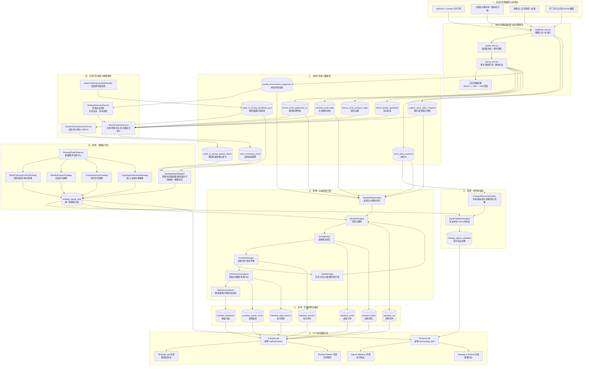
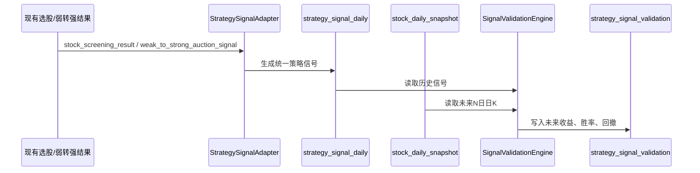
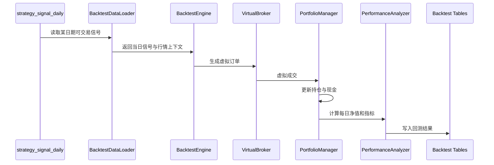

# AI题材选股系统：策略信号验证与日线回测系统架构设计文档

> 项目：`ai_theme_app`  
> 目标：在现有“题材识别 + 主线判断 + 选股器 + 弱转强链路”基础上，新增“策略信号验证 + 日线级回测 + 策略实验室”能力。  
> 文档版本：v0.1  
> 生成时间：2026-05-16  
> 适用阶段：先验证最近半年/一年历史行情中的策略胜率和收益率，再逐步扩展到完整回测与模拟盘。

---

## 目录

1. [建设目标](#1-建设目标)
2. [当前项目基础判断](#2-当前项目基础判断)
3. [总体设计原则](#3-总体设计原则)
4. [整体架构逻辑图](#4-整体架构逻辑图)
5. [核心数据流](#5-核心数据流)
6. [新增系统分层设计](#6-新增系统分层设计)
7. [策略信号层设计](#7-策略信号层设计)
8. [信号验证层设计](#8-信号验证层设计)
9. [日线回测引擎设计](#9-日线回测引擎设计)
10. [模拟账户与模拟炒股扩展](#10-模拟账户与模拟炒股扩展)
11. [数据库表设计](#11-数据库表设计)
12. [后端模块设计](#12-后端模块设计)
13. [BFF API设计](#13-bff-api设计)
14. [前端页面设计](#14-前端页面设计)
15. [第一阶段：最近半年/一年策略验证方案](#15-第一阶段最近半年一年策略验证方案)
16. [弱转强策略验证MVP](#16-弱转强策略验证mvp)
17. [主线龙头策略验证方案](#17-主线龙头策略验证方案)
18. [综合评分策略验证方案](#18-综合评分策略验证方案)
19. [回测成交假设与A股规则](#19-回测成交假设与a股规则)
20. [开源框架选型建议](#20-开源框架选型建议)
21. [开发阶段规划与工作量评估](#21-开发阶段规划与工作量评估)
22. [主要难点与风险控制](#22-主要难点与风险控制)
23. [验收标准](#23-验收标准)
24. [推荐实施顺序](#24-推荐实施顺序)
25. [附录：核心SQL草案](#25-附录核心sql草案)

---

# 1. 建设目标

当前项目已经具备：

- 新闻、电报、题材数据采集能力；
- 新闻结构化与事件理解能力；
- 事件到题材匹配能力；
- 题材主线状态判断能力；
- 题材周期判断能力；
- 龙头候选识别能力；
- 弱转强候选池与盘前竞价确认链路；
- 基础选股器与前端展示能力。

下一阶段要解决的问题不是“能不能选出股票”，而是：

> **选出来的股票在历史行情中是否真的有统计优势？**

具体目标：

```text
最近半年 / 一年内：
1. 策略一共发出多少次信号？
2. 信号后 1 / 2 / 3 / 5 日胜率是多少？
3. 平均收益率是多少？
4. 最大回撤是多少？
5. A/B/C/X 不同信号等级是否有显著差异？
6. 哪些题材、哪些市场状态、哪些周期阶段下策略更有效？
7. 策略在什么情况下失效？
```

因此，本设计文档建议先建设：

```text
历史策略信号验证系统
        ↓
日线级虚拟回测系统
        ↓
策略实验室与策略对比系统
        ↓
本地模拟账户 / Paper Trading
```

---

# 2. 当前项目基础判断

根据已阅读的项目代码和架构讨论，当前项目已经有较好的上游基础。

## 2.1 已有选股策略模型

当前项目中已经存在：

```text
stock_service/stock_screener_models.py
```

其中已经定义了：

```text
ScreeningStrategy
DimensionScores
ScreeningResult
ScreeningResultDetail
LlmReviewResult
ScreeningExecution
DEFAULT_STRATEGIES
```

默认策略已经包括：

```text
default_composite      综合选股策略
mainline_focus         主线题材策略
cycle_timing           周期择时策略
leader_following       龙头跟随策略
weak_to_strong         弱转强策略
```

这说明项目不是从零开始做策略系统，而是已经有策略定义、策略执行和结果保存的基础。

## 2.2 已有选股服务

当前项目中已有：

```text
stock_service/services/stock_screener_service.py
```

其核心能力包括：

```text
execute_screening
execute_screening_with_meta
_get_stocks_to_screen
_score_stock
_score_mainline_dimension
_score_cycle_dimension
_score_leader_dimension
_score_technical_dimension
```

现有选股器已经采用四维评分：

```text
主线维度 mainline
周期维度 cycle
龙头维度 leader
技术维度 technical
```

并通过权重计算综合分。

## 2.3 已有市场状态决策层

当前项目中已有：

```text
stock_service/services/strategy_decision_service.py
```

其核心原则是：

```text
先有主线，再有选股
```

市场状态分为：

```text
offensive  进攻
defensive  防守
cautious   谨慎
standby    观望/暂停
```

这是非常重要的策略风控基础。

## 2.4 已有弱转强链路

当前项目已经有：

```text
WeakToStrongCandidateBuilder
WeakToStrongAuctionService
weak_to_strong_candidate_pool
weak_to_strong_auction_signal
```

弱转强链路已经具备“两阶段”特征：

```text
T日盘后：构建弱转强候选池
T+1盘前：竞价确认 A/B/C/X 信号
```

这非常适合作为第一阶段回测验证的 MVP 策略。

## 2.5 当前缺口

当前系统主要缺少：

```text
1. 统一策略信号表
2. 信号未来收益验证
3. 虚拟订单、虚拟成交、虚拟持仓
4. 净值曲线
5. 策略胜率、收益率、最大回撤统计
6. 题材归因、市场状态归因
7. 策略版本管理
8. 策略实验室前端页面
```

---

# 3. 总体设计原则

## 3.1 不推翻现有系统

新增回测系统不应该重写题材识别、主线判断、弱转强候选逻辑，而应该接在现有系统后面。

推荐链路：

```text
现有题材系统
    ↓
现有选股器 / 弱转强链路
    ↓
新增 strategy_signal_daily
    ↓
新增 strategy_signal_validation
    ↓
新增 backtest_engine
    ↓
新增 Strategy Lab 前端
```

## 3.2 先做信号验证，再做完整回测

不要一开始就做复杂资金账户和模拟交易。

先回答：

```text
这个策略信号有没有预测价值？
```

再回答：

```text
如果真实按这个策略交易，账户收益曲线如何？
```

## 3.3 明确信号时间，防止未来函数

所有策略信号必须记录：

```text
signal_date       信号归属日期
signal_session    post_market / pre_market / intraday
available_at      信号可见时间
tradable_at       最早可交易时间
```

避免使用未来数据。

## 3.4 第一阶段只使用日K

当前只有日K数据，也可以做有效验证。

第一阶段只做：

```text
T日信号
T+1开盘价 / 收盘价作为买入参考
未来1/2/3/5日收益统计
```

不验证盘中分时买点。

## 3.5 策略版本必须固化

每一次策略验证和回测必须记录：

```text
strategy_id
strategy_version
rule_version
config_json
```

否则策略改动后无法比较历史结果。

---

# 4. 整体架构逻辑图



---

# 5. 核心数据流

## 5.1 信号验证数据流



## 5.2 日线回测数据流



---

# 6. 新增系统分层设计

## 6.1 策略信号层

职责：

```text
1. 将现有各种选股结果统一成策略信号
2. 支持多策略、多版本
3. 记录信号可见时间和可交易时间
4. 保存信号证据与来源追踪
```

输入：

```text
stock_screening_result
weak_to_strong_candidate_pool
weak_to_strong_auction_signal
theme_leader_candidate
mainline_state_daily
```

输出：

```text
strategy_signal_daily
```

## 6.2 信号验证层

职责：

```text
1. 对历史信号计算未来1/2/3/5日收益
2. 计算最大涨幅、最大回撤、涨停概率
3. 按信号等级、策略、题材、市场状态分组统计
```

输入：

```text
strategy_signal_daily
stock_daily_snapshot
market_environment_judgement
theme_cycle_judgement_v2
```

输出：

```text
strategy_signal_validation
validation_summary
```

## 6.3 回测引擎层

职责：

```text
1. 用历史信号生成虚拟订单
2. 用日K行情模拟成交
3. 管理虚拟持仓和现金
4. 计算净值曲线、收益率、最大回撤、胜率
5. 进行策略、题材、市场状态归因
```

输出：

```text
backtest_run
backtest_order
backtest_trade
backtest_position
backtest_equity_curve
backtest_daily_metrics
backtest_attribution
```

## 6.4 策略实验室层

职责：

```text
1. 前端选择策略
2. 选择时间范围
3. 选择验证模式或回测模式
4. 查看信号表现
5. 查看回测资金曲线
6. 对比不同策略或参数
```

---

# 7. 策略信号层设计

## 7.1 为什么需要策略信号层

当前系统有多种“信号来源”：

```text
1. stock_screening_result
2. weak_to_strong_candidate_pool
3. weak_to_strong_auction_signal
4. theme_leader_candidate
5. mainline_state_daily
```

如果回测引擎直接读取这些表，会造成耦合严重、逻辑混乱。

因此需要统一成：

```text
strategy_signal_daily
```

统一之后，后续的信号验证、回测、前端展示都只依赖这张表。

## 7.2 信号类型

建议支持：

```text
buy       买入信号
sell      卖出信号
watch     观察信号
avoid     回避信号
```

第一阶段重点使用：

```text
buy
watch
avoid
```

## 7.3 信号时段

```text
post_market   盘后信号
pre_market    盘前信号
intraday      盘中信号，第一阶段暂不实现
```

当前只有日K数据，因此第一阶段主要支持：

```text
post_market
pre_market
```

## 7.4 策略信号生成来源

### 7.4.1 弱转强竞价策略

来源：

```text
weak_to_strong_candidate_pool
weak_to_strong_auction_signal
```

规则：

```text
signal_level in ('A', 'B') -> buy
signal_level = 'C'         -> watch
signal_level = 'X'         -> avoid
```

### 7.4.2 主线龙头策略

来源：

```text
mainline_state_daily
theme_leader_candidate
theme_cycle_judgement_v2
```

规则：

```text
mainline_state_daily.is_mainline = true
theme_leader_candidate.candidate_rank <= 3
theme_cycle_state not in ('fade_confirmed')
```

### 7.4.3 综合评分策略

来源：

```text
stock_screening_result
```

规则：

```text
composite_score >= 80 -> A
70 <= composite_score < 80 -> B
60 <= composite_score < 70 -> C
```

---

# 8. 信号验证层设计

## 8.1 目标

信号验证层回答：

```text
策略信号发出以后，未来N日股票表现如何？
```

不是模拟账户，而是单条信号级别的统计。

## 8.2 核心指标

每条信号计算：

```text
next_1d_return
next_2d_return
next_3d_return
next_5d_return

max_return_3d
max_return_5d
max_drawdown_3d
max_drawdown_5d

hit_limit_up_3d
hit_limit_up_5d

is_win_1d
is_win_3d
is_win_5d
```

## 8.3 买入参考价

可配置：

```text
next_open      T+1开盘价
next_close     T+1收盘价
signal_close   T日收盘价，仅用于理论验证，不用于实盘假设
```

推荐默认：

```text
T+1开盘价
```

并可加滑点：

```text
buy_price = next_open * (1 + slippage_bps / 10000)
```

## 8.4 分组统计

至少支持：

```text
按策略分组
按信号等级分组
按题材分组
按市场状态分组
按题材周期阶段分组
按分数区间分组
```

示例输出：

```text
弱转强策略，最近一年：
A信号：
  数量：35
  3日胜率：71.4%
  3日平均收益：6.8%

B信号：
  数量：52
  3日胜率：59.6%
  3日平均收益：3.1%

C信号：
  数量：41
  3日胜率：43.9%
  3日平均收益：-0.5%
```

---

# 9. 日线回测引擎设计

## 9.1 目标

回测引擎回答：

```text
如果我按这个策略交易，历史账户收益曲线如何？
```

## 9.2 第一版回测假设

由于当前只有日K数据，第一版使用日线级模拟：

```text
T日信号
T+1开盘价买入
持有N天
按止盈/止损/持仓天数卖出
```

## 9.3 回测主循环

```python
for trade_date in trading_calendar:
    context = data_loader.load_context(trade_date)

    # 1. 处理已有持仓的卖出
    sell_orders = exit_rule_engine.generate_exit_orders(context, portfolio)

    # 2. 读取当天可交易信号
    signals = signal_selector.get_tradable_signals(trade_date)

    # 3. 生成买入订单
    buy_orders = order_generator.generate_buy_orders(signals, portfolio)

    # 4. 虚拟撮合
    trades = broker.match_orders(sell_orders + buy_orders, context.market_data)

    # 5. 更新组合
    portfolio.update(trades, context.market_data)

    # 6. 计算每日净值
    performance.update(portfolio, trade_date)
```

## 9.4 核心模块

### BacktestEngine

职责：

```text
回测主控制器
按交易日循环
调度数据加载、信号选择、撮合、持仓更新、绩效分析
```

### BacktestDataLoader

职责：

```text
读取日K
读取策略信号
读取市场环境
读取题材状态
读取历史持仓上下文
```

### VirtualBroker

职责：

```text
模拟订单成交
处理涨停买不到
处理跌停卖不出
处理停牌无法交易
计算手续费和滑点
```

### PortfolioManager

职责：

```text
维护现金
维护持仓
计算市值
计算浮盈浮亏
记录持仓天数
```

### RiskManager

职责：

```text
单票最大仓位
单题材最大仓位
最大持仓数量
市场状态下仓位折扣
止盈止损
```

### PerformanceAnalyzer

职责：

```text
累计收益
年化收益
最大回撤
胜率
盈亏比
平均持仓天数
换手率
连续亏损次数
```

### AttributionAnalyzer

职责：

```text
按策略归因
按题材归因
按市场状态归因
按周期阶段归因
按信号等级归因
```

---

# 10. 模拟账户与模拟炒股扩展

## 10.1 本地模拟账户

建议优先做本地模拟账户，而不是一开始接外部模拟炒股平台。

新增：

```text
paper_account
paper_order
paper_trade
paper_position
paper_equity_curve
```

作用：

```text
每天真实运行策略
但不真实下单
只在系统内部模拟账户变化
```

## 10.2 外部模拟炒股平台

后续可以考虑：

```text
同花顺模拟盘
雪球组合
QMT模拟盘
Ptrade模拟盘
```

但第一阶段不建议依赖外部平台，因为：

```text
1. 很多平台没有稳定公开API
2. 手工录入效率低
3. 平台撮合规则和你的回测规则不一致
```

推荐路径：

```text
历史信号验证
    ↓
日线回测
    ↓
本地模拟账户
    ↓
外部模拟盘 / 实盘接口
```

---

# 11. 数据库表设计

## 11.1 策略定义表

```sql
CREATE TABLE IF NOT EXISTS strategy_definition (
    strategy_id TEXT NOT NULL,
    strategy_version TEXT NOT NULL,
    strategy_name TEXT NOT NULL,
    strategy_type TEXT NOT NULL,
    signal_session TEXT NOT NULL,
    config_json JSONB NOT NULL DEFAULT '{}'::jsonb,
    entry_rule_json JSONB NOT NULL DEFAULT '{}'::jsonb,
    exit_rule_json JSONB NOT NULL DEFAULT '{}'::jsonb,
    risk_rule_json JSONB NOT NULL DEFAULT '{}'::jsonb,
    is_active BOOLEAN DEFAULT TRUE,
    created_at TIMESTAMP DEFAULT now(),
    updated_at TIMESTAMP DEFAULT now(),
    PRIMARY KEY(strategy_id, strategy_version)
);
```

## 11.2 策略信号表

```sql
CREATE TABLE IF NOT EXISTS strategy_signal_daily (
    signal_id TEXT PRIMARY KEY,
    strategy_id TEXT NOT NULL,
    strategy_version TEXT NOT NULL,
    trade_date DATE NOT NULL,
    signal_session TEXT NOT NULL,
    available_at TIMESTAMP,
    tradable_at TIMESTAMP,
    stock_id TEXT NOT NULL,
    stock_name TEXT,
    subject_key TEXT,
    theme_name TEXT,
    direction TEXT NOT NULL,
    signal_level TEXT,
    score NUMERIC(8,2),
    confidence NUMERIC(8,4),
    entry_plan JSONB DEFAULT '{}'::jsonb,
    exit_plan JSONB DEFAULT '{}'::jsonb,
    risk_plan JSONB DEFAULT '{}'::jsonb,
    evidence_json JSONB DEFAULT '{}'::jsonb,
    source_table TEXT,
    source_id TEXT,
    source_trace JSONB DEFAULT '{}'::jsonb,
    created_at TIMESTAMP DEFAULT now()
);

CREATE INDEX IF NOT EXISTS idx_strategy_signal_daily_strategy_date
ON strategy_signal_daily(strategy_id, trade_date);

CREATE INDEX IF NOT EXISTS idx_strategy_signal_daily_stock_date
ON strategy_signal_daily(stock_id, trade_date);

CREATE INDEX IF NOT EXISTS idx_strategy_signal_daily_level
ON strategy_signal_daily(signal_level);
```

## 11.3 策略信号验证表

```sql
CREATE TABLE IF NOT EXISTS strategy_signal_validation (
    signal_id TEXT PRIMARY KEY,
    strategy_id TEXT NOT NULL,
    strategy_version TEXT NOT NULL,
    trade_date DATE NOT NULL,
    stock_id TEXT NOT NULL,
    signal_level TEXT,
    score NUMERIC(8,2),

    buy_ref_date DATE,
    buy_ref_price NUMERIC(18,4),
    buy_price_mode TEXT,

    next_1d_return NUMERIC(12,6),
    next_2d_return NUMERIC(12,6),
    next_3d_return NUMERIC(12,6),
    next_5d_return NUMERIC(12,6),

    max_return_3d NUMERIC(12,6),
    max_return_5d NUMERIC(12,6),
    max_drawdown_3d NUMERIC(12,6),
    max_drawdown_5d NUMERIC(12,6),

    hit_limit_up_1d BOOLEAN,
    hit_limit_up_3d BOOLEAN,
    hit_limit_up_5d BOOLEAN,

    is_win_1d BOOLEAN,
    is_win_3d BOOLEAN,
    is_win_5d BOOLEAN,

    market_mode TEXT,
    market_health_score NUMERIC(8,2),
    cycle_state TEXT,
    subject_key TEXT,
    theme_name TEXT,

    validation_status TEXT DEFAULT 'completed',
    error_message TEXT,

    validated_at TIMESTAMP DEFAULT now()
);

CREATE INDEX IF NOT EXISTS idx_strategy_signal_validation_strategy_date
ON strategy_signal_validation(strategy_id, trade_date);

CREATE INDEX IF NOT EXISTS idx_strategy_signal_validation_level
ON strategy_signal_validation(signal_level);
```

## 11.4 回测任务表

```sql
CREATE TABLE IF NOT EXISTS backtest_run (
    run_id TEXT PRIMARY KEY,
    strategy_id TEXT NOT NULL,
    strategy_version TEXT NOT NULL,
    run_name TEXT,
    start_date DATE NOT NULL,
    end_date DATE NOT NULL,
    initial_cash NUMERIC(18,2) NOT NULL,
    benchmark TEXT,
    fee_bps NUMERIC(8,4) DEFAULT 3.0,
    slippage_bps NUMERIC(8,4) DEFAULT 5.0,
    buy_price_mode TEXT DEFAULT 'next_open',
    sell_price_mode TEXT DEFAULT 'close',
    config_json JSONB DEFAULT '{}'::jsonb,
    status TEXT DEFAULT 'pending',
    metrics_json JSONB DEFAULT '{}'::jsonb,
    error_message TEXT,
    created_at TIMESTAMP DEFAULT now(),
    completed_at TIMESTAMP
);
```

## 11.5 虚拟订单表

```sql
CREATE TABLE IF NOT EXISTS backtest_order (
    order_id TEXT PRIMARY KEY,
    run_id TEXT NOT NULL,
    trade_date DATE NOT NULL,
    stock_id TEXT NOT NULL,
    stock_name TEXT,
    side TEXT NOT NULL,
    target_weight NUMERIC(8,4),
    target_amount NUMERIC(18,2),
    order_qty NUMERIC(18,2),
    order_price NUMERIC(18,4),
    order_reason TEXT,
    signal_id TEXT,
    status TEXT,
    reject_reason TEXT,
    created_at TIMESTAMP DEFAULT now()
);

CREATE INDEX IF NOT EXISTS idx_backtest_order_run_date
ON backtest_order(run_id, trade_date);
```

## 11.6 虚拟成交表

```sql
CREATE TABLE IF NOT EXISTS backtest_trade (
    trade_id TEXT PRIMARY KEY,
    run_id TEXT NOT NULL,
    trade_date DATE NOT NULL,
    stock_id TEXT NOT NULL,
    stock_name TEXT,
    side TEXT NOT NULL,
    fill_price NUMERIC(18,4),
    fill_qty NUMERIC(18,2),
    fill_amount NUMERIC(18,2),
    fee NUMERIC(18,2),
    slippage_cost NUMERIC(18,2),
    order_id TEXT,
    signal_id TEXT,
    created_at TIMESTAMP DEFAULT now()
);

CREATE INDEX IF NOT EXISTS idx_backtest_trade_run_date
ON backtest_trade(run_id, trade_date);
```

## 11.7 每日持仓表

```sql
CREATE TABLE IF NOT EXISTS backtest_position (
    run_id TEXT NOT NULL,
    trade_date DATE NOT NULL,
    stock_id TEXT NOT NULL,
    stock_name TEXT,
    qty NUMERIC(18,2),
    cost_price NUMERIC(18,4),
    close_price NUMERIC(18,4),
    market_value NUMERIC(18,2),
    unrealized_pnl NUMERIC(18,2),
    unrealized_return NUMERIC(12,6),
    holding_days INTEGER,
    subject_key TEXT,
    theme_name TEXT,
    PRIMARY KEY(run_id, trade_date, stock_id)
);
```

## 11.8 净值曲线表

```sql
CREATE TABLE IF NOT EXISTS backtest_equity_curve (
    run_id TEXT NOT NULL,
    trade_date DATE NOT NULL,
    cash NUMERIC(18,2),
    position_value NUMERIC(18,2),
    total_equity NUMERIC(18,2),
    daily_return NUMERIC(12,6),
    cumulative_return NUMERIC(12,6),
    drawdown NUMERIC(12,6),
    position_count INTEGER,
    exposure NUMERIC(8,4),
    PRIMARY KEY(run_id, trade_date)
);
```

## 11.9 每日指标表

```sql
CREATE TABLE IF NOT EXISTS backtest_daily_metrics (
    run_id TEXT NOT NULL,
    trade_date DATE NOT NULL,
    daily_return NUMERIC(12,6),
    cumulative_return NUMERIC(12,6),
    drawdown NUMERIC(12,6),
    turnover NUMERIC(12,6),
    win_trade_count INTEGER,
    loss_trade_count INTEGER,
    position_count INTEGER,
    cash_ratio NUMERIC(8,4),
    PRIMARY KEY(run_id, trade_date)
);
```

## 11.10 归因表

```sql
CREATE TABLE IF NOT EXISTS backtest_attribution (
    attribution_id TEXT PRIMARY KEY,
    run_id TEXT NOT NULL,
    dimension TEXT NOT NULL,
    dimension_value TEXT NOT NULL,
    trade_count INTEGER,
    win_rate NUMERIC(8,4),
    avg_return NUMERIC(12,6),
    total_pnl NUMERIC(18,2),
    contribution_ratio NUMERIC(12,6),
    max_drawdown NUMERIC(12,6),
    created_at TIMESTAMP DEFAULT now()
);
```

---

# 12. 后端模块设计

建议新增模块：

```text
stock_service/
  services/
    strategy_signal/
      __init__.py
      signal_models.py
      signal_repository.py
      signal_adapter.py
      signal_validation_service.py
      forward_return_calculator.py

    strategies/
      __init__.py
      base_strategy.py
      weak_to_strong_auction_strategy.py
      mainline_leader_strategy.py
      composite_score_strategy.py
      gap_support_reversal_strategy.py

    backtest/
      __init__.py
      backtest_models.py
      backtest_repository.py
      backtest_engine.py
      data_loader.py
      virtual_broker.py
      portfolio_manager.py
      risk_manager.py
      performance_analyzer.py
      attribution_analyzer.py
```

## 12.1 signal_models.py

定义：

```python
@dataclass
class StrategySignal:
    signal_id: str
    strategy_id: str
    strategy_version: str
    trade_date: date
    signal_session: str
    stock_id: str
    stock_name: str
    direction: str
    signal_level: str
    score: float
    confidence: float
    subject_key: Optional[str] = None
    theme_name: Optional[str] = None
    entry_plan: Dict[str, Any] = field(default_factory=dict)
    exit_plan: Dict[str, Any] = field(default_factory=dict)
    risk_plan: Dict[str, Any] = field(default_factory=dict)
    evidence_json: Dict[str, Any] = field(default_factory=dict)
```

## 12.2 signal_adapter.py

职责：

```text
把现有表转换成统一信号。
```

核心方法：

```python
async def build_from_weak_to_strong(
    start_date: date,
    end_date: date
) -> list[StrategySignal]:
    ...

async def build_from_stock_screening_result(
    strategy_id: str,
    start_date: date,
    end_date: date
) -> list[StrategySignal]:
    ...
```

## 12.3 signal_validation_service.py

核心方法：

```python
async def validate_signals(
    strategy_id: str,
    start_date: date,
    end_date: date,
    horizons: list[int] = [1, 2, 3, 5],
    buy_price_mode: str = "next_open",
) -> ValidationSummary:
    ...
```

## 12.4 forward_return_calculator.py

核心方法：

```python
def calculate_forward_returns(
    signal: StrategySignal,
    kline_rows: list[DailyBar],
    buy_price_mode: str,
) -> SignalValidationResult:
    ...
```

## 12.5 backtest_engine.py

核心方法：

```python
async def run_backtest(config: BacktestConfig) -> BacktestResult:
    ...
```

## 12.6 virtual_broker.py

核心逻辑：

```text
1. 买入日开盘涨停，视为买不到
2. 卖出日一字跌停，视为卖不出
3. 日K缺失，视为停牌
4. 成交价加入滑点
5. 成交金额扣除手续费
```

---

# 13. BFF API设计

## 13.1 策略信号接口

```http
GET /api/strategy-lab/signals
```

参数：

```text
strategy_id
start_date
end_date
signal_level
stock_id
subject_key
limit
```

## 13.2 生成策略信号

```http
POST /api/strategy-lab/signals/build
```

请求：

```json
{
  "strategy_id": "weak_to_strong_auction",
  "strategy_version": "v1",
  "start_date": "2025-11-01",
  "end_date": "2026-05-16",
  "source": "weak_to_strong"
}
```

## 13.3 执行信号验证

```http
POST /api/strategy-lab/validate
```

请求：

```json
{
  "strategy_id": "weak_to_strong_auction",
  "strategy_version": "v1",
  "start_date": "2025-11-01",
  "end_date": "2026-05-16",
  "horizons": [1, 2, 3, 5],
  "buy_price_mode": "next_open"
}
```

## 13.4 获取验证汇总

```http
GET /api/strategy-lab/validation-summary
```

参数：

```text
strategy_id
strategy_version
start_date
end_date
group_by=signal_level | market_mode | cycle_state | theme_name
```

## 13.5 启动回测

```http
POST /api/backtests/run
```

请求：

```json
{
  "strategy_id": "weak_to_strong_auction",
  "strategy_version": "v1",
  "start_date": "2025-11-01",
  "end_date": "2026-05-16",
  "initial_cash": 1000000,
  "buy_price_mode": "next_open",
  "sell_price_mode": "close",
  "fee_bps": 3,
  "slippage_bps": 5,
  "max_position_count": 5,
  "max_single_position_pct": 0.2,
  "take_profit_pct": 0.1,
  "stop_loss_pct": 0.05,
  "max_holding_days": 3
}
```

## 13.6 获取回测报告

```http
GET /api/backtests/{run_id}
GET /api/backtests/{run_id}/equity-curve
GET /api/backtests/{run_id}/trades
GET /api/backtests/{run_id}/positions
GET /api/backtests/{run_id}/attribution
```

## 13.7 策略对比

```http
GET /api/backtests/compare
```

参数：

```text
run_ids=run_xxx,run_yyy,run_zzz
```

---

# 14. 前端页面设计

## 14.1 Strategy Lab 策略实验室

功能：

```text
1. 选择策略
2. 选择策略版本
3. 选择日期范围：最近半年 / 最近一年 / 自定义
4. 选择验证模式：信号验证 / 回测
5. 设置参数
6. 启动任务
```

## 14.2 Signal Validation 信号验证页

展示：

```text
1. 总信号数
2. 1日胜率
3. 3日胜率
4. 5日胜率
5. 1/3/5日平均收益
6. 最大回撤
7. 涨停概率
8. A/B/C/X 分组表现
9. 市场状态分组表现
10. 题材周期分组表现
11. 信号明细列表
```

## 14.3 Backtest Report 回测报告页

展示：

```text
1. 净值曲线
2. 最大回撤曲线
3. 交易明细
4. 当前/历史持仓
5. 策略绩效指标
6. 题材归因
7. 市场状态归因
8. 信号等级归因
```

## 14.4 Strategy Compare 策略对比页

展示：

```text
1. 多策略收益曲线对比
2. 胜率对比
3. 最大回撤对比
4. 盈亏比对比
5. 持仓天数对比
6. 策略适用市场状态对比
```

---

# 15. 第一阶段：最近半年/一年策略验证方案

## 15.1 第一阶段目标

不做完整资金账户，只做：

```text
历史策略信号
    ↓
未来N日收益验证
    ↓
胜率 / 平均收益 / 最大回撤 / 涨停概率
```

## 15.2 时间范围

支持：

```text
最近3个月
最近6个月
最近1年
自定义区间
```

## 15.3 验证对象

优先验证：

```text
1. 弱转强竞价确认策略
2. 主线龙头策略
3. 综合评分策略
```

## 15.4 输出指标

总体指标：

```text
信号数量
1日胜率
2日胜率
3日胜率
5日胜率
1日平均收益
3日平均收益
5日平均收益
3日最大回撤均值
5日最大回撤均值
3日涨停概率
5日涨停概率
```

分组指标：

```text
按信号等级
按策略
按题材
按市场状态
按周期阶段
按分数区间
```

---

# 16. 弱转强策略验证MVP

## 16.1 输入数据

```text
weak_to_strong_candidate_pool
weak_to_strong_auction_signal
stock_daily_snapshot
market_environment_judgement
theme_cycle_judgement_v2
```

## 16.2 信号生成规则

```text
A信号 -> buy
B信号 -> buy/watch
C信号 -> watch
X信号 -> avoid
```

第一版建议：

```text
只统计 A/B/C/X 的未来收益，不急着剔除。
```

这样可以验证等级是否有效。

## 16.3 买入参考价

默认：

```text
确认日开盘价
```

例如：

```text
T日盘后候选
T+1盘前确认
T+1开盘价作为买入参考
```

## 16.4 输出报告示例

```text
策略：weak_to_strong_auction_v1
区间：2025-11-01 至 2026-05-16

总信号数：128
1日胜率：54.7%
3日胜率：61.3%
5日胜率：58.2%
3日平均收益：3.42%
5日平均收益：4.18%
3日最大回撤均值：-4.21%
5日涨停概率：18.7%

按等级：
A信号：
  数量：35
  3日胜率：71.4%
  3日平均收益：6.8%

B信号：
  数量：52
  3日胜率：59.6%
  3日平均收益：3.1%

C信号：
  数量：41
  3日胜率：43.9%
  3日平均收益：-0.5%
```

---

# 17. 主线龙头策略验证方案

## 17.1 输入数据

```text
mainline_state_daily
theme_cycle_judgement_v2
theme_leader_candidate
subject_stock_daily_snapshot
stock_daily_snapshot
```

## 17.2 信号规则

```text
mainline_state_daily.is_mainline = true
theme_cycle_state not in ('fade_confirmed')
theme_leader_candidate.candidate_rank <= 3
```

## 17.3 验证问题

```text
1. 主线题材中的龙头是否显著跑赢普通成分股？
2. candidate_rank=1 是否显著强于 rank=2/3？
3. 主线强度 >= 75 的题材是否胜率更高？
4. 周期阶段为发酵/修复时是否优于高潮/退潮？
```

---

# 18. 综合评分策略验证方案

## 18.1 输入数据

```text
stock_screening_result
stock_daily_snapshot
```

## 18.2 分数分层

```text
A: composite_score >= 80
B: 70 <= composite_score < 80
C: 60 <= composite_score < 70
D: composite_score < 60
```

## 18.3 验证问题

```text
1. 综合评分是否与未来收益正相关？
2. 80分以上是否明显优于70分以上？
3. 主线维度高但技术维度低的股票表现如何？
4. 龙头维度高的股票是否更强？
```

---

# 19. 回测成交假设与A股规则

## 19.1 日K回测局限

只有日K时，无法精确判断：

```text
1. 盘中是否真的能买到
2. 止盈和止损谁先触发
3. 分时承接强弱
4. 竞价撤单行为
5. 涨停瞬间是否成交
```

因此第一版要明确使用日线假设。

## 19.2 建议默认成交假设

```text
买入：T+1开盘价 + 0.3%滑点
卖出：触发日收盘价 - 0.3%滑点
手续费：万3
```

## 19.3 涨跌停处理

建议第一版保守处理：

```text
如果买入日 open = high = low = close 且为涨停，视为买不到
如果卖出日 open = high = low = close 且为跌停，视为卖不出
如果日K缺失，视为停牌
ST股票第一版剔除
688科创板第一版可剔除
```

## 19.4 T+1规则

A股 T+1 规则：

```text
买入当天不能卖出
最早 T+1 卖出
```

回测引擎必须遵守。

---

# 20. 开源框架选型建议

## 20.1 不建议第一阶段重度依赖外部框架

原因：

```text
你的策略不是普通均线策略，而是题材、主线、龙头、弱转强、竞价确认策略。
这些核心数据已经在你自己的PostgreSQL里。
```

直接套 Backtrader / Qlib 可能会绕远。

## 20.2 推荐路径

```text
第一阶段：自研轻量信号验证和日线回测引擎
第二阶段：接 vectorbt 做参数扫描
第三阶段：如需机器学习/因子研究，再考虑 Qlib
```

## 20.3 框架对比

| 框架 | 适合程度 | 用途 |
|---|---|---|
| 自研轻量引擎 | 第一优先 | 最贴合当前项目数据结构 |
| vectorbt | 第二阶段 | 参数扫描、批量验证 |
| Backtrader | 可选 | 传统策略回测 |
| Qlib | 后期 | 因子研究、机器学习选股 |
| Zipline Reloaded | 不优先 | A股适配成本偏高 |

---

# 21. 开发阶段规划与工作量评估

## 21.1 V0.1 信号验证版

内容：

```text
1. strategy_signal_daily 表
2. strategy_signal_validation 表
3. StrategySignalAdapter
4. ForwardReturnCalculator
5. SignalValidationService
6. BFF 验证接口
7. 简单统计输出
```

预计：

```text
3-7 个工作日
```

## 21.2 V0.2 简单可视化版

内容：

```text
1. 前端 Strategy Lab 初版
2. 选择策略与日期范围
3. 展示胜率、平均收益、最大回撤
4. 展示 A/B/C 分组统计
5. 展示信号明细
```

预计：

```text
1-2 周
```

## 21.3 V0.3 日线回测版

内容：

```text
1. backtest_run
2. backtest_order
3. backtest_trade
4. backtest_position
5. backtest_equity_curve
6. BacktestEngine
7. VirtualBroker
8. PortfolioManager
9. PerformanceAnalyzer
```

预计：

```text
2-4 周
```

## 21.4 V1.0 策略实验室版

内容：

```text
1. 多策略管理
2. 多策略对比
3. 参数扫描
4. 题材归因
5. 市场状态归因
6. 策略版本管理
7. 回测报告页面
```

预计：

```text
4-8 周
```

## 21.5 产品化版本

内容：

```text
1. 本地模拟账户
2. 每日自动运行
3. 策略日报
4. 策略调参
5. 长期监控
6. 外部模拟盘/交易接口预留
```

预计：

```text
2-3 个月
```

---

# 22. 主要难点与风险控制

## 22.1 防未来函数

必须记录：

```text
signal_session
available_at
tradable_at
```

例如：

```text
T日盘后产生的信号，只能用于T+1交易
T+1竞价确认信号，只能用于T+1开盘后交易
```

## 22.2 数据完整性

需要检查：

```text
1. 日K是否覆盖验证区间
2. 题材快照是否覆盖验证区间
3. 主线状态是否覆盖验证区间
4. 弱转强候选池是否覆盖验证区间
5. 股票代码格式是否统一
```

## 22.3 A股交易规则

必须处理：

```text
T+1
涨停买不到
跌停卖不出
停牌
ST
科创板/创业板涨跌幅限制
新股特殊情况
```

第一版可以简化，但必须明确写入回测假设。

## 22.4 策略版本混乱

每次策略修改必须记录版本，否则无法比较回测结果。

## 22.5 过拟合

如果只根据最近几个月调参，很容易过拟合。

建议：

```text
样本内：最近一年中的前8个月
样本外：最近一年中的后4个月
```

或者：

```text
滚动窗口验证
```

## 22.6 日K无法验证盘中细节

第一版结论只能说明：

```text
日线级信号有效性
```

不能说明：

```text
盘中真实买点完全可实现
```

---

# 23. 验收标准

## 23.1 V0.1 信号验证验收

必须能回答：

```text
1. 最近半年/一年某策略有多少条信号？
2. 每个信号未来1/2/3/5日收益是多少？
3. A/B/C/X 信号胜率分别是多少？
4. A/B/C/X 平均收益分别是多少？
5. 不同市场状态下胜率如何？
6. 不同题材周期阶段下收益如何？
```

## 23.2 V0.3 回测验收

必须能输出：

```text
1. 回测净值曲线
2. 最大回撤
3. 胜率
4. 盈亏比
5. 交易明细
6. 每日持仓
7. 策略归因
8. 题材归因
```

## 23.3 策略有效性验收

弱转强策略至少应该验证：

```text
1. A信号是否显著优于B信号
2. B信号是否显著优于C信号
3. X信号是否明显应该过滤
4. 市场offensive时是否优于cautious时
5. 主线题材中的信号是否优于非主线
```

---

# 24. 推荐实施顺序

## Step 1：数据覆盖检查

先写脚本检查：

```text
最近一年：
1. stock_daily_snapshot 覆盖多少交易日？
2. weak_to_strong_candidate_pool 覆盖多少交易日？
3. weak_to_strong_auction_signal 覆盖多少交易日？
4. mainline_state_daily 覆盖多少交易日？
5. theme_cycle_judgement_v2 覆盖多少交易日？
```

## Step 2：建 strategy_signal_daily

先把弱转强信号转进去。

## Step 3：建 strategy_signal_validation

计算未来1/2/3/5日收益。

## Step 4：输出弱转强验证报告

先验证：

```text
A/B/C/X 分组表现
```

## Step 5：接主线龙头与综合评分策略

增加：

```text
mainline_leader_strategy
composite_score_strategy
```

## Step 6：实现日线回测

只做最简单的：

```text
T+1开盘买入
持有3天
-5%止损
+10%止盈
```

## Step 7：做 Strategy Lab 前端

第一版只展示统计和表格。

## Step 8：做归因与策略对比

完善产品化能力。

---

# 25. 附录：核心SQL草案

## 25.1 最近一年信号数量统计

```sql
SELECT
    strategy_id,
    signal_level,
    COUNT(*) AS signal_count
FROM strategy_signal_daily
WHERE trade_date BETWEEN $1::date AND $2::date
GROUP BY strategy_id, signal_level
ORDER BY strategy_id, signal_level;
```

## 25.2 A/B/C 分组未来收益

```sql
SELECT
    strategy_id,
    signal_level,
    COUNT(*) AS signal_count,
    AVG(next_1d_return) AS avg_1d_return,
    AVG(next_3d_return) AS avg_3d_return,
    AVG(next_5d_return) AS avg_5d_return,
    AVG(CASE WHEN is_win_1d THEN 1 ELSE 0 END) AS win_rate_1d,
    AVG(CASE WHEN is_win_3d THEN 1 ELSE 0 END) AS win_rate_3d,
    AVG(CASE WHEN is_win_5d THEN 1 ELSE 0 END) AS win_rate_5d,
    AVG(max_drawdown_3d) AS avg_max_drawdown_3d
FROM strategy_signal_validation
WHERE trade_date BETWEEN $1::date AND $2::date
GROUP BY strategy_id, signal_level
ORDER BY strategy_id, signal_level;
```

## 25.3 按市场状态统计

```sql
SELECT
    strategy_id,
    market_mode,
    COUNT(*) AS signal_count,
    AVG(next_3d_return) AS avg_3d_return,
    AVG(CASE WHEN is_win_3d THEN 1 ELSE 0 END) AS win_rate_3d,
    AVG(max_drawdown_3d) AS avg_max_drawdown_3d
FROM strategy_signal_validation
WHERE trade_date BETWEEN $1::date AND $2::date
GROUP BY strategy_id, market_mode
ORDER BY strategy_id, market_mode;
```

## 25.4 按题材周期统计

```sql
SELECT
    strategy_id,
    cycle_state,
    COUNT(*) AS signal_count,
    AVG(next_3d_return) AS avg_3d_return,
    AVG(CASE WHEN is_win_3d THEN 1 ELSE 0 END) AS win_rate_3d,
    AVG(max_drawdown_3d) AS avg_max_drawdown_3d
FROM strategy_signal_validation
WHERE trade_date BETWEEN $1::date AND $2::date
GROUP BY strategy_id, cycle_state
ORDER BY strategy_id, cycle_state;
```

---

# 结论

本系统建设的核心不是“重做一个量化平台”，而是在现有 `ai_theme_app` 的题材、主线、龙头、弱转强、选股结果基础上，补齐一套策略验证闭环。

推荐最小闭环：

```text
weak_to_strong_auction_signal
    ↓
strategy_signal_daily
    ↓
strategy_signal_validation
    ↓
A/B/C/X 信号胜率与收益率报告
```

这一步完成后，项目会从：

```text
能选出股票
```

升级为：

```text
能证明策略是否有效
能知道策略什么时候有效
能知道策略什么时候失效
能基于数据持续优化策略
```

最终形成：

```text
AI题材理解
  + 主线识别
  + 龙头判断
  + 策略信号
  + 历史验证
  + 日线回测
  + 策略归因
  + 实盘前决策辅助
```
