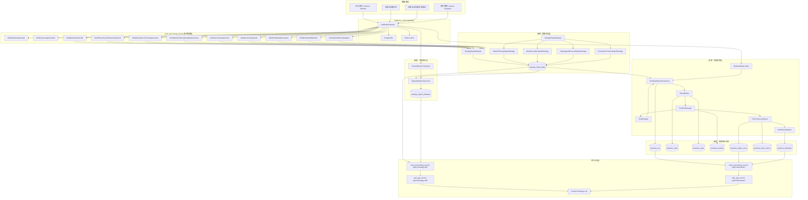
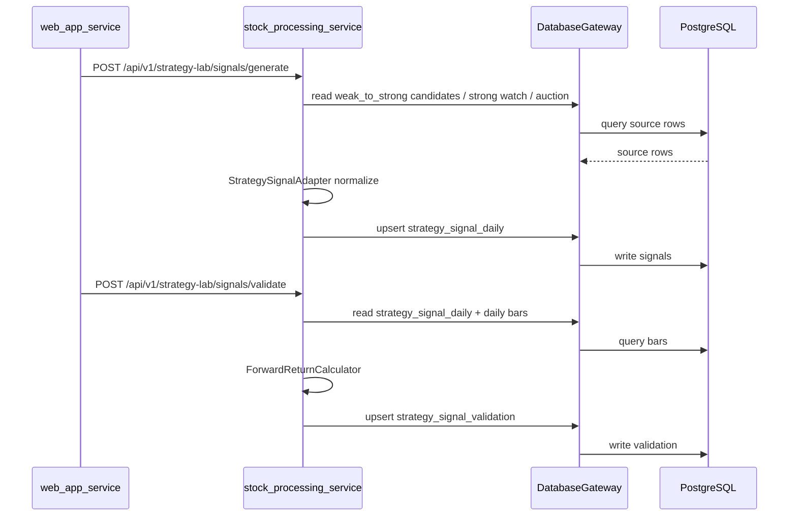

# AI题材选股系统回测架构设计文档（新链 stock_processing_service 版）

> 版本：v2.0  
> 适用架构：`web_app_service + stock_processing_service + database_service.gateway` 新链  
> 废弃约束：`stock_service` 目录下的旧链选股/回测扩展不再作为新功能落点；仅允许作为历史兼容参考或临时适配依赖。

---

## 0. 本次修订背景

上一版文档把“策略信号验证 / 日线回测 / 策略实验室”放在旧链 `stock_service` 之后，这是不符合当前项目演进方向的。

根据代码核查，当前系统已经迁移到新链：

```text
web_app_service
    ↓ HTTP proxy / read client
stock_processing_service.api_app
    ↓ DatabaseGateway / Ports / Application Jobs / Use Cases
database_service.gateway
    ↓
PostgreSQL / Redis / 行情与题材数据表
```

因此，回测系统必须作为 `stock_processing_service` 的新能力建设，而不是继续扩展 `stock_service`。

---

## 1. 新链代码核查结论

### 1.1 新链服务定位

`stock_processing_service` 是新的股票处理服务包，定位为 gateway-first stock processing architecture。

新链核心服务入口是：

```text
stock_processing_service/api_app.py
```

服务由：

```bash
python -m uvicorn stock_processing_service.api_app:app --host 127.0.0.1 --port 8090
```

启动。

### 1.2 `web_app_service` 是新链对外服务入口

`web_app_service` 负责：

```text
1. 对前端暴露 /api/v2/*
2. 管理 stock_processing_service 生命周期
3. 将业务 API 代理到 stock_processing_service /api/v1/*
4. 提供 readyz/healthz 检查
```

因此，未来前端不应直接依赖旧 `frontend_bff` 的选股接口，而应通过：

```text
frontend
  ↓
web_app_service /api/v2/*
  ↓
stock_processing_service /api/v1/*
```

### 1.3 新链已有的核心能力

当前 `stock_processing_service` 已经包含：

```text
BuildDailySnapshotJob
BuildCycleJudgementJob
BuildMainlineStateJob
BuildPostMarketRecapJob
BuildPreMarketBriefJob
BuildThemeCycleEvidenceDailyJob
BuildStrongStockTrackingUseCase
BuildWeakToStrongCandidateUseCase
BuildAuctionSnapshotJob
BuildAuctionSignalJob
BuildAuctionWatchUniverseJob
W2SConfirmService
NewChainIntelFeedAdapter
CollectionJobManager
```

这意味着回测系统应接入这些新链产物，而不是旧链服务类。

---

## 2. 新链下的回测总体架构



---

## 3. 新链服务边界

### 3.1 `stock_processing_service`

这是新增回测能力的唯一后端落点。

职责：

```text
1. 生成策略信号
2. 验证策略信号
3. 执行日线回测
4. 管理回测任务与结果
5. 提供 /api/v1/strategy-lab/* 和 /api/v1/backtests/*
6. 通过 DatabaseGateway 读写数据库
7. 通过 application/use_cases 和 application/jobs 承载业务流程
```

### 3.2 `web_app_service`

职责：

```text
1. 对前端提供 /api/v2/*
2. 转发 Strategy Lab / Backtest API 到 stock_processing_service
3. 管理 stock_processing_service 生命周期
4. 提供 readyz 检查，确保 SPS 可用
```

### 3.3 `frontend_bff`

旧过渡层。后续不再作为新功能主入口。

```text
允许：
- 历史兼容
- 临时代理
- 旧前端尚未迁移时保留

禁止：
- 新增回测核心逻辑
- 新增策略服务
- 新增回测数据库写入逻辑
```

### 3.4 `stock_service`

旧链目录。后续不再扩展。

```text
允许：
- 临时复用个别稳定工具类
- 历史代码参考
- 迁移过程中的兼容 import

禁止：
- 新增策略信号模块
- 新增回测模块
- 新增数据库表管理
- 新增 API 入口
```

---

## 4. 新链推荐目录结构

```text
stock_processing_service/
  domain/
    backtest/
      models.py
      metrics.py
      rules.py
      constants.py

    strategy_signal/
      models.py
      enums.py
      policy.py

  application/
    use_cases/
      generate_strategy_signals.py
      validate_strategy_signals.py
      run_daily_backtest.py
      compare_backtest_runs.py

    jobs/
      build_strategy_signal_daily_job.py
      validate_strategy_signal_daily_job.py
      run_backtest_job.py

    services/
      signal_adapters/
        base.py
        weak_to_strong_signal_adapter.py
        mainline_leader_signal_adapter.py
        stock_screener_signal_adapter.py
        event_driven_signal_adapter.py

      backtest/
        data_loader.py
        virtual_broker.py
        portfolio_manager.py
        risk_manager.py
        performance_analyzer.py
        attribution_analyzer.py

  infrastructure/
    gateway_adapters/
      strategy_signal_gateway.py
      backtest_gateway.py

  api_app.py
```

---

## 5. 新链策略信号层设计

### 5.1 为什么必须新增策略信号层

新链当前已有多类候选和信号来源：

```text
1. weak_to_strong_candidate_pool
2. weak_to_strong auction confirm
3. strong_stock_watch_pool
4. post_market_recap_snapshot
5. pre_market_brief_snapshot
6. theme_cycle_judgement_v2
7. mainline_state_daily
8. theme_cycle_evidence_daily
9. intel_feed
```

如果回测引擎直接读取这些业务表，会导致：

```text
1. 策略入口分散
2. 回测口径不统一
3. 难以做策略版本管理
4. 难以防未来函数
5. 难以做多策略比较
```

因此必须先统一成：

```text
strategy_signal_daily
```

### 5.2 策略信号统一模型

```python
@dataclass
class StrategySignal:
    signal_id: str
    strategy_id: str
    strategy_version: str
    trade_date: date
    signal_session: str          # post_market / pre_market / intraday
    available_at: datetime
    tradable_at: datetime

    stock_id: str
    stock_name: str
    subject_key: str | None
    theme_name: str | None

    direction: str               # buy / watch / avoid / sell
    signal_level: str            # A / B / C / X
    score: float
    confidence: float

    entry_plan: dict
    exit_plan: dict
    risk_plan: dict
    evidence_json: dict

    source_chain: str            # stock_processing_service
    source_table: str
    source_id: str
    source_snapshot_version: str
    rule_version: str
```

---

## 6. 推荐新增数据库表

### 6.1 策略信号表

```sql
CREATE TABLE IF NOT EXISTS strategy_signal_daily (
    signal_id TEXT PRIMARY KEY,
    strategy_id TEXT NOT NULL,
    strategy_version TEXT NOT NULL,
    trade_date DATE NOT NULL,
    signal_session TEXT NOT NULL,
    available_at TIMESTAMP NOT NULL,
    tradable_at TIMESTAMP NOT NULL,

    stock_id TEXT NOT NULL,
    stock_name TEXT,
    subject_key TEXT,
    theme_name TEXT,

    direction TEXT NOT NULL,
    signal_level TEXT,
    score NUMERIC(8,2),
    confidence NUMERIC(8,4),

    entry_plan JSONB DEFAULT '{}'::jsonb,
    exit_plan JSONB DEFAULT '{}'::jsonb,
    risk_plan JSONB DEFAULT '{}'::jsonb,
    evidence_json JSONB DEFAULT '{}'::jsonb,

    source_chain TEXT NOT NULL DEFAULT 'stock_processing_service',
    source_table TEXT,
    source_id TEXT,
    source_snapshot_version TEXT,
    rule_version TEXT,

    created_at TIMESTAMP DEFAULT now(),

    UNIQUE(strategy_id, strategy_version, trade_date, signal_session, stock_id, source_id)
);

CREATE INDEX IF NOT EXISTS idx_strategy_signal_daily_date
ON strategy_signal_daily(trade_date);

CREATE INDEX IF NOT EXISTS idx_strategy_signal_daily_strategy_date
ON strategy_signal_daily(strategy_id, trade_date);

CREATE INDEX IF NOT EXISTS idx_strategy_signal_daily_stock
ON strategy_signal_daily(stock_id);
```

### 6.2 策略信号验证表

```sql
CREATE TABLE IF NOT EXISTS strategy_signal_validation (
    signal_id TEXT PRIMARY KEY REFERENCES strategy_signal_daily(signal_id),
    strategy_id TEXT NOT NULL,
    strategy_version TEXT NOT NULL,
    trade_date DATE NOT NULL,
    stock_id TEXT NOT NULL,
    signal_level TEXT,
    score NUMERIC(8,2),

    buy_ref_date DATE,
    buy_ref_price NUMERIC(18,4),

    next_1d_return NUMERIC(12,6),
    next_2d_return NUMERIC(12,6),
    next_3d_return NUMERIC(12,6),
    next_5d_return NUMERIC(12,6),

    max_return_3d NUMERIC(12,6),
    max_return_5d NUMERIC(12,6),
    max_drawdown_3d NUMERIC(12,6),
    max_drawdown_5d NUMERIC(12,6),

    hit_limit_up_3d BOOLEAN,
    hit_limit_up_5d BOOLEAN,

    is_win_1d BOOLEAN,
    is_win_3d BOOLEAN,
    is_win_5d BOOLEAN,

    validation_status TEXT DEFAULT 'ok',
    validation_error TEXT,

    validated_at TIMESTAMP DEFAULT now()
);
```

### 6.3 回测任务表

```sql
CREATE TABLE IF NOT EXISTS backtest_run (
    run_id TEXT PRIMARY KEY,
    strategy_id TEXT NOT NULL,
    strategy_version TEXT NOT NULL,

    start_date DATE NOT NULL,
    end_date DATE NOT NULL,

    initial_cash NUMERIC(18,2) NOT NULL,
    benchmark TEXT,

    fee_bps NUMERIC(8,4) DEFAULT 2.5,
    slippage_bps NUMERIC(8,4) DEFAULT 30.0,

    buy_price_mode TEXT DEFAULT 'next_open',
    sell_price_mode TEXT DEFAULT 'close',
    max_holding_days INTEGER DEFAULT 3,
    stop_loss_pct NUMERIC(8,4) DEFAULT -0.05,
    take_profit_pct NUMERIC(8,4) DEFAULT 0.10,

    config_json JSONB DEFAULT '{}'::jsonb,
    metrics_json JSONB DEFAULT '{}'::jsonb,

    status TEXT NOT NULL DEFAULT 'pending',
    error_message TEXT,

    created_at TIMESTAMP DEFAULT now(),
    completed_at TIMESTAMP
);
```

### 6.4 虚拟订单、成交、持仓、净值

```sql
CREATE TABLE IF NOT EXISTS backtest_order (
    order_id TEXT PRIMARY KEY,
    run_id TEXT NOT NULL REFERENCES backtest_run(run_id),
    trade_date DATE NOT NULL,
    stock_id TEXT NOT NULL,
    stock_name TEXT,
    side TEXT NOT NULL,
    target_weight NUMERIC(8,4),
    target_amount NUMERIC(18,2),
    signal_id TEXT,
    order_reason TEXT,
    status TEXT,
    reject_reason TEXT,
    created_at TIMESTAMP DEFAULT now()
);

CREATE TABLE IF NOT EXISTS backtest_trade (
    trade_id TEXT PRIMARY KEY,
    run_id TEXT NOT NULL REFERENCES backtest_run(run_id),
    trade_date DATE NOT NULL,
    stock_id TEXT NOT NULL,
    stock_name TEXT,
    side TEXT NOT NULL,
    fill_price NUMERIC(18,4),
    fill_qty NUMERIC(18,2),
    fill_amount NUMERIC(18,2),
    fee NUMERIC(18,2),
    slippage_cost NUMERIC(18,2),
    order_id TEXT,
    signal_id TEXT,
    created_at TIMESTAMP DEFAULT now()
);

CREATE TABLE IF NOT EXISTS backtest_position (
    run_id TEXT NOT NULL REFERENCES backtest_run(run_id),
    trade_date DATE NOT NULL,
    stock_id TEXT NOT NULL,
    stock_name TEXT,
    qty NUMERIC(18,2),
    cost_price NUMERIC(18,4),
    close_price NUMERIC(18,4),
    market_value NUMERIC(18,2),
    unrealized_pnl NUMERIC(18,2),
    holding_days INTEGER,
    subject_key TEXT,
    theme_name TEXT,
    PRIMARY KEY(run_id, trade_date, stock_id)
);

CREATE TABLE IF NOT EXISTS backtest_equity_curve (
    run_id TEXT NOT NULL REFERENCES backtest_run(run_id),
    trade_date DATE NOT NULL,
    cash NUMERIC(18,2),
    position_value NUMERIC(18,2),
    total_equity NUMERIC(18,2),
    daily_return NUMERIC(12,6),
    drawdown NUMERIC(12,6),
    PRIMARY KEY(run_id, trade_date)
);

CREATE TABLE IF NOT EXISTS backtest_attribution (
    run_id TEXT NOT NULL REFERENCES backtest_run(run_id),
    attribution_type TEXT NOT NULL, -- strategy / theme / market_state / signal_level
    attribution_key TEXT NOT NULL,
    trade_count INTEGER,
    win_rate NUMERIC(8,4),
    avg_return NUMERIC(12,6),
    total_pnl NUMERIC(18,2),
    max_drawdown NUMERIC(12,6),
    evidence_json JSONB DEFAULT '{}'::jsonb,
    PRIMARY KEY(run_id, attribution_type, attribution_key)
);
```

---

## 7. 新链 API 设计

### 7.1 SPS API：`stock_processing_service/api_app.py`

新增：

```text
POST /api/v1/strategy-lab/signals/generate
GET  /api/v1/strategy-lab/signals
POST /api/v1/strategy-lab/signals/validate
GET  /api/v1/strategy-lab/validation-summary

POST /api/v1/backtests/run
GET  /api/v1/backtests/{run_id}
GET  /api/v1/backtests/{run_id}/equity-curve
GET  /api/v1/backtests/{run_id}/trades
GET  /api/v1/backtests/{run_id}/positions
GET  /api/v1/backtests/{run_id}/attribution
GET  /api/v1/backtests/compare
```

### 7.2 Web API：`web_app_service/api/routes.py`

新增代理：

```text
POST /api/v2/strategy-lab/signals/generate
GET  /api/v2/strategy-lab/signals
POST /api/v2/strategy-lab/signals/validate
GET  /api/v2/strategy-lab/validation-summary

POST /api/v2/backtests/run
GET  /api/v2/backtests/{run_id}
GET  /api/v2/backtests/{run_id}/equity-curve
GET  /api/v2/backtests/{run_id}/trades
GET  /api/v2/backtests/{run_id}/positions
GET  /api/v2/backtests/{run_id}/attribution
GET  /api/v2/backtests/compare
```

---

## 8. 第一阶段 MVP：最近半年/一年策略验证

### 8.1 目标

先不做完整资金回测，只验证历史信号：

```text
最近半年 / 一年：
1. 策略信号数量
2. 1/2/3/5日胜率
3. 平均收益率
4. 最大回撤
5. 涨停概率
6. A/B/C/X 信号等级区分度
7. 题材周期分组表现
8. 市场状态分组表现
```

### 8.2 第一优先策略：弱转强

输入：

```text
stock_processing_service.application.use_cases.BuildWeakToStrongCandidateUseCase
weak_to_strong_candidate_pool
W2SConfirmService
auction snapshot
stock daily bars
```

信号生成：

```text
T 日 D1 候选：
  BuildWeakToStrongCandidateUseCase 读取 strong watch pool 输入
  产出 weak_to_strong_candidate_pool

T+1 盘前确认：
  W2SConfirmService 读取候选 + 竞价数据
  输出 A/B/C/X 信号
```

验证：

```text
T+1 作为 buy_ref_date
buy_ref_price = T+1 open 或 close
统计未来 1/2/3/5 日收益
```

### 8.3 信号验证流程



---

## 9. 日线回测 MVP

### 9.1 回测假设

当前只有日K数据，因此第一版只做日线回测。

默认假设：

```text
买入：信号 tradable_at 对应交易日的 next_open
卖出：持有 N 天后 close
滑点：默认 0.3%
手续费：默认 0.025%
涨停一字：视为买不到
跌停一字：视为卖不出
停牌/缺行情：跳过或延后
```

### 9.2 回测主循环

```text
for trade_date in trading_calendar:
    1. 读取当天可交易信号
    2. 过滤不可交易信号
    3. 根据风险规则生成目标订单
    4. VirtualBroker 用日K模拟成交
    5. PortfolioManager 更新持仓
    6. ExitRuleEngine 检查止损/止盈/持仓天数
    7. PerformanceAnalyzer 计算净值与回撤
    8. AttributionAnalyzer 记录题材/策略/市场状态归因
```

---

## 10. 新链下的防未来函数规则

必须给每条信号写入：

```text
signal_session
available_at
tradable_at
source_snapshot_version
source_chain
source_table
```

推荐规则：

```text
post_market 信号：
  available_at = T日 15:30 后
  tradable_at = T+1 09:30

pre_market 信号：
  available_at = T日 09:25 后
  tradable_at = T日 09:30

intraday 信号：
  第一版不支持，后续有分钟数据再做

recap / post_market_snapshot：
  只能用于 T+1 交易，不能用于 T 日交易

pre_market_brief：
  若由 T-1 数据生成，可用于 T 日盘前决策
```

---

## 11. 旧链迁移处理

### 11.1 不再扩展的旧链模块

以下不作为新增回测模块落点：

```text
stock_service/services/stock_screener_service.py
stock_service/repositories/stock_screener_repository.py
stock_service/services/weak_to_strong_candidate_builder.py
stock_service/services/weak_to_strong_auction_service.py
frontend_bff/app.py 内旧 stock_screener 入口
```

### 11.2 可参考但不依赖

旧链里的评分规则、字段命名、显示逻辑可以作为参考，但必须迁移到：

```text
stock_processing_service/application/use_cases
stock_processing_service/application/services
stock_processing_service/domain
stock_processing_service/infrastructure/gateway_adapters
```

### 11.3 临时兼容 import

当前 `stock_processing_service/api_app.py` 仍临时 import 了部分 `stock_service` 的 Tushare/Auction 工具类。这些应被标记为“兼容依赖”，不应成为新回测系统的扩展点。

---

## 12. 开发路线

### Phase 0：新链接口与 Gateway 补齐

时间：2-3 个工作日

任务：

```text
1. 新增 strategy_signal / backtest 的 Gateway 方法
2. 新增 DDL migration
3. 在 stock_processing_service 中增加空 API
4. 在 web_app_service 中增加代理 API
```

### Phase 1：弱转强信号验证

时间：4-7 个工作日

任务：

```text
1. WeakToStrongSignalAdapter
2. GenerateStrategySignalsUseCase
3. ValidateStrategySignalsUseCase
4. ForwardReturnCalculator
5. 输出 validation summary
```

验收：

```text
最近半年/一年：
A/B/C/X 各等级信号数量、胜率、平均收益、最大回撤、涨停概率可查询。
```

### Phase 2：日线级回测 MVP

时间：7-12 个工作日

任务：

```text
1. RunDailyBacktestUseCase
2. BacktestDataLoader
3. VirtualBroker
4. PortfolioManager
5. PerformanceAnalyzer
6. BacktestResult API
```

验收：

```text
可对 weak_to_strong 策略执行 T+1 开盘买入、持有 N 天、止损/止盈的资金曲线回测。
```

### Phase 3：Strategy Lab 前端

时间：5-8 个工作日

任务：

```text
1. 策略选择
2. 日期范围选择
3. 信号验证报告
4. 回测报告
5. 交易明细
6. 净值曲线
7. 分组归因
```

### Phase 4：多策略扩展

时间：2-4 周

策略：

```text
1. 主线龙头策略
2. 题材启动策略
3. 缺口支撑反弹策略
4. 事件驱动题材策略
5. 多策略组合与冲突处理
```

---

## 13. 主要难点

### 13.1 Gateway 方法缺口

新链强调 gateway-first，因此回测需要补齐：

```text
get_strategy_signals
upsert_strategy_signals
get_daily_bars_for_window
upsert_signal_validations
create_backtest_run
upsert_backtest_orders
upsert_backtest_trades
upsert_backtest_positions
upsert_equity_curve
upsert_backtest_attribution
```

### 13.2 防未来函数

这是最大风险。

必须严格区分：

```text
候选生成日
确认日
可用时间
可交易时间
行情验证窗口
```

### 13.3 日K回测的真实度限制

没有分钟数据，不能验证：

```text
竞价尾盘抢筹细节
盘中拉升回落
开盘瞬间可成交性
盘口承接
盘中止盈/止损先后顺序
```

第一版只做日线统计和日线撮合。

### 13.4 旧链残留风险

当前部分入口和工具仍在旧链。如果新回测继续调用旧链，未来废弃时会产生二次迁移成本。

解决原则：

```text
新增代码一律落在 stock_processing_service；
旧代码只迁移算法思想，不迁移服务依赖。
```

---

## 14. 最终建议

新链回测系统的正确落点是：

```text
stock_processing_service
  + strategy_signal layer
  + signal_validation layer
  + daily_backtest layer
  + gateway adapters
```

对外访问路径是：

```text
frontend
  ↓
web_app_service /api/v2/strategy-lab/* /api/v2/backtests/*
  ↓
stock_processing_service /api/v1/strategy-lab/* /api/v1/backtests/*
  ↓
DatabaseGateway
  ↓
PostgreSQL / Redis
```

最小闭环从弱转强开始：

```text
strong_stock_watch_pool
  ↓
BuildWeakToStrongCandidateUseCase
  ↓
weak_to_strong_candidate_pool
  ↓
W2SConfirmService
  ↓
strategy_signal_daily
  ↓
strategy_signal_validation
  ↓
最近半年/一年胜率与收益统计
  ↓
日线资金回测
```

这一版跑通后，再扩展主线龙头、题材启动、缺口支撑反弹、事件驱动策略。
