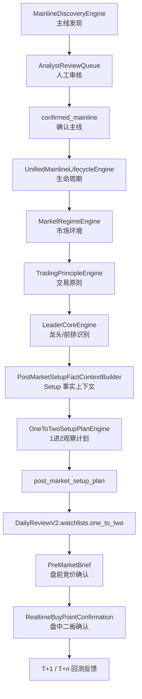
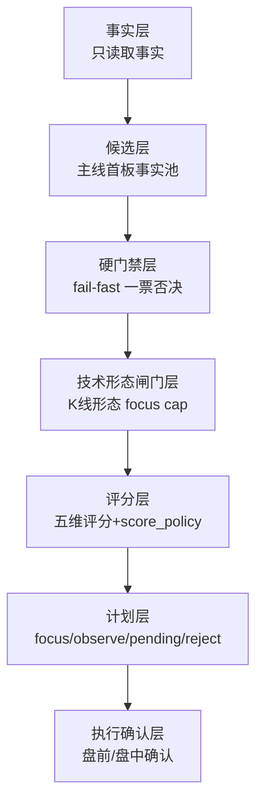
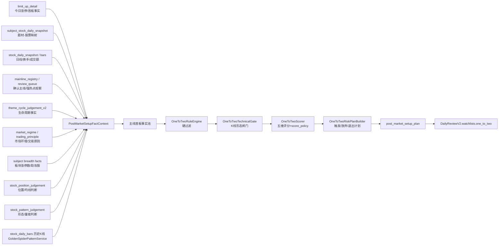
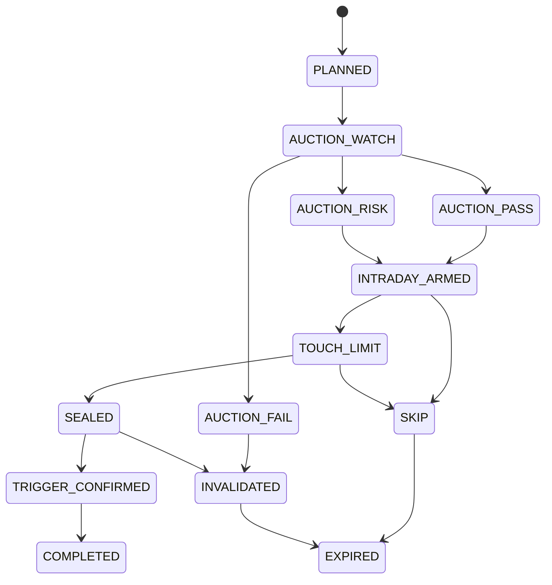

# OneToTwoSetupPlanEngine 架构设计文档 v3.2

> 项目：`ai_theme_app` / AI 投资个人助理 / 久赢恒丰 2.0  
> 模块：每日复盘中的「1进2明日观察清单」  
> 版本：v3.2  
> 日期：2026-06-09  
> 状态：核心引擎已存在（v3.1），v3.2 聚焦**报告接入 + 对账修复**，不重做引擎  

---

## 0. 文档修订说明

v3.0 相比 v2.0 的核心修订：

1. 将候选源从”confirmed_mainline 中筛选标的”修正为”从主线首板事实池中构建 1进2观察候选”。
2. 明确 `confirmed_mainline` 不是唯一候选入口，而是 `focus` 权限门槛。
3. 新增”空结果原则”：1进2观察清单可以为空，空结果是正常业务结果。
4. 明确 OneToTwo 不从 Layer C 强势股池反推，不复用 D1 弱转强候选池，不修改 A/B/C/D 任何生产链。
5. 强化事实层、候选层、硬门禁层、评分层、计划层、执行确认层的分层边界。
6. 新增硬规则合同测试清单，尤其是空结果测试与不读取 Layer C / D1 的边界测试。
7. 将 Phase 1 设计为硬过滤 MVP，复杂评分延后到 Phase 2。
8. 明确不允许为了每日产出而降低硬门槛，不允许 LLM 覆盖硬规则，不允许 fallback/mock/default 生成候选。

v3.1 相比 v3.0 的核心修订：

1. 新增「技术形态闸门层」— 介于硬门禁层与评分层之间，由 OneToTwoTechnicalGate 负责。
2. GoldenSpiderPatternService 定位修正为「OneToTwo 技术形态适配层」，不复写 K 线分析逻辑，只融合已有模块输出（KlineTechnicalAnalyzer + stock_position_judgement + stock_pattern_judgement，可选接入 KlineSupportScorer）。
3. K 线形态（金蜘蛛/MA 均线簇/下降趋势/压力位/支撑位）正式进入 RuleEngine 决策链 — 下降趋势/压力位硬拒，无技术支撑不得 focus。
4. 评分权重修正为五维：首板质量 25% / 题材正宗度 20% / 板块合力 20% / 技术形态 20% / 风险控制 15%。
5. 新增 score_policy 门禁 — final_score < 80 或 technical_structure_score < 55 不得 focus。
6. 修正 subject_key / stock_key 归一化残留 — subject_key 不得使用 _stock_key()（split(“.”)[0] 是股票代码逻辑）。
7. 抽出统一 LimitUpDetector — 分板涨停判定不再散落在三个类中重复实现。

---

## 1. 一句话项目合约

```text
1进2不是“强势股池里挑一个去打板”。
它是高风险、低频、强约束的次日买点观察计划。
它的核心不是每天都有候选，而是只有满足全部硬条件时才生成观察清单。
空白是正常结果。
```

---

## 2. 设计目标

### 2.1 目标

每日复盘后，系统尝试生成：

```text
DailyReviewV2.watchlists.one_to_two
```

它表示：

```text
明日 1进2 二板晋级观察清单
```

注意：复盘阶段只生成观察计划，不生成交易动作。

允许输出：

```text
focus
observe_only
pending_review_only
reject
```

禁止输出：

```text
buy
must_buy
recommend_buy
```

盘前和盘中阶段才允许进一步产生：

```text
auction_pass
auction_watch
auction_fail
auction_risk
trigger_confirmed
skip
invalidated
```

### 2.2 正确候选源定义

原错误表达：

```text
从 confirmed_mainline 中筛选标的
```

修正为：

```text
从“主线首板事实池”中构建 1进2观察候选。
```

更准确的事实交集：

```text
今日首板事实
∩ 主线 / 强热点相关题材事实
∩ 板块合力事实
∩ 首板质量事实
∩ 市场环境事实
```

其中：

```text
候选源：主线首板事实池
正式 focus 权限：必须 confirmed_mainline + 交易环境允许 + 首板质量过关
```

这样避免两个错误：

1. 把 1进2做成全市场首板扫描器。
2. 把 1进2过窄地写成只能从 confirmed_mainline 表里取票。

---

## 3. 架构定位

### 3.1 在主线交易系统中的位置



一句话：

```text
主线是方向；
生命周期是阶段；
市场环境是开关；
龙头是标的；
1进2是 Setup；
盘前/盘中确认才是执行触发。
```

### 3.2 与 A/B/C/D 生产链边界

| 模块 | 职责 | OneToTwo 能否修改 |
|---|---|---|
| Layer A 主线身份 | 识别主线身份 | 不能 |
| Layer B 生命周期 | 判断主线阶段 | 不能 |
| Layer C 强势股观察池 | 生成强势股对象池 | 不能 |
| Layer D 弱转强 | 生成弱转强候选 | 不能 |
| OneToTwo Setup | 生成次日二板观察计划 | 只在这里实现 |

正确关系：

```text
Layer A/B/C/D = 事实与对象生产链
OneToTwoSetupPlan = 消费事实后的买点观察计划
```

硬边界：

```text
1. OneToTwo 不从 Layer C 强势股池反推。
2. OneToTwo 不使用 D1 弱转强候选池。
3. OneToTwo 不修改 A/B/C/D 任何生产链。
4. OneToTwo 不参与 MainlineDiscoveryEngine。
5. OneToTwo 不反向影响 confirmed_mainline。
6. OneToTwo 不从 DailyReviewV2 展示结果里反向抽数据。
```

---

## 4. 核心分层设计



### 4.1 事实层

只读取事实，不做策略判断。

核心事实：

```text
首板事实
涨停时间
封板质量
开板次数
换手率
成交额
封单金额
板块涨停数
同题材助攻股
股价位置
压力位
市场情绪
主线状态
```

### 4.2 候选层

构建：

```text
主线首板事实池
```

此阶段不是推荐，也不是买入，只是把可能用于 1进2分析的事实对象合并到一起。

候选池来源：

```text
limit_up_detail_rows / stock_daily_snapshot / subject_stock_daily_snapshot
+ active confirmed mainline subject universe
+ machine_fast_candidate / pending_human_review 强热点观察事实
+ subject board breadth facts
+ market_regime facts
```

### 4.3 硬门禁层

硬门禁是 fail-fast 规则，一票否决。

规则：

```text
非市场主线 / 非强热点 → reject
无板块合力 → reject
不是首板 → reject
一字板 → reject
尾盘偷封 → reject
低换手 → reject
首板位置过高 → reject
下降趋势 → reject
重要压力位附近 → reject
流通市值过大 → reject
市场环境 no_trade → observe_only，不得 focus
```

### 4.4 技术形态闸门层（v3.1 新增）

在硬门禁通过后、评分前，由 `OneToTwoTechnicalGate` 对 K 线技术形态做二次判定。

该层不重写 K 线分析逻辑。它通过 `GoldenSpiderPatternService`（OneToTwo 技术形态适配层）融合已有模块输出：

- `KlineTechnicalAnalyzer` — MA5/10/20/60、支撑/压力、量比、MACD、趋势状态
- `stock_position_judgement` — 位置标签（突破前高/接近前高/低位启动/高位分歧/平台整理）、均线排列、趋势强度
- `stock_pattern_judgement` — 形态标签（放量突破/均线多头/缩量回踩/高量不破/高位分歧）
- `KlineSupportScorer`（可选接入）— 缺口支撑共振、布林下轨、斐波那契回撤、枢轴点、多支撑共振

规则（v3.1 第一版）：

```text
is_downtrend = true                   → reject（下降趋势）
support_broken = true                 → reject（支撑破坏）
kline_data_ready = false              → observe_only（不得 focus）
near_pressure / kline_near_resistance → observe_only 或 pending_review_only（不得 focus）
has_golden_spider = false 且 score<55 → observe_only（focus 降 observe_only）
has_golden_spider = true 或 score>=68 → pass（允许 focus）
```

注意：第一版 near_pressure 先 cap_focus 不硬 reject，避免轻量 support_resistance.near_resistance 误伤。等 KlineSupportScorer 成熟接入后再升级为硬 reject。

核心原则：

```text
金蜘蛛不是硬门禁 — "最好是金蜘蛛"不代表"没有金蜘蛛直接剔除"。
硬拒的是：下降趋势、压力位、高位、支撑破坏。
金蜘蛛用于 focus 资格增强：有金蜘蛛/强形态 → 允许 focus；无金蜘蛛且技术分低 → 最多 observe_only。
```

### 4.5 评分层

只对通过硬门禁 + 技术形态闸门的极少数候选打分。

v3.1 权重（五维评分）：

```text
首板质量          25%
题材正宗度        20%
板块合力          20%
技术形态          20%
风险控制          15%
```

其中技术形态维度由 `OneToTwoScorer._technical_structure_score()` 从 `f.kline_pattern_quality` 取值：

```text
has_golden_spider = true  → 90~100
level = near_golden       → 65~80
kline_score 55~68         → 60~70
kline_score < 40          → 30~45
kline_data_ready = false  → 25
near_pressure = true      → 0~30
is_downtrend = true       → 0
```

评分用于排序和 focus 资格判定，但评分本身不覆盖硬否决。

### 4.6 计划层

输出计划状态：

```text
focus
observe_only
pending_review_only
reject
```

复盘阶段禁止输出：

```text
buy
must_buy
recommend_buy
```

### 4.7 执行确认层

盘前、盘中再判断：

```text
auction_pass
auction_watch
action_fail  # 禁止使用，见下方
auction_fail
auction_risk
trigger_confirmed
skip
invalidated
```

注意：`action_fail` 是非法拼写，系统只能使用 `auction_fail`。

---

## 5. 空结果原则

### 5.1 原则

```text
1进2观察清单不是每日必产物。
当市场没有满足主线、首板质量、板块合力、换手、风险位置等条件的标的时，
应输出空清单，并在 diagnostics 中说明被否决原因分布。
```

空结果是正常业务结果，不是系统失败。

### 5.2 空结果输出示例

```json
{
  "one_to_two": {
    "summary": {
      "focus_count": 0,
      "observe_only_count": 0,
      "pending_review_only_count": 0,
      "reject_count": 18
    },
    "items": [],
    "diagnostics": {
      "empty_is_valid": true,
      "top_reject_reasons": [
        "无板块合力",
        "一字板",
        "非主线题材",
        "尾盘偷封"
      ]
    }
  }
}
```

### 5.3 禁止行为

```text
不得为了“每天都有候选”而放宽硬门槛。
不得为了“页面好看”而 mock 候选。
不得用默认值凑评分。
不得由 LLM 覆盖硬规则。
```

---

## 6. 数据流图

### 6.1 盘后数据流



### 6.2 盘前 / 盘中状态流



---

## 7. Phase 0：数据可用性审计

Phase 0 先做，不写策略。

目标：确认系统是否有足够字段支撑 1进2。

### 7.1 字段审计清单

```text
首板识别
封板时间
开板次数
封单金额
换手率
成交额
板块涨停数量
同题材助攻股
股价位置
压力位
市场环境
主线状态
```

### 7.2 审计 SQL 示例

```sql
-- 1. 每日首板数据是否可得
SELECT trade_date, COUNT(*) AS first_board_count
FROM limit_up_detail
WHERE is_first_limit_up = true
GROUP BY trade_date
ORDER BY trade_date DESC;
```

```sql
-- 2. 是否有封板时间、开板次数、封单金额
SELECT
    COUNT(*) AS total_first_board,
    COUNT(*) FILTER (WHERE first_limit_time IS NOT NULL) AS has_first_limit_time,
    COUNT(*) FILTER (WHERE open_board_count IS NOT NULL) AS has_open_board_count,
    COUNT(*) FILTER (WHERE close_seal_amount IS NOT NULL) AS has_close_seal_amount
FROM limit_up_detail
WHERE trade_date = DATE '2026-06-04'
  AND is_first_limit_up = true;
```

```sql
-- 3. 是否能映射到 subject_key
SELECT COUNT(*) AS mapped_limit_up_count
FROM subject_stock_daily_snapshot
WHERE trade_date = DATE '2026-06-04'
  AND limit_up = true
  AND subject_key IS NOT NULL;
```

```sql
-- 4. 是否有 active confirmed mainline
SELECT COUNT(*) AS active_confirmed_mainline_count
FROM mainline_registry
WHERE identity_status = 'confirmed'
  AND tracking_status = 'active'
  AND valid_from <= DATE '2026-06-04'
  AND (valid_to IS NULL OR valid_to >= DATE '2026-06-04');
```

```sql
-- 5. 市场环境是否可用
SELECT trade_date, market_structure, trade_mode, allow_trade
FROM post_market_decision_v2
WHERE trade_date = DATE '2026-06-04';
```

### 7.3 Phase 0 验收

必须明确：

```text
首板事实可用
subject_key 可映射
confirmed_mainline 可用
market_regime 可用
limit_up 时间和封单字段可用或明确缺失
```

如果这些不满足，不进入 Phase 1。

---

## 8. 必需数据源与可选数据源

### 8.1 必需数据源

缺失必须 fail-loud，不能生成正式观察清单。

```text
active_mainlines
market_regime
trading_principle
limit_up_rows
subject_stock_rows
stock_daily_bars
```

### 8.2 可选增强数据源

缺失只能降级，不能伪造。

```text
leader_core_by_subject
subject_market_breadth
prior_daily_bars
pressure_level
ma_pattern
```

可选源缺失时：

```text
1. 记录 diagnostics.non_blocking_warnings
2. 依赖该特征的候选降级为 pending_review_only 或 reject
3. 不允许填默认值继续打高分
```

### 8.3 diagnostics 格式

```json
{
  "source_status": {
    "active_mainlines": "ready",
    "market_regime": "ready",
    "trading_principle": "ready",
    "limit_up_rows": "ready",
    "subject_stock_rows": "ready",
    "stock_daily_bars": "ready",
    "subject_market_breadth": "missing_optional"
  },
  "blocking_errors": [],
  "non_blocking_warnings": [
    "subject_market_breadth missing: related candidates can only be pending_review_only"
  ]
}
```

---

## 9. 数据表结构设计

### 9.1 `post_market_setup_plan`

```sql
CREATE TABLE IF NOT EXISTS post_market_setup_plan (
    id BIGSERIAL PRIMARY KEY,

    trade_date DATE NOT NULL,
    watch_date DATE NOT NULL,

    setup_type TEXT NOT NULL,              -- one_to_two / weak_to_strong / leader_core
    setup_version TEXT DEFAULT 'v1',

    mainline_id TEXT,
    mainline_name TEXT,
    subject_key TEXT,
    subject_name TEXT,

    stock_id TEXT NOT NULL,
    stock_name TEXT,

    lifecycle_state TEXT,
    market_trade_mode TEXT,
    allow_trade BOOLEAN DEFAULT false,
    position_limit NUMERIC(8,4),

    decision TEXT NOT NULL,                -- focus / observe_only / pending_review_only / reject
    plan_status TEXT NOT NULL DEFAULT 'planned',
                                            -- planned / confirmed_by_auction / triggered_intraday / invalidated / expired
    watch_level TEXT,                       -- S / A / B / C
    final_score NUMERIC(8,2),

    summary TEXT,
    evidence_rules JSONB,
    feature_json JSONB,
    risk_flags JSONB,

    trigger_plan JSONB,
    invalidation_plan JSONB,
    exit_plan JSONB,

    diagnostics JSONB,
    source_trace_json JSONB,

    created_at TIMESTAMP DEFAULT now(),
    updated_at TIMESTAMP DEFAULT now(),

    CONSTRAINT chk_post_market_setup_plan_decision
        CHECK (decision IN ('focus', 'observe_only', 'pending_review_only', 'reject')),

    CONSTRAINT chk_post_market_setup_plan_status
        CHECK (plan_status IN ('planned', 'confirmed_by_auction', 'triggered_intraday', 'invalidated', 'expired')),

    UNIQUE (trade_date, watch_date, setup_type, stock_id, subject_key)
);
```

### 9.2 `one_to_two_candidate_feature`

```sql
CREATE TABLE IF NOT EXISTS one_to_two_candidate_feature (
    id BIGSERIAL PRIMARY KEY,

    trade_date DATE NOT NULL,
    watch_date DATE NOT NULL,

    stock_id TEXT NOT NULL,
    stock_name TEXT,

    subject_key TEXT,
    subject_name TEXT,
    mainline_id TEXT,

    is_confirmed_mainline BOOLEAN,
    is_strong_hotspot BOOLEAN DEFAULT false,
    mainline_or_hotspot_state TEXT,         -- confirmed_mainline / machine_fast_candidate / pending_review / strong_hotspot
    lifecycle_state TEXT,
    market_trade_mode TEXT,

    is_first_limit_up BOOLEAN,
    is_one_word_board BOOLEAN,
    is_late_seal BOOLEAN,
    first_limit_time TIME,
    last_limit_time TIME,
    open_board_count INTEGER,

    turnover_rate NUMERIC(10,4),
    amount NUMERIC(20,2),
    volume_ratio NUMERIC(10,4),
    close_seal_amount NUMERIC(20,2),
    seal_ratio NUMERIC(10,4),

    close_price NUMERIC(12,4),
    limit_up_price NUMERIC(12,4),
    float_mcap NUMERIC(20,2),
    total_mcap NUMERIC(20,2),

    position_60 NUMERIC(10,4),
    position_120 NUMERIC(10,4),
    ma5 NUMERIC(12,4),
    ma10 NUMERIC(12,4),
    ma20 NUMERIC(12,4),
    ma_pattern_score NUMERIC(8,2),

    near_pressure BOOLEAN,
    pressure_distance NUMERIC(10,4),
    is_downtrend BOOLEAN,

    same_subject_limit_count INTEGER,
    same_subject_strong_count INTEGER,
    same_subject_avg_pct NUMERIC(10,4),
    board_breadth_score NUMERIC(8,2),

    first_board_quality_score NUMERIC(8,2),
    mainline_context_score NUMERIC(8,2),
    technical_structure_score NUMERIC(8,2),
    risk_control_score NUMERIC(8,2),
    final_score NUMERIC(8,2),

    decision TEXT,
    veto_reasons JSONB,
    feature_json JSONB,

    data_quality_json JSONB,
    source_trace_json JSONB,

    created_at TIMESTAMP DEFAULT now(),

    CONSTRAINT chk_one_to_two_feature_decision
        CHECK (decision IS NULL OR decision IN ('focus', 'observe_only', 'pending_review_only', 'reject')),

    UNIQUE (trade_date, stock_id, subject_key)
);
```

### 9.3 `setup_plan_realtime_confirmation`

```sql
CREATE TABLE IF NOT EXISTS setup_plan_realtime_confirmation (
    id BIGSERIAL PRIMARY KEY,

    watch_date DATE NOT NULL,
    setup_plan_id BIGINT REFERENCES post_market_setup_plan(id),

    stock_id TEXT NOT NULL,
    setup_type TEXT NOT NULL,

    confirmation_stage TEXT NOT NULL,
        -- auction / open / intraday / board / reseal / invalidated
    snapshot_time TIMESTAMP,

    auction_gap NUMERIC(10,4),
    auction_amount NUMERIC(20,2),
    auction_amount_ratio NUMERIC(10,4),
    auction_score NUMERIC(8,2),

    last_price NUMERIC(12,4),
    pct_chg NUMERIC(10,4),
    is_touch_limit BOOLEAN,
    is_sealed BOOLEAN,
    seal_amount NUMERIC(20,2),
    open_board_count INTEGER,
    reseal_seconds INTEGER,

    realtime_decision TEXT NOT NULL,
        -- auction_pass / auction_watch / auction_fail / auction_risk / trigger_confirmed / skip / invalidated
    reason TEXT,
    raw_json JSONB,

    created_at TIMESTAMP DEFAULT now(),

    CONSTRAINT chk_setup_realtime_decision
        CHECK (realtime_decision IN (
            'auction_pass', 'auction_watch', 'auction_fail', 'auction_risk',
            'trigger_confirmed', 'skip', 'invalidated'
        ))
);
```

---

## 10. 核心 DTO 设计

### 10.1 `post_market_setup_context_dto.py`

```python
from __future__ import annotations

from dataclasses import dataclass, field
from typing import Any


class SetupFactContextBuildError(RuntimeError):
    """Required setup facts are missing; fail loud."""


@dataclass(frozen=True)
class SourceStatus:
    source_status: dict[str, str] = field(default_factory=dict)
    blocking_errors: list[str] = field(default_factory=list)
    non_blocking_warnings: list[str] = field(default_factory=list)

    @property
    def has_blocking_error(self) -> bool:
        return bool(self.blocking_errors)


@dataclass(frozen=True)
class PostMarketSetupFactContext:
    trade_date: str
    watch_date: str

    active_mainlines: list[dict[str, Any]]
    strong_hotspot_subjects: list[dict[str, Any]]
    active_subject_keys: set[str]

    lifecycle_by_subject: dict[str, dict[str, Any]]
    market_regime: dict[str, Any]
    trading_principle: dict[str, Any]

    subject_stock_rows: list[dict[str, Any]]
    stock_daily_bars: list[dict[str, Any]]
    limit_up_rows: list[dict[str, Any]]

    subject_market_breadth: dict[str, dict[str, Any]] = field(default_factory=dict)
    prior_daily_bars: dict[str, list[dict[str, Any]]] = field(default_factory=dict)
    pressure_by_stock: dict[str, dict[str, Any]] = field(default_factory=dict)
    ma_pattern_by_stock: dict[str, dict[str, Any]] = field(default_factory=dict)

    diagnostics: SourceStatus = field(default_factory=SourceStatus)
```

### 10.2 `one_to_two_dto.py`

```python
from __future__ import annotations

from dataclasses import dataclass, field
from decimal import Decimal
from typing import Any, Literal

Decision = Literal['focus', 'observe_only', 'pending_review_only', 'reject']


@dataclass(frozen=True)
class OneToTwoFeatures:
    trade_date: str
    watch_date: str
    stock_id: str
    stock_name: str
    subject_key: str
    subject_name: str

    is_confirmed_mainline: bool
    is_strong_hotspot: bool
    mainline_or_hotspot_state: str
    lifecycle_state: str
    market_trade_mode: str
    allow_trade: bool

    is_first_limit_up: bool
    is_one_word_board: bool
    is_late_seal: bool
    first_limit_time: str | None
    open_board_count: int | None

    turnover_rate: Decimal | None
    amount: Decimal | None
    close_seal_amount: Decimal | None
    seal_ratio: Decimal | None

    float_mcap: Decimal | None
    position_120: Decimal | None
    is_downtrend: bool | None
    near_pressure: bool | None

    same_subject_limit_count: int | None
    same_subject_strong_count: int | None

    data_quality: dict[str, Any] = field(default_factory=dict)
    source_trace: dict[str, Any] = field(default_factory=dict)


@dataclass(frozen=True)
class RuleResult:
    decision: Decision
    veto_reasons: list[str]
    risk_flags: list[str]


@dataclass(frozen=True)
class ScoreResult:
    final_score: Decimal | None
    watch_level: str | None
    score_detail: dict[str, Any]


@dataclass(frozen=True)
class SetupPlanCandidate:
    features: OneToTwoFeatures
    rule_result: RuleResult
    score_result: ScoreResult
    trigger_plan: dict[str, Any]
    invalidation_plan: list[str]
    exit_plan: list[str]
```

---

## 11. 核心代码设计

### 11.1 `PostMarketSetupFactContextBuilder`

特点：

```text
1. 必需源失败必须 raise SetupFactContextBuildError。
2. 可选源失败只记录 warning，不允许 mock/default。
3. 不从 DailyReviewV2 / post_market_snapshot 反向取数据。
4. 不读取 Layer C 强势股池。
5. 不调用 D1 弱转强候选构建器。
```

```python
from __future__ import annotations

from datetime import date
from typing import Any

from stock_processing_service.contracts.dto.post_market_setup_context_dto import (
    PostMarketSetupFactContext,
    SetupFactContextBuildError,
    SourceStatus,
)


class PostMarketSetupFactContextBuilder:
    REQUIRED_SOURCES = [
        'active_mainlines',
        'market_regime',
        'trading_principle',
        'limit_up_rows',
        'subject_stock_rows',
        'stock_daily_bars',
    ]

    OPTIONAL_SOURCES = [
        'strong_hotspot_subjects',
        'subject_market_breadth',
        'prior_daily_bars',
        'pressure_by_stock',
        'ma_pattern_by_stock',
    ]

    def __init__(self, read_port: Any, trade_calendar: Any) -> None:
        self._read = read_port
        self._calendar = trade_calendar

    async def build(self, trade_date: date) -> PostMarketSetupFactContext:
        watch_date = self._calendar.next_trade_date(trade_date)
        status = SourceStatus()

        active_mainlines = await self._required(
            status, 'active_mainlines',
            self._read.get_active_mainline_universe(trade_date=trade_date),
        )
        market_regime = await self._required(
            status, 'market_regime',
            self._read.get_market_regime(trade_date=trade_date),
        )
        trading_principle = await self._required(
            status, 'trading_principle',
            self._read.get_trading_principle(trade_date=trade_date),
        )
        limit_up_rows = await self._required(
            status, 'limit_up_rows',
            self._read.get_limit_up_detail_rows(trade_date=trade_date),
        )
        subject_stock_rows = await self._required(
            status, 'subject_stock_rows',
            self._read.get_subject_stock_daily_snapshot(trade_date=trade_date),
        )
        stock_daily_bars = await self._required(
            status, 'stock_daily_bars',
            self._read.get_stock_daily_bars(trade_date=trade_date),
        )

        if status.has_blocking_error:
            raise SetupFactContextBuildError('; '.join(status.blocking_errors))

        strong_hotspot_subjects = await self._optional(
            status, 'strong_hotspot_subjects',
            self._read.get_mainline_review_pending_or_strong_hotspots(trade_date=trade_date),
        )
        subject_market_breadth = await self._optional(
            status, 'subject_market_breadth',
            self._read.get_subject_market_breadth(trade_date=trade_date),
        )
        prior_daily_bars = await self._optional(
            status, 'prior_daily_bars',
            self._read.get_prior_stock_daily_bars(trade_date=trade_date, lookback_days=120),
        )
        pressure_by_stock = await self._optional(
            status, 'pressure_by_stock',
            self._read.get_stock_pressure_levels(trade_date=trade_date),
        )
        ma_pattern_by_stock = await self._optional(
            status, 'ma_pattern_by_stock',
            self._read.get_stock_ma_pattern_features(trade_date=trade_date),
        )

        active_subject_keys = self._expand_active_subject_keys(active_mainlines)
        lifecycle_by_subject = self._build_lifecycle_map(active_mainlines)

        return PostMarketSetupFactContext(
            trade_date=trade_date.isoformat(),
            watch_date=watch_date.isoformat(),
            active_mainlines=active_mainlines,
            strong_hotspot_subjects=strong_hotspot_subjects or [],
            active_subject_keys=active_subject_keys,
            lifecycle_by_subject=lifecycle_by_subject,
            market_regime=market_regime,
            trading_principle=trading_principle,
            subject_stock_rows=subject_stock_rows,
            stock_daily_bars=stock_daily_bars,
            limit_up_rows=limit_up_rows,
            subject_market_breadth=subject_market_breadth or {},
            prior_daily_bars=prior_daily_bars or {},
            pressure_by_stock=pressure_by_stock or {},
            ma_pattern_by_stock=ma_pattern_by_stock or {},
            diagnostics=status,
        )

    async def _required(self, status: SourceStatus, name: str, awaitable: Any) -> Any:
        try:
            value = await awaitable
        except Exception as exc:
            status.source_status[name] = 'error'
            status.blocking_errors.append(f'{name}: {exc}')
            return None
        if value is None or value == [] or value == {}:
            status.source_status[name] = 'missing_required'
            status.blocking_errors.append(f'{name}: missing required source')
            return None
        status.source_status[name] = 'ready'
        return value

    async def _optional(self, status: SourceStatus, name: str, awaitable: Any) -> Any:
        try:
            value = await awaitable
        except Exception as exc:
            status.source_status[name] = 'error_optional'
            status.non_blocking_warnings.append(f'{name}: {exc}')
            return None
        if value is None or value == [] or value == {}:
            status.source_status[name] = 'missing_optional'
            status.non_blocking_warnings.append(f'{name}: missing optional source')
            return None
        status.source_status[name] = 'ready'
        return value

    def _expand_active_subject_keys(self, active_mainlines: list[dict[str, Any]]) -> set[str]:
        result: set[str] = set()
        for row in active_mainlines:
            for key_name in ('canonical_subject_key', 'subject_key'):
                if row.get(key_name):
                    result.add(str(row[key_name]))
            for key_name in ('related_subject_keys_json', 'branch_subject_keys_json'):
                values = row.get(key_name) or []
                if isinstance(values, list):
                    result.update(str(v) for v in values if v)
        return result

    def _build_lifecycle_map(self, active_mainlines: list[dict[str, Any]]) -> dict[str, dict[str, Any]]:
        result: dict[str, dict[str, Any]] = {}
        for row in active_mainlines:
            subject_keys = []
            if row.get('canonical_subject_key'):
                subject_keys.append(str(row['canonical_subject_key']))
            subject_keys.extend(str(v) for v in row.get('related_subject_keys_json') or [] if v)
            subject_keys.extend(str(v) for v in row.get('branch_subject_keys_json') or [] if v)
            for sk in subject_keys:
                result[sk] = row
        return result
```

### 11.2 `OneToTwoCandidateService`

候选入口只从首板事实构建，不读取 Layer C，不调用 W2S。

```python
from __future__ import annotations

from decimal import Decimal
from typing import Any

from stock_processing_service.contracts.dto.one_to_two_dto import OneToTwoFeatures
from stock_processing_service.contracts.dto.post_market_setup_context_dto import PostMarketSetupFactContext


class OneToTwoCandidateService:
    """Builds the mainline first-board fact pool.

    It must not read Layer C strong pool.
    It must not call weak-to-strong candidate builder.
    It must not read DailyReviewV2 output.
    """

    def build_fact_pool(self, ctx: PostMarketSetupFactContext) -> list[OneToTwoFeatures]:
        limit_by_stock = {
            str(r.get('stock_id') or r.get('stock_code')): r
            for r in ctx.limit_up_rows
            if self._bool(r.get('is_first_limit_up'))
        }
        if not limit_by_stock:
            return []

        bar_by_stock = {
            str(r.get('stock_id') or r.get('stock_code')): r
            for r in ctx.stock_daily_bars
        }

        subject_rows_by_stock: dict[str, list[dict[str, Any]]] = {}
        for row in ctx.subject_stock_rows:
            stock_id = str(row.get('stock_id') or row.get('stock_code') or '')
            if stock_id:
                subject_rows_by_stock.setdefault(stock_id, []).append(row)

        strong_hotspot_keys = {
            str(r.get('subject_key'))
            for r in ctx.strong_hotspot_subjects
            if r.get('subject_key')
        }

        candidates: list[OneToTwoFeatures] = []
        for stock_id, limit_row in limit_by_stock.items():
            subject_rows = subject_rows_by_stock.get(stock_id, [])
            if not subject_rows:
                continue

            for subject_row in subject_rows:
                subject_key = str(subject_row.get('subject_key') or '')
                if not subject_key:
                    continue

                is_confirmed = subject_key in ctx.active_subject_keys
                is_strong_hotspot = subject_key in strong_hotspot_keys

                # Candidate fact pool is not only confirmed_mainline.
                # But focus permission later requires confirmed mainline.
                if not is_confirmed and not is_strong_hotspot:
                    # Keep as rejectable fact only if caller wants diagnostics; skip for MVP memory efficiency.
                    continue

                bar = bar_by_stock.get(stock_id, {})
                breadth = ctx.subject_market_breadth.get(subject_key, {})
                lifecycle = ctx.lifecycle_by_subject.get(subject_key, {})
                pressure = ctx.pressure_by_stock.get(stock_id, {})

                candidates.append(self._to_features(
                    ctx=ctx,
                    stock_id=stock_id,
                    limit_row=limit_row,
                    subject_row=subject_row,
                    bar=bar,
                    breadth=breadth,
                    lifecycle=lifecycle,
                    pressure=pressure,
                    is_confirmed=is_confirmed,
                    is_strong_hotspot=is_strong_hotspot,
                ))

        return candidates

    def _to_features(
        self,
        *,
        ctx: PostMarketSetupFactContext,
        stock_id: str,
        limit_row: dict[str, Any],
        subject_row: dict[str, Any],
        bar: dict[str, Any],
        breadth: dict[str, Any],
        lifecycle: dict[str, Any],
        pressure: dict[str, Any],
        is_confirmed: bool,
        is_strong_hotspot: bool,
    ) -> OneToTwoFeatures:
        subject_key = str(subject_row.get('subject_key'))
        return OneToTwoFeatures(
            trade_date=ctx.trade_date,
            watch_date=ctx.watch_date,
            stock_id=stock_id,
            stock_name=str(bar.get('stock_name') or limit_row.get('stock_name') or subject_row.get('stock_name') or ''),
            subject_key=subject_key,
            subject_name=str(subject_row.get('subject_name') or lifecycle.get('mainline_name') or ''),
            is_confirmed_mainline=is_confirmed,
            is_strong_hotspot=is_strong_hotspot,
            mainline_or_hotspot_state='confirmed_mainline' if is_confirmed else 'strong_hotspot',
            lifecycle_state=str(lifecycle.get('lifecycle_state') or lifecycle.get('cycle_state') or 'unknown'),
            market_trade_mode=str(ctx.market_regime.get('trade_mode') or ctx.trading_principle.get('trade_mode') or 'unknown'),
            allow_trade=bool(ctx.trading_principle.get('allow_trade') or ctx.market_regime.get('allow_trade') or False),
            is_first_limit_up=self._bool(limit_row.get('is_first_limit_up')),
            is_one_word_board=self._bool(limit_row.get('is_one_word_board')),
            is_late_seal=self._is_late_seal(limit_row.get('first_limit_time')),
            first_limit_time=str(limit_row.get('first_limit_time')) if limit_row.get('first_limit_time') else None,
            open_board_count=self._int(limit_row.get('open_board_count')),
            turnover_rate=self._decimal(bar.get('turnover_rate') or limit_row.get('turnover_rate')),
            amount=self._decimal(bar.get('amount') or limit_row.get('amount')),
            close_seal_amount=self._decimal(limit_row.get('close_seal_amount')),
            seal_ratio=self._decimal(limit_row.get('seal_ratio')),
            float_mcap=self._decimal(bar.get('float_mcap') or subject_row.get('float_mcap')),
            position_120=self._decimal(bar.get('position_120')),
            is_downtrend=self._nullable_bool(bar.get('is_downtrend')),
            near_pressure=self._nullable_bool(pressure.get('near_pressure')),
            same_subject_limit_count=self._int(breadth.get('same_subject_limit_count')),
            same_subject_strong_count=self._int(breadth.get('same_subject_strong_count')),
            data_quality=self._data_quality(limit_row, bar, breadth, pressure),
            source_trace={
                'limit_source': 'limit_up_detail',
                'subject_source': 'subject_stock_daily_snapshot',
                'bar_source': 'stock_daily_bars',
                'breadth_source': 'subject_market_breadth',
                'pressure_source': 'pressure_by_stock',
            },
        )

    @staticmethod
    def _bool(value: Any) -> bool:
        return str(value).lower() in {'1', 'true', 't', 'yes'} or value is True

    @staticmethod
    def _nullable_bool(value: Any) -> bool | None:
        if value is None:
            return None
        return OneToTwoCandidateService._bool(value)

    @staticmethod
    def _int(value: Any) -> int | None:
        try:
            return int(value) if value is not None else None
        except Exception:
            return None

    @staticmethod
    def _decimal(value: Any) -> Decimal | None:
        try:
            return Decimal(str(value)) if value is not None else None
        except Exception:
            return None

    @staticmethod
    def _is_late_seal(first_limit_time: Any) -> bool:
        if not first_limit_time:
            return True
        return str(first_limit_time) >= '14:30:00'

    @staticmethod
    def _data_quality(limit_row: dict[str, Any], bar: dict[str, Any], breadth: dict[str, Any], pressure: dict[str, Any]) -> dict[str, Any]:
        required = {
            'first_limit_time': limit_row.get('first_limit_time') is not None,
            'open_board_count': limit_row.get('open_board_count') is not None,
            'turnover_rate': (bar.get('turnover_rate') or limit_row.get('turnover_rate')) is not None,
            'amount': (bar.get('amount') or limit_row.get('amount')) is not None,
            'same_subject_limit_count': breadth.get('same_subject_limit_count') is not None,
        }
        optional = {
            'near_pressure': pressure.get('near_pressure') is not None,
            'seal_amount': limit_row.get('close_seal_amount') is not None,
        }
        return {
            'required_fields': required,
            'optional_fields': optional,
            'missing_required': [k for k, ok in required.items() if not ok],
            'missing_optional': [k for k, ok in optional.items() if not ok],
        }
```

### 11.3 `OneToTwoRuleEngine`

```python
from __future__ import annotations

from decimal import Decimal

from stock_processing_service.contracts.dto.one_to_two_dto import OneToTwoFeatures, RuleResult


class OneToTwoRuleEngine:
    def apply(self, f: OneToTwoFeatures) -> RuleResult:
        veto: list[str] = []
        risk: list[str] = []

        missing_required = f.data_quality.get('missing_required') or []
        if missing_required:
            return RuleResult(
                decision='reject',
                veto_reasons=[f'必需字段缺失: {missing_required}'],
                risk_flags=[],
            )

        if not f.is_confirmed_mainline and not f.is_strong_hotspot:
            veto.append('非市场主线 / 非强热点')

        if not f.is_first_limit_up:
            veto.append('不是首板')

        if f.is_one_word_board:
            veto.append('一字板，不做1进2观察')

        if f.is_late_seal:
            veto.append('尾盘偷封，辨识度不足')

        if f.turnover_rate is None or f.turnover_rate < Decimal('0.08'):
            veto.append('低换手，筹码交换不足')

        if f.same_subject_limit_count is None or f.same_subject_limit_count < 2:
            veto.append('无板块合力')

        if f.position_120 is not None and f.position_120 > Decimal('0.65'):
            veto.append('首板位置过高')

        if f.is_downtrend is True:
            veto.append('下降趋势')

        if f.near_pressure is True:
            veto.append('重要压力位附近')

        if f.float_mcap is not None and f.float_mcap > Decimal('20000000000'):
            veto.append('流通市值过大')

        if f.lifecycle_state in {'fade_confirmed', 'dead'}:
            veto.append(f'主线状态不可交易: {f.lifecycle_state}')

        if veto:
            return RuleResult(decision='reject', veto_reasons=veto, risk_flags=risk)

        if f.market_trade_mode == 'no_trade' or not f.allow_trade:
            return RuleResult(
                decision='observe_only',
                veto_reasons=[],
                risk_flags=['市场环境 no_trade，不得 focus'],
            )

        if not f.is_confirmed_mainline:
            return RuleResult(
                decision='pending_review_only',
                veto_reasons=[],
                risk_flags=['非 confirmed_mainline，仅保留观察，不得 focus'],
            )

        if f.lifecycle_state in {'climax', 'fade_watch'}:
            return RuleResult(
                decision='observe_only',
                veto_reasons=[],
                risk_flags=[f'主线阶段 {f.lifecycle_state}，只观察不 focus'],
            )

        return RuleResult(decision='focus', veto_reasons=[], risk_flags=risk)
```

### 11.4 `OneToTwoScorer`

Phase 1 可以只返回占位排序分。Phase 2 引入保守评分。

```python
from __future__ import annotations

from decimal import Decimal

from stock_processing_service.contracts.dto.one_to_two_dto import OneToTwoFeatures, RuleResult, ScoreResult


class OneToTwoScorer:
    def score(self, f: OneToTwoFeatures, rule: RuleResult) -> ScoreResult:
        if rule.decision == 'reject':
            return ScoreResult(final_score=None, watch_level=None, score_detail={})

        first_board = self._first_board_quality(f)
        breadth = self._board_breadth(f)
        lifecycle = self._lifecycle_score(f)
        risk = self._risk_control(f)

        final = (
            first_board * Decimal('0.40')
            + breadth * Decimal('0.25')
            + lifecycle * Decimal('0.20')
            + risk * Decimal('0.15')
        )

        level = 'A' if final >= Decimal('80') else 'B' if final >= Decimal('70') else 'C'
        return ScoreResult(
            final_score=final.quantize(Decimal('0.01')),
            watch_level=level,
            score_detail={
                'first_board_quality': str(first_board),
                'board_breadth': str(breadth),
                'lifecycle': str(lifecycle),
                'risk_control': str(risk),
            },
        )

    def _first_board_quality(self, f: OneToTwoFeatures) -> Decimal:
        score = Decimal('50')
        if f.turnover_rate and f.turnover_rate >= Decimal('0.15'):
            score += Decimal('20')
        elif f.turnover_rate and f.turnover_rate >= Decimal('0.08'):
            score += Decimal('10')
        if f.amount and f.amount >= Decimal('1000000000'):
            score += Decimal('15')
        if f.open_board_count is not None and f.open_board_count <= 2:
            score += Decimal('10')
        if f.close_seal_amount:
            score += Decimal('5')
        return min(score, Decimal('100'))

    def _board_breadth(self, f: OneToTwoFeatures) -> Decimal:
        count = f.same_subject_limit_count or 0
        strong = f.same_subject_strong_count or 0
        return min(Decimal('100'), Decimal(count * 25 + strong * 8))

    def _lifecycle_score(self, f: OneToTwoFeatures) -> Decimal:
        mapping = {
            'start': Decimal('95'),
            'fermentation': Decimal('90'),
            'acceleration': Decimal('75'),
            'repair': Decimal('65'),
            'divergence': Decimal('55'),
            'seed': Decimal('45'),
            'climax': Decimal('35'),
            'fade_watch': Decimal('25'),
        }
        return mapping.get(f.lifecycle_state, Decimal('50'))

    def _risk_control(self, f: OneToTwoFeatures) -> Decimal:
        score = Decimal('80')
        if f.position_120 is not None and f.position_120 > Decimal('0.50'):
            score -= Decimal('20')
        if f.near_pressure is None:
            score -= Decimal('10')
        return max(Decimal('0'), min(score, Decimal('100')))
```

### 11.5 `OneToTwoRiskPlanBuilder`

```python
from __future__ import annotations

from stock_processing_service.contracts.dto.one_to_two_dto import OneToTwoFeatures, RuleResult, ScoreResult


class OneToTwoRiskPlanBuilder:
    def build(self, f: OneToTwoFeatures, rule: RuleResult, score: ScoreResult) -> dict:
        return {
            'trigger_plan': {
                'auction': [
                    '9:24后重点观察集合竞价',
                    '高开3%-5%为佳',
                    '竞价量能活跃，不能明显缩量',
                    '低开且无弱转强则放弃',
                ],
                'intraday': [
                    '开盘后快速拉升',
                    '同题材内率先冲击涨停或明显强于竞争对手',
                    '二板封板速度快，封单稳定',
                    '炸板后能够快速回封',
                ],
            },
            'invalidation_plan': [
                '板块无助攻',
                '同题材被其他股票卡位',
                '高开超过7%后快速回落',
                '首次封板后反复炸板',
                '10:30前不能有效封板',
            ],
            'exit_plan': [
                '二板当天炸板且午后不能回封，减仓或清仓',
                '二板后次日低开，等待冲高失败后离场',
                '二板后次日高开7%-8%后回落，及时兑现',
                '三板炸板或明显走弱，第一时间兑现',
            ],
        }
```

### 11.6 `OneToTwoSetupPlanEngine`

```python
from __future__ import annotations

from stock_processing_service.contracts.dto.post_market_setup_context_dto import PostMarketSetupFactContext
from stock_processing_service.domain.services.one_to_two_candidate_service import OneToTwoCandidateService
from stock_processing_service.domain.services.one_to_two_rule_engine import OneToTwoRuleEngine
from stock_processing_service.domain.services.one_to_two_scorer import OneToTwoScorer
from stock_processing_service.domain.services.one_to_two_risk_plan_builder import OneToTwoRiskPlanBuilder


class OneToTwoSetupPlanEngine:
    def __init__(self) -> None:
        self.candidate_service = OneToTwoCandidateService()
        self.rule_engine = OneToTwoRuleEngine()
        self.scorer = OneToTwoScorer()
        self.risk_builder = OneToTwoRiskPlanBuilder()

    def build(self, ctx: PostMarketSetupFactContext) -> dict:
        fact_pool = self.candidate_service.build_fact_pool(ctx)

        items = []
        reject_reasons: dict[str, int] = {}

        for features in fact_pool:
            rule = self.rule_engine.apply(features)
            score = self.scorer.score(features, rule)
            plan = self.risk_builder.build(features, rule, score)

            for reason in rule.veto_reasons:
                reject_reasons[reason] = reject_reasons.get(reason, 0) + 1

            items.append(self._to_plan_item(features, rule, score, plan))

        # Do not force non-empty. Empty is valid.
        visible_items = [i for i in items if i['decision'] != 'reject']

        return {
            'summary': {
                'focus_count': sum(1 for i in visible_items if i['decision'] == 'focus'),
                'observe_only_count': sum(1 for i in visible_items if i['decision'] == 'observe_only'),
                'pending_review_only_count': sum(1 for i in visible_items if i['decision'] == 'pending_review_only'),
                'reject_count': sum(1 for i in items if i['decision'] == 'reject'),
            },
            'items': sorted(
                visible_items,
                key=lambda x: (x.get('decision') != 'focus', -(x.get('final_score') or 0)),
            ),
            'diagnostics': {
                'empty_is_valid': True,
                'fact_pool_count': len(fact_pool),
                'top_reject_reasons': sorted(reject_reasons, key=reject_reasons.get, reverse=True)[:10],
                'source_status': ctx.diagnostics.source_status,
                'blocking_errors': ctx.diagnostics.blocking_errors,
                'non_blocking_warnings': ctx.diagnostics.non_blocking_warnings,
            },
        }

    def _to_plan_item(self, f, rule, score, plan) -> dict:
        return {
            'setup_type': 'one_to_two',
            'trade_date': f.trade_date,
            'watch_date': f.watch_date,
            'stock_id': f.stock_id,
            'stock_name': f.stock_name,
            'subject_key': f.subject_key,
            'subject_name': f.subject_name,
            'decision': rule.decision,
            'plan_status': 'planned',
            'watch_level': score.watch_level,
            'final_score': float(score.final_score) if score.final_score is not None else None,
            'summary': self._summary(f, rule),
            'evidence_rules': self._evidence(f, rule, score),
            'risk_flags': rule.risk_flags,
            'trigger_plan': plan['trigger_plan'],
            'invalidation_plan': plan['invalidation_plan'],
            'exit_plan': plan['exit_plan'],
            'feature_json': f.__dict__,
            'data_quality_json': f.data_quality,
            'source_trace_json': f.source_trace,
        }

    def _summary(self, f, rule) -> str:
        if rule.decision == 'reject':
            return '不符合1进2观察条件：' + '；'.join(rule.veto_reasons[:3])
        return f'{f.subject_name} 首板事实入池，明日仅观察1进2晋级确认。'

    def _evidence(self, f, rule, score) -> list[str]:
        result = [
            f'mainline_or_hotspot_state={f.mainline_or_hotspot_state}',
            f'lifecycle_state={f.lifecycle_state}',
            f'market_trade_mode={f.market_trade_mode}',
            f'first_limit_time={f.first_limit_time}',
            f'turnover_rate={f.turnover_rate}',
            f'same_subject_limit_count={f.same_subject_limit_count}',
        ]
        if score.final_score is not None:
            result.append(f'final_score={score.final_score}')
        if rule.veto_reasons:
            result.append(f'veto_reasons={rule.veto_reasons}')
        return result
```

---

## 12. DailyReviewV2 输出结构

```json
{
  "watchlists": {
    "one_to_two": {
      "summary": {
        "focus_count": 0,
        "observe_only_count": 3,
        "pending_review_only_count": 2,
        "reject_count": 18
      },
      "items": [
        {
          "setup_type": "one_to_two",
          "stock_id": "002xxx",
          "stock_name": "某某股份",
          "subject_key": "9014636",
          "subject_name": "机器人",
          "decision": "observe_only",
          "plan_status": "planned",
          "watch_level": "B",
          "final_score": 72.5,
          "summary": "机器人首板事实入池，明日仅观察1进2晋级确认。",
          "evidence_rules": [
            "mainline_or_hotspot_state=confirmed_mainline",
            "lifecycle_state=fermentation",
            "market_trade_mode=mainline_ultra_short_only",
            "first_limit_time=10:18:00",
            "turnover_rate=0.186",
            "same_subject_limit_count=3"
          ],
          "trigger_plan": {
            "auction": [
              "9:24后重点观察集合竞价",
              "高开3%-5%为佳",
              "竞价量能活跃，不能明显缩量",
              "低开且无弱转强则放弃"
            ],
            "intraday": [
              "开盘后快速拉升",
              "同题材内率先冲击涨停或明显强于竞争对手",
              "二板封板速度快，封单稳定",
              "炸板后能够快速回封"
            ]
          },
          "invalidation_plan": [
            "板块无助攻",
            "同题材被其他股票卡位",
            "高开超过7%后快速回落",
            "首次封板后反复炸板",
            "10:30前不能有效封板"
          ],
          "exit_plan": [
            "二板当天炸板且午后不能回封，减仓或清仓",
            "二板后次日低开，等待冲高失败后离场",
            "二板后次日高开7%-8%后回落，及时兑现",
            "三板炸板或明显走弱，第一时间兑现"
          ],
          "data_quality_json": {},
          "source_trace_json": {}
        }
      ],
      "diagnostics": {
        "empty_is_valid": true,
        "fact_pool_count": 5,
        "top_reject_reasons": [
          "无板块合力",
          "一字板，不做1进2观察",
          "尾盘偷封，辨识度不足"
        ]
      }
    }
  }
}
```

---

## 13. API 设计

### 13.1 生成每日 Setup Plan

```http
POST /api/v2/daily-review/{trade_date}/setup-plans/generate
```

请求：

```json
{
  "setup_types": ["one_to_two"],
  "mode": "post_market"
}
```

返回：

```json
{
  "trade_date": "2026-06-04",
  "setup_type": "one_to_two",
  "summary": {
    "focus_count": 0,
    "observe_only_count": 3,
    "pending_review_only_count": 2,
    "reject_count": 18
  },
  "diagnostics": {
    "empty_is_valid": true,
    "top_reject_reasons": ["无板块合力", "一字板"]
  }
}
```

### 13.2 查询观察清单

```http
GET /api/v2/daily-review/{trade_date}/watchlists?setup_type=one_to_two
```

### 13.3 查询单个计划详情

```http
GET /api/v2/setup-plans/{setup_plan_id}
```

### 13.4 盘前确认

```http
POST /api/v2/setup-plans/{watch_date}/premarket/confirm
```

### 13.5 盘中确认

```http
POST /api/v2/setup-plans/{watch_date}/realtime/confirm
```

---

## 14. 盘前竞价确认设计

PDF 执行原则强调：

```text
竞价高开 3%~5%
量能活跃
封单坚决
9:24 后集合竞价表现是关键观察点
```

盘前只输出：

```text
auction_pass
auction_watch
auction_fail
auction_risk
```

```python
def confirm_auction(f):
    if 0.03 <= f.auction_gap <= 0.05 and f.auction_amount_ratio >= 0.08:
        return 'auction_pass', '高开3%-5%，竞价量能合格'

    if f.auction_gap < 0 and not f.weak_to_strong_signal:
        return 'auction_fail', '低开且无弱转强'

    if f.auction_gap > 0.07 and f.open_fall_risk:
        return 'auction_risk', '高开过大，存在回落风险'

    return 'auction_watch', '竞价未确认，继续观察'
```

---

## 15. 盘中二板确认设计

盘中只确认，不生成新候选。

确认条件：

```text
谁先二板
封板速度
封单稳定性
开板次数
回封速度
10:30 前是否有效封板
```

输出：

```text
trigger_confirmed
skip
invalidated
```

```python
def confirm_intraday(f):
    if not f.theme_support_active:
        return 'skip', '板块无助攻'

    if f.theme_rank > 2:
        return 'skip', '同题材被卡位'

    if f.open_board_count >= 3:
        return 'skip', '反复炸板'

    if f.now >= '10:30:00' and not f.is_sealed:
        return 'invalidated', '10:30前未能有效封板'

    if f.is_touch_limit and f.is_sealed and f.seal_amount >= f.min_seal_amount:
        return 'trigger_confirmed', '二板封单稳定'

    return 'skip', '未满足二板确认条件'
```

---

## 16. 合同测试设计

必须新增测试：

```text
test_one_to_two_does_not_read_layer_c_pool
test_one_to_two_does_not_call_w2s_candidate_builder
test_one_to_two_empty_result_is_valid
test_one_to_two_no_trade_focus_count_zero
test_one_to_two_rejects_non_mainline_first_board
test_one_to_two_rejects_no_board_breadth
test_one_to_two_rejects_one_word_board
test_one_to_two_rejects_late_seal
test_one_to_two_rejects_low_turnover
test_one_to_two_outputs_only_plan_not_buy_signal
```

### 16.1 示例测试：空结果合法

```python
def test_one_to_two_empty_result_is_valid():
    ctx = build_context_with_no_valid_first_board()
    result = OneToTwoSetupPlanEngine().build(ctx)

    assert result['summary']['focus_count'] == 0
    assert result['summary']['observe_only_count'] == 0
    assert result['summary']['pending_review_only_count'] == 0
    assert result['items'] == []
    assert result['diagnostics']['empty_is_valid'] is True
```

### 16.2 示例测试：no_trade 不得 focus

```python
def test_one_to_two_no_trade_focus_count_zero():
    ctx = build_context_with_valid_first_board(market_trade_mode='no_trade')
    result = OneToTwoSetupPlanEngine().build(ctx)

    assert result['summary']['focus_count'] == 0
    assert all(item['decision'] != 'focus' for item in result['items'])
```

### 16.3 示例测试：不得输出 buy

```python
def test_one_to_two_outputs_only_plan_not_buy_signal():
    ctx = build_context_with_valid_first_board()
    result = OneToTwoSetupPlanEngine().build(ctx)
    text = str(result).lower()

    assert 'must_buy' not in text
    assert 'recommend_buy' not in text
    assert 'buy' not in text
```

### 16.4 示例测试：不读取 Layer C

```python
def test_one_to_two_does_not_read_layer_c_pool(mocker):
    read_port = mocker.Mock()
    read_port.get_strong_watch_pool.side_effect = AssertionError('must not read Layer C pool')

    # Builder should never call get_strong_watch_pool.
    # It should call only setup fact sources such as limit_up facts and subject stock facts.
```

---

## 17. 实施阶段

### Phase 0：数据审计

先确认字段可用，不写策略。

审计：

```text
首板识别
封板时间
开板次数
封单金额
换手率
成交额
板块涨停数量
同题材助攻股
股价位置
压力位
市场环境
主线状态
```

### Phase 1：硬过滤 MVP

只做：

```text
PostMarketSetupFactContextBuilder
OneToTwoCandidateService
OneToTwoRuleEngine
OneToTwoRiskPlanBuilder
post_market_setup_plan
one_to_two_candidate_feature
DailyReviewV2.watchlists.one_to_two
```

不做：

```text
盘前竞价确认
盘中触发
自动交易
实时 SSE
复杂评分
LLM 判断买点
```

验收：

```text
大多数日子可以为空
no_trade 时 focus_count = 0
所有 reject 有明确原因
所有 observe 有触发计划和放弃条件
```

### Phase 1.5：最小回测

Phase 1 后立刻做最小回测，不等 Phase 5。

范围：

```text
过去 30~60 个交易日
每天生成 one_to_two plan
统计次日是否二板、是否封住、炸板率、平均收益
```

### Phase 2：保守评分 + 技术形态闸门（v3.1 当前）

分两阶段实施，不允许一次性大改。

#### Stage 1：K 线事实链验证（先验数据，不改决策）

任务：
1. `#11` 修 subject_key / stock_key 归一化残留
2. `#12` 抽出统一 `LimitUpDetector`
3. `#5` `GoldenSpiderPatternService` 补诊断字段（只增强输出）
4. `#6` `CandidateService` 回灌 K 线字段到 `OneToTwoFeatures`

边界：Stage 1 不接 RuleEngine，不改 Scorer，不改 focus 决策。

验收：跑 5/6 smoke，确认 24 个候选的 kline_data_ready / history_bar_count / technical_reason / is_downtrend / near_pressure 来源可信。

#### Stage 2：技术形态进入决策链

任务：
5. `#8` 新增 `OneToTwoTechnicalGate`
6. `#7` `RuleEngine` 接入技术 cap_focus
7. `#9` `Scorer` 五维新权重
8. `#10` `SetupPlanEngine` 增加 `_apply_score_policy`
9. `#13` 综合排序 + `rank_no` / `rank_reason`
10. `#14` 补单测；`#15` 跑 5/6、5/26 smoke

五维权重（Stage 2）：

```text
首板质量          25%
题材正宗度        20%
板块合力          20%
技术形态          20%
风险控制          15%
```

`OneToTwoTechnicalGate` 第一版规则（不依赖 KlineSupportScorer）：

```text
is_downtrend = true                   → reject
support_broken = true                 → reject
kline_data_ready = false              → observe_only（不得 focus）
near_pressure = true                  → observe_only / pending_review_only（不得 focus）
has_golden_spider = false 且 score<55 → observe_only（focus 降 observe_only）
has_golden_spider = true 或 score>=68 → pass（允许 focus）
```

`_apply_score_policy`：
- final_score < 80 → 不得 focus
- technical_structure_score < 55 → 不得 focus

关键实现细节：
- `score_policy` 必须在 score 之后重新写 candidate_feature，确保 plan item 和 candidate_feature 的 decision 一致
- `near_pressure` 第一版先 cap_focus 不硬 reject，等 `KlineSupportScorer` 成熟接入后再升级为 reject

综合排序：
```text
decision priority → final_score desc → technical_structure desc
→ theme_authenticity desc → board_breadth desc
→ turnover_rate desc → stock_id
```

复用的已有 K 线模块：
- `KlineTechnicalAnalyzer` — MA/支撑/压力/量能/MACD/趋势
- `stock_position_judgement`（生产日落库）— 位置标签/均线排列/趋势强度
- `stock_pattern_judgement`（生产日落库）— 形态标签/量能/突破/回踩/风险
- `GoldenSpiderPatternService`（OneToTwo 适配层）— 融合上述模块输出，不做重复计算
- `KlineSupportScorer`（Stage 2 延后接入，不阻塞主链）

### Phase 3：盘前竞价确认

输出：

```text
auction_pass
auction_watch
auction_fail
auction_risk
```

### Phase 4：盘中二板确认

输出：

```text
trigger_confirmed
skip
invalidated
```

### Phase 5：完整回测闭环

指标：

```text
每日候选数量
次日二板触发率
封板成功率
炸板率
次日最大回撤
三板晋级率
不同主线阶段成功率
不同市场环境成功率
```

---

## 18. Codex 实施任务提示词

```text
任务：实现 OneToTwo SetupPlan MVP，不接触 A/B/C/D 生产链。

模块定位：
OneToTwoSetupPlanEngine 是次日二板晋级观察计划。
它从主线首板事实池生成 observation plan。
它不是强势股池，也不是弱转强，也不是主线发现。

硬约束：
1. 不修改 MainlineDiscoveryEngine。
2. 不修改 Layer B 生命周期生成逻辑。
3. 不修改 Layer C strong_watch_pool / strong_watch_history 生成逻辑。
4. 不调用 BuildWeakToStrongCandidateUseCase。
5. 不读取 D1 弱转强候选池。
6. 不从 DailyReviewV2 / post_market_snapshot 反向取数据。
7. 不从 Layer C 强势股池反推。
8. 只从 read_port 主动读取 active_mainlines、market_regime、trading_principle、limit_up facts、subject_stock facts、daily bars。
9. 缺少必需数据源必须 fail-loud，不能 fallback/mock/default。
10. 可选源缺失只能降级，不允许伪造评分。
11. no_trade 时 focus_count 必须为 0。
12. 复盘阶段只能生成 observation plan，不能输出 buy / must_buy / recommend_buy。
13. 1进2观察清单允许为空，空结果是正常业务结果。
14. 不允许为了每日产出而降低硬门槛。
15. 不允许 LLM 覆盖硬规则。

第一批文件：
- stock_processing_service/contracts/dto/post_market_setup_context_dto.py
- stock_processing_service/contracts/dto/one_to_two_dto.py
- stock_processing_service/application/services/post_market_setup_fact_context_builder.py
- stock_processing_service/application/services/one_to_two_setup_plan_engine.py
- stock_processing_service/domain/services/one_to_two_candidate_service.py
- stock_processing_service/domain/services/one_to_two_rule_engine.py
- stock_processing_service/domain/services/one_to_two_scorer.py
- stock_processing_service/domain/services/one_to_two_risk_plan_builder.py

第一批测试：
- test_one_to_two_does_not_read_layer_c_pool
- test_one_to_two_does_not_call_w2s_candidate_builder
- test_one_to_two_empty_result_is_valid
- test_one_to_two_no_trade_focus_count_zero
- test_one_to_two_rejects_non_mainline_first_board
- test_one_to_two_rejects_no_board_breadth
- test_one_to_two_rejects_one_word_board
- test_one_to_two_rejects_late_seal
- test_one_to_two_rejects_low_turnover
- test_one_to_two_outputs_only_plan_not_buy_signal
```

---

## 20. K 线技术形态集成规范（v3.1 新增）

### 20.1 模块复用原则

GoldenSpiderPatternService 是「OneToTwo 技术形态适配层」，不重写任何 K 线分析逻辑。

已复用的模块：

| 模块 | 位置 | 复用方式 |
|------|------|----------|
| `KlineTechnicalAnalyzer` | `domain/services/market_regime/` | `self._analyzer.analyze(bars)` — 算 MA/支撑/压力/量能/MACD/趋势 |
| `stock_position_judgement` | 生产日落库表 | `read_port.get_stock_position_judgement()` |
| `stock_pattern_judgement` | 生产日落库表 | `read_port.get_stock_pattern_judgement()` |

可选接入的模块：

| 模块 | 位置 | 接入方式 |
|------|------|----------|
| `KlineSupportScorer` | `domain/services/kline_support_scorer.py` | Adapter 输出统一 support_analysis 字段 |
| `KlineBreakDetector` | `domain/services/kline_break_detector.py` | 实时支撑突破检测（盘中使用，复盘不用） |

### 20.2 技术形态数据流

```
stock_daily_bars (30日)
    → KlineTechnicalAnalyzer.analyze()
        → ma / support_resistance / volume / trend
    + stock_position_judgement (落库)
    + stock_pattern_judgement (落库)
    → GoldenSpiderPatternService._detect()
        → has_golden_spider / level / score / kline_trend_state / ...
        → kline_pattern_quality_by_stock
            → OneToTwoFeatures.kline_pattern_quality
                → OneToTwoTechnicalGate.evaluate()
                    → TechnicalGateResult
                        → RuleEngine 决策
                        → Scorer 评分
```

### 20.3 GoldenSpiderPatternService 诊断输出字段

```python
{
    "stock_id": str,
    "has_golden_spider": bool,
    "level": "golden" | "near_golden" | "unknown",
    "score": float,             # 0-100

    # 🔧 v3.1 新增诊断字段
    "history_bar_count": int,
    "kline_data_ready": bool,   # len(bars) >= 20 and ma20 is not None

    "ma5": float | None,
    "ma10": float | None,
    "ma20": float | None,
    "latest_close": float | None,
    "above_ma5": bool,
    "above_ma10": bool,
    "above_ma20": bool,
    "ma_spread_ratio": float | None,

    "position_label": str,           # from stock_position_judgement
    "ma_alignment_status": str,      # 均线多头 / 短线转强 / 均线走弱
    "trend_strength_score": float,

    "kline_trend_state": str,        # from KlineTechnicalAnalyzer trend
    "is_downtrend": bool,            # trend_state in {bearish_trend, downtrend, ...}

    "kline_near_resistance": bool,   # from support_resistance
    "kline_near_support": bool,
    "support_hold": bool,
    "support_broken": bool,

    "pattern_labels": list[str],     # from stock_pattern_judgement
    "pattern_reasons": list[str],    # scoring reasons
    "technical_reason": str,         # 解释 why not golden spider
    # technical_reason 取值：
    #   insufficient_history | not_above_ma_cluster | ma_not_bullish_alignment
    #   | ma_cluster_not_converged | volume_not_expanding | near_resistance
    #   | support_broken | score_below_threshold

    "analysis": {
        "ma": {...},
        "support_resistance": {...},
        "volume": {...},
        "trend": {...},
    },
}
```

### 20.4 CandidateService K 线字段回灌规则

`OneToTwoCandidateService.build_fact_pool()` 在构造 `OneToTwoFeatures` 时，按以下优先级回灌：

**near_pressure 取值链：**
```text
1. current_subject_row.near_pressure
2. pressure_row.near_pressure
3. kline.kline_near_resistance / kline.analysis.support_resistance.near_resistance
```

**is_downtrend 取值链：**
```text
1. current_subject_row.is_downtrend
2. pressure_row.is_downtrend
3. kline.is_downtrend / kline.kline_trend_state in {bearish_trend, downtrend, downtrend_rebound}
```

**source_trace 增加 technical_trace：**
```json
{
  "technical_trace": {
    "kline_data_ready": true,
    "has_golden_spider": false,
    "kline_score": 58.5,
    "technical_reason": "not_above_ma_cluster",
    "near_pressure_source": "kline",
    "is_downtrend_source": "subject_row"
  }
}
```

### 20.5 合同测试清单（v3.1 新增）

```text
test_golden_spider_outputs_diagnostics_fields
test_kline_data_not_ready_caps_focus
test_no_golden_spider_low_kline_score_caps_focus
test_near_pressure_rejects
test_downtrend_rejects
test_golden_spider_allows_focus_when_score_passes
test_scorer_uses_technical_structure_in_final_score
test_score_policy_final_score_below_80_caps_focus
test_ranking_orders_by_score_and_technical_scores
test_subject_key_not_normalized_by_stock_key
test_limit_up_detector_board_thresholds
```

---

## 21. 最终结论

该方案可实施，但必须收紧名称、边界和候选源定义：

```text
模块名：OneToTwoSetupPlanEngine
定位：次日二板晋级观察计划
输入：主线首板事实池 + 市场环境 + 板块合力 + 首板质量 + K线技术形态
输出：post_market_setup_plan / DailyReviewV2.watchlists.one_to_two
特性：低频、高约束、允许为空
禁止：读取强势股池、生成买入、参与主线发现、参与弱转强
```

v3.1 执行边界：

```text
Stage 1（先验 K 线事实链）：
  不改 RuleEngine / Scorer / focus 决策
  → 只补诊断字段 + 回灌 K 线字段
  → 跑 smoke 确认 K 线数据真实可用

Stage 2（技术形态进入决策）：
  接 TechnicalGate + Scorer 新权重 + score_policy + 综合排序
  不改 schema / runner / Layer A/B/C/D
  不重写 K 线分析
  KlineSupportScorer 延后接入，不阻塞主链
```

最重要的工程原则：

```text
候选来自事实池，不来自展示层；
focus 来自权限门槛，不来自主观推荐；
空白是正常结果，不是系统失败；
硬规则优先，评分决定排序和 focus 资格；
金蜘蛛用于资格增强，不作为硬门禁；
复盘只生成计划，盘前/盘中才做确认。
```

---

## 22. v3.2 修订说明：复盘报告接入 1进2 观察清单（对账修复版）

> 日期：2026-06-09
> 背景：v3.1 已完整实现 OneToTwo 引擎并在 5/6、5/26 通过 smoke 验证。v3.2 不再重新实现引擎，仅做**报告接入 + __independent__ 隔离 + 残留 bug 修复 + 解释字段 + 回测**。

### 22.1 2026-06-09 代码审计结论

**已存在的核心机制（不重做）：**

| 模块 | 文件 | 状态 |
|------|------|------|
| CandidateService（主线首板事实池） | `one_to_two_candidate_service.py` | ✅ 已存在 |
| RuleEngine + TechnicalGate 接入 | `one_to_two_rule_engine.py:91-132` | ✅ 已存在 |
| OneToTwoTechnicalGate | `one_to_two_technical_gate.py` | ✅ 已存在 |
| Scorer 五维评分 (25/20/20/20/15) | `one_to_two_scorer.py` | ✅ 已存在 |
| SetupPlanEngine + score_policy | `one_to_two_setup_plan_engine.py:64-124` | ✅ 已存在 |
| score_policy (final<80, tech<55 → observe) | `one_to_two_setup_plan_engine.py:229-260` | ✅ 已存在 |
| 综合排序 + rank_no/rank_reason | `one_to_two_setup_plan_engine.py:86-100` | ✅ 已存在 |
| candidate_feature 与 plan_item 使用 final_rule | `one_to_two_setup_plan_engine.py:75-84` | ✅ 已存在 |
| post_market_setup_plan 持久化 + fail-loud | `build_post_market_recap_job.py:746-762` | ✅ 已存在 |
| LimitUpDetector（板块感知涨停） | `limit_up_detector.py` | ✅ 已存在 |
| KlineTechnicalAnalyzer / position / pattern | 多文件 | ✅ 已存在 |

**必须修复的 5 个残留 bug：**

| # | 位置 | 问题 | 修复 |
|---|------|------|------|
| B1 | `one_to_two_candidate_service.py:434` | `_technical_trace` 仍写 `decision_effect: "shadow_only"` | 改为 `"used_by_technical_gate"` |
| B2 | `one_to_two_setup_plan_engine.py:312` | candidate_feature 的 `technical_structure_score` 取值 `score_detail.get("lifecycle")`（不存在） | 改为 `score_detail.get("technical_structure")` |
| B3 | `one_to_two_rule_engine.py:82-83` | `near_pressure` 仍是 hard reject | 移到 TechnicalGate cap_focus，RulesEngine 仅 hard reject downtrend + support_broken |
| B4 | `one_to_two_technical_gate.py:104` | near_pressure 只看 `f.near_pressure`，不看 kline 里的 `kline_near_resistance` | TechnicalGate 同时读取 `kline_pattern_quality.kline_near_resistance` |
| B5 | `one_to_two_candidate_service.py` + `post_market_setup_fact_context_builder.py` | 未排除 `__independent__` | 双层排除：FactContextBuilder strong_hotspot + CandidateService build_fact_pool |

### 22.2 核心原则

```text
不重新实现 OneToTwo 引擎；
只在现有引擎基础上做：报告接入 + __independent__ 隔离 + 残留修复 + 解释字段 + 回测闭环。
```

### 22.3 边界约束

| 约束 | 说明 | 状态 |
|------|------|------|
| 不污染 Layer C | OneToTwo 不写 strong_stock_watch_history | ✅ 已验证 |
| 不包含 __independent__ | 独立2连板是 Layer C 路径，不参与 1进2 | ⚠️ 待加双层 guard |
| 不实时重算 | GET 接口只读 post_market_setup_plan | ⚠️ 待补守卫 |
| 不展示买入推荐 | 禁止 buy/must_buy/recommend_buy | ✅ 审计已有 no_buy_signal |
| 不混淆卡片 | 当天入围强势股 / 独立2连板 / 1进2 三个独立卡片 | ⚠️ 待前端 |

---

## 23. 实施任务分解（四阶段，对账修复版）

### Phase 1：报告只读接入 + __independent__ 隔离 + 前端独立卡片

**定位**：核验 + 补测试 + 双层排除 + 前端壳。不重写引擎。

| # | 任务 | 涉及文件 | 类型 |
|---|------|---------|------|
| P1.1 | 核验 setup_plan 写入链路完整（SUMMARY 唯一 + item 数对 + fail-loud） | `build_post_market_recap_job.py` | 核验项 |
| P1.2 | 核验 OneToTwo fail-loud：写入失败 raise | `build_post_market_recap_job.py:756-762` | 核验项 |
| P1.3 | 补 audit 测试（SUMMARY 存在/唯一、item count、fail-loud、空 recap 不写） | `test_one_to_two_setup_plan_audit.py` | 测试项 |
| P1.4 | 双层排除 `__independent__`：FactContextBuilder._extract_hotspot_subjects 过滤 | `post_market_setup_fact_context_builder.py` | 开发项 |
| P1.5 | 双层排除 `__independent__`：CandidateService.build_fact_pool 直接 continue | `one_to_two_candidate_service.py` | 开发项 |
| P1.6 | 补 __independent__ 排除测试 | `test_one_to_two_setup_fact_context_builder.py`, `test_one_to_two_setup_plan_engine.py` | 测试项 |
| P1.7 | 前端新增 `OneToTwoWatchPanel` 壳（四层计数，reject 折叠） | `frontend/.../OneToTwoWatchPanel.tsx` | 开发项 |
| P1.8 | `EnginePostMarketView` 接入 OneToTwo 卡片 | `EnginePostMarketView.tsx` | 开发项 |
| P1.9 | 前端只读顺序：recap_doc → watchlists → fail-closed | `OneToTwoWatchPanel.tsx` | 开发项 |
| P1.10 | LayerC 标题区分 + 独立2连板单独分组 | `LayerCStrongPoolPanel.tsx`, `EnginePostMarketView.tsx` | 开发项 |

**验收**：
- [ ] `__independent__` 不进入 OneToTwo strong_hotspot_subjects
- [ ] `__independent__` 不进入 OneToTwo candidate_feature 和 plan items
- [ ] GET 接口不触发 OneToTwoSetupPlanEngine
- [ ] OneToTwoWatchPanel 缺 post_market_setup_plan 时 fail-closed
- [ ] 三个卡片不混淆：当天入围强势股 / 独立2连板 / 1进2

---

### Phase 2：对账修复（5 个残留 bug，不重做引擎）

**定位**：修复代码与 v3.2 文档不一致的残留，不新增功能模块。

| # | 任务 | 位置 | 修复内容 |
|---|------|------|---------|
| P2.1 | B1: technical_trace decision_effect 语义修正 | `one_to_two_candidate_service.py:434` | `"shadow_only"` → `"used_by_technical_gate"` |
| P2.2 | B2: candidate_feature 字段映射修正 | `one_to_two_setup_plan_engine.py:312` | `score_detail.get("lifecycle")` → `score_detail.get("technical_structure")` |
| P2.3 | B3: RuleEngine near_pressure 语义修正 | `one_to_two_rule_engine.py:82-83` | 移除 hard reject，交 TechnicalGate cap_focus |
| P2.4 | B4: TechnicalGate 读取 kline_near_resistance | `one_to_two_technical_gate.py:104` | 补充 `kline_pattern_quality.kline_near_resistance` 来源 |
| P2.5 | 重跑 5/6 + 5/26 smoke 确认无漂移 | `scripts/` 或 replay runner | 5/26 仍 observe_only(no_trade)，5/6 按技术分决策 |

**验收**：
- [ ] candidate_feature.technical_structure_score 非空
- [ ] candidate_feature.decision == plan_item.decision
- [ ] near_pressure 只 cap_focus，不 hard reject
- [ ] decision_effect 不再写 "shadow_only"
- [ ] 5/26 no_trade → focus_count = 0
- [ ] 5/6 结果与修复前一致（仅审计字段修正）

---

### Phase 3：解释字段 — 为什么观察 / 事件 / 题材 / 技术 / 计划 / 放弃

**定位**：在已有决策基础上，为每只票补自然语言解释。不修改决策逻辑。

| # | 任务 | 涉及文件 |
|---|------|---------|
| P3.1 | `observation_reason` 生成器（自然语言，引用 rule/score/final_rule） | `one_to_two_risk_plan_builder.py` |
| P3.2 | `event_logic` 预计算：EventThemeStockAuthenticityService → source_trace → RiskPlanBuilder 格式化 | `event_theme_stock_authenticity_service.py` / `risk_plan_builder` |
| P3.3 | `OneToTwoTechnicalSummaryFormatter`（自然语言总结 K 线形态，不污染 GoldenSpiderPatternService） | 新 `one_to_two_technical_summary_formatter.py` |
| P3.4 | `tomorrow_plan` 模板（禁用 buy 语义） | `one_to_two_risk_plan_builder.py` |
| P3.5 | 前端单票卡片展示 7 类信息 | `OneToTwoWatchPanel.tsx` |

**验收**：
- [ ] 前端 event_logic 不查 DB
- [ ] 报告不含 buy/must_buy/recommend_buy 语义
- [ ] 每只票展示：入选原因、重大事件、题材逻辑、技术形态、关键参数、明日计划、放弃条件

---

### Phase 4：复用统一回测闭环

**定位**：复用已有 one_to_two backtest 服务，不修改生产 plan。

| # | 任务 | 涉及文件 |
|---|------|---------|
| P4.1 | 复用 BacktestSignalBuilder 生成 strategy_signal_daily | `one_to_two_backtest_signal_builder_service.py` |
| P4.2 | 复用 SignalValidationService 写 T+1 outcome | `one_to_two_backtest_signal_validation_service.py` |
| P4.3 | 二板验证复用 LimitUpDetector | `limit_up_detector.py` |
| P4.4 | summary 写 validation_summary | `one_to_two_backtest_validation_summary_service.py` |
| P4.5 | 前端展示历史命中率 | `OneToTwoWatchPanel.tsx` |
| P4.6 | 审计脚本 | `check_one_to_two_backtest_audit.py` |

**验收**：
- [ ] P4 不修改生产 post_market_setup_plan
- [ ] 复用已有 backtest signal/validation/summary 服务
- [ ] focus / observe 命中率可统计

---

## 24. 验收检查清单（Checklist）

### 引擎不重做
- [x] OneToTwoTechnicalGate 已存在
- [x] RuleEngine 已接入 TechnicalGate
- [x] Scorer 已是五维评分 (25/20/20/20/15)
- [x] SetupPlanEngine 已有 score_policy
- [x] 排序 + rank_no/rank_reason 已存在
- [x] candidate_feature 与 plan_item 使用 final_rule

### 残留修复
- [ ] B1: decision_effect 不再写 shadow_only
- [ ] B2: technical_structure_score 取 correct 字段
- [ ] B3: near_pressure 只 cap_focus（非 hard reject）
- [ ] B4: TechnicalGate 读取 kline_near_resistance
- [ ] 5/6 + 5/26 smoke 无漂移

### 数据隔离
- [ ] `__independent__` 不进入 OneToTwo strong_hotspot_subjects
- [ ] `__independent__` 不进入 OneToTwo candidate_feature
- [ ] `__independent__` 不进入 OneToTwo plan items
- [ ] Layer C 强势股数量变化不影响 OneToTwo 正式候选
- [ ] 独立2连板在 Layer C 面板单独分组展示

### 展示正确
- [ ] 报告里有"明日观察：1进2观察清单"独立卡片
- [ ] 不混入"当天入围强势股"
- [ ] focus / observe_only / pending_review_only 分层清楚
- [ ] reject 默认折叠
- [ ] OneToTwoWatchPanel 缺 post_market_setup_plan 时 fail-closed
- [ ] SUMMARY 行唯一

### 只读链路
- [ ] GET /watchlists?setup_type=one_to_two 不重跑引擎
- [ ] 前端页面渲染不触发 OneToTwoSetupPlanEngine
- [ ] 前端不查询 event_theme_map/news_event

### 策略正确
- [ ] 必须是真实首板
- [ ] 必须是主线/强热点题材
- [ ] 排除 `__independent__`
- [ ] 展示题材正宗度 + K 线技术形态
- [ ] 技术形态差不能 focus（cap_focus 机制）
- [ ] no_trade 时 focus_count = 0

### 决策一致性
- [ ] candidate_feature.decision == plan_item.decision
- [ ] score_policy 降级日志可追溯
- [ ] setup_plan 写入失败则 recap 失败

### 语义安全
- [ ] 报告不含 buy/must_buy/recommend_buy
- [ ] 触发条件叫"观察触发 / 二板确认 / 放弃条件"

### 回测闭环
- [ ] P4 不修改生产 post_market_setup_plan
- [ ] 复用已有 backtest 服务
- [ ] T+1 outcome 可回写

---

## 25. 最终结论（v3.2 收口）

```text
v3.1 已完整实现 OneToTwo 核心引擎（CandidateService / RuleEngine+TechnicalGate /
Scorer五维 / score_policy / 排序+rank / fail-loud持久化），并在 5/6、5/26 通过 smoke 验证。

v3.2 不再重新实现引擎。

v3.2 只做四件事：
1. 报告只读接入 + __independent__ 双层隔离 + 前端独立卡片
2. 修复 5 个残留 bug（decision_effect / 字段映射 / near_pressure 语义 / kline_near_resistance / __independent__ 排除）
3. 补解释字段（observation_reason / event_logic / technical_summary / tomorrow_plan）
4. 复用统一回测闭环（不修改生产 plan）
```
