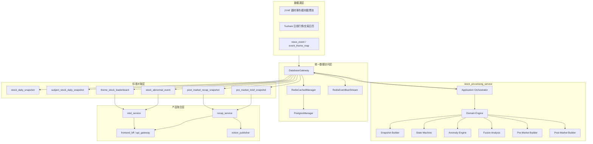

# stock_processing_service 架构设计方案（冻结评审稿）

## 1. 结论与路线

当前最稳路线：
- **并行新建 `stock_processing_service`** 作为严格遵守总架构的新生产链路。
- **保留旧 `stock_service`** 仅用于回退、对账、实验与脚本验证。
- 不在旧链路继续“打补丁式扩展”。

该路线同时对齐：
- 第一阶段总架构：`DatabaseGateway + Redis Streams + 服务分层`
- 第三阶段收口原则：`Gateway First / Domain Pure / Snapshot First / Event Driven / BFF Only`

---

## 2. 当前核心矛盾（必须先承认）

1. 第一阶段已定义 `database_service` 为统一 Postgres/Redis 入口，股票侧不应自持数据库实现细节。
2. 现有 `stock_service` 仍偏“测试期脚本化服务”：配置、编排、落地策略耦合。
3. 本地文件快照实现可用于采集调试，但不应作为产品对象层真源。
4. 字段所有权已有雏形（如 source contract），但尚未提升为系统级 ports/contracts 边界。
5. `database_service` 目前更像薄门面，股票域显式 API 还未冻结，存在业务层回退原始 SQL 的风险。

结论：问题不只是“谁连数据库”，而是“系统边界未完成收口”。

---

## 3. 总体目标

1. `stock_processing_service` 成为唯一“股票日频加工对象层”生产者。
2. 所有读写统一经 `database_service.DatabaseGateway` 显式领域方法。
3. 统一对象层真源，页面与报告只读快照，不请求时重算。
4. Redis 同时承担缓存、事件总线、幂等控制。
5. 双轨并行、可灰度、可快速回滚，零破坏迁移。

---

## 4. 硬边界（冻结）

### 4.1 两条纪律（强制）

1. **Application 只编排**：不做规则，不写 SQL，不碰 Redis/DB 客户端细节。
2. **Domain 只算业务**：只吃标准输入对象，输出标准结果对象，不依赖 gateway/asyncpg/缓存实现。

### 4.2 禁止项（强制）

- `stock_processing_service` 禁止 `import asyncpg`
- 禁止出现 SQL 字符串
- 禁止调用 `DatabaseGateway._client` / `_db`
- 禁止前端绕过 BFF 读取底层对象表

### 4.3 旧链路定位（冻结）

旧 `stock_service` 仅保留：
- 数据源适配器实验
- 原始落盘/调试快照
- 对账脚本
- 历史回放脚本
- 灰度回退输出

旧 `stock_service` 不再新增：
- 数据库读写逻辑
- SQL/repository
- 面向前端对象拼装
- 报告重算逻辑

---

## 5. 分层与模块结构（冻结）

```text
stock_processing_service/
  application/
    orchestrators/
    jobs/
    use_cases/
  domain/
    models/
    services/
    policies/
    scoring/
    state_machine/
  ports/
    read_ports.py
    write_ports.py
    cache_ports.py
    event_ports.py
    idempotency_ports.py
  infrastructure/
    gateway_adapters/
    cache_adapters/
    stream_adapters/
    serializers/
  contracts/
    dto/
    events/
    snapshots/
  tests/
```

---

## 6. 系统逻辑框图



---

## 7. 对象层冻结（第一批）

以下 6 个对象为前后端与报告统一真源：

1. `stock_daily_snapshot`
2. `subject_stock_daily_snapshot`
3. `stock_abnormal_event`
4. `theme_stock_leaderboard`
5. `pre_market_brief_snapshot`
6. `post_market_recap_snapshot`

每个对象必须包含：
- 主键（含 `trade_date`）
- 证据字段（规则命中、评分分解、原始依据摘要）
- 来源字段（source/source_trace）
- 生成批次（batch_id）
- 链路追踪（trace_id）

### 7.1 字段级最小 Schema（冻结）

| 对象 | 主键 | 最小必填字段 | 可空字段（示例） | 文档型对象 | Upsert 覆盖策略 |
| --- | --- | --- | --- | --- | --- |
| `stock_daily_snapshot` | `(trade_date, stock_id)` | `trade_date, stock_id, stock_name, close_price, pct_chg, volume, amount, limit_up_price, limit_down_price, snapshot_version` | `open_price, high_price, low_price, pre_close, source_trace_id` | 否 | 允许，同主键覆盖 |
| `subject_stock_daily_snapshot` | `(trade_date, subject_key, stock_id)` | `trade_date, subject_key, stock_id, subject_name, in_pool_flag, pool_rank, support_score, snapshot_version` | `stock_name, pct_chg, close_price, evidence_json` | 否 | 允许，同主键覆盖 |
| `stock_abnormal_event` | `(trade_date, stock_id, event_type)` | `trade_date, stock_id, event_type, event_score, evidence_rules, raw_metrics, snapshot_version` | `subject_key, subject_name, note` | 否 | 允许，同主键覆盖 |
| `theme_stock_leaderboard` | `(trade_date, subject_key, stock_id)` | `trade_date, subject_key, stock_id, leaderboard_rank, leader_score, score_breakdown, snapshot_version` | `stock_name, role_label, evidence_json` | 否 | 允许，同主键覆盖 |
| `pre_market_brief_snapshot` | `(trade_date, snapshot_version)` | `trade_date, snapshot_version, batch_id, trace_id, brief_doc` | `summary, risk_flags, source_trace_id` | 是（文档型） | 仅当新 batch 完整成功才覆盖“current” |
| `post_market_recap_snapshot` | `(trade_date, snapshot_version)` | `trade_date, snapshot_version, batch_id, trace_id, recap_doc` | `summary, conclusions, source_trace_id` | 是（文档型） | 仅当新 batch 完整成功才覆盖“current” |

约束说明：
- `snapshot_version` 为强制字段，用于版本切换与读一致性。
- `brief_doc/recap_doc` 采用 JSON 文档对象（文档型），不拆行为前端直接真源。

---

## 8. DatabaseGateway 股票域显式 API（冻结清单）

> 原则：`stock_processing_service` 只调用这些显式方法，不看表名，不碰 SQL。

### 8.1 读取类

- `get_trade_calendar(trade_date)`
- `get_stock_daily_bars(trade_date, stock_ids=None)`
- `get_stock_auction_snapshot(trade_date, stock_ids=None)`
- `get_subject_stock_pool_by_trade_date(trade_date)`
- `get_subject_context_by_subject_keys(subject_keys, trade_date)`
- `get_prior_stock_daily_snapshots(trade_date, lookback_days, stock_ids=None)`
- `get_existing_pre_market_brief_snapshot(trade_date)`
- `get_existing_post_market_recap_snapshot(trade_date)`

### 8.2 写入类

- `upsert_stock_daily_snapshot_rows(rows)`
- `upsert_subject_stock_daily_snapshot_rows(rows)`
- `upsert_stock_abnormal_event_rows(rows)`
- `upsert_theme_stock_leaderboard_rows(rows)`
- `upsert_pre_market_brief_snapshot(rows_or_doc)`
- `upsert_post_market_recap_snapshot(rows_or_doc)`

### 8.3 事件与幂等类

- `publish_stock_processing_event(event_name, payload)`
- `acquire_job_idempotency(job_key, ttl)`
- `mark_job_completed(job_key, metadata)`
- `record_dead_letter(event_name, payload, reason)`

### 8.4 约束

- `execute_query` 仅允许在 `database_service` 内部使用，不向业务服务暴露为常规路径。

### 8.5 DTO/协议约束（冻结）

1. 所有 `get_*` 方法返回 `contracts/dto/*`（禁止返回裸数据库行）。
2. 所有 `upsert_*` 方法接收 `contracts/snapshots/*`（禁止裸 `dict` 散写）。
3. 所有 `publish_*` 方法接收 `contracts/events/*`（统一 envelope，见 9.4）。
4. `stock_processing_service` 与 `database_service` 的交互协议必须以 `contracts` 为单一真源。

---

## 9. Redis 策略（缓存 + Stream + 幂等）

## 9.1 缓存 key 规范

- `sps:calendar:{trade_date}`
- `sps:subject_pool:{trade_date}`
- `sps:subject_context:{trade_date}:{subject_key}`
- `sps:stock_daily_snapshot:{trade_date}:{stock_id}`
- `sps:theme_leaderboard:{trade_date}:{subject_key}`
- `sps:pre_market_brief:{trade_date}`
- `sps:post_market_recap:{trade_date}`

## 9.2 TTL 建议

- 交易日历：7 天
- 题材池/题材上下文：交易日内 1-4 小时
- 日频快照与排行榜：交易日内常驻，收盘后重建
- 盘前/盘后报告对象：1-7 天
- 幂等键：2-24 小时（按任务窗口）

## 9.2.1 失效与版本切换（冻结）

1. `subject_pool / subject_context`  
- 当 JYHF 题材池增量同步完成时主动失效相关 key。  

2. `stock_daily_snapshot / theme_leaderboard`  
- 当对应交易日批次重建成功后，先写新版本 key，再原子切换 `current` 指针。  
- 禁止边计算边覆盖当前可读版本。  

3. `pre_market_brief / post_market_recap`  
- 仅当新 batch 全量成功时覆盖当前版本；失败时保持旧版本可读。  

## 9.3 Stream 建议

- `stream:stock:jobs:build_daily_snapshot`
- `stream:stock:jobs:build_pre_market_brief`
- `stream:stock:jobs:build_post_market_recap`
- `stream:stock:events:snapshot_built`
- `stream:stock:events:abnormal_detected`
- `stream:stock:events:leaderboard_updated`
- `stream:dead:letter`

## 9.4 Stream 统一事件 Envelope（冻结）

所有 `stock` 相关 stream 消息必须统一结构：

- `event_id`
- `event_name`
- `trade_date`
- `batch_id`
- `trace_id`
- `producer`
- `occurred_at`
- `payload_version`
- `payload`

说明：
- `payload` 为业务字段体；其 schema 由 `contracts/events/*` 定义。
- 消费者只能依赖 envelope + version 解析，禁止私有格式。

---

## 10. 迁移实施顺序（四步）

1. **先冻结对象层和 ports**
- 不先写实现，先评审并冻结对象字段与接口签名。

2. **先打通最小闭环（强势股/日频快照）**
- 路径：读取股票事实 + 题材池 -> 领域计算 -> upsert 快照 -> 发布 `snapshot_built`。

3. **再扩展异动标签 + 龙头榜**
- 强制输出证据字段，支持前端解释、AI 摘要和对账。

4. **最后接入 BFF 灰度切流**
- 页面级 feature flag；双轨同时跑，对账通过后再切流。

---

## 11. 对账与灰度

### 11.1 对账维度（最低要求）

- 股票数量
- 股票集合一致率
- 题材映射一致率（含中文名）
- 异动标签命中率
- 排行榜 TopN 一致率
- 缺失率/异常率

### 11.2 切流门槛

- 连续 N 个交易日（建议 >=5）核心指标达标
- 无 P1 数据缺失
- 可在 5 分钟内切回旧链路

### 11.3 差异样本落盘（强制）

每次双轨对账必须输出两类产物：
1. `summary`（总体一致率/缺失率/异常率）
2. `diff_samples.jsonl`（样本级差异）

`diff_samples.jsonl` 每条至少包含：
- 主键
- 旧链路值
- 新链路值
- 差异字段
- 差异原因分类（`缺失/计算偏差/映射不一致/延迟`）

---

## 12. 非功能要求

1. 性能：批量读写 + 热路径缓存 + 任务幂等。
2. 可观测：trace_id、步骤耗时、缓存命中率、失败率、重试率。
3. 可靠性：死信队列、失败重试、严格区分“无数据”与“失败”。

---

## 13. 验收标准（架构门禁）

1. `stock_processing_service` 内无 SQL、无 `asyncpg`、无 `_client/_db`。
2. 业务读写仅经 `DatabaseGateway` 冻结方法清单。
3. 前端仅经 `frontend_bff/api_gateway`。
4. 双轨对账通过后才允许切流。
5. 任何异常可在 5 分钟内回滚。

---

## 14. 下一步（本稿确认后）

### 14.1 程序设计前置门禁（未满足不得开工）

1. `contracts/snapshots` 字段冻结
2. `contracts/dto` 字段冻结
3. `contracts/events` envelope 冻结
4. `ports` 签名冻结
5. `DatabaseGateway` 股票域方法签名冻结
6. feature flag 名称与切流位置冻结

### 14.2 通过门禁后的执行顺序

1. 冻结 `ports` 与 `gateway` 签名后生成骨架代码。
2. 仅实现最小闭环用例（强势股/日频快照）。
3. 建立对账脚本（`summary + diff_samples.jsonl`）。
4. 接入 BFF feature flag，开始双轨灰度。
