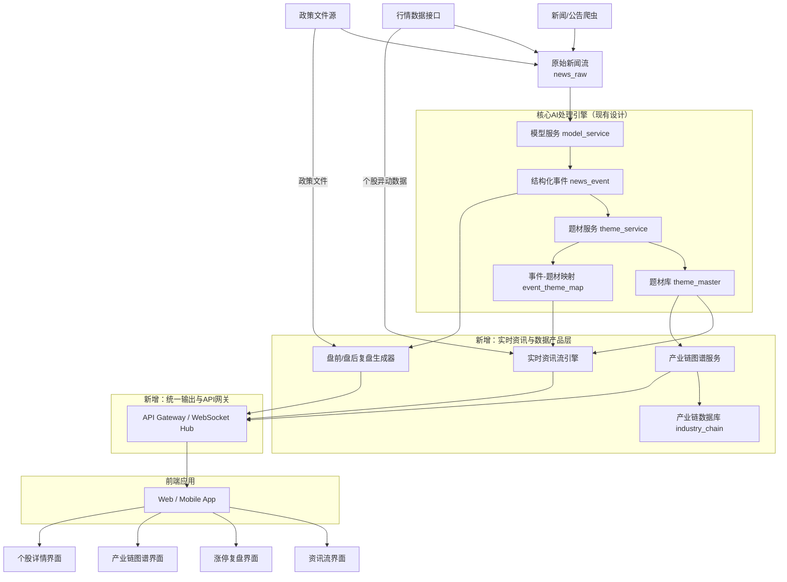
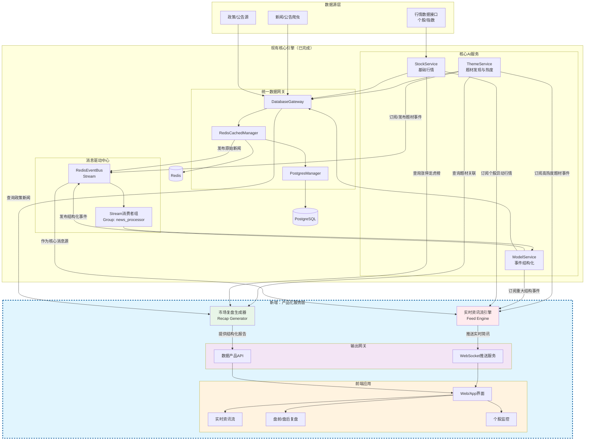

# 个人投资助理-项目架构设计（第三阶段：股票服务模块）

### **🔍 核心发现：现有架构与目标产品的差距**

您现有的设计是一个强大的**后台数据处理引擎**，专注于从新闻到题材的**自动化发现与量化**。然而，截图中的产品（如“当前必读”、“涨停复盘”）展现的是一个**面向投资者的、实时交互的终端数据产品**。两者之间存在关键的“最后一公里”差距，主要体现在产品形态和时效性上。

| **对比维度** | **您的现有设计方案** | **截图中的目标产品** |
| --- | --- | --- |
| **核心产品** | 题材知识库、热度API、生命周期状态 | **即时资讯流**、**盘前必读**、**涨停复盘**、**龙虎榜**、**产业链图谱** |
| **数据时效** | 批次处理（T+1或分钟级） | **秒级/实时** 推送与更新 |
| **交互形态** | 以提供结构化数据接口为主 | **强交互前端**：时间线、表格、标签筛选、详情钻取 |
| **数据广度** | 集中于新闻事件驱动的题材 | 扩展至**个股行情、资金面、政策公告、产业链**等多维度数据 |

### **🚀 新增核心模块设计方案**

为了弥补上述差距，建议在现有架构前端新增一个 **“实时资讯与监控服务”（Real-time Feed & Monitoring Service）** ，直接面向最终用户。以下是三个关键子模块的设计。

### **1. 实时资讯流引擎 (Real-time Feed Engine)**

此模块负责聚合所有信号，生成类似截图首页的时间线动态。

- **数据源**：
    - 接入现有 `theme_service` 产出的**高热度题材事件**。
    - 接入行情数据源的**个股异动**（快速涨跌、放量）。
    - 接入原始新闻流中的**重大政策/公告**。
- **处理逻辑**：
    - **优先级排序**：综合事件的热度值、影响范围、时效性进行动态排序。
    - **动态摘要生成**：利用现有`model_service`的能力，为每个推送项生成类似“【驱动事件】...”的简洁摘要。
    - **富标签标记**：自动标记“新题材”、“涨停”、“政策”等标签，便于前端高亮显示。
- **输出**：提供低延迟的WebSocket或Server-Sent Events (SSE)接口，向前端推送结构化的资讯流条目。

### **2. 盘前/盘后复盘生成器 (Market Recap Generator)**

此模块自动化生成截图中的“当前必读”、“涨停复盘”等结构化报告。

- **盘前必读**：
    - **触发**：每个交易日早上定时运行。
    - **逻辑**：扫描前一日晚间至当日凌晨的**政策公告**（如截图中的“广州商业航天”规划）、**重要公司新闻**、**外围市场重大动态**。
    - **生成**：调用大模型（复用`model_service`）对信息进行摘要、归纳，并结构化输出为“1、2、3...”的列表。
- **涨停复盘**：
    - **触发**：每日收盘后运行。
    - **逻辑**：连接当日涨停板数据，与`theme_service`中的题材库进行关联。
    - **生成**：自动生成“热门题材复盘”表格，统计各题材的**涨停家数、连板高度、龙头个股**（如“引力传媒5天4板”），并计算题材强度。

### **3. 产业链图谱服务 (Industry Chain Graph Service)**

此模块对应截图中的“机器人”等详细产业链分解页面，将题材落地到具体投资标的。

- **数据建设**：
    - 在现有`theme_master`（题材库）基础上，新增 `industry_chain`（产业链） 和 `chain_component`（产业链环节） 表，建立“题材 - 产业链 - 环节 - 个股”的层级关系。
    - 示例：题材“机器人” -> 产业链“减速器” -> 环节“谐波减速器” -> 个股“绿的谐波”。
- **服务接口**：
    - 提供查询接口，返回某个题材的完整树状产业链结构及各环节对应的股票列表。
    - 提供关联接口，查询某只股票属于哪些题材的哪些产业链环节。

### **⚙️ 关键优化与集成方案**

在新增模块的同时，需对现有架构进行关键优化以确保新需求得以满足。

1. **现有架构的性能与时效性优化**
    - **`theme_service` 热度计算实时化**：将部分批处理的热度计算改为基于事件的**增量实时计算**，确保当重要新闻出现时，相关题材热度能秒级更新并触发资讯流推送。
    - **`LocalThemeMatcher` 匹配加速**：为高频出现的概念（如“AI”、“航天”）建立内存级缓存，减少实时匹配的延迟。
2. **数据融合与关联**
    - 建立一个 **“全局实体关联服务”** ，将`news_event`中的公司、概念，与行情系统中的股票代码、产业链环节中的公司进行精准关联。这是实现“事件->题材->个股”无缝串联的基础。
3. **前端架构建议**
    - 采用组件化设计，封装 **“资讯流卡片”**、**“复盘表格”**、**“产业链树”** 等业务组件，以快速构建截图所示的多类页面。

### **📊 演进路线图建议**

建议分阶段实施，以快速验证核心价值：

- **第一阶段（核心体验闭环）**：优先开发 **“实时资讯流引擎”** 和前端展示。这能最快地将现有`theme_service`的成果转化为用户可感知的产品，验证市场关注点。
- **第二阶段（深化专业价值）**：开发 **“盘前/盘后复盘生成器”**。这能显著提升产品的工具属性和每日必读价值，增强用户粘性。
- **第三阶段（构建壁垒）**：建设 **“产业链图谱服务”**。这是一个需要持续积累的高价值数据工程，能形成独特的知识壁垒和深度分析能力。

### **🆕 架构图核心新增部分解读**

图中标红部分为建议**新增**的核心模块，它们共同构成了面向用户的数据产品层：

1. **实时资讯流引擎**
    - **位置**：位于`theme_service`之后，作为热数据的首次聚合出口。
    - **输入**：高热度`news_event`、实时行情异动。
    - **功能**：进行**秒级优先级排序**，生成带摘要和标签的推送条目。
2. **盘前/盘后复盘生成器**
    - **位置**：作为一个定时/事件触发的分析服务。
    - **输入**：前日的重大`news_event`、涨停板行情数据。
    - **功能**：调用模型**生成结构化报告**（如“1, 2, 3”要点列表、涨停统计表格）。
3. **产业链图谱服务**
    - **位置**：与`theme_service`并列，专注于实体关系拓展。
    - **输入**：`theme_master`题材库、外部产业链知识。
    - **功能**：构建和管理**“题材-产业链-环节-个股”** 的树状知识图谱，并提供查询API。
4. **统一输出与API网关**
    - **位置**：所有后端服务的总出口。
    - **功能**：聚合上述所有服务的接口，提供**一致的API和实时WebSocket连接**，是前后端解耦的关键。

### **🔗 关键数据流与优化点**

为了支撑新增模块，需要特别关注以下**数据流优化**：

- **实时性提升**：`theme_service`的热度计算需要支持**增量更新**，确保重要事件能秒级触发资讯流。
- **数据关联**：需建立**“全局实体解析器”**，确保从新闻中提取的公司名、概念能精准关联到股票代码和产业链环节，这是串联所有模块的“粘合剂”。
- **前端组件化**：对应新增的数据产品，前端应封装**资讯卡片、复盘表格、图谱树**等业务组件，以快速构建页面。



### **架构图核心解读**

**红色虚线框部分为建议新增的核心模块**，它们将您的AI处理引擎转化为面向用户的数据产品：

1. **实时资讯流引擎** - 核心产品化输出
- **输入**：高热度题材事件 + 实时行情异动
- **处理**：秒级优先级排序，生成带摘要的推送卡片
- **对应截图功能**：首页时间线资讯流（如"09:37 AI应用 +2.39%"）
1. **盘前/盘后复盘生成器** - 专业价值深化
- **输入**：前日重大事件 + 涨停板数据
- **处理**：定时分析，生成结构化复盘报告
- **对应截图功能**："当前必读"、"涨停复盘"、"龙虎榜"
1. **产业链图谱服务** - 知识壁垒构建
- **输入**：题材库 + 产业链知识
- **处理**：构建"题材-产业链-环节-个股"树状图谱
- **对应截图功能**："机器人"产业链分解页面
1. **统一输出网关** - 架构解耦关键
- **作用**：聚合所有服务接口，提供一致的数据出口
- **技术**：REST API + WebSocket实时推送

### **关键架构决策点**

1. **数据流优化**：`theme_service`需支持**增量实时热度计算**，确保资讯流秒级响应
2. **实体关联**：需建立**全局实体解析器**，统一新闻中的公司名与股票代码的映射关系
3. **前端架构**：建议采用组件化设计，封装"资讯卡片"、"复盘表格"等业务组件

### **演进实施建议**

按照价值递进顺序实施：

1. **第一阶段**：先实现`实时资讯流引擎` + 基础前端，快速验证用户价值
2. **第二阶段**：增加`复盘生成器`，提升产品专业度和用户粘性
3. **第三阶段**：建设`产业链图谱`，形成长期数据壁垒

### **架构调整核心：打通现有引擎到产品界面**

这个修正后的架构图准确地建立在您已完成的 **Redis Stream + PostgreSQL 数据管道** 之上。关键在于新增的 **“产品化与输出层”** ，它的作用是将您后台强大的数据处理能力，转化为截图中所见的、用户可交互的终端产品。以下是三个核心新增模块的详细设计思路：

**1. 实时资讯流引擎 (Real-time Feed Engine)**

- **定位**：作为现有 `RedisEventBus` 的一个**智能消费者**。
- **输入**：同时订阅来自 `ThemeService`（高热度题材）、`ModelService`（重大事件）、`StockService`（行情异动）的消息流。
- **核心逻辑**：对多源信息进行**实时融合、去重、优先级排序**，并调用大模型生成简讯摘要。
- **输出**：生产结构化的资讯条目，通过 `WebSocket服务` 推送到前端，形成截图中的时间线。

**2. 市场复盘生成器 (Market Recap Generator)**

- **定位**：一个**定时/事件触发**的分析任务。
- **输入**：
    - **盘前**：通过 `DatabaseGateway` 查询前夜的政策、公告类新闻。
    - **盘后**：通过 `StockService` 获取当日涨停、龙虎榜数据，并通过 `ThemeService` 获取题材关联。
- **核心逻辑**：汇总数据后，调用 `ModelService` 的摘要与归纳能力，自动化生成如截图所示的结构化报告（“1, 2, 3…”要点列表和涨停统计表）。

**3. 产业链图谱服务 (Industry Chain Service)**

- **定位**：一个独立的**知识图谱管理服务**。
- **数据构建**：需要新建 `industry_chain` 表，与现有 `theme_master` 关联，人工或半自动地维护“题材 -> 产业链 -> 细分环节 -> 成分股”的树状关系。
- **输出**：提供API，为前端“机器人”那样的详情页提供完整的树形结构数据。

### **⚙️ 关键集成点与数据流**

为确保新增模块与现有架构无缝集成，需重点关注以下数据流：

1. **资讯流的实时性**：`ThemeService` 在计算热度或发现新题材时，不仅写库，还需通过 `RedisEventBus` 发布一个**事件消息**，从而被 `实时资讯流引擎` 实时消费。
2. **复盘的数据聚合**：`Market Recap Generator` 需要能通过统一的 `DatabaseGateway` 查询 `news_raw`、`news_event`、`theme_master` 以及行情数据库，这要求 `DatabaseGateway` 已适配这些表的访问。
3. **实体标识统一**：这是所有模块联动的基石。必须确保 `ModelService` 从新闻中提取的“公司名称”，与 `StockService` 和产业链库中的“股票代码”能准确映射。建议在 `DatabaseGateway` 层之上建立一个 **“实体归一化”** 服务。



### **架构解读：如何从数据引擎到信息产品**

这个架构图的核心是 **“产品化服务层”** ，它由两个关键的新服务和统一的输出网关构成，将您后台的实时数据流转化为用户可直接消费的信息产品。

**1. 实时资讯流引擎**

- **角色**：它是您现有 `RedisEventBus` 的 **“终极消费者”** 和 **“信息编辑”**。
- **工作流**：同时订阅 `ModelService`（重大事件）、`ThemeService`（热门题材）、`StockService`（行情异动）等多个 `Stream`，进行**多源信息融合**。然后，它对事件进行智能排序（例如，将“新题材诞生”和“龙头股涨停”置顶），并调用模型生成类似截图中的精炼摘要（`【驱动事件】...`），最终通过 `WebSocket服务` 实时推送到前端界面。

**2. 市场复盘生成器**

- **角色**：它是一个 **“定时分析师”** ，负责生成每日的总结报告。
- **工作流**：
    - **盘前必读**：在交易日早上，通过 `DatabaseGateway` 查询夜间的重要政策和公司公告，生成要点列表。
    - **盘后复盘**：收盘后，从 `StockService` 获取涨停板、龙虎榜数据，并联合 `ThemeService` 分析题材强度，自动生成“涨停家数”、“连板高度”等结构化表格。
- **输出**：其结果通过 `数据产品API` 提供给前端，形成“当前必读”和“涨停复盘”页面。

**3. 统一输出网关**

- **作用**：对前端提供一致且高效的访问方式。`WebSocket推送服务`负责处理高并发的实时资讯流，而 `数据产品API` 则提供复盘报告等准实时数据查询，实现动静分离。

### **🎯 核心集成与优化点**

1. **事件驱动是关键**：确保 `ThemeService` 在计算热度或发现新题材时，不仅更新数据库，也向 `RedisEventBus` 发布一个类型为 `theme.hot` 或 `theme.new` 的事件，这样才能被 `实时资讯流引擎` 实时捕获。
2. **复用模型能力**：`实时资讯流引擎` 和 `市场复盘生成器` 在生成文本摘要时，应通过内部接口调用现有的 `ModelService`，而不是重复建设，确保分析能力的一致性。
3. **前端组件化**：前端应根据这两种数据形态（流式推送 vs. 文档报告），封装“资讯卡片”和“复盘表格”等专用组件，以快速构建截图中的各类页面。

# **Stock Service 模块详细技术实施方案**

## **1. 模块架构总览**

### **1.1 模块定位与技术挑战**

**核心定位**：Stock Service 是系统的"市场信号翻译器"，负责：

1. **实时行情处理**：秒级行情数据采集、标准化、分发
2. **市场状态识别**：涨停/跌停判断、连板计算、异动监控
3. **资金行为分析**：龙虎榜解析、主力资金流向
4. **融合分析服务**：个股-题材关联、龙头股识别

**技术挑战**：

- **高并发**：支持 5000+ 只股票实时行情（3秒/次 ≈ 600QPS）
- **低延迟**：从行情接收到事件发布 < 100ms
- **状态复杂**：A股特殊规则（ST、新股、复牌股等）
- **数据质量**：多数据源适配与数据校验

### **1.2 核心架构设计**

## **2. 核心子模块详细设计**

### **2.1 行情网关适配器 (QuoteGateway)**

### **2.1.1 架构设计**

python

```
# 统一行情适配器设计
class UnifiedQuoteGateway:
    """统一行情网关，支持多数据源"""

    def __init__(self):
        self.adapters = {
            'tencent': TencentAdapter(),
            'sina': SinaAdapter(),
            'jqdata': JQDataAdapter(),
            'tushare': TushareAdapter()
        }
        self.active_adapter = None
        self.fallback_chain = ['tencent', 'sina', 'jqdata']

    async def get_realtime_quotes(self, symbols: List[str]) -> List[StandardQuote]:
        """获取实时行情（标准化输出）"""
        for adapter_name in self.fallback_chain:
            try:
                adapter = self.adapters[adapter_name]
                raw_data = await adapter.fetch_realtime(symbols)
                standardized = self._standardize_quotes(raw_data)

                # 数据质量校验
                if self._validate_data_quality(standardized):
                    self.active_adapter = adapter_name
                    return standardized
            except Exception as e:
                logger.warning(f"Adapter{adapter_name} failed:{e}")
                continue

        raise QuoteGatewayError("All adapters failed")

    def _standardize_quotes(self, raw_data: dict) -> List[StandardQuote]:
        """标准化行情数据结构"""
        return [
            StandardQuote(
                symbol=item['code'],
                name=item['name'],
                last_price=float(item['price']),
                change_percent=float(item['percent']),
                volume=int(item['volume']),
                amount=float(item['amount']),
                bid_price=float(item.get('bid', 0)),
                ask_price=float(item.get('ask', 0)),
                timestamp=datetime.fromtimestamp(item['timestamp']),
                # 分时数据
                time_series=item.get('time_series', []),
                # Level2数据（如果可用）
                level2=item.get('level2', {})
            )
            for item in raw_data
        ]
```

### **2.1.2 连接管理与心跳机制**

python

```
class QuoteConnectionManager:
    """行情连接管理器"""

    def __init__(self):
        self.connections = {}
        self.heartbeat_interval = 30  # 秒
        self.timeout_threshold = 60   # 秒

    async def maintain_connection(self, adapter_name: str):
        """维护连接健康状态"""
        while True:
            try:
                adapter = self.adapters[adapter_name]

                # 发送心跳
                is_alive = await adapter.heartbeat()

                if not is_alive:
                    await self._reconnect(adapter_name)
                else:
                    # 更新连接状态
                    self.connections[adapter_name] = {
                        'last_heartbeat': time.time(),
                        'status': 'healthy'
                    }

            except Exception as e:
                logger.error(f"Heartbeat failed for{adapter_name}:{e}")
                await self._switch_to_fallback(adapter_name)

            await asyncio.sleep(self.heartbeat_interval)

    async def _reconnect(self, adapter_name: str):
        """重连逻辑"""
        max_retries = 3
        for attempt in range(max_retries):
            try:
                await self.adapters[adapter_name].reconnect()
                logger.info(f"Reconnected to{adapter_name}")
                return True
            except Exception as e:
                logger.warning(f"Reconnect attempt{attempt+1} failed:{e}")
                await asyncio.sleep(2 ** attempt)  # 指数退避

        logger.error(f"Failed to reconnect to{adapter_name}")
        return False
```

### **2.2 股票状态机 (StockStateMachine)**

### **2.2.1 核心状态判断算法**

python

```
class StockStateMachine:
    """股票交易状态判断机"""

    # A股特殊规则定义
    RULES = {
        'NORMAL': {'limit_up': 0.10, 'limit_down': -0.10},
        'ST': {'limit_up': 0.05, 'limit_down': -0.05},
        'NEW_SHARE': {  # 新股首日规则
            'first_day': {'limit_up': 0.44, 'limit_down': -0.36},
            'subsequent_days': {'limit_up': 0.10, 'limit_down': -0.10}
        },
        'RESUME': {  # 复牌股
            'first_day': {'limit_up': 1.00, 'limit_down': -1.00}  # 不设涨跌幅限制
        }
    }

    def __init__(self):
        self.stock_info_cache = {}  # 缓存股票基本信息
        self.state_history = {}     # 状态历史记录

    async def calculate_stock_state(self, quote: StandardQuote) -> StockState:
        """计算股票当前状态"""
        # 1. 获取股票基本信息
        stock_info = await self._get_stock_info(quote.symbol)

        # 2. 确定适用规则
        rule = self._determine_rule(stock_info, quote)

        # 3. 计算涨跌停价格
        limit_prices = self._calculate_limit_prices(quote, rule, stock_info)

        # 4. 判断当前状态
        current_state = self._judge_current_state(quote, limit_prices)

        # 5. 更新连板信息
        if current_state.status == 'LIMIT_UP':
            await self._update_limit_chain(quote, current_state)

        # 6. 记录状态转换
        await self._record_state_transition(quote, current_state)

        return current_state

    def _determine_rule(self, stock_info: dict, quote: StandardQuote) -> dict:
        """确定适用的涨跌停规则"""
        symbol = quote.symbol

        if stock_info.get('is_st', False):
            return self.RULES['ST']

        if stock_info.get('is_new', False):
            listing_date = stock_info['listing_date']
            if quote.timestamp.date() == listing_date:
                return self.RULES['NEW_SHARE']['first_day']
            else:
                return self.RULES['NEW_SHARE']['subsequent_days']

        if stock_info.get('is_resumed', False):
            resume_date = stock_info['resume_date']
            if quote.timestamp.date() == resume_date:
                return self.RULES['RESUME']['first_day']

        return self.RULES['NORMAL']

    def _judge_current_state(self, quote: StandardQuote, limit_prices: dict) -> StockState:
        """判断当前交易状态"""
        price = quote.last_price
        prev_close = quote.prev_close

        # 判断涨停
        if price >= limit_prices['limit_up']:
            # 检查是否为"一字板"
            if quote.open_price >= limit_prices['limit_up']:
                board_type = '一字板'
            else:
                board_type = '换手板'

            return StockState(
                status='LIMIT_UP',
                board_type=board_type,
                limit_price=limit_prices['limit_up'],
                strength=self._calculate_limit_strength(quote)
            )

        # 判断跌停
        elif price <= limit_prices['limit_down']:
            return StockState(
                status='LIMIT_DOWN',
                limit_price=limit_prices['limit_down']
            )

        # 检查炸板状态
        elif self._check_board_broken(quote, limit_prices):
            return StockState(
                status='BOARD_BROKEN',
                broken_time=quote.timestamp
            )

        # 正常交易状态
        else:
            return StockState(
                status='NORMAL',
                change_percent=quote.change_percent
            )

    def _calculate_limit_strength(self, quote: StandardQuote) -> float:
        """计算涨停强度"""
        # 强度 = 封单金额 / 流通市值 * 系数
        bid_amount = quote.bid_volume * quote.last_price
        circulating_market_cap = quote.circulating_market_cap

        if circulating_market_cap > 0:
            strength = (bid_amount / circulating_market_cap) * 100
            return min(strength, 100)  # 限制在0-100之间
        return 0
```

### **2.2.2 连板计算引擎**

python

```
class LimitChainCalculator:
    """连板计算引擎"""

    def __init__(self):
        self.chain_cache = LRUCache(maxsize=1000)

    async def calculate_limit_chain(self, symbol: str, current_state: StockState) -> LimitChain:
        """计算连板信息"""
        # 从缓存获取历史记录
        history = self.chain_cache.get(symbol, [])

        if current_state.status == 'LIMIT_UP':
            # 判断是否延续连板
            if self._is_chain_continued(history, current_state):
                chain_days = len(history) + 1

                # 更新历史记录
                history.append({
                    'date': current_state.timestamp.date(),
                    'state': current_state,
                    'type': current_state.board_type
                })
                self.chain_cache[symbol] = history
            else:
                # 新连板开始
                chain_days = 1
                history = [{
                    'date': current_state.timestamp.date(),
                    'state': current_state,
                    'type': current_state.board_type
                }]
                self.chain_cache[symbol] = history
        else:
            # 连板中断
            chain_days = 0
            self.chain_cache.pop(symbol, None)

        return LimitChain(
            symbol=symbol,
            chain_days=chain_days,
            chain_type=self._determine_chain_type(history),
            history=history,
            total_gain=self._calculate_total_gain(history)
        )

    def _determine_chain_type(self, history: List[dict]) -> str:
        """判断连板类型"""
        if not history:
            return 'NONE'

        board_types = [item['type'] for item in history]

        if all(t == '一字板' for t in board_types):
            return 'STRONG_ONE_WORD'  # 强一字
        elif '一字板' in board_types:
            return 'MIXED'  # 混合板
        else:
            return 'NORMAL_CHANGE_HANDS'  # 纯换手

    def _calculate_total_gain(self, history: List[dict]) -> float:
        """计算连板期间总涨幅"""
        if len(history) < 2:
            return 0

        first_price = history[0]['state'].prev_close
        last_price = history[-1]['state'].last_price

        return ((last_price - first_price) / first_price) * 100
```

### **2.3 异动监控引擎 (AnomalyMonitor)**

### **2.3.1 规则引擎设计**

python

```
class AnomalyRuleEngine:
    """异动规则引擎"""

    RULES = {
        # 涨速规则
        'QUICK_RISE_1MIN': {
            'condition': lambda q: q.change_percent_1min > 2.0,
            'priority': 'HIGH',
            'message': '1分钟涨超2%',
            'cool_down': 300  # 5分钟冷却
        },
        'QUICK_RISE_5MIN': {
            'condition': lambda q: q.change_percent_5min > 5.0,
            'priority': 'HIGH',
            'message': '5分钟涨超5%',
            'cool_down': 600  # 10分钟冷却
        },

        # 量比规则
        'VOLUME_SURGE': {
            'condition': lambda q: q.volume_ratio > 10 and q.amount > 10000000,
            'priority': 'MEDIUM',
            'message': '量比大于10且成交额过千万',
            'cool_down': 300
        },

        # 突破规则
        'BREAK_HIGH_20D': {
            'condition': lambda q: q.last_price > q.high_20d and q.volume > q.avg_volume_20d * 1.5,
            'priority': 'MEDIUM',
            'message': '突破20日新高',
            'cool_down': 1800  # 30分钟冷却
        },
        'BREAK_LOW_20D': {
            'condition': lambda q: q.last_price < q.low_20d,
            'priority': 'LOW',
            'message': '跌破20日新低',
            'cool_down': 1800
        },

        # 资金规则
        'LARGE_ORDER': {
            'condition': lambda q: q.large_order_ratio > 0.3,
            'priority': 'HIGH',
            'message': '大单占比超30%',
            'cool_down': 300
        },

        # 技术指标规则
        'RSI_OVERBOUGHT': {
            'condition': lambda q: q.rsi_14 > 80,
            'priority': 'LOW',
            'message': 'RSI超买',
            'cool_down': 1800
        },
        'RSI_OVERSOLD': {
            'condition': lambda q: q.rsi_14 < 20,
            'priority': 'LOW',
            'message': 'RSI超卖',
            'cool_down': 1800
        }
    }

    def __init__(self):
        self.rule_cooldowns = {}  # 规则冷却时间记录
        self.anomaly_history = []  # 异动历史记录

    async def check_anomalies(self, quote: StandardQuote) -> List[AnomalyAlert]:
        """检查异动规则"""
        alerts = []

        for rule_name, rule_config in self.RULES.items():
            # 检查冷却时间
            if self._is_in_cooldown(quote.symbol, rule_name):
                continue

            # 检查条件
            if rule_config['condition'](quote):
                alert = AnomalyAlert(
                    symbol=quote.symbol,
                    rule_name=rule_name,
                    priority=rule_config['priority'],
                    message=rule_config['message'],
                    data={
                        'price': quote.last_price,
                        'change_percent': quote.change_percent,
                        'volume': quote.volume,
                        'timestamp': quote.timestamp
                    },
                    timestamp=datetime.now()
                )

                alerts.append(alert)

                # 设置冷却时间
                self._set_cooldown(quote.symbol, rule_name, rule_config['cool_down'])

                # 记录历史
                self._record_anomaly(alert)

        return alerts

    def _is_in_cooldown(self, symbol: str, rule_name: str) -> bool:
        """检查是否在冷却期内"""
        key = f"{symbol}:{rule_name}"
        if key in self.rule_cooldowns:
            cooldown_until = self.rule_cooldowns[key]
            return datetime.now() < cooldown_until
        return False

    def _set_cooldown(self, symbol: str, rule_name: str, seconds: int):
        """设置冷却时间"""
        key = f"{symbol}:{rule_name}"
        self.rule_cooldowns[key] = datetime.now() + timedelta(seconds=seconds)
```

### **2.3.2 智能过滤与聚合**

python

```
class SmartAnomalyFilter:
    """智能异动过滤器"""

    def __init__(self):
        self.symbol_filters = {}
        self.cluster_detector = AnomalyClusterDetector()

    async def filter_and_aggregate(self, alerts: List[AnomalyAlert]) -> List[AggregatedAlert]:
        """过滤和聚合异动"""
        if not alerts:
            return []

        # 1. 按规则优先级排序
        sorted_alerts = sorted(alerts, key=lambda x: self._get_priority_score(x.priority), reverse=True)

        # 2. 去除重复/相似异动
        filtered_alerts = self._deduplicate_alerts(sorted_alerts)

        # 3. 检测异动集群
        clusters = await self.cluster_detector.detect(filtered_alerts)

        # 4. 聚合生成最终告警
        aggregated = []
        for cluster in clusters:
            if cluster.significance_score > 0.7:  # 显著性阈值
                aggregated.append(
                    AggregatedAlert.from_cluster(cluster)
                )

        return aggregated

    def _deduplicate_alerts(self, alerts: List[AnomalyAlert]) -> List[AnomalyAlert]:
        """去重相似异动"""
        seen = set()
        deduped = []

        for alert in alerts:
            # 生成唯一标识
            alert_key = self._generate_alert_key(alert)

            if alert_key not in seen:
                seen.add(alert_key)
                deduped.append(alert)

        return deduped

    def _generate_alert_key(self, alert: AnomalyAlert) -> str:
        """生成异动唯一标识"""
        # 基于：股票 + 规则类型 + 时间窗口
        timestamp_key = alert.timestamp.strftime("%Y%m%d%H%M")
        return f"{alert.symbol}:{alert.rule_name}:{timestamp_key}"
```

### **2.4 龙虎榜解析器 (DragonTigerParser)**

### **2.4.1 数据采集与解析**

python

```
class DragonTigerParser:
    """龙虎榜数据解析器"""

    def __init__(self):
        self.data_sources = {
            'sse': 'http://www.sse.com.cn/disclosure/diclosure/public/',
            'szse': 'http://www.szse.cn/disclosure/diclosure/public/',
            'juchao': 'http://www.cninfo.com.cn/new/commonUrl/pageOfSearch?url=disclosure/list/search'
        }
        self.seat_patterns = {
            '机构专用': 'INSTITUTION',
            '深股通专用': 'CONNECT_NORTH',
            '沪股通专用': 'CONNECT_NORTH',
            '营业部': 'BROKER',
            '游资': 'HOT_MONEY'
        }

    async def parse_daily_lhb(self, date: datetime) -> List[DragonTigerRecord]:
        """解析当日龙虎榜数据"""
        records = []

        for exchange, url in self.data_sources.items():
            try:
                raw_data = await self._fetch_lhb_data(exchange, date)
                parsed = self._parse_exchange_data(raw_data, exchange)
                records.extend(parsed)
            except Exception as e:
                logger.error(f"Failed to parse LHB for{exchange}:{e}")
                continue

        # 数据校验和去重
        validated = await self._validate_records(records)

        # 计算资金分析指标
        enriched = await self._enrich_with_analysis(validated)

        return enriched

    def _parse_exchange_data(self, raw_data: dict, exchange: str) -> List[DragonTigerRecord]:
        """解析交易所原始数据"""
        records = []

        for item in raw_data.get('data', []):
            # 解析席位类型
            seat_type = self._identify_seat_type(item['seat_name'])

            record = DragonTigerRecord(
                stock_code=item['stock_code'],
                stock_name=item['stock_name'],
                exchange=exchange,
                seat_name=item['seat_name'],
                seat_type=seat_type,
                buy_amount=float(item['buy_amount']),
                sell_amount=float(item['sell_amount']),
                net_amount=float(item['buy_amount']) - float(item['sell_amount']),
                date=datetime.strptime(item['date'], '%Y-%m-%d'),
                reason=item.get('reason', ''),
                rank=item.get('rank', 0)
            )

            records.append(record)

        return records

    def _identify_seat_type(self, seat_name: str) -> str:
        """识别席位类型"""
        for pattern, seat_type in self.seat_patterns.items():
            if pattern in seat_name:
                return seat_type

        # 智能识别
        if any(keyword in seat_name for keyword in ['基金', '保险', '券商资管']):
            return 'INSTITUTION'
        elif any(keyword in seat_name for keyword in ['证券', '营业部']):
            return 'BROKER'
        else:
            return 'UNKNOWN'

    async def _enrich_with_analysis(self, records: List[DragonTigerRecord]) -> List[EnrichedDragonTigerRecord]:
        """丰富龙虎榜数据"""
        enriched_records = []

        for record in records:
            # 1. 计算历史表现
            historical = await self._analyze_historical_performance(record)

            # 2. 计算资金影响力
            influence_score = self._calculate_influence_score(record)

            # 3. 关联题材分析
            theme_relation = await self._analyze_theme_relation(record)

            enriched = EnrichedDragonTigerRecord(
                **record.__dict__,
                historical_performance=historical,
                influence_score=influence_score,
                theme_relation=theme_relation,
                overall_rating=self._calculate_overall_rating(record, historical, influence_score)
            )

            enriched_records.append(enriched)

        return enriched_records
```

### **2.5 融合分析服务 (FusionAnalysisService)**

### **2.5.1 个股-题材关联分析**

python

```
class StockThemeAnalyzer:
    """个股-题材关联分析器"""

    def __init__(self, theme_service_client):
        self.theme_service = theme_service_client
        self.cache = {}

    async def analyze_stock_themes(self, stock_code: str,
                                   lookback_days: int = 30) -> StockThemeAnalysis:
        """分析个股的题材关联"""
        # 1. 获取股票基础信息
        stock_info = await self._get_stock_info(stock_code)

        # 2. 获取近期市场表现
        market_performance = await self._get_recent_performance(stock_code, lookback_days)

        # 3. 查询相关题材
        related_themes = await self.theme_service.get_themes_by_stock(stock_code)

        # 4. 计算关联强度
        theme_strengths = []
        for theme in related_themes:
            strength = await self._calculate_theme_strength(
                stock_code, theme, market_performance
            )

            if strength > 0.3:  # 关联强度阈值
                theme_strengths.append({
                    'theme': theme,
                    'strength': strength,
                    'contribution': self._calculate_contribution(stock_code, theme)
                })

        # 5. 识别龙头属性
        is_leader = await self._identify_leader_status(stock_code, theme_strengths)

        return StockThemeAnalysis(
            stock_code=stock_code,
            stock_name=stock_info['name'],
            related_themes=theme_strengths,
            is_theme_leader=is_leader,
            leader_score=self._calculate_leader_score(is_leader, theme_strengths),
            analysis_timestamp=datetime.now()
        )

    async def _calculate_theme_strength(self, stock_code: str,
                                        theme: ThemeInfo,
                                        market_performance: dict) -> float:
        """计算个股与题材的关联强度"""
        # 因子1: 涨幅相关性
        correlation = self._calculate_correlation(
            stock_performance=market_performance['returns'],
            theme_performance=theme.performance_data
        )

        # 因子2: 事件触发次数
        event_count = await self._count_theme_events(stock_code, theme.id)

        # 因子3: 资金跟随度
        capital_follow = self._calculate_capital_follow(
            stock_code, theme.id, market_performance
        )

        # 综合计算
        strength = (
            correlation * 0.4 +
            (min(event_count, 10) / 10) * 0.3 +
            capital_follow * 0.3
        )

        return max(0, min(1, strength))

    async def _identify_leader_status(self, stock_code: str,
                                      theme_strengths: List[dict]) -> dict:
        """识别龙头状态"""
        leader_info = {}

        for item in theme_strengths:
            theme = item['theme']
            strength = item['strength']

            # 获取该题材下的所有股票
            theme_stocks = await self.theme_service.get_stocks_by_theme(theme.id)

            # 计算该股票在题材中的排名
            ranking = await self._calculate_theme_ranking(stock_code, theme_stocks)

            if ranking['position'] <= 3:  # 前3名视为龙头候选
                leader_info[theme.id] = {
                    'rank': ranking['position'],
                    'score': ranking['score'],
                    'attributes': self._extract_leader_attributes(stock_code, theme_stocks)
                }

        return leader_info
```

### **2.5.2 龙头股识别算法**

python

```
class LeaderStockIdentifier:
    """龙头股识别器"""

    def __init__(self):
        self.metrics_weights = {
            'price_strength': 0.25,      # 价格强度
            'volume_leadership': 0.20,   # 量能领导力
            'timing_advantage': 0.15,    # 时机优势
            'capital_preference': 0.20,   # 资金偏好
            'theme_purity': 0.10,        # 题材纯度
            'market_influence': 0.10     # 市场影响力
        }

    async def identify_leader_stocks(self, theme_id: str,
                                     candidate_count: int = 5) -> List[LeaderCandidate]:
        """识别题材龙头股"""
        # 1. 获取题材相关股票
        theme_stocks = await self._get_theme_stocks(theme_id)

        if not theme_stocks:
            return []

        # 2. 计算各项指标
        candidates = []
        for stock in theme_stocks:
            metrics = await self._calculate_leader_metrics(stock, theme_id)
            score = self._calculate_composite_score(metrics)

            candidates.append(LeaderCandidate(
                stock=stock,
                metrics=metrics,
                composite_score=score
            ))

        # 3. 排序和筛选
        candidates.sort(key=lambda x: x.composite_score, reverse=True)

        # 4. 验证龙头属性
        verified = []
        for candidate in candidates[:candidate_count * 2]:  # 宽选
            if await self._verify_leader_properties(candidate, theme_id):
                verified.append(candidate)
                if len(verified) >= candidate_count:
                    break

        return verified

    async def _calculate_leader_metrics(self, stock: StockInfo, theme_id: str) -> dict:
        """计算龙头指标"""
        metrics = {}

        # 1. 价格强度
        metrics['price_strength'] = await self._calculate_price_strength(stock, theme_id)

        # 2. 量能领导力
        metrics['volume_leadership'] = await self._calculate_volume_leadership(stock, theme_id)

        # 3. 时机优势
        metrics['timing_advantage'] = await self._calculate_timing_advantage(stock, theme_id)

        # 4. 资金偏好
        metrics['capital_preference'] = await self._calculate_capital_preference(stock)

        # 5. 题材纯度
        metrics['theme_purity'] = await self._calculate_theme_purity(stock, theme_id)

        # 6. 市场影响力
        metrics['market_influence'] = await self._calculate_market_influence(stock)

        return metrics

    def _calculate_composite_score(self, metrics: dict) -> float:
        """计算综合龙头得分"""
        score = 0
        for metric_name, weight in self.metrics_weights.items():
            if metric_name in metrics:
                score += metrics[metric_name] * weight

        # 应用调整因子
        adjustment = self._calculate_adjustment_factor(metrics)
        score *= adjustment

        return max(0, min(100, score))

    async def _verify_leader_properties(self, candidate: LeaderCandidate,
                                        theme_id: str) -> bool:
        """验证龙头属性"""
        # 1. 检查价格领先性
        if not await self._check_price_leadership(candidate, theme_id):
            return False

        # 2. 检查资金认可度
        if not await self._check_capital_recognition(candidate):
            return False

        # 3. 检查持续性
        if not await self._check_sustainability(candidate):
            return False

        # 4. 检查市场跟随效应
        if not await self._check_market_following(candidate, theme_id):
            return False

        return True
```

## **3. 性能优化与缓存策略**

### **3.1 多级缓存设计**

python

```
class MultiLevelCache:
    """多级缓存管理器"""

    def __init__(self):
        # L1: 内存缓存（高频数据）
        self.l1_cache = {
            'stock_states': LRUCache(maxsize=1000, ttl=10),  # 10秒
            'limit_chains': LRUCache(maxsize=500, ttl=30),   # 30秒
            'anomalies': LRUCache(maxsize=1000, ttl=5),      # 5秒
        }

        # L2: Redis缓存（共享数据）
        self.redis_client = RedisClient()

        # L3: 本地磁盘缓存（冷数据）
        self.disk_cache = DiskCache(cache_dir='./cache')

    async def get_stock_state(self, symbol: str) -> Optional[StockState]:
        """获取股票状态（带缓存）"""
        # 1. 检查L1缓存
        cache_key = f"state:{symbol}"
        cached = self.l1_cache['stock_states'].get(cache_key)
        if cached:
            return cached

        # 2. 检查L2缓存
        cached = await self.redis_client.get(cache_key)
        if cached:
            # 回写到L1
            self.l1_cache['stock_states'].set(cache_key, cached)
            return cached

        # 3. 计算并缓存
        state = await self._calculate_stock_state(symbol)

        # 更新各级缓存
        self.l1_cache['stock_states'].set(cache_key, state)
        await self.redis_client.setex(cache_key, 30, state)  # 30秒过期

        return state
```

### **3.2 批量处理优化**

python

```
class BatchProcessor:
    """批量处理器"""

    def __init__(self, batch_size=100, max_workers=10):
        self.batch_size = batch_size
        self.executor = ThreadPoolExecutor(max_workers=max_workers)
        self.batch_queue = asyncio.Queue()

    async def process_stocks_batch(self, symbols: List[str]) -> List[StockState]:
        """批量处理股票数据"""
        # 分批处理
        batches = [symbols[i:i+self.batch_size]
                  for i in range(0, len(symbols), self.batch_size)]

        results = []
        for batch in batches:
            # 并行处理每个批次
            batch_results = await asyncio.gather(*[
                self._process_single_stock(symbol)
                for symbol in batch
            ])
            results.extend(batch_results)

            # 控制处理速率
            await asyncio.sleep(0.01)  # 10ms间隔

        return results

    async def _process_single_stock(self, symbol: str) -> StockState:
        """处理单个股票"""
        try:
            # 获取行情数据
            quote = await self.quote_gateway.get_quote(symbol)

            # 计算状态
            state = await self.state_machine.calculate_stock_state(quote)

            # 检查异动
            anomalies = await self.anomaly_monitor.check_anomalies(quote)

            if anomalies:
                await self._publish_anomalies(symbol, anomalies)

            return state

        except Exception as e:
            logger.error(f"Failed to process{symbol}:{e}")
            return StockState(status='ERROR')
```

## **4. 错误处理与降级策略**

### **4.1 熔断与降级**

python

```
class CircuitBreaker:
    """熔断器"""

    def __init__(self, failure_threshold=5, recovery_timeout=60):
        self.failure_count = 0
        self.failure_threshold = failure_threshold
        self.recovery_timeout = recovery_timeout
        self.state = 'CLOSED'  # CLOSED, OPEN, HALF_OPEN
        self.last_failure_time = None

    async def execute(self, func, fallback_func=None, *args, **kwargs):
        """执行函数（带熔断保护）"""
        if self.state == 'OPEN':
            # 检查是否应该尝试恢复
            if self._should_try_recovery():
                self.state = 'HALF_OPEN'
            else:
                if fallback_func:
                    return await fallback_func(*args, **kwargs)
                raise CircuitBreakerOpenError()

        try:
            result = await func(*args, **kwargs)

            if self.state == 'HALF_OPEN':
                self._reset()  # 成功执行，重置熔断器

            return result

        except Exception as e:
            self._record_failure()

            if self.state == 'OPEN':
                if fallback_func:
                    return await fallback_func(*args, **kwargs)
                raise CircuitBreakerOpenError()

            raise e

    def _record_failure(self):
        """记录失败"""
        self.failure_count += 1
        self.last_failure_time = datetime.now()

        if self.failure_count >= self.failure_threshold:
            self.state = 'OPEN'

    def _should_try_recovery(self):
        """检查是否应该尝试恢复"""
        if self.last_failure_time is None:
            return False

        elapsed = (datetime.now() - self.last_failure_time).total_seconds()
        return elapsed >= self.recovery_timeout
```

### **4.2 数据质量监控**

python

```
class DataQualityMonitor:
    """数据质量监控器"""

    def __init__(self):
        self.metrics = {
            'completeness': 0,      # 数据完整性
            'timeliness': 0,        # 数据及时性
            'consistency': 0,       # 数据一致性
            'accuracy': 0,          # 数据准确性
        }
        self.thresholds = {
            'completeness': 0.95,   # 95%完整
            'timeliness': 0.90,     # 90%及时
            'consistency': 0.98,    # 98%一致
            'accuracy': 0.95,       # 95%准确
        }

    async def monitor_quote_quality(self, quotes: List[StandardQuote]) -> QualityReport:
        """监控行情数据质量"""
        report = QualityReport()

        for quote in quotes:
            # 检查数据完整性
            completeness = self._check_completeness(quote)
            self.metrics['completeness'] = completeness

            # 检查数据及时性
            timeliness = self._check_timeliness(quote)
            self.metrics['timeliness'] = timeliness

            # 检查数据一致性
            consistency = await self._check_consistency(quote)
            self.metrics['consistency'] = consistency

            # 检查数据准确性
            accuracy = await self._check_accuracy(quote)
            self.metrics['accuracy'] = accuracy

            # 生成单条记录质量评分
            quote.quality_score = self._calculate_quality_score(
                completeness, timeliness, consistency, accuracy
            )

            # 记录质量问题
            if quote.quality_score < 0.8:
                report.low_quality_quotes.append(quote)

        # 计算总体质量
        report.overall_quality = self._calculate_overall_quality()
        report.is_acceptable = all(
            self.metrics[key] >= self.thresholds[key]
            for key in self.metrics
        )

        return report

    def _check_timeliness(self, quote: StandardQuote) -> float:
        """检查数据及时性"""
        now = datetime.now()
        delay = (now - quote.timestamp).total_seconds()

        if delay <= 3:  # 3秒内
            return 1.0
        elif delay <= 10:  # 10秒内
            return 0.7
        else:
            return 0.3
```

## **5. 部署与监控**

### **5.1 Docker容器化部署**

dockerfile

```
# Dockerfile for Stock Service
FROM python:3.10-slim

WORKDIR /app

# 安装系统依赖
RUN apt-get update && apt-get install -y \
    gcc \
    g++ \
    && rm -rf /var/lib/apt/lists/*

# 安装Python依赖
COPY requirements.txt .
RUN pip install --no-cache-dir -r requirements.txt

# 复制应用代码
COPY . .

# 健康检查
HEALTHCHECK --interval=30s --timeout=3s --start-period=5s --retries=3 \
    CMD python -c "import urllib.request; urllib.request.urlopen('http://localhost:8080/health')"

# 启动命令
CMD ["python", "-m", "stock_service.main"]
```

### **5.2 监控指标定义**

python

```
# Prometheus指标定义
from prometheus_client import Counter, Gauge, Histogram, Summary

# 业务指标
STOCK_STATE_UPDATES = Counter(
    'stock_state_updates_total',
    'Total stock state updates',
    ['symbol', 'status']
)

LIMIT_CHAIN_UPDATES = Counter(
    'limit_chain_updates_total',
    'Total limit chain updates',
    ['symbol', 'chain_days']
)

ANOMALY_ALERTS = Counter(
    'anomaly_alerts_total',
    'Total anomaly alerts generated',
    ['rule_name', 'priority']
)

# 性能指标
PROCESSING_LATENCY = Histogram(
    'stock_processing_latency_seconds',
    'Stock processing latency',
    buckets=[0.01, 0.05, 0.1, 0.5, 1.0, 2.0]
)

CACHE_HIT_RATIO = Gauge(
    'cache_hit_ratio',
    'Cache hit ratio'
)

# 数据质量指标
DATA_COMPLETENESS = Gauge(
    'data_completeness',
    'Data completeness percentage'
)

DATA_TIMELINESS = Gauge(
    'data_timeliness',
    'Data timeliness score'
)
```

## **6. 总结与演进规划**

### **6.1 技术亮点**

1. **高性能实时处理**：多级缓存 + 批量处理，支持5000+股票实时监控
2. **智能状态识别**：支持A股复杂规则，准确识别涨停、连板等状态
3. **智能异动监控**：规则引擎 + 聚类分析，减少误报
4. **深度融合分析**：连接行情与题材，提供投资洞察
5. **高可用设计**：熔断、降级、多数据源备份

### **6.2 演进路线**

**Phase 1（基础功能）**：

- 实时行情采集与状态识别
- 基础异动监控
- 龙虎榜数据解析

**Phase 2（增强分析）**：

- 龙头股识别算法优化
- 资金流向深度分析
- 多因子融合评分

**Phase 3（智能预测）**：

- 基于机器学习的异动预测
- 龙头股持续性预测
- 风险预警模型

**Phase 4（生态扩展）**：

- 多市场支持（港股、美股）
- 衍生品监控
- API开放平台

### **6.3 关键成功因素**

1. **数据质量**：建立完善的数据校验和清洗机制
2. **算法准确率**：持续优化状态识别和龙头判断算法
3. **系统稳定性**：确保7x24小时稳定运行
4. **处理性能**：满足实时性要求，延迟<100ms
5. **扩展能力**：支持业务规模快速增长

Stock Service模块是连接市场数据与AI认知的关键桥梁，其稳定性和准确性直接影响整个系统的投资决策质量。通过上述技术方案的实施，可以构建一个专业级、高性能的市场信号处理引擎。