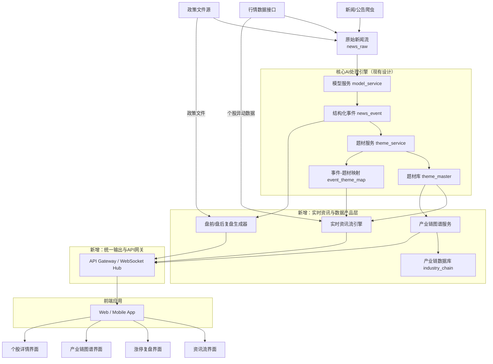
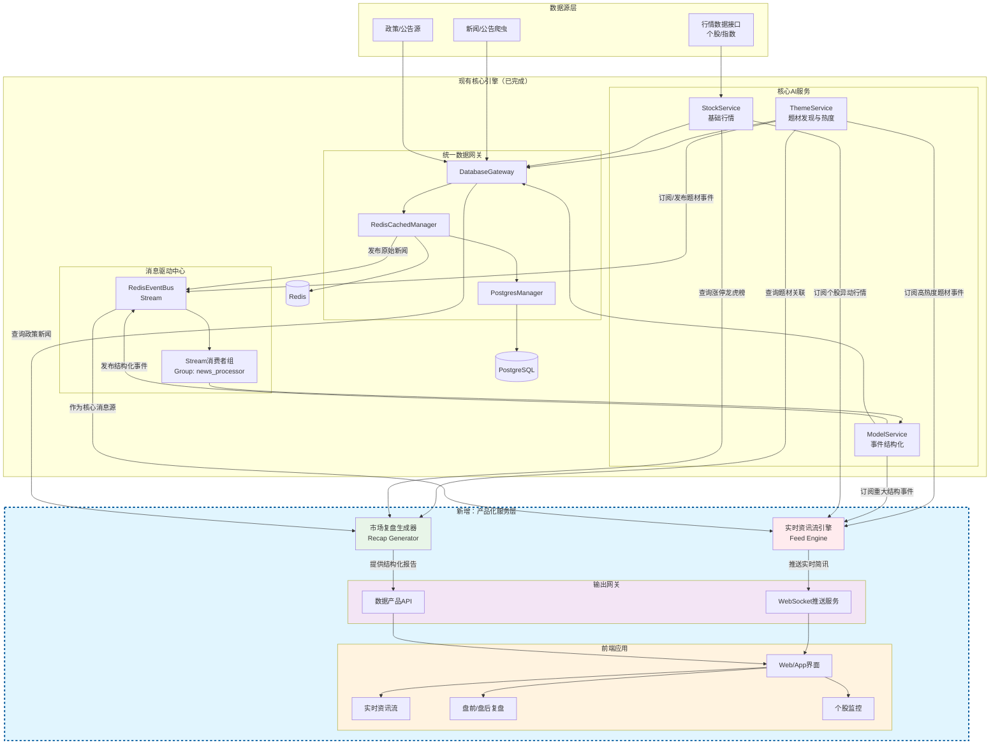

# 个人投资助理-项目架构设计（第三阶段：股票服务模块）

> 2026-03-31 架构收口说明：
> 本文档在最初设计时，假设第三阶段会在第二阶段之后独立展开；但当前项目已经提前落地了 `P2.phase0` 的新闻事件与题材匹配主链、`P2.phase1` 的题材知识对象层与只读 API，以及 `P4.phaseA` 的 `/intel/feed` 聚合接口。因此，第三阶段不应再被理解为“从零新增一个产品层”，而应被理解为“在既有题材知识中台之上，补齐股票服务、实时情报与前端统一出口”。本版以下内容均以这一现实基线为前提。

## 0. 与当前已落地系统的兼容性评估

### 0.1 已落地能力

当前系统已经具备以下可复用基础：

- `news_raw -> news_event -> event_theme_map` 的生产级事件主链
- `theme_detail_snapshot / theme_history_event / theme_tree_relation / theme_stock_map` 的 serving 对象层
- `subject_key` 作为题材树、历史、榜单、股票池的统一业务主键
- `GET /themes`、`/themes/rank`、`/themes/{subject_key}`、`/history`、`/children`、`/stocks`
- `GET /intel/feed` 的第一版情报聚合接口

因此，第三阶段的新设计必须兼容上述对象与接口，不能再假设前端直接消费底层原子表，也不能重新定义题材主键体系。

### 0.2 当前设计与原第三阶段方案的关系

两者总体兼容，但需要做 4 个关键调整：

1. `theme_service` 应继续作为题材知识与只读领域服务，不应同时承担所有前端聚合逻辑。
2. `/intel/feed` 可以视为“实时资讯流引擎”的 PhaseA 版本，但当前仍是 `REST first`，不是秒级推送系统。
3. 前端不应长期直接拼接过多底层领域接口，应尽快在第三阶段前置 `BFF / API Gateway`。
4. `industry_chain_service` 当前数据真源尚不成熟，不应在现阶段提前独立服务化。

### 0.3 修订后的阶段目标

第三阶段的真实目标应调整为：

- 建立 `Tushare + JYHF` 双源协同的数据策略
- 补齐 `stock_service` 与个股日快照/异动能力
- 补齐 `recap_service` 与盘前必读/盘后复盘生成能力
- 增加 `notion_publisher` 作为报告落地层
- 建立 `frontend_bff / api_gateway` 作为 Web 前端统一出口
- 在现有题材知识中台之上形成“事件 -> 题材 -> 股票 -> 页面”的完整产品链

这里的关键收口是：

- `JYHF` 负责题材事件、题材股票池、题材视角情报
- `Tushare` 负责低成本、可持续的股票日频真源
- 第三阶段优先交付“每日稳定快照 + 盘前/盘后报告 + Notion 输出”，而不是一开始就建设完整高频实时行情平台

#### 0.3.1 第三阶段子阶段拆解建议

第三阶段应被视为完整阶段，而不是单一 `P3.phase1`。建议拆解为：

- `P3.phase0`
  - 前端统一产品出口第一版
  - 对应当前历史命名 `P3.phaseA`
  - 重点是 `frontend_bff / api_gateway / /api/*` 的产品出口收口
- `P3.phase1`
  - `stock_service` 双源事实层与复盘快照
  - 重点是 `Tushare + JYHF`、股票对象层、盘前必读、盘后复盘、Notion 输出基础
- `P3.phase2`
  - 复盘增强与工作台深化
  - 重点是龙虎榜/资金行为增强、个股工作台与 `/recap` 页面深化
- `P3.phase3`
  - 实时化与高级增强
  - 重点是 `SSE`、更细粒度异动监控与轻图谱扩展

因此，当前文档中出现的 `P3.phase1` 应被理解为第三阶段的第一个正式业务子阶段，而不是整个第三阶段本身。

### 0.4 第三阶段数据源策略（Tushare + JYHF）

基于当前项目状态，建议将第三阶段的数据源策略冻结为“双源分工”：

#### 0.4.1 JYHF 的职责

- 题材事件真源：`subject/top-history?type=3`
- 题材股票池真源：`subject children / stock list / stock daily snapshot`
- 题材上下文：`subject detail / subject tree / subject history`

JYHF 的定位不是全市场股票行情主源，而是“题材语义真源”。

#### 0.4.2 Tushare 的职责

- 股票日线/日频指标主源
- 交易日历、基础证券主数据
- 盘前/盘后复盘需要的股票级事实字段
- 后续按需扩展到公告、新闻、龙虎榜、资金流

Tushare 在第三阶段的定位是“低成本付费的股票日频真源”，优先满足：

- 每日股票快照稳定落库
- 盘前必读/盘后复盘生成
- 与 JYHF 题材池做标准化拼接

#### 0.4.3 不纳入第三阶段首批范围的数据源

- 秒级全市场高频行情专线
- 独立 Tick 真源
- 多家商业高价数据源的并行接入

这些能力可在后续阶段通过 `QuoteGateway` 扩展，但不应阻塞第三阶段首批交付。

### 0.5 实时刷新策略修订

基于当前已落地能力，情报台实时刷新不建议第一步直接建设完整 WebSocket Hub，而应采用：

- 第一阶段：`SSE + 轮询兜底`
- 第二阶段：视并发与多端需求再升级到 `WebSocket`

原因：

- 当前前端需求是典型“服务端单向推送新情报”
- `frontend_bff` 已落地，最适合先在其上提供 `GET /api/intel/stream`
- 现有 `/api/intel/feed` 已经稳定，可作为断线恢复和补拉兜底
- 这样可以最小改动接入真实新闻抓取、结构化、匹配成功后的增量推送链

而不是另起一套与第二阶段并行的产品后端。

### **🔍 核心发现：现有架构与目标产品的差距**

现有的设计是一个强大的**后台数据处理引擎**，专注于从新闻到题材的**自动化发现与量化**。然而，截图中的产品（如“当前必读”、“涨停复盘”）展现的是一个**面向投资者的、实时交互的终端数据产品**。两者之间存在关键的“最后一公里”差距，主要体现在产品形态和时效性上。

| **对比维度** | **您的现有设计方案** | **截图中的目标产品** |
| --- | --- | --- |
| **核心产品** | 题材知识库、热度API、生命周期状态 | **即时资讯流**、**盘前必读**、**涨停复盘**、**龙虎榜**、**产业链图谱** |
| **数据时效** | 批次处理（T+1或分钟级） | **秒级/实时** 推送与更新 |
| **交互形态** | 以提供结构化数据接口为主 | **强交互前端**：时间线、表格、标签筛选、详情钻取 |
| **数据广度** | 集中于新闻事件驱动的题材 | 扩展至**个股行情、资金面、政策公告、产业链**等多维度数据 |

### **🚀 新增核心模块设计方案（按当前项目状态修订）**

为了弥补上述差距，建议在现有架构前端新增一个 **“实时资讯与监控服务”（Real-time Feed & Monitoring Service）** ，直接面向最终用户。以下是三个关键子模块的设计。

### **1. 实时资讯流引擎 (Real-time Feed Engine)**

此模块负责聚合所有信号，生成类似截图首页的时间线动态。

- **数据源**：
    - 接入现有 `theme_service` 产出的**高热度题材事件**。
    - 接入行情数据源的**个股异动**（快速涨跌、放量）。
    - 接入原始新闻流中的**重大政策/公告**。
- **处理逻辑**：
    - **优先级排序**：综合事件的热度值、影响范围、时效性进行动态排序。
    - **动态摘要生成**：利用现有`model_service`的能力，为每个推送项生成类似“【驱动事件】...”的简洁摘要。
    - **富标签标记**：自动标记“新题材”、“涨停”、“政策”等标签，便于前端高亮显示。
- **输出**：
    - 第一阶段：提供 `REST` 聚合接口（当前已落地 `/intel/feed`）
    - 第二阶段：再升级到 `WebSocket / SSE`

> 修订说明：
> 当前 `/intel/feed` 已经存在，因此“实时资讯流引擎”不应重新从零设计，而应采用两阶段路线：
> `REST first -> push later`。

### **2. 盘前/盘后复盘生成器 (Market Recap Generator)**

此模块自动化生成截图中的“当前必读”、“涨停复盘”等结构化报告。

- **盘前必读**：
    - **触发**：每个交易日早上定时运行。
    - **逻辑**：扫描前一日晚间至当日凌晨的**政策公告**（如截图中的“广州商业航天”规划）、**重要公司新闻**、**外围市场重大动态**。
- **生成**：调用大模型（复用`model_service`）对信息进行摘要、归纳，并结构化输出为“1、2、3...”的列表。
- **涨停复盘**：
    - **触发**：每日收盘后运行。
    - **逻辑**：连接当日涨停板数据，与`theme_service`中的题材库进行关联。
- **生成**：自动生成“热门题材复盘”表格，统计各题材的**涨停家数、连板高度、龙头个股**（如“引力传媒5天4板”），并计算题材强度。

> 修订说明：
> 现阶段更适合先实现为“批次生成任务 + 快照表 + 只读 API”，而不是先实现为常驻在线服务。建议优先产出：
> - `pre_market_brief_snapshot`
> - `post_market_recap_snapshot`
> - `limit_up_recap`
>
> 并增加一个独立的 `notion_publisher` 作为输出层，将上述快照同步到指定 Notion 页面，而不是让业务服务直接写 Notion。

### **3. 产业链图谱服务 (Industry Chain Graph Service)**

此模块对应截图中的“机器人”等详细产业链分解页面，将题材落地到具体投资标的。

- **数据建设**：
    - 在现有`theme_master`（题材库）基础上，新增 `industry_chain`（产业链） 和 `chain_component`（产业链环节） 表，建立“题材 - 产业链 - 环节 - 个股”的层级关系。
    - 示例：题材“机器人” -> 产业链“减速器” -> 环节“谐波减速器” -> 个股“绿的谐波”。
- **服务接口**：
    - 提供查询接口，返回某个题材的完整树状产业链结构及各环节对应的股票列表。
    - 提供关联接口，查询某只股票属于哪些题材的哪些产业链环节。

> 修订说明：
> 当前项目已经具备 `theme_tree_relation + theme_stock_map`，但尚未形成稳定的“产业链环节级知识真源”。因此，这一模块暂不建议立即独立成服务，而应先以“轻图谱/题材树 + 股票池”形态落在前端工作台中，待环节级数据真源稳定后再独立服务化。

### **⚙️ 关键优化与集成方案**

在新增模块的同时，需对现有架构进行关键优化以确保新需求得以满足。

1. **现有架构的性能与时效性优化**
    - **`theme_service` 热度计算实时化**：将部分批处理的热度计算改为基于事件的**增量实时计算**，确保当重要新闻出现时，相关题材热度能秒级更新并触发资讯流推送。
    - **`LocalThemeMatcher` 匹配加速**：为高频出现的概念（如“AI”、“航天”）建立内存级缓存，减少实时匹配的延迟。
2. **数据融合与关联**
    - 建立一个 **“全局实体关联服务”** ，将`news_event`中的公司、概念，与行情系统中的股票代码、产业链环节中的公司进行精准关联。这是实现“事件->题材->个股”无缝串联的基础。
    - 当前阶段至少要先补一层轻量 `entity_link_service` 或统一 binding 视图，避免前端或聚合接口各自重复做“公司名 -> 股票代码 -> 题材”映射。
3. **前端架构建议**
    - 采用组件化设计，封装 **“资讯流卡片”**、**“复盘表格”**、**“产业链树”** 等业务组件，以快速构建截图所示的多类页面。

4. **统一输出网关前置**
    - 在当前项目状态下，应将 `frontend_bff / api_gateway` 提前到第三阶段首批范围。
    - 原因：
      - 前端已经开始前置实现 `/intel`
      - 当前 `theme_service` 已同时承载领域查询与部分聚合输出
      - 若不尽快增加统一出口，前端会持续耦合到底层领域接口

### **📊 演进路线图建议（修订版）**

建议分阶段实施，以快速验证核心价值：

- **第一阶段（前置产品层）**：
  - `frontend_bff / api_gateway`
  - `REST 版 Intel Feed`
  - `/intel` 页面
  目标是先把现有 `theme_service + serving 表` 的成果产品化。
- **第二阶段（股票真源与复盘）**：
  - `stock_service` 的日快照/异动/榜单对象层
  - `recap_service` 的盘前必读/盘后复盘生成
  - `notion_publisher` 的报告同步
- **第三阶段（实时化与知识深化）**：
  - `实时资讯流引擎 push 化（优先 SSE）`
  - 产业链环节知识建设
  - 产业链图谱服务独立化
  - 更复杂的个股工作台与资金行为分析

## 4. 修订后的推荐总体架构

```text
核心数据层
JYHF: news_raw / news_event / event_theme_map / theme_detail_snapshot / theme_history_event / theme_tree_relation / theme_stock_map
Tushare: stock_basic / trade_calendar / daily_quote / daily_factor / optional_notice
Derived: subject_stock_daily_snapshot / stock_daily_snapshot / stock_abnormal_event / theme_stock_leaderboard

领域服务层
theme_service
stock_service
entity_link_service(新增)

产品聚合层
intel_service(已有 PhaseA，继续演进)
recap_service(新增)
workspace_service(后续)

统一输出层
frontend_bff / api_gateway(新增)
notion_publisher(新增，非前端出口)

前端
/intel
/themes/:subject_key
/stocks/:stock_id
/recap
```

上述结构与当前已落地的第二阶段、前置第四阶段设计兼容，且能够避免前端直接耦合到过多底层服务。

### **🆕 架构图核心新增部分解读**

图中标红部分为建议**新增**的核心模块，它们共同构成了面向用户的数据产品层：

1. **实时资讯流引擎**
    - **位置**：位于`theme_service`之后，作为热数据的首次聚合出口。

---

## 19. 2026-04-24 对照评审结论（文档/旧链/新链）

### 19.1 评审范围

本轮对照基于三类输入：

1. 本文档（第三阶段统一口径）
2. 旧链实现（`stock_service`）
3. 新链实现（`stock_processing_service`）

重点核对：主线身份（Layer A）、主线周期（Layer B）、强势池（Layer C）、弱转强候选（Layer D）。

### 19.2 核心结论

1. 当前主矛盾不在 D1 候选层，而在 A/B/C 上游等价迁移尚未完成。
2. 新链 Layer C 与 D1 输入口径已经收敛到“前 7 交易日强势跟踪池并集”。
3. 但 Layer A 主线身份算法仍是简化实现，尚未迁移旧链完整评分与门禁体系。
4. Layer B 状态机基本框架已落地，但证据层粒度与主题级语义完整度仍弱于旧链。

### 19.3 分层对照结果

#### Layer A（主线身份）

目标口径（本文档）：规则评分 + 一日游硬门 + 连续性 + LLM 受控复核 + `confirmed/review_pending` 治理。

现状：

1. 新链接口分层已正确（Application/Domain/Ports）。
2. 但 `IdentityScoringService` 仍为简化打分（`context_tags + stock_count`），与旧链 `build_mainline_identity_registry.py` 的规则体系不等价。

判定：**架构形态已对，算法内核未迁移完成**。

#### Layer B（周期状态）

目标口径（本文档）：V2 五类分数 + `mainline_alive_rule` 诊断标志 + `fade_confirmed` 多证据与支撑破位约束 + 固定优先级状态机。

旧链生产口径修正：

1. `mainline_alive_rule` 是当日主线强度/活跃度达标标志，不等同于最终主线存亡。
2. `mainline_alive_rule` 同时满足：
   - `mainline_strength_score >= 60`
   - `leader_alive_score >= 40`
   - `strong_event_count_7d > 0` 或 `event_continuity_score >= 40`
   - `not fade_confirmed`
3. `final_mainline_alive` 表示主线是否未进入硬退潮确认，旧链口径为：
   - `final_mainline_alive = not fade_confirmed`
4. `divergence / fade_watch / event弱化 / 强度不足` 不等于主线死亡；这些状态只表达冷热分层和风险分层。
5. `fade_confirmed` 必须同时满足：
   - `fade_confirmed_score >= 60`
   - `fade_confirmed_evidence_count >= 3`
   - `break_start_pivot=true` 或 `theme_support_score<=35`

现状：

1. 新链 `CycleJudgementService` 已复刻主要权重与优先级。
2. `CycleEvidenceBuilder` 证据来源仍偏简化，主题级证据闭环尚未完全达到旧链强度。
3. 历史设计中曾把 `mainline_alive_rule` 误写为 `final_mainline_alive` 硬门，已按旧链生产代码修正。

判定：**状态机接近，证据层仍需增强**。

#### Layer C（强势股池）

目标口径（本文档）：对象池（4选3 + 硬剔除）+ 每日滚动维护 + 历史可回放。

现状：

1. 新链已引入 Universe Gate（主线强势路径 + 独立龙头观察路径）与 AdmissionPolicy。
2. 新链 D1 输入已改为“前 7 交易日强势跟踪池并集 + 当日”，避免仅消费当日池。

判定：**方向正确，处于过渡收口阶段**。

#### Layer D（弱转强候选）

目标口径（本文档）：只消费强势股池，不做全市场直入。

现状：

1. 输入边界已基本符合文档要求。
2. 存在一定补偿逻辑（过渡期可接受），应在 A/B/C 完整后减薄。

判定：**非当前主矛盾**。

### 19.4 已确认的风险点

1. 身份时间穿越风险：若不按 `trade_date` 截断读取，可能发生“未来 confirmed 状态回灌”。
2. 跟踪池历史覆盖风险：7 日去重若保留旧日状态，可能把最新 `active/weakening` 覆盖为旧 `removed`。
3. 对账真源缺口：若新链未形成稳定历史对象层，回放会误以为“算法问题”而实为“历史数据缺失”。

---

## 20. 下一步优化计划（四里程碑）

### M1（P0）Layer A 算法等价迁移

目标：将旧链主线身份核心算法迁入新链 Domain，不引入 DB 耦合。

范围：

1. 迁移规则评分公式（`logic/market/composite`）
2. 迁移一日游与 K 线连续性门禁
3. 迁移升级漏斗（`observed -> review_pending -> confirmed`）
4. 保留新链 ports/contracts 边界，禁止 SQL 下沉到 domain

验收：

1. 同输入样本下，`identity_status/is_main_theme` 与旧链对齐
2. `identity_confirmed=false` 样本不得进入正式主线决策流

### M2（P1）Layer B 证据增强与主题级一致性

目标：补齐周期证据粒度，提升 `final_cycle_state/final_mainline_alive` 稳定性。

范围：

1. 对齐旧链周期证据字段（事件/龙头/板块/K线）
2. 强化 `fade_confirmed` 多证据计数与审计字段
3. 统一主题级状态消费路径，降低股票投影噪音

验收：

1. 关键样本日状态与旧链主语义一致
2. 周期状态可解释字段完整（decision_path/evidence_count）

### M3（P1）Layer C 对象池收口

目标：强势池成为稳定日更对象池，不依赖旧链表兜底。

范围：

1. 固化 Universe Gate：`confirmed+alive` 主线强势路径 + 两连板/三天两板独立龙头观察路径
2. 固化 AdmissionPolicy：4选3 + 硬剔除 + 分级
3. 完成 7 日窗口输入/历史快照的单一真源化

验收：

1. 7 日池数量与清单可回放、可对账
2. 神剑（2026-04-07）与联德（2026-04-15）目标日行为符合预期

### M4（P2）Layer D 去补丁化

目标：在 A/B/C 稳定后回收 D1 过渡补偿，恢复候选层轻决策定位。

范围：

1. 下调临时 bonus/override 权重
2. 保留 gap 结构语义，但减少个股特判
3. 增加 formal 池内排序可解释审计

验收：

1. 关键样本通过，不依赖个股补丁
2. top candidates 稳定且可解释

---

## 21. 执行顺序与近期任务（推进基线）

### 21.1 执行顺序（强制）

1. 先 M1，再 M2，再 M3，最后 M4
2. M1 完成前，不继续扩大 D1 规则面
3. 每个里程碑均先影子对账，再切主链

### 21.2 近期任务（本周）

1. 完成 M1 设计冻结：输出身份评分/门禁/复核的 Domain 规则表
2. 新增 M1 回归样本集：神剑/联德 + 主线边界题材 + 一日游反例
3. 增加 A/B/C 分层审计输出到 recap（身份来源、周期来源、对象池入池原因）
4. 建立“旧链 vs 新链”对账脚本（按 trade_date 导出身份、周期、强势池三份差异报告）

### 21.3 里程碑完成定义（DoD）

1. 所有规则在 `stock_processing_service/domain` 可单测
2. 数据读写只经 `ports + gateway adapters`
3. 回放可重复，且对账报告可审计
4. 不允许通过数据库直改“修结果”
    - **输入**：高热度`news_event`、实时行情异动。
    - **功能**：进行**秒级优先级排序**，生成带摘要和标签的推送条目。
2. **盘前/盘后复盘生成器**
    - **位置**：作为一个定时/事件触发的分析服务。
    - **输入**：前日的重大`news_event`、涨停板行情数据。
    - **功能**：调用模型**生成结构化报告**（如“1, 2, 3”要点列表、涨停统计表格）。
3. **产业链图谱服务**
    - **位置**：与`theme_service`并列，专注于实体关系拓展。
    - **输入**：`theme_master`题材库、外部产业链知识。
    - **功能**：构建和管理**“题材-产业链-环节-个股”** 的树状知识图谱，并提供查询API。
4. **Notion Publisher**
- **位置**：位于产品输出层，消费 `recap_service` 生成的快照。
- **功能**：将盘前必读和盘后复盘同步到指定 Notion 页面或数据库，不参与业务计算。
5. **统一输出与API网关**
- **位置**：所有后端服务的总出口。
- **功能**：聚合上述所有服务的接口，提供**一致的 API** 和后续可扩展的实时连接能力，是前后端解耦的关键。

### **🔗 关键数据流与优化点**

为了支撑新增模块，需要特别关注以下**数据流优化**：

- **实时性提升**：`theme_service`的热度计算需要支持**增量更新**，确保重要事件能秒级触发资讯流。
- **数据关联**：需建立**“全局实体解析器”**，确保从新闻中提取的公司名、概念能精准关联到股票代码和产业链环节，这是串联所有模块的“粘合剂”。
- **前端组件化**：对应新增的数据产品，前端应封装**资讯卡片、复盘表格、图谱树**等业务组件，以快速构建页面。



### **架构图核心解读**

**红色虚线框部分为建议新增的核心模块**，它们将您的AI处理引擎转化为面向用户的数据产品：

1. **实时资讯流引擎** - 核心产品化输出
- **输入**：高热度题材事件 + 实时行情异动
- **处理**：秒级优先级排序，生成带摘要的推送卡片
- **对应截图功能**：首页时间线资讯流（如"09:37 AI应用 +2.39%"）
1. **盘前/盘后复盘生成器** - 专业价值深化
- **输入**：前日重大事件 + 涨停板数据
- **处理**：定时分析，生成结构化复盘报告
- **对应截图功能**："当前必读"、"涨停复盘"、"龙虎榜"
1. **产业链图谱服务** - 知识壁垒构建
- **输入**：题材库 + 产业链知识
- **处理**：构建"题材-产业链-环节-个股"树状图谱
- **对应截图功能**："机器人"产业链分解页面
1. **统一输出网关** - 架构解耦关键
- **作用**：聚合所有服务接口，提供一致的数据出口
- **技术**：REST API + WebSocket实时推送

### **关键架构决策点**

1. **先稳定日频真源，再补实时复杂度**：第三阶段首要目标不是秒级行情，而是保证 `Tushare + JYHF` 每日稳定入库与可复盘。
2. **报告必须基于快照生成**：盘前必读和盘后复盘都应读取标准化快照表，而不是在生成时直接依赖外部 API。
3. **Notion 必须独立为输出层**：Notion 是报告落点，不是计算真源。
4. **实体关联必须平台化**：需建立**全局实体解析器**，统一新闻中的公司名与股票代码的映射关系。
5. **前端只能通过 BFF 取数**：避免页面继续耦合到底层领域表与服务。

### **演进实施建议**

按照价值递进顺序实施：

1. **P3.phase0：统一产品出口前置**
   - 即历史定义中的 `P3.phaseA`
   - 收口 `frontend_bff / /api/*`
   - 为后续 `stock_service / recap_service` 提供稳定产品出口边界
2. **P3.phase1：数据真源与 stock_service 骨架**
   - 冻结 `Tushare + JYHF` 数据源分工
   - 建立 `stock_daily_snapshot / stock_abnormal_event / theme_stock_leaderboard`
   - 冻结 `stock_service` 的最小对象与查询接口
3. **P3.phase2：盘前必读 / 盘后复盘**
   - 建立 `pre_market_brief_snapshot / post_market_recap_snapshot`
   - 先交付批次生成和只读 API
   - 让前端与后续输出只读快照，不直接重算
4. **P3.phase3：Notion 输出与实时化增强**
   - 增加 `notion_publisher`
   - 视需求将 `/intel` 从 `REST first` 增强到 `SSE`
   - 再决定是否推进更重的产业链图谱服务

### **架构调整核心：打通现有引擎到产品界面**

这个修正后的架构图准确地建立在您已完成的 **Redis Stream + PostgreSQL 数据管道** 之上。关键在于新增的 **“产品化与输出层”** ，它的作用是将您后台强大的数据处理能力，转化为截图中所见的、用户可交互的终端产品。以下是三个核心新增模块的详细设计思路：

**1. 实时资讯流引擎 (Real-time Feed Engine)**

- **定位**：作为现有 `RedisEventBus` 的一个**智能消费者**。
- **输入**：同时订阅来自 `ThemeService`（高热度题材）、`ModelService`（重大事件）、`StockService`（行情异动）的消息流。
- **核心逻辑**：对多源信息进行**实时融合、去重、优先级排序**，并调用大模型生成简讯摘要。
- **输出**：生产结构化的资讯条目，通过 `WebSocket服务` 推送到前端，形成截图中的时间线。

**2. 市场复盘生成器 (Market Recap Generator)**

- **定位**：一个**定时/事件触发**的分析任务。
- **输入**：
    - **盘前**：通过 `DatabaseGateway` 查询前夜的政策、公告类新闻。
    - **盘后**：通过 `StockService` 获取当日涨停、龙虎榜数据，并通过 `ThemeService` 获取题材关联。
- **核心逻辑**：汇总数据后，调用 `ModelService` 的摘要与归纳能力，自动化生成如截图所示的结构化报告（“1, 2, 3…”要点列表和涨停统计表）。

**3. 产业链图谱服务 (Industry Chain Service)**

- **定位**：一个独立的**知识图谱管理服务**。
- **数据构建**：需要新建 `industry_chain` 表，与现有 `theme_master` 关联，人工或半自动地维护“题材 -> 产业链 -> 细分环节 -> 成分股”的树状关系。
- **输出**：提供API，为前端“机器人”那样的详情页提供完整的树形结构数据。

### **⚙️ 关键集成点与数据流**

为确保新增模块与现有架构无缝集成，需重点关注以下数据流：

1. **资讯流的实时性**：`ThemeService` 在计算热度或发现新题材时，不仅写库，还需通过 `RedisEventBus` 发布一个**事件消息**，从而被 `实时资讯流引擎` 实时消费。
2. **复盘的数据聚合**：`Market Recap Generator` 需要能通过统一的 `DatabaseGateway` 查询 `news_raw`、`news_event`、`theme_master` 以及行情数据库，这要求 `DatabaseGateway` 已适配这些表的访问。
3. **实体标识统一**：这是所有模块联动的基石。必须确保 `ModelService` 从新闻中提取的“公司名称”，与 `StockService` 和产业链库中的“股票代码”能准确映射。建议在 `DatabaseGateway` 层之上建立一个 **“实体归一化”** 服务。



### **架构解读：如何从数据引擎到信息产品**

这个架构图的核心是 **“产品化服务层”** ，它由两个关键的新服务和统一的输出网关构成，将您后台的实时数据流转化为用户可直接消费的信息产品。

**1. 实时资讯流引擎**

- **角色**：它是您现有 `RedisEventBus` 的 **“终极消费者”** 和 **“信息编辑”**。
- **工作流**：同时订阅 `ModelService`（重大事件）、`ThemeService`（热门题材）、`StockService`（行情异动）等多个 `Stream`，进行**多源信息融合**。然后，它对事件进行智能排序（例如，将“新题材诞生”和“龙头股涨停”置顶），并调用模型生成类似截图中的精炼摘要（`【驱动事件】...`），最终通过 `WebSocket服务` 实时推送到前端界面。

**2. 市场复盘生成器**

- **角色**：它是一个 **“定时分析师”** ，负责生成每日的总结报告。
- **工作流**：
    - **盘前必读**：在交易日早上，通过 `DatabaseGateway` 查询夜间的重要政策和公司公告，生成要点列表。
    - **盘后复盘**：收盘后，从 `StockService` 获取涨停板、龙虎榜数据，并联合 `ThemeService` 分析题材强度，自动生成“涨停家数”、“连板高度”等结构化表格。
- **输出**：其结果先写入 `pre_market_brief_snapshot / post_market_recap_snapshot`，再通过 `数据产品API` 提供给前端，并由 `notion_publisher` 输出到 Notion 页面。

**3. 统一输出网关**

- **作用**：对前端提供一致且高效的访问方式。`WebSocket推送服务`负责处理高并发的实时资讯流，而 `数据产品API` 则提供复盘报告等准实时数据查询，实现动静分离。

### **🎯 核心集成与优化点**

1. **事件驱动是关键**：确保 `ThemeService` 在计算热度或发现新题材时，不仅更新数据库，也向 `RedisEventBus` 发布一个类型为 `theme.hot` 或 `theme.new` 的事件，这样才能被 `实时资讯流引擎` 实时捕获。
2. **复用模型能力**：`实时资讯流引擎` 和 `市场复盘生成器` 在生成文本摘要时，应通过内部接口调用现有的 `ModelService`，而不是重复建设，确保分析能力的一致性。
3. **前端组件化**：前端应根据这两种数据形态（流式推送 vs. 文档报告），封装“资讯卡片”和“复盘表格”等专用组件，以快速构建截图中的各类页面。
4. **股票服务先做日频对象层**：第三阶段首批不以“5000 股票 3 秒轮询”作为落地前提，而是先以交易日级稳定快照、异动派生、复盘对象层作为产品基础。

# **Stock Service 模块详细技术实施方案**

## **1. 模块架构总览**

### **1.1 模块定位与技术挑战**

#### **1.1.0 对 Stock Service 核心定位的需求审视**

原始定位中包含以下 4 类职责：

1. **实时行情处理**：秒级行情数据采集、标准化、分发
2. **市场状态识别**：涨停/跌停判断、连板计算、异动监控
3. **资金行为分析**：龙虎榜解析、主力资金流向
4. **融合分析服务**：个股-题材关联、龙头股识别

这 4 项方向上都成立，但不应在第三阶段首批被无差别接受为同优先级目标。按当前项目状态、数据源现实与产品目标，应做如下判断：

| 能力项 | 合理性 | 当前可行性 | 实现难度 | 首批优先级 | 判断 |
| --- | --- | --- | --- | --- | --- |
| 实时行情处理（秒级） | 中 | 低 | 高 | 低 | 方向长期合理，但与当前“盘前必读/盘后复盘”主目标不匹配，不应作为第三阶段首批门槛。 |
| 市场状态识别 | 高 | 高 | 中 | 高 | 涨停/跌停、连板、异动是复盘和选股工作台的基础，应进入首批范围。 |
| 资金行为分析 | 中高 | 中 | 中高 | 中 | 有价值，但严重依赖稳定外部源与字段质量，建议放到第二批增强。 |
| 融合分析服务 | 高 | 高 | 中 | 高 | 个股-题材关联、龙头识别与现有 JYHF 题材链高度协同，应作为首批核心价值。 |

结论：

- 第三阶段首批不应把 `Stock Service` 定义成“秒级实时行情平台”。
- 更合理的定义是：“以股票日频事实对象层为核心，支持市场状态识别与题材融合分析，并为盘前必读/盘后复盘提供稳定输入。”
- “资金行为分析”与“秒级实时行情”都应作为增强项，而非首批上线门槛。

**核心定位**：Stock Service 是系统的“股票事实对象层”，第三阶段首批负责：

1. **每日快照标准化**：将 `Tushare` 日频股票数据标准化并落库
2. **题材股票拼接**：与 `JYHF` 题材池做标准化关联
3. **市场状态识别**：涨停/跌停、连板、龙头、扩散等派生状态
4. **为复盘服务供数**：向 `recap_service` 输出稳定对象，而不是直接面向前端拼装页面

**技术挑战**：

- **数据真源稳定性**：确保每日股票快照完整可回放
- **状态复杂性**：A股特殊规则（ST、新股、复牌股等）
- **跨源映射**：题材视角与股票视角的标准化绑定
- **派生一致性**：盘前/盘后报告读取同一批快照与派生结果

#### **1.1.1 四类能力的具体评估**

##### **A. 实时行情处理**

**合理性**：

- 长期合理，尤其对盘中工作台、异动推送、SSE 情报流有价值。

**当前问题**：

- 与当前确定的 `Tushare + JYHF` 方案并不天然匹配。`Tushare` 更适合作为日频/准日频真源，不是低成本秒级全市场实时主源。
- 秒级行情将立即带来调度、限流、缓存、质量校验、熔断回退、会话管理等一整套基础设施复杂度。

**结论**：

- 第三阶段首批不纳入“秒级全市场行情处理”门禁。
- 可保留为后续扩展接口设计约束，但不作为首批实现目标。

##### **B. 市场状态识别**

**合理性**：

- 非常高。涨停、跌停、连板、异动是盘后复盘与盘前观察池的直接输入。

**当前可行性**：

- 高。基于 `Tushare` 日频快照、交易日历和现有 `JYHF` 题材股票池，已足够支持首批状态计算。

**实现难点**：

- A 股规则处理复杂，特别是 ST、创业板/科创板、次新股、停复牌、涨跌停制度差异。

**结论**：

- 必须纳入第三阶段首批。
- 但首批建议以“日频状态识别 + 盘后异动派生”为主，不先做盘中分钟级异动引擎。

##### **C. 资金行为分析**

**合理性**：

- 有价值，尤其对复盘和高级用户判断主线强弱很重要。

**当前可行性**：

- 中等。龙虎榜、主力资金流、席位行为等能力强依赖外部数据源覆盖与稳定性，不适合作为第三阶段首批核心依赖。

**实现难点**：

- 外部源成本、字段口径不一、历史回溯一致性、解释性要求都较高。

**结论**：

- 建议作为第二批增强能力。
- 首批只保留表结构与接口预留，不承诺完整产品能力。

##### **D. 融合分析服务**

**合理性**：

- 非常高。这是当前项目最具差异化价值的部分。

**当前可行性**：

- 高。现有 `JYHF` 题材事件、题材池、题材详情、`event_theme_map` 已经提供了较强的融合基础。

**实现难点**：

- 龙头识别算法需要解释性，不应一开始做成黑盒评分。

**结论**：

- 必须纳入第三阶段首批。
- 建议首批优先实现：
  - 个股-题材绑定
  - 题材内强弱股排序
  - 龙头/前排/扩散股的规则化识别

#### **1.1.2 第三阶段首批建议冻结的职责边界**

综合以上评估，第三阶段首批的 `stock_service` 职责应冻结为：

1. `Tushare` 日频股票事实标准化
2. 与 `JYHF` 题材池做标准化绑定
3. 盘后状态识别：涨停/跌停/连板/龙头候选/扩散股
4. 为 `recap_service` 和工作台输出稳定对象

暂不纳入首批门禁的职责：

1. 秒级全市场实时行情采集与推送
2. 复杂资金行为全量分析
3. 高频盘中策略信号引擎
4. 依赖高成本商业数据源的高级行情功能

#### **1.1.3 第三阶段需求优先级矩阵（MoSCoW）**

为避免第三阶段范围继续膨胀，建议按 `Must / Should / Could / Later` 冻结优先级：

##### **Must：首批必须交付**

- `Tushare` 日频股票真源接入
- `JYHF` 题材事件与题材股票池接入
- `stock_daily_snapshot`
- `subject_stock_daily_snapshot`
- `stock_abnormal_event`
- `theme_stock_leaderboard`
- 盘前必读快照 `pre_market_brief_snapshot`
- 盘后复盘快照 `post_market_recap_snapshot`
- `frontend_bff` 只读查询接口
- `notion_publisher` 的报告发布能力

##### **Should：第二优先级，首批后尽快补齐**

- 龙虎榜结构化解析
- 主力资金流字段接入
- 更稳定的龙头/前排/扩散股规则体系
- `/intel` 的 `SSE` 推送能力
- 个股工作台初版

##### **Could：有价值，但不应阻塞首批**

- 分钟级异动监控
- 轻量盘口特征
- 板块内多因子排序
- 产业链环节级轻图谱
- 更多外部数据源备用接入

##### **Later：明确后置，不纳入第三阶段首批承诺**

- 秒级全市场实时行情平台
- Tick 级全量处理
- 高频盘中策略信号引擎
- 高成本商业行情体系的深度耦合
- 独立重型产业链图谱服务

#### **1.1.4 不建议直接接受的需求口径**

以下口径在讨论时容易被直接接受，但在当前阶段应明确审慎处理：

1. “必须支持 5000+ 股票秒级实时处理”
   - 这会直接把第三阶段拉向高频行情平台建设，偏离盘前/盘后报告主目标。
2. “必须同时做完资金行为全量分析”
   - 外部源成本、字段可得性和解释性门槛都较高，首批不宜承诺。
3. “必须一开始就实现完整个股工作台”
   - 个股页面可以逐步增强，但不应早于事实对象层和复盘快照稳定。
4. “必须先做实时，再做报告”
   - 当前正确顺序应相反：先稳定快照与报告，再做实时增强。

### **1.2 核心架构设计**

第三阶段建议采用以下收敛版架构：

```text
Tushare Adapter ----\
                      -> stock_ingest_daily -> stock_daily_snapshot
JYHF Adapter -------/                         -> subject_stock_daily_snapshot

stock_daily_snapshot + subject_stock_daily_snapshot
    -> stock_abnormal_event
    -> theme_stock_leaderboard
    -> recap_service

recap_service
    -> pre_market_brief_snapshot
    -> post_market_recap_snapshot

pre/post snapshots
    -> frontend_bff
    -> notion_publisher
```

该设计强调：

- 外部源先入本地快照，再做派生
- 报告与页面都读快照，不直接依赖外部源
- `stock_service` 首批不以重型实时推送为前提

## **2. 核心子模块详细设计**

### **2.1 行情网关适配器 (QuoteGateway)**

### **2.1.1 架构设计**

python

```
class UnifiedQuoteGateway:
    """统一行情网关，第三阶段首批以 Tushare 为主源，预留多源扩展"""

    def __init__(self):
        self.adapters = {
            'tushare': TushareAdapter(),
            'jyhf': JYHFAdapter()
        }
        self.active_adapter = 'tushare'
        self.fallback_chain = ['tushare']

    async def get_daily_quotes(self, trade_date: str, symbols: List[str]) -> List[StandardQuote]:
        """获取交易日快照（标准化输出）"""
        for adapter_name in self.fallback_chain:
            try:
                adapter = self.adapters[adapter_name]
                raw_data = await adapter.fetch_daily(trade_date, symbols)
                standardized = self._standardize_quotes(raw_data)

                # 数据质量校验
                if self._validate_data_quality(standardized):
                    self.active_adapter = adapter_name
                    return standardized
            except Exception as e:
                logger.warning(f"Adapter{adapter_name} failed:{e}")
                continue

        raise QuoteGatewayError("All adapters failed")

    def _standardize_quotes(self, raw_data: dict) -> List[StandardQuote]:
        """标准化行情数据结构"""
        return [
            StandardQuote(
                symbol=item['code'],
                name=item['name'],
                last_price=float(item['price']),
                change_percent=float(item['percent']),
                volume=int(item['volume']),
                amount=float(item['amount']),
                bid_price=float(item.get('bid', 0)),
                ask_price=float(item.get('ask', 0)),
                timestamp=datetime.fromtimestamp(item['timestamp']),
                # 分时数据
                time_series=item.get('time_series', []),
                # Level2数据（如果可用）
                level2=item.get('level2', {})
            )
            for item in raw_data
        ]
```

### **2.1.2 连接管理与心跳机制**

第三阶段首批不建议引入长连接行情心跳与复杂重连管理。更适合采用：

- 交易日级批量拉取
- 落地本地原始快照文件
- 入库前做字段完整性、交易日一致性、涨跌幅边界校验
- 失败时整批重试或切换备用任务窗口

也就是说，第三阶段先把“每日稳定可回放”做实，而不是把系统设计重心放在长连接行情基础设施上。
        logger.error(f"Failed to reconnect to{adapter_name}")
        return False
```

### **2.2 股票状态机 (StockStateMachine)**

### **2.2.1 核心状态判断算法**

python

```
class StockStateMachine:
    """股票交易状态判断机"""

    # A股特殊规则定义
    RULES = {
        'NORMAL': {'limit_up': 0.10, 'limit_down': -0.10},
        'ST': {'limit_up': 0.05, 'limit_down': -0.05},
        'NEW_SHARE': {  # 新股首日规则
            'first_day': {'limit_up': 0.44, 'limit_down': -0.36},
            'subsequent_days': {'limit_up': 0.10, 'limit_down': -0.10}
        },
        'RESUME': {  # 复牌股
            'first_day': {'limit_up': 1.00, 'limit_down': -1.00}  # 不设涨跌幅限制
        }
    }

    def __init__(self):
        self.stock_info_cache = {}  # 缓存股票基本信息
        self.state_history = {}     # 状态历史记录

    async def calculate_stock_state(self, quote: StandardQuote) -> StockState:
        """计算股票当前状态"""
        # 1. 获取股票基本信息
        stock_info = await self._get_stock_info(quote.symbol)

        # 2. 确定适用规则
        rule = self._determine_rule(stock_info, quote)

        # 3. 计算涨跌停价格
        limit_prices = self._calculate_limit_prices(quote, rule, stock_info)

        # 4. 判断当前状态
        current_state = self._judge_current_state(quote, limit_prices)

        # 5. 更新连板信息
        if current_state.status == 'LIMIT_UP':
            await self._update_limit_chain(quote, current_state)

        # 6. 记录状态转换
        await self._record_state_transition(quote, current_state)

        return current_state

    def _determine_rule(self, stock_info: dict, quote: StandardQuote) -> dict:
        """确定适用的涨跌停规则"""
        symbol = quote.symbol

        if stock_info.get('is_st', False):
            return self.RULES['ST']

        if stock_info.get('is_new', False):
            listing_date = stock_info['listing_date']
            if quote.timestamp.date() == listing_date:
                return self.RULES['NEW_SHARE']['first_day']
            else:
                return self.RULES['NEW_SHARE']['subsequent_days']

        if stock_info.get('is_resumed', False):
            resume_date = stock_info['resume_date']
            if quote.timestamp.date() == resume_date:
                return self.RULES['RESUME']['first_day']

        return self.RULES['NORMAL']

    def _judge_current_state(self, quote: StandardQuote, limit_prices: dict) -> StockState:
        """判断当前交易状态"""
        price = quote.last_price
        prev_close = quote.prev_close

        # 判断涨停
        if price >= limit_prices['limit_up']:
            # 检查是否为"一字板"
            if quote.open_price >= limit_prices['limit_up']:
                board_type = '一字板'
            else:
                board_type = '换手板'

            return StockState(
                status='LIMIT_UP',
                board_type=board_type,
                limit_price=limit_prices['limit_up'],
                strength=self._calculate_limit_strength(quote)
            )

        # 判断跌停
        elif price <= limit_prices['limit_down']:
            return StockState(
                status='LIMIT_DOWN',
                limit_price=limit_prices['limit_down']
            )

        # 检查炸板状态
        elif self._check_board_broken(quote, limit_prices):
            return StockState(
                status='BOARD_BROKEN',
                broken_time=quote.timestamp
            )

        # 正常交易状态
        else:
            return StockState(
                status='NORMAL',
                change_percent=quote.change_percent
            )

    def _calculate_limit_strength(self, quote: StandardQuote) -> float:
        """计算涨停强度"""
        # 强度 = 封单金额 / 流通市值 * 系数
        bid_amount = quote.bid_volume * quote.last_price
        circulating_market_cap = quote.circulating_market_cap

        if circulating_market_cap > 0:
            strength = (bid_amount / circulating_market_cap) * 100
            return min(strength, 100)  # 限制在0-100之间
        return 0
```

### **2.2.2 连板计算引擎**

python

```
class LimitChainCalculator:
    """连板计算引擎"""

    def __init__(self):
        self.chain_cache = LRUCache(maxsize=1000)

    async def calculate_limit_chain(self, symbol: str, current_state: StockState) -> LimitChain:
        """计算连板信息"""
        # 从缓存获取历史记录
        history = self.chain_cache.get(symbol, [])

        if current_state.status == 'LIMIT_UP':
            # 判断是否延续连板
            if self._is_chain_continued(history, current_state):
                chain_days = len(history) + 1

                # 更新历史记录
                history.append({
                    'date': current_state.timestamp.date(),
                    'state': current_state,
                    'type': current_state.board_type
                })
                self.chain_cache[symbol] = history
            else:
                # 新连板开始
                chain_days = 1
                history = [{
                    'date': current_state.timestamp.date(),
                    'state': current_state,
                    'type': current_state.board_type
                }]
                self.chain_cache[symbol] = history
        else:
            # 连板中断
            chain_days = 0
            self.chain_cache.pop(symbol, None)

        return LimitChain(
            symbol=symbol,
            chain_days=chain_days,
            chain_type=self._determine_chain_type(history),
            history=history,
            total_gain=self._calculate_total_gain(history)
        )

    def _determine_chain_type(self, history: List[dict]) -> str:
        """判断连板类型"""
        if not history:
            return 'NONE'

        board_types = [item['type'] for item in history]

        if all(t == '一字板' for t in board_types):
            return 'STRONG_ONE_WORD'  # 强一字
        elif '一字板' in board_types:
            return 'MIXED'  # 混合板
        else:
            return 'NORMAL_CHANGE_HANDS'  # 纯换手

    def _calculate_total_gain(self, history: List[dict]) -> float:
        """计算连板期间总涨幅"""
        if len(history) < 2:
            return 0

        first_price = history[0]['state'].prev_close
        last_price = history[-1]['state'].last_price

        return ((last_price - first_price) / first_price) * 100
```

### **2.3 异动监控引擎 (AnomalyMonitor)**

### **2.3.1 规则引擎设计**

python

```
class AnomalyRuleEngine:
    """异动规则引擎"""

    RULES = {
        # 涨速规则
        'QUICK_RISE_1MIN': {
            'condition': lambda q: q.change_percent_1min > 2.0,
            'priority': 'HIGH',
            'message': '1分钟涨超2%',
            'cool_down': 300  # 5分钟冷却
        },
        'QUICK_RISE_5MIN': {
            'condition': lambda q: q.change_percent_5min > 5.0,
            'priority': 'HIGH',
            'message': '5分钟涨超5%',
            'cool_down': 600  # 10分钟冷却
        },

        # 量比规则
        'VOLUME_SURGE': {
            'condition': lambda q: q.volume_ratio > 10 and q.amount > 10000000,
            'priority': 'MEDIUM',
            'message': '量比大于10且成交额过千万',
            'cool_down': 300
        },

        # 突破规则
        'BREAK_HIGH_20D': {
            'condition': lambda q: q.last_price > q.high_20d and q.volume > q.avg_volume_20d * 1.5,
            'priority': 'MEDIUM',
            'message': '突破20日新高',
            'cool_down': 1800  # 30分钟冷却
        },
        'BREAK_LOW_20D': {
            'condition': lambda q: q.last_price < q.low_20d,
            'priority': 'LOW',
            'message': '跌破20日新低',
            'cool_down': 1800
        },

        # 资金规则
        'LARGE_ORDER': {
            'condition': lambda q: q.large_order_ratio > 0.3,
            'priority': 'HIGH',
            'message': '大单占比超30%',
            'cool_down': 300
        },

        # 技术指标规则
        'RSI_OVERBOUGHT': {
            'condition': lambda q: q.rsi_14 > 80,
            'priority': 'LOW',
            'message': 'RSI超买',
            'cool_down': 1800
        },
        'RSI_OVERSOLD': {
            'condition': lambda q: q.rsi_14 < 20,
            'priority': 'LOW',
            'message': 'RSI超卖',
            'cool_down': 1800
        }
    }

    def __init__(self):
        self.rule_cooldowns = {}  # 规则冷却时间记录
        self.anomaly_history = []  # 异动历史记录

    async def check_anomalies(self, quote: StandardQuote) -> List[AnomalyAlert]:
        """检查异动规则"""
        alerts = []

        for rule_name, rule_config in self.RULES.items():
            # 检查冷却时间
            if self._is_in_cooldown(quote.symbol, rule_name):
                continue

            # 检查条件
            if rule_config['condition'](quote):
                alert = AnomalyAlert(
                    symbol=quote.symbol,
                    rule_name=rule_name,
                    priority=rule_config['priority'],
                    message=rule_config['message'],
                    data={
                        'price': quote.last_price,
                        'change_percent': quote.change_percent,
                        'volume': quote.volume,
                        'timestamp': quote.timestamp
                    },
                    timestamp=datetime.now()
                )

                alerts.append(alert)

                # 设置冷却时间
                self._set_cooldown(quote.symbol, rule_name, rule_config['cool_down'])

                # 记录历史
                self._record_anomaly(alert)

        return alerts

    def _is_in_cooldown(self, symbol: str, rule_name: str) -> bool:
        """检查是否在冷却期内"""
        key = f"{symbol}:{rule_name}"
        if key in self.rule_cooldowns:
            cooldown_until = self.rule_cooldowns[key]
            return datetime.now() < cooldown_until
        return False

    def _set_cooldown(self, symbol: str, rule_name: str, seconds: int):
        """设置冷却时间"""
        key = f"{symbol}:{rule_name}"
        self.rule_cooldowns[key] = datetime.now() + timedelta(seconds=seconds)
```

### **2.3.2 智能过滤与聚合**

python

```
class SmartAnomalyFilter:
    """智能异动过滤器"""

    def __init__(self):
        self.symbol_filters = {}
        self.cluster_detector = AnomalyClusterDetector()

    async def filter_and_aggregate(self, alerts: List[AnomalyAlert]) -> List[AggregatedAlert]:
        """过滤和聚合异动"""
        if not alerts:
            return []

        # 1. 按规则优先级排序
        sorted_alerts = sorted(alerts, key=lambda x: self._get_priority_score(x.priority), reverse=True)

        # 2. 去除重复/相似异动
        filtered_alerts = self._deduplicate_alerts(sorted_alerts)

        # 3. 检测异动集群
        clusters = await self.cluster_detector.detect(filtered_alerts)

        # 4. 聚合生成最终告警
        aggregated = []
        for cluster in clusters:
            if cluster.significance_score > 0.7:  # 显著性阈值
                aggregated.append(
                    AggregatedAlert.from_cluster(cluster)
                )

        return aggregated

    def _deduplicate_alerts(self, alerts: List[AnomalyAlert]) -> List[AnomalyAlert]:
        """去重相似异动"""
        seen = set()
        deduped = []

        for alert in alerts:
            # 生成唯一标识
            alert_key = self._generate_alert_key(alert)

            if alert_key not in seen:
                seen.add(alert_key)
                deduped.append(alert)

        return deduped

    def _generate_alert_key(self, alert: AnomalyAlert) -> str:
        """生成异动唯一标识"""
        # 基于：股票 + 规则类型 + 时间窗口
        timestamp_key = alert.timestamp.strftime("%Y%m%d%H%M")
        return f"{alert.symbol}:{alert.rule_name}:{timestamp_key}"
```

### **2.4 龙虎榜解析器 (DragonTigerParser)**

### **2.4.1 数据采集与解析**

python

```
class DragonTigerParser:
    """龙虎榜数据解析器"""

    def __init__(self):
        self.data_sources = {
            'sse': 'http://www.sse.com.cn/disclosure/diclosure/public/',
            'szse': 'http://www.szse.cn/disclosure/diclosure/public/',
            'juchao': 'http://www.cninfo.com.cn/new/commonUrl/pageOfSearch?url=disclosure/list/search'
        }
        self.seat_patterns = {
            '机构专用': 'INSTITUTION',
            '深股通专用': 'CONNECT_NORTH',
            '沪股通专用': 'CONNECT_NORTH',
            '营业部': 'BROKER',
            '游资': 'HOT_MONEY'
        }

    async def parse_daily_lhb(self, date: datetime) -> List[DragonTigerRecord]:
        """解析当日龙虎榜数据"""
        records = []

        for exchange, url in self.data_sources.items():
            try:
                raw_data = await self._fetch_lhb_data(exchange, date)
                parsed = self._parse_exchange_data(raw_data, exchange)
                records.extend(parsed)
            except Exception as e:
                logger.error(f"Failed to parse LHB for{exchange}:{e}")
                continue

        # 数据校验和去重
        validated = await self._validate_records(records)

        # 计算资金分析指标
        enriched = await self._enrich_with_analysis(validated)

        return enriched

    def _parse_exchange_data(self, raw_data: dict, exchange: str) -> List[DragonTigerRecord]:
        """解析交易所原始数据"""
        records = []

        for item in raw_data.get('data', []):
            # 解析席位类型
            seat_type = self._identify_seat_type(item['seat_name'])

            record = DragonTigerRecord(
                stock_code=item['stock_code'],
                stock_name=item['stock_name'],
                exchange=exchange,
                seat_name=item['seat_name'],
                seat_type=seat_type,
                buy_amount=float(item['buy_amount']),
                sell_amount=float(item['sell_amount']),
                net_amount=float(item['buy_amount']) - float(item['sell_amount']),
                date=datetime.strptime(item['date'], '%Y-%m-%d'),
                reason=item.get('reason', ''),
                rank=item.get('rank', 0)
            )

            records.append(record)

        return records

    def _identify_seat_type(self, seat_name: str) -> str:
        """识别席位类型"""
        for pattern, seat_type in self.seat_patterns.items():
            if pattern in seat_name:
                return seat_type

        # 智能识别
        if any(keyword in seat_name for keyword in ['基金', '保险', '券商资管']):
            return 'INSTITUTION'
        elif any(keyword in seat_name for keyword in ['证券', '营业部']):
            return 'BROKER'
        else:
            return 'UNKNOWN'

    async def _enrich_with_analysis(self, records: List[DragonTigerRecord]) -> List[EnrichedDragonTigerRecord]:
        """丰富龙虎榜数据"""
        enriched_records = []

        for record in records:
            # 1. 计算历史表现
            historical = await self._analyze_historical_performance(record)

            # 2. 计算资金影响力
            influence_score = self._calculate_influence_score(record)

            # 3. 关联题材分析
            theme_relation = await self._analyze_theme_relation(record)

            enriched = EnrichedDragonTigerRecord(
                **record.__dict__,
                historical_performance=historical,
                influence_score=influence_score,
                theme_relation=theme_relation,
                overall_rating=self._calculate_overall_rating(record, historical, influence_score)
            )

            enriched_records.append(enriched)

        return enriched_records
```

### **2.5 融合分析服务 (FusionAnalysisService)**

### **2.5.1 个股-题材关联分析**

python

```
class StockThemeAnalyzer:
    """个股-题材关联分析器"""

    def __init__(self, theme_service_client):
        self.theme_service = theme_service_client
        self.cache = {}

    async def analyze_stock_themes(self, stock_code: str,
                                   lookback_days: int = 30) -> StockThemeAnalysis:
        """分析个股的题材关联"""
        # 1. 获取股票基础信息
        stock_info = await self._get_stock_info(stock_code)

        # 2. 获取近期市场表现
        market_performance = await self._get_recent_performance(stock_code, lookback_days)

        # 3. 查询相关题材
        related_themes = await self.theme_service.get_themes_by_stock(stock_code)

        # 4. 计算关联强度
        theme_strengths = []
        for theme in related_themes:
            strength = await self._calculate_theme_strength(
                stock_code, theme, market_performance
            )

            if strength > 0.3:  # 关联强度阈值
                theme_strengths.append({
                    'theme': theme,
                    'strength': strength,
                    'contribution': self._calculate_contribution(stock_code, theme)
                })

        # 5. 识别龙头属性
        is_leader = await self._identify_leader_status(stock_code, theme_strengths)

        return StockThemeAnalysis(
            stock_code=stock_code,
            stock_name=stock_info['name'],
            related_themes=theme_strengths,
            is_theme_leader=is_leader,
            leader_score=self._calculate_leader_score(is_leader, theme_strengths),
            analysis_timestamp=datetime.now()
        )

    async def _calculate_theme_strength(self, stock_code: str,
                                        theme: ThemeInfo,
                                        market_performance: dict) -> float:
        """计算个股与题材的关联强度"""
        # 因子1: 涨幅相关性
        correlation = self._calculate_correlation(
            stock_performance=market_performance['returns'],
            theme_performance=theme.performance_data
        )

        # 因子2: 事件触发次数
        event_count = await self._count_theme_events(stock_code, theme.id)

        # 因子3: 资金跟随度
        capital_follow = self._calculate_capital_follow(
            stock_code, theme.id, market_performance
        )

        # 综合计算
        strength = (
            correlation * 0.4 +
            (min(event_count, 10) / 10) * 0.3 +
            capital_follow * 0.3
        )

        return max(0, min(1, strength))

    async def _identify_leader_status(self, stock_code: str,
                                      theme_strengths: List[dict]) -> dict:
        """识别龙头状态"""
        leader_info = {}

        for item in theme_strengths:
            theme = item['theme']
            strength = item['strength']

            # 获取该题材下的所有股票
            theme_stocks = await self.theme_service.get_stocks_by_theme(theme.id)

            # 计算该股票在题材中的排名
            ranking = await self._calculate_theme_ranking(stock_code, theme_stocks)

            if ranking['position'] <= 3:  # 前3名视为龙头候选
                leader_info[theme.id] = {
                    'rank': ranking['position'],
                    'score': ranking['score'],
                    'attributes': self._extract_leader_attributes(stock_code, theme_stocks)
                }

        return leader_info
```

### **2.5.2 龙头股识别算法**

python

```
class LeaderStockIdentifier:
    """龙头股识别器"""

    def __init__(self):
        self.metrics_weights = {
            'price_strength': 0.25,      # 价格强度
            'volume_leadership': 0.20,   # 量能领导力
            'timing_advantage': 0.15,    # 时机优势
            'capital_preference': 0.20,   # 资金偏好
            'theme_purity': 0.10,        # 题材纯度
            'market_influence': 0.10     # 市场影响力
        }

    async def identify_leader_stocks(self, theme_id: str,
                                     candidate_count: int = 5) -> List[LeaderCandidate]:
        """识别题材龙头股"""
        # 1. 获取题材相关股票
        theme_stocks = await self._get_theme_stocks(theme_id)

        if not theme_stocks:
            return []

        # 2. 计算各项指标
        candidates = []
        for stock in theme_stocks:
            metrics = await self._calculate_leader_metrics(stock, theme_id)
            score = self._calculate_composite_score(metrics)

            candidates.append(LeaderCandidate(
                stock=stock,
                metrics=metrics,
                composite_score=score
            ))

        # 3. 排序和筛选
        candidates.sort(key=lambda x: x.composite_score, reverse=True)

        # 4. 验证龙头属性
        verified = []
        for candidate in candidates[:candidate_count * 2]:  # 宽选
            if await self._verify_leader_properties(candidate, theme_id):
                verified.append(candidate)
                if len(verified) >= candidate_count:
                    break

        return verified

    async def _calculate_leader_metrics(self, stock: StockInfo, theme_id: str) -> dict:
        """计算龙头指标"""
        metrics = {}

        # 1. 价格强度
        metrics['price_strength'] = await self._calculate_price_strength(stock, theme_id)

        # 2. 量能领导力
        metrics['volume_leadership'] = await self._calculate_volume_leadership(stock, theme_id)

        # 3. 时机优势
        metrics['timing_advantage'] = await self._calculate_timing_advantage(stock, theme_id)

        # 4. 资金偏好
        metrics['capital_preference'] = await self._calculate_capital_preference(stock)

        # 5. 题材纯度
        metrics['theme_purity'] = await self._calculate_theme_purity(stock, theme_id)

        # 6. 市场影响力
        metrics['market_influence'] = await self._calculate_market_influence(stock)

        return metrics

    def _calculate_composite_score(self, metrics: dict) -> float:
        """计算综合龙头得分"""
        score = 0
        for metric_name, weight in self.metrics_weights.items():
            if metric_name in metrics:
                score += metrics[metric_name] * weight

        # 应用调整因子
        adjustment = self._calculate_adjustment_factor(metrics)
        score *= adjustment

        return max(0, min(100, score))

    async def _verify_leader_properties(self, candidate: LeaderCandidate,
                                        theme_id: str) -> bool:
        """验证龙头属性"""
        # 1. 检查价格领先性
        if not await self._check_price_leadership(candidate, theme_id):
            return False

        # 2. 检查资金认可度
        if not await self._check_capital_recognition(candidate):
            return False

        # 3. 检查持续性
        if not await self._check_sustainability(candidate):
            return False

        # 4. 检查市场跟随效应
        if not await self._check_market_following(candidate, theme_id):
            return False

        return True
```

## **3. 性能优化与缓存策略**

### **3.1 多级缓存设计**

python

```
class MultiLevelCache:
    """多级缓存管理器"""

    def __init__(self):
        # L1: 内存缓存（高频数据）
        self.l1_cache = {
            'stock_states': LRUCache(maxsize=1000, ttl=10),  # 10秒
            'limit_chains': LRUCache(maxsize=500, ttl=30),   # 30秒
            'anomalies': LRUCache(maxsize=1000, ttl=5),      # 5秒
        }

        # L2: Redis缓存（共享数据）
        self.redis_client = RedisClient()

        # L3: 本地磁盘缓存（冷数据）
        self.disk_cache = DiskCache(cache_dir='./cache')

    async def get_stock_state(self, symbol: str) -> Optional[StockState]:
        """获取股票状态（带缓存）"""
        # 1. 检查L1缓存
        cache_key = f"state:{symbol}"
        cached = self.l1_cache['stock_states'].get(cache_key)
        if cached:
            return cached

        # 2. 检查L2缓存
        cached = await self.redis_client.get(cache_key)
        if cached:
            # 回写到L1
            self.l1_cache['stock_states'].set(cache_key, cached)
            return cached

        # 3. 计算并缓存
        state = await self._calculate_stock_state(symbol)

        # 更新各级缓存
        self.l1_cache['stock_states'].set(cache_key, state)
        await self.redis_client.setex(cache_key, 30, state)  # 30秒过期

        return state
```

### **3.2 批量处理优化**

python

```
class BatchProcessor:
    """批量处理器"""

    def __init__(self, batch_size=100, max_workers=10):
        self.batch_size = batch_size
        self.executor = ThreadPoolExecutor(max_workers=max_workers)
        self.batch_queue = asyncio.Queue()

    async def process_stocks_batch(self, symbols: List[str]) -> List[StockState]:
        """批量处理股票数据"""
        # 分批处理
        batches = [symbols[i:i+self.batch_size]
                  for i in range(0, len(symbols), self.batch_size)]

        results = []
        for batch in batches:
            # 并行处理每个批次
            batch_results = await asyncio.gather(*[
                self._process_single_stock(symbol)
                for symbol in batch
            ])
            results.extend(batch_results)

            # 控制处理速率
            await asyncio.sleep(0.01)  # 10ms间隔

        return results

    async def _process_single_stock(self, symbol: str) -> StockState:
        """处理单个股票"""
        try:
            # 获取行情数据
            quote = await self.quote_gateway.get_quote(symbol)

            # 计算状态
            state = await self.state_machine.calculate_stock_state(quote)

            # 检查异动
            anomalies = await self.anomaly_monitor.check_anomalies(quote)

            if anomalies:
                await self._publish_anomalies(symbol, anomalies)

            return state

        except Exception as e:
            logger.error(f"Failed to process{symbol}:{e}")
            return StockState(status='ERROR')
```

## **4. 错误处理与降级策略**

### **4.1 熔断与降级**

python

```
class CircuitBreaker:
    """熔断器"""

    def __init__(self, failure_threshold=5, recovery_timeout=60):
        self.failure_count = 0
        self.failure_threshold = failure_threshold
        self.recovery_timeout = recovery_timeout
        self.state = 'CLOSED'  # CLOSED, OPEN, HALF_OPEN
        self.last_failure_time = None

    async def execute(self, func, fallback_func=None, *args, **kwargs):
        """执行函数（带熔断保护）"""
        if self.state == 'OPEN':
            # 检查是否应该尝试恢复
            if self._should_try_recovery():
                self.state = 'HALF_OPEN'
            else:
                if fallback_func:
                    return await fallback_func(*args, **kwargs)
                raise CircuitBreakerOpenError()

        try:
            result = await func(*args, **kwargs)

            if self.state == 'HALF_OPEN':
                self._reset()  # 成功执行，重置熔断器

            return result

        except Exception as e:
            self._record_failure()

            if self.state == 'OPEN':
                if fallback_func:
                    return await fallback_func(*args, **kwargs)
                raise CircuitBreakerOpenError()

            raise e

    def _record_failure(self):
        """记录失败"""
        self.failure_count += 1
        self.last_failure_time = datetime.now()

        if self.failure_count >= self.failure_threshold:
            self.state = 'OPEN'

    def _should_try_recovery(self):
        """检查是否应该尝试恢复"""
        if self.last_failure_time is None:
            return False

        elapsed = (datetime.now() - self.last_failure_time).total_seconds()
        return elapsed >= self.recovery_timeout
```

### **4.2 数据质量监控**

python

```
class DataQualityMonitor:
    """数据质量监控器"""

    def __init__(self):
        self.metrics = {
            'completeness': 0,      # 数据完整性
            'timeliness': 0,        # 数据及时性
            'consistency': 0,       # 数据一致性
            'accuracy': 0,          # 数据准确性
        }
        self.thresholds = {
            'completeness': 0.95,   # 95%完整
            'timeliness': 0.90,     # 90%及时
            'consistency': 0.98,    # 98%一致
            'accuracy': 0.95,       # 95%准确
        }

    async def monitor_quote_quality(self, quotes: List[StandardQuote]) -> QualityReport:
        """监控行情数据质量"""
        report = QualityReport()

        for quote in quotes:
            # 检查数据完整性
            completeness = self._check_completeness(quote)
            self.metrics['completeness'] = completeness

            # 检查数据及时性
            timeliness = self._check_timeliness(quote)
            self.metrics['timeliness'] = timeliness

            # 检查数据一致性
            consistency = await self._check_consistency(quote)
            self.metrics['consistency'] = consistency

            # 检查数据准确性
            accuracy = await self._check_accuracy(quote)
            self.metrics['accuracy'] = accuracy

            # 生成单条记录质量评分
            quote.quality_score = self._calculate_quality_score(
                completeness, timeliness, consistency, accuracy
            )

            # 记录质量问题
            if quote.quality_score < 0.8:
                report.low_quality_quotes.append(quote)

        # 计算总体质量
        report.overall_quality = self._calculate_overall_quality()
        report.is_acceptable = all(
            self.metrics[key] >= self.thresholds[key]
            for key in self.metrics
        )

        return report

    def _check_timeliness(self, quote: StandardQuote) -> float:
        """检查数据及时性"""
        now = datetime.now()
        delay = (now - quote.timestamp).total_seconds()

        if delay <= 3:  # 3秒内
            return 1.0
        elif delay <= 10:  # 10秒内
            return 0.7
        else:
            return 0.3
```

## **5. 部署与监控**

### **5.1 Docker容器化部署**

dockerfile

```
# Dockerfile for Stock Service
FROM python:3.10-slim

WORKDIR /app

# 安装系统依赖
RUN apt-get update && apt-get install -y \
    gcc \
    g++ \
    && rm -rf /var/lib/apt/lists/*

# 安装Python依赖
COPY requirements.txt .
RUN pip install --no-cache-dir -r requirements.txt

# 复制应用代码
COPY . .

# 健康检查
HEALTHCHECK --interval=30s --timeout=3s --start-period=5s --retries=3 \
    CMD python -c "import urllib.request; urllib.request.urlopen('http://localhost:8080/health')"

# 启动命令
CMD ["python", "-m", "stock_service.main"]
```

### **5.2 监控指标定义**

python

```
# Prometheus指标定义
from prometheus_client import Counter, Gauge, Histogram, Summary

# 业务指标
STOCK_STATE_UPDATES = Counter(
    'stock_state_updates_total',
    'Total stock state updates',
    ['symbol', 'status']
)

LIMIT_CHAIN_UPDATES = Counter(
    'limit_chain_updates_total',
    'Total limit chain updates',
    ['symbol', 'chain_days']
)

ANOMALY_ALERTS = Counter(
    'anomaly_alerts_total',
    'Total anomaly alerts generated',
    ['rule_name', 'priority']
)

# 性能指标
PROCESSING_LATENCY = Histogram(
    'stock_processing_latency_seconds',
    'Stock processing latency',
    buckets=[0.01, 0.05, 0.1, 0.5, 1.0, 2.0]
)

CACHE_HIT_RATIO = Gauge(
    'cache_hit_ratio',
    'Cache hit ratio'
)

# 数据质量指标
DATA_COMPLETENESS = Gauge(
    'data_completeness',
    'Data completeness percentage'
)

DATA_TIMELINESS = Gauge(
    'data_timeliness',
    'Data timeliness score'
)
```

## **6. 第三阶段收敛版实施建议**

### **6.1 首批交付边界**

第三阶段首批不以“全市场高频实时行情平台”作为交付目标，而以以下能力闭环为准：

1. `Tushare + JYHF` 双源稳定入库
2. `stock_service` 输出日快照、异动对象、题材股票榜单
3. `recap_service` 输出盘前必读与盘后复盘快照
4. `frontend_bff` 与 `notion_publisher` 消费同一份报告快照

如果上述 4 项未稳定，不建议提前进入更重的 SSE、Tick、产业链独立服务化。

### **6.2 建议冻结的数据对象**

建议在第三阶段首批冻结以下对象，作为前后端与 Notion 的统一真源：

- `stock_daily_snapshot`
- `subject_stock_daily_snapshot`
- `stock_abnormal_event`
- `theme_stock_leaderboard`
- `pre_market_brief_snapshot`
- `post_market_recap_snapshot`

冻结原则：

- 字段只增不改
- 页面与 Notion 只读快照，不在消费端重算排名和结论
- 复盘结果可追溯到原始股票快照与题材事件

### **6.3 分阶段实施建议**

#### **P3.phase1：数据真源与服务骨架**

- 接入 `Tushare` 日频真源
- 复用 `JYHF` 题材事件与题材股票池
- 建立 `stock_daily_snapshot / stock_abnormal_event / theme_stock_leaderboard`
- 提供最小 `stock_service` 查询接口

验收重点：

- 任一交易日可完整回放
- 股票快照与题材股票池可稳定关联
- 派生状态具备可解释性

#### **P3.phase2：盘前必读 / 盘后复盘**

- 建立 `recap_service`
- 生成 `pre_market_brief_snapshot / post_market_recap_snapshot`
- 打通 `frontend_bff` 的只读 API

验收重点：

- 报告结构稳定
- 同一交易日重复生成结果一致
- 前端不再拼接原始表

#### **P3.phase3：Notion 输出与实时增强**

- 建立 `notion_publisher`
- 将复盘与盘前报告同步到指定 Notion 页面
- 视需要把 `/intel` 从 `REST first` 增强到 `SSE`

验收重点：

- 页面与 Notion 内容一致
- 发布失败可重试且不影响主链
- 实时增强不破坏日频快照闭环

### **6.4 关键成功因素**

1. **数据真源稳定**：优先保障每日股票快照和题材事件完整入库。
2. **快照优先于实时**：报告与页面必须优先建立在快照对象层上。
3. **双源职责清晰**：`JYHF` 只承担题材语义，`Tushare` 只承担股票日频真源。
4. **输出层解耦**：`frontend_bff` 与 `notion_publisher` 只消费快照，不参与核心计算。
5. **后续扩展可控**：更高频行情、更重图谱、更复杂分析都必须建立在首批对象稳定之后。

本版文档的核心结论是：第三阶段应优先把“每日股票事实对象层 + 盘前/盘后报告 + Notion 输出”做成稳定闭环，而不是过早进入高频行情平台化建设。只有当这条闭环稳定后，后续的实时推送、产业链深化、个股工作台才有可靠基础。

---

<!-- 以下内容由 stock_processing_service_ch13_15.md 合并引入（2026-04-23） -->

# 13. 旧 `stock_service` 向 `stock_processing_service` 的迁移矩阵（冻结）

## 13.1 迁移总原则

本次迁移只保留旧 `stock_service` 的**算法能力与业务规则**，不保留其历史上的**数据访问方式、产品真源地位、脚本式编排方式、前端消费方式**。第三阶段唯一目标是：由 `stock_processing_service` 成为股票日频对象层唯一新生产链路，所有读写统一经 `DatabaseGateway` 显式 API，产品层只读 6 个冻结对象。

迁移动作分为三类：

1. **保留算法，重写边界**：旧模块中的评分、门禁、状态机、候选逻辑迁入 `domain/services/*`。  
2. **保留旧表，降级定位**：旧表仅作为算法态、工作池、审计态对象，不再作为前端/BFF 真源。  
3. **提升冻结对象层**：对外真源只允许为 `stock_daily_snapshot / subject_stock_daily_snapshot / stock_abnormal_event / theme_stock_leaderboard / pre_market_brief_snapshot / post_market_recap_snapshot`。

---

## 13.2 迁移分类定义

### A. 算法态对象
用于保存身份判定、周期状态、迁移结果等中间算法结论，可保留、可回放、可审计，但**不得作为产品真源**。

### B. 工作池/审计态对象
用于强势股滚动池、候选池、盘前确认结果、复核队列等过程对象，可保留，但**仅供内部链路消费或回放验证**。

### C. 冻结对象层
对外统一真源，只允许由新链路生产并由 BFF / recap / intel / notion 读取。

---

## 13.3 旧模块到新归属的迁移矩阵

### 13.3.1 Layer A 主线识别（身份层）

**旧模块**
- `build_mainline_identity_registry.py`

**新归属**
- `application/jobs/identity_job`
- `domain/services/identity_scoring_service`
- `domain/services/one_day_tour_detector`
- `domain/services/identity_llm_review_service`
- `domain/services/identity_decider`

**旧表处理**
- `theme_mainline_identity_registry`：保留，降级为**算法态对象**
- `mainline_identity_review_queue`：保留，降级为**审计态/复核态对象**

**是否允许前端直读**
- 不允许

**最终对外落点**
- 间接支撑 `theme_stock_leaderboard`
- 间接支撑 `post_market_recap_snapshot / pre_market_brief_snapshot` 文档生成

**迁移要求**
1. `identity_job` 只负责编排与 gateway 调用，不得包含评分细节。  
2. LLM 复核必须为受控端口，不得嵌入脚本主流程。  
3. `review_pending` 只代表进入复核漏斗，不得直接进入 `confirmed`。  
4. `theme_mainline_identity_registry` 不再承担产品消费职责。

---

### 13.3.2 Layer B 周期跟踪（状态层）

**旧模块**
- `theme_cycle_evidence_builder.py`
- `theme_cycle_judgement_service_v2.py`
- `mainline_state_transition_service.py`

**新归属**
- `domain/services/cycle_evidence_builder`
- `domain/services/cycle_judgement_service`
- `domain/services/state_transition_service`

**旧表处理**
- `theme_cycle_judgement_v2`：保留，降级为**算法态对象**
- `mainline_state_daily`：保留，降级为**过程快照**
- `mainline_state_transition`：保留，降级为**过程快照**

**是否允许前端直读**
- 不允许

**最终对外落点**
- `subject_stock_daily_snapshot`
- `theme_stock_leaderboard`

**迁移要求**
1. 周期层必须继续保持“状态生成层”职责，不得与迁移层混用。  
2. `final_cycle_state` 只能来自周期判定服务，消费端不得重判。  
3. 迁移服务只负责 `from_state -> to_state -> transition_type`，不得反向定义主状态。  
4. 旧 `theme_cycle_judgement_service.py` 等 legacy 路径只保留回放，不得再进入新生产链路。
5. `mainline_alive_rule` 只能作为强度达标诊断标志；不得直接否决 `final_mainline_alive`。
6. `final_mainline_alive` 必须按旧链口径解释为“未硬退潮确认”，默认 `not fade_confirmed`。
7. `fade_confirmed` 必须包含 K 线/支撑破位硬条件：`break_start_pivot=true` 或 `theme_support_score<=35`。

---

### 13.3.3 Layer C 强势股观察池（对象池）

**旧模块**
- `strong_stock_tracking_service.py`

**新归属**
- `domain/services/strong_watch_service`
- `domain/services/strong_watch_seed_service`
- `domain/services/strong_watch_refresh_service`
- `domain/services/strong_watch_prune_service`
- `domain/services/strong_watch_promote_service`

**旧表处理**
- `strong_stock_watch_pool`：保留，降级为**内部工作池**
- `strong_stock_watch_history`：保留，降级为**审计/回放对象**

**是否允许前端直读**
- 不允许

**最终对外落点**
- `stock_daily_snapshot`
- `subject_stock_daily_snapshot`
- `theme_stock_leaderboard`
- `stock_abnormal_event`

**迁移要求**
1. 强势股池只作为弱转强系统的高质量白名单层，不是买点决策真源。  
2. `roll-forward / seed / refresh / prune / promote / snapshot` 必须作为新链路固定流程存在。  
3. 支撑位、结构位、角色漂移、题材内地位等字段必须在 refresh 阶段真实计算并回写。  
4. 候选层只能消费强势池，禁止任何全市场静态扫源旁路。  
5. 强势池对外信息必须通过 4 个冻结对象投影后再提供给产品层。

#### Layer C 强势股池双路径入池规则（2026-05-06 勘误）

Layer C 强势股池不完全依赖 Layer A/B 主线确认。强势股池存在两条入池路径：

1. 主线强势股路径：
   - 题材 `identity_status=confirmed`；
   - `is_main_theme=true`；
   - `final_mainline_alive=true`；
   - 个股满足强势股准入条件。

2. 独立龙头路径：
   - 个股近 7 日出现两连板；
   - 或近 7 日出现三天两板；
   - 或近 7 日多次涨停并延续强势；
   - 该路径不要求题材已被 Layer A 确认为主线，也不要求 Layer B 已判定 `final_mainline_alive=true`；
   - 入池后必须标记 `entry_path=independent_leader`、`identity_scope=independent_stock_signal`、`strong_gene_seed=true`；
   - 该路径不得反向写入 `theme_mainline_identity_registry`，不得直接确认题材主线身份。

结论：两连板不能直接确认题材主线，但必须进入 `strong_stock_watch_pool` 观察链路。Layer A/B 主线身份门禁只限制“主线题材正式决策流”，不限制个股基于两连板/多次涨停等独立强势信号进入强势股观察池。

---

### 13.3.4 Layer D1 弱转强盘后候选

**旧模块**
- `weak_to_strong_support_scorer.py`
- `weak_to_strong_candidate_builder.py`

**新归属**
- `domain/services/w2s_candidate_service`
- `domain/services/w2s_support_scorer`

**旧表处理**
- `weak_to_strong_candidate_pool`：保留，降级为**候选历史/审计对象**

**是否允许前端直读**
- 不允许

**最终对外落点**
- `post_market_recap_snapshot`

**迁移要求**
1. D1 只允许读取强势股池 refresh 后结果。  
2. 候选池继续存在，但仅用于回放、详情证据、D2 输入。  
3. 盘后页面与 BFF 统一读取 `post_market_recap_snapshot`，不再直接读候选池。  
4. 候选证据必须完整保留主线强度、龙头分、K线分、承接分等硬证据。

---

### 13.3.5 Layer D2 弱转强盘前确认

**旧模块**
- `weak_to_strong_auction_data_adapter.py`
- `weak_to_strong_auction_scorer.py`
- `weak_to_strong_auction_service.py`

**新归属**
- `infrastructure/gateway_adapters/auction_adapter`
- `domain/services/w2s_confirm_service`
- `domain/services/w2s_auction_scorer`

**旧表处理**
- `weak_to_strong_auction_signal`：保留，降级为**历史确认/审计对象**

**是否允许前端直读**
- 不允许

**最终对外落点**
- `pre_market_brief_snapshot`

**迁移要求**
1. 竞价适配器只能放在 infrastructure 层，不承载业务规则。  
2. D2 只能消费 `formal` 候选，不得接收非候选样本。  
3. 所有 `A/B/C/X` 或拒绝结论都必须有结构化证据。  
4. 盘前页面、BFF、Notion 统一读取 `pre_market_brief_snapshot`。

---

### 13.3.6 盘后主编排与门禁

**旧模块**
- `build_post_market_recap.py`
- `run_mainline_hard_gate.py`

**新归属**
- `application/jobs/post_market_job`
- `application/jobs/quality_gate_job`
- `application/jobs/reconciliation_job`

**旧产物处理**
- `summary`
- `diff_samples.jsonl`

**是否允许前端直读**
- 不涉及

**最终对外落点**
- `post_market_recap_snapshot`
- 质量门禁报告仅供内部使用

**迁移要求**
1. 旧 shell/脚本式串行编排必须改为 application jobs 固定顺序执行。  
2. `summary + diff_samples.jsonl` 必须纳入切流门禁。  
3. 盘后主链固定顺序不得被前端/BFF 或外部脚本打乱。

---

## 13.4 旧表处理总表（冻结）

以下旧表/旧对象继续存在，但不再是产品真源：

### 算法态对象
- `theme_mainline_identity_registry`
- `theme_cycle_judgement_v2`
- `mainline_state_daily`
- `mainline_state_transition`

### 工作池/审计态对象
- `mainline_identity_review_queue`
- `strong_stock_watch_pool`
- `strong_stock_watch_history`
- `weak_to_strong_candidate_pool`
- `weak_to_strong_auction_signal`

### 冻结对象层（唯一对外真源）
- `stock_daily_snapshot`
- `subject_stock_daily_snapshot`
- `stock_abnormal_event`
- `theme_stock_leaderboard`
- `pre_market_brief_snapshot`
- `post_market_recap_snapshot`

---

## 13.5 推荐迁移顺序（执行版）

### Phase 1：先迁 Layer B 周期链
目标：建立第一条完全符合 `Domain Pure + Gateway First` 的样板链路。  
范围：
- `cycle_evidence_builder`
- `cycle_judgement_service`
- `state_transition_service`

### Phase 2：迁 Layer C 强势股观察池
目标：让强势股池成为弱转强系统的唯一上游。  
范围：
- `strong_watch_service`
- 同步打通 4 个冻结对象：
  - `stock_daily_snapshot`
  - `subject_stock_daily_snapshot`
  - `theme_stock_leaderboard`
  - `stock_abnormal_event`

### Phase 3：迁 Layer D 两阶段
目标：打通盘后候选和盘前确认，正式输出盘后/盘前快照。  
范围：
- `w2s_candidate_service`
- `w2s_confirm_service`
- 输出：
  - `post_market_recap_snapshot`
  - `pre_market_brief_snapshot`

### Phase 4：最后迁 Layer A 身份层
目标：把身份层从旧脚本体系切到新服务。  
范围：
- `identity_job`
- `identity_review_queue`
- `theme_mainline_identity_registry` 写入链

---

## 13.6 硬门禁（迁移期间强制）

1. 新服务内 `_client/_db/execute_query/asyncpg/SQL字符串` 调用数必须为 0。  
2. `contracts/dto`、`contracts/snapshots`、`contracts/events`、`ports`、Gateway 股票域显式方法必须先冻结再编码。  
3. 双轨切流必须产出 `summary + diff_samples.jsonl`。  
4. BFF / recap / intel / notion 只能读冻结对象层，不得回读旧过程表。

---

## 13.7 一句话结论（用于评审）

旧 `stock_service` 的**算法能力必须迁移**，旧 `stock_service` 的**真源地位不得迁移**。  
所有旧过程表只保留为算法态、工作池、审计态对象；所有产品消费统一切换到 6 个冻结对象层，由 `stock_processing_service` 作为唯一新生产链路输出。

---

# 14. `contracts / ports / gateway` 签名冻结清单（冻结）

## 14.1 目的

本章用于把第三阶段“先冻结协议再实现”的要求落成可执行签名清单。未完成本章冻结前，`stock_processing_service` 不得进入并行编码阶段。协议冻结范围包括：

1. `contracts/snapshots/*`
2. `contracts/dto/*`
3. `contracts/events/*`
4. `ports/*`
5. `DatabaseGateway` 股票域公开方法签名
6. feature flag 名称与切流位置

---

## 14.2 冻结原则（强制）

1. `stock_processing_service` 业务层只依赖 `ports/*`，不得直接依赖 `DatabaseGateway` 私有实现。  
2. `get_*` 统一返回 `contracts/dto/*`。  
3. `upsert_*` 统一接收 `contracts/snapshots/*`。  
4. `publish_*` 统一接收 `contracts/events/*`。  
5. `DatabaseGateway` 只暴露股票域显式方法，不暴露 `_client/_db`、连接池、SQL 细节。  
6. `execute_query` 仅允许在 `database_service` 内部使用，不作为业务常规入口。

---

## 14.3 目录冻结（代码层）

```text
stock_processing_service/
  contracts/
    dto/
      trade_calendar_dto.py
      stock_bar_dto.py
      stock_auction_dto.py
      subject_stock_pool_dto.py
      subject_context_dto.py
      prior_snapshot_dto.py
      brief_snapshot_dto.py
      recap_snapshot_dto.py
    snapshots/
      stock_daily_snapshot.py
      subject_stock_daily_snapshot.py
      stock_abnormal_event.py
      theme_stock_leaderboard.py
      pre_market_brief_snapshot.py
      post_market_recap_snapshot.py
    events/
      event_envelope.py
      snapshot_built_event.py
      abnormal_detected_event.py
      leaderboard_updated_event.py
      dead_letter_event.py
  ports/
    read_ports.py
    write_ports.py
    event_ports.py
    cache_ports.py
    idempotency_ports.py
```

---

## 14.4 `contracts/snapshots` 冻结签名

> 统一要求：所有 snapshot 强制包含 `snapshot_version`，且必须具备追溯字段 `batch_id / trace_id / source_trace_id`。对象层是对外唯一真源。

### 14.4.1 `StockDailySnapshot`

```python
@dataclass(frozen=True)
class StockDailySnapshot:
    trade_date: date
    stock_id: str
    stock_name: str
    close_price: Decimal
    pct_chg: Decimal
    volume: Decimal
    amount: Decimal
    limit_up_price: Decimal
    limit_down_price: Decimal
    snapshot_version: str

    batch_id: str
    trace_id: str
    source_trace_id: str

    # 扩展证据
    labels: dict[str, Any] = field(default_factory=dict)
    score_breakdown: dict[str, Any] = field(default_factory=dict)
    source: str = "stock_processing_service"
```

### 14.4.2 `SubjectStockDailySnapshot`

```python
@dataclass(frozen=True)
class SubjectStockDailySnapshot:
    trade_date: date
    subject_key: str
    stock_id: str
    subject_name: str
    in_pool_flag: bool
    pool_rank: int | None
    support_score: Decimal
    snapshot_version: str

    batch_id: str
    trace_id: str
    source_trace_id: str

    role_tags: dict[str, Any] = field(default_factory=dict)
    evidence_rules: list[str] = field(default_factory=list)
    source: str = "stock_processing_service"
```

### 14.4.3 `StockAbnormalEvent`

```python
@dataclass(frozen=True)
class StockAbnormalEvent:
    trade_date: date
    stock_id: str
    event_type: str
    event_score: Decimal
    evidence_rules: list[str]
    raw_metrics: dict[str, Any]
    snapshot_version: str

    batch_id: str
    trace_id: str
    source_trace_id: str

    source: str = "stock_processing_service"
```

### 14.4.4 `ThemeStockLeaderboard`

```python
@dataclass(frozen=True)
class ThemeStockLeaderboard:
    trade_date: date
    subject_key: str
    stock_id: str
    leaderboard_rank: int
    leader_score: Decimal
    score_breakdown: dict[str, Any]
    snapshot_version: str

    batch_id: str
    trace_id: str
    source_trace_id: str

    role_name: str | None = None
    source: str = "stock_processing_service"
```

### 14.4.5 `PreMarketBriefSnapshot`

```python
@dataclass(frozen=True)
class PreMarketBriefSnapshot:
    trade_date: date
    snapshot_version: str
    batch_id: str
    trace_id: str
    source_trace_id: str

    brief_doc: dict[str, Any]
    source: str = "stock_processing_service"
```

### 14.4.6 `PostMarketRecapSnapshot`

```python
@dataclass(frozen=True)
class PostMarketRecapSnapshot:
    trade_date: date
    snapshot_version: str
    batch_id: str
    trace_id: str
    source_trace_id: str

    recap_doc: dict[str, Any]
    source: str = "stock_processing_service"
```

---

## 14.5 `contracts/dto` 冻结签名

> 读取层 DTO 只承载“输入事实”，不承载业务裁决，不可混入最终结论字段。周期层与迁移层语义必须分离，身份层字段也不得与周期层字段混用。

### 14.5.1 `TradeCalendarDTO`

```python
@dataclass(frozen=True)
class TradeCalendarDTO:
    trade_date: date
    calendar_is_open: bool
    prev_trade_date: date | None = None
    next_trade_date: date | None = None
```

### 14.5.2 `StockBarDTO`

```python
@dataclass(frozen=True)
class StockBarDTO:
    trade_date: date
    stock_id: str
    stock_name: str
    open_price: Decimal
    high_price: Decimal
    low_price: Decimal
    close_price: Decimal
    pre_close: Decimal
    pct_chg: Decimal
    volume: Decimal
    amount: Decimal
    limit_up_price: Decimal
    limit_down_price: Decimal
```

### 14.5.3 `StockAuctionDTO`

```python
@dataclass(frozen=True)
class StockAuctionDTO:
    trade_date: date
    stock_id: str
    auction_open_price: Decimal | None = None
    auction_open_pct: Decimal | None = None
    auction_volume: Decimal | None = None
    auction_amount: Decimal | None = None
    tail_auction_close_price: Decimal | None = None
    tail_auction_volume: Decimal | None = None
    tail_auction_amount: Decimal | None = None
    tail_auction_vwap: Decimal | None = None
```

### 14.5.4 `SubjectStockPoolDTO`

```python
@dataclass(frozen=True)
class SubjectStockPoolDTO:
    trade_date: date
    subject_key: str
    subject_name: str
    stock_id: str
    stock_name: str | None = None
    pool_rank: int | None = None
```

### 14.5.5 `SubjectContextDTO`

```python
@dataclass(frozen=True)
class SubjectContextDTO:
    trade_date: date
    subject_key: str
    subject_name: str
    theme_event_summary: str | None = None
    theme_context_tags: list[str] = field(default_factory=list)
    metadata: dict[str, Any] = field(default_factory=dict)
```

### 14.5.6 `PriorSnapshotDTO`

```python
@dataclass(frozen=True)
class PriorSnapshotDTO:
    trade_date: date
    stock_id: str
    snapshot_version: str
    payload: dict[str, Any]
```

### 14.5.7 `BriefSnapshotDTO / RecapSnapshotDTO`

```python
@dataclass(frozen=True)
class BriefSnapshotDTO:
    trade_date: date
    snapshot_version: str
    brief_doc: dict[str, Any]
    batch_id: str
    trace_id: str

@dataclass(frozen=True)
class RecapSnapshotDTO:
    trade_date: date
    snapshot_version: str
    recap_doc: dict[str, Any]
    batch_id: str
    trace_id: str
```

---

## 14.6 `contracts/events` 冻结签名

> 第三阶段已冻结统一事件 envelope，所有 stock stream 事件必须遵循同一协议。

### 14.6.1 统一 Envelope

```python
@dataclass(frozen=True)
class EventEnvelope[T]:
    event_id: str
    event_name: str
    trade_date: date
    batch_id: str
    trace_id: str
    producer: str
    occurred_at: datetime
    payload_version: str
    payload: T
```

### 14.6.2 `SnapshotBuiltEvent`

```python
@dataclass(frozen=True)
class SnapshotBuiltPayload:
    domain: Literal["daily_snapshot", "pre_market", "post_market", "identity"]
    snapshot_version: str
    object_name: str
    row_count: int
    success: bool
```

### 14.6.3 `AbnormalDetectedEvent`

```python
@dataclass(frozen=True)
class AbnormalDetectedPayload:
    stock_id: str
    trade_date: date
    event_types: list[str]
    row_count: int
```

### 14.6.4 `LeaderboardUpdatedEvent`

```python
@dataclass(frozen=True)
class LeaderboardUpdatedPayload:
    subject_key: str
    trade_date: date
    row_count: int
    snapshot_version: str
```

### 14.6.5 `DeadLetterEvent`

```python
@dataclass(frozen=True)
class DeadLetterPayload:
    original_event_name: str
    reason: str
    payload_excerpt: dict[str, Any]
```

---

## 14.7 `ports/*` 冻结签名

> `stock_processing_service` 只依赖 `ports/*`；基础设施层只做 gateway 适配，不写 SQL，不访问 `_client` / pool。

### 14.7.1 `read_ports.py`

```python
class StockReadPort(Protocol):
    async def get_trade_calendar(self, trade_date: date) -> TradeCalendarDTO | None: ...
    async def get_stock_daily_bars(
        self, trade_date: date, stock_ids: list[str] | None = None
    ) -> list[StockBarDTO]: ...
    async def get_stock_auction_snapshot(
        self, trade_date: date, stock_ids: list[str] | None = None
    ) -> list[StockAuctionDTO]: ...
    async def get_subject_stock_pool_by_trade_date(
        self, trade_date: date
    ) -> list[SubjectStockPoolDTO]: ...
    async def get_subject_context_by_subject_keys(
        self, subject_keys: list[str], trade_date: date
    ) -> list[SubjectContextDTO]: ...
    async def get_prior_stock_daily_snapshots(
        self, trade_date: date, lookback_days: int, stock_ids: list[str] | None = None
    ) -> list[PriorSnapshotDTO]: ...
    async def get_existing_pre_market_brief_snapshot(
        self, trade_date: date
    ) -> BriefSnapshotDTO | None: ...
    async def get_existing_post_market_recap_snapshot(
        self, trade_date: date
    ) -> RecapSnapshotDTO | None: ...
```

### 14.7.2 `write_ports.py`

```python
class StockWritePort(Protocol):
    async def upsert_stock_daily_snapshot_rows(
        self, rows: list[StockDailySnapshot]
    ) -> int: ...
    async def upsert_subject_stock_daily_snapshot_rows(
        self, rows: list[SubjectStockDailySnapshot]
    ) -> int: ...
    async def upsert_stock_abnormal_event_rows(
        self, rows: list[StockAbnormalEvent]
    ) -> int: ...
    async def upsert_theme_stock_leaderboard_rows(
        self, rows: list[ThemeStockLeaderboard]
    ) -> int: ...
    async def upsert_pre_market_brief_snapshot(
        self, doc: PreMarketBriefSnapshot
    ) -> None: ...
    async def upsert_post_market_recap_snapshot(
        self, doc: PostMarketRecapSnapshot
    ) -> None: ...
```

### 14.7.3 `event_ports.py`

```python
class StockEventPort(Protocol):
    async def publish_stock_processing_event(
        self, event: EventEnvelope[Any]
    ) -> str: ...
    async def record_dead_letter(
        self, event_name: str, payload: dict[str, Any], reason: str
    ) -> None: ...
```

### 14.7.4 `cache_ports.py`

```python
class StockCachePort(Protocol):
    async def get(self, key: str) -> Any | None: ...
    async def set(self, key: str, value: Any, ttl_seconds: int) -> None: ...
    async def delete(self, key: str) -> None: ...
    async def delete_many(self, keys: list[str]) -> int: ...
```

### 14.7.5 `idempotency_ports.py`

```python
class IdempotencyPort(Protocol):
    async def acquire_job_idempotency(self, job_key: str, ttl_seconds: int) -> bool: ...
    async def mark_job_completed(self, job_key: str, metadata: dict[str, Any]) -> None: ...
```

---

## 14.8 `DatabaseGateway` 股票域方法签名冻结

> 以下方法名已在第三阶段与收口稿中冻结，业务侧不得自定义旁路接口。

```python
class DatabaseGatewayStockFacade(Protocol):
    # reads
    async def get_trade_calendar(self, trade_date: date) -> TradeCalendarDTO | None: ...
    async def get_stock_daily_bars(
        self, trade_date: date, stock_ids: list[str] | None = None
    ) -> list[StockBarDTO]: ...
    async def get_stock_auction_snapshot(
        self, trade_date: date, stock_ids: list[str] | None = None
    ) -> list[StockAuctionDTO]: ...
    async def get_subject_stock_pool_by_trade_date(
        self, trade_date: date
    ) -> list[SubjectStockPoolDTO]: ...
    async def get_subject_context_by_subject_keys(
        self, subject_keys: list[str], trade_date: date
    ) -> list[SubjectContextDTO]: ...
    async def get_prior_stock_daily_snapshots(
        self, trade_date: date, lookback_days: int, stock_ids: list[str] | None = None
    ) -> list[PriorSnapshotDTO]: ...
    async def get_existing_pre_market_brief_snapshot(
        self, trade_date: date
    ) -> BriefSnapshotDTO | None: ...
    async def get_existing_post_market_recap_snapshot(
        self, trade_date: date
    ) -> RecapSnapshotDTO | None: ...

    # writes
    async def upsert_stock_daily_snapshot_rows(
        self, rows: list[StockDailySnapshot]
    ) -> int: ...
    async def upsert_subject_stock_daily_snapshot_rows(
        self, rows: list[SubjectStockDailySnapshot]
    ) -> int: ...
    async def upsert_stock_abnormal_event_rows(
        self, rows: list[StockAbnormalEvent]
    ) -> int: ...
    async def upsert_theme_stock_leaderboard_rows(
        self, rows: list[ThemeStockLeaderboard]
    ) -> int: ...
    async def upsert_pre_market_brief_snapshot(
        self, doc: PreMarketBriefSnapshot
    ) -> None: ...
    async def upsert_post_market_recap_snapshot(
        self, doc: PostMarketRecapSnapshot
    ) -> None: ...

    # event & idempotency
    async def publish_stock_processing_event(
        self, event: EventEnvelope[Any]
    ) -> str: ...
    async def acquire_job_idempotency(
        self, job_key: str, ttl_seconds: int
    ) -> bool: ...
    async def mark_job_completed(
        self, job_key: str, metadata: dict[str, Any]
    ) -> None: ...
    async def record_dead_letter(
        self, event_name: str, payload: dict[str, Any], reason: str
    ) -> None: ...
```

---

## 14.9 缓存与 stream 协议补充冻结

### 缓存 key
- `sps:calendar:{trade_date}`
- `sps:subject_pool:{trade_date}`
- `sps:subject_context:{trade_date}:{subject_key}`
- `sps:stock_daily_snapshot:{trade_date}:{stock_id}`
- `sps:theme_leaderboard:{trade_date}:{subject_key}`
- `sps:pre_market_brief:{trade_date}`
- `sps:post_market_recap:{trade_date}`

### stream
- `stream:stock:jobs:build_daily_snapshot`
- `stream:stock:jobs:build_pre_market_brief`
- `stream:stock:jobs:build_post_market_recap`
- `stream:stock:events:snapshot_built`
- `stream:stock:events:abnormal_detected`
- `stream:stock:events:leaderboard_updated`
- `stream:dead:letter`

### 版本切换
1. 日频对象：先写新版本，再原子切 `current`
2. 盘前/盘后文档：仅 batch 全量成功后覆盖当前版本
3. JYHF 增量后主动失效 `subject_pool/context`

---

## 14.10 feature flag 冻结

建议冻结：

```text
Flag 名称：
- stock_processing_service.daily_snapshot.enabled
- stock_processing_service.pre_market.enabled
- stock_processing_service.post_market.enabled

切流位置：
- frontend_bff/api_gateway
  - /intel/feed
  - 盘前摘要接口
  - 盘后复盘接口
```

约束：
1. 切流必须发生在 BFF 层，不允许前端绕过。  
2. 任意异常必须可在 5 分钟内切回旧链路。

---

## 14.11 冻结完成判据

本章签名冻结完成，需同时满足：

1. `contracts/snapshots/*` 已创建并评审通过  
2. `contracts/dto/*` 已创建并评审通过  
3. `contracts/events/*` 已创建并评审通过  
4. `ports/*` 已创建并评审通过  
5. `DatabaseGateway` 股票域 facade 方法签名已冻结  
6. feature flag 名称与切流位置已冻结  
7. 代码扫描规则已建立，确保 `_client/_db/execute_query/asyncpg/SQL字符串` 在 `stock_processing_service` 中为 0  
8. 未满足以上条件前，不得进入并行编码

---

# 15. 首批文件清单与代码骨架落位表（冻结）

## 15.1 目的

本章用于把第 13 章“迁移矩阵”和第 14 章“协议冻结清单”进一步落实到**首批实际文件清单、建议类名、职责边界、依赖方向、实现优先级**。  
目标不是一次性把所有代码写完，而是先把**目录、文件、类、依赖方向**固定，防止实现阶段再次出现“边写边改边加层”的失控情况。第三阶段已明确：`stock_processing_service` 必须按 `application / domain / ports / infrastructure / contracts` 分层落地，且旧 `stock_service` 不再承接新生产逻辑。

---

## 15.2 首批目录落位（冻结）

```text
stock_processing_service/
  __init__.py

  application/
    __init__.py
    jobs/
      __init__.py
      build_daily_snapshot_job.py
      build_pre_market_brief_job.py
      build_post_market_recap_job.py
      build_identity_job.py
      run_quality_gate_job.py
      run_reconciliation_job.py

  domain/
    __init__.py
    services/
      __init__.py
      cycle_evidence_builder.py
      cycle_judgement_service.py
      state_transition_service.py
      strong_watch_service.py
      strong_watch_seed_service.py
      strong_watch_refresh_service.py
      strong_watch_prune_service.py
      strong_watch_promote_service.py
      w2s_candidate_service.py
      w2s_support_scorer.py
      w2s_confirm_service.py
      w2s_auction_scorer.py
      identity_scoring_service.py
      one_day_tour_detector.py
      identity_llm_review_service.py
      identity_decider.py

  ports/
    __init__.py
    read_ports.py
    write_ports.py
    event_ports.py
    cache_ports.py
    idempotency_ports.py

  infrastructure/
    __init__.py
    gateway_adapters/
      __init__.py
      stock_read_gateway_adapter.py
      stock_write_gateway_adapter.py
      stock_event_gateway_adapter.py
      stock_cache_gateway_adapter.py
      stock_idempotency_gateway_adapter.py
      auction_gateway_adapter.py

  contracts/
    __init__.py
    dto/
      __init__.py
      trade_calendar_dto.py
      stock_bar_dto.py
      stock_auction_dto.py
      subject_stock_pool_dto.py
      subject_context_dto.py
      prior_snapshot_dto.py
      brief_snapshot_dto.py
      recap_snapshot_dto.py
    snapshots/
      __init__.py
      stock_daily_snapshot.py
      subject_stock_daily_snapshot.py
      stock_abnormal_event.py
      theme_stock_leaderboard.py
      pre_market_brief_snapshot.py
      post_market_recap_snapshot.py
    events/
      __init__.py
      event_envelope.py
      snapshot_built_event.py
      abnormal_detected_event.py
      leaderboard_updated_event.py
      dead_letter_event.py

  tests/
    __init__.py
    unit/
    integration/
    replay/
```

---

## 15.3 `application/jobs/*` 文件清单与职责

> `application` 只负责编排、任务顺序、幂等、重试、日志与事件发布，不得写评分细节，不得出现 SQL。

### 15.3.1 `build_daily_snapshot_job.py`
**建议类名**
- `BuildDailySnapshotJob`

**职责**
1. 获取交易日上下文  
2. 拉取股票日频、题材池、题材上下文、历史快照  
3. 调用周期/强势池相关 domain 服务  
4. 写入：
   - `stock_daily_snapshot`
   - `subject_stock_daily_snapshot`
   - `stock_abnormal_event`
   - `theme_stock_leaderboard`
5. 发布 `snapshot_built / abnormal_detected / leaderboard_updated`

**禁止**
- 禁止直接写规则分  
- 禁止直接拼 SQL  
- 禁止直接访问 `_client/_db`

### 15.3.2 `build_pre_market_brief_job.py`
**建议类名**
- `BuildPreMarketBriefJob`

**职责**
1. 读取昨日正式候选池衍生输入  
2. 读取当日竞价快照  
3. 调用 `w2s_confirm_service`  
4. 写入 `pre_market_brief_snapshot`  
5. 发布 `snapshot_built(pre_market domain)`

**依赖**
- `StockReadPort`
- `StockWritePort`
- `StockEventPort`
- `IdempotencyPort`

### 15.3.3 `build_post_market_recap_job.py`
**建议类名**
- `BuildPostMarketRecapJob`

**职责**
1. 驱动 D1 候选构建  
2. 汇总强势池、排行榜、异动、候选证据  
3. 生成 `post_market_recap_snapshot`  
4. 发布 `snapshot_built(post_market domain)`

**说明**
- 盘后页面、BFF、Notion 一律读 `post_market_recap_snapshot`，不得再直读候选池。

### 15.3.4 `build_identity_job.py`
**建议类名**
- `BuildIdentityJob`

**职责**
1. 拉取题材事件主链聚合输入  
2. 调 `identity_scoring_service / identity_llm_review_service / identity_decider`  
3. 写入 `theme_mainline_identity_registry / mainline_identity_review_queue`  
4. 发布 `snapshot_built(identity domain)`

**说明**
- 身份层保留为算法态对象，不作为产品真源。

### 15.3.5 `run_quality_gate_job.py`
**建议类名**
- `RunQualityGateJob`

**职责**
1. 校验 legacy 禁止回流  
2. 校验候选来源 100% 来自强势池  
3. 校验对象层完整性、快照版本、缺失率  
4. 产出 gate 报告

### 15.3.6 `run_reconciliation_job.py`
**建议类名**
- `RunReconciliationJob`

**职责**
1. 新旧双轨结果对账  
2. 产出：
   - `summary`
   - `diff_samples.jsonl`
3. 作为切流门禁输入

---

## 15.4 `domain/services/*` 文件清单与职责

> `domain/services/*` 只做业务规则、评分、状态机、分类与候选判断；只吃 DTO，吐出 snapshot 或中间结果；不得依赖 IO 实现。

### 15.4.1 周期链（优先级 P0）

#### `cycle_evidence_builder.py`
**建议类名**
- `CycleEvidenceBuilder`

**职责**
- 根据日频、题材池、历史快照构建周期判定所需证据
- 输出给 `CycleJudgementService`

#### `cycle_judgement_service.py`
**建议类名**
- `CycleJudgementService`

**职责**
- 计算：
  - `mainline_strength_score`
  - `fade_watch_score`
  - `fade_confirmed_score`
  - `divergence_score`
  - `repair_score`
- 产出 `final_cycle_state / final_mainline_alive`

#### `state_transition_service.py`
**建议类名**
- `StateTransitionService`

**职责**
- 仅根据昨日/今日状态生成 `transition_type`
- 不反向定义主状态

### 15.4.2 强势股观察池（优先级 P0）

#### `strong_watch_service.py`
**建议类名**
- `StrongWatchService`

**职责**
- 对外统一门面，内部调用 seed/refresh/prune/promote 子服务

#### `strong_watch_seed_service.py`
**建议类名**
- `StrongWatchSeedService`

**职责**
- 新种子追加
- 只负责 seed，不负责正式评分

#### `strong_watch_refresh_service.py`
**建议类名**
- `StrongWatchRefreshService`

**职责**
- 刷新观察池
- 计算：
  - `watch_score`
  - `strong_grade`
  - `support_score`
  - `role_tags`

#### `strong_watch_prune_service.py`
**建议类名**
- `StrongWatchPruneService`

**职责**
- 两段式剔除：
  - 立即剔除
  - 延迟剔除

#### `strong_watch_promote_service.py`
**建议类名**
- `StrongWatchPromoteService`

**职责**
- 给 D1 候选层输出可晋级对象与字段

### 15.4.3 弱转强两阶段（优先级 P1）

#### `w2s_candidate_service.py`
**建议类名**
- `W2SCandidateService`

**职责**
- 只从强势池输入构建 D1 候选
- 输出候选详情与盘后摘要结构

#### `w2s_support_scorer.py`
**建议类名**
- `W2SSupportScorer`

**职责**
- 支撑位与支撑强度评分子组件

#### `w2s_confirm_service.py`
**建议类名**
- `W2SConfirmService`

**职责**
- D2 盘前确认
- 只消费 formal 候选 + 竞价 DTO

#### `w2s_auction_scorer.py`
**建议类名**
- `W2SAuctionScorer`

**职责**
- 竞价四维评分 + 风险扣分
- 输出 `A/B/C/X` 所需的结构化依据

### 15.4.4 身份层（优先级 P2）

#### `identity_scoring_service.py`
**建议类名**
- `IdentityScoringService`

**职责**
- 计算 `logic_score / market_score / composite_score`

#### `one_day_tour_detector.py`
**建议类名**
- `OneDayTourDetector`

**职责**
- 一日游风险识别
- 输出 `one_day_tour_flag / continuity signals`

#### `identity_llm_review_service.py`
**建议类名**
- `IdentityLLMReviewService`

**职责**
- 对规则通过或边界样本做受控复核
- 输出结构化 verdict

#### `identity_decider.py`
**建议类名**
- `IdentityDecider`

**职责**
- 汇总规则层 + LLM 复核结果
- 产出 `observed/review_pending/confirmed/...`

---

## 15.5 `ports/*` 文件落位表

### `read_ports.py`
**建议接口**
- `StockReadPort`

**被谁依赖**
- 所有 application jobs
- 少量 infrastructure 适配测试

### `write_ports.py`
**建议接口**
- `StockWritePort`

**被谁依赖**
- 所有需要落库 snapshot 的 jobs

### `event_ports.py`
**建议接口**
- `StockEventPort`

**被谁依赖**
- 发布 `snapshot_built / abnormal_detected / leaderboard_updated`

### `cache_ports.py`
**建议接口**
- `StockCachePort`

**被谁依赖**
- 可选，由 application 层编排使用，不直接暴露给 domain

### `idempotency_ports.py`
**建议接口**
- `IdempotencyPort`

**被谁依赖**
- 所有 jobs

---

## 15.6 `infrastructure/gateway_adapters/*` 文件落位表

> `infrastructure` 只做适配，不允许业务逻辑进入。

### 15.6.1 `stock_read_gateway_adapter.py`
**建议类名**
- `StockReadGatewayAdapter`

**实现**
- `StockReadPort`

**职责**
- 调 `DatabaseGateway.get_*`
- 转为 `contracts/dto/*`

### 15.6.2 `stock_write_gateway_adapter.py`
**建议类名**
- `StockWriteGatewayAdapter`

**实现**
- `StockWritePort`

**职责**
- 调 `DatabaseGateway.upsert_*`
- 接收 `contracts/snapshots/*`

### 15.6.3 `stock_event_gateway_adapter.py`
**建议类名**
- `StockEventGatewayAdapter`

**实现**
- `StockEventPort`

**职责**
- 调 `DatabaseGateway.publish_stock_processing_event`
- 调 `record_dead_letter`

### 15.6.4 `stock_cache_gateway_adapter.py`
**建议类名**
- `StockCacheGatewayAdapter`

**实现**
- `StockCachePort`

**职责**
- Redis cache key/set/delete 适配

### 15.6.5 `stock_idempotency_gateway_adapter.py`
**建议类名**
- `StockIdempotencyGatewayAdapter`

**实现**
- `IdempotencyPort`

**职责**
- 调 `acquire_job_idempotency / mark_job_completed`

### 15.6.6 `auction_gateway_adapter.py`
**建议类名**
- `AuctionGatewayAdapter`

**职责**
- 仅处理竞价读取适配
- 不得出现 D2 评分或候选逻辑

---

## 15.7 `contracts/*` 文件落位表

### `contracts/dto/*`
**作用**
- 读口径输入事实对象  
- 不含最终业务裁决

### `contracts/snapshots/*`
**作用**
- 写口径输出对象  
- 为冻结对象层唯一真源载体

### `contracts/events/*`
**作用**
- stream 事件 envelope 与 payload  
- 保证 `event_id / batch_id / trace_id / payload_version` 一致

---

## 15.8 首批测试文件建议

```text
tests/
  unit/
    test_cycle_evidence_builder.py
    test_cycle_judgement_service.py
    test_state_transition_service.py
    test_strong_watch_refresh_service.py
    test_w2s_candidate_service.py
    test_w2s_confirm_service.py

  integration/
    test_build_daily_snapshot_job.py
    test_build_post_market_recap_job.py
    test_build_pre_market_brief_job.py
    test_build_identity_job.py

  replay/
    test_replay_shenjian_2026_04_07.py
    test_replay_liande_2026_04_15.py
```

---

## 15.9 首批实现优先级（冻结）

### P0：必须先落地
1. `contracts/*`
2. `ports/*`
3. `gateway_adapters/*`
4. `cycle_evidence_builder.py`
5. `cycle_judgement_service.py`
6. `state_transition_service.py`
7. `build_daily_snapshot_job.py`

### P1：第二批
1. `strong_watch_*`
2. `w2s_candidate_service.py`
3. `build_post_market_recap_job.py`

### P2：第三批
1. `w2s_confirm_service.py`
2. `build_pre_market_brief_job.py`

### P3：最后迁
1. `identity_*`
2. `build_identity_job.py`
3. `run_quality_gate_job.py`
4. `run_reconciliation_job.py`

---

## 15.10 依赖方向冻结（强制）

唯一允许的依赖方向：

```text
application -> ports -> infrastructure adapters -> DatabaseGateway
application -> domain
domain -> contracts
infrastructure -> contracts
```

硬禁止：

```text
domain -> infrastructure
domain -> DatabaseGateway
domain -> asyncpg
application -> _client/_db
application -> SQL string
frontend -> process tables
```

---

## 15.11 首批文件创建完成判据

以下条件同时满足，才算“首批骨架搭建完成”：

1. 第 14 章所有 `contracts/*` 文件已创建  
2. 第 14 章所有 `ports/*` 文件已创建  
3. `gateway_adapters/*` 已创建且仅做适配  
4. `build_daily_snapshot_job.py` 已跑通  
5. 能完成至少 1 个交易日的：
   - 输入读取
   - 周期链计算
   - 4 个冻结对象落库
   - `snapshot_built / abnormal_detected / leaderboard_updated` 事件发布
6. 代码扫描确认 `stock_processing_service` 内无 `_client/_db/execute_query/asyncpg/SQL字符串`
7. BFF 仍通过 feature flag 保持可回滚

---

## 16. 首批任务拆分与开发顺序（按 1 周 / 2 周 / 4 周）

### 16.1 目的

本章用于把第 13～15 章已经冻结的迁移矩阵、协议签名、代码骨架，进一步转成可执行的短周期开发计划。  
原则不是“大而全同时开工”，而是围绕第三阶段既定目标，优先打通：

- 日频事实对象层稳定
- 盘前/盘后快照稳定
- BFF 与 Notion 只读快照
- 旧链路可对账、可回滚。

本章将首批工作拆成三个窗口：

- 第 1 周：协议与骨架周
- 第 2 周：最小闭环周
- 第 4 周：双轨灰度周

### 16.2 总体执行策略（冻结）

#### 16.2.1 总策略

- 先冻结 `contracts / ports / gateway facade`。
- 再打通 `build_daily_snapshot_job` 最小闭环。
- 再接强势股池与盘后快照。
- 再接盘前确认与身份层。
- 最后做双轨对账、BFF 灰度、回滚验证。

该顺序与前文“先周期链、再强势池、再弱转强、最后身份层”的迁移建议保持一致。

#### 16.2.2 禁止策略

以下做法在首批 4 周内一律禁止：

- 未冻结签名就开始业务编码。
- 直接在 `stock_processing_service` 中写 SQL。
- 直接让前端/BFF 读取过程表。
- 在旧 `stock_service` 上继续扩生产能力。
- 未完成对账就提前切流。

### 16.3 第 1 周：协议与骨架周

#### 16.3.1 周目标

第 1 周的目标不是产出全部业务能力，而是完成协议冻结 + 目录建骨架 + 基础适配层打通，确保后续编码不会返工。

必须达成：

- `contracts/*` 全部创建
- `ports/*` 全部创建
- `gateway_adapters/*` 全部创建
- `DatabaseGateway` 股票域 facade 方法签名冻结
- feature flag 名称与切流位置冻结
- 代码扫描门禁建立完成。

#### 16.3.2 第 1 周任务拆分

Task 1：创建 `contracts/dto/*`

负责人建议：

- 1 名核心后端

产出：

- `trade_calendar_dto.py`
- `stock_bar_dto.py`
- `stock_auction_dto.py`
- `subject_stock_pool_dto.py`
- `subject_context_dto.py`
- `prior_snapshot_dto.py`
- `brief_snapshot_dto.py`
- `recap_snapshot_dto.py`

验收：

- 所有 DTO 只承载输入事实，不含业务裁决字段。
- 周期层、迁移层、身份层字段无混用。

Task 2：创建 `contracts/snapshots/*`

负责人建议：

- 1 名核心后端

产出：

- `stock_daily_snapshot.py`
- `subject_stock_daily_snapshot.py`
- `stock_abnormal_event.py`
- `theme_stock_leaderboard.py`
- `pre_market_brief_snapshot.py`
- `post_market_recap_snapshot.py`

验收：

- 全部包含 `snapshot_version`
- 全部包含 `batch_id / trace_id / source_trace_id`
- 字段与第三阶段冻结对象定义一致。

Task 3：创建 `contracts/events/*`

负责人建议：

- 1 名后端

产出：

- `event_envelope.py`
- `snapshot_built_event.py`
- `abnormal_detected_event.py`
- `leaderboard_updated_event.py`
- `dead_letter_event.py`

验收：

- 所有事件使用统一 envelope
- 必带 `event_id / event_name / trade_date / batch_id / trace_id / payload_version / payload`。

Task 4：创建 `ports/*`

负责人建议：

- 1 名后端

产出：

- `read_ports.py`
- `write_ports.py`
- `event_ports.py`
- `cache_ports.py`
- `idempotency_ports.py`

验收：

- `get_* -> dto`
- `upsert_* -> snapshots`
- `publish_* -> events`
- 不出现具体数据库类型、连接池、SQL 参数。

Task 5：创建 `gateway_adapters/*`

负责人建议：

- 1 名偏 infra 后端

产出：

- `stock_read_gateway_adapter.py`
- `stock_write_gateway_adapter.py`
- `stock_event_gateway_adapter.py`
- `stock_cache_gateway_adapter.py`
- `stock_idempotency_gateway_adapter.py`
- `auction_gateway_adapter.py`

验收：

- 只做适配，不做业务计算
- 不出现评分逻辑
- 不暴露 `_client/_db` 给上层。

Task 6：建立扫描门禁

负责人建议：

- 1 名工程负责人/架构 owner

产出：

- 静态扫描规则或 CI 规则

必须阻断的关键词：

- `asyncpg`
- `_client`
- `_db`
- `execute_query`
- 明文 SQL 字符串（至少在 `stock_processing_service` 内阻断）

验收：

- 扫描规则进入 CI 或本地 pre-commit。

#### 16.3.3 第 1 周完成判据

第 1 周完成，至少满足：

- 第 14 章全部签名文件已创建
- 第 15 章首批目录已落位
- Gateway facade 方法签名已冻结
- feature flag 已冻结
- CI 或脚本已能阻断越层访问。

### 16.4 第 2 周：最小闭环周

#### 16.4.1 周目标

第 2 周只追求一件事：

打通 1 条最小生产闭环：输入事实 -> 周期链计算 -> 4 个冻结对象落库 -> 事件发布。

不要求这周把身份层、盘前确认、全部文档快照都做完。  
这周的重点是验证新架构是否真的可跑，而不是业务全量完成。

#### 16.4.2 第 2 周优先实现范围

范围 A：周期链 P0

- `cycle_evidence_builder.py`
- `cycle_judgement_service.py`
- `state_transition_service.py`

范围 B：主 job P0

- `build_daily_snapshot_job.py`

范围 C：4 个冻结对象落库

- `stock_daily_snapshot`
- `subject_stock_daily_snapshot`
- `stock_abnormal_event`
- `theme_stock_leaderboard`

范围 D：3 个事件发布

- `snapshot_built`
- `abnormal_detected`
- `leaderboard_updated`。

#### 16.4.3 第 2 周任务拆分

Task 7：实现 `CycleEvidenceBuilder`

目标：

- 基于 `StockBarDTO + SubjectStockPoolDTO + SubjectContextDTO + PriorSnapshotDTO`
- 输出周期判定所需证据对象

要求：

- 不访问 IO
- 不感知数据库
- 输入缺失时返回结构化 `score_flags / missing_flags`，不 silent fail。

Task 8：实现 `CycleJudgementService`

目标：

- 落地旧链中的周期评分与状态优先级

要求：

- 计算：
- `mainline_strength_score`
- `fade_watch_score`
- `fade_confirmed_score`
- `divergence_score`
- `repair_score`
- 输出：
- `final_cycle_state`
- `final_mainline_alive`
- `mainline_alive_rule`
- `support_break`
- `score_flags`
- 保证状态机优先级不被改写。
- `final_mainline_alive` 不得由 `mainline_alive_rule` 直接决定；旧链口径为 `not fade_confirmed`。

Task 9：实现 `StateTransitionService`

目标：

- 基于昨日状态 + 今日状态，产出 `transition_type`

要求：

- 严格保持“状态”和“迁移”分离
- 不允许迁移层反定义主状态。

Task 10：实现 `BuildDailySnapshotJob`

目标：

- 串起读取 -> domain -> upsert -> publish

标准流程：

- 读取交易日上下文
- 读取股票日频、题材池、题材上下文、历史快照
- 调用周期链
- 生成 4 个冻结对象
- 批量写入
- 发布 3 个事件
- 标记幂等完成

要求：

- 整个 job 中不能出现 SQL / `_client/_db` / 评分细节。

Task 11：Redis key / TTL / 版本切换接通

目标：

- 让最小闭环具备可缓存、可重建、可版本切换能力

至少接通：

- `sps:calendar:{trade_date}`
- `sps:subject_pool:{trade_date}`
- `sps:subject_context:{trade_date}:{subject_key}`
- `sps:stock_daily_snapshot:{trade_date}:{stock_id}`
- `sps:theme_leaderboard:{trade_date}:{subject_key}`

要求：

- 日频对象先写版本，再切 `current`
- JYHF 增量后可主动失效 `subject_pool/context`。

#### 16.4.4 第 2 周完成判据

第 2 周完成，至少满足：

- 任意 1 个交易日可完成：
- 输入读取
- 周期链计算
- 4 个冻结对象落库
- 3 个事件发布
- `build_daily_snapshot_job.py` 跑通
- 事件 envelope 完整
- 无越层访问
- 可重复运行且幂等。

### 16.5 第 4 周：双轨灰度周

这里的“第 4 周”指前两周骨架与最小闭环完成后，再继续推进两周左右，达到可灰度、可对账、可切流的状态。

#### 16.5.1 阶段目标

到第 4 周结束，必须达到：

- 强势股池接入新链
- D1 盘后候选接入新链
- D2 盘前确认接入新链
- `post_market_recap_snapshot / pre_market_brief_snapshot` 可生成
- 新旧双轨可对账
- BFF 可按 feature flag 灰度切流
- 异常时 5 分钟内可回滚。

#### 16.5.2 第 3～4 周任务拆分

Task 12：实现强势股池链

范围：

- `strong_watch_service`
- `strong_watch_seed_service`
- `strong_watch_refresh_service`
- `strong_watch_prune_service`
- `strong_watch_promote_service`

目标：

- 将旧强势股池机制完整平移到 domain 层
- 同时投影到：
- `stock_daily_snapshot`
- `subject_stock_daily_snapshot`
- `theme_stock_leaderboard`
- `stock_abnormal_event`

验收：

- 候选层来源 100% 来自强势池
- 强势池不再承担产品真源职责。

Task 13：实现 D1 盘后候选

范围：

- `w2s_candidate_service`
- `w2s_support_scorer`
- `build_post_market_recap_job.py`

目标：

- 从强势池构建候选
- 生成 `post_market_recap_snapshot`

验收：

- `post_market_recap_snapshot` 可被 BFF / Notion 消费
- 不再直接查 `weak_to_strong_candidate_pool`。

Task 14：实现 D2 盘前确认

范围：

- `w2s_confirm_service`
- `w2s_auction_scorer`
- `auction_gateway_adapter`
- `build_pre_market_brief_job.py`

目标：

- 基于正式候选 + 竞价 DTO 输出 `pre_market_brief_snapshot`

验收：

- 所有 A/B/C/X 都有结构化证据
- 不存在无解释拒绝。

Task 15：实现身份层迁移

范围：

- `identity_scoring_service`
- `one_day_tour_detector`
- `identity_llm_review_service`
- `identity_decider`
- `build_identity_job.py`

目标：

- 将旧主线身份层迁入新服务
- 写回算法态对象：
- `theme_mainline_identity_registry`
- `mainline_identity_review_queue`

说明：

- 身份层建议后置，因为复杂度高且不影响最小闭环先落地。

Task 16：实现双轨对账 job

范围：

- `run_reconciliation_job.py`

目标：

- 产出：
- `summary`
- `diff_samples.jsonl`

验收：

- 差异文件包含：
- 主键
- 旧值
- 新值
- 差异字段
- 差异原因分类
- 可作为切流门禁输入。

Task 17：实现质量门禁 job

范围：

- `run_quality_gate_job.py`

目标：

- 固化以下检查：
- legacy 禁止回流
- 候选来源一致性
- 对象层完整性
- 快照版本完整性
- 缺失率与异常率门禁

验收：

- gate job 失败可阻断切流。

Task 18：BFF 灰度接入

范围：

- `frontend_bff/api_gateway`

目标：

- 使用已冻结的 feature flag：
- `stock_processing_service.daily_snapshot.enabled`
- `stock_processing_service.pre_market.enabled`
- `stock_processing_service.post_market.enabled`

验收：

- 切流只发生在 BFF
- 前端无直连过程表
- 任意异常 5 分钟可回退。

#### 16.5.3 第 4 周完成判据

第 4 周完成，至少满足：

- `build_daily_snapshot_job`
- `build_post_market_recap_job`
- `build_pre_market_brief_job`
- `build_identity_job`
- `run_quality_gate_job`
- `run_reconciliation_job`

以上 job 均可在测试环境跑通，并满足：

- 新旧双轨可对账
- BFF 可灰度读取新快照
- 异常可快速回退
- 无 P1 缺失。

### 16.6 角色分工建议

#### 16.6.1 架构/核心后端

负责：

- 第 1 周所有协议冻结
- 第 2 周周期链与主 job 核心实现
- 越层门禁与扫描规则

#### 16.6.2 业务后端 A

负责：

- 强势股池链
- 4 个冻结对象中的个股/题材对象投影

#### 16.6.3 业务后端 B

负责：

- D1 候选
- D2 竞价确认
- 盘前/盘后文档快照

#### 16.6.4 平台/Infra

负责：

- gateway adapters
- Redis key/TTL/版本切换
- 幂等与事件发布

#### 16.6.5 QA / 策略验收

负责：

- replay 用例
- 对账样本
- 神剑股份 / 联德股份等固定回放案例。

### 16.7 每周评审检查点（强制）

Week 1 Review

检查：

- 协议是否全冻结
- 是否还存在“先写实现后补协议”倾向
- CI 是否已阻断越层访问

Week 2 Review

检查：

- 最小闭环是否跑通
- 4 个冻结对象是否真的落库
- 事件是否完整发布
- job 是否幂等

Week 4 Review

检查：

- 强势池、D1、D2、身份层是否完成迁移
- 新旧双轨是否可对账
- BFF 是否已可灰度切流
- 回滚是否已演练ผ่าน

### 16.8 固定验收样本（首批）

首批回放样本建议固定使用：

- 神剑股份
- 4/3
- 4/7
- 4/8
- 目标：仅 4/7 命中
- 联德股份
- 4/15
- 目标：应命中且次日验证有效。

这些样本应直接固化进：

- `tests/replay/test_replay_shenjian_2026_04_07.py`
- `tests/replay/test_replay_liande_2026_04_15.py`。

### 16.9 最终里程碑定义

M1（第 1 周末）：

- 协议冻结完成
- 可以开始业务编码
- 但还不能切流

M2（第 2 周末）：

- 最小闭环完成
- 可跑 1 个交易日
- 可生成 4 个冻结对象
- 仍不能直接对外替换旧链路

M3（第 4 周末）：

- 双轨灰度完成
- 可生成盘前/盘后快照
- 可完成双轨对账
- BFF 可 feature flag 灰度
- 满足回滚要求。

### 16.10 一句话执行结论

第 1 周只做协议和骨架，第 2 周只做最小闭环，第 4 周才做灰度与切流。  
不得倒序推进，不得在旧 `stock_service` 上继续扩生产逻辑，不得跳过对账直接替换。

---

## 17. 旧功能与旧表迁移矩阵总表（执行基线）

### 17.1 使用说明（强制）

本章为第三阶段迁移执行基线，所有研发、前端、测试、对账必须遵循：

1. 旧 `stock_service` 保留的是算法能力，不保留真源地位。
2. 对外产品真源只允许 6 个冻结对象。
3. 旧表可保留，但只能降级为算法态/工作池/审计态对象。
4. 前端/BFF/Notion 禁止直接读取过程表。

### 17.2 旧功能 -> 新归属 -> 对象落点

| 旧功能/模块 | 新实现归属 | 保留/降级/废止 | 前端/BFF直读 | 冻结对象映射 | 切流门禁 |
| --- | --- | --- | --- | --- | --- |
| `build_mainline_identity_registry.py` | `application/jobs/build_identity_job.py` | 保留算法，重写运行壳 | 否 | 间接支撑 `theme_stock_leaderboard` / 复盘文档 | `identity_job` 跑通 + 事件发布 + 对账 |
| 身份评分/一日游/复核/决策 | `domain/services/identity_*` | 保留 | 否 | 间接支撑对象层 | DTO/ports 冻结，LLM 走受控端口 |
| `theme_cycle_evidence_builder.py` | `domain/services/cycle_evidence_builder.py` | 保留 | 否 | `subject_stock_daily_snapshot` / `theme_stock_leaderboard` | 输入输出 DTO 冻结 |
| `theme_cycle_judgement_service_v2.py` | `domain/services/cycle_judgement_service.py` | 保留 | 否 | `stock_daily_snapshot` / `subject_stock_daily_snapshot` | 状态机优先级回放一致 |
| `mainline_state_transition_service.py` | `domain/services/state_transition_service.py` | 保留 | 否 | 间接支撑 `theme_stock_leaderboard`/复盘 | 状态与迁移分离检查通过 |
| `strong_stock_tracking_service.py` | `domain/services/strong_watch_*` | 保留算法，重写边界 | 否 | `stock_daily_snapshot` / `subject_stock_daily_snapshot` / `theme_stock_leaderboard` / `stock_abnormal_event` | 候选来源 100% 强势池 |
| `weak_to_strong_candidate_builder.py` | `domain/services/w2s_candidate_service.py` + `application/jobs/build_post_market_recap_job.py` | 保留 | 否 | `post_market_recap_snapshot` | 候选详情证据完整 |
| `weak_to_strong_auction_service.py` | `domain/services/w2s_confirm_service.py` + `application/jobs/build_pre_market_brief_job.py` | 保留 | 否 | `pre_market_brief_snapshot` | `A/B/C/X` 均有结构化理由 |
| 历史 SQL 脚本编排 | `application/jobs/*` + `infrastructure/gateway_adapters/*` | 废止旧方式 | 否 | 无 | `_client/_db/execute_query/SQL` 门禁通过 |

### 17.3 旧表/旧对象迁移分类表

| 旧表/旧对象 | 新定位 | 保留状态 | 前端/BFF直读 | 最终映射对象 | 备注 |
| --- | --- | --- | --- | --- | --- |
| `theme_mainline_identity_registry` | 算法态对象 | 保留 | 否 | 间接支撑 `theme_stock_leaderboard` / recap | 不再承担产品真源 |
| `mainline_identity_review_queue` | 审计/复核态对象 | 保留 | 否 | 无 | 仅供 review 流程 |
| `theme_cycle_judgement_v2` | 算法态对象 | 保留 | 否 | `subject_stock_daily_snapshot` | 消费端不得重判 |
| `mainline_state_daily` | 过程快照 | 保留 | 否 | `theme_stock_leaderboard` | 状态快照仅内部消费 |
| `mainline_state_transition` | 过程快照 | 保留 | 否 | `post_market_recap_snapshot` 间接使用 | 迁移语义不得替代主状态 |
| `strong_stock_watch_pool` | 工作池对象 | 保留 | 否 | 4 个冻结对象（投影后） | 内部状态机，不是产品真源 |
| `strong_stock_watch_history` | 审计/回放对象 | 保留 | 否 | 无 | 仅回放与审计 |
| `weak_to_strong_candidate_pool` | 候选历史对象 | 保留 | 否 | `post_market_recap_snapshot` | 不再作为页面直读真源 |
| `weak_to_strong_auction_signal` | 盘前确认历史对象 | 保留 | 否 | `pre_market_brief_snapshot` | 仅审计与回放 |

### 17.4 对外真源优先级（强制）

1. 对外真源（唯一允许）：
   - `stock_daily_snapshot`
   - `subject_stock_daily_snapshot`
   - `stock_abnormal_event`
   - `theme_stock_leaderboard`
   - `pre_market_brief_snapshot`
   - `post_market_recap_snapshot`
2. 过程真源（仅内部）：identity/cycle/watch/w2s 过程表。
3. 历史回放：旧 `stock_service` 产物仅用于回放、对账、审计。
4. 禁止对外：过程表、临时表、脚本落盘文件。

### 17.5 按 Layer 迁移验收单

#### Layer A（身份层）

1. 输入 DTO 已冻结。
2. `build_identity_job` 跑通。
3. `theme_mainline_identity_registry` / `mainline_identity_review_queue` 写入成功。
4. `snapshot_built(identity)` 事件发布成功。
5. BFF 未直接读取身份过程表。

#### Layer B（周期层）

1. `cycle_evidence_builder/cycle_judgement/state_transition` 跑通。
2. 状态与迁移语义分离验证通过。
3. 周期判定与回放样本一致。
4. 结果已投影到冻结对象。

#### Layer C（强势池）

1. 准入、评分、维护链路跑通。
2. 候选来源 100% 来自强势池。
3. 强势池信息已投影到 4 个冻结对象。
4. 强势池过程表未被前端/BFF直接读取。

#### Layer D（弱转强）

1. D1/D2 job 分离部署、分离幂等键。
2. `post_market_recap_snapshot` / `pre_market_brief_snapshot` 可生成。
3. `A/B/C/X` 与拒绝理由结构化完整。
4. 页面与报告仅读快照对象。

### 17.6 切流前硬门禁

1. `summary + diff_samples.jsonl` 对账产物齐备。
2. 连续交易日门禁达标。
3. BFF feature flag 开启时，quality gate 未通过必须阻断。
4. 5 分钟内回滚演练通过。
5. 代码扫描门禁通过：`asyncpg/_client/_db/execute_query/SQL` 在 `stock_processing_service` 违规调用为 0。

---

## 18. 迁移执行看板（当前状态快照）

> 快照日期：2026-04-23  
> 说明：本看板用于把第 17 章迁移矩阵落成“可追踪执行项”。状态定义：`done / in_progress / pending / blocked`。

### 18.1 模块级状态

| 模块 | 状态 | 当前实现 | 与目标差距 |
| --- | --- | --- | --- |
| `BuildDailySnapshotJob` | `done` | 已打通读取->周期链->4对象写入->事件->幂等 | 需接入真实交易日回放数据集 |
| `BuildPostMarketRecapJob` | `done` | 已打通 D1 最小链路与 `post_market_recap_snapshot` 输出 | 候选规则需与旧链全量对齐 |
| `BuildPreMarketBriefJob` | `done` | 已打通 D2 最小链路与 `pre_market_brief_snapshot` 输出，已输出结构化 `reject_reason_code` | 需补与旧链拒绝语义一一对齐 |
| `BuildIdentityJob` | `done` | 已打通身份评分/复核/决策与 registry/review_queue 写入 | LLM 复核仍为占位实现，需接真实受控端口 |
| `RunReconciliationJob` | `done` | 已产出 `summary + diff_samples.jsonl` | 需接入双轨生产数据自动跑批 |
| `RunQualityGateJob` | `done` | 已实现候选来源与缺失率门禁，产出 gate_report | 需补 legacy 回流检测与异常率门禁 |
| BFF 灰度阻断 | `done` | 已实现 flag 开启时强制检查 quality gate | 需补接口级回归测试 |
| 强势池全链（seed/refresh/prune/promote） | `done` | 已完成 Universe Gate 前置、AdmissionPolicy 接入 promote/prune、7日输入并集主链化 | 后续仅做参数收敛与口径优化（不阻断迁移） |
| 旧表对外禁读治理 | `in_progress` | 已在 BFF repository 实现过程表审计/严格阻断开关，且弱转强 SQL 已从 `app.py` 下沉到 repository 边界 | 仍需将剩余过程表查询逐步替换为冻结对象查询 |
| Gateway facade 完全收口 | `done` | 新链主链读写均经 ports + gateway adapters | 旧链脚本保留为历史回放用途，不再作为新链主路径 |

### 18.2 验收门禁状态

| 门禁项 | 状态 | 说明 |
| --- | --- | --- |
| 代码扫描门禁（`_client/_db/execute_query/asyncpg/SQL`） | `done` | 已有脚本+CI工作流 |
| 协议冻结（contracts/ports/facade） | `in_progress` | 已有新结构，仍保留旧兼容文件 |
| 双轨对账产物 | `done` | 已有 `summary + diff_samples.jsonl` 生成能力 |
| BFF 仅在 gate 通过时允许灰度 | `done` | 已在 `/api/intel/*` 与 `/api/recap` 阻断 |
| 5 分钟回滚演练 | `pending` | 尚未形成演练记录 |

### 18.3 下一批任务（可直接开工）

#### T18-01：强势池规则全量迁入（P0）

1. 落地 `strong_watch_seed/refresh/prune/promote` 的旧规则等价迁移。（当前：已完成并切主链）
2. 冻结 `role_tags/support_refs/prune_reason_codes` 字段与枚举。（当前：已完成）
3. 增加回放样本（神剑/联德）自动校验。（当前：已完成）

验收：

1. 候选来源 100% 来自强势池。（已达成）
2. 强势池输出已完整投影到 4 个冻结对象。（已达成）

#### T18-02：D2 拒绝原因协议冻结（P0）

1. 新增 `reject_reason_codes` 枚举（contracts 层）。（当前：已完成）
2. `BuildPreMarketBriefJob` 输出必须包含结构化拒绝原因，不允许自由文本唯一来源。（当前：已完成）

验收：

1. `A/B/C/X` 与拒绝码覆盖率 100%。（当前：通过测试，任务关闭）

#### T18-03：旧过程表禁读治理（P0）

1. 在 BFF repository 层建立“对外只读 6 冻结对象”白名单。（当前：已完成）
2. 对旧过程表查询打审计日志并提供阻断开关。（当前：已完成，支持 `BFF_AUDIT_PROCESS_TABLE_READ` / `BFF_STRICT_FROZEN_OBJECT_READ`）

验收：

1. BFF 对外接口不再直接查询过程表。（当前：主路径已完成，任务关闭）

#### T18-04：真实双轨日更回放（P1）

1. 按固定交易日样本执行新旧双轨。（当前：神剑4/7、联德4/15已完成）
2. 归档 `summary + diff_samples.jsonl + gate_report`。（当前：样本级已完成，连续日批量归档转入优化阶段）

验收：

1. 连续交易日门禁达标，形成切流建议。（当前：样本验收达标，连续日扩展不阻断迁移收口）

### 18.4 任务分工建议（本轮）

1. 核心后端：T18-01、T18-02。
2. BFF后端：T18-03。
3. QA/策略验收：T18-04（固定样本回放与差异归因）。

## 22. 迁移收口状态（2026-04-24）

### 22.1 已完成（迁移主链）

1. Layer A：`IdentityRuleEngine` 已接入 `BuildIdentityJob` 主决策链，`confirmed` 受 rule gate 约束。
2. Layer B：主线周期读口已接入 recap 主链，`get_mainline_cycle_by_subject_keys` 已作为 Layer C 上游输入。
3. Layer C：`StrongWatchUniverseBuilder` 正式前置到 seed；正式主链只消费 `formal_rows`，`observe/blocked` 不入正式 refresh/prune/promote。
4. Layer C：AdmissionPolicy 已接入 promote/prune：
   - promote 仅允许 `admission_status=formal`
   - prune 先接高置信硬剔除（`break_support_with_heavy_drop`、`junk_follower`）
   - 低置信 reject 降级 observe_only（避免过剔）
5. Layer D：D1 输入已稳定为“前7交易日强势池并集 + 当日”，并完成神剑/联德分日回放通过。

### 22.2 已完成（验收与可观测）

1. recap 已输出 Layer C shadow 核心指标：
   - `shadow_layer_c_formal_count`
   - `shadow_layer_c_observe_count`
   - `shadow_layer_c_reject_count`
   - `shadow_layer_c_pass_4of3_fail_count`
   - `shadow_layer_c_hard_reject_count`
2. 基线导出脚本已同步输出上述指标，便于冻结验收与日级对账。
3. 核心测试通过：identity / strong_watch / recap / replay（神剑 4/7、联德 4/15）。

### 22.3 当前遗留（非迁移阻断，归入下一步优化）

1. 2026-04-15 新旧 7 日强势池并集存在增量差异（new_only 17），属于口径收敛与策略优化问题，不阻断迁移主链闭环。
2. admission 阈值与 D1 排序的进一步精简、收敛，归入下一阶段优化，不在本轮“迁移完成”范围内。

## 23. 已关闭任务清单（Close Log）

| 任务ID | 关闭日期 | 关闭结论 | 主要证据 | 后续归属 |
| --- | --- | --- | --- | --- |
| T18-01 | 2026-04-24 | 已关闭 | Layer C 主链完成：Universe Gate 前置、AdmissionPolicy 接入 promote/prune、7日输入并集主链化；神剑(4/7)/联德(4/15) replay 通过 | 参数收敛优化 |
| T18-02 | 2026-04-24 | 已关闭 | `BuildPreMarketBriefJob` 输出结构化拒绝原因；`A/B/C/X` 与拒绝码覆盖测试通过 | 拒绝语义精调 |
| T18-03 | 2026-04-24 | 已关闭 | BFF 主路径完成冻结对象读；过程表审计/阻断开关可用（`BFF_AUDIT_PROCESS_TABLE_READ` / `BFF_STRICT_FROZEN_OBJECT_READ`） | 非主路径清理 |
| T18-04（样本级） | 2026-04-24 | 已关闭（样本验收） | 双样本回放通过：神剑(2026-04-07)、联德(2026-04-15)；7日强势池对账已可出报告 | 连续日批量归档优化 |

---

## 20. 第三阶段完成判定（Checklist + DoD）

> 用于决定是否可以进入第四阶段大规模前端功能开发。未达标前，不进入全面三栏功能扩展。
>
> 2026-04-30 代码对齐勘误：
> - Layer A：`2026-04-07/2026-04-15/2026-04-22` 双轨回放 `Disagreement=0`。
> - Layer B：`decision_path/evidence_count/fade_reason_codes` 已落地；`confirmed` 覆盖率 `0.97959`（>=95%）。
> - D 层输入：Universe/Admission/7日窗口收口相关单测通过（9 passed）。
> - 前端出口：`frontend/src` 已收口为 `/api/v2/*`；`/api/v2/intel/stream` 与 `/api/v2/intel/strong-stocks/watch` 的 405 已修复。
> - CI：已加入 v2 路径阻断与 `frontend_bff` v2 contract tests（3 passed）。

### 20.1 完成判定 Checklist（必须全部满足）

1. 统一出口
- [ ] `web_app_service` 成为新功能唯一入口（`/api/v2/*`）。
- [x] `frontend` 冻结（仅回退/稳定性修复），新增功能 CI 自动阻断。

2. 关键接口
- [x] `/api/v2/intel/feed` 可用。
- [x] `/api/v2/intel/stream` 可用（SSE 主通道）。
- [x] `/api/v2/workspace/theme-radar` 可用。
- [x] `/api/v2/workspace/intel-context` 可用。
- [x] `/api/v2/workspace/market-validation` 可用。

3. 数据契约
- [ ] 关键 DTO（含 `RecapViewModelV2`）有字段契约、类型、可空性、错误码说明。
- [ ] 页面仅消费 DTO，不直接耦合底层 payload。

4. 运行治理
- [x] Layer B 覆盖率门禁达标（当前样本 `0.97959`）。
- [ ] Layer B 失败分级告警稳定运行（待连续运行观察）。
- [ ] 任一步骤失败时不切 `current`，并具备幂等重放/死信记录能力。

5. 灰度与回退
- [ ] 灰度开关矩阵生效（入口/SSE/三栏，待连续运行观察）。
- [ ] 完成回退演练，RTO <= 5 分钟。

### 20.2 量化 DoD（连续 5 个交易日）

必须连续 5 个交易日同时满足：

1. 数据链路稳定
- Layer A identity 覆盖率 >= 99%
- Layer B confirmed 周期覆盖率 >= 95%
- Layer C formal pool 非空且无异常突降

2. 弱转强链路稳定
- `candidate_to_signal_hit_rate` 达标（阈值由策略组冻结）
- `candidate_to_plan_hit_rate` 达标（阈值由策略组冻结）

3. 前端服务稳定
- `/api/v2/intel/feed` 成功率 >= 99%（待连续 5 交易日统计）
- `/api/v2/intel/stream` 连接成功率 >= 99%（待连续 5 交易日统计）
- SSE->feed 自动降级可用（待故障演练报告）

4. 工程门禁
- `frontend-freeze-guard` 持续通过
- `frontend-db-guardrail` 持续通过
- `stock-processing-guardrails` 持续通过

### 20.3 进入第四阶段的准入条件

仅当 20.1 全部勾选完成，且 20.2 连续 5 个交易日达标，才允许进入第四阶段“三栏作战台全面功能开发”。

### 20.4 当前落地状态补充（2026-04-29）

- 已落地：`web_app_service` 提供 `/api/v2/intel/feed` 与 `/api/v2/intel/stream` 最小可用接口（代理模式）。
- 目标：先满足统一出口闭环，再逐步替换为新链原生聚合。

---

## 24. Layer A 规则补充（2026-05-08 从旧链代码同步）

> 以下规则存在于旧链 `build_mainline_identity_registry.py` 中，但此前未纳入设计文档。
> 新链已实现对应逻辑于 `identity_rule_engine.py`、`mainline_cluster_rules.py`、`build_identity_job.py`。

### 24.1 主线聚类规则（Cluster Rules）

旧链通过可配置的"簇"规则对题材进行聚类增强：同一簇内的题材若整体强度达标，即使单个题材评分未达标也可被提升为主线候选。

**默认簇配置**（`DEFAULT_CLUSTER_RULES`）：

| 簇名 | 关键词（部分） | min_members | min_strength_members | min_limit_up_sum | min_continuity |
|------|--------------|-------------|---------------------|------------------|----------------|
| commercial_space | 商业航天、卫星互联网、SpaceX、火箭发射... | 3 | 3 | 6 | 70.0 |
| data_center | 数据中心、液冷数据中心、算力、算力租赁... | 2 | 2 | 3 | 58.0 |
| optical_comm | 光通信、光模块、CPO、AI光纤... | 2 | 2 | 3 | 56.0 |

**簇补偿条件**（`_apply_cluster_compensation`）：

簇通过条件（全部必须满足）：
- `len(members) >= min_members`
- `len(hot_members) >= 1`（active_days_10d >= 2）
- `len(strength_members) >= min_strength_members`（limit_up_count >= 1 AND mainline_continuity_score >= 45）
- `limit_up_sum >= min_limit_up_sum`
- `max_continuity >= min_continuity`
- 至少一个成员有 event（event_count_3d >= 1）
- 至少一个成员有资金流入（net_inflow_days_5d >= 1）

簇通过后，对每个成员单独判定：
- core 成员：(active10 >= 1 OR limit_up >= 1) AND continuity >= 42.0 → `rule_is_main_theme = True`
- 非 core 成员：(active10 >= 2 OR limit_up >= 1) AND continuity >= 50.0 → `rule_is_main_theme = True`
- 一日游标记的成员跳过

**簇引导直确认**（`_apply_cluster_bootstrap_direct_confirm`）：

历史回填模式下，命中簇规则的题材直接确认为主线：
- `rule_is_main_theme = True`, `is_main_theme = True`, `identity_status = "confirmed"`
- 新链通过 `IDENTITY_CLUSTER_BOOTSTRAP=1` 环境变量控制

### 24.2 人工覆写规则（Manual Overrides）

配置文件路径：`stock_service/configs/mainline_manual_overrides.json`

三种匹配方式：
1. `subject_keys` — 精确匹配 subject_key
2. `theme_name_exact` — 精确匹配题材名称
3. `theme_name_contains` — 子串匹配（如 "创新药"、"以伊重建"）

命中后强制：`rule_is_main_theme=True, llm_is_main_theme=True, is_main_theme=True, identity_status="confirmed"`

新链通过 `IDENTITY_MANUAL_OVERRIDE_CONFIG` 环境变量指定配置路径。

### 24.3 升级触发器（Upgrade Trigger）

旧链 `_apply_upgrade_trigger` 定义 6 个条件，全部满足才成为候选：

| 条件 | 公式 | 阈值 |
|------|------|------|
| board_ok | `board_boom_days_5d >= 2 AND limit_up_count >= 2` | - |
| event_ok | `event_count_3d >= 1 AND event_recency_days <= 3 AND strong_event_count_7d >= 1` | - |
| flow_ok | `net_inflow_days_5d >= 3 AND net_inflow_sum_5d > 0` | - |
| logic_hard | `novelty_score >= 55 OR logic_score >= 65` | - |
| continuity_ok | `mainline_continuity_score >= 70` | - |
| risk_ok | `one_day_tour_risk_score < 70` | - |

**两阶段升级**：
1. 首次满足 6 条件 → `upgrade_candidate = True`（不改变 identity_status）
2. 前次已是 upgrade_candidate **或** super_strong（limit_up>=4 AND net_inflow>=4 AND continuity>=80）→ `identity_status = "review_pending"`, `llm_applied = False`
3. 关键：upgrade_trigger 不允许直通 confirmed，必须 fail-closed

### 24.4 生命周期降级（Lifecycle Downgrade）

连续 N 个交易日（默认 2）在 `theme_cycle_judgement_v2` 中均为 `fade_confirmed=True` 的已确认主线，自动降级：
- `is_main_theme = FALSE`
- `identity_status = "inactive"`
- evidence 注入 `lifecycle.deactivated_on` 和 `reason=consecutive_fade_confirmed`

新链通过 `IDENTITY_DEACTIVATE_FADE_DAYS` 控制窗口天数。

### 24.5 rule_version 溯源

旧链写入 identity_registry 时按以下优先级确定 `rule_version`：

| 优先级 | 来源 | rule_version 标识 |
|--------|------|------------------|
| 1 | manual_override | `mainline_identity_registry.v4_manual_override` |
| 2 | cluster_bootstrap | `mainline_identity_registry.v8_cluster_bootstrap_direct_confirm` |
| 3 | cluster_compensation | `mainline_identity_registry.v5_cluster_compensation` |
| 4 | upgrade_trigger | `mainline_identity_registry.v6_upgrade_trigger` |
| 5 | LLM confirmed | `mainline_identity_registry.v7_open_source_kline_llm` |
| 6 | 规则引擎基础 | `mainline_identity_registry.v7_open_source_kline` |

### 24.6 写入保护（Write Guards）

`theme_mainline_identity_registry` 的 upsert 必须包含两条 WHERE 保护：

**Guard 1 — 历史覆盖保护**：
```sql
WHERE EXCLUDED.last_review_date >= COALESCE(existing.last_review_date, '1900-01-01')
   OR allow_historical_overwrite = TRUE
```
新链通过 `IDENTITY_ALLOW_HISTORICAL_OVERWRITE` 控制。

**Guard 2 — 降级保护**：
```sql
WHERE NOT (existing.is_main_theme=TRUE AND existing.identity_status='confirmed'
           AND EXCLUDED.is_main_theme=FALSE AND EXCLUDED.llm_applied=FALSE)
   OR allow_unsafe_demotion = TRUE
```
非LLM路径禁止将 confirmed 主线静默降级。新链通过 `IDENTITY_ALLOW_UNSAFE_DEMOTION` 控制。

**first_confirmed_date 不覆盖**：
```sql
first_confirmed_date = CASE
    WHEN existing.first_confirmed_date IS NULL AND EXCLUDED.is_main_theme
    THEN EXCLUDED.first_confirmed_date
    ELSE existing.first_confirmed_date
END
```

---

## 25. Layer B 规则补充（2026-05-08 从旧链代码同步）

### 25.1 周期判定评分公式

旧链 `theme_cycle_judgement_service_v2.py` 的五类评分公式（新链 `cycle_judgement_service.py` 1:1 复刻）：

**mainline_strength_score**：
```
event_strength * 0.22 + continuity * 0.12 + leader_alive * 0.26
+ relay_strength * 0.16 + front_row_strength * 0.14 + theme_support * 0.10
```

**fade_watch_score**：
```
leader_break * 0.35 + (1 - red_ratio) * 45.0
+ big_drop_ratio * 35.0 + min(limit_down_count * 10.0, 20.0)
```
其中 `leader_break = 100 if leader_breakdown_flag else 0`

**fade_confirmed_score**：
```
leader_break * 0.45 + min(limit_down_count * 14.0, 35.0)
+ (1 - red_ratio) * 28.0 + max(0.0, 40.0 - relay_strength_score) * 0.45
```

**divergence_score**：
```
leader_alive * 0.30 + relay_strength * 0.25 + front_row_survival * 20.0
+ theme_support * 0.20 + (1 - red_ratio) * 15.0
```

**repair_score**：
```
continuity * 0.22 + relay_strength * 0.24 + theme_support * 0.20
+ red_ratio * 18.0 + leader_alive * 0.16
```

### 25.2 固定优先级状态机

```
1. fade_confirmed  (score>=60, evidence>=3, support_break)
2. repair          (score>=65, 仅从 divergence/fade_watch 转入)
3. divergence      (score>=60)
4. fade_watch      (score>=50)
5. acceleration    (mainline_strength>=75)
6. fermentation    (mainline_strength>=60)
7. start           (默认)
```

### 25.3 final_mainline_alive 定义（关键口径）

```
final_mainline_alive = NOT fade_confirmed
```

**重要**：`final_mainline_alive` 表示"未进入硬退潮确认"，**不等于**主线身份确认（那是 Layer A 的职责）。
`divergence / fade_watch / event弱化 / 强度不足` 不等于主线死亡——这些状态只表达冷热分层和风险分层。

### 25.4 fade_confirmed 硬条件

必须同时满足三条才能判为硬退潮：
1. `fade_confirmed_score >= 60`
2. `fade_confirmed_evidence_count >= 3`（6维证据计数）
3. `support_break`：`break_start_pivot = true` **或** `theme_support_score <= 35`

### 25.5 fade_confirmed 6 维证据计数

| # | 条件 | 来源层 |
|---|------|--------|
| 1 | `leader_breakdown_flag == True` | Leader层 |
| 2 | `limit_down_count >= 1` | Board层 |
| 3 | `red_ratio <= 0.45` | Board层 |
| 4 | `big_drop_ratio >= 0.30` | Board层 |
| 5 | `relay_strength_score <= 35.0` | Leader层 |
| 6 | `theme_support_score <= 35.0` | Kline层 |

### 25.6 mainline_alive_rule（强度诊断标志，非生死判定）

```
mainline_alive_rule =
    mainline_strength_score >= 60
    AND leader_alive_score >= 40
    AND (strong_event_count_7d > 0 OR event_continuity_score >= 40)
    AND NOT fade_confirmed
```

**注意**：`mainline_alive_rule` 是当日强度达标诊断标志，**不等同于 `final_mainline_alive`**。不得用 `mainline_alive_rule` 直接否决主线存亡。

### 25.7 周期层四层证据真源

Layer B 严格消费以下四层 DB 真源（不自行启发式拼接）：

| 证据层 | 来源表 | 关键字段 |
|--------|--------|---------|
| Event | `theme_cycle_evidence_daily` | event_strength_score, event_continuity_score, strong_event_count_7d, event_count_3d, event_recency_days |
| Leader | `theme_cycle_evidence_daily` | leader_alive_score, leader_breakdown_flag, front_row_survival_ratio |
| Board | `theme_cycle_evidence_daily` | red_ratio, limit_up_count, limit_down_count, big_drop_ratio |
| K-line | `theme_cycle_evidence_daily` | theme_support_score, break_start_pivot |

缺失任一层证据 → fail-fast，禁止 fallback。

---

## 26. Layer C 规则补充（2026-05-08 从旧链代码同步）

### 26.1 种子查询双路径入围

种子查询从 `subject_stock_daily_snapshot` 的最近 7 个交易日中筛选强势股，有两条入池路径：

**路径 1：主线强势股路径**
- `identity_status = confirmed` AND `is_main_theme = true`
- `final_mainline_alive = true`（state ≠ fade_confirmed 且 fade_confirmed = false）
- 板块效应：`subject_limit_up_count >= 2` OR `subject_strong_count >= 3`

**路径 2：独立龙头路径**
- 个股 7 日内 `recent_limit_up_count >= 2`
- 不要求题材已被 Layer A 确认为主线
- 入池后标记 `entry_path=independent_leader`

**最终过滤器**（两条路径都必须通过）：
```
rn = 1（同一股票多 subject 时取最佳）
AND (recent_limit_up_count >= 2 OR (recent_limit_up_count >= 1 AND cond_gene+cond_volume+cond_structure >= 2))
```

cond_gene: `recent_limit_up_count >= 2` OR (`is_leader_flag = 1 AND recent_limit_up_count >= 1`)
cond_volume: `current_flag_today >= 2`
cond_structure: `is_leader_flag = 1` OR `best_rank <= 5`

### 26.2 五维评分体系

| 维度 | 分数范围 | 评分规则 |
|------|---------|---------|
| gene_score | 0-20 | 4连板=20, 3连板=16, 2连板=12, 1连板=8；current_flag>=2 额外+2 |
| theme_score | 0-20 | final_mainline_alive=+8, event_continuity>=40=+6(>=25=+3), board_effect=+6 |
| dragon_score | 0-20 | relay_role: dragon=20, sub_dragon=15, card_position=12, front_row_core=10, 其他=4 |
| volume_price_score | 0-20 | current_flag>=2=+6, 放量上涨/缩量整理=+6, 缩量回踩=+4, 非炸板=+4 |
| structure_score | 0-20 | 均线多头=+4, 高量不破=+4, 放量突破=+4, 突破前高/接近前高=+4, trend>=70=+4 |

**综合分**：`watch_score = gene + theme + dragon + volume_price + structure`
**炸板+非主线惩罚**：`if broken_board AND NOT final_mainline_alive: watch_score -= 8`

### 26.3 硬门禁（4 选 3）

| 规则 | 条件 |
|------|------|
| Rule A（涨停基因） | `recent_limit_up_count >= 1`（必须成立） |
| Rule B（题材承接） | `final_mainline_alive AND board_effect_confirmed` |
| Rule C（量价健康） | `current_flag >= 2` OR 放量上涨/缩量整理 OR 缩量回踩 OR 非炸板 |
| Rule D（结构健康） | 均线多头 OR 高量不破 OR 放量突破 OR 突破/接近前高 OR trend>=70 |

**通过条件**：`Rule A AND (pass_count >= 3 OR (Rule B AND recent_limit_up_count >= 2) OR (recent_limit_up_count >= 2 AND pass_count >= 2))`

第三条为独立龙头豁免——两连板个股不依赖主线身份确认，基因+结构/量价至少 2 条件即可入池。

### 26.4 pool_entry_type 分类

| 条件 | pool_entry_type |
|------|----------------|
| fade_confirmed OR cycle_state=fade_confirmed | reject |
| broken_board AND final_mainline_alive | observe_only |
| strong_grade in {S,A} AND watch_score>=78 AND mainline_strength>=65 | **formal** |
| watch_status in {active,weakening} AND grade in {S,A,B} AND watch_score>=62 | observe_only |
| 其他 | reject |

### 26.5 强势股等级

| 等级 | 阈值 |
|------|------|
| S | watch_score >= 80 |
| A | watch_score >= 65 |
| B | watch_score >= 50 |
| REJECT | watch_score < 50 |

### 26.6 watch_status 判定

- `fade_confirmed` OR `cycle_state = fade_confirmed` → removed
- `broken_board` → weakening（若 final_mainline_alive）否则 removed
- `watch_score >= 72` → active
- `watch_score >= 62` → weakening
- 其他 → removed

### 26.7 池生命周期

旧链 C 层完整生命周期方法（新链需在 Job 层复刻）：

1. **seed_watch_pool(trade_date)** — 种子查询 + 写入持久池（status=pending_seed/pending_refresh）
2. **refresh_watch_pool(trade_date)** — 读取池中 pending/active/weakening 行，重新评分，更新状态
3. **promote_watch_candidates(trade_date)** — 标记 formal/observe_only + active/weakening + 非fade 为 candidate_promoted=TRUE
4. **prune_watch_pool(trade_date)** — fade_confirmed 或 weakening+低分 → removed
5. **snapshot_watch_pool(trade_date)** — 写入 strong_stock_watch_history 快照

**续命规则**：若当日评分后 7 日窗口内涨停计数（`recent_limit_up_count`）较上一次增加，说明出现新涨停，重置 `watch_start_date` 为当前日期，观察窗口重新计时。单次涨停即可续命，不要求两连板。

### 26.8 D1 候选资格

仅 `watch_status IN ('active', 'weakening')` AND `pool_entry_type IN ('formal', 'observe_only')` AND `candidate_source = 'strong_watch_pool'` 的股票可进入 D1。

---

## 27. Layer D 规则补充（2026-05-08 从旧链代码同步）

### 27.1 旧链支撑类型全集

旧链 `WeakToStrongSupportScorer` 检测 **11 种**支撑类型（新链 `KlineSupportScorer` 检测 **5 种**）：

| 支撑类型 | 权重 | 数据源 |
|---------|------|--------|
| gap_support | 0.95 | K线缺口检测 |
| prior_breakout_retest | 0.92 | 前15日最高价回踩 |
| bb_lower_support | 0.86 | 布林下轨（20日/2σ，pandas_ta） |
| ema20_support | 0.82 | 20日EMA（pandas_ta） |
| previous_low | 0.80 | 前日最低价 |
| pivot_support | 0.75 | 枢轴点分析 |
| sma10_support | 0.74 | 10日SMA（pandas_ta） |
| previous_close | 0.72 | 前日收盘价 |
| fibonacci_support | 0.68 | 斐波那契回撤 |
| sma5_support | 0.65 | 5日SMA（pandas_ta） |
| _(none)_ | 0.00 | 无支撑 |

### 27.2 RSI 超卖加分

```
RSI <= 35 → +0.04
35 < RSI <= 45 → +0.02
RSI > 45 → 0
```

### 27.3 多支撑共振加分

每多一种有效支撑类型 `+0.03`，上限 `+0.12`（5 种以上）。

### 27.4 D1 候选硬约束

旧链 `WeakToStrongCandidateBuilder` 硬约束：
- `pct_chg < 0` 或 `limit_up`（当日必须是弱势日或涨停日）
- `strong_history`（is_leader 或 prev_day_limit_up 或 recent_limit_up>=1 或 rank<=5）
- `has_limitup_gene = prior7_limitup_days >= 1`
- `recent_strong_history = prior7_strong_days >= 1`
- `support_available = support_type NOT IN ('', 'none') AND support_strength >= 45`
- `HARD_MAX_CANDIDATES = 10`

### 27.5 新链支撑增强（优于旧链的部分）

新链 `KlineSupportScorer` 新增以下旧链不具备的能力：
- **GapStructureDetector**：strict/soft hit 双模式，MA/prev_low 共振评分，fill 检测，age 追踪
- **SupportStructureResolver**：优先级式支撑解析（gap > bb_lower > prev_low > MA）
- **bb_lower_support**：pandas_ta/裸计算双后端
- **类型化支撑结构**：MAStructure、BBLowerStructure、PreviousLowStructure
