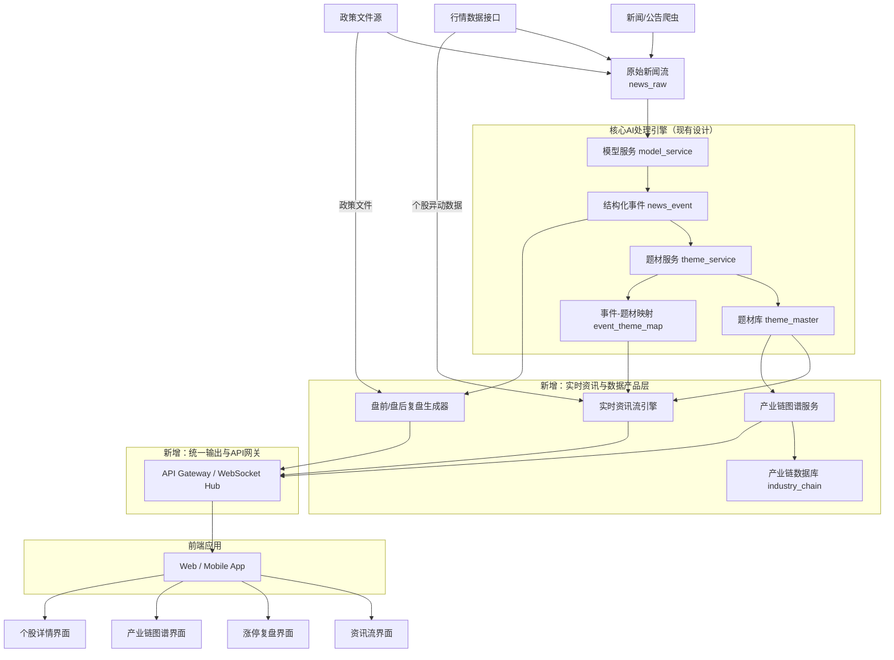
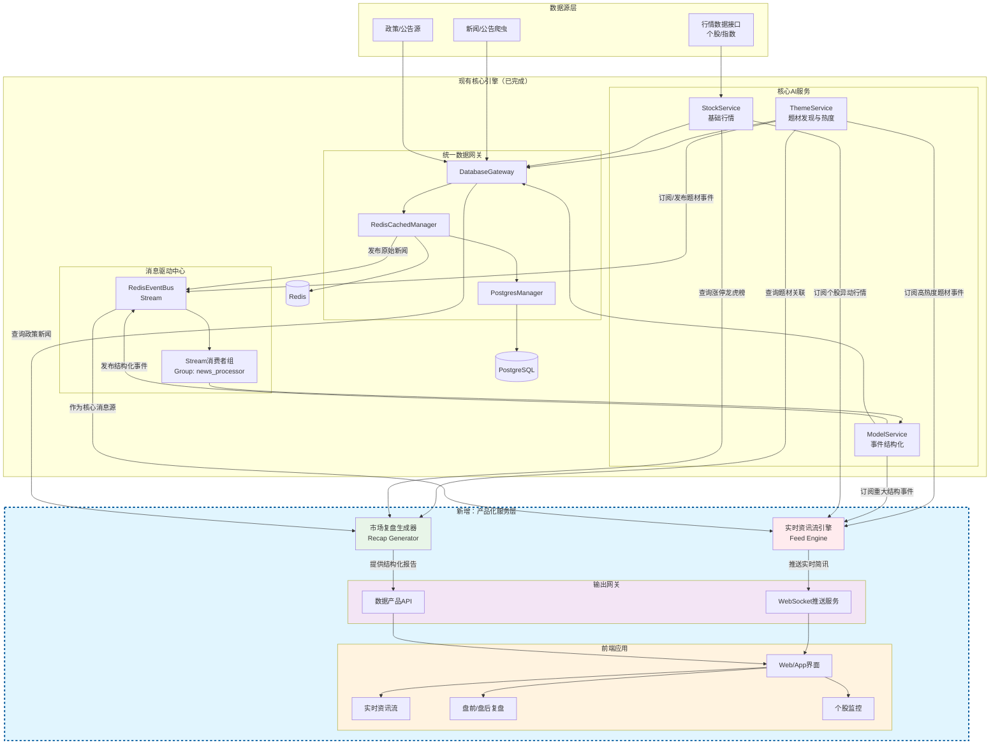

# 个人投资助理-项目架构设计（第三阶段：股票服务模块）

> 2026-03-31 架构收口说明：
> 本文档在最初设计时，假设第三阶段会在第二阶段之后独立展开；但当前项目已经提前落地了 `P2.phase0` 的新闻事件与题材匹配主链、`P2.phase1` 的题材知识对象层与只读 API，以及 `P4.phaseA` 的 `/intel/feed` 聚合接口。因此，第三阶段不应再被理解为“从零新增一个产品层”，而应被理解为“在既有题材知识中台之上，补齐股票服务、实时情报与前端统一出口”。本版以下内容均以这一现实基线为前提。

## 0. 与当前已落地系统的兼容性评估

### 0.1 已落地能力

当前系统已经具备以下可复用基础：

- `news_raw -> news_event -> event_theme_map` 的生产级事件主链
- `theme_detail_snapshot / theme_history_event / theme_tree_relation / theme_stock_map` 的 serving 对象层
- `subject_key` 作为题材树、历史、榜单、股票池的统一业务主键
- `GET /themes`、`/themes/rank`、`/themes/{subject_key}`、`/history`、`/children`、`/stocks`
- `GET /intel/feed` 的第一版情报聚合接口

因此，第三阶段的新设计必须兼容上述对象与接口，不能再假设前端直接消费底层原子表，也不能重新定义题材主键体系。

### 0.2 当前设计与原第三阶段方案的关系

两者总体兼容，但需要做 4 个关键调整：

1. `theme_service` 应继续作为题材知识与只读领域服务，不应同时承担所有前端聚合逻辑。
2. `/intel/feed` 可以视为“实时资讯流引擎”的 PhaseA 版本，但当前仍是 `REST first`，不是秒级推送系统。
3. 前端不应长期直接拼接过多底层领域接口，应尽快在第三阶段前置 `BFF / API Gateway`。
4. `industry_chain_service` 当前数据真源尚不成熟，不应在现阶段提前独立服务化。

### 0.3 修订后的阶段目标

第三阶段的真实目标应调整为：

- 建立 `Tushare + JYHF` 双源协同的数据策略
- 补齐 `stock_service` 与个股日快照/异动能力
- 补齐 `recap_service` 与盘前必读/盘后复盘生成能力
- 增加 `notion_publisher` 作为报告落地层
- 建立 `frontend_bff / api_gateway` 作为 Web 前端统一出口
- 在现有题材知识中台之上形成“事件 -> 题材 -> 股票 -> 页面”的完整产品链

这里的关键收口是：

- `JYHF` 负责题材事件、题材股票池、题材视角情报
- `Tushare` 负责低成本、可持续的股票日频真源
- 第三阶段优先交付“每日稳定快照 + 盘前/盘后报告 + Notion 输出”，而不是一开始就建设完整高频实时行情平台

#### 0.3.1 第三阶段子阶段拆解建议

第三阶段应被视为完整阶段，而不是单一 `P3.phase1`。建议拆解为：

- `P3.phase0`
  - 前端统一产品出口第一版
  - 对应当前历史命名 `P3.phaseA`
  - 重点是 `frontend_bff / api_gateway / /api/*` 的产品出口收口
- `P3.phase1`
  - `stock_service` 双源事实层与复盘快照
  - 重点是 `Tushare + JYHF`、股票对象层、盘前必读、盘后复盘、Notion 输出基础
- `P3.phase2`
  - 复盘增强与工作台深化
  - 重点是龙虎榜/资金行为增强、个股工作台与 `/recap` 页面深化
- `P3.phase3`
  - 实时化与高级增强
  - 重点是 `SSE`、更细粒度异动监控与轻图谱扩展

因此，当前文档中出现的 `P3.phase1` 应被理解为第三阶段的第一个正式业务子阶段，而不是整个第三阶段本身。

### 0.4 第三阶段数据源策略（Tushare + JYHF）

基于当前项目状态，建议将第三阶段的数据源策略冻结为“双源分工”：

#### 0.4.1 JYHF 的职责

- 题材事件真源：`subject/top-history?type=3`
- 题材股票池真源：`subject children / stock list / stock daily snapshot`
- 题材上下文：`subject detail / subject tree / subject history`

JYHF 的定位不是全市场股票行情主源，而是“题材语义真源”。

#### 0.4.2 Tushare 的职责

- 股票日线/日频指标主源
- 交易日历、基础证券主数据
- 盘前/盘后复盘需要的股票级事实字段
- 后续按需扩展到公告、新闻、龙虎榜、资金流

Tushare 在第三阶段的定位是“低成本付费的股票日频真源”，优先满足：

- 每日股票快照稳定落库
- 盘前必读/盘后复盘生成
- 与 JYHF 题材池做标准化拼接

#### 0.4.3 不纳入第三阶段首批范围的数据源

- 秒级全市场高频行情专线
- 独立 Tick 真源
- 多家商业高价数据源的并行接入

这些能力可在后续阶段通过 `QuoteGateway` 扩展，但不应阻塞第三阶段首批交付。

### 0.5 实时刷新策略修订

基于当前已落地能力，情报台实时刷新不建议第一步直接建设完整 WebSocket Hub，而应采用：

- 第一阶段：`SSE + 轮询兜底`
- 第二阶段：视并发与多端需求再升级到 `WebSocket`

原因：

- 当前前端需求是典型“服务端单向推送新情报”
- `frontend_bff` 已落地，最适合先在其上提供 `GET /api/intel/stream`
- 现有 `/api/intel/feed` 已经稳定，可作为断线恢复和补拉兜底
- 这样可以最小改动接入真实新闻抓取、结构化、匹配成功后的增量推送链

而不是另起一套与第二阶段并行的产品后端。

### **🔍 核心发现：现有架构与目标产品的差距**

现有的设计是一个强大的**后台数据处理引擎**，专注于从新闻到题材的**自动化发现与量化**。然而，截图中的产品（如“当前必读”、“涨停复盘”）展现的是一个**面向投资者的、实时交互的终端数据产品**。两者之间存在关键的“最后一公里”差距，主要体现在产品形态和时效性上。

| **对比维度** | **您的现有设计方案** | **截图中的目标产品** |
| --- | --- | --- |
| **核心产品** | 题材知识库、热度API、生命周期状态 | **即时资讯流**、**盘前必读**、**涨停复盘**、**龙虎榜**、**产业链图谱** |
| **数据时效** | 批次处理（T+1或分钟级） | **秒级/实时** 推送与更新 |
| **交互形态** | 以提供结构化数据接口为主 | **强交互前端**：时间线、表格、标签筛选、详情钻取 |
| **数据广度** | 集中于新闻事件驱动的题材 | 扩展至**个股行情、资金面、政策公告、产业链**等多维度数据 |

### **🚀 新增核心模块设计方案（按当前项目状态修订）**

为了弥补上述差距，建议在现有架构前端新增一个 **“实时资讯与监控服务”（Real-time Feed & Monitoring Service）** ，直接面向最终用户。以下是三个关键子模块的设计。

### **1. 实时资讯流引擎 (Real-time Feed Engine)**

此模块负责聚合所有信号，生成类似截图首页的时间线动态。

- **数据源**：
    - 接入现有 `theme_service` 产出的**高热度题材事件**。
    - 接入行情数据源的**个股异动**（快速涨跌、放量）。
    - 接入原始新闻流中的**重大政策/公告**。
- **处理逻辑**：
    - **优先级排序**：综合事件的热度值、影响范围、时效性进行动态排序。
    - **动态摘要生成**：利用现有`model_service`的能力，为每个推送项生成类似“【驱动事件】...”的简洁摘要。
    - **富标签标记**：自动标记“新题材”、“涨停”、“政策”等标签，便于前端高亮显示。
- **输出**：
    - 第一阶段：提供 `REST` 聚合接口（当前已落地 `/intel/feed`）
    - 第二阶段：再升级到 `WebSocket / SSE`

> 修订说明：
> 当前 `/intel/feed` 已经存在，因此“实时资讯流引擎”不应重新从零设计，而应采用两阶段路线：
> `REST first -> push later`。

### **2. 盘前/盘后复盘生成器 (Market Recap Generator)**

此模块自动化生成截图中的“当前必读”、“涨停复盘”等结构化报告。

- **盘前必读**：
    - **触发**：每个交易日早上定时运行。
    - **逻辑**：扫描前一日晚间至当日凌晨的**政策公告**（如截图中的“广州商业航天”规划）、**重要公司新闻**、**外围市场重大动态**。
- **生成**：调用大模型（复用`model_service`）对信息进行摘要、归纳，并结构化输出为“1、2、3...”的列表。
- **涨停复盘**：
    - **触发**：每日收盘后运行。
    - **逻辑**：连接当日涨停板数据，与`theme_service`中的题材库进行关联。
- **生成**：自动生成“热门题材复盘”表格，统计各题材的**涨停家数、连板高度、龙头个股**（如“引力传媒5天4板”），并计算题材强度。

> 修订说明：
> 现阶段更适合先实现为“批次生成任务 + 快照表 + 只读 API”，而不是先实现为常驻在线服务。建议优先产出：
> - `pre_market_brief_snapshot`
> - `post_market_recap_snapshot`
> - `limit_up_recap`
>
> 并增加一个独立的 `notion_publisher` 作为输出层，将上述快照同步到指定 Notion 页面，而不是让业务服务直接写 Notion。

### **3. 产业链图谱服务 (Industry Chain Graph Service)**

此模块对应截图中的“机器人”等详细产业链分解页面，将题材落地到具体投资标的。

- **数据建设**：
    - 在现有`theme_master`（题材库）基础上，新增 `industry_chain`（产业链） 和 `chain_component`（产业链环节） 表，建立“题材 - 产业链 - 环节 - 个股”的层级关系。
    - 示例：题材“机器人” -> 产业链“减速器” -> 环节“谐波减速器” -> 个股“绿的谐波”。
- **服务接口**：
    - 提供查询接口，返回某个题材的完整树状产业链结构及各环节对应的股票列表。
    - 提供关联接口，查询某只股票属于哪些题材的哪些产业链环节。

> 修订说明：
> 当前项目已经具备 `theme_tree_relation + theme_stock_map`，但尚未形成稳定的“产业链环节级知识真源”。因此，这一模块暂不建议立即独立成服务，而应先以“轻图谱/题材树 + 股票池”形态落在前端工作台中，待环节级数据真源稳定后再独立服务化。

### **⚙️ 关键优化与集成方案**

在新增模块的同时，需对现有架构进行关键优化以确保新需求得以满足。

1. **现有架构的性能与时效性优化**
    - **`theme_service` 热度计算实时化**：将部分批处理的热度计算改为基于事件的**增量实时计算**，确保当重要新闻出现时，相关题材热度能秒级更新并触发资讯流推送。
    - **`LocalThemeMatcher` 匹配加速**：为高频出现的概念（如“AI”、“航天”）建立内存级缓存，减少实时匹配的延迟。
2. **数据融合与关联**
    - 建立一个 **“全局实体关联服务”** ，将`news_event`中的公司、概念，与行情系统中的股票代码、产业链环节中的公司进行精准关联。这是实现“事件->题材->个股”无缝串联的基础。
    - 当前阶段至少要先补一层轻量 `entity_link_service` 或统一 binding 视图，避免前端或聚合接口各自重复做“公司名 -> 股票代码 -> 题材”映射。
3. **前端架构建议**
    - 采用组件化设计，封装 **“资讯流卡片”**、**“复盘表格”**、**“产业链树”** 等业务组件，以快速构建截图所示的多类页面。

4. **统一输出网关前置**
    - 在当前项目状态下，应将 `frontend_bff / api_gateway` 提前到第三阶段首批范围。
    - 原因：
      - 前端已经开始前置实现 `/intel`
      - 当前 `theme_service` 已同时承载领域查询与部分聚合输出
      - 若不尽快增加统一出口，前端会持续耦合到底层领域接口

### **📊 演进路线图建议（修订版）**

建议分阶段实施，以快速验证核心价值：

- **第一阶段（前置产品层）**：
  - `frontend_bff / api_gateway`
  - `REST 版 Intel Feed`
  - `/intel` 页面
  目标是先把现有 `theme_service + serving 表` 的成果产品化。
- **第二阶段（股票真源与复盘）**：
  - `stock_service` 的日快照/异动/榜单对象层
  - `recap_service` 的盘前必读/盘后复盘生成
  - `notion_publisher` 的报告同步
- **第三阶段（实时化与知识深化）**：
  - `实时资讯流引擎 push 化（优先 SSE）`
  - 产业链环节知识建设
  - 产业链图谱服务独立化
  - 更复杂的个股工作台与资金行为分析

## 4. 修订后的推荐总体架构

```text
核心数据层
JYHF: news_raw / news_event / event_theme_map / theme_detail_snapshot / theme_history_event / theme_tree_relation / theme_stock_map
Tushare: stock_basic / trade_calendar / daily_quote / daily_factor / optional_notice
Derived: subject_stock_daily_snapshot / stock_daily_snapshot / stock_abnormal_event / theme_stock_leaderboard

领域服务层
theme_service
stock_service
entity_link_service(新增)

产品聚合层
intel_service(已有 PhaseA，继续演进)
recap_service(新增)
workspace_service(后续)

统一输出层
frontend_bff / api_gateway(新增)
notion_publisher(新增，非前端出口)

前端
/intel
/themes/:subject_key
/stocks/:stock_id
/recap
```

上述结构与当前已落地的第二阶段、前置第四阶段设计兼容，且能够避免前端直接耦合到过多底层服务。

### **🆕 架构图核心新增部分解读**

图中标红部分为建议**新增**的核心模块，它们共同构成了面向用户的数据产品层：

1. **实时资讯流引擎**
    - **位置**：位于`theme_service`之后，作为热数据的首次聚合出口。
    - **输入**：高热度`news_event`、实时行情异动。
    - **功能**：进行**秒级优先级排序**，生成带摘要和标签的推送条目。
2. **盘前/盘后复盘生成器**
    - **位置**：作为一个定时/事件触发的分析服务。
    - **输入**：前日的重大`news_event`、涨停板行情数据。
    - **功能**：调用模型**生成结构化报告**（如“1, 2, 3”要点列表、涨停统计表格）。
3. **产业链图谱服务**
    - **位置**：与`theme_service`并列，专注于实体关系拓展。
    - **输入**：`theme_master`题材库、外部产业链知识。
    - **功能**：构建和管理**“题材-产业链-环节-个股”** 的树状知识图谱，并提供查询API。
4. **Notion Publisher**
- **位置**：位于产品输出层，消费 `recap_service` 生成的快照。
- **功能**：将盘前必读和盘后复盘同步到指定 Notion 页面或数据库，不参与业务计算。
5. **统一输出与API网关**
- **位置**：所有后端服务的总出口。
- **功能**：聚合上述所有服务的接口，提供**一致的 API** 和后续可扩展的实时连接能力，是前后端解耦的关键。

### **🔗 关键数据流与优化点**

为了支撑新增模块，需要特别关注以下**数据流优化**：

- **实时性提升**：`theme_service`的热度计算需要支持**增量更新**，确保重要事件能秒级触发资讯流。
- **数据关联**：需建立**“全局实体解析器”**，确保从新闻中提取的公司名、概念能精准关联到股票代码和产业链环节，这是串联所有模块的“粘合剂”。
- **前端组件化**：对应新增的数据产品，前端应封装**资讯卡片、复盘表格、图谱树**等业务组件，以快速构建页面。



### **架构图核心解读**

**红色虚线框部分为建议新增的核心模块**，它们将您的AI处理引擎转化为面向用户的数据产品：

1. **实时资讯流引擎** - 核心产品化输出
- **输入**：高热度题材事件 + 实时行情异动
- **处理**：秒级优先级排序，生成带摘要的推送卡片
- **对应截图功能**：首页时间线资讯流（如"09:37 AI应用 +2.39%"）
1. **盘前/盘后复盘生成器** - 专业价值深化
- **输入**：前日重大事件 + 涨停板数据
- **处理**：定时分析，生成结构化复盘报告
- **对应截图功能**："当前必读"、"涨停复盘"、"龙虎榜"
1. **产业链图谱服务** - 知识壁垒构建
- **输入**：题材库 + 产业链知识
- **处理**：构建"题材-产业链-环节-个股"树状图谱
- **对应截图功能**："机器人"产业链分解页面
1. **统一输出网关** - 架构解耦关键
- **作用**：聚合所有服务接口，提供一致的数据出口
- **技术**：REST API + WebSocket实时推送

### **关键架构决策点**

1. **先稳定日频真源，再补实时复杂度**：第三阶段首要目标不是秒级行情，而是保证 `Tushare + JYHF` 每日稳定入库与可复盘。
2. **报告必须基于快照生成**：盘前必读和盘后复盘都应读取标准化快照表，而不是在生成时直接依赖外部 API。
3. **Notion 必须独立为输出层**：Notion 是报告落点，不是计算真源。
4. **实体关联必须平台化**：需建立**全局实体解析器**，统一新闻中的公司名与股票代码的映射关系。
5. **前端只能通过 BFF 取数**：避免页面继续耦合到底层领域表与服务。

### **演进实施建议**

按照价值递进顺序实施：

1. **P3.phase0：统一产品出口前置**
   - 即历史定义中的 `P3.phaseA`
   - 收口 `frontend_bff / /api/*`
   - 为后续 `stock_service / recap_service` 提供稳定产品出口边界
2. **P3.phase1：数据真源与 stock_service 骨架**
   - 冻结 `Tushare + JYHF` 数据源分工
   - 建立 `stock_daily_snapshot / stock_abnormal_event / theme_stock_leaderboard`
   - 冻结 `stock_service` 的最小对象与查询接口
3. **P3.phase2：盘前必读 / 盘后复盘**
   - 建立 `pre_market_brief_snapshot / post_market_recap_snapshot`
   - 先交付批次生成和只读 API
   - 让前端与后续输出只读快照，不直接重算
4. **P3.phase3：Notion 输出与实时化增强**
   - 增加 `notion_publisher`
   - 视需求将 `/intel` 从 `REST first` 增强到 `SSE`
   - 再决定是否推进更重的产业链图谱服务

### **架构调整核心：打通现有引擎到产品界面**

这个修正后的架构图准确地建立在您已完成的 **Redis Stream + PostgreSQL 数据管道** 之上。关键在于新增的 **“产品化与输出层”** ，它的作用是将您后台强大的数据处理能力，转化为截图中所见的、用户可交互的终端产品。以下是三个核心新增模块的详细设计思路：

**1. 实时资讯流引擎 (Real-time Feed Engine)**

- **定位**：作为现有 `RedisEventBus` 的一个**智能消费者**。
- **输入**：同时订阅来自 `ThemeService`（高热度题材）、`ModelService`（重大事件）、`StockService`（行情异动）的消息流。
- **核心逻辑**：对多源信息进行**实时融合、去重、优先级排序**，并调用大模型生成简讯摘要。
- **输出**：生产结构化的资讯条目，通过 `WebSocket服务` 推送到前端，形成截图中的时间线。

**2. 市场复盘生成器 (Market Recap Generator)**

- **定位**：一个**定时/事件触发**的分析任务。
- **输入**：
    - **盘前**：通过 `DatabaseGateway` 查询前夜的政策、公告类新闻。
    - **盘后**：通过 `StockService` 获取当日涨停、龙虎榜数据，并通过 `ThemeService` 获取题材关联。
- **核心逻辑**：汇总数据后，调用 `ModelService` 的摘要与归纳能力，自动化生成如截图所示的结构化报告（“1, 2, 3…”要点列表和涨停统计表）。

**3. 产业链图谱服务 (Industry Chain Service)**

- **定位**：一个独立的**知识图谱管理服务**。
- **数据构建**：需要新建 `industry_chain` 表，与现有 `theme_master` 关联，人工或半自动地维护“题材 -> 产业链 -> 细分环节 -> 成分股”的树状关系。
- **输出**：提供API，为前端“机器人”那样的详情页提供完整的树形结构数据。

### **⚙️ 关键集成点与数据流**

为确保新增模块与现有架构无缝集成，需重点关注以下数据流：

1. **资讯流的实时性**：`ThemeService` 在计算热度或发现新题材时，不仅写库，还需通过 `RedisEventBus` 发布一个**事件消息**，从而被 `实时资讯流引擎` 实时消费。
2. **复盘的数据聚合**：`Market Recap Generator` 需要能通过统一的 `DatabaseGateway` 查询 `news_raw`、`news_event`、`theme_master` 以及行情数据库，这要求 `DatabaseGateway` 已适配这些表的访问。
3. **实体标识统一**：这是所有模块联动的基石。必须确保 `ModelService` 从新闻中提取的“公司名称”，与 `StockService` 和产业链库中的“股票代码”能准确映射。建议在 `DatabaseGateway` 层之上建立一个 **“实体归一化”** 服务。



### **架构解读：如何从数据引擎到信息产品**

这个架构图的核心是 **“产品化服务层”** ，它由两个关键的新服务和统一的输出网关构成，将您后台的实时数据流转化为用户可直接消费的信息产品。

**1. 实时资讯流引擎**

- **角色**：它是您现有 `RedisEventBus` 的 **“终极消费者”** 和 **“信息编辑”**。
- **工作流**：同时订阅 `ModelService`（重大事件）、`ThemeService`（热门题材）、`StockService`（行情异动）等多个 `Stream`，进行**多源信息融合**。然后，它对事件进行智能排序（例如，将“新题材诞生”和“龙头股涨停”置顶），并调用模型生成类似截图中的精炼摘要（`【驱动事件】...`），最终通过 `WebSocket服务` 实时推送到前端界面。

**2. 市场复盘生成器**

- **角色**：它是一个 **“定时分析师”** ，负责生成每日的总结报告。
- **工作流**：
    - **盘前必读**：在交易日早上，通过 `DatabaseGateway` 查询夜间的重要政策和公司公告，生成要点列表。
    - **盘后复盘**：收盘后，从 `StockService` 获取涨停板、龙虎榜数据，并联合 `ThemeService` 分析题材强度，自动生成“涨停家数”、“连板高度”等结构化表格。
- **输出**：其结果先写入 `pre_market_brief_snapshot / post_market_recap_snapshot`，再通过 `数据产品API` 提供给前端，并由 `notion_publisher` 输出到 Notion 页面。

**3. 统一输出网关**

- **作用**：对前端提供一致且高效的访问方式。`WebSocket推送服务`负责处理高并发的实时资讯流，而 `数据产品API` 则提供复盘报告等准实时数据查询，实现动静分离。

### **🎯 核心集成与优化点**

1. **事件驱动是关键**：确保 `ThemeService` 在计算热度或发现新题材时，不仅更新数据库，也向 `RedisEventBus` 发布一个类型为 `theme.hot` 或 `theme.new` 的事件，这样才能被 `实时资讯流引擎` 实时捕获。
2. **复用模型能力**：`实时资讯流引擎` 和 `市场复盘生成器` 在生成文本摘要时，应通过内部接口调用现有的 `ModelService`，而不是重复建设，确保分析能力的一致性。
3. **前端组件化**：前端应根据这两种数据形态（流式推送 vs. 文档报告），封装“资讯卡片”和“复盘表格”等专用组件，以快速构建截图中的各类页面。
4. **股票服务先做日频对象层**：第三阶段首批不以“5000 股票 3 秒轮询”作为落地前提，而是先以交易日级稳定快照、异动派生、复盘对象层作为产品基础。

# **Stock Service 模块详细技术实施方案**

## **1. 模块架构总览**

### **1.1 模块定位与技术挑战**

#### **1.1.0 对 Stock Service 核心定位的需求审视**

原始定位中包含以下 4 类职责：

1. **实时行情处理**：秒级行情数据采集、标准化、分发
2. **市场状态识别**：涨停/跌停判断、连板计算、异动监控
3. **资金行为分析**：龙虎榜解析、主力资金流向
4. **融合分析服务**：个股-题材关联、龙头股识别

这 4 项方向上都成立，但不应在第三阶段首批被无差别接受为同优先级目标。按当前项目状态、数据源现实与产品目标，应做如下判断：

| 能力项 | 合理性 | 当前可行性 | 实现难度 | 首批优先级 | 判断 |
| --- | --- | --- | --- | --- | --- |
| 实时行情处理（秒级） | 中 | 低 | 高 | 低 | 方向长期合理，但与当前“盘前必读/盘后复盘”主目标不匹配，不应作为第三阶段首批门槛。 |
| 市场状态识别 | 高 | 高 | 中 | 高 | 涨停/跌停、连板、异动是复盘和选股工作台的基础，应进入首批范围。 |
| 资金行为分析 | 中高 | 中 | 中高 | 中 | 有价值，但严重依赖稳定外部源与字段质量，建议放到第二批增强。 |
| 融合分析服务 | 高 | 高 | 中 | 高 | 个股-题材关联、龙头识别与现有 JYHF 题材链高度协同，应作为首批核心价值。 |

结论：

- 第三阶段首批不应把 `Stock Service` 定义成“秒级实时行情平台”。
- 更合理的定义是：“以股票日频事实对象层为核心，支持市场状态识别与题材融合分析，并为盘前必读/盘后复盘提供稳定输入。”
- “资金行为分析”与“秒级实时行情”都应作为增强项，而非首批上线门槛。

**核心定位**：Stock Service 是系统的“股票事实对象层”，第三阶段首批负责：

1. **每日快照标准化**：将 `Tushare` 日频股票数据标准化并落库
2. **题材股票拼接**：与 `JYHF` 题材池做标准化关联
3. **市场状态识别**：涨停/跌停、连板、龙头、扩散等派生状态
4. **为复盘服务供数**：向 `recap_service` 输出稳定对象，而不是直接面向前端拼装页面

**技术挑战**：

- **数据真源稳定性**：确保每日股票快照完整可回放
- **状态复杂性**：A股特殊规则（ST、新股、复牌股等）
- **跨源映射**：题材视角与股票视角的标准化绑定
- **派生一致性**：盘前/盘后报告读取同一批快照与派生结果

#### **1.1.1 四类能力的具体评估**

##### **A. 实时行情处理**

**合理性**：

- 长期合理，尤其对盘中工作台、异动推送、SSE 情报流有价值。

**当前问题**：

- 与当前确定的 `Tushare + JYHF` 方案并不天然匹配。`Tushare` 更适合作为日频/准日频真源，不是低成本秒级全市场实时主源。
- 秒级行情将立即带来调度、限流、缓存、质量校验、熔断回退、会话管理等一整套基础设施复杂度。

**结论**：

- 第三阶段首批不纳入“秒级全市场行情处理”门禁。
- 可保留为后续扩展接口设计约束，但不作为首批实现目标。

##### **B. 市场状态识别**

**合理性**：

- 非常高。涨停、跌停、连板、异动是盘后复盘与盘前观察池的直接输入。

**当前可行性**：

- 高。基于 `Tushare` 日频快照、交易日历和现有 `JYHF` 题材股票池，已足够支持首批状态计算。

**实现难点**：

- A 股规则处理复杂，特别是 ST、创业板/科创板、次新股、停复牌、涨跌停制度差异。

**结论**：

- 必须纳入第三阶段首批。
- 但首批建议以“日频状态识别 + 盘后异动派生”为主，不先做盘中分钟级异动引擎。

##### **C. 资金行为分析**

**合理性**：

- 有价值，尤其对复盘和高级用户判断主线强弱很重要。

**当前可行性**：

- 中等。龙虎榜、主力资金流、席位行为等能力强依赖外部数据源覆盖与稳定性，不适合作为第三阶段首批核心依赖。

**实现难点**：

- 外部源成本、字段口径不一、历史回溯一致性、解释性要求都较高。

**结论**：

- 建议作为第二批增强能力。
- 首批只保留表结构与接口预留，不承诺完整产品能力。

##### **D. 融合分析服务**

**合理性**：

- 非常高。这是当前项目最具差异化价值的部分。

**当前可行性**：

- 高。现有 `JYHF` 题材事件、题材池、题材详情、`event_theme_map` 已经提供了较强的融合基础。

**实现难点**：

- 龙头识别算法需要解释性，不应一开始做成黑盒评分。

**结论**：

- 必须纳入第三阶段首批。
- 建议首批优先实现：
  - 个股-题材绑定
  - 题材内强弱股排序
  - 龙头/前排/扩散股的规则化识别

#### **1.1.2 第三阶段首批建议冻结的职责边界**

综合以上评估，第三阶段首批的 `stock_service` 职责应冻结为：

1. `Tushare` 日频股票事实标准化
2. 与 `JYHF` 题材池做标准化绑定
3. 盘后状态识别：涨停/跌停/连板/龙头候选/扩散股
4. 为 `recap_service` 和工作台输出稳定对象

暂不纳入首批门禁的职责：

1. 秒级全市场实时行情采集与推送
2. 复杂资金行为全量分析
3. 高频盘中策略信号引擎
4. 依赖高成本商业数据源的高级行情功能

#### **1.1.3 第三阶段需求优先级矩阵（MoSCoW）**

为避免第三阶段范围继续膨胀，建议按 `Must / Should / Could / Later` 冻结优先级：

##### **Must：首批必须交付**

- `Tushare` 日频股票真源接入
- `JYHF` 题材事件与题材股票池接入
- `stock_daily_snapshot`
- `subject_stock_daily_snapshot`
- `stock_abnormal_event`
- `theme_stock_leaderboard`
- 盘前必读快照 `pre_market_brief_snapshot`
- 盘后复盘快照 `post_market_recap_snapshot`
- `frontend_bff` 只读查询接口
- `notion_publisher` 的报告发布能力

##### **Should：第二优先级，首批后尽快补齐**

- 龙虎榜结构化解析
- 主力资金流字段接入
- 更稳定的龙头/前排/扩散股规则体系
- `/intel` 的 `SSE` 推送能力
- 个股工作台初版

##### **Could：有价值，但不应阻塞首批**

- 分钟级异动监控
- 轻量盘口特征
- 板块内多因子排序
- 产业链环节级轻图谱
- 更多外部数据源备用接入

##### **Later：明确后置，不纳入第三阶段首批承诺**

- 秒级全市场实时行情平台
- Tick 级全量处理
- 高频盘中策略信号引擎
- 高成本商业行情体系的深度耦合
- 独立重型产业链图谱服务

#### **1.1.4 不建议直接接受的需求口径**

以下口径在讨论时容易被直接接受，但在当前阶段应明确审慎处理：

1. “必须支持 5000+ 股票秒级实时处理”
   - 这会直接把第三阶段拉向高频行情平台建设，偏离盘前/盘后报告主目标。
2. “必须同时做完资金行为全量分析”
   - 外部源成本、字段可得性和解释性门槛都较高，首批不宜承诺。
3. “必须一开始就实现完整个股工作台”
   - 个股页面可以逐步增强，但不应早于事实对象层和复盘快照稳定。
4. “必须先做实时，再做报告”
   - 当前正确顺序应相反：先稳定快照与报告，再做实时增强。

### **1.2 核心架构设计**

第三阶段建议采用以下收敛版架构：

```text
Tushare Adapter ----\
                      -> stock_ingest_daily -> stock_daily_snapshot
JYHF Adapter -------/                         -> subject_stock_daily_snapshot

stock_daily_snapshot + subject_stock_daily_snapshot
    -> stock_abnormal_event
    -> theme_stock_leaderboard
    -> recap_service

recap_service
    -> pre_market_brief_snapshot
    -> post_market_recap_snapshot

pre/post snapshots
    -> frontend_bff
    -> notion_publisher
```

该设计强调：

- 外部源先入本地快照，再做派生
- 报告与页面都读快照，不直接依赖外部源
- `stock_service` 首批不以重型实时推送为前提

## **2. 核心子模块详细设计**

### **2.1 行情网关适配器 (QuoteGateway)**

### **2.1.1 架构设计**

python

```
class UnifiedQuoteGateway:
    """统一行情网关，第三阶段首批以 Tushare 为主源，预留多源扩展"""

    def __init__(self):
        self.adapters = {
            'tushare': TushareAdapter(),
            'jyhf': JYHFAdapter()
        }
        self.active_adapter = 'tushare'
        self.fallback_chain = ['tushare']

    async def get_daily_quotes(self, trade_date: str, symbols: List[str]) -> List[StandardQuote]:
        """获取交易日快照（标准化输出）"""
        for adapter_name in self.fallback_chain:
            try:
                adapter = self.adapters[adapter_name]
                raw_data = await adapter.fetch_daily(trade_date, symbols)
                standardized = self._standardize_quotes(raw_data)

                # 数据质量校验
                if self._validate_data_quality(standardized):
                    self.active_adapter = adapter_name
                    return standardized
            except Exception as e:
                logger.warning(f"Adapter{adapter_name} failed:{e}")
                continue

        raise QuoteGatewayError("All adapters failed")

    def _standardize_quotes(self, raw_data: dict) -> List[StandardQuote]:
        """标准化行情数据结构"""
        return [
            StandardQuote(
                symbol=item['code'],
                name=item['name'],
                last_price=float(item['price']),
                change_percent=float(item['percent']),
                volume=int(item['volume']),
                amount=float(item['amount']),
                bid_price=float(item.get('bid', 0)),
                ask_price=float(item.get('ask', 0)),
                timestamp=datetime.fromtimestamp(item['timestamp']),
                # 分时数据
                time_series=item.get('time_series', []),
                # Level2数据（如果可用）
                level2=item.get('level2', {})
            )
            for item in raw_data
        ]
```

### **2.1.2 连接管理与心跳机制**

第三阶段首批不建议引入长连接行情心跳与复杂重连管理。更适合采用：

- 交易日级批量拉取
- 落地本地原始快照文件
- 入库前做字段完整性、交易日一致性、涨跌幅边界校验
- 失败时整批重试或切换备用任务窗口

也就是说，第三阶段先把“每日稳定可回放”做实，而不是把系统设计重心放在长连接行情基础设施上。
        logger.error(f"Failed to reconnect to{adapter_name}")
        return False
```

### **2.2 股票状态机 (StockStateMachine)**

### **2.2.1 核心状态判断算法**

python

```
class StockStateMachine:
    """股票交易状态判断机"""

    # A股特殊规则定义
    RULES = {
        'NORMAL': {'limit_up': 0.10, 'limit_down': -0.10},
        'ST': {'limit_up': 0.05, 'limit_down': -0.05},
        'NEW_SHARE': {  # 新股首日规则
            'first_day': {'limit_up': 0.44, 'limit_down': -0.36},
            'subsequent_days': {'limit_up': 0.10, 'limit_down': -0.10}
        },
        'RESUME': {  # 复牌股
            'first_day': {'limit_up': 1.00, 'limit_down': -1.00}  # 不设涨跌幅限制
        }
    }

    def __init__(self):
        self.stock_info_cache = {}  # 缓存股票基本信息
        self.state_history = {}     # 状态历史记录

    async def calculate_stock_state(self, quote: StandardQuote) -> StockState:
        """计算股票当前状态"""
        # 1. 获取股票基本信息
        stock_info = await self._get_stock_info(quote.symbol)

        # 2. 确定适用规则
        rule = self._determine_rule(stock_info, quote)

        # 3. 计算涨跌停价格
        limit_prices = self._calculate_limit_prices(quote, rule, stock_info)

        # 4. 判断当前状态
        current_state = self._judge_current_state(quote, limit_prices)

        # 5. 更新连板信息
        if current_state.status == 'LIMIT_UP':
            await self._update_limit_chain(quote, current_state)

        # 6. 记录状态转换
        await self._record_state_transition(quote, current_state)

        return current_state

    def _determine_rule(self, stock_info: dict, quote: StandardQuote) -> dict:
        """确定适用的涨跌停规则"""
        symbol = quote.symbol

        if stock_info.get('is_st', False):
            return self.RULES['ST']

        if stock_info.get('is_new', False):
            listing_date = stock_info['listing_date']
            if quote.timestamp.date() == listing_date:
                return self.RULES['NEW_SHARE']['first_day']
            else:
                return self.RULES['NEW_SHARE']['subsequent_days']

        if stock_info.get('is_resumed', False):
            resume_date = stock_info['resume_date']
            if quote.timestamp.date() == resume_date:
                return self.RULES['RESUME']['first_day']

        return self.RULES['NORMAL']

    def _judge_current_state(self, quote: StandardQuote, limit_prices: dict) -> StockState:
        """判断当前交易状态"""
        price = quote.last_price
        prev_close = quote.prev_close

        # 判断涨停
        if price >= limit_prices['limit_up']:
            # 检查是否为"一字板"
            if quote.open_price >= limit_prices['limit_up']:
                board_type = '一字板'
            else:
                board_type = '换手板'

            return StockState(
                status='LIMIT_UP',
                board_type=board_type,
                limit_price=limit_prices['limit_up'],
                strength=self._calculate_limit_strength(quote)
            )

        # 判断跌停
        elif price <= limit_prices['limit_down']:
            return StockState(
                status='LIMIT_DOWN',
                limit_price=limit_prices['limit_down']
            )

        # 检查炸板状态
        elif self._check_board_broken(quote, limit_prices):
            return StockState(
                status='BOARD_BROKEN',
                broken_time=quote.timestamp
            )

        # 正常交易状态
        else:
            return StockState(
                status='NORMAL',
                change_percent=quote.change_percent
            )

    def _calculate_limit_strength(self, quote: StandardQuote) -> float:
        """计算涨停强度"""
        # 强度 = 封单金额 / 流通市值 * 系数
        bid_amount = quote.bid_volume * quote.last_price
        circulating_market_cap = quote.circulating_market_cap

        if circulating_market_cap > 0:
            strength = (bid_amount / circulating_market_cap) * 100
            return min(strength, 100)  # 限制在0-100之间
        return 0
```

### **2.2.2 连板计算引擎**

python

```
class LimitChainCalculator:
    """连板计算引擎"""

    def __init__(self):
        self.chain_cache = LRUCache(maxsize=1000)

    async def calculate_limit_chain(self, symbol: str, current_state: StockState) -> LimitChain:
        """计算连板信息"""
        # 从缓存获取历史记录
        history = self.chain_cache.get(symbol, [])

        if current_state.status == 'LIMIT_UP':
            # 判断是否延续连板
            if self._is_chain_continued(history, current_state):
                chain_days = len(history) + 1

                # 更新历史记录
                history.append({
                    'date': current_state.timestamp.date(),
                    'state': current_state,
                    'type': current_state.board_type
                })
                self.chain_cache[symbol] = history
            else:
                # 新连板开始
                chain_days = 1
                history = [{
                    'date': current_state.timestamp.date(),
                    'state': current_state,
                    'type': current_state.board_type
                }]
                self.chain_cache[symbol] = history
        else:
            # 连板中断
            chain_days = 0
            self.chain_cache.pop(symbol, None)

        return LimitChain(
            symbol=symbol,
            chain_days=chain_days,
            chain_type=self._determine_chain_type(history),
            history=history,
            total_gain=self._calculate_total_gain(history)
        )

    def _determine_chain_type(self, history: List[dict]) -> str:
        """判断连板类型"""
        if not history:
            return 'NONE'

        board_types = [item['type'] for item in history]

        if all(t == '一字板' for t in board_types):
            return 'STRONG_ONE_WORD'  # 强一字
        elif '一字板' in board_types:
            return 'MIXED'  # 混合板
        else:
            return 'NORMAL_CHANGE_HANDS'  # 纯换手

    def _calculate_total_gain(self, history: List[dict]) -> float:
        """计算连板期间总涨幅"""
        if len(history) < 2:
            return 0

        first_price = history[0]['state'].prev_close
        last_price = history[-1]['state'].last_price

        return ((last_price - first_price) / first_price) * 100
```

### **2.3 异动监控引擎 (AnomalyMonitor)**

### **2.3.1 规则引擎设计**

python

```
class AnomalyRuleEngine:
    """异动规则引擎"""

    RULES = {
        # 涨速规则
        'QUICK_RISE_1MIN': {
            'condition': lambda q: q.change_percent_1min > 2.0,
            'priority': 'HIGH',
            'message': '1分钟涨超2%',
            'cool_down': 300  # 5分钟冷却
        },
        'QUICK_RISE_5MIN': {
            'condition': lambda q: q.change_percent_5min > 5.0,
            'priority': 'HIGH',
            'message': '5分钟涨超5%',
            'cool_down': 600  # 10分钟冷却
        },

        # 量比规则
        'VOLUME_SURGE': {
            'condition': lambda q: q.volume_ratio > 10 and q.amount > 10000000,
            'priority': 'MEDIUM',
            'message': '量比大于10且成交额过千万',
            'cool_down': 300
        },

        # 突破规则
        'BREAK_HIGH_20D': {
            'condition': lambda q: q.last_price > q.high_20d and q.volume > q.avg_volume_20d * 1.5,
            'priority': 'MEDIUM',
            'message': '突破20日新高',
            'cool_down': 1800  # 30分钟冷却
        },
        'BREAK_LOW_20D': {
            'condition': lambda q: q.last_price < q.low_20d,
            'priority': 'LOW',
            'message': '跌破20日新低',
            'cool_down': 1800
        },

        # 资金规则
        'LARGE_ORDER': {
            'condition': lambda q: q.large_order_ratio > 0.3,
            'priority': 'HIGH',
            'message': '大单占比超30%',
            'cool_down': 300
        },

        # 技术指标规则
        'RSI_OVERBOUGHT': {
            'condition': lambda q: q.rsi_14 > 80,
            'priority': 'LOW',
            'message': 'RSI超买',
            'cool_down': 1800
        },
        'RSI_OVERSOLD': {
            'condition': lambda q: q.rsi_14 < 20,
            'priority': 'LOW',
            'message': 'RSI超卖',
            'cool_down': 1800
        }
    }

    def __init__(self):
        self.rule_cooldowns = {}  # 规则冷却时间记录
        self.anomaly_history = []  # 异动历史记录

    async def check_anomalies(self, quote: StandardQuote) -> List[AnomalyAlert]:
        """检查异动规则"""
        alerts = []

        for rule_name, rule_config in self.RULES.items():
            # 检查冷却时间
            if self._is_in_cooldown(quote.symbol, rule_name):
                continue

            # 检查条件
            if rule_config['condition'](quote):
                alert = AnomalyAlert(
                    symbol=quote.symbol,
                    rule_name=rule_name,
                    priority=rule_config['priority'],
                    message=rule_config['message'],
                    data={
                        'price': quote.last_price,
                        'change_percent': quote.change_percent,
                        'volume': quote.volume,
                        'timestamp': quote.timestamp
                    },
                    timestamp=datetime.now()
                )

                alerts.append(alert)

                # 设置冷却时间
                self._set_cooldown(quote.symbol, rule_name, rule_config['cool_down'])

                # 记录历史
                self._record_anomaly(alert)

        return alerts

    def _is_in_cooldown(self, symbol: str, rule_name: str) -> bool:
        """检查是否在冷却期内"""
        key = f"{symbol}:{rule_name}"
        if key in self.rule_cooldowns:
            cooldown_until = self.rule_cooldowns[key]
            return datetime.now() < cooldown_until
        return False

    def _set_cooldown(self, symbol: str, rule_name: str, seconds: int):
        """设置冷却时间"""
        key = f"{symbol}:{rule_name}"
        self.rule_cooldowns[key] = datetime.now() + timedelta(seconds=seconds)
```

### **2.3.2 智能过滤与聚合**

python

```
class SmartAnomalyFilter:
    """智能异动过滤器"""

    def __init__(self):
        self.symbol_filters = {}
        self.cluster_detector = AnomalyClusterDetector()

    async def filter_and_aggregate(self, alerts: List[AnomalyAlert]) -> List[AggregatedAlert]:
        """过滤和聚合异动"""
        if not alerts:
            return []

        # 1. 按规则优先级排序
        sorted_alerts = sorted(alerts, key=lambda x: self._get_priority_score(x.priority), reverse=True)

        # 2. 去除重复/相似异动
        filtered_alerts = self._deduplicate_alerts(sorted_alerts)

        # 3. 检测异动集群
        clusters = await self.cluster_detector.detect(filtered_alerts)

        # 4. 聚合生成最终告警
        aggregated = []
        for cluster in clusters:
            if cluster.significance_score > 0.7:  # 显著性阈值
                aggregated.append(
                    AggregatedAlert.from_cluster(cluster)
                )

        return aggregated

    def _deduplicate_alerts(self, alerts: List[AnomalyAlert]) -> List[AnomalyAlert]:
        """去重相似异动"""
        seen = set()
        deduped = []

        for alert in alerts:
            # 生成唯一标识
            alert_key = self._generate_alert_key(alert)

            if alert_key not in seen:
                seen.add(alert_key)
                deduped.append(alert)

        return deduped

    def _generate_alert_key(self, alert: AnomalyAlert) -> str:
        """生成异动唯一标识"""
        # 基于：股票 + 规则类型 + 时间窗口
        timestamp_key = alert.timestamp.strftime("%Y%m%d%H%M")
        return f"{alert.symbol}:{alert.rule_name}:{timestamp_key}"
```

### **2.4 龙虎榜解析器 (DragonTigerParser)**

### **2.4.1 数据采集与解析**

python

```
class DragonTigerParser:
    """龙虎榜数据解析器"""

    def __init__(self):
        self.data_sources = {
            'sse': 'http://www.sse.com.cn/disclosure/diclosure/public/',
            'szse': 'http://www.szse.cn/disclosure/diclosure/public/',
            'juchao': 'http://www.cninfo.com.cn/new/commonUrl/pageOfSearch?url=disclosure/list/search'
        }
        self.seat_patterns = {
            '机构专用': 'INSTITUTION',
            '深股通专用': 'CONNECT_NORTH',
            '沪股通专用': 'CONNECT_NORTH',
            '营业部': 'BROKER',
            '游资': 'HOT_MONEY'
        }

    async def parse_daily_lhb(self, date: datetime) -> List[DragonTigerRecord]:
        """解析当日龙虎榜数据"""
        records = []

        for exchange, url in self.data_sources.items():
            try:
                raw_data = await self._fetch_lhb_data(exchange, date)
                parsed = self._parse_exchange_data(raw_data, exchange)
                records.extend(parsed)
            except Exception as e:
                logger.error(f"Failed to parse LHB for{exchange}:{e}")
                continue

        # 数据校验和去重
        validated = await self._validate_records(records)

        # 计算资金分析指标
        enriched = await self._enrich_with_analysis(validated)

        return enriched

    def _parse_exchange_data(self, raw_data: dict, exchange: str) -> List[DragonTigerRecord]:
        """解析交易所原始数据"""
        records = []

        for item in raw_data.get('data', []):
            # 解析席位类型
            seat_type = self._identify_seat_type(item['seat_name'])

            record = DragonTigerRecord(
                stock_code=item['stock_code'],
                stock_name=item['stock_name'],
                exchange=exchange,
                seat_name=item['seat_name'],
                seat_type=seat_type,
                buy_amount=float(item['buy_amount']),
                sell_amount=float(item['sell_amount']),
                net_amount=float(item['buy_amount']) - float(item['sell_amount']),
                date=datetime.strptime(item['date'], '%Y-%m-%d'),
                reason=item.get('reason', ''),
                rank=item.get('rank', 0)
            )

            records.append(record)

        return records

    def _identify_seat_type(self, seat_name: str) -> str:
        """识别席位类型"""
        for pattern, seat_type in self.seat_patterns.items():
            if pattern in seat_name:
                return seat_type

        # 智能识别
        if any(keyword in seat_name for keyword in ['基金', '保险', '券商资管']):
            return 'INSTITUTION'
        elif any(keyword in seat_name for keyword in ['证券', '营业部']):
            return 'BROKER'
        else:
            return 'UNKNOWN'

    async def _enrich_with_analysis(self, records: List[DragonTigerRecord]) -> List[EnrichedDragonTigerRecord]:
        """丰富龙虎榜数据"""
        enriched_records = []

        for record in records:
            # 1. 计算历史表现
            historical = await self._analyze_historical_performance(record)

            # 2. 计算资金影响力
            influence_score = self._calculate_influence_score(record)

            # 3. 关联题材分析
            theme_relation = await self._analyze_theme_relation(record)

            enriched = EnrichedDragonTigerRecord(
                **record.__dict__,
                historical_performance=historical,
                influence_score=influence_score,
                theme_relation=theme_relation,
                overall_rating=self._calculate_overall_rating(record, historical, influence_score)
            )

            enriched_records.append(enriched)

        return enriched_records
```

### **2.5 融合分析服务 (FusionAnalysisService)**

### **2.5.1 个股-题材关联分析**

python

```
class StockThemeAnalyzer:
    """个股-题材关联分析器"""

    def __init__(self, theme_service_client):
        self.theme_service = theme_service_client
        self.cache = {}

    async def analyze_stock_themes(self, stock_code: str,
                                   lookback_days: int = 30) -> StockThemeAnalysis:
        """分析个股的题材关联"""
        # 1. 获取股票基础信息
        stock_info = await self._get_stock_info(stock_code)

        # 2. 获取近期市场表现
        market_performance = await self._get_recent_performance(stock_code, lookback_days)

        # 3. 查询相关题材
        related_themes = await self.theme_service.get_themes_by_stock(stock_code)

        # 4. 计算关联强度
        theme_strengths = []
        for theme in related_themes:
            strength = await self._calculate_theme_strength(
                stock_code, theme, market_performance
            )

            if strength > 0.3:  # 关联强度阈值
                theme_strengths.append({
                    'theme': theme,
                    'strength': strength,
                    'contribution': self._calculate_contribution(stock_code, theme)
                })

        # 5. 识别龙头属性
        is_leader = await self._identify_leader_status(stock_code, theme_strengths)

        return StockThemeAnalysis(
            stock_code=stock_code,
            stock_name=stock_info['name'],
            related_themes=theme_strengths,
            is_theme_leader=is_leader,
            leader_score=self._calculate_leader_score(is_leader, theme_strengths),
            analysis_timestamp=datetime.now()
        )

    async def _calculate_theme_strength(self, stock_code: str,
                                        theme: ThemeInfo,
                                        market_performance: dict) -> float:
        """计算个股与题材的关联强度"""
        # 因子1: 涨幅相关性
        correlation = self._calculate_correlation(
            stock_performance=market_performance['returns'],
            theme_performance=theme.performance_data
        )

        # 因子2: 事件触发次数
        event_count = await self._count_theme_events(stock_code, theme.id)

        # 因子3: 资金跟随度
        capital_follow = self._calculate_capital_follow(
            stock_code, theme.id, market_performance
        )

        # 综合计算
        strength = (
            correlation * 0.4 +
            (min(event_count, 10) / 10) * 0.3 +
            capital_follow * 0.3
        )

        return max(0, min(1, strength))

    async def _identify_leader_status(self, stock_code: str,
                                      theme_strengths: List[dict]) -> dict:
        """识别龙头状态"""
        leader_info = {}

        for item in theme_strengths:
            theme = item['theme']
            strength = item['strength']

            # 获取该题材下的所有股票
            theme_stocks = await self.theme_service.get_stocks_by_theme(theme.id)

            # 计算该股票在题材中的排名
            ranking = await self._calculate_theme_ranking(stock_code, theme_stocks)

            if ranking['position'] <= 3:  # 前3名视为龙头候选
                leader_info[theme.id] = {
                    'rank': ranking['position'],
                    'score': ranking['score'],
                    'attributes': self._extract_leader_attributes(stock_code, theme_stocks)
                }

        return leader_info
```

### **2.5.2 龙头股识别算法**

python

```
class LeaderStockIdentifier:
    """龙头股识别器"""

    def __init__(self):
        self.metrics_weights = {
            'price_strength': 0.25,      # 价格强度
            'volume_leadership': 0.20,   # 量能领导力
            'timing_advantage': 0.15,    # 时机优势
            'capital_preference': 0.20,   # 资金偏好
            'theme_purity': 0.10,        # 题材纯度
            'market_influence': 0.10     # 市场影响力
        }

    async def identify_leader_stocks(self, theme_id: str,
                                     candidate_count: int = 5) -> List[LeaderCandidate]:
        """识别题材龙头股"""
        # 1. 获取题材相关股票
        theme_stocks = await self._get_theme_stocks(theme_id)

        if not theme_stocks:
            return []

        # 2. 计算各项指标
        candidates = []
        for stock in theme_stocks:
            metrics = await self._calculate_leader_metrics(stock, theme_id)
            score = self._calculate_composite_score(metrics)

            candidates.append(LeaderCandidate(
                stock=stock,
                metrics=metrics,
                composite_score=score
            ))

        # 3. 排序和筛选
        candidates.sort(key=lambda x: x.composite_score, reverse=True)

        # 4. 验证龙头属性
        verified = []
        for candidate in candidates[:candidate_count * 2]:  # 宽选
            if await self._verify_leader_properties(candidate, theme_id):
                verified.append(candidate)
                if len(verified) >= candidate_count:
                    break

        return verified

    async def _calculate_leader_metrics(self, stock: StockInfo, theme_id: str) -> dict:
        """计算龙头指标"""
        metrics = {}

        # 1. 价格强度
        metrics['price_strength'] = await self._calculate_price_strength(stock, theme_id)

        # 2. 量能领导力
        metrics['volume_leadership'] = await self._calculate_volume_leadership(stock, theme_id)

        # 3. 时机优势
        metrics['timing_advantage'] = await self._calculate_timing_advantage(stock, theme_id)

        # 4. 资金偏好
        metrics['capital_preference'] = await self._calculate_capital_preference(stock)

        # 5. 题材纯度
        metrics['theme_purity'] = await self._calculate_theme_purity(stock, theme_id)

        # 6. 市场影响力
        metrics['market_influence'] = await self._calculate_market_influence(stock)

        return metrics

    def _calculate_composite_score(self, metrics: dict) -> float:
        """计算综合龙头得分"""
        score = 0
        for metric_name, weight in self.metrics_weights.items():
            if metric_name in metrics:
                score += metrics[metric_name] * weight

        # 应用调整因子
        adjustment = self._calculate_adjustment_factor(metrics)
        score *= adjustment

        return max(0, min(100, score))

    async def _verify_leader_properties(self, candidate: LeaderCandidate,
                                        theme_id: str) -> bool:
        """验证龙头属性"""
        # 1. 检查价格领先性
        if not await self._check_price_leadership(candidate, theme_id):
            return False

        # 2. 检查资金认可度
        if not await self._check_capital_recognition(candidate):
            return False

        # 3. 检查持续性
        if not await self._check_sustainability(candidate):
            return False

        # 4. 检查市场跟随效应
        if not await self._check_market_following(candidate, theme_id):
            return False

        return True
```

## **3. 性能优化与缓存策略**

### **3.1 多级缓存设计**

python

```
class MultiLevelCache:
    """多级缓存管理器"""

    def __init__(self):
        # L1: 内存缓存（高频数据）
        self.l1_cache = {
            'stock_states': LRUCache(maxsize=1000, ttl=10),  # 10秒
            'limit_chains': LRUCache(maxsize=500, ttl=30),   # 30秒
            'anomalies': LRUCache(maxsize=1000, ttl=5),      # 5秒
        }

        # L2: Redis缓存（共享数据）
        self.redis_client = RedisClient()

        # L3: 本地磁盘缓存（冷数据）
        self.disk_cache = DiskCache(cache_dir='./cache')

    async def get_stock_state(self, symbol: str) -> Optional[StockState]:
        """获取股票状态（带缓存）"""
        # 1. 检查L1缓存
        cache_key = f"state:{symbol}"
        cached = self.l1_cache['stock_states'].get(cache_key)
        if cached:
            return cached

        # 2. 检查L2缓存
        cached = await self.redis_client.get(cache_key)
        if cached:
            # 回写到L1
            self.l1_cache['stock_states'].set(cache_key, cached)
            return cached

        # 3. 计算并缓存
        state = await self._calculate_stock_state(symbol)

        # 更新各级缓存
        self.l1_cache['stock_states'].set(cache_key, state)
        await self.redis_client.setex(cache_key, 30, state)  # 30秒过期

        return state
```

### **3.2 批量处理优化**

python

```
class BatchProcessor:
    """批量处理器"""

    def __init__(self, batch_size=100, max_workers=10):
        self.batch_size = batch_size
        self.executor = ThreadPoolExecutor(max_workers=max_workers)
        self.batch_queue = asyncio.Queue()

    async def process_stocks_batch(self, symbols: List[str]) -> List[StockState]:
        """批量处理股票数据"""
        # 分批处理
        batches = [symbols[i:i+self.batch_size]
                  for i in range(0, len(symbols), self.batch_size)]

        results = []
        for batch in batches:
            # 并行处理每个批次
            batch_results = await asyncio.gather(*[
                self._process_single_stock(symbol)
                for symbol in batch
            ])
            results.extend(batch_results)

            # 控制处理速率
            await asyncio.sleep(0.01)  # 10ms间隔

        return results

    async def _process_single_stock(self, symbol: str) -> StockState:
        """处理单个股票"""
        try:
            # 获取行情数据
            quote = await self.quote_gateway.get_quote(symbol)

            # 计算状态
            state = await self.state_machine.calculate_stock_state(quote)

            # 检查异动
            anomalies = await self.anomaly_monitor.check_anomalies(quote)

            if anomalies:
                await self._publish_anomalies(symbol, anomalies)

            return state

        except Exception as e:
            logger.error(f"Failed to process{symbol}:{e}")
            return StockState(status='ERROR')
```

## **4. 错误处理与降级策略**

### **4.1 熔断与降级**

python

```
class CircuitBreaker:
    """熔断器"""

    def __init__(self, failure_threshold=5, recovery_timeout=60):
        self.failure_count = 0
        self.failure_threshold = failure_threshold
        self.recovery_timeout = recovery_timeout
        self.state = 'CLOSED'  # CLOSED, OPEN, HALF_OPEN
        self.last_failure_time = None

    async def execute(self, func, fallback_func=None, *args, **kwargs):
        """执行函数（带熔断保护）"""
        if self.state == 'OPEN':
            # 检查是否应该尝试恢复
            if self._should_try_recovery():
                self.state = 'HALF_OPEN'
            else:
                if fallback_func:
                    return await fallback_func(*args, **kwargs)
                raise CircuitBreakerOpenError()

        try:
            result = await func(*args, **kwargs)

            if self.state == 'HALF_OPEN':
                self._reset()  # 成功执行，重置熔断器

            return result

        except Exception as e:
            self._record_failure()

            if self.state == 'OPEN':
                if fallback_func:
                    return await fallback_func(*args, **kwargs)
                raise CircuitBreakerOpenError()

            raise e

    def _record_failure(self):
        """记录失败"""
        self.failure_count += 1
        self.last_failure_time = datetime.now()

        if self.failure_count >= self.failure_threshold:
            self.state = 'OPEN'

    def _should_try_recovery(self):
        """检查是否应该尝试恢复"""
        if self.last_failure_time is None:
            return False

        elapsed = (datetime.now() - self.last_failure_time).total_seconds()
        return elapsed >= self.recovery_timeout
```

### **4.2 数据质量监控**

python

```
class DataQualityMonitor:
    """数据质量监控器"""

    def __init__(self):
        self.metrics = {
            'completeness': 0,      # 数据完整性
            'timeliness': 0,        # 数据及时性
            'consistency': 0,       # 数据一致性
            'accuracy': 0,          # 数据准确性
        }
        self.thresholds = {
            'completeness': 0.95,   # 95%完整
            'timeliness': 0.90,     # 90%及时
            'consistency': 0.98,    # 98%一致
            'accuracy': 0.95,       # 95%准确
        }

    async def monitor_quote_quality(self, quotes: List[StandardQuote]) -> QualityReport:
        """监控行情数据质量"""
        report = QualityReport()

        for quote in quotes:
            # 检查数据完整性
            completeness = self._check_completeness(quote)
            self.metrics['completeness'] = completeness

            # 检查数据及时性
            timeliness = self._check_timeliness(quote)
            self.metrics['timeliness'] = timeliness

            # 检查数据一致性
            consistency = await self._check_consistency(quote)
            self.metrics['consistency'] = consistency

            # 检查数据准确性
            accuracy = await self._check_accuracy(quote)
            self.metrics['accuracy'] = accuracy

            # 生成单条记录质量评分
            quote.quality_score = self._calculate_quality_score(
                completeness, timeliness, consistency, accuracy
            )

            # 记录质量问题
            if quote.quality_score < 0.8:
                report.low_quality_quotes.append(quote)

        # 计算总体质量
        report.overall_quality = self._calculate_overall_quality()
        report.is_acceptable = all(
            self.metrics[key] >= self.thresholds[key]
            for key in self.metrics
        )

        return report

    def _check_timeliness(self, quote: StandardQuote) -> float:
        """检查数据及时性"""
        now = datetime.now()
        delay = (now - quote.timestamp).total_seconds()

        if delay <= 3:  # 3秒内
            return 1.0
        elif delay <= 10:  # 10秒内
            return 0.7
        else:
            return 0.3
```

## **5. 部署与监控**

### **5.1 Docker容器化部署**

dockerfile

```
# Dockerfile for Stock Service
FROM python:3.10-slim

WORKDIR /app

# 安装系统依赖
RUN apt-get update && apt-get install -y \
    gcc \
    g++ \
    && rm -rf /var/lib/apt/lists/*

# 安装Python依赖
COPY requirements.txt .
RUN pip install --no-cache-dir -r requirements.txt

# 复制应用代码
COPY . .

# 健康检查
HEALTHCHECK --interval=30s --timeout=3s --start-period=5s --retries=3 \
    CMD python -c "import urllib.request; urllib.request.urlopen('http://localhost:8080/health')"

# 启动命令
CMD ["python", "-m", "stock_service.main"]
```

### **5.2 监控指标定义**

python

```
# Prometheus指标定义
from prometheus_client import Counter, Gauge, Histogram, Summary

# 业务指标
STOCK_STATE_UPDATES = Counter(
    'stock_state_updates_total',
    'Total stock state updates',
    ['symbol', 'status']
)

LIMIT_CHAIN_UPDATES = Counter(
    'limit_chain_updates_total',
    'Total limit chain updates',
    ['symbol', 'chain_days']
)

ANOMALY_ALERTS = Counter(
    'anomaly_alerts_total',
    'Total anomaly alerts generated',
    ['rule_name', 'priority']
)

# 性能指标
PROCESSING_LATENCY = Histogram(
    'stock_processing_latency_seconds',
    'Stock processing latency',
    buckets=[0.01, 0.05, 0.1, 0.5, 1.0, 2.0]
)

CACHE_HIT_RATIO = Gauge(
    'cache_hit_ratio',
    'Cache hit ratio'
)

# 数据质量指标
DATA_COMPLETENESS = Gauge(
    'data_completeness',
    'Data completeness percentage'
)

DATA_TIMELINESS = Gauge(
    'data_timeliness',
    'Data timeliness score'
)
```

## **6. 第三阶段收敛版实施建议**

### **6.1 首批交付边界**

第三阶段首批不以“全市场高频实时行情平台”作为交付目标，而以以下能力闭环为准：

1. `Tushare + JYHF` 双源稳定入库
2. `stock_service` 输出日快照、异动对象、题材股票榜单
3. `recap_service` 输出盘前必读与盘后复盘快照
4. `frontend_bff` 与 `notion_publisher` 消费同一份报告快照

如果上述 4 项未稳定，不建议提前进入更重的 SSE、Tick、产业链独立服务化。

### **6.2 建议冻结的数据对象**

建议在第三阶段首批冻结以下对象，作为前后端与 Notion 的统一真源：

- `stock_daily_snapshot`
- `subject_stock_daily_snapshot`
- `stock_abnormal_event`
- `theme_stock_leaderboard`
- `pre_market_brief_snapshot`
- `post_market_recap_snapshot`

冻结原则：

- 字段只增不改
- 页面与 Notion 只读快照，不在消费端重算排名和结论
- 复盘结果可追溯到原始股票快照与题材事件

### **6.3 分阶段实施建议**

#### **P3.phase1：数据真源与服务骨架**

- 接入 `Tushare` 日频真源
- 复用 `JYHF` 题材事件与题材股票池
- 建立 `stock_daily_snapshot / stock_abnormal_event / theme_stock_leaderboard`
- 提供最小 `stock_service` 查询接口

验收重点：

- 任一交易日可完整回放
- 股票快照与题材股票池可稳定关联
- 派生状态具备可解释性

#### **P3.phase2：盘前必读 / 盘后复盘**

- 建立 `recap_service`
- 生成 `pre_market_brief_snapshot / post_market_recap_snapshot`
- 打通 `frontend_bff` 的只读 API

验收重点：

- 报告结构稳定
- 同一交易日重复生成结果一致
- 前端不再拼接原始表

#### **P3.phase3：Notion 输出与实时增强**

- 建立 `notion_publisher`
- 将复盘与盘前报告同步到指定 Notion 页面
- 视需要把 `/intel` 从 `REST first` 增强到 `SSE`

验收重点：

- 页面与 Notion 内容一致
- 发布失败可重试且不影响主链
- 实时增强不破坏日频快照闭环

### **6.4 关键成功因素**

1. **数据真源稳定**：优先保障每日股票快照和题材事件完整入库。
2. **快照优先于实时**：报告与页面必须优先建立在快照对象层上。
3. **双源职责清晰**：`JYHF` 只承担题材语义，`Tushare` 只承担股票日频真源。
4. **输出层解耦**：`frontend_bff` 与 `notion_publisher` 只消费快照，不参与核心计算。
5. **后续扩展可控**：更高频行情、更重图谱、更复杂分析都必须建立在首批对象稳定之后。

本版文档的核心结论是：第三阶段应优先把“每日股票事实对象层 + 盘前/盘后报告 + Notion 输出”做成稳定闭环，而不是过早进入高频行情平台化建设。只有当这条闭环稳定后，后续的实时推送、产业链深化、个股工作台才有可靠基础。
