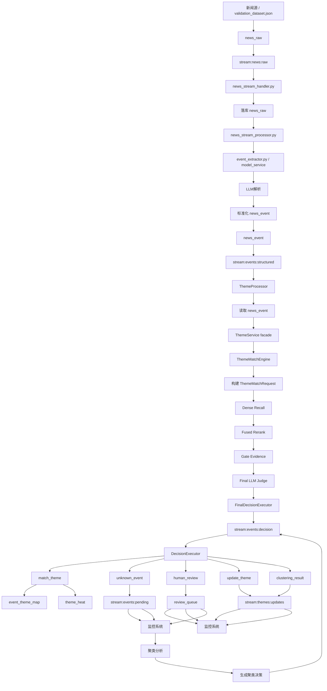

# 个人投资助理-项目架构设计-第二阶段（题材匹配重构版）

> **目标**：在保留现有高精度离线裁决成果的基础上，重构旧系统的题材服务架构，系统性解决“新闻事件与题材错配”问题，并逐步复刻久赢恒丰在**题材库、层级结构、驱动事件、热度榜单、题材详情、股票映射**上的优秀产品与数据架构。  
> **核心原则**：在线系统以稳定、可解释、可审计为第一优先级；离线高精度裁决内核作为线上核心判定能力；题材库建设全面借鉴久赢恒丰“题材主档 + 层级树 + 历史驱动 + 详情内容 + 成分股”的体系。  
> **主链路**：新闻 → 结构化事件单流 → 混合召回 → 精排/门控 → 高精度裁决 → `MATCH / UNKNOWN / HUMAN_REVIEW` → Unknown 聚类 / 人审合并 / 题材库更新 → 热度/生命周期/题材榜/详情/股票联动。  
> **阶段定位**：本版不是旧架构的小修补，而是将原“流式主题发现系统”升级为“高精度裁决驱动的题材知识中台”。

---

## 1. 重构背景与设计结论

### 1.1 旧系统的核心问题

- 语义向量检索过于粗放，容易把“同属科技/算力/军工”的相邻题材混在一起。
- 原 `semantic_matcher` 固定阈值策略无法兼顾召回率与候选规模，导致漏召回与候选爆炸并存。
- 原架构中的 `major/normal/pending/clustering` 思路曾试图区分事件优先级与新题材处理路径，但在当前高精度裁决方案下，这种前置分流已经不再适合作为主架构基础。
- 新题材创建链路不稳定，容易“该建不建”或“误建重复题材”。
- 题材库结构过于偏“内部算法表”，未充分具备久赢恒丰那种“可展示、可追溯、可联动个股”的产品化知识结构。

### 1.2 已取得的关键进展

当前 `final_theme_matcher.py` 已验证出一条有效路线：

- 结构化事件文本统一表达。
- 题材画像化建模（alias / entity_hints / core_objects / must_terms / negative_terms）。
- 向量召回后再做精排，而不是直接用 dense top1。
- 对题材名/别名直命中给予强保底。
- 使用证据增强后的 LLM 进行 TopN 排他式最终裁决。
- 在测试集上实现约 96% Top1 召回准确率。

这说明：**旧系统的最大问题，不是流式编排本身，而是“题材判定内核不够强”。**

### 1.3 本次重构的核心判断

新的生产架构应采用“双层架构”：

- **离线高精度裁决内核层**：负责把“事件 vs 题材候选”的判定做到最准。
- **在线题材中台编排层**：负责消息流、持久化、热度、生命周期、Unknown 聚类、人审、API、榜单和股票联动。

离线成果不再只是测试脚本，而是要被沉淀为线上 `ThemeMatchEngine` 的核心判定能力。

---

## 2. 新系统总体架构

## 2.1 目标架构总览



## 2.2 核心设计思想

- **匹配核心前置**：先把“事件属于哪个题材”判断准确，再谈后续热度与产品化输出。
- **题材对象升级**：题材不是一条简单名称记录，而是一个带层级、别名、实体画像、驱动历史、股票映射的知识对象。
- **线上与离线分层**：离线负责模型、阈值、规则、评测；线上负责实时流、增量更新、人工闭环。
- **Unknown 不是错误，而是一级输出**：新题材发现必须成为显式业务分支。
- **以久赢恒丰为题材库蓝本**：复刻其“榜单、详情、历史驱动、层级树、龙头股/成分股”能力，但判定内核用我们当前更强的裁决方案。

---

## 3. 新旧架构差异与重构要点

## 3.1 保留的部分

- 保留 `news_crawler_service -> model_service -> theme_service` 的三段式主链路。
- 保留 Redis Stream 作为主链路编排基础，但改为结构化事件单流。
- 保留 `DecisionExecutor` 与 `ClusteringListener` 的编排思想。
- 保留 `event_theme_map` 作为事件-题材映射表这一核心模型。

## 3.2 必须替换的部分

- 将旧的 `semantic_matcher` 替换为 `ThemeMatchEngine`。
- 将“全量题材粗暴相似度判定”替换为“混合召回 + 精排 + 证据门控 + 最终裁决”。
- 将“题材库仅用于匹配”升级为“题材知识对象库 + 产品展示库”。
- 将“未匹配即新建题材”升级为“单事件拒识 + Unknown Pool + 聚类成团 + 人审/合并”。

## 3.3 必须新增的部分

- 题材详情快照表与历史驱动事件表。
- 题材层级树与子题材表。
- 题材-股票映射与龙头股映射。
- 可解释性审计日志。
- 离线标注集、错案集、阈值校准集。

---

## 4. 题材服务重构：ThemeService v2

## 4.1 新的模块划分

`theme_service v2` 拆为 7 个核心子模块：

1. `EventNormalizer`
2. `ThemeProfileRepository`
3. `ThemeRetriever`
4. `ThemeRerankerAndGate`
5. `FinalMatchJudge`
6. `ThemeDecisionEngine`
7. `ThemeKnowledgeUpdater`

## 4.2 模块职责说明

### 4.2.1 EventNormalizer

职责：

- 标准化 `news_event` 输入。
- 统一事件文本模板。
- 抽取并标准化实体、claims、tech_terms、impact_industries。
- 为后续检索、门控、裁决提供稳定输入。

输出字段建议：

- `event_id`
- `title`
- `summary`
- `content`
- `event_type`
- `entities[]`
- `claims[]`
- `tech_terms[]`
- `impact_industries[]`
- `source`
- `published_at`
- `event_text`
- `trace_id`

### 4.2.2 ThemeProfileRepository

职责：

- 面向匹配引擎提供“题材画像”而不是只提供题材名称。
- 从当前已复刻的 `theme_master`、`theme_profile_ext`、`subject_detail` 以及后续 `theme_detail_snapshot` 等对象构建在线匹配视图。
- 输出统一的 `ThemeProfile` 对象。

关键思想：

- 久赢恒丰原始题材库非常适合做“知识源”，但不适合直接做“在线匹配索引”。
- 必须构建一层标准化画像层，统一别名、对象、负例、实体提示、主题摘要、历史驱动。

### 4.2.3 ThemeRetriever

职责：

- 多路召回候选题材。

建议采用：

- Dense retrieval：事件文本 vs 题材画像向量。
- Sparse retrieval：BM25 / SPLADE 对关键词、别名、对象词强匹配。
- Exact-hit retrieval：题材名、别名、品牌名、产品名直命中通道。

候选融合：

- 默认采用 RRF。
- 为线上可控性保留“直命中保底”机制。

### 4.2.4 ThemeRerankerAndGate

职责：

- 对召回候选做高精度精排。
- 建立证据门控与冲突门控。

精排建议：

- 首选 cross-encoder reranker。
- 当前过渡阶段可沿用“dense cosine + 主题名/实体对齐轻特征”方案。

门控建议：

- `theme_name_direct_hit`
- `entity_align_hit`
- `must_hit`
- `strong_hit`
- `object_hit`
- `negative_hit`
- `industry_conflict`
- `geopolitics_pattern_hit`

### 4.2.5 FinalMatchJudge

职责：

- 在 TopN 候选中做排他式最终裁决。
- 输出三类结果：
  - `MATCH(theme_id)`
  - `UNKNOWN`
  - `HUMAN_REVIEW`

关键要求：

- 只做最终判定，不直接改库。
- 输出 JSON 结构化结果。
- 记录 prompt version、模型版本、候选列表、关键证据。

### 4.2.6 ThemeDecisionEngine

职责：

- 将裁决结果转成业务决策。

业务动作：

- `update_theme`
- `enter_human_review`
- `enter_unknown_pool`
- `update_existing_theme_by_cluster`
- `create_new_theme_draft`
- `merge_theme_draft`

### 4.2.7 ThemeKnowledgeUpdater

职责：

- 更新题材主表、映射表、热度表、历史驱动表、题材详情快照。
- 更新题材-股票映射与龙头股信息。
- 发布榜单/详情更新消息。

---

## 5. 高精度题材匹配内核设计

## 5.1 当前有效方案正式入核

将当前离线有效方案沉淀为线上统一能力：

```
                     ┌─────────────────────┐
                     │      事件输入       │
                     │  (EventDoc: text +  │
                     │   entities + claims) │
                     └─────────┬───────────┘
                               │
                               ▼
                     ┌─────────────────────┐
                     │    Dense Recall      │
                     │  (向量召回 Top-K)   │
                     │  - semantic vec     │
                     │  - cosine similarity│
                     └─────────┬───────────┘
                               │ dense_rows
                               ▼
                     ┌─────────────────────┐
                     │    Fused Rerank      │
                     │  (融合式 rerank)     │
                     │  - semantic cosine   │
                     │  - 题材名直命中     │
                     │  - 题材名与实体对齐 │
                     │  输出 rerank_score   │
                     └─────────┬───────────┘
                               │ reranked_rows
                               ▼
                     ┌─────────────────────┐
                     │ Dynamic Top-K Calc  │
                     │  - 根据 rerank_score │
                     │    计算最终 top-K   │
                     └─────────┬───────────┘
                               │ dynamic_topk
                               ▼
                     ┌─────────────────────┐
                     │  Direct Hit Collect │
                     │  - 题材名直命中     │
                     │  - 不包含 must/strong/object │
                     └─────────┬───────────┘
                               │ direct_hit_keys
                               ▼
                     ┌─────────────────────┐
                     │  Inject / Reserve   │
                     │  (候选保底器)       │
                     │  - 补直命中题材进候选 │
                     │  - 不改全局排序     │
                     │  - 保证 top-K 满足   │
                     └─────────┬───────────┘
                               │ candidate_rows
                               ▼
                     ┌─────────────────────┐
                     │   Gate Evidence      │
                     │  - must / should / core_objects│
                     │  - 构建 LLM 输入证据 │
                     └─────────┬───────────┘
                               │ evidence
                               ▼
                     ┌─────────────────────┐
                     │     LLM Judge       │
                     │  - 分析 candidate_rows│
                     │  - 使用 evidence    │
                     │  - 输出 verdict/conf│
                     └─────────┬───────────┘
                               │
                               ▼
                     ┌─────────────────────┐
                     │   Decision Executor │
                     │  - 最终选择题材     │
                     │  - top1/top3/top5   │
                     └─────────┬───────────┘
                               │
                               ▼
                     ┌─────────────────────┐
                     │     输出结果        │
                     │  - candidate_rows    │
                     │  - verdict/conf      │
                     │  - 评估指标          │
                     └─────────────────────┘
```

## 5.2 线上匹配的五层防错配机制

### 第一层：召回防错

- Dense 负责语义覆盖。
- Sparse 负责精确术语约束。
- Direct-hit 负责题材名/品牌名/产品名强召回。

### 第二层：精排防错

- 对“语义大类相近，但主对象不同”的题材做压制。
- 例如“液冷数据中心”与“数字芯片设计”必须在 rerank 层拉开。

### 第三层：证据门控防错

- 若题材名直命中，必须强重视。
- 若主对象冲突、负向词命中、产业链对象不一致，应强降权。
- 地缘政治类必须引入专门模式门控。

### 第四层：排他式裁决防错

- LLM 不再逐一判断“像不像”，而是必须在候选之间二选一、多选一或输出 UNKNOWN。

### 第五层：人工复核防错

- 低置信度匹配和高风险类目进入人工池。
- 重点大类：地缘政治、军工、政策监管、跨产业链热点。

## 5.3 最终裁决结果定义

```json
{
  "decision": "MATCH | UNKNOWN | HUMAN_REVIEW",
  "best_theme_id": "9010074",
  "confidence": 0.91,
  "reason": "事件主叙事与造纸涨价主线一致",
  "evidence_summary": {
    "theme_name_hits": ["造纸"],
    "object_hits": ["瓦楞纸", "纸浆"],
    "entity_hits": ["玖龙纸业"],
    "negative_hits": []
  }
}
```

---

## 6. 新题材发现与 Unknown 管线

## 6.1 旧问题

旧系统的问题不是“不会创建新题材”，而是：

- 没有可靠拒识，导致未知事件被硬塞进旧题材。
- 没有成团聚类，导致单条噪声也可能触发新题材。
- 没有合并去重，导致重复题材泛滥。

## 6.2 新设计原则

新题材创建必须拆成两级：

### 6.2.1 单事件级：Unknown 输出

- 如果所有候选都不够可信，则输出 `UNKNOWN`。
- 该事件写入 `unknown_event_pool`。
- 不直接入 `theme_master`。

### 6.2.2 群体级：聚类成团

- 定时扫描 `unknown_event_pool`。
- 以时间窗口、相似度、一致性为基础做聚类。
- 聚类达到阈值才生成 `new_theme_draft`。

建议阈值：

- 7 天时间窗
- 簇规模 >= 5 或 >= 10
- 平均相似度 >= 设定阈值
- 至少存在稳定对象词/实体簇心

### 6.2.3 人审/合并级：上线控制

- 新题材草案必须经过：
  - 是否与现有题材重复
  - 是否仅为旧题材的子题材
  - 是否只是短期噪声事件
  - 命名是否规范
  - 详情和驱动说明是否可读

最终结果：

- `create_theme`
- `merge_to_existing_theme`
- `defer_observation`

---

## 7. 复刻久赢恒丰的题材知识库架构

## 7.1 久赢恒丰值得复刻的核心能力

从本地 `theme_data_complete` 来看，久赢恒丰题材库至少有 5 个非常成熟的层面：

1. **题材主档列表**
2. **题材详情页内容**
3. **题材历史驱动事件**
4. **题材层级树 / 子题材结构**
5. **题材与股票联动信息**

这说明其优秀之处不只是匹配算法，而是**题材对象的产品化完备性**。

结合当前项目数据库状态，可以把 `P2.phase1` 的数据分层进一步明确为三层：

1. 真源层  
   - 数据库真源：`theme_master / theme_profile_ext / subject_detail / stocks / subject_stock_map / subject_rank_daily`
   - 文件真源：`theme_data_complete/details / history / children / daily / stock_details / lists`
2. 标准化层  
   - `subject_theme_binding`
   - `subject_history_staging`
   - `subject_children_staging`
   - `subject_stock_staging`
3. Serving 层  
   - `theme_detail_snapshot`
   - `theme_history_event`
   - `theme_tree_relation`
   - `theme_stock_map`
   - `theme_rank_api`

在实现策略上，应采用“视图优先、必要时落表”：

- 先用数据库视图把分散真源逻辑整合起来：
  - `vw_subject_theme_binding`
  - `vw_theme_rank_current`
  - `vw_theme_detail_joined`
  - `vw_theme_stock_map_candidate`
  - `vw_theme_tree_candidate`
  - `vw_theme_history_candidate`
- 只有当以下条件出现时，才把视图结果沉淀为 serving 表：
  - 需要版本冻结
  - 需要审计字段
  - 需要人工修订
  - 需要批次回滚
  - 视图查询性能不足

当前最优实施顺序应当是：

1. 先做 `subject_key` 统一业务主键基线，`theme_id` 仅作为 L3 叶子实体引用  
2. 再建设视图整合层  
3. 基于 `subject_rank_daily`/视图层上线第一版 `theme_rank_api`  
4. 回填 `subject_stock_map` 并生成 `theme_stock_map`  
5. 用 `theme_data_complete/history/*` 与 `subject_rank_daily` 回填 `theme_history_event`  
6. 用 `theme_hierarchy.jsonl` 与 `children/*` 回填 `theme_tree_relation`

补充说明：

- `full_theme_list.jsonl` 目前更适合作为 L1 节点主档快照，不应单独作为完整树真源。

在此基础上，`P2.phase1` 还需要补齐**久赢恒丰新增数据的日常增量同步能力**。  
当前已经验证可行的总体路径不变：

`久赢恒丰 -> 本地 theme_data_complete -> 数据库`

但日常同步不应继续依赖零散 patch 脚本和全量清空重建。更合理的长期方案是：

1. 唯一采集入口  
   - 基于 `theme_collector.py` 收敛出统一入口 `sync_jyhf_to_local.py`
   - 负责抓取 `lists/details/history/children/daily/stock_details`
   - 只负责落本地文件，不直接写库

2. 批次与增量判定层  
   - 本地元数据：
     - `theme_data_complete/_manifests/<batch_id>.json`
     - `theme_data_complete/_state/sync_cursor.json`
   - 数据库元数据：
     - `jyhf_sync_batch`
     - `jyhf_sync_file_manifest`
     - `jyhf_sync_subject_state`
   - 通过文件指纹、更新时间和 `subject_key` 状态，识别真正变化的数据

3. 四条增量导库链  
   - `nodes`：`full_theme_list + theme_hierarchy + children`
   - `history`：`history + daily`
   - `detail`：`details + gate + knowledge`
   - `stock`：`stock_details + children lead stock`
   - 四条链都应支持 `--batch-id` 与 `--subjects-file`

4. 幂等 serving 刷新  
   - 只刷新受影响的 `subject_key`
   - 不再默认触发全表 serving 重建

现有脚本的推荐定位应当统一为：
- `import_jyhf_data_optimized.py`：初始化/历史全量恢复
- `import_jyhf_full_theme_and_children_patch.py`：吸收进 `nodes` 增量链
- `import_jyhf_to_financial_and_theme.py`：staging 到正式层的增量回灌，不再允许清空重建
- `import_single_subject_knowledge.py`：单题材修复/补录
- `import_jyhf_gate_profile.py`：detail/profile 增量链组成部分
- `theme_collector.py`：采集层基础模块

这条增量同步链要解决的核心问题不是“再写更多补丁脚本”，而是正式补齐三种能力：
- `batch manifest`
- 文件/`subject_key` 级增量判定
- `subject_key` 级幂等重放与失败重试
- 完整树边优先以 `theme_hierarchy.jsonl` 为主，`children/*` 作为富关系与展示补充。

## 7.2 新系统的题材对象模型

新的 `Theme` 不再是一条简单记录，而是一个聚合对象：

### 7.2.1 题材主对象 `theme_master`

当前项目数据库已完成 `theme_master` 全量复刻，它是第二阶段 Core 层真源，而不是待新建对象。Phase1 的任务是在其上冻结 serving 读取边界。

核心字段：

- `theme_id`
- `source_system`
- `source_subject_id`
- `name`
- `canonical_name`
- `theme_type` (`investment/concept/geopolitics/policy/company_chain`)
- `level`
- `parent_theme_id`
- `ancestors`
- `status`
- `summary_reason`
- `importance`
- `quality_level`
- `created_by`
- `created_at`
- `updated_at`

### 7.2.2 题材画像对象 `theme_profile_ext`

当前项目数据库已完成 `theme_profile_ext` 全量复刻，它承载在线画像真源，包括 `summary / core_anchors / supporting_entities / representative_events / embedding_text / rerank_text / embedding`。Phase1 只需要在其上补充 serving 视图与使用约束，不重复新建等价画像主表。

- `aliases[]`
- `entity_hints[]`
- `core_objects[]`
- `must_terms[]`
- `strong_terms[]`
- `should_terms[]`
- `negative_terms[]`
- `industry_tags[]`
- `semantic_type`
- `strategy_type`
- `search_text`
- `dense_embedding`
- `sparse_tokens`
- `rerank_text`

### 7.2.3 题材详情对象 `theme_detail_snapshot`

当前项目数据库已完成 `subject_detail` 全量复刻，作为详情真源输入。`theme_detail_snapshot` 是面向 API/展示的版本化 serving 快照，不替代 `subject_detail`。

复刻久赢详情页能力：

- 长文详情
- 产业介绍
- 商业逻辑
- 核心驱动
- 关键公司
- 周期位置
- 风险提示
- 数据快照版本

### 7.2.4 题材历史对象 `theme_history_event`

复刻久赢历史驱动能力：

- `theme_id`
- `rank_date`
- `event_id`
- `title`
- `description`
- `source`
- `heat_value`
- `heat_name`
- `pct_chg`
- `is_red`
- `trace_id`

### 7.2.5 题材层级对象 `theme_tree_relation`

复刻久赢 children 能力：

- 父题材
- 子题材
- 孙题材
- 层级路径
- 每层级的热度、涨跌、龙头股

### 7.2.6 题材-股票映射对象 `theme_stock_map`

当前项目数据库已完成 `stocks` 全量复刻，且 `theme_master.related_stocks / stock_count` 已具备基础映射信息。`theme_stock_map` 用于沉淀结构化关系类型、证据来源与版本化映射，不重复承担股票主档职责。

复刻久赢 stock 关联能力：

- `theme_id`
- `stock_id`
- `stock_name`
- `relation_type` (`leader/core/member/edge`)
- `evidence_source`
- `confidence`
- `updated_at`

---

## 8. 在线流式处理架构

## 8.1 Stream 重新定义

保留并扩展以下流：

- `stream:events:structured`
- `stream:events:decision`
- `stream:events:human_review`
- `stream:events:unknown`
- `stream:events:pending_cluster`
- `stream:themes:updates`
- `stream:themes:rank_updates`
- `stream:dead:letter`

## 8.2 主流程时序

```
1. model_service 产出 news_event
2. 统一写入 `stream:events:structured`
3. ThemeProcessor 消费事件
4. 调用 ThemeMatchEngine 做高精度判定
5. DecisionEngine 输出：
   - MATCH -> update_theme
   - HUMAN_REVIEW -> human_review
   - UNKNOWN -> unknown_pool
6. DecisionExecutor 落库
7. ThemeHeatService 更新热度
8. ThemeRankBuilder 更新榜单
9. UnknownClusterWorker 定时聚类
10. 人审/合并结果回流 DecisionExecutor
```

## 8.3 单流后的决策分叉

结构化事件进入单流后，不再在入口处做 `major / normal` 分流，而是在高精度裁决之后做业务分叉：

- `MATCH`
  - 进入题材映射、热度更新和知识对象更新链路
- `UNKNOWN`
  - 进入 `unknown_event_pool`
  - 不直接创建新题材
  - 后续由聚类成团与人审决定是否生成草案
- `HUMAN_REVIEW`
  - 进入人工审核队列
  - 审核结果回流 `DecisionExecutor`

新的核心原则是：

- 事件优先级不再决定是否直接建题材
- 所有事件先经过统一匹配与裁决
- 人工 review 是主链路显式分支，不再是补丁式兜底

---

## 9. 热度、生命周期与榜单设计

## 9.1 为什么必须引入久赢式榜单视角

久赢恒丰的优秀体验不只是“某条新闻匹配对了”，而是：

- 用户能看到当天什么题材最热
- 能看到这个题材为什么热
- 能看到历史几次驱动事件
- 能看到子题材和核心股票

因此，新系统的题材服务必须内建榜单和详情快照能力。

## 9.2 热度计算建议

热度由多因子组成：

- 事件数量
- 事件质量
- 事件来源权威性
- 事件新鲜度
- 涨停/异动股票联动
- 龙头股强度
- 子题材扩散度

热度输出：

- `theme_heat_realtime`
- `theme_heat_daily`
- `heat_level`（冷 / 温 / 热 / 爆）

## 9.3 生命周期建议

每个题材维护状态：

- `seed`
- `emerging`
- `hot`
- `diffusing`
- `cooling`
- `archive`

生命周期不仅看事件频率，也要看股价联动和持续性。

---

## 10. 人工复核与审计闭环

## 10.1 人工复核场景

以下样本必须优先进入人工池：

- LLM 置信度低于阈值
- 高影响但裁决不稳定的事件
- 地缘政治 / 军工 / 制裁 / 监管
- 新题材草案
- 题材合并 / 去重候选

## 10.2 审计日志必须落地

每次决策必须记录：

- `event_id`
- `trace_id`
- `retrieval_candidates`
- `retrieval_scores`
- `rerank_scores`
- `gate_hits`
- `prompt_version`
- `llm_model`
- `llm_output_raw`
- `parsed_result`
- `final_decision`
- `final_confidence`
- `review_status`

## 10.3 错案回流机制

- 人工判错案例进入 `theme_mismatch_casebase`
- 自动归类为：
  - 召回错
  - 精排错
  - 门控缺失
  - 裁决错
  - 题材库画像不完整
- 定期回流到规则、画像、训练集和阈值校准集

---

## 11. 数据库与核心表设计建议

建议新增或升级以下表/对象：

- 已复刻真源表：`theme_master`
- 已复刻真源表：`theme_profile_ext`
- 已复刻真源表：`subject_detail`
- 已复刻真源表：`stocks`
- `theme_alias`
- `theme_detail_snapshot`
- `theme_history_event`
- `theme_tree_relation`
- `theme_stock_map`
- `event_theme_map_v2`
- `unknown_event_pool`
- `new_theme_draft`
- `theme_merge_review`
- `theme_heat_realtime`
- `theme_heat_daily`
- `theme_lifecycle`
- `theme_match_audit_log`
- `theme_mismatch_casebase`

---

## 12. API 与产品输出设计

## 12.1 必须提供的 API

- `GET /themes`
- `GET /themes/rank`
- `GET /themes/{subject_key}`
- `GET /themes/{subject_key}/history`
- `GET /themes/{subject_key}/children`
- `GET /themes/{subject_key}/stocks`
- `GET /stocks/{stock_id}/themes`
- `GET /events/{event_id}/theme-decision`

## 12.2 前端展示目标

最终要形成接近久赢恒丰的产品体验：

- 今日热榜
- 题材详情页
- 驱动事件历史
- 子题材树
- 龙头股 / 核心股 / 关联股
- 题材热度曲线

---

## 13. 分阶段实施路线

## Phase A：判定内核生产化

目标：

- 将 `final_theme_matcher.py` 抽象为线上 `ThemeMatchEngine`
- 接入现有 Redis Stream
- 保留人工复核出口

交付：

- 线上可调用的匹配引擎
- 审计日志
- 离线/线上一致的评测框架

## Phase B：久赢式题材库复刻

目标：

- 建立题材详情、历史驱动、子题材树、股票映射
- 上线榜单与详情 API

交付：

- `theme_detail_snapshot`
- `theme_history_event`
- `theme_tree_relation`
- `theme_stock_map`
- `theme_rank_api`

## Phase C：热度与生命周期完善

目标：

- 建立稳定热度模型
- 构建生命周期状态机
- 联动行情和涨停复盘

## Phase D：Unknown 与新题材闭环

目标：

- 上线 Unknown Pool
- 上线聚类成团
- 上线新题材草案与合并审核

交付：

- `unknown_event_pool`
- `new_theme_draft`
- `theme_merge_review`

---

## 14. 验收指标

## 14.1 匹配质量指标

- Top1 Accuracy
- Top3 Accuracy
- Pairwise Accuracy
- False Positive Rate
- Human Review Rate

## 14.2 新题材质量指标

- Unknown Precision
- Unknown Recall
- New Theme Draft Precision
- Merge Precision
- Cluster Purity

## 14.3 产品化指标

- 题材详情覆盖率
- 历史驱动覆盖率
- 题材-股票映射覆盖率
- 榜单更新时延
- API 查询时延

---

## 15. 最终目标定义

本项目的最终目标不是“把旧系统修得更稳一点”，而是构建一个接近久赢恒丰水平、但在匹配核心上更强的新一代题材知识中台：

- 在题材匹配精度上，继承当前高精度离线裁决成果；
- 在题材库结构上，复刻久赢恒丰的主档、详情、历史、层级和股票映射；
- 在系统编排上，保留原有 Redis Stream 的高扩展性；
- 在新题材发现上，引入 Unknown + 聚类 + 人审的可控闭环；
- 在产品输出上，最终支持题材榜、题材详情、驱动事件、子题材树和股票联动。

**一句话总结**：

> 新架构的核心不是“向量匹配升级”，而是以高精度裁决内核为中心，重建一个可解释、可审计、可扩展、可产品化、能够复刻久赢恒丰优秀能力的题材知识中台。

---

## 16. 2026-03-31 最新实现收口

### 16.1 运行时主链已对齐离线高精度逻辑

- 当前运行时 `ThemeMatchEngine` 已按 [final_theme_matcher.py](/Users/admin/Desktop/ai_theme_app/final_theme_matcher.py) 主链实现：
  - `Dense Recall`
  - `Fused Rerank`
  - `Dynamic Top-K`
  - `Direct-Hit Reserve`
  - `Gate Evidence`
  - `Final LLM Judge`
- 当前生产链默认结构化 parser 已切换为 [reliable_deepseek_parser.py](/Users/admin/Desktop/ai_theme_app/model_service/llm_parser/reliable_deepseek_parser.py)，不再默认使用基础版 `deepseek_parser.py`。

### 16.2 最新真实全链路结果

- 输入源：[test_cases.txt](/Users/admin/Desktop/ai_theme_app/evaluate_service/data/raw/test_cases.txt)
- 真实链路：
  - `stream:news:raw -> news_stream_handler.py -> news_raw -> news_stream_processor.py -> ReliableDeepSeekParser -> news_event -> stream:events:structured -> theme_processor.py -> theme_service.py -> ThemeMatchEngine -> stream:events:decision`
- 最终结果：
  - `events = 100`
  - `processed = 100`
  - `top1_hits = 96`
  - `top1_accuracy = 0.96`
- 结果文件：
  - [p2_phase0_full_chain_100_to_decision.report.json](/Users/admin/Desktop/ai_theme_app/tmp/p2_phase0_full_chain_100_to_decision.report.json)
  - [p2_phase0_full_chain_100_match_detail.json](/Users/admin/Desktop/ai_theme_app/tmp/p2_phase0_full_chain_100_match_detail.json)

### 16.3 当前剩余问题

- 当前 `4` 条失配集中在：
  - `海洋经济 9043698`
  - `液冷数据中心 9024880`
- 启动日志中仍会打印旧 `ThemeDiscoveryEngine` 初始化信息，这属于运行时兼容层噪音，后续需继续下沉或移除，但不阻断当前 `P2.phase0` 验收基线。
