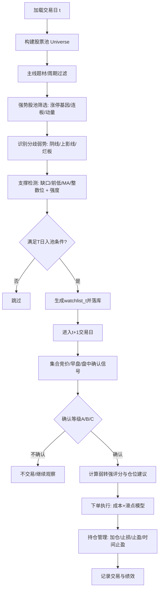

# 弱转强买入法选股系统优化方案研究报告

执行摘要：本报告基于你提供的交易体系文档与现有代码，梳理已实现组件与关键缺口，围绕“弱转强买入法”给出一套可落地、可回测的选股与交易系统优化方案。方案采用“两阶段（T日入池、T+1确认）”信号框架，补齐数据与接口适配、评分体系、仓位与风控、交易成本与滑点建模，并提出回测与显著性检验方法，最后给出多条可选优化路线与原系统对比评估。

## 现有系统与附件代码梳理

本部分只陈述“附件/代码中能直接验证的事实”，以及由此推导出的“必要假设（未指定则明确标注）”。核心输入来自：  
- `weak_to_strong_service.py`、`strict_weak_to_strong_screening_v2.py` 两份代码文件  
- 《弱转强买入法》《集合竞价》《如何建立正确的交易体系》《如何抓涨停股？》《如何找出牛股》等PDF  
- 《选股器功能详细设计规范.md》《弱转强筛选策略设计与优化文档.md》《弱转强选股策略实施总结报告.md》等MD

### 已知关键组件、数据结构与接口

下表把“已知组件/接口/数据结构”与“未说明假设”放在一起，便于后续设计落地时逐项补齐。

| 类别 | 组件/接口 | 你提供材料中的可确认要点 | 未说明假设（或需要补齐） |
|---|---|---|---|
| 数据库 | `PostgreSQL` 日线快照表 `subject_stock_daily_snapshot` | 在严格筛选器中用于按交易日查询；字段被显式读取：`stock_id, stock_name, pct_chg, is_leader, rank_order, open_price, high_price, low_price, close_price, volume, amount, limit_up, subject_key`（严格筛选器SQL与行字段访问均出现） | 表的完整DDL、字段含义（如`rank_order`、`is_leader`产生逻辑）、复权口径、停牌/退市/新股处理、是否含ST标记：**未指定** |
| 题材/周期/龙头 | 35/30/20/15决策序列（选股器规范） | 选股器规范明确四维：主线题材（35%）、周期阶段（30%）、龙头（20%）、技术面（15%），分别依赖 `theme_mainline_judgement / theme_cycle_judgement / theme_leader_candidate` 与“股票异动标记系统” | 这些表的字段与产出逻辑：**未指定**（仅给出评分伪函数框架）；与`subject_key`的映射在总结报告中被指出存在不匹配问题 |
| 弱转强信号服务 | `WeakToStrongService.detect_weak_to_strong_signals(trade_date, inputs)` | 输入为`WeakToStrongDetectionInputs`（含`cycle_judgement/abnormal_signal/prev_day_data/current_day_data/market_environment/theme_environment`）；输出为`WeakToStrongSignal`列表；内部包含信号类型判定、强度/置信度评分、支撑与缺口分析、烂板五要素、分时弱转强等逻辑 | `ThemeCycleJudgement`与`StockAbnormalSignal`的字段完整定义：**未指定**（代码通过`getattr/hasattr`读取若干属性，需适配层保证字段齐全） |
| 弱转强评分/建议 | `WeakToStrongService.generate_weak_to_strong_judgement(signals, market_state)` | 生成`WeakToStrongJudgement`：综合分=强度×置信度并按市场模式与风险等级调整；行动建议分为“重点买入/试错买入/观察/回避”，并给出`position_suggestion`与`stop_loss_level` | `market_state`的生成规则：仅在总结报告中出现“进攻/防守/谨慎/观望”与仓位上限的描述，**缺少可复现计算公式** |
| 严格筛选器 | `StrictWeakToStrongScreener.screening_strict(trade_date)` | 目标“每天10个左右候选”；实现了“四条件严格筛选”：当日`pct_chg<-2.0`、前一交易日`pct_chg<-1.5`、强势股（近7日涨停次数/连板满足阈值）、到达有效支撑（`support_strength>=0.6`，且对高连板/多涨停可要求缺口支撑）；包含15天历史缺口手动检测 | 与`StrongStockAnalysisService`、`KlineDataService`的真实实现与数据源：**未指定**（仅能从调用方式推断其输出字段） |
| K线与支撑检测 | `KlineDataService.analyze_gap_support(stock_id, analysis_date)` | 被两处调用：严格筛选器与弱转强服务；返回字段被明确读取/合并：`has_gap/gap_type/gap_position/gap_size/has_support/support_type/support_strength/is_gap_support/gap_support_level/technical_signals/support_level` | 总结报告指出“数据库无K线历史数据表，真实筛选时依赖模拟K线数据”，需补齐数据管道与历史K线表：**未指定/待补齐** |
| “烂板五要素” | 在弱转强服务中作为烂板质量评分 | 五要素在PDF与代码一致：涨停位置、放量、炸板、破板后回撤<3%、封单量减少（烂而不弱） | “涨停位置/封单量/炸板次数”等字段的数据来源与计算口径：**未指定**，目前仅能通过`prev_day_data`字段传入 |
| 选股器系统（产品化） | `stock_screening_strategy / stock_screening_result / stock_screening_llm_review`等表与API | 选股器规范给出数据库表结构与API：策略管理、执行选股、结果查询、LLM复核、收藏等；维度分与详情支持落库（JSONB） | 与弱转强策略如何映射到四维评分及前端展示字段：**未指定**（但可通过扩展`technical`维度落地） |

补充：在《弱转强选股策略实施总结报告》中已明确指出三项工程化阻塞点：  
- `subject_key`与题材主数据不匹配导致主题映射失败；  
- 数据库缺少K线历史数据表导致技术形态分析不足；  
- 弱转强服务在真实筛选中依赖“模拟K线数据”。（这些都直接影响“可回测性”和“上线一致性”。）

### 从现有代码可推断的核心策略“原型”

现有实现更接近“候选池生成器”而非“完整可回测交易系统”：

- 严格筛选器在T日（下跌日）挑出“强势股回踩支撑”的候选，供T+1观察与交易（符合弱转强法“前一日分歧、次日反包”的节奏）。  
- 弱转强服务更偏“信号解释与评分”，包含市场模式调整、仓位建议与止损阈值，但缺少：  
  1) 统一的数据适配层（字段来源未标准化）；  
  2) 明确的交易执行规则（下单时点、成交价模型、滑点）；  
  3) 回测框架与统计检验（避免过拟合与数据窥探）。

因此，本报告的优化目标是：**保留现有“强势股→回踩支撑→弱转强确认”的核心思想，补齐可回测闭环与工程化可扩展结构。**

## 弱转强买入法的量化定义与信号框架

### 方法论抽象

根据《弱转强买入法》与相关PDF，弱转强的核心是：**龙头/强势股在高位分歧后“看似走弱”，但短时间内（多为次日）出现强势反包或放量上板，重新夺回话语权**；典型“弱”形态主要三类：中大阴线、上引线、烂板（炸板后回封）。此外强调“市场环境不能极度退潮”，最佳发生于“分歧—修复”阶段。  

将其量化为可回测框架，最稳健的形式是“两阶段事件”：

- **阶段A（T日收盘后入池）**：识别“强势股发生分歧但未走坏、且回踩关键支撑”。  
- **阶段B（T+1盘中确认入场）**：用集合竞价/早盘分时/盘中突破等确认“转强”，触发买入；若确认失败则不交易。

这样能最大限度避免“用未来信息选股”的回测陷阱，并与交易实践一致。

### 因子列表与字段映射建议

为保证可实现与可回测，因子需满足：能从你现有表结构或可补齐的数据源稳定获得；若暂时缺失，则标注为“可选/待补齐”。

#### 技术面因子（建议作为主因子组）

1) **前期强势度（Strongness）**  
- 近N日涨停次数 `limit_up_count(N)`（现有严格筛选器已依赖涨停模式分析）  
- 最大连板天数 `max_consecutive_limit_up(N)`  
- 近N日动量：`ret_5/ret_10/ret_20`（需K线历史）  
- “放量涨、缩量跌”一致性（需K线历史与成交量）

2) **分歧/走弱质量（Weakness Quality）**（三类弱势）  
- 中大阴线：`pct_chg_T <= -3%`（弱转强服务已用该阈值判定之一）  
- 上引线：`upper_shadow_ratio_T > 0.3`（弱转强服务已有计算与阈值）  
- 烂板：`is_limit_up_T=True`且`(is_bad_limit_up or limit_up_open_count>2)`，并计算“烂板五要素评分”  
  - 破板后最大回撤 `<3%`（PDF给出，弱转强服务已用该阈值）  
  - 封单量相对减少 `closing_order_volume_ratio < 0.8`（弱转强服务已有阈值）

3) **支撑结构（Support）**  
现有设计文档给出多类型支撑与强度常量：  
- 缺口支撑 `gap_support`（强度建议0.8）  
- 前低/前一日低点 `previous_low`（强度建议0.6）  
- 前收盘支撑 `previous_close`（强度建议0.5）  
- 整数关口 `integer_level`（强度建议0.4）  
并在严格筛选器中以`support_strength>=0.6`作为有效支撑阈值，且对高连板/多涨停要求“必须缺口支撑”。  

4) **转强确认（Confirmation）**  
- 集合竞价：高开（如`+1%`以上）与竞价量比放大（代码中用`bid_close>prev_close*1.01`和`bid_volume_ratio>2.0`）；PDF补充：更强的情形是高开`3%~5%`且9:25量能达到前一日最大分时量能的`1/2`（集合竞价PDF原文要点）。  
- 早盘分时：不单边下跌、放量拉升，且大部分时间在分时均线（VWAP/均价线）上；从均价线下转到均价线上是关键信号（弱转强买入法PDF给出，弱转强服务也有对应逻辑）。  
- 盘中：相对大盘从弱转强、突破30分钟以上分时平台（弱转强买入法PDF给出）。  
- 反包：当日收盘价高于前一日最高价（弱转强服务采用该定义）。

#### 情绪/题材因子（强烈建议纳入）

弱转强法强调“必须是强势股/龙头、杂毛不配弱转强”，并强调板块情绪与主线题材。

建议与现有“35/30/20/15”体系对齐，把题材与周期作为硬过滤+加权得分：

- 主线题材强度：来自`theme_mainline_judgement`（字段未指定，按选股器规范应能产出主线强度、热度排名、资金关注度）  
- 周期阶段：来自`theme_cycle_judgement`，弱转强更匹配“分歧—修复/回流/发酵”，应规避“全面退潮”（交易体系PDF也强调退潮期成功率低）  
- 板块支持：`plate_strength`（弱转强服务已预留`theme_environment`并用`plate_strength>50`判定）

#### 基本面因子（可选，偏风控用途）

短线题材/龙头交易通常不以财务为核心，但基本面可用于**风险过滤**：  
- ST/退市风险、财务异常、极端低流动性、极端高负债等。  
这些字段在你提供的数据库与模型中未看到明确来源，因此标注：**未指定（建议作为扩展数据源/风控过滤层）**。

## 优化版选股系统设计

### 总体设计目标

1) **信号完整闭环**：从T日入池到T+1确认入场、再到出场/止损/止盈，全部规则可编码、可回测。  
2) **与现有选股器四维体系兼容**：弱转强作为“技术面验证”的核心子模块，或作为新增维度扩展（推荐前者以减少改表改API风险）。  
3) **风险控制前置**：把市场状态（进攻/防守/谨慎/观望）与仓位上限、单票上限、主题分散写成硬规则。  
4) **交易成本与滑点显式建模**：避免“纸面高胜率、落地无盈利”。

### 信号生成逻辑（两阶段）

#### 阶段A：T日收盘后生成“弱转强观察池”

观察池入选需同时满足四类约束（与现有严格筛选器同构，但建议从“硬阈值”升级为“打分+门槛”）：

- **强势基础（硬过滤）**  
  - `limit_up_count_7 >= 2` 或 `max_consecutive_7 >= 2`（现有严格筛选器已采用“连续≥2或累计≥2”过滤一日游）  
- **分歧走弱（硬过滤 + 分型）**  
  - 满足三类弱势之一：中大阴线 / 上引线 / 烂板  
  - 可保留现有“更严格版本”作为参数：`pct_chg_T<-2.0`且前一交易日`pct_chg<-1.5`（用于降噪）  
- **支撑到位（硬过滤）**  
  - `support_strength >= 0.6`；若强势度很高（例如连续≥3板或累计≥4次涨停），则强制要求`is_gap_support=True`（严格筛选器已有该逻辑）  
- **题材与周期（硬过滤）**  
  - 属于主线题材（35%维度达到阈值）  
  - 周期不处于全面退潮（30%维度给出可交易区间）

输出：`watchlist_T = {stock_id, theme_key, support_level, weak_type, strongness, reason/evidence}`，用于T+1盘前/集合竞价/早盘决策。

#### 阶段B：T+1盘中确认触发买入

确认信号分三档（由弱转强PDF的入场方式抽象而来），对应不同仓位：

- **A档（强确认）**：集合竞价抢筹 + 早盘延续  
  - `gap_open = (open_{T+1}/close_T - 1)`在`[+1%, +5%]`（其中`[+3%, +5%]`计更高分）  
  - 9:25竞价量能达到前一交易日最大分时成交量的`≥50%`（集合竞价PDF原文要点）  
  - 开盘后不单边下跌，15~30分钟内价格站上VWAP/分时均价线，并保持多数时间在其上（弱转强买入法PDF原文要点）  
- **B档（中确认）**：盘中平台突破/直线拉升  
  - 相对指数从弱转强（例如个股收益率差由负转正并扩大）  
  - 突破持续≥30分钟的分时平台（弱转强买入法PDF原文要点）  
- **C档（弱确认/试错）**：仅满足“支撑有效+放量反弹”但缺少竞价强信号  
  - 适用于“主线+绝对龙头”以小仓试错，其余不交易

### 参数与阈值建议（默认值可回测校准）

为避免过拟合，建议把阈值分成“默认值（来自现有实现+PDF）”与“可调范围（用于回测网格）”。

- 强势基础：`limit_up_count_7 >= 2`；`max_consecutive_7 >= 2`  
  - 可调范围：`N∈{5,7,10}`；阈值`2~3`  
- T日弱势：  
  - 严格版：`pct_chg_T < -2.0`、`prev_pct_chg < -1.5`（现有严格筛选器阈值）  
  - 分型版：中大阴线`<=-3%`、上引线`upper_shadow_ratio>0.3`、烂板`open_count>2`（现有弱转强服务阈值）  
- 支撑：`support_strength >= 0.6`；缺口回补距离：`<=1%`（缺口支撑有效区间在代码中以1%附近判定），历史缺口手动检测距离：`<=2%`（严格筛选器阈值）  
- T+1竞价确认：  
  - 高开阈值：`>=1%`，推荐区间`3%~5%`（集合竞价PDF原文）  
  - 竞价量能：`>= 0.5 * prev_day_max_intraday_volume`（集合竞价PDF原文）  
- 止损：  
  - 若“反包失败且无法重回关键价位”当日减仓/止损（弱转强买入法PDF原文）  
  - 日线跌破10日线或前低/关键支撑即清仓（弱转强买入法PDF原文）  
  - 在系统化回测中可落成：`stop = min(support_level*(1-δ), entry_price*(1-5%~10%))`

### 持仓与资金管理规则

建议把仓位管理拆成三层：市场→组合→单票。

- **市场状态（决定组合仓位上限）**  
  - 进攻：`position_limit=1.0`  
  - 防守：`position_limit=0.5`  
  - 谨慎：`position_limit=0.3`  
  - 观望：`position_limit=0.0`  
  这一结构与你总结报告中的“进攻(100%)、防守(50%)、谨慎(30%)、观望(0%)”一致；同时可直接对接弱转强服务的`market_state`输入（其内部用`mode`与`position_limit`决定操作建议与仓位比例）。

- **组合层约束（强烈建议硬编码）**  
  - 最大持仓数：`max_positions = 5~10`（与策略频率匹配）  
  - 单一题材最大占比：`theme_exposure_max = 40%~60%`  
  - 单日换手上限：防止过度交易（与成本敏感）

- **单票层仓位（与信号档位绑定）**  
  - 重点买入（A档确认）：单票上限`<=30%`（现有弱转强服务也把重点买入限制在30%）  
  - 试错买入（B/C档）：单票上限`<=15%`（现有弱转强服务的试错上限15%）  
  - 加仓规则：仅在“确认后延续”（如再封板/放量突破/次日承接良好）才允许从试错加到重点；否则不加仓。

### 入场/出场/止损/止盈规则（可回测化）

为了可回测，必须把“盘中语言”固化为可计算事件。推荐如下可实现版本：

- **入场（T+1）**  
  1) A档：以开盘价或9:35第一根可交易bar成交价买入（取决于你是否使用分钟数据；无分钟数据则以开盘价近似）  
  2) B档：突破平台后下一根bar买入（分钟回测可实现）  
  3) C档：仅允许主线龙头且综合评分≥阈值时试错

- **止损（满足任一则出场）**  
  - 日内止损：`low_{t} <= entry*(1-0.05~0.08)`（与弱转强服务给出的-5%/-7%/-10%风险分层一致）  
  - 结构止损：收盘跌破`support_level`或`MA10`（需要K线）  
  - “反包失败止损”：若触发反包逻辑但收盘未站上关键价位（可用`close_{t} < prev_high_T`或`close_{t} < VWAP_{t}`近似）

- **止盈/退出（建议分层）**  
  - 快速止盈：盈利达到`+8%~+12%`先落袋部分（对应短线高波动环境）；  
  - 趋势止盈：移动止损（例如`close < MA5`或`close < rolling_high*(1-α)`）；  
  - 时间止盈：持有超过`H=5~10`个交易日仍未走强则退出（防止资金占用）。

## 落地实现与代码嵌入方案

### 总体架构与适配层设计

你现有实现里，“策略逻辑”与“数据来源”耦合较重：例如弱转强服务既能用`KlineDataService`从DB取缺口支撑，也能在缺失时退化为“模拟分析”；严格筛选器直接在文件内硬编码数据库连接配置。为实现“可回测+可上线一致”，建议引入通用适配层：

- `MarketDataProvider`：统一提供日线/分钟线/成交额/复权/停牌/ST等  
- `ThemeProvider`：统一提供主线题材、周期阶段、龙头标记  
- `SignalFeatureBuilder`：把原始数据转换为`WeakToStrongDetectionInputs`所需字段  
- `StrategyExecutor`：负责T日入池、T+1确认、下单与风控  
- `BacktestBroker`：成交价、成本、滑点模型（回测与实盘统一接口）

### 算法流程图（Mermaid）



### 关键模块伪代码与Python片段

以下代码片段强调“如何嵌入现有代码”，并在“接口未知处”做通用适配。

#### 通用数据适配层（把数据库行→策略输入）

```python
from dataclasses import dataclass
from typing import Dict, Any, Optional

@dataclass
class DailyBar:
    open: float
    high: float
    low: float
    close: float
    volume: float
    amount: float
    pct_chg: float
    is_limit_up: bool

class MarketDataProvider:
    """通用行情接口（可由PostgreSQL/行情API/CSV实现）"""
    def get_daily_bar(self, stock_id: str, trade_date: str) -> Optional[DailyBar]:
        raise NotImplementedError

    def get_intraday_bundle(self, stock_id: str, trade_date: str) -> Dict[str, Any]:
        """返回WeakToStrongService所需的intraday结构：bid/early/mid/late/prices/volumes等"""
        return {}

class WeakToStrongInputBuilder:
    """把你的数据拼成 WeakToStrongDetectionInputs 所需字段"""
    def build_prev_current_dict(self, prev: DailyBar, curr: DailyBar, intraday: Dict[str, Any]) -> Dict[str, Any]:
        return {
            "open": curr.open, "high": curr.high, "low": curr.low, "close": curr.close,
            "volume": curr.volume, "pct_chg": curr.pct_chg,
            "intraday": intraday,
            # 以下字段若无数据源，先置空/默认，并在后续数据工程补齐
            "main_net_inflow": 0.0,              # 未指定：资金净流入来源
            "upper_shadow_ratio": 0.0,           # 可由OHLC计算补齐
            "limit_up_open_count": 0,            # 未指定：炸板次数来源
            "closing_order_volume_ratio": 1.0,   # 未指定：封单量来源
        }
```

#### 嵌入现有弱转强服务（T+1确认与评分）

```python
from datetime import date
# from stock_service.services.weak_to_strong_service import WeakToStrongService, WeakToStrongDetectionInputs

async def confirm_and_score(stock_id: str, t_plus_1: date, cycle_judgement, abnormal_signal,
                            prev_day_data: Dict[str, Any], current_day_data: Dict[str, Any],
                            theme_env: Dict[str, Any], market_state: Dict[str, Any]):
    svc = WeakToStrongService()  # 复用你现有实现
    inputs = WeakToStrongDetectionInputs(
        cycle_judgement=cycle_judgement,
        abnormal_signal=abnormal_signal,
        prev_day_data=prev_day_data,
        current_day_data=current_day_data,
        theme_environment=theme_env,
        market_environment=market_state,
    )
    signals = await svc.detect_weak_to_strong_signals(t_plus_1, inputs)
    judgements = await svc.generate_weak_to_strong_judgement(signals, market_state)
    return signals, judgements
```

#### 把弱转强作为“技术维度”写入选股器结果（兼容35/30/20/15）

选股器规范的`stock_screening_result.dimension_details.technical`可以扩展为：

- `abnormal_score/pattern_score/volume_price_score`（原框架字段）  
- 再加：`weak_to_strong_score/weak_type/support_type/support_level/auction_score/intraday_signals`

这样无需改`weight_config`结构，也不破坏前端既有展示逻辑（只是在详情抽屉增行展示）。

## 回测方案与统计显著性检验

### 数据要求与样本区间

为了把“两阶段弱转强”做到可回测，数据至少要覆盖：

- **日线数据（必须）**：OHLCV、成交额、复权因子、停牌/退市/ST标记、涨跌停标记与涨跌幅限制类型（主板10%、科创板20%、创业板20%、北交所30%等规则差异需在回测时区分）。  
  - 主板10%限制在交易所规则中被明确：entity["organization","上海证券交易所","stock exchange, shanghai, cn"]交易规则条款示例指出股票涨跌幅比例为10%。citeturn5search5 entity["organization","深圳证券交易所","stock exchange, shenzhen, cn"]规则通知也给出10%（ST 5%）框架。citeturn6search5  
  - 科创板：上市前五日不设涨跌幅限制，之后20%。citeturn6search3  
  - 创业板：上市前五日不设涨跌幅限制，此后竞价交易20%。citeturn7search3  
  - 北交所：entity["organization","北京证券交易所","stock exchange, beijing, cn"]规则（试行）明确30%涨跌幅限制。citeturn5search46  

- **分钟数据（强烈建议）**：至少包含9:15–9:25集合竞价与开盘后30分钟，用于实现“竞价量能+早盘分时弱转强”的确认。上交所规则修订通知中给出了开盘集合竞价与收盘集合竞价的时间段（9:15–9:25等），可作为回测时间窗依据之一。citeturn15search4  

- **题材/情绪数据（建议）**：主线题材强度、周期阶段、板块涨停数等；否则只能回测“纯技术弱转强”，会偏离你体系中“必须从主线中选股”的原则。  

- **资金流/封单/炸板（可选）**：若做“集合竞价量能对比”“烂板五要素”的高还原回测，需要盘口/逐笔或至少分钟级成交结构数据；若无法获得，可在第一阶段先用可得数据做近似（例如用成交量序列替代封单）。

样本区间建议至少覆盖一个完整牛熊/题材轮动周期（不少于5年）。若你现有数据库仅有2026-04这种短窗，应先补齐历史K线库，再做正式统计检验。

### 回测频率与执行假设

- **信号计算频率**：  
  - T日收盘后（或收盘前最后5分钟）生成观察池。  
  - T+1日盘中以分钟bar确认入场。  

- **成交价模型**：  
  - 集合竞价入场：用开盘价成交（或用9:30第一笔成交价近似）。  
  - 盘中突破入场：用触发bar的`next_open`或`next_vwap`成交（需一致化）。  

- **交易成本与滑点建模（建议默认）**：  
  - 印花税：entity["organization","财政部","china ministry of finance"]与entity["organization","国家税务总局","china state tax administration"]公告显示自2023-08-28起证券交易印花税减半征收。citeturn9search1（具体税率可参数化；券商公告普遍按卖出0.05%单边收取口径执行。citeturn8search2）  
  - 过户费：entity["organization","中国证券登记结算有限责任公司","china securities depository"]在2022-04-29起把股票交易过户费统一下调为按成交金额0.01‰双向收取。citeturn13search0  
  - 佣金：券商差异大，建议作为回测参数（如单边0.02%–0.05%），并设置最低收费门槛（未指定，需你确认为主）。  
  - 滑点：建议按流动性分层：普通票2–5bp，涨停/炸板/低流动性10–30bp（未指定，需回测敏感性分析）。

### 指标体系与显著性检验建议

评价指标至少覆盖“收益—风险—交易质量—稳定性”四类：

- 年化收益、年化波动、夏普比率、最大回撤、卡玛比率（Calmar）  
- 胜率、盈亏比、Profit Factor、平均持仓天数、换手率  
- 回撤恢复期（Time to Recovery）、月度胜率、尾部风险（如CVaR）  
- 分主题/分市场状态（进攻/防守/谨慎/观望）分层统计，验证“环境匹配”是否成立

统计检验建议（用于避免“选到的只是运气”）：

1) **考虑自相关的显著性检验**：策略日收益常有自相关，普通t检验会失真；可采用Newey–West HAC协方差修正。citeturn1search3  
2) **多重检验/数据窥探控制**：如果你会对阈值做网格/贝叶斯优化，必须控制“选参偏差”。  
   - White (2000) 的 Reality Check 提供针对数据窥探的检验思路。citeturn1search6  
   - Hansen (2005) 的 Superior Predictive Ability (SPA) 测试在多模型比较时更有功效、对“差模型干扰”更不敏感。citeturn2search1  
3) **报告“去偏夏普”**：当大量策略/参数试验后挑最好结果，传统夏普会被夸大。Deflated Sharpe Ratio（DSR）用于校正选择偏差与非正态等问题。citeturn1search0  
4) **稳健性评估**：对收益序列做分块bootstrap（block bootstrap）或滚动窗口walk-forward，检查策略在不同年份/不同波动环境的稳定性（方法学参考可从bootstrap与时间序列自助法文献体系延伸；此处不强制依赖单一来源）。

### 示例可视化代码（本地复现）

下面给出“净值曲线 + 回撤曲线 + 因子分位数收益柱状图”的最小可运行模板（假设你已从回测引擎导出`daily_returns`与`factor_score`）：

```python
import pandas as pd
import matplotlib.pyplot as plt

def plot_equity_and_drawdown(daily_returns: pd.Series):
    equity = (1 + daily_returns).cumprod()
    peak = equity.cummax()
    drawdown = equity / peak - 1

    plt.figure()
    equity.plot()
    plt.title("Equity Curve")
    plt.show()

    plt.figure()
    drawdown.plot()
    plt.title("Drawdown")
    plt.show()

def plot_quantile_bar(next_day_return: pd.Series, factor_score: pd.Series, q=5):
    df = pd.DataFrame({"r": next_day_return, "s": factor_score}).dropna()
    df["q"] = pd.qcut(df["s"], q, labels=False, duplicates="drop")
    mean_r = df.groupby("q")["r"].mean()
    plt.figure()
    mean_r.plot(kind="bar")
    plt.title("Mean Next-day Return by Factor Quantile")
    plt.show()
```

复现步骤建议：  
1) 从回测引擎导出每日收益序列与每笔交易记录；  
2) 将弱转强评分/技术维度分数作为`factor_score`；  
3) 用上面代码生成图表，并在不同市场状态分层重复绘制，以检验“进攻期更有效”的假设。

## 可选优化方向与对比评估

### 原系统与优化系统对比表

| 维度 | 原系统（基于现有附件/代码的“实际状态”） | 优化后系统（本报告方案） |
|---|---|---|
| 信号结构 | 以T日“严格筛选”生成候选为主，弱转强服务更多用于解释/评分；T+1确认与交易执行未形成统一闭环 | 明确“两阶段（T入池、T+1确认）”结构，信号→下单→风控→出场全规则可回测 |
| 因子覆盖 | 技术面较强（缺口/支撑/烂板/分时等），但部分字段依赖模拟数据；题材映射存在缺口 | 技术+题材+周期+龙头一体化；缺失字段通过适配层与数据工程补齐并可降级运行 |
| 风险控制 | 已有市场模式与仓位上限概念、止损分层（-5/-7/-10）但缺少组合级约束与回测验证 | 市场→组合→单票三层风控；主题暴露限制、最大持仓数、时间止盈等可量化规则 |
| 可扩展性 | 严格筛选器脚本化、DB配置硬编码；服务间字段契约不清晰 | 引入`MarketDataProvider/ThemeProvider/FeatureBuilder`适配层；策略插件化，可挂到选股器API与落库 |
| 计算成本 | 主要是逐股查询与K线分析；历史缺口手动检测会增加IO与CPU | 增加分钟确认与更多因子，但可通过分层缓存（题材/强势池/支撑）与批量SQL降低成本 |
| 回测就绪 | 缺少统一回测框架、成本与滑点模型、显著性检验 | 提供数据需求、执行假设、指标体系与统计检验（NW/RC/SPA/DSR等）并可用A股回测框架落地 |
| 数据一致性 | 总结报告指出主题映射不完整、K线历史缺失、服务依赖模拟数据 | 把数据工程列为一等公民：修复`subject_key`映射、补齐历史K线与分钟数据，保证“回测=上线” |

### 三类以上优化/改进方向（优缺点与难度）

#### 因子组合与权重学习（中等难度）

做法：在保持“35/30/20/15”框架不变的前提下，把技术维度中的弱转强子分（支撑/弱势质量/确认强度/资金）做成若干标准化因子，用历史IC/RankIC或简单回归学习权重，并做滚动更新。  
优点：相比固定阈值更适应不同市场波动水平；解释性强，易与现有维度评分体系融合。  
缺点：需要较长历史样本与稳定的标签定义；仍可能有过拟合风险，需用Reality Check/DSR等控制。citeturn1search6turn1search0

#### 机器学习弱转强分类器（较高难度）

做法：把“是否在T+1~T+k获得超额收益/是否出现涨停/是否走出二波”作为标签，用XGBoost/LightGBM等训练分类器；特征包括：强势度、弱势分型、支撑距离、竞价量能、主题热度、市场状态等。  
优点：能捕捉非线性组合（例如“高连板+缺口支撑+竞价抢筹”这类交互）；在信号密集市场可能显著提升精度。  
缺点：对数据质量要求极高（分钟数据、封单/炸板字段）；模型调参空间大，极易产生回测过拟合，需要严格的样本外与多重检验控制（SPA/Reality Check/DSR）。citeturn2search1turn1search6turn1search0

#### 动态仓位与风险平价（中等难度）

做法：用波动率/最大回撤/主题相关性做动态仓位：  
- 组合层按主题或风格做风险预算；  
- 单票仓位按ATR/历史波动率反比调整；  
- 市场状态（进攻/防守等）作为总风险闸门。  
优点：通常显著降低最大回撤与回撤恢复期，提升资金曲线平滑度；更贴合“退潮期降低仓位”的方法论。  
缺点：可能牺牲部分收益弹性；实现需更完善的风险与相关性数据。

#### 交易执行优化（中等难度但收益明显）

做法：把“集合竞价抢筹”落成可交易的执行策略：在允许的情况下用开盘集合竞价参与（需遵循交易时间窗与撤单规则），并对不同涨跌幅限制板块（10%/20%/30%）分别建模成交概率与滑点。上交所交易时间窗可作为实现依据之一。citeturn15search4turn5search5turn6search3turn7search3turn5search46  
优点：弱转强的优势往往来自“确认瞬间的价格效率”，执行优化对实盘更关键。  
缺点：需要更高频数据与更细的成交模拟；回测复杂度上升。

### 关键参考来源（精选）

- A股回测框架与事件驱动接口：RQAlpha 文档与项目介绍。citeturn0search1turn0search2  
- 数据窥探与多模型检验：White (2000) Reality Check。citeturn1search6  
- 多策略比较更有功效的检验：Hansen (2005) SPA test。citeturn2search1  
- 回测过拟合与选择偏差校正：Deflated Sharpe Ratio（Bailey & López de Prado, 2014）。citeturn1search0  
- 自相关修正的显著性检验：Newey–West HAC。citeturn1search3  
- 交易制度与边界条件：上交所/深交所规则（10%与交易时间窗）、科创板20%机制答记者问、创业板20%投教问答、北交所交易规则（30%）。citeturn5search5turn6search5turn6search3turn7search3turn5search46turn15search4  
- 成本假设关键政策点：印花税减半公告（财政部、税务总局）。citeturn9search1