# 新闻事件与题材匹配优化思路

久赢恒丰输入输出响应数据格式如下：

1、top-history

请求：

```
GET https://app.txcfgl.com/api/app/subject/top-history?pageNum=1&pageSize=20 HTTP/1.1
```

输出响应：

```
{
    "code": 200,
    "msg": "操作成功",
    "rows": [
        {
            "ancestors": "0",
            "bizKey": null,
            "createBy": null,
            "createTime": "2026-02-24 10:03:32",
            "description": "【驱动事件：商务部表示将20家日本实体列入出口管制管控名单】\n\n商务部公告，根据《中华人民共和国出口管制法》和《中华人民共和国两用物项出口管制条例》等法律法规有关规定，为维护国家安全和利益，履行防扩散等国际义务，决定将三菱造船株式会社等参与提升日本军事实力的20家日本实体列入出口管制管控名单（见附件），并采取以下措施：一、禁止出口经营者向上述20家实体出口两用物项，禁止境外组织和个人将原产于中华人民共和国的两用物项转移或提供给上述20家实体；正在开展的相关活动应当立即停止。二、特殊情况下确需出口的，出口经营者应当向商务部提出申请。本公告自公布之日起正式实施。（新闻来源：商务部）",
            "firstSubjectId": null,
            "firstSubjectName": null,
            "heat": "1",
            "heatName": "热",
            "hisPctChg": 1.23,
            "imgUrl": "",
            "pctChg": 1.23,
            "rankDate": "2026-02-24 00:00:00",
            "red": 0,
            "secondSubjectId": null,
            "secondSubjectName": null,
            "sort": 1,
            "subjectId": 9059919,
            "subjectName": "对日制裁",
            "subjectRankId": 9680,
            "type": 3,
            "updateBy": null,
            "updateTime": "2026-02-24 10:03:32"
        },
        {
            "ancestors": "0",
            "bizKey": null,
            "createBy": null,
            "createTime": "2026-02-24 10:02:01",
            "description": "【驱动事件：马斯克回应称：“星舰每年将发射超过10000颗卫星。”】\n\n一位网友发帖称：“SpaceX有望最早于下个月实现星链卫星在轨数量超过1万颗。”马斯克回应称：“星舰每年将发射超过10000颗卫星。”（新闻来源：环球网）",
            "firstSubjectId": null,
            "firstSubjectName": null,
            "heat": "1",
            "heatName": "热",
            "hisPctChg": 1.26,
            "imgUrl": "",
            "pctChg": 1.26,
            "rankDate": "2026-02-24 00:00:00",
            "red": 0,
            "secondSubjectId": null,
            "secondSubjectName": null,
            "sort": 1,
            "subjectId": 9060949,
            "subjectName": "SpaceX",
            "subjectRankId": 9679,
            "type": 3,
            "updateBy": null,
            "updateTime": "2026-02-24 10:02:01"
        },
        {
            "ancestors": "0",
            "bizKey": null,
            "createBy": null,
            "createTime": "2026-02-24 09:59:38",
            "description": "【驱动事件：国内大量变压器工厂已经处于满产的状态，其中部分面向数据中心的业务订单都排到了2027年】\n\n当前，全球AI算力建设进入爆发期，高功率、高稳定的供电成为算力集群的“生命线”，电力设备变压器正升级为算力基础设施的核心。记者在我国广东、江苏等地调研发现，大量变压器工厂已经处于满产的状态，其中部分面向数据中心的业务订单都排到了2027年。全球AI算力中心的爆发式增长，让变压器成为稀缺资源，美国市场交付周期已经从50周延长至127周。数据显示，我国变压器行业企业约3000家。2025年，我国变压器出口总值达646亿元，比2024年增长近36%。 (新闻来源：央视财经)",
            "firstSubjectId": null,
            "firstSubjectName": null,
            "heat": "1",
            "heatName": "热",
            "hisPctChg": 5.45,
            "imgUrl": "",
            "pctChg": 5.45,
            "rankDate": "2026-02-24 00:00:00",
            "red": 0,
            "secondSubjectId": null,
            "secondSubjectName": null,
            "sort": 1,
            "subjectId": 9063564,
            "subjectName": "AI变压器",
            "subjectRankId": 9678,
            "type": 3,
            "updateBy": null,
            "updateTime": "2026-02-24 09:59:38"
        },
        {
            "ancestors": "0",
            "bizKey": null,
            "createBy": null,
            "createTime": "2026-02-24 09:56:57",
            "description": "【驱动事件：黄河旋风董秘表示，培育钻石市场回暖后，从去年三季度开始涨价】\n\n黄河旋风董秘表示，培育钻石市场回暖后，从去年三季度开始涨价，该公司培育钻石毛坯，近期已再次提价。（新闻来源：财联社）",
            "firstSubjectId": null,
            "firstSubjectName": null,
            "heat": "1",
            "heatName": "热",
            "hisPctChg": 4.18,
            "imgUrl": "",
            "pctChg": 4.18,
            "rankDate": "2026-02-24 00:00:00",
            "red": 0,
            "secondSubjectId": null,
            "secondSubjectName": null,
            "sort": 1,
            "subjectId": 9058137,
            "subjectName": "培育钻石",
            "subjectRankId": 9677,
            "type": 3,
            "updateBy": null,
            "updateTime": "2026-02-24 09:56:57"
        },
        {
            "ancestors": "0",
            "bizKey": null,
            "createBy": null,
            "createTime": "2026-02-24 09:51:43",
            "description": "【驱动事件：AI数据中心部署规模与落地速度的提升，推动高端PCB产品需求维持高速增长】\n\nAI数据中心部署规模与落地速度的提升，推动高端PCB产品需求维持高速增长，进而带动上游设备、材料环节的同步繁荣。（新闻来源：环球网）",
            "firstSubjectId": null,
            "firstSubjectName": null,
            "heat": "1",
            "heatName": "热",
            "hisPctChg": 4.33,
            "imgUrl": "",
            "pctChg": 4.33,
            "rankDate": "2026-02-24 00:00:00",
            "red": 0,
            "secondSubjectId": null,
            "secondSubjectName": null,
            "sort": 1,
            "subjectId": 9018144,
            "subjectName": "PCB印制电路板",
            "subjectRankId": 9676,
            "type": 3,
            "updateBy": null,
            "updateTime": "2026-02-24 09:51:43"
        },
        {
            "ancestors": "0",
            "bizKey": null,
            "createBy": null,
            "createTime": "2026-02-24 09:44:44",
            "description": "【驱动事件：主要玻璃布厂商相继声明停产E-glass玻璃布并转生产lowDk 玻璃布】\n\n由于Low-DK玻璃布需求量增加，主要玻璃布厂商相继声明停产E-glass玻璃布并转生产lowDk 玻璃布。台耀将调整E-glass生产计划，2月10日起工厂将减量供应TU-662(668/F)、TU-768(752)及TU-747(742)系列产品，2026年底将停止生产。（新闻来源：新浪财经）",
            "firstSubjectId": null,
            "firstSubjectName": null,
            "heat": "1",
            "heatName": "热",
            "hisPctChg": 6.28,
            "imgUrl": "",
            "pctChg": 6.28,
            "rankDate": "2026-02-24 00:00:00",
            "red": 0,
            "secondSubjectId": null,
            "secondSubjectName": null,
            "sort": 1,
            "subjectId": 9050315,
            "subjectName": "玻璃纤维",
            "subjectRankId": 9675,
            "type": 3,
            "updateBy": null,
            "updateTime": "2026-02-24 09:44:44"
        },
        {
            "ancestors": "0",
            "bizKey": null,
            "createBy": null,
            "createTime": "2026-02-24 09:36:50",
            "description": "【驱动事件：港股光通信板块大涨】\n\n长飞光纤光缆(06869.HK)涨17%，汇聚科技(01729.HK)涨6%，剑桥科技(06166.HK)涨4%。（新闻来源：财联社）",
            "firstSubjectId": null,
            "firstSubjectName": null,
            "heat": "1",
            "heatName": "热",
            "hisPctChg": 7.89,
            "imgUrl": "",
            "pctChg": 7.89,
            "rankDate": "2026-02-24 00:00:00",
            "red": 1,
            "secondSubjectId": null,
            "secondSubjectName": null,
            "sort": 1,
            "subjectId": 9030744,
            "subjectName": "光纤光缆",
            "subjectRankId": 9674,
            "type": 3,
            "updateBy": null,
            "updateTime": "2026-02-24 10:18:04"
        },
        {
            "ancestors": "0,9063703",
            "bizKey": null,
            "createBy": null,
            "createTime": "2026-02-24 09:30:27",
            "description": "【驱动事件：电子材料概念异动拉升】\n\n电子材料概念异动拉升，电子元器件风华高科涨停，三环集团、顺络电子跟随上涨\n继中国大陆渠道商、三星机电相继涨价20%后，2月17日村田计划对AI服务器所用的MLCC拟涨价，计划在FY25Q4（2026年1月-3月）完成评估，并于2026年3月底前作出最终决定。（新闻来源：财联社）",
            "firstSubjectId": null,
            "firstSubjectName": null,
            "heat": "1",
            "heatName": "热",
            "hisPctChg": 8.91,
            "imgUrl": "",
            "pctChg": 8.91,
            "rankDate": "2026-02-24 00:00:00",
            "red": 0,
            "secondSubjectId": null,
            "secondSubjectName": null,
            "sort": 1,
            "subjectId": 9063706,
            "subjectName": "电子材料涨价-电子元器件",
            "subjectRankId": 9673,
            "type": 3,
            "updateBy": null,
            "updateTime": "2026-02-24 09:38:27"
        },
        {
            "ancestors": "0,9063380",
            "bizKey": null,
            "createBy": null,
            "createTime": "2026-02-24 09:28:20",
            "description": "【驱动事件：特朗普被曝考虑对伊朗先“小打”再“大打”】\n\n据美国《纽约时报》22日报道，美国总统特朗普已告诉其顾问，他“倾向于在未来数日（对伊朗）进行初步打击”，然后在未来数月发动一场更大规模的军事打击，迫使伊朗“屈服”并按美方要求达成协议。报道援引特朗普政府内部知情人士的话说，尽管尚未作出最终决定，但特朗普倾向于在未来数日对伊朗进行初步打击，借此向伊朗领导人表明，伊朗方面必须同意放弃制造核武器的能力。特朗普正在考虑的打击目标范围广泛，包括伊朗伊斯兰革命卫队总部、伊朗核设施和弹道导弹等。报道说，如果“针对性的”初步打击未能迫使伊朗满足美方要求，特朗普“保留今年晚些时候进行（更大规模）军事打击的可能性”，以推翻伊朗最高领袖哈梅内伊。 (新闻来源：新华社)",
            "firstSubjectId": null,
            "firstSubjectName": null,
            "heat": "1",
            "heatName": "热",
            "hisPctChg": 9.02,
            "imgUrl": "",
            "pctChg": 9.02,
            "rankDate": "2026-02-24 00:00:00",
            "red": 1,
            "secondSubjectId": null,
            "secondSubjectName": null,
            "sort": 1,
            "subjectId": 9063383,
            "subjectName": "美国行动-伊朗",
            "subjectRankId": 9672,
            "type": 3,
            "updateBy": null,
            "updateTime": "2026-02-24 09:33:18"
        },
        {
            "ancestors": "0",
            "bizKey": null,
            "createBy": null,
            "createTime": "2026-02-24 09:12:24",
            "description": "【驱动事件：上期所欧线集运主力合约大涨5%】\n\n上期所欧线集运主力合约大涨5%，报1297.9点。（新闻来源：新浪财经）",
            "firstSubjectId": null,
            "firstSubjectName": null,
            "heat": "1",
            "heatName": "热",
            "hisPctChg": 3.08,
            "imgUrl": "",
            "pctChg": 3.08,
            "rankDate": "2026-02-24 00:00:00",
            "red": 0,
            "secondSubjectId": null,
            "secondSubjectName": null,
            "sort": 1,
            "subjectId": 9022846,
            "subjectName": "海运",
            "subjectRankId": 9671,
            "type": 3,
            "updateBy": null,
            "updateTime": "2026-02-24 09:12:24"
        },
        {
            "ancestors": "0",
            "bizKey": null,
            "createBy": null,
            "createTime": "2026-02-24 09:04:59",
            "description": "【驱动事件：上期所沪银主力合约暴涨13%】\n\n上期所沪银主力合约暴涨13%，报22366元/千克。（新闻来源：新浪财经）",
            "firstSubjectId": null,
            "firstSubjectName": null,
            "heat": "1",
            "heatName": "热",
            "hisPctChg": 4.23,
            "imgUrl": "",
            "pctChg": 4.23,
            "rankDate": "2026-02-24 00:00:00",
            "red": 0,
            "secondSubjectId": null,
            "secondSubjectName": null,
            "sort": 1,
            "subjectId": 9056423,
            "subjectName": "有色金属涨价",
            "subjectRankId": 9670,
            "type": 3,
            "updateBy": null,
            "updateTime": "2026-02-24 09:04:59"
        },
        {
            "ancestors": "0",
            "bizKey": null,
            "createBy": null,
            "createTime": "2026-02-24 09:01:15",
            "description": "【驱动事件：AI 大模型 Token 服务出海】\n\nAI 大模型 Token 服务出海，是中国 AI 厂商将模型推理能力以Token 计费形式，通过 API、云服务、开源部署等方式向全球输出的跨境服务贸易，核心是算力与智能服务的全球化交付。",
            "firstSubjectId": null,
            "firstSubjectName": null,
            "heat": "1",
            "heatName": "热",
            "hisPctChg": 1.21,
            "imgUrl": "",
            "pctChg": 1.21,
            "rankDate": "2026-02-24 00:00:00",
            "red": 0,
            "secondSubjectId": null,
            "secondSubjectName": null,
            "sort": 1,
            "subjectId": 9064061,
            "subjectName": "Token出海",
            "subjectRankId": 9669,
            "type": 3,
            "updateBy": null,
            "updateTime": "2026-02-24 09:01:15"
        },
        {
            "ancestors": "0,9062130",
            "bizKey": null,
            "createBy": null,
            "createTime": "2026-02-24 09:00:21",
            "description": "【驱动事件：王兴兴表示宇树科技今年的目标出货量在1-2万台左右】\n\n宇树科技创始人王兴兴在接受财联社记者采访时表示，此次参演春晚节目的G1与H2人形机器人，其核心亮点在于全自主集群控制技术的首次亮相。王兴兴预计，今年全世界人形机器人的出货量至少达到几万台，宇树科技的目标出货量在1-2万台左右。（新闻来源：财联社）",
            "firstSubjectId": null,
            "firstSubjectName": null,
            "heat": "1",
            "heatName": "热",
            "hisPctChg": 1.17,
            "imgUrl": "",
            "pctChg": 1.17,
            "rankDate": "2026-02-24 00:00:00",
            "red": 0,
            "secondSubjectId": null,
            "secondSubjectName": null,
            "sort": 1,
            "subjectId": 9062131,
            "subjectName": "2026科技春晚-机器人表演",
            "subjectRankId": 9668,
            "type": 3,
            "updateBy": null,
            "updateTime": "2026-02-24 09:00:21"
        },
        {
            "ancestors": "0",
            "bizKey": null,
            "createBy": null,
            "createTime": "2026-02-23 17:39:45",
            "description": "【新题材更新：Token出海】\n\nAI 大模型 Token 服务出海，是中国 AI 厂商将模型推理能力以Token 计费形式，通过 API、云服务、开源部署等方式向全球输出的跨境服务贸易，核心是算力与智能服务的全球化交付。",
            "firstSubjectId": null,
            "firstSubjectName": null,
            "heat": "1",
            "heatName": "热",
            "hisPctChg": 0.0,
            "imgUrl": "",
            "pctChg": 1.21,
            "rankDate": "2026-02-23 00:00:00",
            "red": 0,
            "secondSubjectId": null,
            "secondSubjectName": null,
            "sort": 1,
            "subjectId": 9064061,
            "subjectName": "Token出海",
            "subjectRankId": 9667,
            "type": 2,
            "updateBy": null,
            "updateTime": "2026-02-23 17:39:45"
        },
        {
            "ancestors": "0",
            "bizKey": null,
            "createBy": null,
            "createTime": "2026-02-23 17:26:57",
            "description": "【驱动事件：金银现货和期货价格大涨，其中金价已站上5100美元】\n\n金银现货和期货价格大涨，其中金价已站上5100美元。（新闻来源：财联社）",
            "firstSubjectId": null,
            "firstSubjectName": null,
            "heat": "1",
            "heatName": "热",
            "hisPctChg": 0.0,
            "imgUrl": "",
            "pctChg": 4.18,
            "rankDate": "2026-02-23 00:00:00",
            "red": 0,
            "secondSubjectId": null,
            "secondSubjectName": null,
            "sort": 1,
            "subjectId": 9038372,
            "subjectName": "黄金",
            "subjectRankId": 9666,
            "type": 3,
            "updateBy": null,
            "updateTime": "2026-02-23 17:26:57"
        },
        {
            "ancestors": "0,9025918",
            "bizKey": null,
            "createBy": null,
            "createTime": "2026-02-23 17:24:04",
            "description": "【驱动事件：Kimi近20天累计收入已超过2025年全年总收入】\n\n记者获悉，大模型公司月之暗面（Kimi）旗下K2.5大模型发布不到一个月，Kimi近20天累计收入已超过2025年全年总收入。在连续融资超12亿美元后，月之暗面获得近一年大模型行业的最高融资金额，也创下国内公司从成立到晋级十角兽企业（估值超100亿美元）的最快晋级速度。 (新闻来源：澎湃新闻)",
            "firstSubjectId": null,
            "firstSubjectName": null,
            "heat": "1",
            "heatName": "热",
            "hisPctChg": 0.0,
            "imgUrl": "",
            "pctChg": -3.37,
            "rankDate": "2026-02-23 00:00:00",
            "red": 0,
            "secondSubjectId": null,
            "secondSubjectName": null,
            "sort": 1,
            "subjectId": 9025989,
            "subjectName": "百模大战-Kimi",
            "subjectRankId": 9665,
            "type": 3,
            "updateBy": null,
            "updateTime": "2026-02-23 17:24:04"
        },
        {
            "ancestors": "0",
            "bizKey": null,
            "createBy": null,
            "createTime": "2026-02-23 14:16:28",
            "description": "【新题材更新：春节四大热点】\n\n春节期间，春晚机器人、港股AI股、算力紧张、春节档电影全面发酵。",
            "firstSubjectId": null,
            "firstSubjectName": null,
            "heat": "1",
            "heatName": "热",
            "hisPctChg": 0.0,
            "imgUrl": "",
            "pctChg": -0.49,
            "rankDate": "2026-02-23 00:00:00",
            "red": 0,
            "secondSubjectId": null,
            "secondSubjectName": null,
            "sort": 1,
            "subjectId": 9064047,
            "subjectName": "春节四大热点",
            "subjectRankId": 9664,
            "type": 2,
            "updateBy": null,
            "updateTime": "2026-02-23 14:16:28"
        },
        {
            "ancestors": "0",
            "bizKey": null,
            "createBy": null,
            "createTime": "2026-02-23 13:46:15",
            "description": "【驱动事件：2026年春节档电影总票房（含预售）突破50亿元】\n\n据网络平台数据，2026年春节档电影总票房（含预售）突破50亿元！其中，《飞驰人生3》《惊蛰无声》《镖人：风起大漠》《熊出没·年年有熊》位列前四。2026年春节档观影人次已破亿，春节档连续8年观影人次破亿。（新闻来源：财联社）",
            "firstSubjectId": null,
            "firstSubjectName": null,
            "heat": "1",
            "heatName": "热",
            "hisPctChg": 0.0,
            "imgUrl": "",
            "pctChg": -11.09,
            "rankDate": "2026-02-23 00:00:00",
            "red": 0,
            "secondSubjectId": null,
            "secondSubjectName": null,
            "sort": 1,
            "subjectId": 9063417,
            "subjectName": "春节档电影",
            "subjectRankId": 9663,
            "type": 3,
            "updateBy": null,
            "updateTime": "2026-02-23 13:46:15"
        },
        {
            "ancestors": "0",
            "bizKey": null,
            "createBy": null,
            "createTime": "2026-02-23 13:39:32",
            "description": "【驱动事件：美伊局势升级，中东原油运输通道担忧加剧，假期VLCC运价大幅跳涨】\n\n美伊局势升级，中东原油运输通道担忧加剧，假期VLCC运价大幅跳涨。外围油轮板块全线走强。（新闻来源：新浪财经）",
            "firstSubjectId": null,
            "firstSubjectName": null,
            "heat": "1",
            "heatName": "热",
            "hisPctChg": 0.0,
            "imgUrl": "",
            "pctChg": 3.08,
            "rankDate": "2026-02-23 00:00:00",
            "red": 0,
            "secondSubjectId": null,
            "secondSubjectName": null,
            "sort": 1,
            "subjectId": 9022846,
            "subjectName": "海运",
            "subjectRankId": 9662,
            "type": 3,
            "updateBy": null,
            "updateTime": "2026-02-23 13:39:32"
        },
        {
            "ancestors": "0",
            "bizKey": null,
            "createBy": null,
            "createTime": "2026-02-23 13:28:52",
            "description": "【驱动事件：港股光通信板块大涨】\n\n长飞光纤光缆(06869.HK)涨17%，汇聚科技(01729.HK)涨6%，剑桥科技(06166.HK)涨4%。（新闻来源：财联社）",
            "firstSubjectId": null,
            "firstSubjectName": null,
            "heat": "1",
            "heatName": "热",
            "hisPctChg": 0.0,
            "imgUrl": "",
            "pctChg": 3.93,
            "rankDate": "2026-02-23 00:00:00",
            "red": 0,
            "secondSubjectId": null,
            "secondSubjectName": null,
            "sort": 1,
            "subjectId": 9013933,
            "subjectName": "共封装光学CPO",
            "subjectRankId": 9661,
            "type": 3,
            "updateBy": null,
            "updateTime": "2026-02-23 13:28:52"
        }
    ],
    "total": 7200
}
```

2、事件（对日制裁）

请求：

```
GET https://app.txcfgl.com/api/app/subject/query/9059919 HTTP/1.1
```

输出响应：

```
{
    "msg": "操作成功",
    "code": 200,
    "data": {
        "ancestors": "0",
        "bizKey": "9100180",
        "createBy": null,
        "createTime": "2025-11-16 10:37:01",
        "detail": "<p style=\"text-align: center;\"><span style=\"color: rgb(0, 0, 0);\"><strong>一、对日制裁 行业动态</strong></span></p><p style=\"text-align: left;\"><span style=\"color: rgb(0, 0, 0);\"><strong>2026年2月9日</strong></span></p><p style=\"text-align: left;\"><span style=\"color: rgb(0, 0, 0);\">根据最新计票结果，在2026年2月8日举行的日本众议院选举中，由自民党和日本维新会组成的执政联盟获得过半数议席。根据这一结果，日本首相高市早苗将继续执政。日本首相高市早苗 资料图开票数据显示，自民党获得316个议席(单独过半数+超过三分之二)，日本维新会获得36个议席。高市早苗去年11月发表涉台错误言论导致中日关系恶化，两国关系持续紧张。近期其在竞选活动中明确表达修改宪法、将自卫队写入条文的意愿。由于日本宪法第九条规定日本“不保持陆海空军及其他战争力量，不承认国家交战权 ”，高市上述修宪言论引发舆论的猛烈批评。（新闻来源：央视新闻）</span></p><p style=\"text-align: left;\"><br></p><p style=\"text-align: center;\"><span style=\"color: rgb(0, 0, 0);\"><strong>二、对日反制介绍</strong></span></p><p><span style=\"color: rgb(0, 0, 0);\">在日本对华出口中</span></p><p><span style=\"color: rgb(0, 0, 0);\">集成电 路（8542）为1,939,239万美元，同比下降6.7％。尽管集成电 路（8542）在日本对华出口中的占比较上年下降了0.5个百分 点，但仍以12.4％的占比继续位居首位。</span></p><p><span style=\"color: rgb(0, 0, 0);\">出口占比位列第二的 品类是用于制造半导体、集成电路或平板显示器的机器及 装置（8486），出口额为1,429,611万美元，同比增长24.94％， 在出口总额中占比9.1％（较上年提高2.0个百分点）。</span></p><p><span style=\"color: rgb(0, 0, 0);\">占比排名第三的是乘用车及其他汽车（8703），出口额为758,318万 美元，同比下降4.6％，延续了上一年的下滑趋势</span></p><p><span style=\"color: rgb(0, 0, 0); font-size: 16px;\">水产品贸易的起伏直接反映了中日关系的政治气候。 </span></p><p><span style=\"color: rgb(0, 0, 0); font-size: 16px;\"> 从全面暂停到有条件恢复：由于日本2023年启动福岛核污染水排海，中国于当年8月24日起全面暂停进口原产地为日本的水产品 。此举使日本水产品对华出口额从2022年的871亿日元骤降至2024年的约61亿日元，占比从约22%跌至约2% 。经过长达22个月的科学监测与外交磋商，中国海关总署于2025年6月29日宣布有条件恢复日本部分地区（除福岛等10个都县）水产品进口 &nbsp;。首批来自北海道的约6吨冷冻扇贝已于2025年11月5日发往中国 </span></p><p><span style=\"color: rgb(0, 0, 0); font-size: 16px;\">作为反制手段的特点：水产品禁令或限制措施，其核心价值在于其高度的政治敏感性和快速的反应能力 6 8 。它更像一个精准的“政治信号发射器”，而非追求巨大经济杀伤力的“重型武器”。其操作空间大，可根据局势变化灵活调整</span></p><p><span style=\"color: rgb(0, 0, 0); font-size: 16px;\">电池材料贸易体现了中日产业链的深度互补与竞争。 </span></p><p><span style=\"color: rgb(0, 0, 0); font-size: 16px;\">技术依赖与市场共生：日本企业在高端电池材料领域（如高镍正极材料、特种隔膜）技术领先 &nbsp;。这些材料对中国生产高端动力电池至关重要。同时，中国庞大的动力电池产能和新能源汽车市场也是日本材料企业的重要收入来源 。双方形成“日本技术—中国制造与市场”的共生关系</span></p>",
        "firstLetter": "DRZC",
        "imgUrl": "",
        "importance": 1,
        "level": 1,
        "limitUpTimes": 1,
        "name": "对日制裁",
        "parentId": 0,
        "pctChg": 1.22,
        "reason": "根据最新计票结果，在2026年2月8日举行的日本众议院选举中，由自民党和日本维新会组成的执政联盟获得过半数议席。根据这一结果，日本首相高市早苗将继续执政。日本首相高市早苗 资料图开票数据显示，自民党获得316个议席，日本维新会获得36个议席。（新闻来源：央视新闻）",
        "remark": null,
        "sort": 1,
        "status": "1",
        "subjectId": 9059919,
        "type": 1,
        "updateBy": null,
        "updateTime": "2026-02-09 09:26:56"
    }
}
```

请求

```
GET https://app.txcfgl.com/api/app/subject/parents/9059919 HTTP/1.1
```

响应：

```
{
    "msg": "操作成功",
    "code": 200,
    "data": [
        {
            "ancestors": null,
            "bizKey": null,
            "createBy": null,
            "createTime": null,
            "detail": null,
            "firstLetter": null,
            "imgUrl": null,
            "importance": null,
            "level": null,
            "limitUpTimes": null,
            "name": "对日制裁",
            "parentId": null,
            "pctChg": null,
            "reason": null,
            "remark": null,
            "sort": null,
            "status": null,
            "subjectId": 9059919,
            "type": null,
            "updateBy": null,
            "updateTime": null
        }
    ]
}
```

```
GET https://app.txcfgl.com/api/app/subject/child-stock-tree/9059919 HTTP/1.1
```

```
{
    "msg": "操作成功",
    "code": 200,
    "data": [
        {
            "ancestors": "0",
            "bizKey": null,
            "children": [
                {
                    "ancestors": "0,9059919",
                    "bizKey": null,
                    "children": [
                        {
                            "ancestors": "0,9059919,9059920",
                            "bizKey": null,
                            "children": [],
                            "createBy": null,
                            "createTime": null,
                            "detail": null,
                            "firstLetter": "SCP",
                            "imgUrl": null,
                            "importance": 1,
                            "leadTimes": null,
                            "level": 3,
                            "limitUpCount": null,
                            "limitUpTimes": null,
                            "name": "水产品",
                            "parentId": 9059920,
                            "parentName": "进口限制",
                            "pctChg": 1.15,
                            "reason": "2025年7月1日，权威人士主持召开中央财经委员会第六次会议强调，推动海洋经济高质量发展。\n",
                            "remark": null,
                            "selectReason": null,
                            "sort": 0,
                            "status": "1",
                            "stockCount": null,
                            "stocks": [
                                {
                                    "business": null,
                                    "createTime": "2025-06-11 17:08:32",
                                    "importance": null,
                                    "limitUp": null,
                                    "name": "中水渔业",
                                    "pctChg": 0.08,
                                    "reason": "远洋捕捞营收A股第一，18.55亿；水产品销售营收17.8亿",
                                    "remark": "我国金枪鱼捕捞业务的龙头企业，金枪鱼延绳钓船队规模位居国内前列。",
                                    "selectedId": 223195,
                                    "sort": 0,
                                    "stockId": "000798",
                                    "subjectId": 9059922,
                                    "top": 0
                                },
                                {
                                    "business": null,
                                    "createTime": "2025-06-12 09:51:24",
                                    "importance": null,
                                    "limitUp": null,
                                    "name": "开创国际",
                                    "pctChg": 0.32,
                                    "reason": "远洋捕捞营收A股第二，9.79亿；水产品销售营收13.24亿",
                                    "remark": "拥有二支中国最大的大洋性捕捞船队",
                                    "selectedId": 223196,
                                    "sort": 1,
                                    "stockId": "600097",
                                    "subjectId": 9059922,
                                    "top": 0
                                },
                                {
                                    "business": null,
                                    "createTime": "2025-06-11 17:09:39",
                                    "importance": null,
                                    "limitUp": null,
                                    "name": "*ST佳沃",
                                    "pctChg": 1.82,
                                    "reason": "水产品销售A股第一，34.17亿",
                                    "remark": "主要从事三文鱼等中高档海产品的贸易、加工及销售，是A股三文鱼稀缺标的。",
                                    "selectedId": 223198,
                                    "sort": 2,
                                    "stockId": "300268",
                                    "subjectId": 9059922,
                                    "top": 0
                                },
                                {
                                    "business": null,
                                    "createTime": "2025-06-12 09:51:17",
                                    "importance": null,
                                    "limitUp": null,
                                    "name": "国联水产",
                                    "pctChg": -1.03,
                                    "reason": "水产品销售A股第二，32.32亿",
                                    "remark": "剥离养殖业务，聚焦预制菜等食材加工业务，发力渠道和产能建设，发展潜力值得关注。",
                                    "selectedId": 223191,
                                    "sort": 3,
                                    "stockId": "300094",
                                    "subjectId": 9059922,
                                    "top": 0
                                },
                                {
                                    "business": null,
                                    "createTime": "2025-06-11 17:11:51",
                                    "importance": null,
                                    "limitUp": null,
                                    "name": "好当家",
                                    "pctChg": 1.15,
                                    "reason": "水产养殖营收A股第一，5.43亿；水产品销售营收7.49亿",
                                    "remark": "全国最大的海参养殖企业",
                                    "selectedId": 223194,
                                    "sort": 4,
                                    "stockId": "600467",
                                    "subjectId": 9059922,
                                    "top": 0
                                },
                                {
                                    "business": null,
                                    "createTime": "2025-06-12 09:51:33",
                                    "importance": null,
                                    "limitUp": null,
                                    "name": "大湖股份",
                                    "pctChg": 3.07,
                                    "reason": "水产养殖营收A股第二，5.39亿；",
                                    "remark": "全国第一家“水面资本化”模式的上市公司，以生态淡水产品放养为特色，兼营水产品加工、酒业、医药贸易。",
                                    "selectedId": 223193,
                                    "sort": 5,
                                    "stockId": "600257",
                                    "subjectId": 9059922,
                                    "top": 0
                                },
                                {
                                    "business": null,
                                    "createTime": "2025-06-11 17:11:06",
                                    "importance": null,
                                    "limitUp": null,
                                    "name": "獐子岛",
                                    "pctChg": 1.77,
                                    "reason": "水产养殖营收A股第三，2.24亿；水产品销售营收12.93亿",
                                    "remark": "拥有全国最大的清洁海域，产品以高档海珍品为主",
                                    "selectedId": 223192,
                                    "sort": 6,
                                    "stockId": "002069",
                                    "subjectId": 9059922,
                                    "top": 0
                                },
                                {
                                    "business": null,
                                    "createTime": "2025-06-12 09:51:39",
                                    "importance": null,
                                    "limitUp": null,
                                    "name": "东方海洋",
                                    "pctChg": 0.89,
                                    "reason": "水产品加工营收1.6亿",
                                    "remark": "主营海水鱼虾贝藻育苗、养殖及海洋水产加工，我国重点渔区之一",
                                    "selectedId": 223197,
                                    "sort": 8,
                                    "stockId": "002086",
                                    "subjectId": 9059922,
                                    "top": 0
                                },
                                {
                                    "business": null,
                                    "createTime": "2025-11-24 13:08:02",
                                    "importance": null,
                                    "limitUp": null,
                                    "name": "粤海饲料",
                                    "pctChg": 2.4,
                                    "reason": "水产饲料营收占比A股第一，100%，营收68.72亿元",
                                    "remark": "水产饲料企业",
                                    "selectedId": 223199,
                                    "sort": 9,
                                    "stockId": "001313",
                                    "subjectId": 9059922,
                                    "top": 0
                                },
                                {
                                    "business": null,
                                    "createTime": "2025-11-24 13:08:29",
                                    "importance": null,
                                    "limitUp": null,
                                    "name": "天马科技",
                                    "pctChg": 0.95,
                                    "reason": "水产饲料营收占比A股第二，93.28%，营收65.3亿元",
                                    "remark": "特种水产饲料行业领头羊，打通鳗鱼产业链。切入畜禽料领域。",
                                    "selectedId": 223200,
                                    "sort": 10,
                                    "stockId": "603668",
                                    "subjectId": 9059922,
                                    "top": 0
                                },
                                {
                                    "business": null,
                                    "createTime": "2025-11-24 13:08:52",
                                    "importance": null,
                                    "limitUp": null,
                                    "name": "海大集团",
                                    "pctChg": -0.84,
                                    "reason": "水产饲料营收占比A股第三，86.66%，营收1006亿元",
                                    "remark": "水产饲料龙头，逐步成长为以饲料为核心的全产业链农牧集团",
                                    "selectedId": 223201,
                                    "sort": 11,
                                    "stockId": "002311",
                                    "subjectId": 9059922,
                                    "top": 0
                                },
                                {
                                    "business": null,
                                    "createTime": "2025-11-24 13:09:12",
                                    "importance": null,
                                    "limitUp": null,
                                    "name": "百洋股份",
                                    "pctChg": 3.23,
                                    "reason": "水产饲料营收占比A股第四，57.49%，营收15.63亿元",
                                    "remark": "以饲料及饲料原料业务及水产品加工业务为业务双核心，延伸拓宽产业链及产品领域。",
                                    "selectedId": 223202,
                                    "sort": 12,
                                    "stockId": "002696",
                                    "subjectId": 9059922,
                                    "top": 0
                                }
                            ],
                            "subjectId": 9059922,
                            "type": null,
                            "updateBy": null,
                            "updateTime": null
                        },
                        {
                            "ancestors": "0,9059919,9059920",
                            "bizKey": null,
                            "children": [],
                            "createBy": null,
                            "createTime": null,
                            "detail": null,
                            "firstLetter": "BDTGKJ",
                            "imgUrl": null,
                            "importance": 1,
                            "leadTimes": null,
                            "level": 3,
                            "limitUpCount": null,
                            "limitUpTimes": null,
                            "name": "半导体光刻胶",
                            "parentId": 9059920,
                            "parentName": "进口限制",
                            "pctChg": 2.26,
                            "reason": "半导体光刻胶",
                            "remark": null,
                            "selectReason": null,
                            "sort": 1,
                            "status": "1",
                            "stockCount": null,
                            "stocks": [
                                {
                                    "business": null,
                                    "createTime": "2024-10-10 12:53:03",
                                    "importance": null,
                                    "limitUp": null,
                                    "name": "彤程新材",
                                    "pctChg": 3.06,
                                    "reason": "ArF技术水平排名第一，半导体光刻胶营收2亿元，国产ArF量产领先供应商\n",
                                    "remark": "旗下北京科华是稀缺的国内半导体光刻胶龙头，目前已经量产G/I线、KrF光刻胶。",
                                    "selectedId": 221142,
                                    "sort": 1,
                                    "stockId": "603650",
                                    "subjectId": 9060062,
                                    "top": 0
                                },
                                {
                                    "business": null,
                                    "createTime": "2024-10-10 12:53:25",
                                    "importance": null,
                                    "limitUp": null,
                                    "name": "南大光电",
                                    "pctChg": 2.67,
                                    "reason": "ArF技术水平排名第二，控股子公司宁波南大光电主营ArF光刻胶相关产品，营收3600万\n",
                                    "remark": "特气、ALD、光刻胶接棒成长，多维布局渐入佳境",
                                    "selectedId": 221143,
                                    "sort": 2,
                                    "stockId": "300346",
                                    "subjectId": 9060062,
                                    "top": 0
                                },
                                {
                                    "business": null,
                                    "createTime": "2024-10-10 12:53:46",
                                    "importance": null,
                                    "limitUp": null,
                                    "name": "上海新阳",
                                    "pctChg": 2.01,
                                    "reason": "ArF技术水平排名第三，光刻胶产品营收400余万，ArF企业测试验证中\n",
                                    "remark": "立足电子电镀、电子清洗、电子光刻三大核心技术，国内唯一能提供超纯电镀液及添加剂的本土企业",
                                    "selectedId": 221141,
                                    "sort": 3,
                                    "stockId": "300236",
                                    "subjectId": 9060062,
                                    "top": 0
                                },
                                {
                                    "business": null,
                                    "createTime": "2024-10-18 16:46:58",
                                    "importance": null,
                                    "limitUp": null,
                                    "name": "晶瑞电材",
                                    "pctChg": 1.02,
                                    "reason": "半导体光刻胶收入规模较小，量产KrF光刻胶，ArF光刻胶已向客户送样",
                                    "remark": "国内最早规模量产光刻胶的少数几家企业之一",
                                    "selectedId": 221144,
                                    "sort": 4,
                                    "stockId": "300655",
                                    "subjectId": 9060062,
                                    "top": 0
                                },
                                {
                                    "business": null,
                                    "createTime": "2024-10-10 12:54:07",
                                    "importance": null,
                                    "limitUp": null,
                                    "name": "容大感光",
                                    "pctChg": 1.54,
                                    "reason": "半导体光刻胶收入规模较小，g/i线光刻胶量产，ArF研发中",
                                    "remark": "一直致力于 PCB 光刻胶、显示用光刻胶、半导体用光刻胶、特种油墨等电子化学品的研产销。",
                                    "selectedId": 221145,
                                    "sort": 5,
                                    "stockId": "300576",
                                    "subjectId": 9060062,
                                    "top": 0
                                },
                                {
                                    "business": null,
                                    "createTime": "2024-10-10 12:54:33",
                                    "importance": null,
                                    "limitUp": null,
                                    "name": "华懋科技",
                                    "pctChg": 6.34,
                                    "reason": "9 款光刻胶正在客户端进行产品验证",
                                    "remark": "我国汽车被动安全行业龙头企业，研发实力雄厚，安全气囊国际一流，战略投资徐州博康打造光刻材料第二增长曲",
                                    "selectedId": 221146,
                                    "sort": 6,
                                    "stockId": "603306",
                                    "subjectId": 9060062,
                                    "top": 0
                                },
                                {
                                    "business": null,
                                    "createTime": "2024-11-21 13:29:24",
                                    "importance": null,
                                    "limitUp": null,
                                    "name": "普利特",
                                    "pctChg": 0.56,
                                    "reason": "间接参股苏州锂硕科技，其涉及光刻胶研发",
                                    "remark": "深耕汽车新材料业务，收购海四达切入锂电业务，开启“新材料+新能源”双主业经营模式。",
                                    "selectedId": 221147,
                                    "sort": 7,
                                    "stockId": "002324",
                                    "subjectId": 9060062,
                                    "top": 0
                                },
                                {
                                    "business": null,
                                    "createTime": "2024-12-10 09:07:21",
                                    "importance": null,
                                    "limitUp": null,
                                    "name": "鼎龙股份",
                                    "pctChg": 0.53,
                                    "reason": "浸没式ArF晶圆光刻胶及某款KrF晶圆光刻胶产品顺利通过客户验证",
                                    "remark": "以七大材料技术平台为依托，形成丰富的产品矩阵，核心产品线主要是半导体材料和半导体显示材料及打印耗材",
                                    "selectedId": 221148,
                                    "sort": 8,
                                    "stockId": "300054",
                                    "subjectId": 9060062,
                                    "top": 0
                                },
                                {
                                    "business": null,
                                    "createTime": "2025-07-01 11:11:26",
                                    "importance": null,
                                    "limitUp": null,
                                    "name": "常青科技",
                                    "pctChg": 3.53,
                                    "reason": "公司产品2-乙烯基萘可用于高端光刻胶的生产",
                                    "remark": "主营高分子新材料特种单体及专用助剂，国内二乙烯苯特种单体领域的主要企业",
                                    "selectedId": 221149,
                                    "sort": 9,
                                    "stockId": "603125",
                                    "subjectId": 9060062,
                                    "top": 0
                                },
                                {
                                    "business": null,
                                    "createTime": "2025-11-19 13:51:42",
                                    "importance": null,
                                    "limitUp": null,
                                    "name": "恒坤新材",
                                    "pctChg": 1.45,
                                    "reason": "产品SOC(碳膜涂层)、BARC(底部抗反射涂层)用于消除入射光在光刻胶与衬底界面的反射，在该细分市场A股第一",
                                    "remark": null,
                                    "selectedId": 221150,
                                    "sort": 10,
                                    "stockId": "688727",
                                    "subjectId": 9060062,
                                    "top": 0
                                }
                            ],
                            "subjectId": 9060062,
                            "type": null,
                            "updateBy": null,
                            "updateTime": null
                        },
                        {
                            "ancestors": "0,9059919,9059920",
                            "bizKey": null,
                            "children": [],
                            "createBy": null,
                            "createTime": null,
                            "detail": null,
                            "firstLetter": "GMJXYAPSPI",
                            "imgUrl": null,
                            "importance": 1,
                            "leadTimes": null,
                            "level": 3,
                            "limitUpCount": null,
                            "limitUpTimes": null,
                            "name": "光敏聚酰亚胺PSPI",
                            "parentId": 9059920,
                            "parentName": "进口限制",
                            "pctChg": 1.53,
                            "reason": "2025年6月20日，据券商研报，中国半导体设备市场上，中国企业收入占比上升3pct到18%。",
                            "remark": null,
                            "selectReason": null,
                            "sort": 2,
                            "status": "1",
                            "stockCount": null,
                            "stocks": [
                                {
                                    "business": null,
                                    "createTime": "2025-05-23 15:52:09",
                                    "importance": null,
                                    "limitUp": null,
                                    "name": "阳谷华泰",
                                    "pctChg": 1.14,
                                    "reason": "并购的波米科技产品包括光敏性聚酰亚胺涂层胶及聚酰亚胺液晶取向剂",
                                    "remark": "中国橡胶助剂产品序列最齐全的供应商之一",
                                    "selectedId": 220827,
                                    "sort": 1,
                                    "stockId": "300121",
                                    "subjectId": 9060063,
                                    "top": 0
                                },
                                {
                                    "business": null,
                                    "createTime": "2025-05-23 14:37:30",
                                    "importance": null,
                                    "limitUp": null,
                                    "name": "鼎龙科技",
                                    "pctChg": 2.03,
                                    "reason": "生产多种聚酷亚胺单体，其中含光敏性聚酷亚胺(PSPI)单体",
                                    "remark": "全球主要的染发剂原料生产商之一",
                                    "selectedId": 220830,
                                    "sort": 1,
                                    "stockId": "603004",
                                    "subjectId": 9060063,
                                    "top": 0
                                },
                                {
                                    "business": null,
                                    "createTime": "2025-05-23 15:54:30",
                                    "importance": null,
                                    "limitUp": null,
                                    "name": "华懋科技",
                                    "pctChg": 6.34,
                                    "reason": "控股子司东阳华芯光刻材料含光刻胶及PSPI",
                                    "remark": "我国汽车被动安全行业龙头企业，研发实力雄厚，安全气囊国际一流，战略投资徐州博康打造光刻材料第二增长曲",
                                    "selectedId": 220833,
                                    "sort": 2,
                                    "stockId": "603306",
                                    "subjectId": 9060063,
                                    "top": 0
                                },
                                {
                                    "business": null,
                                    "createTime": "2025-05-23 15:58:20",
                                    "importance": null,
                                    "limitUp": null,
                                    "name": "八亿时空",
                                    "pctChg": 1.17,
                                    "reason": "现研发的PSPI光刻胶材料适用于AMOLED屏",
                                    "remark": "公司液晶材料的性能指标达到国际同类产品先进水平",
                                    "selectedId": 220835,
                                    "sort": 7,
                                    "stockId": "688181",
                                    "subjectId": 9060063,
                                    "top": 0
                                },
                                {
                                    "business": null,
                                    "createTime": "2025-05-23 17:19:23",
                                    "importance": null,
                                    "limitUp": null,
                                    "name": "广信材料",
                                    "pctChg": 0.83,
                                    "reason": "PSPI产品尚未实现批量销售",
                                    "remark": "国内PCB光刻胶及消费电子外观结构件UV涂料细分领域龙头企业之一。",
                                    "selectedId": 220837,
                                    "sort": 7,
                                    "stockId": "300537",
                                    "subjectId": 9060063,
                                    "top": 0
                                },
                                {
                                    "business": null,
                                    "createTime": "2025-05-23 17:20:12",
                                    "importance": null,
                                    "limitUp": null,
                                    "name": "强力新材",
                                    "pctChg": 0.99,
                                    "reason": "PSPI处于客户验证阶段",
                                    "remark": "专业从事电子材料领域各类光刻胶专用电子化学品的研发生产",
                                    "selectedId": 220836,
                                    "sort": 8,
                                    "stockId": "300429",
                                    "subjectId": 9060063,
                                    "top": 0
                                },
                                {
                                    "business": null,
                                    "createTime": "2025-05-23 14:34:51",
                                    "importance": null,
                                    "limitUp": null,
                                    "name": "瑞华泰",
                                    "pctChg": 0.9,
                                    "reason": "PSPI光刻胶在研发阶段",
                                    "remark": "全球高性能PI薄膜产品种类最丰富的供应商之一",
                                    "selectedId": 220829,
                                    "sort": 9,
                                    "stockId": "688323",
                                    "subjectId": 9060063,
                                    "top": 0
                                },
                                {
                                    "business": null,
                                    "createTime": "2025-05-23 14:41:17",
                                    "importance": null,
                                    "limitUp": null,
                                    "name": "万润股份",
                                    "pctChg": 1.7,
                                    "reason": "控股子司三月科技聚酰亚胺(取向剂)和OLED用光敏聚酰亚胺(PSPI)成品材料已在下游面板厂应用",
                                    "remark": "从事信息材料产业、环保材料产业和大健康产业三个领域",
                                    "selectedId": 220831,
                                    "sort": 10,
                                    "stockId": "002643",
                                    "subjectId": 9060063,
                                    "top": 0
                                },
                                {
                                    "business": null,
                                    "createTime": "2025-05-23 14:27:15",
                                    "importance": null,
                                    "limitUp": null,
                                    "name": "鼎龙股份",
                                    "pctChg": 0.53,
                                    "reason": "光敏聚酰亚胺（PSPI）主要用于柔性显示面板的制造和封装",
                                    "remark": "以七大材料技术平台为依托，形成丰富的产品矩阵，核心产品线主要是半导体材料和半导体显示材料及打印耗材",
                                    "selectedId": 220826,
                                    "sort": 11,
                                    "stockId": "300054",
                                    "subjectId": 9060063,
                                    "top": 0
                                },
                                {
                                    "business": null,
                                    "createTime": "2025-05-23 14:45:37",
                                    "importance": null,
                                    "limitUp": null,
                                    "name": "国风新材",
                                    "pctChg": 1.25,
                                    "reason": "公司聚酰亚胺材料产品可应用于通讯、消费电子、芯片、柔性显示和太阳能电池等领域。",
                                    "remark": "专注于高端薄膜材料的研发与生产20余年",
                                    "selectedId": 220828,
                                    "sort": 16,
                                    "stockId": "000859",
                                    "subjectId": 9060063,
                                    "top": 1
                                },
                                {
                                    "business": null,
                                    "createTime": "2025-05-23 17:33:27",
                                    "importance": null,
                                    "limitUp": null,
                                    "name": "奥来德",
                                    "pctChg": 0.93,
                                    "reason": "布局OLED方向的PSPI材料",
                                    "remark": "核心产品有机发光材料和蒸发源市占率长期保持国内前列，国产化替代大势所趋",
                                    "selectedId": 220832,
                                    "sort": 21,
                                    "stockId": "688378",
                                    "subjectId": 9060063,
                                    "top": 0
                                },
                                {
                                    "business": null,
                                    "createTime": "2025-05-23 15:57:10",
                                    "importance": null,
                                    "limitUp": null,
                                    "name": "普利特",
                                    "pctChg": 0.56,
                                    "reason": "参股的苏州理硕有研发PSPI光刻胶等",
                                    "remark": "深耕汽车新材料业务，收购海四达切入锂电业务，开启“新材料+新能源”双主业经营模式。",
                                    "selectedId": 220834,
                                    "sort": 31,
                                    "stockId": "002324",
                                    "subjectId": 9060063,
                                    "top": 0
                                }
                            ],
                            "subjectId": 9060063,
                            "type": null,
                            "updateBy": null,
                            "updateTime": null
                        },
                        {
                            "ancestors": "0,9059919,9059920",
                            "bizKey": null,
                            "children": [],
                            "createBy": null,
                            "createTime": null,
                            "detail": null,
                            "firstLetter": "GKJ",
                            "imgUrl": null,
                            "importance": 1,
                            "leadTimes": null,
                            "level": 3,
                            "limitUpCount": null,
                            "limitUpTimes": null,
                            "name": "光刻机",
                            "parentId": 9059920,
                            "parentName": "进口限制",
                            "pctChg": 0.8,
                            "reason": "光刻机作为半导体制造领域的核心设备，通过精密的光源照射技术，在覆盖有光敏材料的硅片上刻画出微小而精细的电路图案，这一过程对芯片的性能，包括功率、速度及效率，起着决定性作用，是集成电路制造中不可或缺的基石技术。",
                            "remark": null,
                            "selectReason": null,
                            "sort": 3,
                            "status": "1",
                            "stockCount": null,
                            "stocks": [
                                {
                                    "business": null,
                                    "createTime": "2024-10-08 18:03:52",
                                    "importance": null,
                                    "limitUp": null,
                                    "name": "张江高科",
                                    "pctChg": 0.69,
                                    "reason": "国内光刻机领军企业主要包括上海微电子、长春光机所，公司持股上海微电子9.088%股份\n",
                                    "remark": "A股最大的参股上海微电子的企业，产业园区开发与股权投资并行发展",
                                    "selectedId": 220838,
                                    "sort": 1,
                                    "stockId": "600895",
                                    "subjectId": 9059926,
                                    "top": 0
                                },
                                {
                                    "business": null,
                                    "createTime": "2024-10-08 18:04:36",
                                    "importance": null,
                                    "limitUp": null,
                                    "name": "奥普光电",
                                    "pctChg": 1.15,
                                    "reason": "国内光刻机领军企业主要包括上海微电子、长春光机所，公司是长春光机所唯一上市平台",
                                    "remark": "以军工业务为主，在国防光电测控领域领先地位。大股东长春光机所助力中国光刻机镜头",
                                    "selectedId": 220839,
                                    "sort": 2,
                                    "stockId": "002338",
                                    "subjectId": 9059926,
                                    "top": 0
                                },
                                {
                                    "business": null,
                                    "createTime": "2024-10-09 23:50:15",
                                    "importance": null,
                                    "limitUp": null,
                                    "name": "海立股份",
                                    "pctChg": 0.81,
                                    "reason": "国内光刻机领军企业主要包括上海微电子、长春光机所；母公司上海电气集团为上海微电子第一大股东，公司为上海微电子提供光刻机冷却配套系统业务",
                                    "remark": "全国压缩机行业质量领军企业",
                                    "selectedId": 220841,
                                    "sort": 3,
                                    "stockId": "600619",
                                    "subjectId": 9059926,
                                    "top": 0
                                },
                                {
                                    "business": null,
                                    "createTime": "2024-10-09 23:48:52",
                                    "importance": null,
                                    "limitUp": null,
                                    "name": "东方嘉盛",
                                    "pctChg": 0.53,
                                    "reason": "公司是A股唯一从事光刻机寄售维护保税仓库企业",
                                    "remark": "国内较早涉足供应链管理行业的本土企业之一，行业内较高知名度",
                                    "selectedId": 220840,
                                    "sort": 4,
                                    "stockId": "002889",
                                    "subjectId": 9059926,
                                    "top": 0
                                }
                            ],
                            "subjectId": 9059926,
                            "type": null,
                            "updateBy": null,
                            "updateTime": null
                        },
                        {
                            "ancestors": "0,9059919,9059920",
                            "bizKey": null,
                            "children": [],
                            "createBy": null,
                            "createTime": null,
                            "detail": null,
                            "firstLetter": "GP",
                            "imgUrl": null,
                            "importance": 1,
                            "leadTimes": null,
                            "level": 3,
                            "limitUpCount": null,
                            "limitUpTimes": null,
                            "name": "硅片",
                            "parentId": 9059920,
                            "parentName": "进口限制",
                            "pctChg": 1.6,
                            "reason": "相关消息称金瑞泓硅片价格上涨5%-10%；四川广义和惠科半导体的普通面板MOS从440元涨到500多元，涨幅超15%。",
                            "remark": null,
                            "selectReason": null,
                            "sort": 4,
                            "status": "1",
                            "stockCount": null,
                            "stocks": [
                                {
                                    "business": null,
                                    "createTime": "2025-10-29 09:45:51",
                                    "importance": null,
                                    "limitUp": null,
                                    "name": "西安奕材",
                                    "pctChg": 1.57,
                                    "reason": "半导体硅片全球产能占比A股第一，6.87%，71万片",
                                    "remark": null,
                                    "selectedId": 220849,
                                    "sort": -18,
                                    "stockId": "688783",
                                    "subjectId": 9059925,
                                    "top": 0
                                },
                                {
                                    "business": null,
                                    "createTime": "2023-06-10 21:25:40",
                                    "importance": null,
                                    "limitUp": null,
                                    "name": "TCL中环",
                                    "pctChg": 2.03,
                                    "reason": "半导体硅片全球产能占比A股第二，6.77%，70万片",
                                    "remark": "TCL中环是光伏硅片与半导体硅片双龙头，深耕单晶硅材料60余年。",
                                    "selectedId": 220843,
                                    "sort": 0,
                                    "stockId": "002129",
                                    "subjectId": 9059925,
                                    "top": 0
                                },
                                {
                                    "business": null,
                                    "createTime": "2024-11-10 16:50:45",
                                    "importance": null,
                                    "limitUp": null,
                                    "name": "沪硅产业",
                                    "pctChg": 1.46,
                                    "reason": "半导体硅片全球产能占比A股第三，6.29%，65万片",
                                    "remark": "公司是国内半导体硅片龙头，是率先实现300mm半导体硅片规模化生产和销售的本土企业。",
                                    "selectedId": 220842,
                                    "sort": 1,
                                    "stockId": "688126",
                                    "subjectId": 9059925,
                                    "top": 0
                                },
                                {
                                    "business": null,
                                    "createTime": "2023-06-10 21:25:40",
                                    "importance": null,
                                    "limitUp": null,
                                    "name": "立昂微",
                                    "pctChg": 1.45,
                                    "reason": "半导体硅片全球产能占比A股第四，2.90%，30万片",
                                    "remark": "半导体硅片市占率第二",
                                    "selectedId": 220844,
                                    "sort": 3,
                                    "stockId": "605358",
                                    "subjectId": 9059925,
                                    "top": 0
                                },
                                {
                                    "business": null,
                                    "createTime": "2023-06-10 21:25:40",
                                    "importance": null,
                                    "limitUp": null,
                                    "name": "有研硅",
                                    "pctChg": 2.67,
                                    "reason": "半导体硅片全球产能占比A股第五，0.97%，10万片；且刻蚀单晶硅排名并列第一",
                                    "remark": "国内半导体材料龙头企业，公司是国内最早开展刻蚀设备用硅材料开发及产业化的单位。",
                                    "selectedId": 220846,
                                    "sort": 5,
                                    "stockId": "688432",
                                    "subjectId": 9059925,
                                    "top": 0
                                },
                                {
                                    "business": null,
                                    "createTime": "2023-06-10 21:25:40",
                                    "importance": null,
                                    "limitUp": null,
                                    "name": "中晶科技",
                                    "pctChg": 0.39,
                                    "reason": "半导体单晶硅片营收2.07亿，全球产能占比约0.3%",
                                    "remark": "致力于高品质半导体硅材料的研发和生产",
                                    "selectedId": 220845,
                                    "sort": 16,
                                    "stockId": "003026",
                                    "subjectId": 9059925,
                                    "top": 0
                                },
                                {
                                    "business": null,
                                    "createTime": "2023-06-10 21:25:40",
                                    "importance": null,
                                    "limitUp": null,
                                    "name": "神工股份",
                                    "pctChg": 2.59,
                                    "reason": "刻蚀单晶硅排名并列第一",
                                    "remark": "国内唯一实现刻蚀用单晶硅材料量产的国内厂商",
                                    "selectedId": 220847,
                                    "sort": 16,
                                    "stockId": "688233",
                                    "subjectId": 9059925,
                                    "top": 0
                                },
                                {
                                    "business": null,
                                    "createTime": "2024-11-08 13:25:14",
                                    "importance": null,
                                    "limitUp": null,
                                    "name": "上海合晶",
                                    "pctChg": 0.6,
                                    "reason": "半导体硅外延片营收13.21亿",
                                    "remark": "中国少数具备从晶体成长、衬底成型到外延生长全流程生产能力的半导体硅外延片一体化制造商之一，外销为主",
                                    "selectedId": 220848,
                                    "sort": 17,
                                    "stockId": "688584",
                                    "subjectId": 9059925,
                                    "top": 0
                                }
                            ],
                            "subjectId": 9059925,
                            "type": null,
                            "updateBy": null,
                            "updateTime": null
                        },
                        {
                            "ancestors": "0,9059919,9059920",
                            "bizKey": null,
                            "children": [],
                            "createBy": null,
                            "createTime": null,
                            "detail": null,
                            "firstLetter": "HZP",
                            "imgUrl": null,
                            "importance": 1,
                            "leadTimes": null,
                            "level": 3,
                            "limitUpCount": null,
                            "limitUpTimes": null,
                            "name": "化妆品",
                            "parentId": 9059920,
                            "parentName": "进口限制",
                            "pctChg": -0.8,
                            "reason": "化妆品",
                            "remark": null,
                            "selectReason": null,
                            "sort": 7,
                            "status": "1",
                            "stockCount": null,
                            "stocks": [
                                {
                                    "business": null,
                                    "createTime": "2025-11-19 13:15:12",
                                    "importance": null,
                                    "limitUp": null,
                                    "name": "丽人丽妆",
                                    "pctChg": -1.27,
                                    "reason": "线上化妆品营销零售服务商，公司推出了“千金极光饮”产品， 同步搭配白番茄浓缩粉、麦角硫因、胶原三肽等科技成分，养出“千金白",
                                    "remark": "资深美妆运营商，电商渠道优势领先，下游品牌覆盖广，自有品牌逐步孵化，多平台运营持续扩展中。",
                                    "selectedId": 221127,
                                    "sort": 1,
                                    "stockId": "605136",
                                    "subjectId": 9060066,
                                    "top": 0
                                },
                                {
                                    "business": null,
                                    "createTime": "2025-11-19 13:17:09",
                                    "importance": null,
                                    "limitUp": null,
                                    "name": "科思股份",
                                    "pctChg": 1.31,
                                    "reason": "防晒剂原料市占率A股第一，2019年全球市占率27.9%，化学防晒剂收入占比超60%，海外出口营收占比82.17%。主要销售客户为帝斯曼、拜尔斯道夫、奇华顿、芬美意等大型境外跨国公司。",
                                    "remark": "防晒品原料制造龙头，产能扩张叠加品类扩充未来可期",
                                    "selectedId": 221128,
                                    "sort": 2,
                                    "stockId": "300856",
                                    "subjectId": 9060066,
                                    "top": 0
                                },
                                {
                                    "business": null,
                                    "createTime": "2025-11-19 13:17:53",
                                    "importance": null,
                                    "limitUp": null,
                                    "name": "水羊股份",
                                    "pctChg": -1.9,
                                    "reason": "主品牌“御泥坊”在消费者群体中具备较高的知名度;“小迷糊”IP定制形象已全面树立，深受00后年轻消费群体欢迎。除此之外，公司还拥有“大水滴”“御MEN”、“花瑶花”、“HPH”等主要品牌。",
                                    "remark": "强营销与多品类覆盖为自主品牌赋能，深谙电商经营之道为代运营业务夯实基础。",
                                    "selectedId": 221129,
                                    "sort": 3,
                                    "stockId": "300740",
                                    "subjectId": 9060066,
                                    "top": 0
                                },
                                {
                                    "business": null,
                                    "createTime": "2025-11-19 13:18:21",
                                    "importance": null,
                                    "limitUp": null,
                                    "name": "珀莱雅",
                                    "pctChg": -1.19,
                                    "reason": "源力系列面霜加入全球独家成分“XVI型重组胶原蛋白",
                                    "remark": "公司旗下拥有珀莱雅、悦芙媞、CORRECTORS、INSBAHA等品牌，涵盖大众多种领域。",
                                    "selectedId": 221130,
                                    "sort": 4,
                                    "stockId": "603605",
                                    "subjectId": 9060066,
                                    "top": 0
                                },
                                {
                                    "business": null,
                                    "createTime": "2025-11-19 13:18:37",
                                    "importance": null,
                                    "limitUp": null,
                                    "name": "拉芳家化",
                                    "pctChg": 0.25,
                                    "reason": "主打洗护产品，产品涵盖洗护发、沐浴清洁、肌肤护理、口腔护理等领域，拥有核心品牌“拉芳”、骨干品牌“雨洁”、战略品牌“美多丝”等。",
                                    "remark": "主营日用化学产品，拥有涵盖洗发水、沐浴露、香皂多个产品品牌",
                                    "selectedId": 221131,
                                    "sort": 5,
                                    "stockId": "603630",
                                    "subjectId": 9060066,
                                    "top": 0
                                },
                                {
                                    "business": null,
                                    "createTime": "2025-11-19 13:19:20",
                                    "importance": null,
                                    "limitUp": null,
                                    "name": "贝泰妮",
                                    "pctChg": -1.15,
                                    "reason": "皮肤学级护肤品市占率A股第一，2021年国内市占率19.3%。主打敏感肌产品，以“薇诺娜”品牌为核心。",
                                    "remark": "专注应用天然植物成分提供温和专业的皮肤护理产品，重点针对敏感性肌肤。",
                                    "selectedId": 221132,
                                    "sort": 6,
                                    "stockId": "300957",
                                    "subjectId": 9060066,
                                    "top": 0
                                },
                                {
                                    "business": null,
                                    "createTime": "2025-11-19 13:19:35",
                                    "importance": null,
                                    "limitUp": null,
                                    "name": "丸美生物",
                                    "pctChg": -1.7,
                                    "reason": "主打眼部护理，旗下三个品牌丸美(中高端护肤)、春纪(大众护肤)、恋火(大众彩妆)，其中主品牌丸美为本土眼部护理龙头",
                                    "remark": "眼部护理龙头企业",
                                    "selectedId": 221133,
                                    "sort": 7,
                                    "stockId": "603983",
                                    "subjectId": 9060066,
                                    "top": 0
                                }
                            ],
                            "subjectId": 9060066,
                            "type": null,
                            "updateBy": null,
                            "updateTime": null
                        },
                        {
                            "ancestors": "0,9059919,9059920",
                            "bizKey": null,
                            "children": [],
                            "createBy": null,
                            "createTime": null,
                            "detail": null,
                            "firstLetter": "NR",
                            "imgUrl": null,
                            "importance": 1,
                            "leadTimes": null,
                            "level": 3,
                            "limitUpCount": null,
                            "limitUpTimes": null,
                            "name": "牛肉",
                            "parentId": 9059920,
                            "parentName": "进口限制",
                            "pctChg": 1.0,
                            "reason": "牛肉",
                            "remark": null,
                            "selectReason": null,
                            "sort": 8,
                            "status": "1",
                            "stockCount": null,
                            "stocks": [
                                {
                                    "business": null,
                                    "createTime": "2025-11-19 15:51:08",
                                    "importance": null,
                                    "limitUp": null,
                                    "name": "福成股份",
                                    "pctChg": 2.77,
                                    "reason": "肉牛存栏量A股第一，34778头",
                                    "remark": "综合性农牧食品加工餐饮一体化生产及服务企业，已形成农牧食品加工餐饮一体化及其他产业双产业线格局。",
                                    "selectedId": 221251,
                                    "sort": 1,
                                    "stockId": "600965",
                                    "subjectId": 9060098,
                                    "top": 0
                                },
                                {
                                    "business": null,
                                    "createTime": "2025-11-19 15:55:33",
                                    "importance": null,
                                    "limitUp": null,
                                    "name": "光明肉业",
                                    "pctChg": -0.76,
                                    "reason": "牛羊肉营收A股第一，117.58亿",
                                    "remark": "午餐肉和蜂蜜在国内市占率第一，大白兔奶糖深受老百姓欢迎",
                                    "selectedId": 221252,
                                    "sort": 2,
                                    "stockId": "600073",
                                    "subjectId": 9060098,
                                    "top": 0
                                }
                            ],
                            "subjectId": 9060098,
                            "type": null,
                            "updateBy": null,
                            "updateTime": null
                        }
                    ],
                    "createBy": null,
                    "createTime": null,
                    "detail": null,
                    "firstLetter": "JKXZ",
                    "imgUrl": null,
                    "importance": 1,
                    "leadTimes": null,
                    "level": 2,
                    "limitUpCount": null,
                    "limitUpTimes": null,
                    "name": "进口限制",
                    "parentId": 9059919,
                    "parentName": "对日制裁",
                    "pctChg": 1.15,
                    "reason": "进口限制",
                    "remark": null,
                    "selectReason": null,
                    "sort": 0,
                    "status": "1",
                    "stockCount": null,
                    "stocks": null,
                    "subjectId": 9059920,
                    "type": null,
                    "updateBy": null,
                    "updateTime": null
                },
                {
                    "ancestors": "0,9059919",
                    "bizKey": null,
                    "children": [
                        {
                            "ancestors": "0,9059919,9059921",
                            "bizKey": null,
                            "children": [],
                            "createBy": null,
                            "createTime": null,
                            "detail": null,
                            "firstLetter": "XTZY",
                            "imgUrl": null,
                            "importance": 1,
                            "leadTimes": null,
                            "level": 3,
                            "limitUpCount": null,
                            "limitUpTimes": null,
                            "name": "稀土资源",
                            "parentId": 9059921,
                            "parentName": "出口管制",
                            "pctChg": 2.36,
                            "reason": "稀土元素因其独特的原子结构，在光、磁、电领域能够产生特殊的能量转换、传输、存储功能，通过加工可形成新型功能材料，满足更快、更小和更轻产品的节能需求。中国是唯一形成“稀土资源—冶炼分离—功能材料—应用产品”产业链的国家，冶炼分离产能占到全球比重的88%高性能产量占全球总量的77%，技术专利方面，2011年到2018年专利数量增加250％，并形成了多个技术和产业中心。\n",
                            "remark": null,
                            "selectReason": null,
                            "sort": 0,
                            "status": "1",
                            "stockCount": null,
                            "stocks": [
                                {
                                    "business": null,
                                    "createTime": "2025-07-28 11:36:03",
                                    "importance": null,
                                    "limitUp": null,
                                    "name": "北方稀土",
                                    "pctChg": 1.02,
                                    "reason": "轻型稀土冶炼开采配额市占率第一，75%；拥有包钢集团旗下全球最大轻型稀土矿白云鄂博矿独家开采冶炼权；包头钢铁集团控股",
                                    "remark": "北方稀土业务布局大而全，为全球稀土产业链龙头集团企业。",
                                    "selectedId": 221135,
                                    "sort": -9999,
                                    "stockId": "600111",
                                    "subjectId": 9059924,
                                    "top": 0
                                },
                                {
                                    "business": null,
                                    "createTime": "2025-07-28 11:35:49",
                                    "importance": null,
                                    "limitUp": null,
                                    "name": "包钢股份",
                                    "pctChg": 2.67,
                                    "reason": "轻型稀土矿市占率第一，拥有全球最大轻型稀土矿白云鄂博矿所有权，公司稀土精矿全部销售给关联方北方稀土；包头钢铁集团控股",
                                    "remark": "钢铁生产总体装备水平达到国内外一流",
                                    "selectedId": 221137,
                                    "sort": -8888,
                                    "stockId": "600010",
                                    "subjectId": 9059924,
                                    "top": 0
                                },
                                {
                                    "business": null,
                                    "createTime": "2025-07-28 11:35:31",
                                    "importance": null,
                                    "limitUp": null,
                                    "name": "中国稀土",
                                    "pctChg": 3.62,
                                    "reason": "中重稀土冶炼开采配额市占率第一，100%；公司为中国稀土集团旗下主要的稀土冶炼与高端材料平台；中国稀土集团控股",
                                    "remark": "依托中国稀土集团，深耕稀土行业。",
                                    "selectedId": 221136,
                                    "sort": 2,
                                    "stockId": "000831",
                                    "subjectId": 9059924,
                                    "top": 0
                                },
                                {
                                    "business": null,
                                    "createTime": "2025-07-28 11:35:22",
                                    "importance": null,
                                    "limitUp": null,
                                    "name": "中稀有色",
                                    "pctChg": 6.69,
                                    "reason": "中重稀土矿市占率第一，公司拥有国内最大离子型稀土矿拥有新丰左坑矿，公司稀土矿主要销售给关联方中国稀土集团；中国稀土集团控股",
                                    "remark": "中重稀土龙头盈利加速释放，稀土资源丰富提供业绩持续性。",
                                    "selectedId": 221138,
                                    "sort": 2,
                                    "stockId": "600259",
                                    "subjectId": 9059924,
                                    "top": 0
                                },
                                {
                                    "business": null,
                                    "createTime": "2025-07-28 11:25:55",
                                    "importance": null,
                                    "limitUp": null,
                                    "name": "厦门钨业",
                                    "pctChg": 2.02,
                                    "reason": "与中国稀土集团成立合资公司中稀厦钨负责稀土矿山开发，同时成立合资公司中稀金龙负责稀土产品冶炼（两大公司中国稀土集团分别持股51%，公司持股49%）",
                                    "remark": "形成了钨钼、稀土和新能源材料三大业务平台。",
                                    "selectedId": 221139,
                                    "sort": 3,
                                    "stockId": "600549",
                                    "subjectId": 9059924,
                                    "top": 0
                                },
                                {
                                    "business": null,
                                    "createTime": "2025-07-28 11:31:10",
                                    "importance": null,
                                    "limitUp": null,
                                    "name": "盛和资源",
                                    "pctChg": -0.17,
                                    "reason": "海外稀土资源包销市占率第一，包销美国MP芒廷帕斯稀土矿，份额不受国内限制；同时公司持股美国MP芒廷帕斯稀土矿所有方MP Materials 约8%股份",
                                    "remark": "公司拥有四川和江西两处稀土冶炼分离基地，约1.5万吨的稀土冶炼分离产能。",
                                    "selectedId": 221134,
                                    "sort": 8,
                                    "stockId": "600392",
                                    "subjectId": 9059924,
                                    "top": 0
                                },
                                {
                                    "business": null,
                                    "createTime": "2024-07-01 15:17:48",
                                    "importance": null,
                                    "limitUp": null,
                                    "name": "*ST创兴",
                                    "pctChg": 0.71,
                                    "reason": "参股国兴稀土拥有广西省崇左市六汤稀土矿采矿权",
                                    "remark": "主营业务实现了向建筑装饰行业转型，进入快速的发展轨道",
                                    "selectedId": 221140,
                                    "sort": 8,
                                    "stockId": "600193",
                                    "subjectId": 9059924,
                                    "top": 0
                                }
                            ],
                            "subjectId": 9059924,
                            "type": null,
                            "updateBy": null,
                            "updateTime": null
                        },
                        {
                            "ancestors": "0,9059919,9059921",
                            "bizKey": null,
                            "children": [],
                            "createBy": null,
                            "createTime": null,
                            "detail": null,
                            "firstLetter": "Z",
                            "imgUrl": null,
                            "importance": 1,
                            "leadTimes": null,
                            "level": 3,
                            "limitUpCount": null,
                            "limitUpTimes": null,
                            "name": "锗",
                            "parentId": 9059921,
                            "parentName": "出口管制",
                            "pctChg": 4.87,
                            "reason": "7月第一周锗锭报价1.26万元/公斤，周度上涨0.12万元/公斤，涨幅10.5%，较6月初价格上涨27.9%。\n",
                            "remark": null,
                            "selectReason": null,
                            "sort": 1,
                            "status": "1",
                            "stockCount": null,
                            "stocks": [
                                {
                                    "business": null,
                                    "createTime": "2023-07-05 11:23:27",
                                    "importance": null,
                                    "limitUp": null,
                                    "name": "云南锗业",
                                    "pctChg": 5.14,
                                    "reason": "锗产品营收A股第一，4.5亿元",
                                    "remark": "国内锗产业链的龙头企业",
                                    "selectedId": 221152,
                                    "sort": 0,
                                    "stockId": "002428",
                                    "subjectId": 9060067,
                                    "top": 0
                                },
                                {
                                    "business": null,
                                    "createTime": "2023-07-05 11:25:23",
                                    "importance": null,
                                    "limitUp": null,
                                    "name": "驰宏锌锗",
                                    "pctChg": 4.06,
                                    "reason": "锗产品营收A股第二，3.5亿元",
                                    "remark": "中铝集团旗下唯一以铅锌为主业的上市平台",
                                    "selectedId": 221151,
                                    "sort": 2,
                                    "stockId": "600497",
                                    "subjectId": 9060067,
                                    "top": 0
                                },
                                {
                                    "business": null,
                                    "createTime": "2023-07-05 18:39:20",
                                    "importance": null,
                                    "limitUp": null,
                                    "name": "恒光股份",
                                    "pctChg": 5.49,
                                    "reason": "锗产品设计产能20000斤\\年",
                                    "remark": "公司氯酸钠的产量多年来一直处于国内行业领先地位",
                                    "selectedId": 221153,
                                    "sort": 2,
                                    "stockId": "301118",
                                    "subjectId": 9060067,
                                    "top": 0
                                },
                                {
                                    "business": null,
                                    "createTime": "2023-07-05 18:41:40",
                                    "importance": null,
                                    "limitUp": null,
                                    "name": "中金岭南",
                                    "pctChg": 4.67,
                                    "reason": "公司保有锗储量128吨",
                                    "remark": "完成了以铅、锌、铜、金等金属为主的全产业链布局",
                                    "selectedId": 221154,
                                    "sort": 2,
                                    "stockId": "000060",
                                    "subjectId": 9060067,
                                    "top": 0
                                },
                                {
                                    "business": null,
                                    "createTime": "2024-12-04 12:27:22",
                                    "importance": null,
                                    "limitUp": null,
                                    "name": "罗平锌电",
                                    "pctChg": 4.94,
                                    "reason": "锗精矿营收0.36亿元",
                                    "remark": "公司“久隆”牌电解锌获中国驰名商标",
                                    "selectedId": 221155,
                                    "sort": 6,
                                    "stockId": "002114",
                                    "subjectId": 9060067,
                                    "top": 0
                                }
                            ],
                            "subjectId": 9060067,
                            "type": null,
                            "updateBy": null,
                            "updateTime": null
                        },
                        {
                            "ancestors": "0,9059919,9059921",
                            "bizKey": null,
                            "children": [],
                            "createBy": null,
                            "createTime": null,
                            "detail": null,
                            "firstLetter": "LYJG",
                            "imgUrl": null,
                            "importance": 1,
                            "leadTimes": null,
                            "level": 3,
                            "limitUpCount": null,
                            "limitUpTimes": null,
                            "name": "粮油加工",
                            "parentId": 9059921,
                            "parentName": "出口管制",
                            "pctChg": 0.95,
                            "reason": "粮油加工",
                            "remark": null,
                            "selectReason": null,
                            "sort": 3,
                            "status": "1",
                            "stockCount": null,
                            "stocks": [
                                {
                                    "business": null,
                                    "createTime": "2024-09-09 16:34:46",
                                    "importance": null,
                                    "limitUp": null,
                                    "name": "深粮控股",
                                    "pctChg": 2.02,
                                    "reason": "深圳市食品物资集团控股，公司粮油加工营收49.5亿",
                                    "remark": "实控人深圳市国资委，为全国粮农行业和国资国企提供可复制推广的“深粮样板”。",
                                    "selectedId": 221901,
                                    "sort": 1,
                                    "stockId": "000019",
                                    "subjectId": 9060242,
                                    "top": 0
                                },
                                {
                                    "business": null,
                                    "createTime": "2024-09-09 16:35:09",
                                    "importance": null,
                                    "limitUp": null,
                                    "name": "京粮控股",
                                    "pctChg": 1.6,
                                    "reason": "北京粮食集团控股，公司油脂油料加工营收109亿",
                                    "remark": "主营植物油加工及食品制造业务，旗下拥有古币、古船等知名品牌",
                                    "selectedId": 221902,
                                    "sort": 2,
                                    "stockId": "000505",
                                    "subjectId": 9060242,
                                    "top": 0
                                },
                                {
                                    "business": null,
                                    "createTime": "2024-09-09 16:35:33",
                                    "importance": null,
                                    "limitUp": null,
                                    "name": "光明肉业",
                                    "pctChg": -0.76,
                                    "reason": "上海益民食品一厂控股，公司肉类营收223亿",
                                    "remark": "午餐肉和蜂蜜在国内市占率第一，大白兔奶糖深受老百姓欢迎",
                                    "selectedId": 221903,
                                    "sort": 3,
                                    "stockId": "600073",
                                    "subjectId": 9060242,
                                    "top": 0
                                }
                            ],
                            "subjectId": 9060242,
                            "type": null,
                            "updateBy": null,
                            "updateTime": null
                        },
                        {
                            "ancestors": "0,9059919,9059921",
                            "bizKey": null,
                            "children": [],
                            "createBy": null,
                            "createTime": null,
                            "detail": null,
                            "firstLetter": "GS",
                            "imgUrl": null,
                            "importance": 1,
                            "leadTimes": null,
                            "level": 3,
                            "limitUpCount": null,
                            "limitUpTimes": null,
                            "name": "果蔬",
                            "parentId": 9059921,
                            "parentName": "出口管制",
                            "pctChg": 1.86,
                            "reason": "果蔬",
                            "remark": null,
                            "selectReason": null,
                            "sort": 10,
                            "status": "1",
                            "stockCount": null,
                            "stocks": [
                                {
                                    "business": null,
                                    "createTime": "2024-08-18 18:31:16",
                                    "importance": null,
                                    "limitUp": null,
                                    "name": "宏辉果蔬",
                                    "pctChg": 2.32,
                                    "reason": "果蔬营收A股第一，9.14亿",
                                    "remark": "果蔬产品产业一体化的专业农产品服务商，中国果品行业先进单位",
                                    "selectedId": 225575,
                                    "sort": 1,
                                    "stockId": "603336",
                                    "subjectId": 9060655,
                                    "top": 0
                                },
                                {
                                    "business": null,
                                    "createTime": "2024-08-18 18:31:32",
                                    "importance": null,
                                    "limitUp": null,
                                    "name": "ST朗源",
                                    "pctChg": 1.41,
                                    "reason": "果蔬营收A股第二，1.8亿",
                                    "remark": "公司苹果及葡萄干出口量在国内同类型企业中均排名第一",
                                    "selectedId": 225576,
                                    "sort": 2,
                                    "stockId": "300175",
                                    "subjectId": 9060655,
                                    "top": 0
                                }
                            ],
                            "subjectId": 9060655,
                            "type": null,
                            "updateBy": null,
                            "updateTime": null
                        },
                        {
                            "ancestors": "0,9059919,9059921",
                            "bizKey": null,
                            "children": [],
                            "createBy": null,
                            "createTime": null,
                            "detail": null,
                            "firstLetter": "SYJ",
                            "imgUrl": null,
                            "importance": 1,
                            "leadTimes": null,
                            "level": 3,
                            "limitUpCount": null,
                            "limitUpTimes": null,
                            "name": "食用菌",
                            "parentId": 9059921,
                            "parentName": "出口管制",
                            "pctChg": 2.25,
                            "reason": "食用菌指可供人们食用的大型真菌，一般是真菌中能形成大型子实体或菌核并能供食用的种类。人工栽培的食用菌可分为木腐菌和草腐菌，以营养来源和栽培所用原料区分。木腐菌以木屑、棉籽壳、玉米芯等作为主要营养来源，主要包括金针菇、香菇、杏鲍菇、木耳、平菇等；草腐菌以吸收禾草秸秆（如稻草、麦草）等腐草中的有机质作为主要营养来源，主要包括双孢菇、草菇和鸡腿菇等。",
                            "remark": null,
                            "selectReason": null,
                            "sort": 100,
                            "status": "1",
                            "stockCount": null,
                            "stocks": [
                                {
                                    "business": null,
                                    "createTime": "2024-11-29 17:20:51",
                                    "importance": null,
                                    "limitUp": null,
                                    "name": "雪榕生物",
                                    "pctChg": 1.57,
                                    "reason": "食用菌产能第一，1345吨",
                                    "remark": "国内金针菇龙头，随着国内生产厂家减少，市占率不断提升",
                                    "selectedId": 225570,
                                    "sort": 1,
                                    "stockId": "300511",
                                    "subjectId": 9060654,
                                    "top": 0
                                },
                                {
                                    "business": null,
                                    "createTime": "2024-11-29 17:20:47",
                                    "importance": null,
                                    "limitUp": null,
                                    "name": "众兴菌业",
                                    "pctChg": 4.95,
                                    "reason": "食用菌产能第二，1105吨",
                                    "remark": "金针菇、双孢菇日产能均处于行业前列。各季度收入和利润会随销售价格波动而波动。",
                                    "selectedId": 225571,
                                    "sort": 2,
                                    "stockId": "002772",
                                    "subjectId": 9060654,
                                    "top": 0
                                },
                                {
                                    "business": null,
                                    "createTime": "2024-11-29 17:20:43",
                                    "importance": null,
                                    "limitUp": null,
                                    "name": "华绿生物",
                                    "pctChg": 1.19,
                                    "reason": "食用菌产能第三，400吨",
                                    "remark": "专业从事食用菌的研发、工厂化种植及销售业务，是国内领先的食用菌工厂化生产企业之一。",
                                    "selectedId": 225572,
                                    "sort": 3,
                                    "stockId": "300970",
                                    "subjectId": 9060654,
                                    "top": 0
                                },
                                {
                                    "business": null,
                                    "createTime": "2024-11-29 17:20:36",
                                    "importance": null,
                                    "limitUp": null,
                                    "name": "博闻科技",
                                    "pctChg": 1.35,
                                    "reason": "食用菌产能第四，392.3吨",
                                    "remark": "云南省较大的水泥粉磨与销售企业",
                                    "selectedId": 225574,
                                    "sort": 4,
                                    "stockId": "600883",
                                    "subjectId": 9060654,
                                    "top": 0
                                },
                                {
                                    "business": null,
                                    "createTime": "2024-11-29 17:20:23",
                                    "importance": null,
                                    "limitUp": null,
                                    "name": "万辰集团",
                                    "pctChg": 2.21,
                                    "reason": "食用菌产能第五，243吨",
                                    "remark": "食用日产能位于国内同行业前列，公司食用菌产品包括金针菇和真姬菇（真姬菇包括蟹味菇、白玉菇、海鲜菇）。",
                                    "selectedId": 225573,
                                    "sort": 5,
                                    "stockId": "300972",
                                    "subjectId": 9060654,
                                    "top": 0
                                }
                            ],
                            "subjectId": 9060654,
                            "type": null,
                            "updateBy": null,
                            "updateTime": null
                        }
                    ],
                    "createBy": null,
                    "createTime": null,
                    "detail": null,
                    "firstLetter": "CKGZ",
                    "imgUrl": null,
                    "importance": 1,
                    "leadTimes": null,
                    "level": 2,
                    "limitUpCount": null,
                    "limitUpTimes": null,
                    "name": "出口管制",
                    "parentId": 9059919,
                    "parentName": "对日制裁",
                    "pctChg": 2.67,
                    "reason": "出口管制",
                    "remark": null,
                    "selectReason": null,
                    "sort": 1,
                    "status": "1",
                    "stockCount": null,
                    "stocks": null,
                    "subjectId": 9059921,
                    "type": null,
                    "updateBy": null,
                    "updateTime": null
                },
                {
                    "ancestors": "0,9059919",
                    "bizKey": null,
                    "children": [],
                    "createBy": null,
                    "createTime": null,
                    "detail": null,
                    "firstLetter": "LYTD",
                    "imgUrl": null,
                    "importance": 1,
                    "leadTimes": null,
                    "level": 2,
                    "limitUpCount": null,
                    "limitUpTimes": null,
                    "name": "旅游替代",
                    "parentId": 9059919,
                    "parentName": "对日制裁",
                    "pctChg": -1.4,
                    "reason": "景区运营是指对景区进行管理、维护、营销和服务的一系列活动。它包括景区规划、建设、运营、管理、营销等方面的工作，旨在提供优质的旅游服务，满足游客的需求，同时实现景区的可持续发展。\n\n景区运营的主要内容包括：\n\n1.景区规划：根据景区的地理位置、自然环境、文化背景等因素，制定景区规划方案，包括景区的布局、建筑设计、景点设置等。\n\n2.景区建设：根据景区规划方案，进行景区的建设和改造，包括景点建设、设施建设、道路建设等。\n\n3.景区管理：对景区进行日常管理，包括安全管理、环境卫生管理、人员管理等。\n\n4.景区营销：通过各种渠道进行景区宣传和推广，吸引游客，提高景区知名度和美誉度。\n\n5.景区服务：提供优质的旅游服务，包括导游服务、餐饮服务、住宿服务、购物服务等，满足游客的需求。\n\n景区运营的目的是为了提供优质的旅游服务，吸引游客，促进景区的可持续发展。在景区运营中，需要注重游客的需求和体验，同时也需要注重景区的环境保护和文化传承，实现经济效益、社会效益和环境效益的统一。",
                    "remark": null,
                    "selectReason": null,
                    "sort": 1,
                    "status": "1",
                    "stockCount": null,
                    "stocks": [
                        {
                            "business": null,
                            "createTime": "2024-09-09 11:13:49",
                            "importance": null,
                            "limitUp": null,
                            "name": "长白山",
                            "pctChg": -4.98,
                            "reason": "吉林；长白山旅游",
                            "remark": "长白山管委会唯一的国有控股上市公司，垄断兼顾\"绿水青山\"和\"冰天雪地\"的长白山5A级景区资源。",
                            "selectedId": 221119,
                            "sort": 0,
                            "stockId": "603099",
                            "subjectId": 9060065,
                            "top": 0
                        },
                        {
                            "business": null,
                            "createTime": "2024-09-09 11:13:55",
                            "importance": null,
                            "limitUp": null,
                            "name": "大连圣亚",
                            "pctChg": -3.07,
                            "reason": "辽宁；大连圣亚海洋世界",
                            "remark": "大连地区具备较完整产业链的旅游公司，拥有海洋馆，公园等资源",
                            "selectedId": 221122,
                            "sort": 0,
                            "stockId": "600593",
                            "subjectId": 9060065,
                            "top": 0
                        },
                        {
                            "business": null,
                            "createTime": "2024-09-09 11:14:02",
                            "importance": null,
                            "limitUp": null,
                            "name": "曲江文旅",
                            "pctChg": -1.2,
                            "reason": "陕西；大唐不夜城旅游",
                            "remark": "涵盖历史文化类旅游景区运营管理、策划、餐饮酒店、旅行社和旅游商品销售、体育项目等为核心的文化旅游产业",
                            "selectedId": 221123,
                            "sort": 0,
                            "stockId": "600706",
                            "subjectId": 9060065,
                            "top": 0
                        },
                        {
                            "business": null,
                            "createTime": "2024-09-09 11:14:20",
                            "importance": null,
                            "limitUp": null,
                            "name": "丽江股份",
                            "pctChg": -1.88,
                            "reason": "云南；丽江景区旅游",
                            "remark": "丽江唯一A股上市公司，逐步发展成为集“吃、住、行、游、购、娱”为一体的综合型旅游集团。",
                            "selectedId": 221111,
                            "sort": 1,
                            "stockId": "002033",
                            "subjectId": 9060065,
                            "top": 0
                        },
                        {
                            "business": null,
                            "createTime": "2024-09-09 11:14:24",
                            "importance": null,
                            "limitUp": null,
                            "name": "峨眉山A",
                            "pctChg": -1.91,
                            "reason": "四川；峨眉山旅游",
                            "remark": "西南地区综合性文旅企业",
                            "selectedId": 221112,
                            "sort": 2,
                            "stockId": "000888",
                            "subjectId": 9060065,
                            "top": 0
                        },
                        {
                            "business": null,
                            "createTime": "2025-03-24 09:56:29",
                            "importance": null,
                            "limitUp": null,
                            "name": "天府文旅",
                            "pctChg": -1.35,
                            "reason": "四川：成都西岭雪山景区",
                            "remark": "成都文旅集团旗下的上市公司，是一家具备体育空间全产业链经营能力的专业化公司。",
                            "selectedId": 221125,
                            "sort": 2,
                            "stockId": "000558",
                            "subjectId": 9060065,
                            "top": 0
                        },
                        {
                            "business": null,
                            "createTime": "2024-09-09 11:14:29",
                            "importance": null,
                            "limitUp": null,
                            "name": "黄山旅游",
                            "pctChg": -3.39,
                            "reason": "安徽；黄山景区旅游",
                            "remark": "黄山5A级景区的垄断性旅游企业",
                            "selectedId": 221113,
                            "sort": 3,
                            "stockId": "600054",
                            "subjectId": 9060065,
                            "top": 0
                        },
                        {
                            "business": null,
                            "createTime": "2024-09-09 11:14:33",
                            "importance": null,
                            "limitUp": null,
                            "name": "ST张家界",
                            "pctChg": 0.28,
                            "reason": "湖南；张家界旅游",
                            "remark": "主要经营性资产绝大部分位于张家界市，张家界拥有绝版的旅游资源，公司是张家界市内最大旅游集团",
                            "selectedId": 221114,
                            "sort": 5,
                            "stockId": "000430",
                            "subjectId": 9060065,
                            "top": 0
                        },
                        {
                            "business": null,
                            "createTime": "2025-03-24 10:46:47",
                            "importance": null,
                            "limitUp": null,
                            "name": "祥源文旅",
                            "pctChg": -3.32,
                            "reason": "湖南：百龙天梯、黄龙洞和凤凰古城旅游服务",
                            "remark": "中国最大的手机动漫公司之一、中国目前拥有动漫版权形象IP最多的公司之一",
                            "selectedId": 221126,
                            "sort": 5,
                            "stockId": "600576",
                            "subjectId": 9060065,
                            "top": 0
                        },
                        {
                            "business": null,
                            "createTime": "2024-09-09 11:14:38",
                            "importance": null,
                            "limitUp": null,
                            "name": "三峡旅游",
                            "pctChg": 0.58,
                            "reason": "湖北；三峡景区旅游",
                            "remark": "国有一级客运企业，转型综合旅游服务",
                            "selectedId": 221115,
                            "sort": 6,
                            "stockId": "002627",
                            "subjectId": 9060065,
                            "top": 0
                        },
                        {
                            "business": null,
                            "createTime": "2024-09-09 11:14:42",
                            "importance": null,
                            "limitUp": null,
                            "name": "西域旅游",
                            "pctChg": -1.5,
                            "reason": "新疆；天山景区旅游",
                            "remark": "疫情复苏之下的新疆旅游龙头企业",
                            "selectedId": 221116,
                            "sort": 7,
                            "stockId": "300859",
                            "subjectId": 9060065,
                            "top": 0
                        },
                        {
                            "business": null,
                            "createTime": "2024-09-09 11:14:48",
                            "importance": null,
                            "limitUp": null,
                            "name": "天目湖",
                            "pctChg": -1.33,
                            "reason": "江苏；天目湖旅游",
                            "remark": "依托自然资源，打造一站式旅游目的地。优化产品布局疫后恢复。",
                            "selectedId": 221118,
                            "sort": 8,
                            "stockId": "603136",
                            "subjectId": 9060065,
                            "top": 0
                        },
                        {
                            "business": null,
                            "createTime": "2024-09-09 11:14:54",
                            "importance": null,
                            "limitUp": null,
                            "name": "ST联合",
                            "pctChg": 2.61,
                            "reason": "江西，白鹤湖景区旅游",
                            "remark": "长江三峡地区规模最大的专营高速水翼船的客运服务企业",
                            "selectedId": 221124,
                            "sort": 9,
                            "stockId": "600358",
                            "subjectId": 9060065,
                            "top": 0
                        },
                        {
                            "business": null,
                            "createTime": "2024-09-09 11:14:58",
                            "importance": null,
                            "limitUp": null,
                            "name": "西藏旅游",
                            "pctChg": -0.36,
                            "reason": "西藏；雅鲁藏布大峡谷景区旅游",
                            "remark": "西藏本土第一家上市企业",
                            "selectedId": 221117,
                            "sort": 11,
                            "stockId": "600749",
                            "subjectId": 9060065,
                            "top": 0
                        },
                        {
                            "business": null,
                            "createTime": "2024-09-09 11:15:03",
                            "importance": null,
                            "limitUp": null,
                            "name": "桂林旅游",
                            "pctChg": -0.56,
                            "reason": "广西；桂林景区旅游",
                            "remark": "整合核心资源，期待疫后修复。",
                            "selectedId": 221121,
                            "sort": 11,
                            "stockId": "000978",
                            "subjectId": 9060065,
                            "top": 0
                        },
                        {
                            "business": null,
                            "createTime": "2025-03-24 10:46:21",
                            "importance": null,
                            "limitUp": null,
                            "name": "三特索道",
                            "pctChg": -0.89,
                            "reason": "景区索道运营",
                            "remark": "在全国范围内从事旅游资源的综合开发与运营，确定了聚焦索道、拓展景区、向生态主题乐园转型的发展路径",
                            "selectedId": 221120,
                            "sort": 33,
                            "stockId": "002159",
                            "subjectId": 9060065,
                            "top": 0
                        }
                    ],
                    "subjectId": 9060065,
                    "type": null,
                    "updateBy": null,
                    "updateTime": null
                },
                {
                    "ancestors": "0,9059919",
                    "bizKey": null,
                    "children": [],
                    "createBy": null,
                    "createTime": null,
                    "detail": null,
                    "firstLetter": "JSWS",
                    "imgUrl": null,
                    "importance": 1,
                    "leadTimes": null,
                    "level": 2,
                    "limitUpCount": null,
                    "limitUpTimes": null,
                    "name": "军事威慑",
                    "parentId": 9059919,
                    "parentName": "对日制裁",
                    "pctChg": 2.32,
                    "reason": "军事威慑",
                    "remark": null,
                    "selectReason": null,
                    "sort": 2,
                    "status": "1",
                    "stockCount": null,
                    "stocks": [
                        {
                            "business": null,
                            "createTime": "2025-11-19 13:17:44",
                            "importance": null,
                            "limitUp": null,
                            "name": "中国船舶",
                            "pctChg": 2.92,
                            "reason": "军用大型舰艇制造营收A股第一",
                            "remark": "民船进入上行周期，军船持续高景气大弹性",
                            "selectedId": 221992,
                            "sort": 0,
                            "stockId": "600150",
                            "subjectId": 9060064,
                            "top": 0
                        },
                        {
                            "business": null,
                            "createTime": "2025-11-19 13:18:05",
                            "importance": null,
                            "limitUp": null,
                            "name": "中船防务",
                            "pctChg": 1.94,
                            "reason": "海警舰艇制造营收A股第一",
                            "remark": "大型综合性海洋与防务装备企业集团",
                            "selectedId": 221993,
                            "sort": 1,
                            "stockId": "600685",
                            "subjectId": 9060064,
                            "top": 1
                        },
                        {
                            "business": null,
                            "createTime": "2025-11-24 09:52:58",
                            "importance": null,
                            "limitUp": null,
                            "name": "久之洋",
                            "pctChg": 1,
                            "reason": "舰艇光电设备营收第一，13亿",
                            "remark": "专门从事红外热像仪、激光测距仪等产品领域的高新技术企业",
                            "selectedId": 221998,
                            "sort": 2,
                            "stockId": "300516",
                            "subjectId": 9060064,
                            "top": 0
                        },
                        {
                            "business": null,
                            "createTime": "2025-11-19 13:21:49",
                            "importance": null,
                            "limitUp": null,
                            "name": "亚星锚链",
                            "pctChg": 10.01,
                            "reason": "船用锚链市占率第一，50%",
                            "remark": "全球锚链龙头，船用锚链市占率A股第一，全球第一。",
                            "selectedId": 221997,
                            "sort": 3,
                            "stockId": "601890",
                            "subjectId": 9060064,
                            "top": 1
                        },
                        {
                            "business": null,
                            "createTime": "2025-11-24 09:54:06",
                            "importance": null,
                            "limitUp": null,
                            "name": "中国海防",
                            "pctChg": 1.56,
                            "reason": "水下信息系统市占率第一",
                            "remark": "水下信息化装备核心供应商。",
                            "selectedId": 221999,
                            "sort": 4,
                            "stockId": "600764",
                            "subjectId": 9060064,
                            "top": 0
                        },
                        {
                            "business": null,
                            "createTime": "2025-11-24 10:16:43",
                            "importance": null,
                            "limitUp": null,
                            "name": "天箭科技",
                            "pctChg": 0.42,
                            "reason": "固态发射机营收A股第一，1.67亿",
                            "remark": "致力于固态微波前端等产品研发，成都市高新技术企业",
                            "selectedId": 222001,
                            "sort": 5,
                            "stockId": "002977",
                            "subjectId": 9060064,
                            "top": 0
                        },
                        {
                            "business": null,
                            "createTime": "2025-11-24 10:17:10",
                            "importance": null,
                            "limitUp": null,
                            "name": "中天火箭",
                            "pctChg": 0.65,
                            "reason": "固体火箭营收A股第一，11.8亿",
                            "remark": "航天科技集团旗下公司，主营民用和军用小型固体火箭整箭及延伸业务。",
                            "selectedId": 222002,
                            "sort": 6,
                            "stockId": "003009",
                            "subjectId": 9060064,
                            "top": 0
                        },
                        {
                            "business": null,
                            "createTime": "2025-11-19 13:18:30",
                            "importance": null,
                            "limitUp": null,
                            "name": "亚光科技",
                            "pctChg": 2.22,
                            "reason": "军用冲锋艇、指挥艇、摩托艇市占率领先",
                            "remark": "微波电路领导者，自主可控急先锋",
                            "selectedId": 221994,
                            "sort": 7,
                            "stockId": "300123",
                            "subjectId": 9060064,
                            "top": 0
                        },
                        {
                            "business": null,
                            "createTime": "2025-11-19 13:20:15",
                            "importance": null,
                            "limitUp": null,
                            "name": "江龙船艇",
                            "pctChg": 0.7,
                            "reason": "军用执法船、风电船领先",
                            "remark": "从公务执法船艇、旅游休闲船艇和特种作业船艇向新能源船艇方面迈进。",
                            "selectedId": 221995,
                            "sort": 8,
                            "stockId": "300589",
                            "subjectId": 9060064,
                            "top": 1
                        },
                        {
                            "business": null,
                            "createTime": "2025-11-19 13:20:37",
                            "importance": null,
                            "limitUp": null,
                            "name": "天海防务",
                            "pctChg": 4.34,
                            "reason": "国内最大的民用船舶设计制造企业",
                            "remark": "专业民用船舶与海洋工程设计企业",
                            "selectedId": 221996,
                            "sort": 9,
                            "stockId": "300008",
                            "subjectId": 9060064,
                            "top": 1
                        },
                        {
                            "business": null,
                            "createTime": "2025-11-24 09:59:52",
                            "importance": null,
                            "limitUp": null,
                            "name": "航天发展",
                            "pctChg": -0.18,
                            "reason": "主要提供数字蓝军与蓝军装备相关产品",
                            "remark": "国家发电设备定点生产厂、国家指定承担军品生产任务的重点骨干企业之一",
                            "selectedId": 222000,
                            "sort": 10,
                            "stockId": "000547",
                            "subjectId": 9060064,
                            "top": 0
                        }
                    ],
                    "subjectId": 9060064,
                    "type": null,
                    "updateBy": null,
                    "updateTime": null
                }
            ],
            "createBy": null,
            "createTime": null,
            "detail": null,
            "firstLetter": "DRZC",
            "imgUrl": null,
            "importance": 1,
            "leadTimes": null,
            "level": 1,
            "limitUpCount": null,
            "limitUpTimes": null,
            "name": "对日制裁",
            "parentId": 0,
            "parentName": "",
            "pctChg": 1.22,
            "reason": "根据最新计票结果，在2026年2月8日举行的日本众议院选举中，由自民党和日本维新会组成的执政联盟获得过半数议席。根据这一结果，日本首相高市早苗将继续执政。日本首相高市早苗 资料图开票数据显示，自民党获得316个议席，日本维新会获得36个议席。（新闻来源：央视新闻）",
            "remark": null,
            "selectReason": null,
            "sort": 1,
            "status": "1",
            "stockCount": null,
            "stocks": null,
            "subjectId": 9059919,
            "type": null,
            "updateBy": null,
            "updateTime": null
        }
    ]
}
```

```
GET https://app.txcfgl.com/api/app/subject/query/9059920 HTTP/1.1
```

```
{
    "msg": "操作成功",
    "code": 200,
    "data": {
        "ancestors": "0,9059919",
        "bizKey": "9100202",
        "createBy": null,
        "createTime": "2025-11-16 10:37:01",
        "detail": "<p><br></p>",
        "firstLetter": "JKXZ",
        "imgUrl": "",
        "importance": 1,
        "level": 2,
        "limitUpTimes": 0,
        "name": "进口限制",
        "parentId": 9059919,
        "pctChg": 1.16,
        "reason": "进口限制",
        "remark": null,
        "sort": 0,
        "status": "1",
        "subjectId": 9059920,
        "type": 1,
        "updateBy": null,
        "updateTime": "2025-11-16 10:37:01"
    }
}
```

```
GET https://app.txcfgl.com/api/app/subject/parents/9059920 HTTP/1.1
```

```
{
    "msg": "操作成功",
    "code": 200,
    "data": [
        {
            "ancestors": null,
            "bizKey": null,
            "createBy": null,
            "createTime": null,
            "detail": null,
            "firstLetter": null,
            "imgUrl": null,
            "importance": null,
            "level": null,
            "limitUpTimes": null,
            "name": "对日制裁",
            "parentId": null,
            "pctChg": null,
            "reason": null,
            "remark": null,
            "sort": null,
            "status": null,
            "subjectId": 9059919,
            "type": null,
            "updateBy": null,
            "updateTime": null
        },
        {
            "ancestors": null,
            "bizKey": null,
            "createBy": null,
            "createTime": null,
            "detail": null,
            "firstLetter": null,
            "imgUrl": null,
            "importance": null,
            "level": null,
            "limitUpTimes": null,
            "name": "进口限制",
            "parentId": null,
            "pctChg": null,
            "reason": null,
            "remark": null,
            "sort": null,
            "status": null,
            "subjectId": 9059920,
            "type": null,
            "updateBy": null,
            "updateTime": null
        }
    ]
}
```

```
GET https://app.txcfgl.com/api/app/stock/query/000798 HTTP/1.1
```

```
{
    "msg": "操作成功",
    "code": 200,
    "data": {
        "amount": 514351787.0,
        "changeCount": 0.02,
        "createBy": "1",
        "createTime": "2024-07-05 11:30:01",
        "detail": "<p><span style=\"font-weight: bold;\">1.主营构成</span></p>\n<p><span style=\"font-weight: bold;\"></span></p>\n<p>公司自上市以来的主营业务始终围绕远洋渔业来开展。近年来公司调整战略布局，聚焦并做大做强金枪鱼捕捞产业，产业链条不断延伸，从长鳍金枪鱼延绳钓向超低温金枪鱼延绳钓和金枪鱼围网的全产业延伸。同时不断巩固开拓水产品自营贸易业务，公司将努力成为国内领先、世界一流的远洋渔业企业。截至2022年6月公司主要生产和销售的产品包括各类金枪鱼、鱿鱼和其他贸易类海洋食品。目前，公司主营业务&mdash;远洋捕捞业处于发展成熟阶段，市场竞争虽然比较激烈，但是我公司金枪鱼延绳钓船队规模位居国内前列，是我国金枪鱼捕捞业务的龙头企业。</p>\n<p>&nbsp;</p>\n<p><span style=\"font-weight: bold;\">2.公司股权结构</span></p>\n<p><span style=\"font-weight: bold;\"></span></p>\n<p>资料来源：公司2021年年度报告</p>\n<p>公司实际控制人为国务院国有资产管理委员会，母公司为中国农业发展集团。</p>\n<p>&nbsp;</p>\n<p><span style=\"font-weight: bold;\">3.核心竞争力</span></p>\n<p><span style=\"font-weight: bold;\">主业经营规模效益日趋明显。</span>自公司收购超低温金枪鱼项目、丰汇项目及托管金枪鱼围网项目后，收购项目和托管项目已与原有的低温金枪鱼项目实现了深度融合，产业链不断延伸，业态更趋完善。收购项目和托管项目不仅丰富了公司的产品结构，而且与原低温金枪鱼项目在渔业资源、生产管理、船员管理、市场销售、船舶修理以及物资采购等各个方面实现了信息共享和优势互补，协同效应与规模效益正逐步呈现。面对新冠疫情爆发、俄乌局势、全球通货膨胀和大宗商品价格上涨等不利局面，今年上半年公司各大洋捕捞船队顽强拼搏、科学调度，狠抓生产和市场营销，努力提高船队产量和鱼货销售价格，公司抗风险能力进一步提升。</p>\n<p><span style=\"font-weight: bold;\">生产专业化、全球化。</span>随着船队规模的不断扩大，公司金枪鱼船队作业区域从中西部太平洋海域拓展到大西洋、印度洋和东太平洋，产品细分种类更为丰富，从中等价值的长鳍、黄鳍金枪鱼等品种，向上拓展到经济价值较高的大目金枪鱼和价值最高的大西洋北方蓝鳍金枪鱼，向下延伸到价值相对较低的鲣鱼，作业方式从延绳钓延伸到围网，成为国内船数最多、作业范围最广、金枪鱼种类最全的金枪鱼捕捞船队。</p>\n<p><span style=\"font-weight: bold;\">生产装备更新改造水平不断提升。</span>近几年来，公司根据船只使用情况、捕捞资源变化以及行业技术装备发展状况，适时投资建造新型生产船、更新改造已有作业船只，一方面扩大船队规模，生产能力、技术装备水平不断提升；另一方面，逐步淘汰落后产能、降低生产成本、提升捕捞配额利用效率，公司以&ldquo;捕捞为基&rdquo;的战略发展目标得到了有效保障。继去年建造投产两艘适宜高纬度海域作业的专业蓝鳍金枪鱼延绳钓船后，今年上半年公司改造翻新了6艘低温长鳍金枪鱼延绳钓船，并安排10艘低温金枪鱼延绳钓船和2艘超低温金枪鱼延绳钓船进厂大修改造，进一步提升船舶性能和安全保障能力，单船生产经营效益得到进一步提升。</p>\n<p><span style=\"font-weight: bold;\">稀缺资源获取能力不断增强。</span>公司是目前国内唯一一家拥有世界顶级野生金枪鱼品种&mdash;北方蓝鳍金枪鱼捕捞配额的企业；公司以国内农业龙头企业&mdash;&mdash;中国农业发展集团为股东依托，在行业话语权、政策支持、业务发展等方面，具有较强的资源获取能力；根据集团股东发展战略规划纲要，公司将作为集团内远洋渔业资源重组整合的平台，在下一步公司快速扩张、专业队伍建设、产业链延伸等方面有着独特优势；另外，主业捕捞项目均是国内最早走出去开发并逐年发展形成，有坚实的历史基础和丰富的从业经验，在渔业资源和渔场的掌握、入渔许可和经营政策、船员招聘等方面都具有先发优势。</p>\n<p><span style=\"font-weight: bold;\">科技投入持续增加，创新能力不断增强。</span>科技就是生产力，创新产生驱动力，公司高度重视科技投入，加强科技创新。今年上半年，公司在&ldquo;金枪鱼渔业渔情预报系统&rdquo;开发使用、&ldquo;蓝色粮仓&rdquo;和科技探鱼项目上均取得立项，探鱼和跟踪锁定中心渔场的能力进一步增强，有助于提升渔船的作业效益。</p>\n<p><span style=\"font-weight: bold;\">项目管理能力突出。</span>公司主业捕捞项目生产经营组织管理体系完整健全，在船队管理和成本控制方面具有较强的竞争优势；中西部太平洋金枪鱼项目与&ldquo;一带一路&rdquo;沿岸国政府合作不断深入，公司在斐济、瓦努阿图、所罗门等设有代表处，建立渔业加工厂和渔业码头等设施，为海上船队生产作业、提升生产效率和经济效益提供有力保障。</p>\n<p>&nbsp;</p>\n<p><span style=\"font-weight: bold;\">4.风险提示：</span>卫生防疫风险、市场风险、渔业资源波动风险、入渔条件日益苛刻、捕捞配额受到压缩的风险等。</p>",
        "firstLetter": "ZSYY",
        "high": 12.88,
        "importance": 1,
        "isDone": null,
        "isSelf": null,
        "low": 11.9,
        "marketValue": 4558599551.52,
        "name": "中水渔业",
        "pctChg": 0.16,
        "price": 12.48,
        "recent10BlueCount": 0,
        "recent10RedCount": 1,
        "recent10YellowCount": 0,
        "recent365LimitUpCount": 12,
        "recent60Change": 0.08,
        "recentChange": 8.05,
        "remark": "我国金枪鱼捕捞业务的龙头企业，金枪鱼延绳钓船队规模位居国内前列。",
        "status": 1,
        "stockId": "000798",
        "stockLightspots": [
            {
                "bizKey": "52902",
                "content": "央企改革成就新中水",
                "createTime": "2023-03-04 17:04:51",
                "detail": null,
                "lightspotId": 52902,
                "stockId": "000798",
                "updateTime": null
            },
            {
                "bizKey": "52903",
                "content": "集团渔业资源整合注入或将继续推进",
                "createTime": "2023-03-04 17:04:51",
                "detail": null,
                "lightspotId": 52903,
                "stockId": "000798",
                "updateTime": null
            },
            {
                "bizKey": "52904",
                "content": "中水渔业-拥有海陆一体化大格局的远洋渔业新龙头",
                "createTime": "2023-03-04 17:04:51",
                "detail": null,
                "lightspotId": 52904,
                "stockId": "000798",
                "updateTime": null
            },
            {
                "bizKey": "52905",
                "content": "经营稳定,未来看大股东重组与整合",
                "createTime": "2023-03-04 17:04:51",
                "detail": null,
                "lightspotId": 52905,
                "stockId": "000798",
                "updateTime": null
            }
        ],
        "updateBy": null,
        "updateTime": "2026-02-24 10:36:13",
        "vol": 419324.1
    }
}
```

```
GET https://app.txcfgl.com/api/app/stock/subject-tree/000798 HTTP/1.1
```

```
{
    "msg": "操作成功",
    "code": 200,
    "data": [
        {
            "ancestors": "0",
            "bizKey": "9043698",
            "children": [
                {
                    "ancestors": "0,9043698",
                    "bizKey": "9052237",
                    "children": [
                        {
                            "ancestors": "0,9043698,9052237",
                            "bizKey": "9052238",
                            "children": [],
                            "createBy": null,
                            "createTime": "2023-08-24 17:19:18",
                            "detail": null,
                            "firstLetter": "SCP",
                            "imgUrl": "",
                            "importance": 2,
                            "leadTimes": null,
                            "level": 3,
                            "limitUpCount": null,
                            "limitUpTimes": 0,
                            "name": "水产品",
                            "parentId": 9052237,
                            "parentName": "深海水产",
                            "pctChg": 1.26,
                            "reason": "2025年7月1日，权威人士主持召开中央财经委员会第六次会议强调，推动海洋经济高质量发展。\n",
                            "remark": "",
                            "selectReason": "远洋捕捞营收A股第一，18.55亿；水产品销售营收17.8亿",
                            "sort": 2,
                            "status": "1",
                            "stockCount": null,
                            "stocks": null,
                            "subjectId": 9052238,
                            "type": 1,
                            "updateBy": null,
                            "updateTime": "2025-11-24 13:15:49"
                        }
                    ],
                    "createBy": null,
                    "createTime": "2025-07-02 10:36:37",
                    "detail": null,
                    "firstLetter": "SHSC",
                    "imgUrl": "",
                    "importance": 2,
                    "leadTimes": null,
                    "level": 2,
                    "limitUpCount": null,
                    "limitUpTimes": 0,
                    "name": "深海水产",
                    "parentId": 9043698,
                    "parentName": "深海经济",
                    "pctChg": 1.16,
                    "reason": "深海水产",
                    "remark": "",
                    "selectReason": null,
                    "sort": 2,
                    "status": "1",
                    "stockCount": null,
                    "stocks": null,
                    "subjectId": 9052237,
                    "type": 1,
                    "updateBy": null,
                    "updateTime": "2025-07-02 10:39:25"
                }
            ],
            "createBy": null,
            "createTime": "2025-03-13 13:10:14",
            "detail": null,
            "firstLetter": "SHJJ",
            "imgUrl": "",
            "importance": 2,
            "leadTimes": null,
            "level": 1,
            "limitUpCount": null,
            "limitUpTimes": 5,
            "name": "深海经济",
            "parentId": 0,
            "parentName": "",
            "pctChg": 3.11,
            "reason": "2025年7月1日，权威人士主持召开中央财经委员会第六次会议强调，推动海洋经济高质量发展。",
            "remark": "",
            "selectReason": null,
            "sort": 1,
            "status": "1",
            "stockCount": null,
            "stocks": null,
            "subjectId": 9043698,
            "type": 1,
            "updateBy": null,
            "updateTime": "2025-10-12 17:12:47"
        },
        {
            "ancestors": "0",
            "bizKey": "9044395",
            "children": [
                {
                    "ancestors": "0,9044395",
                    "bizKey": "9044411",
                    "children": [],
                    "createBy": null,
                    "createTime": "2023-08-24 17:19:18",
                    "detail": null,
                    "firstLetter": "HYMC",
                    "imgUrl": "",
                    "importance": 2,
                    "leadTimes": null,
                    "level": 2,
                    "limitUpCount": null,
                    "limitUpTimes": 0,
                    "name": "海洋牧场",
                    "parentId": 9044395,
                    "parentName": "海洋工程",
                    "pctChg": 1.26,
                    "reason": "海洋牧场",
                    "remark": "",
                    "selectReason": "远洋捕捞营收A股第一,18.55亿;水产品销售营收17.8亿",
                    "sort": 2,
                    "status": "1",
                    "stockCount": null,
                    "stocks": null,
                    "subjectId": 9044411,
                    "type": 1,
                    "updateBy": null,
                    "updateTime": "2025-11-24 11:40:15"
                }
            ],
            "createBy": null,
            "createTime": "2025-03-21 10:48:30",
            "detail": null,
            "firstLetter": "HYGC",
            "imgUrl": "",
            "importance": 2,
            "leadTimes": null,
            "level": 1,
            "limitUpCount": null,
            "limitUpTimes": 0,
            "name": "海洋工程",
            "parentId": 0,
            "parentName": "",
            "pctChg": 2.24,
            "reason": "2025年7月10日，全球单机功率最大直驱型漂浮式风电机组在福建省福清市下线。",
            "remark": "",
            "selectReason": null,
            "sort": 1,
            "status": "1",
            "stockCount": null,
            "stocks": null,
            "subjectId": 9044395,
            "type": 1,
            "updateBy": null,
            "updateTime": "2025-07-10 10:14:51"
        },
        {
            "ancestors": "0",
            "bizKey": "9011768",
            "children": [
                {
                    "ancestors": "0,9011768",
                    "bizKey": "9032972",
                    "children": [
                        {
                            "ancestors": "0,9011768,9032972",
                            "bizKey": "9032974",
                            "children": [],
                            "createBy": null,
                            "createTime": "2024-04-15 11:36:13",
                            "detail": null,
                            "firstLetter": "NY",
                            "imgUrl": null,
                            "importance": 2,
                            "leadTimes": null,
                            "level": 3,
                            "limitUpCount": null,
                            "limitUpTimes": 0,
                            "name": "农业",
                            "parentId": 9032972,
                            "parentName": "消费",
                            "pctChg": 1.48,
                            "reason": "农业",
                            "remark": "",
                            "selectReason": "中国农业发展集团旗下；远洋渔业",
                            "sort": 11,
                            "status": "1",
                            "stockCount": null,
                            "stocks": null,
                            "subjectId": 9032974,
                            "type": 1,
                            "updateBy": null,
                            "updateTime": "2024-04-15 11:36:13"
                        }
                    ],
                    "createBy": null,
                    "createTime": "2024-10-10 15:54:52",
                    "detail": null,
                    "firstLetter": "XF",
                    "imgUrl": null,
                    "importance": 2,
                    "leadTimes": null,
                    "level": 2,
                    "limitUpCount": null,
                    "limitUpTimes": 0,
                    "name": "消费",
                    "parentId": 9011768,
                    "parentName": "中字头",
                    "pctChg": -0.52,
                    "reason": "消费",
                    "remark": "",
                    "selectReason": null,
                    "sort": 2,
                    "status": "1",
                    "stockCount": null,
                    "stocks": null,
                    "subjectId": 9032972,
                    "type": 1,
                    "updateBy": null,
                    "updateTime": "2024-10-10 17:13:19"
                }
            ],
            "createBy": null,
            "createTime": "2023-04-17 10:59:00",
            "detail": null,
            "firstLetter": "ZZT",
            "imgUrl": null,
            "importance": 2,
            "leadTimes": null,
            "level": 1,
            "limitUpCount": null,
            "limitUpTimes": 4,
            "name": "中字头",
            "parentId": 0,
            "parentName": "",
            "pctChg": 2.1,
            "reason": "记者12月17日从国务院国资委获悉，国务院国资委近日印发了《关于改进和加强中央企业控股上市公司市值管理工作的若干意见》（以下简称《意见》）。《意见》共九条，其中提及中央企业要从并购重组、市场化改革、信息披露、投资者关系管理、投资者回报、股票回购增持等六方面改进和加强控股上市公司市值管理工作。国务院国资委将市值管理纳入中央企业负责人经营业绩考核，强化正向激励。业内人士认为，新规的出台为国资央企合规开展市值管理提供了完整的政策供给，将提升中央企业控股上市公司在资本市场并购重组的活跃度，给长期破净中央企业控股上市公司打开市值合理回升的想象空间，有力支撑上市公司分红和整体投资回报水平的上升。\n",
            "remark": "",
            "selectReason": null,
            "sort": 1,
            "status": "1",
            "stockCount": null,
            "stocks": null,
            "subjectId": 9011768,
            "type": 1,
            "updateBy": null,
            "updateTime": "2024-12-18 09:40:24"
        },
        {
            "ancestors": "0",
            "bizKey": "79",
            "children": [
                {
                    "ancestors": "0,79",
                    "bizKey": "89",
                    "children": [
                        {
                            "ancestors": "0,79,89",
                            "bizKey": "93",
                            "children": [],
                            "createBy": null,
                            "createTime": null,
                            "detail": null,
                            "firstLetter": "SC",
                            "imgUrl": "",
                            "importance": 1,
                            "leadTimes": null,
                            "level": 3,
                            "limitUpCount": null,
                            "limitUpTimes": 0,
                            "name": "水产",
                            "parentId": 89,
                            "parentName": "养殖业",
                            "pctChg": 1.26,
                            "reason": "江河湖海，如海洋、江河、湖泊里出产的经济动植物或藻类的统称，如鱼、虾、海带等。 一般指有经济价值的，如各种鱼、虾、蟹、贝类、海带、石花菜等。",
                            "remark": null,
                            "selectReason": "远洋捕捞营收A股第一，18.55亿;水产品销售营收17.8亿",
                            "sort": 0,
                            "status": "1",
                            "stockCount": null,
                            "stocks": null,
                            "subjectId": 93,
                            "type": 1,
                            "updateBy": null,
                            "updateTime": "2025-11-24 13:16:56"
                        }
                    ],
                    "createBy": null,
                    "createTime": null,
                    "detail": null,
                    "firstLetter": "YZY",
                    "imgUrl": null,
                    "importance": 1,
                    "leadTimes": null,
                    "level": 2,
                    "limitUpCount": null,
                    "limitUpTimes": 0,
                    "name": "养殖业",
                    "parentId": 79,
                    "parentName": "农业",
                    "pctChg": 1.04,
                    "reason": "2025年7月15日，生猪养殖利润小幅扩大，头均盈利62.02元。",
                    "remark": null,
                    "selectReason": null,
                    "sort": 0,
                    "status": "1",
                    "stockCount": null,
                    "stocks": null,
                    "subjectId": 89,
                    "type": 1,
                    "updateBy": null,
                    "updateTime": "2025-07-15 13:49:02"
                }
            ],
            "createBy": null,
            "createTime": null,
            "detail": null,
            "firstLetter": "NY",
            "imgUrl": "",
            "importance": 1,
            "leadTimes": null,
            "level": 1,
            "limitUpCount": null,
            "limitUpTimes": 2,
            "name": "农业",
            "parentId": 0,
            "parentName": "",
            "pctChg": 1.9,
            "reason": "2025年8月10日，农业农村部：生猪产能偏高 引导调减百万头能繁母猪。",
            "remark": null,
            "selectReason": null,
            "sort": 0,
            "status": "1",
            "stockCount": null,
            "stocks": null,
            "subjectId": 79,
            "type": 1,
            "updateBy": null,
            "updateTime": "2025-08-11 10:38:52"
        },
        {
            "ancestors": "0",
            "bizKey": "9014354",
            "children": [
                {
                    "ancestors": "0,9014354",
                    "bizKey": "9014356",
                    "children": [],
                    "createBy": null,
                    "createTime": "2023-06-14 17:13:45",
                    "detail": null,
                    "firstLetter": "SCP",
                    "imgUrl": "",
                    "importance": 2,
                    "leadTimes": null,
                    "level": 2,
                    "limitUpCount": null,
                    "limitUpTimes": 0,
                    "name": "水产品",
                    "parentId": 9014354,
                    "parentName": "核污染防治",
                    "pctChg": 1.26,
                    "reason": "水产品相关企业",
                    "remark": "",
                    "selectReason": "水产品营收A股第一，49.33亿",
                    "sort": 2,
                    "status": "1",
                    "stockCount": null,
                    "stocks": null,
                    "subjectId": 9014356,
                    "type": 1,
                    "updateBy": null,
                    "updateTime": "2025-12-09 09:13:07"
                }
            ],
            "createBy": null,
            "createTime": "2023-06-14 17:12:34",
            "detail": null,
            "firstLetter": "HWRFZ",
            "imgUrl": "",
            "importance": 2,
            "leadTimes": null,
            "level": 1,
            "limitUpCount": null,
            "limitUpTimes": 0,
            "name": "核污染防治",
            "parentId": 0,
            "parentName": "",
            "pctChg": 1.89,
            "reason": "2025年7月22日，特朗普：如有必要，美国还会再次摧毁伊朗核设施。\n",
            "remark": "",
            "selectReason": null,
            "sort": 1,
            "status": "1",
            "stockCount": null,
            "stocks": null,
            "subjectId": 9014354,
            "type": 1,
            "updateBy": null,
            "updateTime": "2025-12-09 09:13:07"
        },
        {
            "ancestors": "0",
            "bizKey": "9100180",
            "children": [
                {
                    "ancestors": "0,9059919",
                    "bizKey": "9100202",
                    "children": [
                        {
                            "ancestors": "0,9059919,9059920",
                            "bizKey": "9100206",
                            "children": [],
                            "createBy": null,
                            "createTime": "2025-11-16 10:37:02",
                            "detail": null,
                            "firstLetter": "SCP",
                            "imgUrl": "",
                            "importance": 1,
                            "leadTimes": null,
                            "level": 3,
                            "limitUpCount": null,
                            "limitUpTimes": 0,
                            "name": "水产品",
                            "parentId": 9059920,
                            "parentName": "进口限制",
                            "pctChg": 1.16,
                            "reason": "2025年7月1日，权威人士主持召开中央财经委员会第六次会议强调，推动海洋经济高质量发展。\n",
                            "remark": null,
                            "selectReason": "远洋捕捞营收A股第一，18.55亿；水产品销售营收17.8亿",
                            "sort": 0,
                            "status": "1",
                            "stockCount": null,
                            "stocks": null,
                            "subjectId": 9059922,
                            "type": 1,
                            "updateBy": null,
                            "updateTime": "2025-11-24 13:09:24"
                        }
                    ],
                    "createBy": null,
                    "createTime": "2025-11-16 10:37:01",
                    "detail": null,
                    "firstLetter": "JKXZ",
                    "imgUrl": "",
                    "importance": 1,
                    "leadTimes": null,
                    "level": 2,
                    "limitUpCount": null,
                    "limitUpTimes": 0,
                    "name": "进口限制",
                    "parentId": 9059919,
                    "parentName": "对日制裁",
                    "pctChg": 1.18,
                    "reason": "进口限制",
                    "remark": null,
                    "selectReason": null,
                    "sort": 0,
                    "status": "1",
                    "stockCount": null,
                    "stocks": null,
                    "subjectId": 9059920,
                    "type": 1,
                    "updateBy": null,
                    "updateTime": "2025-11-16 10:37:01"
                }
            ],
            "createBy": null,
            "createTime": "2025-11-16 10:37:01",
            "detail": null,
            "firstLetter": "DRZC",
            "imgUrl": "",
            "importance": 1,
            "leadTimes": null,
            "level": 1,
            "limitUpCount": null,
            "limitUpTimes": 1,
            "name": "对日制裁",
            "parentId": 0,
            "parentName": "",
            "pctChg": 1.24,
            "reason": "根据最新计票结果，在2026年2月8日举行的日本众议院选举中，由自民党和日本维新会组成的执政联盟获得过半数议席。根据这一结果，日本首相高市早苗将继续执政。日本首相高市早苗 资料图开票数据显示，自民党获得316个议席，日本维新会获得36个议席。（新闻来源：央视新闻）",
            "remark": null,
            "selectReason": null,
            "sort": 1,
            "status": "1",
            "stockCount": null,
            "stocks": null,
            "subjectId": 9059919,
            "type": 1,
            "updateBy": null,
            "updateTime": "2026-02-09 09:26:56"
        },
        {
            "ancestors": "0",
            "bizKey": "9017774",
            "children": [
                {
                    "ancestors": "0,9017774",
                    "bizKey": "9100887",
                    "children": [],
                    "createBy": null,
                    "createTime": "2025-11-24 11:32:09",
                    "detail": null,
                    "firstLetter": "SCP",
                    "imgUrl": "",
                    "importance": 1,
                    "leadTimes": null,
                    "level": 2,
                    "limitUpCount": null,
                    "limitUpTimes": 0,
                    "name": "水产品",
                    "parentId": 9017774,
                    "parentName": "养殖业",
                    "pctChg": 1.26,
                    "reason": "2025年7月1日，权威人士主持召开中央财经委员会第六次会议强调，推动海洋经济高质量发展。\n",
                    "remark": null,
                    "selectReason": "远洋捕捞营收A股第一，18.55亿；水产品销售营收17.8亿",
                    "sort": 0,
                    "status": "1",
                    "stockCount": null,
                    "stocks": null,
                    "subjectId": 9060243,
                    "type": 1,
                    "updateBy": null,
                    "updateTime": "2025-11-24 13:16:24"
                }
            ],
            "createBy": null,
            "createTime": "2023-08-17 15:38:20",
            "detail": null,
            "firstLetter": "YZY",
            "imgUrl": "",
            "importance": 2,
            "leadTimes": null,
            "level": 1,
            "limitUpCount": null,
            "limitUpTimes": 0,
            "name": "养殖业",
            "parentId": 0,
            "parentName": "",
            "pctChg": 1.08,
            "reason": "2025年8月10日，农业农村部：生猪产能偏高 引导调减百万头能繁母猪。",
            "remark": "",
            "selectReason": null,
            "sort": 1,
            "status": "1",
            "stockCount": null,
            "stocks": null,
            "subjectId": 9017774,
            "type": 1,
            "updateBy": null,
            "updateTime": "2025-08-11 10:38:23"
        },
        {
            "ancestors": "0",
            "bizKey": "9021819",
            "children": [
                {
                    "ancestors": "0,9021819",
                    "bizKey": "9021820",
                    "children": [],
                    "createBy": null,
                    "createTime": "2023-11-24 11:15:25",
                    "detail": null,
                    "firstLetter": "SCGY",
                    "imgUrl": "",
                    "importance": 2,
                    "leadTimes": null,
                    "level": 2,
                    "limitUpCount": null,
                    "limitUpTimes": 0,
                    "name": "食材供应",
                    "parentId": 9021819,
                    "parentName": "预制菜",
                    "pctChg": 0.66,
                    "reason": "食材供应",
                    "remark": "",
                    "selectReason": "拟投资1.6亿建设金枪鱼加工厂",
                    "sort": -10,
                    "status": "1",
                    "stockCount": null,
                    "stocks": null,
                    "subjectId": 9021820,
                    "type": 1,
                    "updateBy": null,
                    "updateTime": "2025-10-10 17:49:28"
                }
            ],
            "createBy": null,
            "createTime": "2023-11-24 11:15:00",
            "detail": null,
            "firstLetter": "YZC",
            "imgUrl": "",
            "importance": 2,
            "leadTimes": null,
            "level": 1,
            "limitUpCount": null,
            "limitUpTimes": 0,
            "name": "预制菜",
            "parentId": 0,
            "parentName": "",
            "pctChg": 0.3,
            "reason": "近日，网红罗永浩和西贝创始人贾国龙关于预制菜争议持续升级。罗永浩指责餐饮品牌西贝几乎全都是预制菜且贵，希望国家尽早推动立法，强制饭馆注明是否用了预制菜，保障消费者知情权。而西贝创始人贾国龙则回应称西贝没有一道菜是预制菜。\n",
            "remark": "",
            "selectReason": null,
            "sort": 1,
            "status": "1",
            "stockCount": null,
            "stocks": null,
            "subjectId": 9021819,
            "type": 1,
            "updateBy": null,
            "updateTime": "2025-09-15 09:48:24"
        }
    ]
}
```

# **1) 「题材动态/历史记录」**

从字段可以确定它描述的是某个题材（subjectId=9044844、subjectName=国产光刻新凯来）在多个日期的“题材动态/事件驱动记录”，每条记录包含：

- rankDate：该条记录对应的日期（2025-10-24 00:00:00）
- createTime / updateTime：记录生成/更新时间
- pctChg / hisPctChg：涨跌幅（当日 / 历史某种维度）
- heat / heatName：热度档位（热/温/冷之类）
- red：是否标红（可能表示强信号/重要）
- type：2/3（很关键，可能表示“新题材创建/题材更新/普通事件”之类）
- description：最有价值的部分：驱动事件、新闻来源、细节文本

# **2) 你们要的“整理工具”应该输出什么结构？**

建议整理成三张核心表（非常适合你们后端 PG + CQRS）：

**A. subjects（题材维表）**

- subject_id（9044844）
- subject_name（国产光刻新凯来）
- ancestors（0）
- first_subject_id / second_subject_id（如果后面接口提供层级）
- created_at / updated_at

**B. subject_rank_daily（题材日度快照）**

按 rankDate 一天一行：

- subject_id
- rank_date（date）
- pct_chg
- his_pct_chg
- heat（原始值）
- heat_name
- red（0/1）
- type（2/3）
- subject_rank_id（7572/7355…）

**C. subject_events（题材事件/动态流）**

从 description 解析出结构化字段：

- subject_id
- event_date（rank_date 或 description 内部时间）
- event_kind（驱动事件/事件前瞻/新题材更新…）
- event_text（驱动事件一句话）
- details（正文）
- source（新闻来源：央视新闻/证券时报/财联社…）

# 这三张表能直接支撑：题材画像、题材演变、生命周期、Evidence Profile 自动生成。

# **3) “description” 解析规则**

这段文本格式非常稳定，比如：

- 【驱动事件：...】
- 【事件前瞻：...】
- 【新题材更新：...】
- (新闻来源：...)

你们的解析器可以用简单正则搞定：

- event_kind：取 【...： 前半段
- event_title：取 【...：XXXX】 中的 XXXX
- source：匹配 新闻来源：(.+?) 或括号内最后一段
- details：去掉标题块后剩余正文

这比 OCR/LLM 稳定太多，而且可审计、可复现。

# **4) 这份数据已经能直接生成「Evidence Profile 初稿」**

以这个题材“国产光刻新凯来”为例，你可以从多条 description 自动抽取高频实体/技术词：

- 实体：新凯来、中芯国际、SEMICON China、湾芯展、CSEAC
- 技术：DUV、光刻机、刻蚀、薄膜、量检测、X射线量测、光学量检测
- 行业词：集成电路、半导体装备、核心部件及材料

然后生成：

- must_have（候选）：DUV/光刻机/量检测/刻蚀/薄膜/扩散/SEMICON/新凯来
- should_have：集成电路/半导体/先进节点/存储/逻辑
- must_not：从你们 mismatch（比如核聚变、AI眼镜等）自动挖“强排除词”

这条「人形机器人（9014636）」的 **detail** 一下把久赢恒丰题材库的“内容层设计”揭出来了：它不是单纯的“题材=一个名字+涨跌幅”，而是一个 **可持续维护的题材知识卡（Knowledge Card）**，并且和“题材行情/题材排名”是**分层解耦**的。

下面我按字段把它背后的设计逻辑讲透。

⸻

**1）题材对象 = 三层结构：索引层 / 触发层 / 知识层**

**A. 索引层（用于检索与展示）**

•	subjectId: 9014636

•	name: 人形机器人

•	firstLetter: RXJQR

•	imgUrl: ""（可选封面）

•	status: "1"（可用）

这是“题材卡片”的基础元信息。

**B. 触发层（用于榜单与热点解释）**

•	reason: 一句话摘要（当前主催化）

•	你这里的 reason 是：优必选收购锋龙股份 43%（16.65亿现金）

**关键点：reason 很短，但会频繁替换**，用于：

•	题材榜单列表页的“为什么今天它在榜上”

•	盘前必读/事件摘要的快速引用

•	题材热度解释

也就是说：**reason 是“今日主叙事”**。

**C. 知识层（detail：长期维护的题材百科/纪要）**

•	detail: 一段超级长的 HTML 富文本

•	里面包含：

•	“行业动态”按日期流水（2023~2025）

•	“产业介绍/产业链拆解/核心部件成本占比”

•	多张图片（产业链图、部件拆解图、对比图）

这说明：**久赢恒丰把题材当成“长期演进的专题文档”在维护**，而不只是标签。

你看到的“时间轴+百科内容”，本质是一个编辑器维护的专题页。

⸻

**2）updateTime / createTime 暗示：内容是“持续追加式维护”**

•	createTime: 2023-06-20 11:21:34

•	updateTime: 2025-12-30 13:22:23

这非常像一个“专题”：

•	创建时先写一版框架 + 产业链科普（你 detail 末尾就有产业链图）

•	后续每次行业出现新催化，就把最新事件**追加**到顶部/对应月份，并同步更新 reason

•	所以你会看到 2025 年的内容在最前面，而更早的内容在后面

结论：**detail 是“可累计的题材时间轴”，reason 是“当前主催化摘要”。**

⸻

**3）type=1：这是一张“题材知识卡（主题）”，不是资讯/榜单**

你这条里：

•	type: 1

结合你前面给的其它数据（比如盘前必读 type: 2），可以合理推断：

•	**type=1：题材 / 板块 / 概念（主题卡）**

•	**type=2：内容产品卡**（盘前必读、龙虎榜汇总、事件前瞻这类“栏目/文章”）

所以同一个系统里：

•	题材（type=1）负责“概念空间”

•	文章/栏目（type=2）负责“内容分发”

两者会互相挂钩（文章里会标“相关题材”）

⸻

**4）bizKey=“9014636”：内容表与题材表的“关联键”**

你这里：

•	bizKey: "9014636"

而 subjectId 也是 9014636。

这非常像一种实现方式：

•	题材主表：subjectId 是主键

•	题材详情表 / 富文本表：用 bizKey 作为“业务对象键”去指向题材（甚至可复用到 type=2 的文章）

也就是：**detail 可能并不在题材主表里，而是在“内容表”里，用 bizKey 关联。**

⸻

**5）importance / sort：榜单排序的“内容权重层”**

•	importance: 2

•	sort: 1

这说明它被定义为“核心题材”（importance=2），但没有被强行置顶（sort=1）。

你之前那条「灵巧手 sort=9999」就是**典型运营置顶**；而「人形机器人」更像“常驻核心题材”，靠热度和行情自然上榜。

⸻

**6）你要复刻久赢恒丰题材库时，最该“结构化抽取”的是什么？**

这条 detail 其实可以被拆成你系统里非常好用的结构：

**从 HTML detail 抽取成三类结构化数据**

1.	**题材时间轴事件（timeline_events）**

•	date（2025-12 / 2025-9-2 / 2025-8-9 …）

•	text（事件描述）

•	source_hint（括号里的媒体名/公众号等，若有）

•	tags（政策/订单/新品/会议/并购/融资/机器人大会…）

2.	**题材科普段落（knowledge_sections）**

•	section_title（“产业链介绍”“核心部件分解”“经典产品对比”）

•	section_text（说明文字）

•	images（图链接 + caption）

3.	**题材当前主叙事（current_reason）**

•	直接用 reason 字段即可（适合做日报、榜单解释）

久赢恒丰的“产品手感”，很大一部分来自：**榜单是短 reason，点进去是长 detail（百科+时间轴）**。

⸻

**7）这条数据还反向证明了：久赢恒丰不是纯“算法题材”，而是“编辑+算法”混合系统**

因为：

•	detail 的编排、图文、段落标题、强调色（红字）明显是编辑器产物

•	时间轴并不严格结构化（有的带序号、有的带引用、有的长段）

•	但榜单和 pctChg 又是量化数据

所以它的题材体系是：

•	**内容编辑负责“题材知识与叙事”**

•	**行情/热度引擎负责“题材指数与排名”**

•	**运营字段（sort/importance）负责“可控的产品呈现”**

下面我把你们这组「久赢恒丰题材库」数据，按**“它为什么要这样设计”**来拆解（以你给的 *人形机器人/造纸* 样本为证据）。

---

## 1）它把“题材”拆成 4 类数据对象（各司其职）

### A. 题材主表（知识底座 / 解释层）

你贴的 `details` 这种（`type=1`，含 `detail` HTML 长文）本质是“题材百科”：

- **subjectId**：全局唯一ID（比如 9014636 人形机器人、9010074 造纸）
- **name / firstLetter / importance / status**
- **reason**：一句话“当前核心催化/定义”
- **detail(HTML)**：可长期维护的“产业链+事件时间线+图文”
- **updateTime**：最后一次编辑/更新知识内容的时间

> 设计目的：让题材有“可读的逻辑”。这是产品的护城河：不只是榜单，而是**题材研究资料库**。
> 

---

### B. 题材排名事件表（驱动事件 / 热度解释）

你贴的 `history` 这种（`type=3`，有 `rankDate`、`heatName`、`description`）本质是“榜单为什么变化”的解释层：

- **rankDate**：哪一天的榜单
- **heat / heatName**：热度档位（热/温/冷…）
- **description**：当天驱动事件（新闻摘要）
- **hisPctChg / pctChg**：题材当日/历史对比涨跌（用于排名解释）
- **red**：类似“红点/重点提醒”（你样本里有 red=1 的日期）

> 设计目的：榜单不是黑盒。它用“驱动事件”把**题材热度与新闻因果**绑在一起，用户才愿意信。
> 

---

### C. 题材日线表（题材指数K线 / 可量化回测）

你贴的 `daily` 这种是“题材指数行情”：

- **open/high/low/close/preClose/pctChg**
- **vol / amount**
- **tradeDate**：交易日
- **createTime**：入库时间（注意你样本出现“历史 tradeDate，但 createTime 更晚”，说明做过**回填/补数据**）

> 设计目的：题材要能像“指数”一样被验证：走势、量能、回撤、持续性——这决定题材能不能进入“交易共识”。
> 

---

### D. 题材树 / 产业链拆解表（结构化产业链）

你贴的 `children` 这种是最关键的“产品形态”数据：

它不是 dict，而是 **定长数组 + 嵌套 children**，典型为了**接口省流量/前端渲染快**。

样本结构大致是：

```
[
  subjectId,
  name,
  fullName(路径名),
  pctChg,
  stockCount,
  limitUpCount,
  limitUpTimes,
  leadTimes,
  (预留/空),
  amount,
  marketValue,
  leaderStockId,
  leaderStockName,
  ancestors,
  children[]
]
```

你给的 “造纸-生活用纸”：

- `stockCount = 6` 恰好等于它下面 children 的数量（非常像“子节点数/关联股票数”之一）
- 后面有 `amount / marketValue / 龙头股` 用于“节点强度/代表性”
- `ancestors = "0,9010074"` 说明它是造纸的子题材

> 设计目的：把一个大题材拆成“可导航的产业链树”。这正对应你截图里的左侧/中部树状结构。
> 

---

## 2）“人形机器人”截图背后：它的树不是随便分的，而是按“交易认知顺序”分层

你截图里的人形机器人被拆成：

- 减速器（再拆：轴承/丝杠/通用减速器/RV/谐波/关节总成…）
- 灵巧手
- 传感器（视觉/IMU/力矩/触觉…）
- 电机（步进/空心杯/无框力矩…）
- 控制系统
- 材料/肌肉（尼龙66/纤维/设备…）
- 应用

这其实是一个非常典型的“**产业链->关键部件->可映射上市公司**”结构，符合A股题材炒作的认知路径：

1. **先拆部件**（因为部件最容易出现“卡脖子/国产替代/放量”逻辑）
2. **每个部件挂一批股票**（做映射与轮动）
3. **再给每支股票补一句“可交易的理由”**（你第二张截图右侧橙字就是这个：市占率/订单/量产/验证阶段）

> 所以它不是“百科分类”，而是“为交易服务的知识图谱”。
> 

---

## 3）它的“题材排名”核心逻辑：把热度拆成三根柱子

从你贴的字段组合来看（`pctChg、amount/vol、limitUpTimes、leaderStock` + `heat档位` + `驱动事件`），它的热度/排名大概率由三类信号合成：

1. **价格信号**：题材指数涨跌幅（pctChg）
2. **资金/活跃度信号**：amount/vol（题材内成交额/量能汇总）
3. **情绪/强度信号**：涨停相关（limitUpCount / limitUpTimes）+ 龙头股表现（leaderStock）

然后用 `history.description` 把“为什么热”讲清楚。

> 这套组合的产品目标是：**榜单可解释 + 可验证 + 可追溯**。
> 

---

## 4）为什么它要同时保留 “reason(一句话)” 和 “detail(长文)”

你能看到同一个题材有两套文本：

- `reason`：当天最核心的“交易催化一句话”
- `detail`：长期沉淀的“产业链资料+时间线”

这是典型的“**短线驱动 vs 长线知识**”分层：

- reason 用于榜单卡片、今日解读、盘前必读
- detail 用于题材详情页、复盘、做研究沉淀

> 这正好对应你们后续要做的：事件引擎（短）+ 题材引擎（中）+ 题材资料库（长）。
> 

---

## 5）对你们“久赢恒丰题材库导出/自建题材引擎”的直接启发

如果你们要“导出题材库”并在你们系统里复刻能力，最小可用的落库应当是这 4 张表（与你们现有架构非常贴合）：

1. **subject_master**：题材主表（reason + detail + meta）
2. **subject_tree_node**：题材树（ancestors + parentId + 指标 + leader + children关系）
3. **subject_daily**：题材指数日线（OHLCV/amount）
4. **subject_rank_event**：题材每日驱动事件（rankDate + heat + description + red）

然后你们自己的“事件->题材推荐”只要能持续产出第4张表，就能把整套系统跑起来。

# **1. 设计目标与原则**

**1.1 目标**

1. 不漏掉突发主线：单条重大新闻 → 能在市场开始反馈时就立刻建题材/升级候选（不等发酵聚类）。
2. 不把事件接错题材：以“产业链主线一致性 + 关键实体约束 + 负样本反混淆”为硬门控，降低跨题材误判。
3. 可解释、可审计、可回放：每次匹配/建题材都能给出结构化证据（event_id、实体、关键句、市场反馈、模型置信度、审核人）。
4. 兼顾谨慎与不漏：像久赢恒丰一样“建题材频率不高、偏谨慎”，但同时保留“宁可建错也别错过”的策略空间：用候选池 + 市场反馈门槛 + 人审把风险可控化。

**1.2 核心原则（吸收 JYHF 风格）**

- 题材是“对象化资产”：不是只有 name/reason，而是包含：别名、关键词、典型事件 seeds、易混淆 negative_seeds、实体画像、产业链子树、龙头映射规则、版本。
- 榜单/驱动事件是“日度状态层”：题材本体（type=1）长期存在；每天的“题材热度/排名/驱动事件”（type=3）是日更快照。
- 层级树是“祖先路径”：JYHF 的 ancestors="0,9014636,9015389" 这种路径非常适合做：检索约束、权限继承、产业链一致性校验、聚合统计。

# **2. 数据模型（建议表）**

**2.1 Event（事件）**

- event_id, source, title, content, published_at
- entities[]（公司/机构/人物/国家/产品/型号）
- key_phrases[]（稀疏关键词）
- summary（一句话）
- embedding_dense, embedding_sparse(optional)
- event_type：major / normal
- market_reaction_snapshot（可空）：价格、成交、涨停家数、同题材涨停扩散、龙虎榜、资金等
- trace_id, audit

**2.2 Subject（题材本体，长期）**

- subject_id, name, aliases[]
- level（L1/L2/L3…）+ ancestors_path
- description/rich_detail（长文介绍，可版本化）
- reason_seed（最新“why now”一句话，可滚动）
- keywords[]
- positive_seeds[]（典型事件摘要/链接）
- negative_seeds[]（易混淆反例：比如“液冷数据中心 ≠ 数字芯片设计”）
- entity_profile（典型公司/机构/国家/产品）
- status：active / deprecated / candidate
- created_at, updated_at, version

**2.3 SubjectDailyRank（题材日度状态，类似你贴的 type=3）**

- rank_date
- subject_id
- rank, heat, heat_name, pct_chg, his_pct_chg, red
- driver_event_id（或直接存 driver 描述）
- driver_description（当天“驱动事件”文案）

**2.4 SubjectStockMap（题材-股票映射）**

- subject_id, stock_id
- role：leader/dragon_head/core/related
- confidence（0~1）
- evidence（公告/订单/供应链关系/主营/投资者问答/研报摘要）
- valid_from, valid_to
- maintainer：rule/llm/human

# **3. 双源驱动：新题材创建策略（你强调的关键点）**

把“新题材创建”拆成两条路径：

**A)**

**快路径：Major 单事件 → 候选/创建（不等聚类）**

适用：政策级、组织设立、重大并购/订单、突发事故/制裁、里程碑产品发布、监管定调等。

核心思想：

- 事件本身判断“重大”只是第一步；真正触发“立即创建”的开关来自市场反馈或强规则证据。
- 不想像 JYHF 那样频繁创建 → 就把“立即创建”改为“立即进入候选池”，再用门槛把频率压住。

建议分三档动作：

1. candidate_new_subject：进入候选池（默认动作）
2. create_subject：满足强条件时直接创建（你说的“北京成立航天司”这种）
3. create_and_promote：创建并立刻进入“热题材/榜单候选”（当日可出现在盘前必读/题材榜）

建议触发条件（可组合打分）：

- 市场反馈：同方向多股涨停/放量、板块扩散、龙头强势、资金净流入、龙虎榜机构/游资明显。
- 强规则证据：国务院/部委/重大机构设立/明确产业方向；或行业龙头公告订单/并购/量产。
- 跨源一致：多家权威源复述同一事实（去重后仍出现）。

**B)**

**慢路径：Unknown Pool → Cluster → 建题材**

适用：长尾事件、弱信号、需要发酵的概念（例如“某细分材料”逐步被频繁提及）。

核心思想：

- 这是“补漏与沉淀路径”，不是唯一创建入口。
- 你担心“等聚类才建题材会完蛋”完全正确 —— 所以它应当只承接 normal/弱 major/低置信度未知。

# 结论：创建必须双源驱动：Major 快路径 + Unknown 聚类慢路径。

# **4. 事件 ↔ 题材匹配：如何降低关联错误**

你的文档已经指出“两阶段检索-判定”本质，并建议 Hybrid/Rerank/Gates/拒识/回流。

这里我把它变成可落地的强约束版本：

**4.1 检索（召回）必须 Hybrid**

- Dense（语义泛化） + Sparse（关键词强约束：BM25/SPLADE） → 再做融合（RRF/加权）。
- 层级约束：先锁 L1/L2，再在子树里找 L3（减少“同属科技”误召回）。

**4.2 重排（判别）必须用强判别器**

- 用 cross-encoder reranker 或更强的本地 LLM judge 作为 TopN 相关性判别（event_text × theme_text）。
- 轻量 LLM 做逐一二元判断容易“看起来相关就判是”，所以：
    - TopN 只给 5~20
    - 每个候选都要求输出“关键证据句 + 关键实体对齐点 + 排除点”
- 

**4.3 硬门控（Gates）要比 LLM 更“硬”**

三类门控是最有效的“防错保险丝”：

1. 产业链主线一致性门控
    - 对每个题材存一个 chain_profile（核心对象、上下游环节、关键部件词表、典型公司集合）
    - Event 抽取实体/关键词后，必须与 profile 命中到一定阈值，否则即使语义相似也降权/拒绝。
2. 
3. 关键实体门控（NER+实体链接）
    - 地缘政治、监管、并购、军工等，实体与关系是核心，不做实体对齐会误判。
4. 
5. 负样本反混淆门控（negative_seeds）
    - 每个题材维护 5~20 个“最容易混的反例”，重排时做 pairwise 对比：
    “event 更像 A 还是更像 B？”
    - 这是降低跨题材误判的工程神器。
6. 

**4.4 开放集拒识（Unknown）**

- 不是“召回里最像的就接上”，而是：
    - best_score < threshold 或 best - second < margin → 进入 Unknown Pool
- 
- Unknown Pool 再走：
    - Major：快路径候选池 + 市场反馈门控
    - Normal：聚类慢路径
- 

# **5. reason / 题材介绍：是怎么来的？应该怎么做得更像 JYHF**

你观察到 JYHF 的 reason/长文 detail 很像“分析师写的”。在工程上更可能是**“人写为主、机写为辅、机写可回填”**：

**5.1 推荐机制：三层文案**

1. driver_reason（当日）：SubjectDailyRank 的 description（你贴的 type=3 就是）
    - 适合 LLM 自动生成：从 event 中抽取“驱动事件一句话”+“市场表现一句话”。
2. 
3. reason_seed（近期 why now）：Subject 本体的短 reason
    - 可半自动：LLM 生成草稿 + 分析师一键确认/微调。
4. 
5. detail（题材长文介绍）：Subject 本体的富文本
    - 更适合人写/人审，因为它是“知识资产”，包含产业链、关键公司、历史节点。
6. 

# **6. 题材 ↔ 股票映射：如何做到“精准对应”（以人形机器人为例）**

从你给的人形机器人 9014636 数据看，它的“子题材/子子题材”非常像“产业链树 + 龙头锚点”：

- L1：人形机器人
- L2：减速器、灵巧手、传感器、电机、控制系统、肌肉、应用…
- L3：比如 减速器 → 轴承/丝杠/RV/谐波/关节总成；传感器 → 视觉/IMU/力矩/触觉 …

这类树的生成，最可靠的方法是 “产业链模板 + 动态补全”，而不是完全人工硬录：

**6.1 产业链树的来源：三段式**

1. 行业模板（骨架）：预置一棵“机器人产业链知识树”（通用）
2. 题材实例化（裁剪）：为“人形机器人”裁剪出适用分支（比如灵巧手、减速器、电机、传感器…）
3. 动态补全（长尾）：当新闻/公告/研报频繁出现“某细分部件/材料/工艺”，自动建议新增子节点，进入人审

**6.2 股票映射的来源：四类证据**

1. 结构化主营/产品（工商/年报/招股书抽取）
2. 公告/订单/定点/并购（强证据，权重最高）
3. 供应链关系（客户/供应商/合作伙伴）
4. 市场共识信号（涨停扩散、龙虎榜、同题材联动）——只能做弱证据，不能单独定性

**6.3 “精准”的关键：映射也要有 Gates**

- 部件→公司必须满足：
    - 主营/产品命中（硬）
    - 公告/订单/合作至少有一个（硬或半硬）
    - 否则只能标记 related 且低置信度，并要求后续证据补齐

## 0）先把它的数据形态“定性”：这是一个“题材知识库 + 每日热度榜 + 产业链树 + 股票映射”的复合系统

从你贴出来的结构能看出它至少有这几类表/接口形态：

- **subject 基础表**：`subjectId / name / reason / detail(HTML) / importance / sort / status / firstLetter / parentId / ancestors / level / type ...`
    - 你给的 9014636 的 `detail` 是长篇 HTML（时间线+配图+段落结构），这非常像“编辑器里人工维护的专题页”。
- **subject_rank（每日题材驱动事件/热度）**：你贴的那堆 `rankDate / heat / description【驱动事件】/ subjectRankId / red / hisPctChg ...`
    - 这类记录**每天可能 1 条或多条**，用于解释“为什么今天它热/上榜”。
- **subject_children（产业链树）**：你贴的这种数组结构：
    
    `["减速器", "人形机器人-减速器", pctChg, stockCount, limitUpCount, ... , amount, marketValue, leadStock, ancestors, [children...]]`
    
    - 说明它把题材做成了**可递归的树**，并且每个节点还能挂“龙头股/资金/涨跌/连板”等聚合指标。
- **subject_stock_map（题材-股票映射）**：你在龙虎榜/盘前必读/题材行里看到很多股票和题材同时出现，这类映射一定存在，而且大概率带“强弱/核心/时间有效期/证据”。

结论：它不是单纯“新闻→题材”的列表，而是“**题材知识库（可长期维护）** + **每日榜单（随市场更新）**”的组合。

---

## 1）新题材是如何基于新闻事件创建的？背后逻辑是什么？

我判断它是**“自动发现候选题材 + 人工确认落库 + 后续自动/半自动维护”**的混合模式，而不是全自动。

原因很明确：

- 9014636 的 `detail` 是长 HTML 时间线（还带图片、分段、行业拆解图），这几乎不可能完全自动持续写到这种“专题研报”形态；更像“先建题材→编辑慢慢填充/迭代”。
- 但 `subject_rank` 的每日 `description【驱动事件】`明显更像“新闻触发的日更解释”，这部分非常适合自动化（抓新闻→抽取一句驱动→入库）。

**可能的创建流程（你可以按这个去复刻）：**

### Step A：新闻事件进入“事件池”

- 抓取新闻（财联社/澎湃/券商中国/央视等）
- 抽取结构化事件：`time / 主体实体(公司/机构/人物) / 动作(发布/收购/中标/政策/融资) / 领域标签 / 影响方向`

### Step B：判断“是已有题材的增量”还是“新题材候选”

- 对事件做主题归类：
    - 先查**已有题材库**（title/keywords/同义词/产业链节点）
    - 若匹配置信度不足 + 事件热度持续（多源、多条、资金/涨停响应），则进入“新题材候选池”
- 候选题材会生成：`name候选 + 一句话reason候选 + 关键词/实体集合 + 证据新闻列表`

### Step C：人工审核后一键“建题材”

建题材时会落：

- `subject` 基础信息（name / importance / sort / firstLetter / reason）
- 建立最初的**映射**：`事件→题材`、`题材→股票（初始名单）`
- （可选）初始化产业链树模板（比如“机器人”会自动给出减速器/电机/传感器/控制/灵巧手等骨架）

> 你看到的“灵巧手（9035538）”这种题材，reason 直接引用了一条收购事件，非常像“某个事件触发 → 新建一个更细的题材”。
> 

---

## 2）如何将事件和题材关联起来？如何避免关联错误？

这一步是系统质量的核心。我的建议（也最像它的做法）是**“两段式关联 + 证据校验 + 人工纠偏通道”**。

### 2.1 两段式关联（先召回，再精排）

**召回层（宽进）**：

- 关键词/同义词：题材名、别名、产业链关键件（如“谐波减速器”“丝杠”“灵巧手”）
- 实体字典：公司、产品、机构、人物（如“宇树”“智元”“优必选”“Optimus”）
- 正则模板：政策/订单/收购/融资/发布会/标准等事件类型

**精排层（严出）**：

- 语义匹配：事件摘要 vs 题材定义（题材介绍/keywords/产业链节点）
- 结构匹配：事件类型是否属于该题材常见驱动（例如“订单/量产/标准/政策/融资”对人形机器人是强驱动）
- 市场验证特征：事件发布后，同题材股票是否出现一致响应（涨停家数、成交额、板块指数、龙虎榜）

### 2.2 避免“错关联”的关键机制

我建议你直接把“防错”做成可执行规则（这也是你要复刻久赢恒丰时最值钱的部分）：

1. **题材层级约束**：
- 事件如果只涉及某个部件（比如“谐波减速器”），优先挂到子题材（9015391），再通过 ancestors 让上层（9014636）“继承热度”，而不是直接塞到大题材导致污染。
1. **证据必须可追溯**：
- 每条 `事件→题材` 关系都要存：`news_id / source / 原文标题 / 摘要 / 抽取实体 / 关联置信度`
- 你给的 `subject_rank.description` 就是“证据摘要”的一种存储形态。
1. **冲突检测（反例约束）**：
- 同一事件如果同时强匹配两个互斥题材（例如“华为问界”既可能是汽车也可能是机器人谣言澄清），需要标记“冲突待审”，不给自动入库。
1. **事后纠偏闭环**：
- 人工可以对“错关联”做：删除/降权/改挂子题材，并把“错因”沉淀成规则（同义词歧义、公司跨行业等）。

---

## 3）reason 和题材介绍（detail）怎么来的？纯人工吗？

**不是同一种东西。它们来源很可能不同：**

### 3.1 reason：高度可能是“半自动 + 事件驱动更新”

你给的 9014636 的 reason 是一句话，直接对应最近的强事件（优必选收购锋龙股份）。这种内容非常适合：

- 从最新强驱动事件里抽一句（或 LLM 摘要）
- 或者编辑手工改一句作为“当前版本主因”

所以我判断：**reason 可以人工改，但生成上很可能是“自动候选→人工确认”。**

### 3.2 detail（题材介绍/专题页）：高度可能是“人工为主，自动为辅”

9014636 的 detail 是：

- 长时间线（从 2023/2024/2025/2026 持续堆事件）
- 有分段、有配图、有产业链拆解图
- 有明显的“研报式结构”（行业动态、产业链、核心部件、经典产品对比）

这类内容最像：

- **研究员/编辑在后台富文本编辑器维护**
- 系统可能提供“把新事件自动追加到时间线草稿”的功能，但最终成稿仍需人工整理

所以结论很清晰：

- **reason：偏自动化（可人工修订）**
- **detail：偏人工维护（可局部自动补全）**

---

## 4）题材和股票映射如何做到精准？子题材/子子题材怎么来？（以 9014636 为例）

你给的人形机器人产业链树非常典型：

- 一级：人形机器人（9014636）
- 二级：减速器、灵巧手、传感器、电机、控制系统、肌肉、应用、GaN电驱…
- 三级：
    - 减速器 → 轴承 / 丝杠 / RV / 谐波 / 通用减速器 / 关节总成
    - 传感器 → 视觉 / IMU / 力矩 / 触觉
    - 电机 → 步进 / 空心杯 / 无框力矩

这种结构不像“新闻自然长出来的”，更像来自两样东西的结合：

### 4.1 “产业链部件本体（Ontology）”是骨架：大概率人工/模板化

机器人这条线的拆法几乎是行业共识 BOM：

- 传动：减速器（谐波/RV）+ 丝杠 + 轴承
- 执行：电机（空心杯/力矩）
- 感知：视觉/力矩/触觉/IMU
- 控制：控制系统/驱动
- 末端：灵巧手
- 新材料：肌肉材料等

这更像一个**可复用的“产业链词典/知识图谱”**，不是每次靠新闻现生成。

所以我判断：**子题材的“命名与层级骨架”是人工规划或模板库自动初始化。**

### 4.2 “题材-股票映射”靠多源证据 + 权重体系，不可能只靠人工拍脑袋

要做到“精准对应”，常见做法一定是多信号融合（你也应该这么做）：

**A）硬证据（高权重）**

- 公告/定点/供应商名单/中标/合作协议（能直接证明产业链位置）
- 例如：某公司公告“供货某机器人厂商的谐波减速器”

**B）软证据（中权重）**

- 券商研报产业链梳理、权威媒体引用
- 公司在互动平台/新闻采访的明确表述

**C）市场验证（辅助）**

- 同题材异动一致性：板块涨停结构、成交额同步
- 龙虎榜席位偏好（游资/机构对某题材核心股的反复出现）

**D）时间有效期（避免历史污染）**

- 映射关系要有 `start_date / end_date`
    
    例如某公司以前做过机器人概念，但业务已剥离，就应该过期。
    

> 你树节点里带了“leadStockId/leadStockName、amount、marketValue”等聚合字段，说明它在做“节点热度/龙头股”的计算，这通常来自题材成分股的日行情聚合，而不是纯人工。
> 

### 4.3 子子题材为什么能“长得这么细”？

我判断它的生成逻辑是：

1. 先有产业链骨架（模板/人工知识库）
2. 然后把股票映射到对应节点（基于证据）
3. 再基于节点内股票表现/新闻密度，决定是否“继续细分”
    - 比如“减速器”节点里股票多、行情强、新闻多 → 细分出“谐波/RV/丝杠/轴承”
    - 节点里如果长期没股票/没热度（你这份数据里也出现了 stockCount=0 的节点），说明它允许“先占坑，后补全”

所以它并不是完全人工逐个录入，而是：

- **层级框架：更偏人工/模板**
- **股票填充与龙头：更偏自动聚合（但需要人工纠错入口）**
- **细分是否保留：由市场与内容热度驱动**

---

# 你要复刻久赢恒丰：我建议你直接照着做的“最小可行架构”

为了把你这 4 个问题变成“你系统里可落地的方案”，最关键的是给每条关系加上“证据”和“置信度”。

### 核心表（建议）

- `event`：结构化事件（news_id、entities、action、summary…）
- `subject`：题材知识库（reason、detail、keywords、synonyms、type、importance…）
- `subject_rank_daily`：每日驱动（subject_id、date、heat、description、news_id…）
- `subject_tree`：父子关系（parent_id、child_id、ancestors/path）
- `subject_stock_map`：题材-股票（subject_id、stock_id、role(core/edge)、confidence、evidence_ids、start/end）
- `evidence`：证据（news/公告/研报链接、摘录、来源、时间）

### 防错三件套（强烈建议直接上）

1. **层级优先挂靠**：先子题材、再向上继承
2. **证据驱动的置信度**：没有证据就不给高置信映射
3. **可回滚的人工纠偏**：每次纠偏都沉淀成规则/黑名单/同义词消歧

## 1）目标：你们系统最终要落到的“久赢恒丰式”数据形态

对照你给的样例，最终应当同时具备这 4 类对象：

1. **题材实体（Subject）**：树结构、重要度、展示排序、状态
2. **题材内容（Subject Content）**：reason（短） + detail（长富文本） + 可追溯来源
3. **事件（Event）**：从新闻抽结构化事件、事件簇（cluster）
4. **关联关系（Edges）**：
    - 事件 ↔ 题材（每天“驱动事件”的那种）
    - 题材 ↔ 股票（包含产业链子题材/子子题材）
    - 题材 ↔ 题材（树结构：L1/L2/L3）

你现在缺的不是“再多一点 AI”，而是这套 **可运营的数据治理闭环**。

---

## 2）数据库表结构（建议 PostgreSQL）

下面是**最小可用（MVP）但能长成久赢恒丰**的一套表。你可以直接按这个建表（字段可删不可少）。

### A. 题材主表：`subjects`

> 对标：`subjectId/name/firstLetter/importance/status/sort/ancestors/parentId/level/...`
> 
- `subject_id` (bigint, PK)
- `name` (text)
- `slug` (text, 唯一，可用拼音首字母+id)
- `level` (smallint) // 1/2/3
- `parent_id` (bigint, nullable)
- `ancestors` (text) // "0,9014636,9015389"
- `importance` (smallint) // 1/2/3
- `status` (smallint) // 1=active,0=inactive
- `sort` (int)
- `first_letter` (text)
- `created_at`, `updated_at`

> 说明：`ancestors` 用字符串存没问题，但同时建议维护一张 closure 表（见后面）。
> 

---

### B. 题材内容表：`subject_content`

> 对标：`reason`（一句话）+ `detail`（富文本HTML）+ 版本化追溯
> 
- `content_id` (bigserial PK)
- `subject_id` (FK)
- `reason_short` (text)
- `detail_html` (text)
- `content_type` (smallint) // 1=百科/专题页, 2=盘前必读类, 3=驱动摘要模板
- `source_event_ids` (bigint[] / jsonb) // 这段内容来自哪些事件（可审计）
- `source_news_ids` (bigint[] / jsonb)
- `generated_by` (text) // model_name / manual
- `prompt_version` (text)
- `editor` (text nullable) // 人工编辑人
- `version` (int)
- `is_current` (bool)
- `created_at`

> 关键点：久赢恒丰的 detail 看起来是“长期叠加维护”，你必须做版本化，否则后面无法纠错。
> 

---

### C. 新闻与事件：`news_raw`、`events`

你们已经有“新闻->结构化事件”的 model_service，建议拆成两张：

**`news_raw`**

- `news_id` (bigint PK)
- `source` (text) // 财联社/澎湃等
- `publish_time` (timestamp)
- `title` (text)
- `content` (text)
- `url` (text)
- `hash` (text unique) // 去重
- `created_at`

**`events`**（结构化事件）

- `event_id` (bigserial PK)
- `news_id` (FK)
- `event_time` (timestamp) // 事件发生/曝光时间
- `event_type` (text) // 政策/融资/订单/产品发布/并购/谣言澄清...
- `entities` (jsonb) // 公司/机构/人物/产品/地名
- `claims` (jsonb) // 事件主张（可抽为SPO）
- `evidence_spans` (jsonb) // 支撑句子片段
- `summary` (text) // 事件一句话
- `embedding` (vector) // 检索
- `quality_score` (float) // 结构化质量
- `created_at`

---

### D. 事件簇：`event_clusters`

> 对标：你们文档里的 clustering + 久赢恒丰的“题材是长期对象”，新题材应该由 cluster 触发
> 
- `cluster_id` (bigserial PK)
- `cluster_title` (text) // LLM生成/人工命名
- `cluster_summary` (text)
- `top_entities` (jsonb)
- `first_seen` (timestamp)
- `last_seen` (timestamp)
- `event_count` (int)
- `status` (smallint) // active / archived / pending_review
- `created_at`

**`event_cluster_members`**

- `cluster_id` (FK)
- `event_id` (FK)
- `similarity` (float)
- PK(cluster_id,event_id)

---

### E. 题材日度排名与驱动事件：`subject_daily_rank`

> 对标：你贴的 daily rank 记录：`rankDate/heat/description/red/hisPctChg...`
> 
- `subject_id` (FK)
- `rank_date` (date)
- `rank` (int)
- `heat_level` (smallint) // 1=热 2=温 3=冷
- `pct_chg` (float)
- `his_pct_chg` (float)
- `red_flag` (bool)
- `driver_event_id` (bigint nullable) // 当天最核心驱动事件
- `driver_text` (text) // “【驱动事件：...】...” 直接存
- `created_at`
- PK(subject_id, rank_date)

> 这张表就是你们要生成“早盘必读/复盘”的关键输入。
> 

---

## 3）核心关系表：怎么做到“事件-题材不乱、题材-股票精准、产业链层级可控”

### A. 事件 ↔ 题材：`event_subject_links`

这是你问的第2点核心：如何避免关联错误。

- `event_id` (FK)
- `subject_id` (FK)
- `link_type` (smallint)
    - 1=direct_driver（驱动）
    - 2=related（相关）
    - 3=negated（明确不属于/辟谣反向证据）
- `score_total` (float) // 总置信
- `score_dense` (float)
- `score_sparse` (float)
- `score_rerank` (float)
- `score_constraint` (float) // 产业链一致性/实体一致性约束打分
- `ood_reject_score` (float) // 拒识分
- `evidence` (jsonb) // 命中的关键词、证据句、解释
- `decider` (text) // rule/llm/model_vX/manual
- `decision_version` (text)
- `created_at`
- PK(event_id, subject_id)

> **防错要点**：
> 
> - 任何一次关联必须写入 evidence（关键词命中、证据句、约束检查结果）
> - 必须保留 reject_score（后续校准阈值用）
> - 允许写 `negated`（例如“赛力斯辟谣召开机器人论坛”是反证）

---

### B. 题材树结构的“严谨版”：`subject_closure`

`ancestors` 字符串好用，但做统计/回溯会痛苦。建议加一张 closure（树的传递闭包）：

- `ancestor_id`
- `descendant_id`
- `depth` // 0=自身,1=父子,2=祖孙...
- PK(ancestor_id, descendant_id)

> 有了它，你就能非常快地做：
> 
- “人形机器人”下所有子题材/子子题材
- 某个叶子节点向上追溯到L1

---

### C. 题材 ↔ 股票映射：`subject_stock_links`

这是你问的第4点核心：怎么精准、怎么可解释。

- `subject_id` (FK) // 可以是 L1/L2/L3 任意节点
- `stock_id` (text) // "300100" 或内部ID
- `role` (smallint)
    - 1=core（核心）
    - 2=leader（龙头/代表股）
    - 3=watch（观察）
- `score_total` (float)
- `score_business` (float) // 主营/产品匹配证据
- `score_supplychain` (float) // 上下游/订单/客户
- `score_news` (float) // 新闻共现
- `score_market` (float) // 行情联动（弱证据）
- `evidence` (jsonb) // 证据来源列表（公告/研报/新闻句等）
- `verified` (bool) // 人工确认
- `verifier` (text nullable)
- `created_at`, `updated_at`
- PK(subject_id, stock_id)

> **久赢恒丰那种“每个节点有代表股”**，就是 role=leader + score_total 最高（或综合评分最高）。
> 

---

## 4）把“人形机器人 9014636”样例落进你们系统：数据如何生成

你现在需要的不是抽象概念，而是“这一条到底怎么跑出来”。下面用 9014636 直接演示流程（你可以照着做 pipeline）。

### Step 1：新闻 → 事件（events）

从财联社/澎湃/央视等新闻抽取：

- `event_type`: 并购/订单/政策/标准/融资/产品发布/辟谣
- `entities`: 优必选、锋龙股份、特斯拉、宇树、工信部、北京创新中心…
- `summary`: 一句话

### Step 2：事件 → 候选题材召回（TopN）

- dense embedding 在 `subjects` 的（name + reason_short + tags + 路径名）上检索
- sparse（BM25）在同样文本上检索（抓“灵巧手/减速器/丝杠/具身天工3.0”这种约束词）
- 融合出 TopN（例如 20）

### Step 3：强重排（rerank）+ 结构化输出（多选 + NEW_TOPIC）

输出 JSON：

- chosen_subject_id（可能多个）
- each: score + evidence_spans + matched_constraints
- 或 NEW_TOPIC（如果所有分都不够）

### Step 4：产业链一致性约束（久赢恒丰同款关键）

如果事件选择了 L1=人形机器人

必须进一步落到至少一个 L2/L3：

- 事件提到“丝杠/轴承/减速器/谐波/RV/电机/IMU/触觉”等 => 直接命中对应节点
- 若只能命中“机器人/具身智能”泛词而落不到任何链路节点 => 降权或拒识

> 这一步能把你们现在最痛的“宏观科技错配”砍掉一大截。
> 

### Step 5：写入 `event_subject_links`（含证据、分数、拒识分）

只要能解释清楚“为什么”，并能复盘，就能运营。

### Step 6：日度驱动与排名：`subject_daily_rank`

对每个题材每天选一条 driver_event：

- 选择规则：score_total最高 + 事件时间最近 + 来源可信度最高
- `driver_text` 用模板生成（你给的久赢恒丰格式就是模板）

## 最后：对你们现有方案的“修正与再优化”清单（可直接当迭代任务）

结合你们文档里的优化方向（Hybrid/Rerank/Gates/拒识/回流），再加上这次会话结论（双源创建），我建议按优先级做：

### P0（必须先做）

1. **双源新题材创建**：HotCandidatePool + MarketFeedbackGate + 人审闭环
2. **negative_seeds 机制**：每个题材维护易混淆反例（从历史误判自动挖）
3. **产业链一致性门控**：题材实体画像/部件词表/上下游约束

### P1（很快见效）

1. Hybrid recall：dense + BM25/SPLADE 融合（至少 dense+BM25）
2. cross-encoder reranker 替代“轻量 LLM 二元逐个判定”作为第二阶段
3. Unknown 的阈值校准：best<thr 或 margin<thr → unknown（避免硬接）

### P2（资产化与规模化）

1. 产业链树“模板+补全”：通用产业链骨架 + 题材裁剪 + 动态建议新增节点（人审）
2. 题材-股票映射证据化：每条映射要落 evidence（公告/主营/供应链/市场共识），并可过期
3. 文案三层：daily driver 自动；reason 半自动；detail 人审发布

这个 GET /api/app/subject/top-history 的返回，基本把久赢恒丰“情报页”的**核心数据结构**暴露出来了，而且能直接反推它的题材体系至少分成 **3 层**（我用你这份响应里的字段来解释，不靠猜）。

⸻

**1）这页在输出什么：本质是「题材日榜 + 驱动文案流」**

你拿到的 rows 里，每一条其实是“某天某题材的一条情报卡片”，字段很典型：

•	rankDate: 这条卡片归属的日期（当天榜单）

•	subjectId + subjectName: 题材ID/名称

•	type: **卡片类型（关键）**

•	description: 情报文案（“驱动事件：xxx”/“新题材更新：xxx”）

•	heat/heatName: 热度分层（目前看到 “1/热”）

•	pctChg / hisPctChg: 题材涨跌幅（当日/历史对比字段）

•	red: 红点（看起来像“强提醒/重点”）

•	ancestors: 题材在树上的路径（有的只有 0，有的 0,9063703 这种，说明它可能是某个大类下的子题材）

•	subjectRankId: 每天这条记录的唯一ID（用于去重/翻页/更新）

所以，“情报页”不是在输出题材本体（完整介绍、产业链树、股票列表），而是输出：

**SubjectDailyRank（题材日度状态） + 一段可读的驱动叙事（description）**

⸻

**2）type 字段：你已经抓到“新题材创建/更新”的信号**

你这页里至少出现了两种 type：

**✅ type = 3 ：普通驱动事件卡**

例子：

•	对日制裁：description 是商务部公告（驱动事件）

•	SpaceX：马斯克回应（驱动事件）

•	AI变压器：央视财经调研（驱动事件）

•	……

这种就是：**题材已存在**，每天用一条新闻当“驱动事件”去解释它为什么热。

**✅ type = 2 ：“新题材更新”卡（非常关键）**

你这里出现了：

•	Token出海（subjectId=9064061）在 2/23 17:39:45：【新题材更新：Token出海】... type=2

•	春节四大热点（subjectId=9064047）在 2/23 14:16:28：【新题材更新：春节四大热点】... type=2

这基本可以认为是：

**久赢恒丰把“新题材创建/新题材首次发布”以 type=2 的形式写进了情报流里。**

也就是说，你要监控“他们今天有没有新题材”，根本不用猜——抓这个接口里 type=2 就行。

⸻

**3）它如何生成 description（驱动文案）——从样例能反推 2 种生成模式**

**A. 新闻引用型（看起来是“人+模板”或“模型+模板”）**

例如对日制裁那条：

•	结构固定：【驱动事件：...】\n\n正文...\n（新闻来源：...）

•	正文基本就是新闻摘要/公告摘录

•	通常带来源（商务部/新华社/财联社/新浪财经/环球网）

这种很像：

•	有结构化抓取新闻

•	然后由编辑/分析师/或LLM生成摘要

•	再套固定模板

**B. 定义解释型（更像“人工定义/百科化补充”）**

例如 Token出海 2/24 09:01:15 那条 type=3：

“AI大模型Token服务出海，是中国AI厂商将模型推理能力以Token计费形式…”

这条不太像新闻摘录，更像“题材定义卡”。这类通常来自：

•	分析师手工撰写（可能是首次建题材时写的定义）

•	或者模型生成后人工过审

**而且它和 2/23 的 type=2 “新题材更新：Token出海”文案几乎同一段**

→ 说明他们很可能在“创建题材”时写了一段定义，然后复用到后续的日度驱动里。

⸻

**4）ancestors：说明他们题材确实是“树形分类”，而且情报卡会带路径**

你列表里既有：

•	ancestors:"0"（顶层题材）

也有：

•	ancestors:"0,9063703"（显然是某个父题材 9063703 下的子题材）

•	ancestors:"0,9063380"（同理）

这和你之前拿到的人形机器人产业链 0,9014636,9015389,... 的设计是一致的：

**题材树是“长期本体”，情报页只是把树上某个节点的“日度状态/驱动事件”吐出来。**

⸻

**5）把它映射回你要做的系统：这接口对应哪个表/流？**

你完全可以把这一页映射成你自己的：

•	SubjectDailyRank

•	subjectRankId = daily row id

•	rankDate

•	subjectId

•	heat/heatName

•	pctChg/hisPctChg

•	red

•	type

•	description

•	createTime/updateTime

而真正的题材本体（长文 detail / reason / 产业链 children / 股票列表 stocks）一定在别的接口里（你之前也抓到了）。

⸻

**6）对你“新题材机制”的直接启示（非常实用）**

从这页你可以得到一个很落地的结论：

**久赢恒丰的新题材并不是“只有创建表”——它会在情报流里留下可追踪的“发布记录”**

•	只要抓 top-history，筛 type=2，你就能得到：

•	新题材出现的日期

•	新题材的第一段定义/描述（常常就是你们要的“reason/intro”）

•	以及后续是否继续被 type=3 驱动（说明是否持续有催化）

这对于你提的“宁愿建错也不能错过”很重要：

你们也可以做同样的机制：**题材创建不是一次性事件，而是会产生日志/情报卡**，便于回测与纠错。

⸻

如果你愿意，我建议你下一步把这个接口做两件事（不需要别的接口）：

1.	**抽取所有 type=2 的记录** → 得到“久赢恒丰新题材发布史”（按日期排序）

2.	对每个 type=2 的 subjectId，去拉它之后 3~7 天的 type=3 记录数量、热度、pctChg → 你就能量化：

•	“他们谨慎创建的题材，有多少后来真的走成主线？”

•	“哪些是建了但没正反馈的？”

你把最近 30 天 type=2 的 subjectId 列表贴我（或者直接导出JSON），我可以按上述逻辑给你一个“新题材命中率/后续跟踪”分析框架，并反推它们的“创建阈值”大概长什么样。

这个 GET /api/app/stock/subject-tree/000798 非常“暴露底层实现”，它基本回答了你之前第4个核心问题（题材-股票如何精准映射、产业链子题材如何产生），而且还能反推出 **久赢恒丰其实维护了“多套并行题材体系”**。

下面我按“你这份响应能直接证实的事实 → 推导出的设计逻辑”来讲。

⸻

**1）这个接口到底在做什么？**

它返回的是：**某只股票（000798）被系统“挂靠”的所有题材树（多棵树）**。

所以 data 是一个数组，每个元素都是一棵“根题材（level=1）→ 子题材（level=2）→ 子子题材（level=3）”的树。

你这里看到的根题材包括：

•	深海经济(9043698) → 深海水产(9052237) → 水产品(9052238)

•	海洋工程(9044395) → 海洋牧场(9044411)

•	中字头(9011768) → 消费(9032972) → 农业(9032974)（这棵有点像“央企/属性类”）

•	农业(79) → 养殖业(89) → 水产(93)（这棵明显像“行业/申万式传统行业树”，ID还很小）

•	核污染防治(9014354) → 水产品(9014356)

•	对日制裁(9059919) → 进口限制(9059920) → 水产品(9059922)

•	养殖业(9017774) → 水产品(9060243)

•	预制菜(9021819) → 食材供应(9021820)

**结论：同一只股票是“多棵题材树”的叶子节点/分支节点成员。**

⸻

**2）最关键的信号：同名叶子“水产品”反复出现，且 subjectId 不同**

你这一份里至少出现了 4~5 个“水产品/水产”叶子：

•	深海经济 → 深海水产 → 水产品（**9052238**）

•	农业（79）→ 养殖业（89）→ 水产（**93**）

•	核污染防治 → 水产品（**9014356**）

•	对日制裁 → 进口限制 → 水产品（**9059922**）

•	养殖业（9017774）→ 水产品（**9060243**）

**这说明：久赢恒丰不是“全局唯一的概念节点（concept=水产品）”，而是“场景化节点”。**

换句话说，他们的题材节点更像：

**(父路径 + 名称) 才唯一**

水产品@深海经济、水产品@核污染防治、水产品@对日制裁/进口限制 是不同节点、不同ID、不同reason/selectReason。

这对“精准映射”太重要了：

它让系统能把同一家公司放进不同逻辑链路里，而不是粗暴地“水产品=水产品”。

⸻

**3）由此反推：他们的题材-股票映射是如何做到“精准对应”的？**

从字段上你能看到两类证据：

**A. 题材节点本身带“选择理由”：selectReason**

例如：

•	水产品(9052238)：远洋捕捞营收A股第一...

•	海洋牧场(9044411)：同样写了“营收/业务”

•	食材供应(9021820)：拟投资1.6亿建设金枪鱼加工厂

这意味着 **股票加入某个题材节点，通常需要一条“可解释的入选理由”**（业务/收入/项目/属性）。

这不像纯自动匹配，更像“分析师维护一个可解释的股票池”，至少是“机器候选 → 人工确认 → 写selectReason”。

**B. 同一节点的 reason 大多是“题材驱动/事件锚点”**

例如：

•	深海经济(9043698) reason = “中央财经委会议推动海洋经济…”

•	农业(79) reason = “农业农村部…能繁母猪…”

•	对日制裁(9059919) reason = “日本选举…高市早苗…”

这说明 reason 更偏“题材为什么成立/为什么热”的**宏观驱动**，而 selectReason 才是“这只股票为什么在这个题材里”的**个股匹配证据**。

这是一套很典型的“双证据结构”：

**主题证据（reason） + 个股证据（selectReason）**

你要避免关联错，靠的就是把这两层证据都做扎实。

⸻

**4）更重要：你这份数据证明他们存在“多套题材体系并行”**

你能明显看到两种ID风格：

•	79/89/93 这种很像老的“行业分类树/传统板块”

•	90xxxxxx 这种像“事件驱动题材/策略题材/新题材”

所以更像是：

1.	**行业/长期结构树（稳定、可复用）**：农业→养殖业→水产

2.	**事件/政策/交易题材树（时效、强叙事）**：对日制裁→进口限制→水产品

3.	**属性/标签树（用于选股/风格）**：中字头→消费→农业

4.	**新概念/新产业链树（分析师搭建）**：深海经济→深海水产→水产品

这也解释了你之前观察到的：

他们“宁愿建错也不漏”的新题材，是在第2/4类里建；

但第1类行业树不需要频繁新增，更多是维护 stock mapping。

⸻

**5）“产业链细分子题材/子子题材”如何产生？是不是人工？**

结合你这份接口特征，我判断（非常高概率）：

•	**题材树的“结构（节点+父子关系）”主要靠人工/半人工维护**

因为它不仅要定义层级，还要定义“场景化节点”（同名不同ID），这件事纯自动很难保证一致性和可解释性。

•	**但“候选子题材”完全可以由机器生成**（你们系统要做的就是这一步）

例如对“深海经济”，机器可以从新闻中挖“深海装备/深海采矿/深海养殖/海底数据中心”等候选分支；

最终由分析师确认哪些分支值得固化为节点，并补充reason/selectReason模板。

⸻

**6）对你要写的“事件—题材匹配架构文档”的直接改动建议（基于这条接口）**

你之前的flow里，核心是“事件→匹配L3题材→必要时建新题材”。

但这份 subject-tree 说明：**题材并不是只有一棵树**，同一事件可能要落在不同体系里（行业树/事件树/属性树/产业链树）。

因此我建议你把“主题空间”拆成 2 层：

**层A：主题本体层（Subject Ontology，多棵树）**

•	行业树（稳定）

•	事件/政策树（可快速新增）

•	产业链树（可快速新增，且同名节点按路径区分）

•	属性标签树（中字头/国企改革/央企市值管理…）

**层B：事件到主题的匹配层（Event→Subject）**

•	事件匹配时**先决定“落在哪套树”**（或多套树同时落）

•	匹配输出必须携带：

•	subjectId

•	ancestors path

•	theme_evidence（对应你现在的 reason/description）

•	stock_evidence（对应 selectReason 的生成/校验链路）

否则，你很难做到“同名节点场景化”这种精准度。

⸻

**7）如果你要复刻久赢恒丰的“精准对应”，最少要做的三件事**

1.	**允许同名节点在不同父路径下共存（路径唯一，而不是name唯一）**

2.	**把“主题证据”和“个股证据”分开存、分开生成**

•	reason/description：解释题材

•	selectReason：解释股票为什么属于题材

3.	**维护“多棵题材树”，事件匹配不是一个空间内最近邻，而是“先选树，再选节点”**

这份 GET /api/app/stock/query/000798 基本把 “题材—股票精准映射”背后的底座露出来了：久赢恒丰并不是拿“新闻关键词”去硬贴股票，而是先把 **股票的“结构化公司画像”**做成一份可复用的知识卡片，然后题材树里的 selectReason / 个股入选理由，本质上是从这张卡片里“抽取+改写+校验”来的。

下面我按字段拆解，并把它和你前面那份 subject-tree 对上。

# **1）这份 stock/query 的定位：它是“个股知识底座 + 当日行情快照”**

你这份返回里同时存在两类信息：

**A. 行情快照（当天/最近）**

- price/high/low/pctChg/vol/amount
- recentChange/recent60Change
- marketValue
- recent365LimitUpCount
- recent10RedCount/BlueCount/YellowCount（你们系统里红蓝黄大概率是情绪/强弱标记或异动标记）

这类数据用来做“市场反馈门槛”：

比如你前面强调的“重大新闻一条就引爆”，判断依据就来自这里（涨幅、成交额、涨停数、短期强度）。

**B. 公司画像（可长期复用）**

- detail：超长 HTML 公司分析（主营、股权、竞争力、风险提示…）
- remark：一句话定位（类似你们的“公司逻辑摘要”）
- stockLightspots[]：多条“亮点标签/观点句”（很关键）
- firstLetter：检索/索引
- importance：个股权重（可用于推送优先级/候选池加权）

这类数据才是“selectReason 的原材料库”。

# **2）selectReason为什么能做到“精准”？答案在detail + remark + lightspots**

你前面的 subject-tree 里，多处出现类似：

- “远洋捕捞营收A股第一，18.55亿；水产品销售营收17.8亿”
- “中国农业发展集团旗下；远洋渔业”
- “拟投资1.6亿建设金枪鱼加工厂”

这类句子有三个特征：

1. 很像研报/公司深度的摘句（带数字、带业务定位）
2. 高度可解释（为什么它属于水产品/深海经济）
3. 不同题材路径下同一股票的 selectReason 不同（场景化）

而你这份 stock/query 里，刚好提供了三种不同粒度的“证据”：

- detail：最完整的证据源（含主营结构、股权、竞争力，甚至“唯一拥有蓝鳍金枪鱼捕捞配额”等稀缺点）
- remark：一句话归纳（“我国金枪鱼捕捞业务龙头…”）
- stockLightspots：多条离散的亮点句（“央企改革成就新中水”“集团渔业资源整合注入或将继续推进”…）

所以久赢恒丰的做法很可能是：

为每只股票维护“公司画像卡片” → 映射到题材节点时，从卡片里抽取最相关的一句/两句作为 selectReason。

必要时分析师再手工改写/补充数字。

这比“新闻→股票”直接贴靠谱太多：因为公司画像不会像新闻那样噪声大、歧义多。

# **3）和 subject-tree 对齐：为什么同一股票会挂多棵题材树？**

因为“公司画像”天然是多维的：

- 业务维度：远洋渔业/水产品/金枪鱼产业链
- 属性维度：央企/国资委实控（你这里写得很明确）
- 事件维度：某政策/某争议（预制菜这种）
- 叙事维度：深海经济、核污染防治、对日制裁等“宏观叙事”

所以系统才会允许同一股票同时出现在：

- 行业树（农业→养殖业→水产）
- 属性树（中字头→消费→农业）
- 事件树（对日制裁→进口限制→水产品）
- 叙事树（深海经济→深海水产→水产品）
- 主题争议树（预制菜→食材供应…）

而要做到“不串味”，就必须做到你刚才看到的那点：

同名节点按路径拆分（不同 subjectId）

并且给每个节点配不同的 reason（题材成立原因）和每只股票配不同的 selectReason（入选证据）。

# **4）这也解释了你前面问的：reason/题材介绍是不是人工？**

从数据形态看，结论更细一点：

- 题材节点的 reason：明显是“事件锚点/宏观驱动句”，很多带日期、来源、政策描述 —— 这类内容很像半自动生成+人工润色（尤其是“新闻来源：xxx”的格式非常统一）。
- 股票的 selectReason：更像从公司画像里抽取（detail/remark/lightspots）+人工校验/补数（特别是营收数字、产能、项目金额）。

所以不是“纯人工录入”，而是：

- 信息源来自机器可抓取（新闻/公告/研报/公司年报摘要）
- 结构化、归纳、落库、挂靠这些关键环节需要人工把关（否则很容易乱贴）

# **5）对你们系统的直接落地建议（把这套逻辑做成架构能力）**

你之前的 flow 重点在“事件→题材匹配→必要时新建题材”。

但从久赢恒丰的这两份接口看，你们还必须补上一个“中台层”：

**新增一个核心模块：**

**StockKnowledgeBase（公司画像库）**

输入：

- 公告/年报/招股书/互动易/研报摘要/公司官网
- 行情与财务数据（用于数字校验）

输出：

- stock_profile.detail（长文，HTML/MD皆可）
- stock_profile.remark（一句话定位）
- stock_profile.lightspots[]（多条亮点句）
- stock_profile.key_facts（结构化字段：主营关键词、核心产品、客户、产能、股权、实控人、地域、赛道标签…）

**然后你们的“题材-股票映射”就变成：**

- 事件侧：决定 题材节点（subjectId/path）
- 股票侧：用 key_facts 先做硬匹配（规则/字典/实体对齐），再用 LLM 生成 selectReason，最后做校验：
    - 校验是否能在 detail/lightspots 找到支撑证据（证据可回溯）
    - 校验是否与题材路径一致（例如“水产品@对日制裁/进口限制”必须包含“对日/进口限制/政策影响链路”的解释）
- 

这会极大降低“事件-题材-股票”错配。

如果你愿意，我建议你下一步再抓一个接口（不用很多）来把“映射落库”这一步也钉死：

- 有没有 GET /api/app/subject/stocks/{subjectId} 或类似接口（题材下股票列表，带 selectReason）
- 或者题材节点详情接口里是否能看到“关联股票 + selectReason + 更新时间 + 维护人”

一旦拿到那份，我们就能把“久赢恒丰到底是怎么维护映射的：全人工/半自动/批量导入/每日增量”判断得更确定，并据此把你那张架构图改成最终可执行版本。

太好了，这个 GET /subject/child-stock-tree/{subjectId} 就是你想要的“证据锚点”：它把久赢恒丰的 **题材→子题材→子子题材→股票池** 全链路一次性摊开了，而且能非常明确地看出它的“设计哲学”和“如何避免错配”。

我直接用你这份 **9059919（对日制裁）** 来总结出一套可复用的架构设计规则（也会顺手解释你之前四个核心问题里最关键的：事件如何触发新题材、如何做题材-股票精准映射、reason/selectReason怎么来的）。

⸻

**0）你这份接口透露的“核心事实”**

**A. 题材树是 三级结构，且每一层都独立成“题材节点”**

•	L1：对日制裁（9059919）

•	L2：进口限制（9059920）、出口管制（9059921）、旅游替代（9060065）、军事威慑（9060064）

•	L3：水产品（9059922）、半导体光刻胶（9060062）、PSPI（9060063）、光刻机（9059926）、硅片（9059925）……以及稀土资源（9059924）、锗（9060067）等

关键：**每个节点都有自己的 subjectId**，即使名字相同（比如“水产品”在别的树里也会出现），它也会因为 ancestors/path 不同而是另一个节点。

这就是他们避免“同名题材串味”的第一层保险。

**B. 股票不是挂在 L1/L2 上，而是主要挂在 L3（叶子节点）上**

你看到大量 stocks:[...] 都出现在 level=3 的节点下。

这意味着他们在数据结构上就强制了“精确归因”：**股票必须对应到一个足够细的叶子主题**，而不是粗糙地贴在“对日制裁”这种总括概念上。

这就是避免错配的第二层保险：**先细分，再挂股票。**

**C. 每一只股票都有“入选证据对”**

在 stocks[] 里，每条都带：

•	reason：入选理由（经常是营收排名/产能/市占/供应链关系）

•	remark：一句话公司画像（更偏长期公司定位）

例如中水渔业：

•	reason：远洋捕捞营收A股第一…（强事实）

•	remark：金枪鱼捕捞龙头…（公司画像）

这就是他们避免错配的第三层保险：**“证据型 reason” + “画像型 remark”双证据。**

一条新闻关键词匹配永远做不到这种解释力度。

⸻

**1）久赢恒丰的“题材—股票图谱”背后设计逻辑（你要的“图谱列表”解读）**

把它抽象成一句话：

**题材树负责“叙事拆解”，股票画像库负责“事实支撑”，两者在叶子节点处对齐。**

具体拆成 4 条工程规则：

**规则1：先把宏观叙事拆成“可投资的传导路径”**

对日制裁不是一个行业，它是一个“叙事”。他们把叙事拆成几条可落地的传导链：

•	进口限制 → 会影响哪些“进口替代/进口受限”品类（食品、半导体材料…）

•	出口管制 → 会影响哪些“出口受控/资源品/战略物资”品类（稀土、锗…）

•	旅游替代 → 出境受阻/情绪替代 → 国内景区链

•	军事威慑 → 军工、船舶、海防链

这一步是 **题材工程（Theme Engineering）**，本质是“因果图谱/传导路径设计”。

**规则2：叶子节点的定义方式有两种**

你能看到两种 L3 形态：

1.	**品类/行业叶子**：水产品、硅片、牛肉、化妆品

2.	**关键供给环节叶子**：光刻机、半导体光刻胶、PSPI

它们都符合一个标准：**叶子必须能对应到一组“可被事实证明的公司集合”。**

**规则3：股票入选 reason 是“可核验的硬指标优先”**

你这份里 reason 大量是：

•	“营收A股第一/第二”

•	“产能第一/全球产能占比”

•	“配额市占率”

•	“持股XX%/参股XX公司”

•	“唯一上市平台/唯一保税仓”

这说明他们的映射不是“主观概念股”，而是 **硬证据池驱动**。

**规则4：同一股票可以在不同叙事树里重复出现，但理由必须不同**

比如“水产品”在“深海经济/核污染防治/对日制裁”都可能出现，但：

•	subjectId 不同（路径不同）

•	reason 会带上各自叙事需要的关键因子

这让系统可以支持“同股多题材”而不混乱。

⸻

**2）回到你最关心的：新题材是怎么创建的？（结合你批评 cluster 触发不靠谱）**

从这份图谱结构反推，久赢恒丰“新题材创建”的真实触发应该是：

**他们不是“等 cluster 再建”，而是“叙事模板 + 事件触发 + 人工把关”**

原因很简单：**对日制裁这种大叙事，一旦出现，它不是靠几条新闻自然聚类出来的，它先是一个“宏观判断”，再去拆路径、挂叶子、填股票。**

所以更合理的机制是“双源驱动”：

**A) 事件驱动（你强调的：一条重大新闻也能触发）**

•	当单条新闻被判定为 **重大/高置信度/强冲击**（政策、战争、监管、科技突破、订单爆发等）

•	立即进入 **NewSubjectCandidatePool**

•	同时启动 **市场反馈验证**（你说的“只要识别到重大反馈就立即创建”）：

•	题材相关股票群的涨幅/涨停扩散/成交额异常

•	或者跨行业扩散（像你举的“航天司”会扩到“商业航天→卫星→火箭→数据中心上天→军工”等）

**B) 图谱模板驱动（把叙事“落地”为可运营结构）**

一旦决定创建 L1 叙事（如对日制裁），系统不是只建一个节点，而是：

•	自动建议 L2 传导路径模板（进口限制/出口管制/替代消费/军工…）

•	每条路径下再建议 L3 行业叶子（食品、材料、设备…）

•	然后再做股票填充与证据生成

这就是久赢恒丰看起来“创建频率不高但结构很完整”的原因：

他们不是随便起个名字，而是一次性把“可投资传导链”搭起来。

⸻

**3）reason / remark / selectReason 到底怎么来？是不是纯人工？**

结合你这份树，我给一个更贴近真实工程的判断（也更利于你们复刻）：

**题材节点的 reason（尤其 L1/L2）——“新闻模板化 + 人工审核/修订”**

你这里 L1 的 reason 明显是新闻摘要式写法（含来源），高度一致，像是“运营编辑格式”。

**叶子节点的 reason（L3）——两类混合**

•	像“光刻机”这种解释性长文：更像知识库/百科式内容（可半自动生成后人工润色）

•	像“硅片”这种带涨价信息：更像“事件锚点”写法（新闻摘要）

**股票的 reason/remark ——“公司画像库抽取 + 结构化事实补充 + 人工校验”**

原因是：它们太“硬事实”了（营收排名、配额、市占、参股比例），这类内容：

•	纯人工能做，但成本极高

•	纯自动也能做，但必须先有 **结构化公司数据库**（主营分解、营收分部、产能、市占、股权关系）

久赢恒丰显然有这个“公司画像库”（你也抓过 stock/query，看得出来）。

⸻

**4）给你们的架构设计文档怎么写？（把久赢恒丰逻辑“嵌回”你那张 Mermaid）**

你现在那张图的核心是：事件→分类→匹配→（新建/聚类/更新）

但久赢恒丰提示你：**还缺一个关键中台：题材图谱模板 + 股票画像库 + 证据校验器**

我建议你把架构文档写成三层：

**Layer 1：事件理解层（Event Understanding）**

输出结构化事件：

•	event_type（政策/订单/融资/技术突破/地缘冲突…）

•	entities（国家/机构/公司/物项/行业）

•	causal_claim（影响链：限制→供给缺口→涨价→受益环节）

•	severity_score（重大性）

•	confidence

**Layer 2：题材图谱层（Subject Graph / Theme Engineering）**

两条通道：

**通道A：已有题材匹配**

•	事件→候选题材（L1/L2/L3）→叶子节点对齐

**通道B：新题材生成（你要求的“双源驱动”）**

•	单条重大事件触发 NewSubjectCandidate

•	市场反馈验证通过 → 创建 L1 叙事节点

•	使用 “叙事模板库” 生成 L2 传导路径 + L3 叶子建议

•	人工审核/删减/合并

**Layer 3：股票映射层（Stock Knowledge Base + Mapping）**

•	StockKnowledgeBase：公司画像、结构化事实、股权关系图

•	Leaf-node Stock Filler：

•	规则硬匹配（主营/产品/客户/产能/地域/股权）

•	LLM 生成 reason/remark（必须引用 facts）

•	EvidenceChecker：reason 中每个关键事实必须能追溯到 facts（否则降级人工）

这样你们就能做到：

**宁愿“建错题材”也不要错过**（先进入候选池 + 反馈验证），同时又能保证“股票映射不乱贴”。

⸻

**5）你这份数据给我们的“可量化门禁”建议（避免错配的工程化指标）**

为了把“谨慎创建”做成机制，而不是靠感觉，我建议你们引入 3 个门禁：

1.	**新题材门禁（创建）**

•	severity_score ≥ T_major

•		•	市场反馈满足任一：题材相关股票池涨停扩散数/成交额异常/同方向新闻密度提升

2.	**题材-事件关联门禁（匹配）**

•	必须命中叶子节点（L3）或能解释为什么只能挂在 L2（少数宏观题材）

•	事件的 causal_claim 与题材路径的 causal_template 一致（例如“出口管制→资源品→材料→终端”）

3.	**题材-股票映射门禁**

•	reason 至少包含一个“硬事实类型”字段：营收/产能/市占/股权/客户/资质

•	且硬事实在 StockKnowledgeBase 可回溯（否则进入人工池）

⸻

如果你同意，我下一步可以把你那张 Mermaid 图 **直接改造成“久赢恒丰兼容版”**（新增：ThemeGraphTemplate / StockKnowledgeBase / EvidenceChecker / CandidatePool + MarketFeedbackGate），并输出一份“架构设计文档大纲 + 数据表设计（subject、subject_path、subject_stock、stock_profile、evidence）+ 决策流字段规范”。

下面是我把你原来的架构图，按“久赢恒丰的真实设计逻辑 + 你坚持的**双源驱动（重大单条事件可触发新题材）**”做的一版 **更严谨、可落地、可扩展** 的系统架构逻辑图（Mermaid）。

核心变化点：

•	新增 **NewSubjectCandidatePool（新题材候选池）+ MarketFeedbackGate（市场反馈门禁）**：解决你说的“不能等 cluster 发酵才建题材”

•	新增 **ThemeGraphTemplateEngine（叙事模板/传导路径）**：解释久赢恒丰为什么“建得少但一建就很完整”

•	新增 **StockKnowledgeBase + LeafStockFiller + EvidenceChecker**：解释他们题材-股票为什么精准、reason/selectReason 为什么像“硬证据”

•	明确 “题材树 L1/L2/L3 的叶子挂股票” 的强约束：避免错配

```mermaid
flowchart TD
    %% =========================
    %% 0. 输入层：事件进入系统
    %% =========================
    E_MAJOR["events:major<br/>重大事件流"]
    E_NORMAL["events:normal<br/>普通事件流"]
    NEWS_RAW["news:raw<br/>原始新闻/电报"]
    MKT["market:tick/board<br/>行情&资金&涨停/成交额"]

    %% =========================
    %% 1. 事件理解层（结构化）
    %% =========================
    EU_IN["EventUnderstanding<br/>抽取实体/动作/因果/影响链"]
    EU_OUT["event_struct<br/>{event_type, entities, causal_claim, severity, confidence}"]

    NEWS_RAW --> EU_IN
    E_MAJOR --> EU_IN
    E_NORMAL --> EU_IN
    EU_IN --> EU_OUT

    %% =========================
    %% 2. 题材服务缓存/索引
    %% =========================
    CACHE["ThemeService缓存/索引<br/>L1/L2/L3树 + 关键词/向量索引 + Path(ancestors)"]

    %% =========================
    %% 3. ThemeProcessor：先匹配，再决定
    %% =========================
    TP_IN["ThemeProcessor接收 event_struct"]
    TP_STAGE1["Stage1 分类推断（L1/L2）<br/>vector + keyword + rules<br/>infer_category_with_cache"]
    TP_CLS_CAND["输出分类候选<br/>topK + score + path_candidates"]
    TP_STAGE2["Stage2 L3叶子匹配<br/>在候选分类下检索叶子题材"]
    TP_THEME_CAND["输出叶子题材候选<br/>leaf_topK + score"]

    EU_OUT --> TP_IN
    CACHE --> TP_STAGE1
    TP_IN --> TP_STAGE1 --> TP_CLS_CAND --> TP_STAGE2 --> TP_THEME_CAND

    %% =========================
    %% 4. LLM复核 + 证据收集（防错配核心）
    %% =========================
    LLM_REVIEW["LLM Reviewer<br/>对(分类+叶子)做一致性校验<br/>输出: accept/switch/no_match/need_new"]
    EVIDENCE["EvidenceCollector<br/>trace_id/decision_id<br/>candidates + rationale + citations"]

    TP_THEME_CAND --> LLM_REVIEW --> EVIDENCE

    %% reviewer决策分叉
    DEC{"Reviewer结论?"}
    LLM_REVIEW --> DEC

    DEC -- "accept_match / switch_theme" --> DEC_UPDATE["action:update_theme_link"]
    DEC -- "no_match" --> DEC_NOMATCH["action:no_match"]
    DEC -- "need_new_theme" --> DEC_NEW["action:new_theme_candidate"]
    DEC -- "abstain/uncertain" --> MANUAL_Q["pending_manual_review队列"]

    %% =========================
    %% 5. 双源驱动：新题材候选池（你强调的重点）
    %% =========================
    NEW_POOL["NewSubjectCandidatePool<br/>候选新题材(事件驱动)<br/>TTL+去重+合并"]
    NEW_FEED["MarketFeedbackGate<br/>市场反馈门禁<br/>涨停扩散/成交额/同向新闻密度/板块强度"]
    NEW_PASS{"反馈达标?"}

    DEC_NEW --> NEW_POOL

    %% no_match 的重大事件也可进入候选池（避免错过）
    DEC_NOMATCH -->|major且severity高| NEW_POOL

    %% 市场反馈输入
    MKT --> NEW_FEED
    NEW_POOL --> NEW_FEED --> NEW_PASS

    NEW_PASS -- "否：继续观察/待聚类" --> PENDING_CLUSTER["publish_clustering候选<br/>normal聚类/弱信号沉淀"]
    NEW_PASS -- "是：立即创建题材" --> CREATE_THEME["action:create_new_subject_tree"]

    %% =========================
    %% 6. 叙事模板：一建就完整（久赢恒丰风格）
    %% =========================
    TPL["ThemeGraphTemplateEngine<br/>叙事模板/传导路径生成<br/>L1叙事→L2路径→L3叶子建议"]
    TPL_OUT["subject_tree_draft<br/>L1/L2/L3 + path(ancestors) + draft_reason"]

    CREATE_THEME --> TPL --> TPL_OUT

    %% =========================
    %% 7. 股票画像库 & 叶子填充（题材-股票精准对应）
    %% =========================
    SKB["StockKnowledgeBase<br/>主营/产品/产能/营收/市占/客户/股权图谱"]
    FILL["LeafStockFiller<br/>仅对L3叶子节点填股票<br/>rules+retrieval+LLM生成reason/remark"]
    MAP_OUT["subject_stock_mappings<br/>带硬证据字段(selectReason/reason)"]

    TPL_OUT --> FILL
    SKB --> FILL --> MAP_OUT

    %% =========================
    %% 8. 证据校验器：防“乱贴概念股”
    %% =========================
    EC["EvidenceChecker<br/>reason中硬事实必须可回溯SKB<br/>否则降级人工/剔除"]
    EC_DEC{"证据合格?"}

    MAP_OUT --> EC --> EC_DEC
    EC_DEC -- "是" --> READY_PUB["ready_to_publish"]
    EC_DEC -- "否" --> MANUAL_Q

    %% =========================
    %% 9. 治理门禁（成本/比例/风险）
    %% =========================
    GOV["GovernanceGuard<br/>2/8比例、延迟、成本、人工率门禁"]
    GOV_PASS{"门禁通过?"}
    READY_PUB --> GOV --> GOV_PASS
    GOV_PASS -- "否" --> MANUAL_Q
    GOV_PASS -- "是" --> DECISION_STREAM["events:decision"]

    %% update_theme 直接走治理后入决策流
    DEC_UPDATE --> GOV --> GOV_PASS

    %% =========================
    %% 10. 人工复核闭环（谨慎但不漏）
    %% =========================
    MANUAL_UI["Analyst Console<br/>候选题材/路径/叶子/股票池审核"]
    MANUAL_DEC{"人工结论"}
    MANUAL_Q --> MANUAL_UI --> MANUAL_DEC

    MANUAL_DEC -- "approve_create" --> DECISION_STREAM
    MANUAL_DEC -- "approve_update" --> DECISION_STREAM
    MANUAL_DEC -- "reject/merge" --> NEW_POOL

    %% =========================
    %% 11. 执行器（落库/发布/通知）
    %% =========================
    DE_IN["DecisionExecutor消费decision"]
    DE_VAL["Envelope校验<br/>idempotency_key payload_version trace_id"]
    DE_ROUTE{"action路由"}
    DE_CREATE["执行 create_subject_tree<br/>create L1/L2/L3 + ancestors + reason"]
    DE_MAP["执行 create_mappings<br/>subject-stock mappings + evidence"]
    DE_UPD["执行 update_theme_link"]
    DE_PUB["发布 themes:updates / 前端可见"]
    DLQ["dead:letter"]

    DECISION_STREAM --> DE_IN --> DE_VAL --> DE_ROUTE
    DE_VAL -- "失败" --> DLQ
    DE_ROUTE -- "create_new_subject_tree" --> DE_CREATE --> DE_MAP --> DE_PUB
    DE_ROUTE -- "update_theme_link" --> DE_UPD --> DE_PUB
    DE_ROUTE -- "publish_clustering" --> PENDING_CLUSTER
```



我把上面那版架构图里涉及的关键对象，按**久赢恒丰接口风格**（你贴的 `subject/top-history`、`subject-tree`、`child-stock-tree`、`stock/query`）对齐，整理成一套「可直接落库 + 可直接走消息流」的数据结构与 action payload 规范。

下面的结构你可以直接用于：PostgreSQL 表设计 / Redis 缓存 / 事件总线 envelope / LLM 输出约束。

---

## 1）核心实体与字段对齐

### A. Subject（题材节点：L1/L2/L3 通用）

对齐 `subject-tree`、`child-stock-tree` 返回里的每个节点。

```
{
  "subjectId":9014636,
  "name":"人形机器人",
  "level":1,
  "parentId":0,
  "ancestors":"0",
  "type":1,
  "status":"1",

  "importance":2,
  "imgUrl":"",
  "firstLetter":"RXJQR",

  "pctChg":-0.19,
  "limitUpTimes":0,
  "limitUpCount":null,
  "leadTimes":null,

  "reason":"一句话驱动逻辑/最近催化",
  "remark":"可为空：补充说明",
  "selectReason":"可为空：更偏股票筛选口径",

  "detail":"<html>长文介绍/产业链/事件时间线</html>",

  "createTime":"2023-06-20 11:21:34",
  "updateTime":"2025-12-30 13:22:23",
  "bizKey":"9014636"
}
```

**关键理解（久赢恒丰风格）：**

- `reason`：面向“为什么今天它热/它存在”的**短驱动**（可被 rank/情报页复用）。
- `detail`：题材百科式长文（行业动态时间线 + 产业链图谱 + 经典对比图），这明显更像“分析师/研究员维护的资产”。
- `selectReason`：常出现在叶子节点或股票挂载时，属于“入选理由/硬口径”（例如营收第一、市占第一、产能第一、股权关系等）。

---

### B. SubjectRank（情报页 / 今日题材榜的“驱动事件输出”）

对齐 `GET /api/app/subject/top-history` 的 `rows[]`。

```
{
  "subjectRankId":9680,
  "rankDate":"2026-02-24 00:00:00",

  "subjectId":9059919,
  "subjectName":"对日制裁",
  "type":3,
  "heat":"1",
  "heatName":"热",
  "red":0,

  "pctChg":1.23,
  "hisPctChg":1.23,

  "description":"【驱动事件：...】\n\n(来源：...)",
  "firstSubjectId":null,
  "firstSubjectName":null,
  "secondSubjectId":null,
  "secondSubjectName":null,

  "createTime":"2026-02-24 10:03:32",
  "updateTime":"2026-02-24 10:03:32"
}
```

**关键理解：**

- `SubjectRank.description` 是“情报页的自然语言输出”，它不是 Subject.reason，而是“今天/当日驱动事件”的落地文本。
- `type` 在你样本里出现过：
    - `type=3`：驱动事件（常见）
    - `type=2`：新题材更新（你看到 Token出海、春节四大热点）
    - `type=1`：题材本体（Subject 节点自身）

---

### C. SubjectStockMapping（题材叶子挂股票）

对齐 `child-stock-tree` 的 `stocks[]` 结构。

```
{
  "selectedId":223195,
  "subjectId":9059922,
  "stockId":"000798",
  "name":"中水渔业",

  "pctChg":0.08,
  "top":0,
  "sort":0,

  "reason":"远洋捕捞营收A股第一，18.55亿；水产品销售营收17.8亿",
  "remark":"我国金枪鱼捕捞业务的龙头企业..."
}
```

**关键理解：**

- 这里的 `reason/remark` 极像“结构化画像 + 一句话总结”，并且大量出现**可量化口径**（营收/市占/产能/配额/股权关系），非常适合做成 `StockKnowledgeBase` 的自动填充结果，但需要证据校验。

---

### D. StockProfile（个股详情页）

对齐 `GET /api/app/stock/query/{stockId}`。

```
{
  "stockId":"000798",
  "name":"中水渔业",
  "price":12.48,
  "pctChg":0.16,
  "amount":514351787.0,
  "marketValue":4558599551.52,
  "high":12.88,
  "low":11.9,
  "vol":419324.1,

  "remark":"一句话公司定位",
  "detail":"<html>主营构成/股权结构/核心竞争力/风险提示</html>",

  "stockLightspots": [
    {"lightspotId":52902, "content":"央企改革成就新中水"},
    {"lightspotId":52903, "content":"集团渔业资源整合注入或将继续推进"}
  ],

  "recent365LimitUpCount":12,
  "recent10RedCount":1,

  "createTime":"2024-07-05 11:30:01",
  "updateTime":"2026-02-24 10:36:13"
}
```

---

## 2）你要的“事件—题材匹配”中间层对象（久赢恒丰没直接暴露，但你系统必须有）

### E. EventStruct（新闻事件结构化）

（你现在的 model_service 就是做这个）

```
{
  "eventId":"evt_20260224_0001",
  "source":"财联社",
  "publishTime":"2026-02-24 09:59:38",
  "title":"国内大量变压器工厂满产...",
  "content":"......",

  "entities": [
    {"type":"industry", "text":"变压器"},
    {"type":"scene", "text":"AI数据中心"},
    {"type":"metric", "text":"订单排到2027年"}
  ],

  "eventType":"supply_demand|policy|company|price|geopolitics|tech_breakthrough",
  "severity":"major|normal",
  "confidence":0.82,

  "claims": [
    {
      "claim":"AI算力扩张导致变压器供给紧张",
      "direction":"bullish_for:变压器/电力设备",
      "timeHorizon":"weeks_to_quarters"
    }
  ]
}
```

---

### F. MatchDecision（匹配决策单：写入 events:decision）

这就是你消息流落地的“真源”。保证可追溯、可回放、可审计。

```
{
  "decisionId":"dec_20260224_xxx",
  "traceId":"tr_...",
  "eventId":"evt_20260224_0001",

  "stage1": {
    "l1l2Candidates": [
      {"subjectId":9063564, "name":"AI变压器", "score":0.72},
      {"subjectId":9018144, "name":"PCB印制电路板", "score":0.41}
    ]
  },
  "stage2": {
    "leafCandidates": [
      {"subjectId":9063564, "level":1, "score":0.70}
    ]
  },

  "review": {
    "verdict":"accept_match|switch_theme|no_match|need_new_theme|abstain",
    "finalSubjectId":9063564,
    "rationale":"为何匹配/为何不匹配",
    "citations": [
      {"source":"news", "id":"evt_20260224_0001"},
      {"source":"skb", "key":"transformer_dc_orders_2027"}
    ],
    "riskFlags": ["ambiguous_entity","weak_market_feedback"]
  },

  "action": {
    "type":"update_theme_link|create_new_subject_tree|publish_clustering|drop",
    "payload": { }
  }
}
```

---

### G. NewSubjectCandidate（双源驱动的“候选新题材池”）

解决你强调的：**重大单条新闻必须能触发“候选题材”**，再用市场反馈门禁决定是否立刻创建。

```
{
  "candidateId":"cand_20260224_001",
  "seedEventId":"evt_20260224_0001",
  "proposedName":"AI变压器",
  "proposedPath": ["AI算力","电力设备","变压器"],

  "whyNew":"现有题材覆盖不足/新叙事出现",
  "severity":"major",
  "confidence":0.78,

  "ttlHours":72,
  "dedupeKey":"ai+transformer+datacenter",

  "marketSignals": {
    "boardStrength":0.66,
    "limitUpSpread":3,
    "amountSpike":1.8,
    "newsDensity":0.52
  },

  "status":"pending|approved|rejected|merged",
  "createTime":"2026-02-24 10:00:00"
}
```

---

## 3）Action Payload：你系统里真正要落地的 4 类动作

### 1）update_theme_link（事件 → 题材）

用于“情报页/题材榜”生成一条 `SubjectRank` 记录（type=3）。

```
{
  "action":"update_theme_link",
  "eventId":"evt_x",
  "subjectId":9059919,
  "rankDate":"2026-02-24 00:00:00",
  "subjectRank": {
    "type":3,
    "heat":"1",
    "red":0,
    "description":"【驱动事件：...】\n\n(来源：...)"
  }
}
```

### 2）create_new_subject_tree（新建 L1/L2/L3 + ancestors）

用于“Token出海、春节四大热点”那种 `type=2 新题材更新`，以及真正的新题材 L1/L2/L3 树。

```
{
  "action":"create_new_subject_tree",
  "seedEventId":"evt_x",
  "subjects": [
    {
      "subjectId":9064061,
      "name":"Token出海",
      "level":1,
      "parentId":0,
      "ancestors":"0",
      "type":1,
      "reason":"一句话题材定义/驱动",
      "detail":"<html>题材介绍</html>"
    }
  ],
  "rankUpdate": {
    "subjectId":9064061,
    "type":2,
    "description":"【新题材更新：Token出海】\n\n..."
  }
}
```

### 3）create_mappings（叶子题材挂股票）

强约束：**只允许 L3（叶子）挂股票**，你要用它来复刻久赢恒丰 `child-stock-tree` 的输出风格。

```
{
  "action":"create_mappings",
  "subjectId":9059922,
  "mappings": [
    {
      "stockId":"000798",
      "reason":"远洋捕捞营收A股第一...",
      "remark":"一句话公司定位",
      "sort":0,
      "top":0
    }
  ]
}
```

### 4）publish_clustering（弱信号沉淀/待发酵）

用于 normal 事件或 major 但市场反馈不足的候选题材。

```
{
  "action":"publish_clustering",
  "clusterKey":"ai+transformer+datacenter",
  "events": ["evt_a","evt_b","evt_c"],
  "suggestedSubjects": [{"name":"AI变压器","confidence":0.62}]
}
```

---

## 4）为什么久赢恒丰看起来“谨慎但结构完整”

用你贴的接口能推断出一个很强的产品逻辑：

1. **榜单/情报输出**（SubjectRank）是“事件驱动文本”，更新频繁、实时性强。
2. **题材本体**（Subject.detail）是“百科资产”，更新慢、质量要求高。
3. **题材图谱**（L1/L2/L3 + ancestors）是“组织结构”，一旦建立就能复用很久。
4. **股票映射**（SubjectStockMapping）强调“硬口径 + 可验证”，所以看起来特别精准。

所以你做系统时，必须把“快的（Rank）”和“慢的（Subject资产）”拆开，不然就会：

- 要么全靠 cluster 慢半拍（你担心的错过）
- 要么全靠单条新闻乱建题材（你担心的建错太多）

**候选池 + 市场门禁 + 人工终审**，就是两者兼顾的工程解。

下面我给你一套**“尽量复刻久赢恒丰”**的数据落库方案（PostgreSQL）+ 事件→题材匹配 + 新题材创建（双源驱动） 的可执行逻辑。你按这个落库后，就能自然支持：

- 题材树（L1/L2/L3 + ancestors）✅
- 题材榜 / 情报页（SubjectRank，type=2/3）✅
- 题材—股票映射（叶子挂股票 + 入选理由/画像）✅
- 事件结构化（event）✅
- 事件→题材决策（decision 真源、可审计、可回放）✅
- 候选新题材池（candidate）✅

# **0. 设计原则（复刻久赢恒丰的“快慢分离”）**

慢资产（Subject/Stock/Mapping） 与 快输出（SubjectRank） 分离：

- Subject：题材本体（reason/detail 质量高、更新慢）
- SubjectRank：每日驱动（description 更新频繁、实时性强）
- Mapping：叶子题材挂股票（理由偏硬口径）
- Event/Decision/Candidate：你的“理解层+门禁”中间件（久赢恒丰没暴露，但一定存在）

# **1) PostgreSQL 表结构（DDL 可直接用）**

# **1.1 题材表：**

# **subjects**

create table if not exists subjects (
subject_id        bigint primary key,
name              text not null,
level             smallint not null check (level between 1 and 5),
parent_id         bigint not null default 0,
ancestors         text not null default '0',          -- "0,9014636,9015389"
first_letter      text,
img_url           text,

importance        smallint,
status            smallint not null default 1,        -- 1=启用
type              smallint not null default 1,        -- 1=题材本体(对齐久赢恒丰)

reason            text,                                -- 短驱动
remark            text,
detail_html       text,                                -- 长文介绍（可存原html）
select_reason     text,                                -- 对齐久赢恒丰 selectReason

pct_chg           numeric(8,4),
limit_up_times    integer,
limit_up_count    integer,
lead_times        integer,

biz_key           text,
source_created_at timestamp,
source_updated_at timestamp,
created_at        timestamp not null default now(),
updated_at        timestamp not null default now()
);

create index if not exists idx_subjects_parent on subjects(parent_id);
create index if not exists idx_subjects_ancestors on subjects(ancestors);
create index if not exists idx_subjects_level on subjects(level);
create index if not exists idx_subjects_name on subjects using gin (to_tsvector('simple', name));

复刻点：字段名、level/parentId/ancestors/reason/detail 和你抓到的接口对齐。

# **1.2 题材榜/情报：**

# **subject_ranks**

对应 GET /subject/top-history 的 rows。

create table if not exists subject_ranks (
subject_rank_id   bigint primary key,
rank_date         date not null,
subject_id        bigint not null references subjects(subject_id),

type              smallint not null,         -- 2=新题材更新, 3=驱动事件
heat              smallint,                  -- 1=热（你可以做枚举表）
heat_name         text,
red               smallint default 0,

pct_chg           numeric(8,4),
his_pct_chg       numeric(8,4),

description       text not null,             -- 【驱动事件：...】...
first_subject_id  bigint,
second_subject_id bigint,

source_created_at timestamp,
source_updated_at timestamp,
created_at        timestamp not null default now()
);

create index if not exists idx_subject_ranks_date on subject_ranks(rank_date desc);
create index if not exists idx_subject_ranks_subject on subject_ranks(subject_id, rank_date desc);
create index if not exists idx_subject_ranks_type on subject_ranks(type, rank_date desc);

复刻点：description 就是久赢恒丰情报页的文本输出（快）。

# **1.3 股票表：**

# **stocks**

对应 GET /stock/query/{id}。

create table if not exists stocks (
stock_id          text primary key,          -- "000798"
name              text not null,
first_letter      text,
remark            text,
detail_html       text,                      -- 公司长文

price             numeric(12,4),
pct_chg           numeric(8,4),
amount            numeric(20,2),
market_value      numeric(20,2),
high              numeric(12,4),
low               numeric(12,4),
vol               numeric(20,2),

recent_365_limit_up_count integer,
recent_10_red_count integer,
recent_10_blue_count integer,
recent_10_yellow_count integer,

source_updated_at timestamp,
created_at        timestamp not null default now(),
updated_at        timestamp not null default now()
);

create index if not exists idx_stocks_name on stocks using gin (to_tsvector('simple', name));

**1.4 股票亮点：
stock_lightspots**

create table if not exists stock_lightspots (
lightspot_id bigint primary key,
stock_id     text not null references stocks(stock_id) on delete cascade,
content      text not null,
biz_key      text,
source_created_at timestamp,
source_updated_at timestamp
);

create index if not exists idx_stock_lightspots_stock on stock_lightspots(stock_id);

# **1.5 题材—股票映射：**

# **subject_stock_map**

对应 child-stock-tree 的 stocks[]（重点：只建议 L3/叶子挂股票）。

create table if not exists subject_stock_map (
selected_id   bigint primary key,          -- 久赢恒丰 selectedId
subject_id    bigint not null references subjects(subject_id) on delete cascade,
stock_id      text not null references stocks(stock_id) on delete cascade,

sort          integer default 0,
top           smallint default 0,

reason        text,                        -- 入选硬口径
remark        text,                        -- 一句话画像
source_created_at timestamp,

unique(subject_id, stock_id)
);

create index if not exists idx_ssm_subject on subject_stock_map(subject_id);
create index if not exists idx_ssm_stock on subject_stock_map(stock_id);

复刻点：reason/remark/sort/top 完全按久赢恒丰挂载逻辑。

# **2) 事件与决策（复刻“内部中间层”）**

# **2.1 新闻原文：news_raw**

create table if not exists news_raw (
news_id       text primary key,
source        text,
publish_time  timestamp,
title         text,
content       text,
url           text,
hash          text unique,     -- 去重用
created_at    timestamp not null default now()
);

**2.2 事件结构化：
events**

create table if not exists events (
event_id       text primary key,
news_id        text references news_raw(news_id) on delete set null,
event_time     timestamp,
title          text,
summary        text,
event_type     text,                     -- policy/company/price/tech/geo/...
severity       text not null,            -- major/normal
confidence     numeric(4,3) not null default 0,

entities_json  jsonb,
claims_json    jsonb,
created_at     timestamp not null default now()
);

create index if not exists idx_events_time on events(event_time desc);
create index if not exists idx_events_severity on events(severity, event_time desc);
create index if not exists idx_events_entities on events using gin (entities_json);

**2.3 匹配决策单（真源）：
match_decisions**

create table if not exists match_decisions (
decision_id   text primary key,
trace_id      text,
event_id      text not null references events(event_id) on delete cascade,

verdict       text not null,          -- accept_match/switch_theme/no_match/need_new_theme/abstain
final_subject_id bigint,
rationale     text,
risk_flags    text[],

stage1_json   jsonb,                  -- L1/L2候选+分数
stage2_json   jsonb,                  -- L3候选+分数
citations_json jsonb,                 -- 证据列表（news/skb/price）
action_json   jsonb,                  -- 需要执行的动作（update/create/pending）
created_at    timestamp not null default now()
);

create index if not exists idx_decisions_event on match_decisions(event_id);
create index if not exists idx_decisions_subject on match_decisions(final_subject_id);
create index if not exists idx_decisions_created on match_decisions(created_at desc);

# **3) 新题材创建：双源驱动（你强调的关键）**

# **3.1 候选题材池：**

# **subject_candidates**

create table if not exists subject_candidates (
candidate_id   text primary key,
seed_event_id  text not null references events(event_id) on delete cascade,

proposed_name  text not null,
proposed_path  text[] not null,            -- ["AI算力","电力设备","变压器"]
dedupe_key     text not null unique,       -- "ai+transformer+datacenter"

why_new        text,
severity       text not null,
confidence     numeric(4,3) not null default 0,

ttl_hours      integer not null default 72,
status         text not null default 'pending', -- pending/approved/rejected/merged

market_signals jsonb,                      -- 板块强度/涨停扩散/成交额突变...
created_at     timestamp not null default now(),
updated_at     timestamp not null default now()
);

create index if not exists idx_candidates_status on subject_candidates(status, created_at desc);

# **4) 落库流程（ETL / Upsert 规则）**

**4.1 采集到的久赢恒丰题材/股票如何入库**

你采集的接口大概有三类：

1）**题材本体树**（subject-tree、child-stock-tree）

•	upsert subjects

•	upsert stocks（如果有 stock/query 则补 detail_html）

•	upsert subject_stock_map

2）**情报页/榜单**（subject/top-history）

•	upsert subjects（至少确保 subjectId 存在）

•	insert subject_ranks（主键是 subjectRankId，天然幂等）

3）**股票详情**（stock/query）

•	upsert stocks

•	upsert stock_lightspots

建议你统一用：

•	ON CONFLICT (pk) DO UPDATE SET ... source_updated_at=excluded.source_updated_at ...

⸻

# **5) 复刻“事件→题材匹配”与“新题材创建”的逻辑（可直接实现）**

**5.1 匹配总流程（你系统的 runtime）**

输入：news_raw → events → decisions →（更新 subject_rank / candidate / subject）

**Step A：新闻→事件结构化**

•	LLM 输出 events（event_type、severity、entities、claims、confidence）

•	写入 events

**Step B：题材匹配（分两阶段）**

**Stage1：L1/L2 粗分类命中**

•	向量/关键词 + 缓存（subjects where level in (1,2)）

•	得候选 topK

**Stage2：L3 精匹配**

•	在命中 L1/L2 的 subtree 下取 L3（叶子），再做匹配

•	输出 verdict：

•	accept_match：已有题材能解释

•	switch_theme：换一个更合适

•	no_match：都不合适

•	need_new_theme：重大且新叙事

•	abstain：不确定，进人工池（你有 analyst UI）

**Step C：写决策单 match_decisions（真源）**

无论结果是什么都落 match_decisions，后续执行器只看它。

⸻

**5.2 你强调的“双源驱动新题材创建”（关键门禁）**

你反对“必须等 cluster 发酵才建题材”，我给你一个**务实折中**：

**源1：重大单条事件直接进入候选池（不等 cluster）**

触发条件（建议）：

•	severity = major 且 confidence > 0.7

•	并且 verdict = no_match 或 need_new_theme

→ 直接写入 subject_candidates（pending）

**源2：市场反馈门禁（决定“立刻创建”还是“先挂起观察”）**

你要“宁可建错，也不能错过”，但久赢恒丰又“谨慎”，所以用**可调门禁**：

•	**即时创建阈值（偏激进）**：

•	板块强度（同题材相关股）上涨显著

•	涨停扩散/红盘密度/成交额突变

•	或 “权威政策/明确行政动作/顶级公司确认”

达标就：approved → create subject

•	**观察阈值（偏谨慎）**：

不够强，但“可能性大” → pending，等待 24~72h 内的：

•	第二条/第三条同叙事事件

•	资金/涨停扩散进一步确认

达标再创建；否则 TTL 到期自动 rejected/merged

这就是你要的：**重大单条新闻不丢、先入候选池；但是否真正落为题材，用市场反馈 + 人工终审决定。**

⸻

# **6) 新题材创建后，如何“复刻久赢恒丰输出”**

当 candidate 被 approved：

1）写 subjects：

•	L1（新题材本体）最少要有：name/level=1/ancestors/reason/detail_html(可先空)

•	如果需要 L2/L3 产业链结构：先创建最核心的 3~10 个子节点（可逐步补全）

2）写 subject_ranks：

•	插入一条 type=2：【新题材更新：xxx】...（你也可以复刻 Token出海那种风格）

3）后续事件匹配到该题材时：

•	每天插 type=3 的驱动事件（情报页）

⸻

# **7) “产业链子题材/子子题材 + 股票精准映射”怎么做才像久赢恒丰**

你看到人形机器人下面“减速器/丝杠/轴承/谐波/RV…”这种结构，我建议落地成两条线并行：

**线A：研究员资产线（慢）**

•	维护一套“产业链模板树”（比如 industry_taxonomy 表）

•	每次新题材创建时，从模板复制节点到 subjects（形成 L2/L3）

•	优点：结构稳定、可控、贴近久赢恒丰“谨慎但质量高”

**线B：事件牵引线（快）**

•	从事件中抽“组件/环节”实体（如 减速器/丝杠）

•	若模板已有对应节点 → 自动挂靠

•	若没有 → 创建候选子题材（只到 candidate，不直接入库 subjects），由人工批准

**股票映射精准化**

•	建议你另起一张 stock_facts / stock_kb（结构化事实 + 证据链接）

•	subject_stock_map.reason 不允许凭空写：必须引用 facts（如营收、市占、产能、股权）

•	“久赢恒丰那种硬口径”本质上就是“结构化事实库 + 模板句生成”。

⸻

# **8) 你接下来最该做的最小闭环（MVP）**

按顺序做，2~3 天能跑起来：

1.	DDL 建库（上面这些表）

2.	把你已采集的 subject-tree / child-stock-tree / top-history / stock/query 全量 upsert 进库

3.	打通 event → decision → subject_rank(type=3) 的链路（先不建新题材）

4.	加入 candidate 池（重大 no_match -> candidate）

5.	加一个最简单的 market feedback gate（成交额/涨停数/板块强度三指标）

6.	candidate approved -> create subjects + subject_ranks(type=2)

**0. 从久赢恒丰数据反推的关键设计逻辑（结论先放前面）**

结合你贴的接口数据（subject/top-history、subject-tree、child-stock-tree）可以非常明确地看出：

1.	**他们的“情报页/题材榜”是“题材排名记录（subject_rank）”驱动**

每条 rank 记录都有 rankDate、pctChg、hisPctChg、heat、description（驱动事件文案），并且存在 type=2 “新题材更新”、type=3 “驱动事件”两类输出。这说明：

•	**事件并不直接等同于题材**；事件更多在 rank 层作为“驱动说明”。

•	新题材出现时，会在 rank 流里插入一条“新题材更新”的说明（你示例里 Token出海就是这样）。

2.	**题材本体（subject）是相对稳定的知识库**：name / reason / detail(富文本) / selectReason / stocks

•	reason 更像“题材定义/触发背景的一句话”，常带具体日期与来源。

•	detail 是可维护的长文（富文本），明显具备“专题资料库”属性，**强烈像人工/半人工维护**（但可以用 LLM 做初稿，再人工审核）。

3.	**题材树（L1/L2/L3）是“可复用组件”**

你看到同一个“水产品”会在多个大题材下出现：深海经济/核污染防治/对日制裁/农业…

=> 这说明系统必须支持：

•	**同名节点的多处复用（复制 or 引用）**

•	以及“同名不同义”的歧义隔离（需要 subject_id 唯一，name 不唯一）

4.	**题材-股票映射是“证据型映射”，不是纯关键词**

他们对股票的 reason/selectReason 很“基本面化”（营收排名、市占率、技术路线、子公司等），这不可能全自动稳定做到，结论是：

•	**核心映射大概率是“人工为主 + 自动候选/自动校验”**

•	自动化能做的是：候选生成、冲突检测、持续校验、增量更新、提醒分析师维护

⸻

**1. 你的核心诉求：双源驱动的新题材创建机制（强一致版）**

你提出的观点我完全同意：**不能只靠 cluster 触发新题材**。正确姿势是：

**1.1 双源驱动 = “快触发 + 慢确认”**

•	**快触发（Fast Lane）**：单条新闻/事件被识别为 **重大事件（major）**，并且出现**市场反馈证据**（比如：题材涨幅/板块异动/涨停扩散/成交额跃迁/龙头打板）——> 进入 **NewSubjectCandidate（候选池）**，可以“先建后改/先挂临时标签”。

•	**慢确认（Slow Lane）**：event_cluster 聚合后，确认这是一个可持续叙事 ——> 升级为稳定题材、补全产业链子树、补全 stock 图谱、补全 detail。

这也解释了你观察到的现象：久赢恒丰新题材创建频率低——他们把“最终入库”做得很谨慎；但候选/临时叙事在内部可能更多，只是不都对外展示为“正式题材”。

⸻

**2. 事件与题材如何关联，如何避免关联错误（可落地的“门禁体系”）**

**2.1 关联不是一次判定，而是“多阶段证据累积”**

推荐把“事件→题材”拆成 3 个层次的证据：

**A. 语义证据（LLM/Embedding）**

•	事件摘要与题材 reason/detail 的语义相似

•	事件关键词命中题材词表（同义词、别名、实体库）

**B. 市场证据（Market Evidence）**

•	题材相关股票池出现一致性（涨停扩散/成交额/同向波动）

•	事件发生后，相关股票集合的异常收益显著

**C. 知识证据（Knowledge Evidence）**

•	事件涉及的实体（公司/机构/政策/产品）能在题材知识图谱中找到路径解释（比如：人形机器人→减速器→谐波/RV→对应公司）

最终打分：Score = w1*语义 + w2*市场 + w3*知识

并且要有**“否决条件”**（hard rules），比如：

•	事件主体实体被明确标注为属于另一题材（强排他）

•	事件是纯情绪/纯传闻且无交易共识证据（直接进入 pending）

**2.2 避免错误的关键：把“错一次”变成“可纠错、可追溯”**

必须有三套机制：

1.	**可解释证据包**：每次匹配输出 evidence_json（命中的关键词、相似度、关联股票异动、引用的知识路径）

2.	**可回滚**：event-theme 关系必须版本化（soft delete / valid_from / valid_to）

3.	**人工仲裁池**：只要置信度分层达不到阈值（或触发冲突规则）就进人工队列

⸻

**3. reason 与题材介绍 detail 是怎么来的？（结论：半人工最合理）**

从你贴的人形机器人 detail 看，它是“时间线+资料图+产业链拆解+对比图”，典型**投研专题**写法。

推荐你复刻时采用 **“LLM 生成初稿 + 人工审核发布 + 自动增量更新”**：

•	**reason（短）**：由系统自动生成候选（模板化），人工可一键改

•	模板例：{关键事件一句话} + {触发日期} + {来源} + {核心影响链路}

•	**detail（长）**：LLM 根据事件流 + 已有资料库生成“可编辑富文本草稿”，人工审核后发布

•	**rank description（驱动事件文案）**：完全可以自动（因为它是“今天发生了什么”的解释），久赢恒丰这个字段看起来就是模板化拼接 + 少量润色

⸻

**4. 题材-股票映射与“产业链子题材树”如何做到精准（以人形机器人为例）**

你给的结构里：

人形机器人（L1）→ 减速器/灵巧手/传感器/电机/控制系统/…（L2）→ 丝杠/谐波/RV/轴承/…（L3）

这类“产业链树”最稳的做法不是纯自动，而是：

**4.1 “产业链树”的来源（强烈建议：知识库先行）**

1.	**行业通用模板库**（人工沉淀一次，多题材复用）

•	例如：机器人通用 BOM（执行器/传感/控制/材料/应用）

2.	**公司-产品-环节知识图谱**（来自公告、研报、招股书、官网）

3.	**事件驱动的增量补全**

•	新事件出现：识别出“新环节词”（比如“灵巧手”突然爆发）→ 触发建议新增子题材节点（进入人工确认）

**4.2 股票映射做到“证据型精准”的三段式流程**

**第一段：候选召回（Recall）**

•	关键词/别名/实体识别（公司、产品、子公司）

•	embedding 相似检索（公告/研报向量库）

•	基础数据库规则召回（主营、营收占比、客户关系、供货关系）

**第二段：结构化验证（Verify）**

•	让 LLM 输出结构化证据：

公司 -> 产品/业务 -> 对应环节 -> 证据句 -> 置信度 -> 证据来源链接/文档id

•	触发“冲突检测”：同一公司被映射到互斥环节时需人工确认

**第三段：市场一致性校验（Market Sanity Check）**

•	如果一个子题材映射的股票集合，市场走势完全不一致（长期相关性接近 0 / 经常反向），提示“映射可能有问题”进入维护队列

⸻

**5. 你要落地到 PostgreSQL：推荐的数据库模型（复刻久赢恒丰 + 方便你做自动化）**

下面是建议的核心表（够你从采集数据入库，并支撑后续“事件→题材→股票→输出”全链路）：

**5.1 题材本体与树**

•	subject：题材节点（L1/L2/L3 都在一张表）

•	subject_edge：父子关系（**支持多父**，解决“水产品”多处复用）

•	subject_version：reason/detail 版本（可回滚）

•	subject_alias：别名/同义词/缩写

**5.2 股票与映射**

•	stock：股票基础信息

•	subject_stock：题材-股票映射（带证据、来源、人工状态）

•	subject_stock_version：映射版本与审核记录

**5.3 事件与匹配**

•	news_raw：原始新闻

•	event：结构化事件（你 model_service 的产物）

•	event_subject_link：事件-题材关联（多阶段证据 + 可回滚）

•	event_cluster：聚类结果（慢确认通道）

**5.4 榜单/情报输出（对齐久赢恒丰的 subject_rank）**

•	subject_rank_daily：每天题材榜记录（rankDate/pctChg/hisPctChg/heat/description/type…）

•	subject_rank_source：description 引用的新闻/事件id（可追溯）

你后面要做“早盘必读/题材榜/题材详情”，基本都从 subject_rank_daily + subject_version + subject_stock 出。

⸻

**6. 优化后的系统架构逻辑图（双源驱动版本）**

下面是在你 Mermaid 基础上改出的“**Fast Lane + Slow Lane**”架构：

•	Fast Lane：**单条重大事件 + 市场反馈** → 候选池 →（可快速建题材/或先挂临时tag）

•	Slow Lane：**event_cluster** → 稳定题材确认与补全

•	两条通道最终都走同一套 **DecisionExecutor** 与审计闭环

# **7. 把你采集到的久赢恒丰题材/股票数据入库 PostgreSQL（建议入库顺序）**

你已经采集了：

- full_theme_list.jsonl（题材节点清单）
- theme_hierarchy.jsonl（父子关系）
- 以及接口返回里有 child-stock-tree 这种“题材 → 子题材 → 股票列表”

推荐入库顺序（避免外键/重复）：

1. subject：先把所有 subject 节点落表（按 subjectId 去重）
2. subject_edge：再写父子关系（用 ancestors 或 hierarchy 文件）
3. stock：把出现过的股票先落表（stockId 去重）
4. subject_stock：写映射（每条带 reason/remark/createTime/来源）
5. subject_rank_daily：把 subject/top-history 的 rows 全量灌进去（这是你“情报页”的核心）

# **8. 你要“复刻并优化久赢恒丰”的实现建议（最关键的工程点）**

1. 题材创建要分“候选题材”和“正式题材”两层
- 候选：允许建错，但必须可撤销/可合并
- 正式：低频、谨慎、强审计
这能同时满足你“宁可建错也别错过”与“最终库要干净”。
1. 不要追求一次性全自动精准映射股票
正确路线是：
- 自动给候选 + 证据 + 冲突提示
- 人工点选确认
- 系统做持续校验（市场一致性、基本面更新提醒）
1. 所有自动决策必须输出 evidence_json（否则后面无法迭代）
尤其是：为什么匹配到这个题材、为什么要新建、为什么这只股票属于这个子题材。