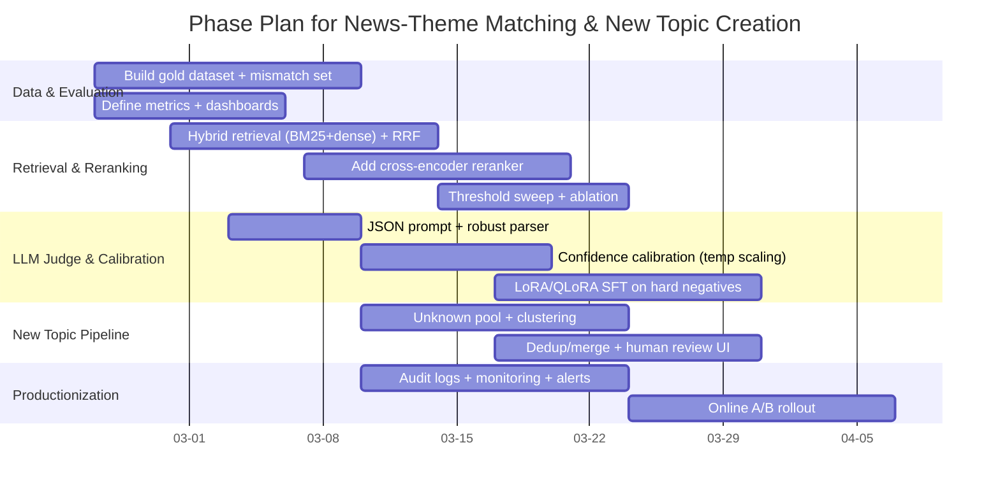

# 新闻事件与题材库匹配及自动新题材创建技术分析

# 新闻事件与题材库匹配及自动新题材创建的可实施方案

## Executive Summary

你们当前“向量检索候选集 + 本地轻量 LLM（0.5B/1.5B）逐一二元判定”的架构，本质是一个典型的“两阶段检索-重排/判定”问题：第一阶段候选召回决定了上限，第二阶段判定（现在用轻量 LLM）决定了精度下限。如果候选集中混入大量“宏观同属科技/产业但产业链主线不同”的题材，轻量模型又缺乏强约束与校准机制，就会出现你们描述的严重“跨题材误判”（例如把“液冷数据中心”混到“数字芯片设计”）。两阶段检索体系中，业界与学术界普遍用更强的重排器（cross-encoder / late-interaction）来抑制这类误召回，并引入混合检索（稠密 + 稀疏/BM25）提升稳健性与可解释性。citeturn4search1turn1search2turn1search16turn4search4

你们还要求“若无相似题材则创建新题材”，这属于开放集（open-set / open-world）分类：系统必须在“已知类中做选择”与“拒识为未知类”之间做可靠权衡。仅靠未校准的二元判定容易过度自信、导致新题材漏建或旧题材误扩张。开放集与 OOD 检测领域的结论是：需要显式的拒识评分与阈值标定（如 max-softmax、energy score、或更专门的 open-set 方法），并对阈值做离线校准与线上漂移监控。citeturn6search0turn6search5turn6search2turn2search0

因此，一个“彻底可实施”的落地方案建议以“三条主线并行”：

（1）候选集质量工程化：混合检索 + 稳定 ANN 索引 + 可靠重排（把错误候选压到很后面）；citeturn1search16turn1search1turn0search1turn4search1

（2）轻量模型判定工程化：结构化输出、置信度量化与后验校准、融合规则（把“泛化相关”系统性压制）；citeturn2search0turn7search3turn9view3

（3）新题材创建工程化：开放集拒识 + 聚类成团 + 去重/合并 + 人审闭环（把“题材爆炸”变成可控流程）。citeturn6search2turn6search3

## 现状与根因分析

你们的问题可以拆成两类错误：

一类是“已知题材之间的混淆”（把 A 接到 B）；另一类是“应判未知却强行归类”（漏建新题材或错归旧题材）。这两类在方法论上分别对应：重排/判别能力不足、以及开放集拒识与校准不足。citeturn6search2turn2search0

从检索角度看，单一稠密向量检索（dense retrieval）在跨域、跨表达方式时往往会召回“语义相近但关键约束（产业链/技术主线/对象）不一致”的候选。信息检索研究长期强调稀疏检索（如 BM25）对“关键术语精确匹配”的价值；而近年来的稀疏学习方法（如 SPLADE）也正是为了在保留词项匹配优势的同时提升语义泛化能力。citeturn1search16turn1search1 仅靠 dense 召回，容易把“数据中心散热/液冷”与“芯片设计/EDA/制造”在“科技/算力”层面的相似性误当成同题材。

从判定/重排角度看，你们当前用轻量 LLM 做逐一二元判断，等价于把一个标准的“retrieve-then-rerank / retrieve-then-classify”流水线中最关键的“高精度重排器”交给了一个未必擅长细粒度判别的小模型。检索领域的经典做法是：第一阶段高召回（BM25 或 bi-encoder），第二阶段用更强的 cross-encoder 对 query-document 对做相关性判别与重排，能显著减少误匹配传播。citeturn4search1turn4search9 轻量 LLM 若缺少强约束 prompt、缺少 hard negative 数据、缺少置信度校准，极易出现“看起来相关就判是”的系统性偏差。citeturn2search0turn3search0

地缘政治类识别不佳通常是“实体与关系”缺失导致：新闻事件中地缘政治判断高度依赖国家/组织/条约/冲突主体等实体识别与消歧，以及这些实体之间的关系模式（制裁、军事冲突、外交声明、出口管制等）。NER 与实体链接（EL）是信息抽取管线的基础模块，缺失它们会导致模型只凭“战、冲突、制裁”这类泛词做粗糙判断。citeturn5search0turn5search1

最后，“若无相似题材则创建新题材”本质是开放集问题：模型必须学会拒识未知类。研究表明仅用 softmax 置信度会出现对 OOD 过度自信，需引入更稳健的 OOD/open-set scoring（如 energy-based）并做阈值校准与监控。citeturn6search0turn6search5turn6search2

## 目标与关键设计维度

下面把系统拆成关键属性/维度，并对“当前/建议/约束”进行明确化；凡你们未提供约束的，标注为“无特定约束”。

| 维度 | 当前描述 | 建议默认方案（可落地起点） | 约束/备注 |
| --- | --- | --- | --- |
| 候选检索方法 | 向量检索候选集 | **混合检索**：BM25（或学习稀疏如 SPLADE）+ 稠密 embedding，并用 RRF 融合；或用 BGE-M3 同时输出 dense+sparse+（可选）multi-vector，再融合与筛选。citeturn1search16turn1search1turn4search4turn10view0 | 主题库规模：无特定约束（但决定索引与K取值） |
| 向量模型 | 未指定 | 优先多语与长文本鲁棒：BGE-M3（1024维、最长8192 token）或 LaBSE 做跨语言兜底。citeturn10view0turn2search3 | 语言覆盖：无特定约束（建议中英混合按多语处理） |
| 索引/ANN | 未指定 | HNSW（高召回低延迟）或 FAISS（含 PQ/IVF 等压缩与GPU加速）。citeturn0search1turn0search0turn0search20 | 延迟目标：无特定约束 |
| 相似度度量 | 未指定 | 稠密向量用 cosine / inner product（与训练一致）；稀疏用 BM25/lexical weight；融合用 RRF 或加权和。citeturn1search16turn4search4turn10view0 | 需在离线集上做阈值扫描 |
| 召回候选集大小 K | 未指定 | 召回 TopK=100（每路 50~200 需实验），重排后保留 TopN=10（或更少给 LLM）。citeturn4search1turn10view0 | 无特定约束（由主题库规模与延迟决定） |
| 重排器 | 无 | 引入 cross-encoder reranker：如 bge-reranker-v2-m3 输出相关性分数，可映射到[0,1]；只对 TopK 运行。citeturn9view2turn4search1 | 若算力受限，可选更小reranker或 early-exit |
| LLM 判定策略 | 本地轻量 LLM逐一二元判定 | 改为“**TopN 多选 + NEW_TOPIC**”结构化判定；并引入 self-check/一致性投票作为可选增强。citeturn8search1turn6search2 | 轻量 LLM：你们已选 Qwen2.5 0.5B/1.5B，可继续用citeturn7search0turn0search3turn9view3 |
| 输出格式 | 自定义（可能是文本） | 强制 JSON Schema；解析失败则降级到正则“结论=是/否”。（示例见后文）citeturn7search14turn7search3 | 无特定约束 |
| 置信度量化 | 无 | 置信度来自：reranker score + LLM self-reported confidence + 特征融合；对最终概率做温度缩放校准。citeturn2search0turn9view2 | 需要校准集（validation） |
| 融合规则 | 无 | 用“学习到的融合器”（LR/GBDT）或规则阈值：高精度优先时以 reranker+规则门控为主，LLM为最后裁决。citeturn4search1turn2search0turn6search0 | 无特定约束 |
| 多阶段过滤 | 无（或少量关键词） | 加入：规则/关键词门控、实体抽取+链接、产业链/对象一致性门控、地缘政治专用门控。citeturn5search0turn5search1 | 规则库：无特定约束（建议从高频错案归纳） |
| 人工审核回路 | 未描述 | “新题材候选”与“低置信度匹配”进入人审；人审结果回流训练与阈值更新。citeturn6search7turn3search0 | 人力：无特定约束 |
| 自动新题材创建 | 未描述 | 先拒识→聚类成团→生成题材草案→去重/合并→人审上线；强调“批量出现”才自动创建。citeturn6search2turn6search3 | 业务可接受的题材增长率：无特定约束 |
| 去重与合并策略 | 未描述 | 名称规范化 + embedding 相似 + reranker/LLM 合并判定；保留审计记录。citeturn4search1turn2search0 | 无特定约束 |
| 跨语言/多域适配 | 未描述 | 多语 embedding（LaBSE/BGE-M3）+ 语言检测与可选翻译 + 主题库多语别名字段。citeturn2search3turn10view0 | 无特定约束 |
| 可解释性与审计日志 | 未描述 | 全链路记录候选、分数、阈值、prompt与输出、模型版本；支持回放与复评。citeturn3search3turn11search12 | 合规要求：无特定约束 |

## 方案架构与模块设计

整体采用“检索-重排-判定-拒识-新题材管线-人审回流”的可审计架构，并把“地缘政治”与“产业链一致性”做成明确的门控模块，避免轻量 LLM 独自承担全部判别压力。该设计遵循两阶段检索与重排的经典框架：先用高召回的 retriever，再用更强的 cross-encoder reranker 精化，并可在最后加入 LLM 作结构化裁判。citeturn4search1turn10view0turn4search9

```mermaid
flowchart TD
  A[News Ingestion] --> B[Text Normalize & Lang Detect]
  B --> C[Entity/Keyword Extraction]
  C --> D1[Hybrid Retrieval\\nDense + Sparse(BM25/SPLADE)]
  D1 --> D2[Candidate Fusion\\nRRF / Weighted Sum]
  D2 --> E[Cross-Encoder Reranker\\nscore(q, theme)]
  E --> F[Rule & Evidence Gates\\nindustry-chain, entity, geopolitics]
  F --> G[LLM Judge (local)\\nTopN + NEW_TOPIC JSON]
  G --> H[Decision Engine\\nmatch vs reject]
  H --> I1[Matched Theme Update]
  H --> I2[Unknown Pool]
  I2 --> J[Unknown Clustering & Topic Draft]
  J --> K[Dedup/Merge & Human Review]
  K --> L[Theme Library Update]
  L --> D1
  H --> M[Audit Log & Metrics]
  D2 --> M
  E --> M
  G --> M
```

### 核心数据对象

- *事件（Event）**建议持久化字段：`event_id、source、lang、title、content、published_at、entities[]、key_phrases[]、summary、embedding(s)、audit_trace_id`。NER/短语抽取与实体链接作为后续门控与解释的基础，能够显著提升“地缘政治/监管/制裁”类判断的可解释性。citeturn5search0turn5search1
- *题材（Theme）**建议从“纯名字+关键词”升级为“可被检索/可被判别/可被合并”的对象：`theme_id、name、aliases[]、level1/level2、description、keywords[]、positive_seeds[]（典型事件摘要）、negative_seeds[]（易混淆反例）、entity_profile（典型公司/国家/机构）、created_at、version`。这一结构能显式支持 hard negative 与门控特征，减少“同属科技”式泛化误判。citeturn3search0turn6search2

### 关键工程模块与接口

**Hybrid Retriever**：提供多路召回（dense、BM25/稀疏、可选 multi-vector），并输出每路 score 与 rank。混合检索在实践中对“术语强约束”与“语义泛化”同时有利；BGE-M3 的说明中也直接推荐“hybrid retrieval + re-ranking”作为 RAG 检索管线建议。citeturn10view0turn1search16turn1search1

**Reranker**：输入 `(event_text, theme_text)` 输出 `relevance_score`。Cross-encoder reranker 被广泛用于两阶段 pipeline 的第二阶段，以降低第一阶段误召回。citeturn4search1turn4search9turn9view2

**Evidence Gates**（多阶段过滤）：

- 产业链/对象门控：主题定义的“对象（设备/材料/技术）”与事件实体/关键词需满足最小证据重叠；
- 地缘政治门控：若事件包含国家/政府机构/军事行为/制裁等模式，提高地缘政治主题优先级并限制非地缘政治候选；
- 规则门控：来自错案库的高精度规则，优先用于“明显不同题材”的硬排斥（如“液冷/冷板/CDU”出现时，先排斥“芯片设计”一类主题）。NER 与实体链接研究表明，实体层面的信息对下游决策至关重要。citeturn5search0turn5search1

**Decision Engine（开放集决策）**：输出三种状态：`MATCH(theme_id)`、`NEW_TOPIC(draft_id)`、`HUMAN_REVIEW`。开放集/OOD 文献强调：应显式建模“拒识”而非隐式依赖分类置信度。citeturn6search2turn6search0turn6search5

## 算法与模型改进路线

### 候选检索与索引策略

**混合检索作为默认**：

- 稀疏检索：BM25 仍是强基线，尤其对“关键术语必须出现”的检索任务有效；citeturn1search16turn1search4
- 学习稀疏：SPLADE 类方法提供“可用倒排索引服务的稀疏表示”，兼顾词匹配与语义扩展；citeturn1search1
- 稠密检索：DPR 等双塔 dense retrieval 在很多任务上显著优于 BM25 的 Top-K 召回准确率，但也更容易引入“语义相近但约束不一致”的候选，因此更需要后续重排与门控。citeturn1search7turn4search1
- 多语/长文：BGE-M3 提供 dense+sparse+multi-vector 统一能力，支持 100+ 语言与 8192 token 输入，适合新闻长文与跨语来源场景。citeturn10view0turn10view0

**候选融合**：建议从 RRF 起步：它以简单的倒数排名叠加融合多路检索结果，在历史实验中表现稳定且易实现。citeturn4search4

**索引实现**：

- HNSW 是高性能 ANN 图索引方案，论文展示其在高召回场景下的效率与鲁棒性。citeturn0search1turn0search9
- FAISS 提供大规模相似度搜索与压缩/加速能力，并有公开论文与工程实践说明。citeturn0search0turn0search20

### 重排与判定策略

**引入 cross-encoder reranker，降低轻量 LLM 误判压力**：BERT 重排（cross-encoder）方向的经典工作表明，对 query-document 对做联合编码的重排器能显著提升排序质量，是两阶段检索流水线的关键环节。citeturn4search1turn4search9 BGE reranker 系列的模型卡也明确区分：reranker 直接输出相关性分数，并可映射到 [0,1]，非常适合作为“证据分”的统一来源。citeturn9view2turn4search7

**LLM 判定从“逐一二元”升级为“对比式多选 + NEW_TOPIC”**：逐一二元容易出现“多个都判是”的问题；而多选式结构让模型必须在候选之间做排他选择，并保留“都不合适（NEW_TOPIC）”的出口，更贴近开放集需求。开放集/OOD 文献强调拒识的重要性，可把 NEW_TOPIC 作为一等公民输出。citeturn6search2turn6search0

**轻量模型能力边界与工程化增强**：Qwen2.5 技术报告说明其通过更大规模数据与后训练（SFT、DPO/GRPO 等）强化了指令遵循与结构化数据分析能力，并提供 0.5B/1.5B 等多尺寸配置，适配资源受限部署。citeturn9view3turn7search0turn0search3 但“指令遵循能力”不等于“领域细粒度判别能力”，必须通过数据与校准补齐（下文给出可落地路线）。citeturn3search0turn2search0

### 置信度量化、校准与融合规则

你们现在的问题很像“把模型输出当作概率直接用”，而校准研究表明现代神经网络往往置信度不可靠；温度缩放（temperature scaling）是简单而有效的后处理校准方法。citeturn2search0

建议把最终决策改为一个**融合评分**（可规则也可学习）：

- `R = reranker_score`（0~1）
- `L = llm_confidence`（0~1，由模型输出置信度并做校准）
- `E = evidence_features`（实体重叠、核心关键词命中、地缘政治触发等）

然后定义：

- `P(match) = sigmoid(a*R + b*L + c·E + d)`（逻辑回归/轻量 GBDT）
- 若 `max_theme P(match) < T_new` → NEW_TOPIC；否则选择 `argmax_theme P(match)`。

开放集/OOD 检测文献给出多个思路：max-softmax baseline、energy score 等都可作为“拒识评分”的输入特征。citeturn6search0turn6search5

### 新题材创建、去重与合并策略

“新题材创建”建议做成**两级触发**，防止题材爆炸：

1. **单事件级拒识**：当所有候选在 reranker/融合评分上都低于阈值，输出 NEW_TOPIC，并把事件放入 Unknown Pool。citeturn6search2turn6search5
2. **群体级成团创建**：对 Unknown Pool 做聚类，只有当某簇在时间窗口内达到最小规模与一致性阈值（例如 7 天内 ≥ 20 条，簇内平均相似度 ≥ S_cluster）才生成“新题材草案”。开放意图发现（open intent discovery）研究常用“先表示到语义空间、再聚类发现未知类”的框架，也强调聚类后需要可读标签生成。citeturn6search3turn6search7

去重与合并建议采用“三步”：

- 名称归一化（全角半角、同义词、别名）；
- embedding 近邻检索找潜在重复；
- reranker/LLM 做“是否同题材”二元判定，并记录证据与审计日志。citeturn4search1turn2search0

### 地缘政治专项改造

地缘政治误判往往来自“实体缺失 + 关系缺失”。建议在门控层做专项增强：

- NER 抽取国家、政府机构、国际组织、军事实体、法律/制裁条款；citeturn5search0turn5search4
- 实体链接把同名实体（如不同“议会/国会/委员会”）对齐到内部知识库或公开 KB；实体链接综述强调深度学习方法在 EL 设计与评估中的系统化要点。citeturn5search1turn5search33
- 为地缘政治题材库建立“事件模式模板”（制裁/关税/出口管制/军事冲突/外交会谈），把模式命中作为门控与解释字段。

### 轻量模型改造方案清单（可实施步骤、收益与风险）

下表把你们要求的“微调/指令微调/校准/混合专家/蒸馏/RAG/链式验证”等方法，按落地复杂度与收益拆解：

| 方法 | 实施步骤（摘要） | 预期收益 | 主要风险/成本 | 推荐优先级 |
| --- | --- | --- | --- | --- |
| 指令微调 SFT（LoRA/QLoRA） | 构建训练样本：`(event_text, candidates)->label`；加入 hard negatives（易混淆题材对）；用 LoRA/QLoRA 在 1.5B 上做 SFT；离线评估+回归测试。citeturn3search0turn3search1 | 显著降低“泛化相关判是”；更贴合你们题材定义 | 需要标注与数据治理；可能过拟合近期热点 | 高 |
| 置信度校准（Temperature Scaling） | 在校准集上对融合器或 LLM 输出做温度缩放；输出可靠概率与阈值。citeturn2search0 | NEW_TOPIC 阈值更稳；FPR 可控 | 需要稳定的校准集；漂移需重校准 | 高 |
| Embedding 侧对比学习（SimCSE/领域对比） | 用你们事件-题材正样本、hard negative 做对比学习；或用 SimCSE 思路提升句向量空间。citeturn3search6 | 候选召回更“产业链一致”；减少跨域混召回 | 训练与上线复杂；索引需重建 | 中高 |
| 引入 reranker（cross-encoder） | 先用现成 reranker（如 bge-reranker-v2-m3）重排 TopK；再让 LLM 只看 TopN。citeturn9view2turn4search1 | 立竿见影压制错候选；降低 LLM 负担 | 推理成本上升（但仅 TopK） | 高 |
| 蒸馏（大模型→小模型） | 用更强 teacher（可离线）生成“对比判定/理由码”；训练小模型模仿；与 SFT 结合。QloRA 工作展示了用高质量数据在有限资源上高效微调的可行性。citeturn3search1 | 小模型更接近“大模型判断边界” | Teacher 质量与偏差会传递；需治理 | 中 |
| 混合专家（MoE/门控多模型） | 为几个大类（算力基础设施/半导体/新能源/地缘政治）训练或配置不同判别器；通过规则/轻分类器路由。Qwen2.5 系列也公开提到有 MoE 变体（托管侧）。citeturn9view3 | 显著缓解跨域混淆 | 工程复杂度高；路由错误会放大 | 中 |
| RAG/证据增强判定 | 为每个主题维护“定义+正反例+产业链证据”文档；判定时检索这些证据并让模型对照。RAG 理论与工程文档强调外部非参数记忆可提升事实性与可更新性。citeturn0search6turn3search3 | 强化可解释性；对新热点更稳 | 需要主题证据库建设；延迟上升 | 中高 |
| 链式验证/一致性投票 | 对同一 TopN 用两种 prompt 或自一致性策略投票；自一致性研究显示多路径推理再投票可提升准确率。citeturn8search1 | 降低单次生成偶然误判 | 推理成本乘倍；小模型可能收益有限 | 中 |

## 评价体系与可复现实验设计

### 数据集构建与划分

建议把评测数据分成三层，以支持“可复现+可解释+可 A/B”：

- **核心离线评测集（Gold）**：人工确认的事件→题材映射，包含“无匹配应新建”的样本（unknown 类）。开放集研究通常强调要在测试时保留一部分“训练未见类”作为 open-space，才能真实评估拒识能力。citeturn6search2
- **错案强化集（Mismatch）**：专门收集当前流程的 mismatch events（你们已有这类 AB 报告思路），用于快速迭代回归；
- **时间外推集（Time-split）**：按发布时间切分（例如最近 2 个月为 test），模拟概念漂移与热点切换，这是新闻场景非常关键的稳定性约束。citeturn6search2

划分建议（可复现起点）：

- Train/Val/Test = 70/10/20；
- Test 进一步按大类分层（算力基础设施/半导体/新能源/地缘政治/宏观政策/其他），并保证每类至少 N_min（见样本量估算）。

### 指标体系（定义与解释）

你们需要同时衡量“匹配质量”和“新题材质量”，建议指标分三组：

**检索与候选质量**（离线）

- `Recall@K`：正确题材是否在候选 TopK 中（决定上限）。dense retrieval 的文献常用 Top-K accuracy/recall 来评估召回。citeturn1search7turn10view0
- `nDCG@K / MRR@K`：若你们有排序意义，可衡量正确题材排位。两阶段检索-重排文献常用这些排序指标。citeturn4search1turn1search2

**判定与误判控制**（离线 + 线上）

- `Precision / Recall / F1`（按“是否匹配到正确题材”二分类）
- `Pairwise Accuracy`：在“正确题材 vs 已知错题材”对中，是否同时做到“选对且压制错”——这与你们现有 mismatch 单测最贴合；
- `False Positive Rate (FPR)`：把不属于某题材的事件误判为属于的比例；OOD/开放集文献常用 “FPR@TPR95”等指标刻画拒识质量。citeturn6search5turn6search0

**新题材创建质量**（关键）

- `New-topic Precision`：被系统判为 NEW_TOPIC 的事件中，人工确认确实应新建的比例（越高越不“题材爆炸”）。
- `New-topic Recall`：人工确认应新建的事件中，被系统成功拒识并进入新题材流程的比例（越高越不漏建）。
- `Cluster Purity / Topic Coherence`：新题材聚类簇内部一致性（可用平均相似度/人工抽检）。开放意图发现框架强调聚类与标签生成的质量评估。citeturn6search3turn6search7

### 统计显著性检验与最小样本量估算

**离线对比（同一批事件、两套系统）**：建议用 McNemar 检验（配对二元结果：旧对/新对），适合判断“同一批样本上两分类器是否显著不同”。citeturn2search9turn2search1

可复现实操：对每个事件定义 `correct_old ∈ {0,1}`、`correct_new ∈ {0,1}`，形成 2×2 表，做 McNemar（或 mid-p 版本用于小样本）。citeturn2search1turn2search9

**线上 A/B（随机分流、非配对）**：用两比例 z-test 或 Bayesian（若你们偏好），以 `New-topic Precision`、`Pairwise Accuracy`、`人工复核通过率`等为主 KPI。开放集场景尤其建议同时监控 FPR（误归类）与 NEW_TOPIC rate。citeturn6search5turn6search2

**最小样本量（示例）**

在无特定约束、常见的 alpha=0.05、power=0.8 下：

- 若线上 A/B 希望把“事件级正确率”从 0.70 提升到 0.80（提升 0.10），两组独立样本每组约需 **≈ 300** 条；
- 若从 0.70 提升到 0.78（提升 0.08），每组约需 **≈ 470** 条；
- 若仅提升到 0.75（提升 0.05），每组约需 **≈ 1250** 条。
（这些为两比例近似计算的量级指导；真实所需与方差、分层与流量有关。）

对于离线配对 McNemar，样本量主要由“新旧系统分歧样本数（discordant pairs）”决定：如果你预期“旧错新对”与“旧对新错”的差值很小，则需要更多样本；若主要改进集中在错案集上，往往数百条即可看出显著差异。McNemar 的核心依赖 b、c 两个分歧格子的计数。citeturn2search1

### 基线与对照实验表（可复现对比矩阵）

由于你们未提供当前基线数值，下表给出“必须测的基线表模板”，用于每次迭代强制回归（数值用你们跑出来的结果填入）：

| 系统版本 | Recall@100 | Pairwise Accuracy（mismatch） | FPR（match误判） | New-topic Precision | 平均延迟（ms） | 备注 |
| --- | --- | --- | --- | --- | --- | --- |
| Baseline：Dense检索 + 小LLM逐一二元 | 待测 | 待测 | 待测 | 待测 | 待测 | 当前生产/准生产 |
| V1：Hybrid检索 + RRF + reranker + TopN LLM | 待测 | 待测 | 待测 | 待测 | 待测 | 推荐首个落地版本citeturn4search4turn4search1turn10view0 |
| V2：加入地缘政治门控 + 校准 + Unknown聚类 | 待测 | 待测 | 待测 | 待测 | 待测 | 解决地缘政治与新题材citeturn5search1turn6search2turn2search0 |

### 阈值扫描与可视化建议

你们需要把“是否匹配”“是否新题材”都变成可调阈值曲线，而不是拍脑袋常数：

- 对 `P(match)` 或 `reranker_score` 做阈值扫描，绘制 PR 曲线与 FPR 曲线（尤其关注高 precision 区域）；
- 输出混淆矩阵：至少包括 `{正确匹配、错匹配到其他题材、应新建但错匹配、应匹配但错拒识}` 四类；
- 对“液冷数据中心 vs 数字芯片设计”等高频混淆对，单独统计 pairwise accuracy 与误判原因分布（候选召回错？重排错？LLM错？门控没触发？）。

这些可视化的核心目标是把错误定位到模块：第一阶段召回、第二阶段重排、门控、LLM、阈值/校准。两阶段检索-重排文献与开放集/OOD文献都强调“模块化评分 + 阈值曲线”的必要性。citeturn4search1turn6search5turn2search0

## 部署、监控与运行手册

### 本地模型部署与可复现性

你们既然使用本地小模型，建议把推理栈和权重格式标准化，降低版本差导致的不一致与事故：

- 若走 Python + Transformers 推理，严格固定 `transformers` 版本与生成参数；Transformers 文档明确 `generate` 支持 greedy decoding（例如 `do_sample=False`）等策略，利于可重复评测。citeturn7search3
- 若追求更低资源与更易部署，可使用 GGUF + llama.cpp 路线：Hugging Face 提供 GGUF 文档，llama.cpp 支持加载并缓存 GGUF，适用于 CPU/边缘推理。citeturn8search7turn8search24turn8search3
- Qwen2.5 系列在模型卡与技术报告中提供多尺寸与量化版本，适配资源受限场景。citeturn9view3turn7search0turn0search3

安全补充：在 Transformers 生态中，文档明确提示加载自定义模型代码需谨慎，避免执行潜在恶意代码（尤其是 `trust_remote_code` 相关）。生产环境应优先使用已验证来源与安全权重格式，并对模型仓库做供应链审计。citeturn11search12turn11search1

### 监控指标与告警策略

建议把监控分为“系统健康”和“质量漂移”两类：

**系统健康（SRE）**：QPS、P50/P95/P99 延迟、超时率、重试率、缓存命中率、索引查询耗时、LLM 推理耗时、解析失败率（JSON parse fail）、fallback 触发率。

**质量漂移（ML）**：

- `match_rate`、`new_topic_rate`、`human_review_rate`；
- 人审通过率（match 通过、new-topic 通过、合并/去重通过）；
- Top 混淆对的误判率（例如“液冷↔芯片设计”）；
- 置信度的可靠性：校准误差（ECE 等）与“高置信错案”比例。校准与 OOD 文献都表明，过度自信是风险放大器，应优先监控。citeturn2search0turn6search5turn6search0

**审计日志（必须落地）**：每次决策写入：

`event_id、event_text_hash、retrieval_candidates（含每路rank/score）、reranker_scores、门控命中项、LLM prompt_version、LLM_output_raw、parsed_json、final_decision、final_confidence、model_versions、threshold_versions、trace_id`。这样才能支持回放、复盘、以及“错案→规则/数据→再训练”的闭环。citeturn3search3turn2search0

## 资源、时间线与风险缓解

### 具体 prompt 示例与解析规则（中文）

下面给出一个“TopN 多选 + NEW_TOPIC”的推荐判定 prompt（适配本地小模型、避免长解释、强结构化输出）。注意：不要让模型输出长 reasoning；只输出 JSON。

```
你是金融新闻题材匹配的严格裁判。任务：从候选题材中选择最匹配的一个；若都不匹配则选择 NEW_TOPIC。
判定标准：
- 必须同一产业链/技术主线/事件对象一致，并且事件文本有直接证据。
- 仅“都属于科技/算力/高端制造”等泛化相关，一律判不匹配。
- 拿不准就选择 NEW_TOPIC 或 HUMAN_REVIEW（按规则触发）。
输出要求：
- 只输出一段 JSON，不要输出多余文字。
- confidence 取 0~100 的整数，表示你对 decision 的把握。
- evidence 必须是从事件中抽取的短证据片段（最多 3 条，每条 ≤ 20 字）。

输入：
事件文本：
{EVENT_TEXT}

候选题材（按相关性从高到低）：
1) {THEME_1_NAME} | 一级={L1_1} 二级={L2_1} | 关键词={KW_1}
2) {THEME_2_NAME} | 一级={L1_2} 二级={L2_2} | 关键词={KW_2}
...
N) {THEME_N_NAME} | 一级={L1_N} 二级={L2_N} | 关键词={KW_N}

请输出 JSON：
{
  "decision": "THEME_1" | "THEME_2" | ... | "THEME_N" | "NEW_TOPIC" | "HUMAN_REVIEW",
  "confidence": 0-100,
  "reason_code": "EVIDENCE_STRONG" | "EVIDENCE_WEAK" | "TOO_GENERAL" | "GEO_POLITICS" | "AMBIGUOUS" | "OTHER",
  "evidence": ["...", "..."]
}
```

**解析规则建议**（优先 JSON，失败再降级）：

```
# 1) 提取首个 JSON 对象（允许前后噪声）
\\{[\\s\\S]*\\}

# 2) 降级：结论=是/否
结论\\s*=\\s*(是|否)
```

**置信度映射与校准**：模型输出 `confidence` 只是“自报”，需要在校准集上做温度缩放/回归校准，使其更接近真实正确率；校准方法的有效性在文献中已系统论证。citeturn2search0turn7search14

### 资源成本对比表（含模型大小/延迟/内存）

下表给出“候选方案”与成本的可落地对比（未提供具体硬件与并发约束处标注“无特定约束/待测”）。Qwen2.5 的参数规模引用模型卡与技术报告；BGE-M3 的维度/长度来自模型卡。citeturn7search0turn0search3turn9view3turn10view0

| 方案组件 | 候选方法 | 预期优点 | 预期缺点 | 模型大小/内存（起点） | 推理延迟（起点） |
| --- | --- | --- | --- | --- | --- |
| Dense embedding | BGE-M3（dense） | 多语+长文，召回稳健；还能输出 sparse/multi-vec 便于混合检索citeturn10view0 | 需要GPU更佳；长文编码成本高 | 维度1024、长8192；参数/内存待测citeturn10view0 | 待测（与 max_length 强相关） |
| Sparse retrieval | BM25 / SPLADE | 关键术语强约束；对专有名词更稳citeturn1search16turn1search1 | 对同义改写不如 dense | 无模型/或小模型 | 低 |
| ANN Index | HNSW / FAISS | 高吞吐近邻检索；FAISS 支持大规模与压缩citeturn0search1turn0search0turn0search20 | 需要建索引与调参 | 无（工程组件） | 低（随规模） |
| Fusion | RRF | 简单有效、易复现citeturn4search4 | 不利用分数标度信息 | 无 | 低 |
| Reranker | bge-reranker-v2-m3 / BERT cross-encoder | 显著压制错候选，二阶段关键模块citeturn4search1turn9view2 | 对 TopK 成本较高 | 参数/内存待测（以权重为准） | 中（取决于 K） |
| LLM Judge | Qwen2.5-0.5B-Instruct | 资源占用低，适合大量请求；参数0.49Bciteturn7search0turn9view3 | 细粒度判别可能不足 | FP16 约 1GB 量级（估算）；量化更低 | 低~中（无特定约束） |
| LLM Judge | Qwen2.5-1.5B-Instruct | 较强理解/指令能力；参数1.54Bciteturn0search3turn9view3 | 延迟与内存更高 | FP16 约 3GB 量级（估算）；量化更低 | 中（无特定约束） |
| 校准 | Temperature scaling | 让置信度更可信、阈值更稳citeturn2search0 | 需要校准集与周期重校准 | 无 | 极低 |
| Unknown clustering | 语义聚类+标签生成 | 把“新题材”变成可控批量流程citeturn6search3turn6search7 | 聚类与命名需要治理 | 依赖 embedding | 中（离线为主） |

### 执行时间线（可落地甘特图）

假设你们已有基础工程与题材库，且“无特定约束”的资源配置下，给出一个 8~10 周可落地时间线（可并行）：



### 风险与缓解措施

**题材爆炸（NEW_TOPIC 过多）**：通过“单事件拒识+群体成团创建”双阈值、并把 New-topic Precision 作为硬指标；开放集/OOD工作强调拒识阈值与 FPR 的重要性。citeturn6search2turn6search5

**漏建新题材（把未知硬塞进旧题材）**：提高拒识敏感度（lower T_new）、引入 energy/最大置信等 OOD 特征，并对高风险大类（如地缘政治）单独阈值。citeturn6search0turn6search5

**地缘政治误判导致业务风险**：强制实体抽取与链接、增加模式门控与人审路径；NER/EL 综述指出这些模块是构建鲁棒信息处理系统的基础。citeturn5search0turn5search1

**轻量 LLM 稳定性不足**：用 reranker 缩小 LLM 输入候选，减少其承担的决策空间；同时通过 SFT（LoRA/QLoRA）与 hard negatives 强化判别边界。citeturn4search1turn3search0turn3search1

**版本漂移与不可复现**：固定模型、索引、阈值与 prompt 版本；日志记录完整决策链；对比实验用 McNemar 做显著性验证，避免“看起来提升但不显著”。citeturn2search9turn2search1

**供应链与安全风险**：对模型加载采取谨慎策略，避免不可信远程代码执行；Hugging Face 文档对加载自定义模型代码提示要格外小心。citeturn11search12turn11search1

### 所需资源与粗略估算（无特定约束）

- 工程开发：检索/重排/日志/监控/评测框架通常需要 2~3 名工程 + 1 名算法（8~10 周）完成 V1 并上线 A/B；
- 标注与人审：建议至少 1~2 名业务标注/研究员维护 gold 集与错案库（持续）；
- 计算：
    - Qwen2.5 0.5B/1.5B 的参数规模与上下文长度在模型卡/技术报告中已给出，适配从 CPU 到 GPU/量化的多档部署。citeturn7search0turn0search3turn9view3
    - reranker 会成为主要在线成本点（对 TopK 运行），但它能显著减少误判与后续人工成本，通常性价比高。citeturn4search1turn10view0

以上方案的关键在于：把“题材匹配”从“轻量 LLM 单点判断”改造成“混合检索提高候选质量 + cross-encoder 精排压制错候选 + 结构化 LLM 裁判 + 校准与开放集拒识 + 新题材聚类与人审闭环”的可审计系统工程。这样才能同时解决你们提出的三件事：减少明显错配、提升地缘政治识别、并可靠地触发新题材创建。citeturn10view0turn4search1turn6search2turn2search0