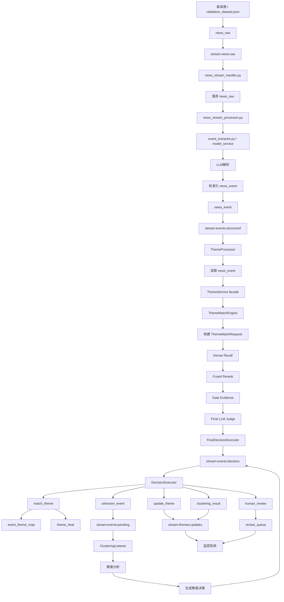

# 项目验收规范（ACCEPTANCE）

- 项目：个人投资助理（AI Theme App）
- 范围：第一阶段（P1.phase0 ~ P1.phase4）+ 第二阶段（P2.phase0 ~ P2.phase3）+ 第三阶段（当前已定义 `P3.phase0`，历史别名 `P3.phaseA`）+ 第四阶段前置（P4.phaseA）
- 依据文档：
  - `docs/project_control/prd_p1.md`
  - `docs/project_control/ARCH_REVIEW.md`
  - `docs/architecture/个人投资助理-项目架构设计-第一阶段.md`
- 风险等级：High
- 合约模式：严格二进制通过（不允许部分通过）
- 第一阶段强制能力：`LLM 最终裁决（Qwen2.5 + llama.cpp）` 必须完成并通过验收，未达标即整阶段不通过。

## Change Log

- 2026-03-29
  - 新增 `Phase P2.phase1 ~ P2.phase3` 验收定义，使第二阶段与 `prd_p2.md` 对齐
  - 文档标题由“第一阶段验收规范”调整为“项目验收规范”
  - 新增 `Phase P2.phase0 — ThemeMatchEngine 入核与题材知识中台边界收敛`
- 该阶段基于重构架构文档新增，当前为 Draft Acceptance，尚未完成与 Phase Contract / WBS / 测试计划的正式闭环
- 2026-03-31
  - 调整阶段顺序：题材知识对象与 API 前移为 `P2.phase1`
  - 热度、生命周期与榜单运营化前移为 `P2.phase2`
  - Unknown 与新题材闭环后移为 `P2.phase3`
  - 新增 `P3.phaseA` 验收定义，覆盖 `frontend_bff / api_gateway` 第一版产品出口
  - 新增 `P4.phaseA` 验收定义，覆盖 `/intel` 情报列表页前置交付
- 2026-04-02
  - 明确第三阶段应视为完整阶段，不应只有 `P3.phase1`
  - 将历史命名 `P3.phaseA` 解释为 `P3.phase0` 的兼容别名
  - 后续第三阶段正式拆解按 `P3.phase0 ~ P3.phaseN` 延展
  - 新增 `P3.phase1 ~ P3.phase3` Draft Acceptance，占位第三阶段后续验收闭环

## 冲突裁决说明

- 冲突 1：
  - `PRD.md` 已新增 `P2.phase0`
  - 当前 `PHASE_CONTRACT/PLAN_WBS/TEST_CASE_SPEC` 尚无 `P2.phase0`
  - 裁决：先补充 Draft Acceptance 作为需求闭环中间产物，映射占位并标记 `gate_ready=false`

- 冲突 2：
  - 重构架构文档包含中长期目标态
  - 当前验收只适合覆盖“首期入核边界”
  - 裁决：本阶段验收只验证 `ThemeMatchEngine` 入核、三态决策、降级、审计、Unknown 首期出口，不验证完整久赢式产品化能力

- 冲突 3：
  - `prd_p2.md` 已按 `P2.phase0 ~ P2.phase3` 组织第二阶段完整需求
  - 当前仓库尚无第二阶段正式 `PHASE_CONTRACT / PLAN_WBS / TEST_CASE_SPEC`
  - 裁决：先补齐 `P2.phase1 ~ P2.phase3` 的 Draft Acceptance，使第二阶段需求与验收口径一致；机读映射保留缺口并标记 `gate_ready=false`

---

## Phase P1.phase0 — 运行时收敛与契约冻结

### 1. 目标（1-3 行）
建立第一阶段唯一运行时处理链和统一消息契约，消除同名函数覆盖、链路歧义和字段漂移。确保 `trace_id` 可跨 stream 追踪，契约必填字段覆盖率达到 100%。

### 2. 验收目标（清单）
- [ ] 仅保留一个有效决策路由实现路径（无重复入口可触发）。
- [ ] `DecisionEnvelope v1` 强制启用并定义必填字段：`decision_id,event_id,action,payload_version,trace_id,idempotency_key,payload`。
- [ ] `news` 消息格式收敛到单一可解析契约（禁止无边界递归 payload 解析分支）。
- [ ] 运行时模块（handler/scheduler/service）生产路径中 `print` 与 `traceback.print_exc` 清零。
- [ ] `trace_id` 从 `news_stream_*` 到 `theme_processor` 到 `DecisionExecutor` 全链路可查。

### 3. 验收测试用例（Given / When / Then）

#### 案例 ID: ACC-P1-P0-01
Given:
- 代码库包含第一阶段全部运行时模块
- 已定义契约扫描规则
When:
- 执行静态扫描（重复函数名、重复路由入口）
Then:
- `theme_processor` 中决策路由函数仅有单实现
- `theme_service` 中同名关键入口方法无重复定义
- `news_stream_handler` 中批处理/统计方法无重复定义

#### 案例 ID: ACC-P1-P0-02
Given:
- 消费端接收 `v0/v1` 历史样本消息
When:
- 统一解析消息并进入内部对象
Then:
- 解析结果统一为 v1 结构
- 缺失必填字段的消息被拒绝，不进入业务执行
- 拒绝消息写入 dead-letter 且带错误码

#### 案例 ID: ACC-P1-P0-03
Given:
- 一条完整新闻从 `stream:news:raw` 进入处理链
When:
- 完整执行到 `stream:events:decision`
Then:
- 日志与消息中存在同一 `trace_id`
- `trace_id` 可检索到链路各节点处理记录

### 4. 边界/非目标
- 不做动态阈值策略优化。
- 不引入 LLM 裁判执行逻辑。
- 不做前端与产品化层改造。

### 5. 数据示例（如适用）
输入 JSON：
```json
{
  "payload_version": "v1",
  "decision_id": "dec_0001",
  "event_id": "evt_0001",
  "action": "update_theme",
  "trace_id": "trace_evt_0001",
  "idempotency_key": "evt_0001:update_theme:sha256_abcd",
  "payload": {"theme_id": "th_001"}
}
```
预期结果：
- 消费端解析成功为统一内部对象
- 缺任一必填字段则拒绝执行并入死信

### 6. 失败标准（必须明确）
- 任意关键函数重复定义仍存在。
- 存在多条可执行决策路由入口。
- 契约必填字段覆盖率 < 100%。
- 生产路径存在 `print`/`traceback.print_exc`。
- `trace_id` 无法跨 stream 追踪。

### 7. 可观察性要求
- 必需日志字段：`trace_id,event_id,decision_id,payload_version,consumer,stream,message_id`。
- 必需指标：`contract_validation_fail_count`、`duplicate_route_detected_count`。
- 必需审计条目：契约拒绝原因码 + 原始消息ID。

---

## Phase P1.phase1 — 路由统一与幂等执行

### 1. 目标（1-3 行）
保证同一输入事件在重试/回放场景结果一致，重复写入率为 0。建立严格解析、幂等执行与受控失败策略，杜绝静默跳过和弱解析吞错。

### 2. 验收目标（清单）
- [ ] 决策执行前强制校验 `idempotency_key`，命中后 `duplicate-skip`。
- [ ] 决策/事件载荷解析禁止 `str(value)` 降级进入执行路径。
- [ ] 未知 `action/operation` 必须 fail-fast 并进入 dead-letter。
- [ ] `normal` 未匹配事件必须落到 `stream:events:pending` 且原消息 ACK。
- [ ] 失败消息必须进入受控处理（重试上限 + dead-letter），不得无限悬挂。

### 3. 验收测试用例（Given / When / Then）

#### 案例 ID: ACC-P1-P1-01
Given:
- 两条 `event_id/action/payload_hash` 相同的决策消息
When:
- 依次执行决策
Then:
- 第一条执行成功
- 第二条命中幂等并跳过写入
- 统计中 `duplicate_skip_count` 增加 1

#### 案例 ID: ACC-P1-P1-02
Given:
- 一条缺少 `payload` 或 `action` 的决策消息
When:
- 进入 DecisionExecutor 解析流程
Then:
- 消息被拒绝执行
- 写入 dead-letter 并附解析失败原因
- 不得发生任何数据库写操作

#### 案例 ID: ACC-P1-P1-03
Given:
- `normal` 事件匹配失败
When:
- 执行决策发布
Then:
- 生成 `publish_clustering` 决策并写入 pending 流
- 原消息 ACK
- 事件具备 `trace_id` 和 `decision_id`

### 4. 边界/非目标
- 不进行阈值策略 A/B 调优。
- 不引入 LLM 裁判产线开关。

### 5. 数据示例（如适用）
输入 JSON：
```json
{
  "decision_id": "dec_1001",
  "event_id": "evt_1001",
  "action": "create_new_theme",
  "idempotency_key": "evt_1001:create_new_theme:sha256_777",
  "payload": {"theme_data": {"name": "新概念", "code": "THM_X"}}
}
```
预期结果：
- 首次执行创建成功
- 重复执行返回 `duplicate_skip`

### 6. 失败标准（必须明确）
- 回放同批次出现重复写入。
- 未知 `action/operation` 未被阻断。
- 解析失败消息进入执行器主路径。
- 死信率无告警且持续上升。

### 7. 可观察性要求
- 必需日志字段：`idempotency_key,decision_id,event_id,action,duplicate_hit,dead_letter_reason`。
- 必需指标：`duplicate_skip_rate`、`dead_letter_rate`、`parse_reject_count`、`unknown_action_count`。
- 审计条目：每条拒绝/跳过均保留原始消息ID与拒绝原因。

---

## Phase P2.phase0 — ThemeMatchEngine 入核与题材知识中台边界收敛

### 1. 目标（1-3 行）

在不重做现有 Redis Stream 主链路的前提下，将高精度离线题材裁决能力沉淀为线上 `ThemeMatchEngine` 首期能力，并冻结“运行时基线 / 匹配内核升级 / 题材知识扩展”三层边界。确保首期上线后，题材匹配主链路具备统一判定内核、三态决策出口、受控降级能力和最小审计能力。

### 1.1 本阶段验收流程图（Mermaid）



---

## Phase P3.phase0（历史别名 P3.phaseA）— 前端统一产品出口第一版

### 1. 目标（1-3 行）
建立 `frontend_bff / api_gateway` 第一版边界，让前端统一经由 `/api/*` 访问题材情报、题材工作台和个股工作台，避免长期直接耦合领域服务。

### 2. 验收目标（清单）
- [ ] 必须存在独立 `frontend_bff` 服务目录与应用入口。
- [ ] 必须提供 `GET /api/intel/feed`、`GET /api/theme-workspace/{subject_key}`、`GET /api/stock-workspace/{stock_id}` 三个接口。
- [ ] 前端长期契约必须统一收口到 `/api/*`。
- [ ] `theme-workspace` 必须聚合题材摘要、历史、子题材、股票池。
- [ ] `stock-workspace` 必须聚合个股基础信息与所属题材列表。
- [ ] 真实 PostgreSQL 集成测试必须通过。

### 3. 验收测试用例（Given / When / Then）

#### 案例 ID: ACC-P3A-001
Given:
- `frontend_bff` 已接入 `theme_service` 只读能力
When:
- 调用 `/api/intel/feed`
Then:
- 返回统一情报 DTO
- 不暴露底层领域表结构

#### 案例 ID: ACC-P3A-002
Given:
- 某 `subject_key` 在当前数据库中存在
When:
- 调用 `/api/theme-workspace/{subject_key}`
Then:
- 返回题材摘要、历史、子题材、股票池
- 主键使用 `subject_key`

#### 案例 ID: ACC-P3A-003
Given:
- 某 `stock_id` 在当前数据库中存在
When:
- 调用 `/api/stock-workspace/{stock_id}`
Then:
- 返回个股详情与所属题材列表
- 股票默认读取主股票池语义

### 4. 边界/非目标
- 不实现 WebSocket/SSE。
- 不独立拆出完整 `intel_service / workspace_service` 运行时服务。
- 不建设完整产业链图谱服务。

### 5. 失败标准（必须明确）
- 无独立 `frontend_bff` 服务入口。
- 任一 `/api/*` 产品接口缺失。
- 前端仍直接依赖 `theme_service` 作为长期正式契约。
- 真实 PostgreSQL 集成测试失败。

### 6. 可观察性要求
- 必需日志字段：`request_id, route, subject_key, stock_id, latency_ms, partial`。
- 必需指标：`bff_request_count`、`bff_error_count`、`bff_partial_response_count`。

---

## Phase P3.phase1 — Stock Service 双源事实层与复盘快照

### 1. 目标（1-3 行）
建立第三阶段首批稳定业务闭环：以 `Tushare + JYHF` 为双源，落地股票事实对象层、题材股票拼接、盘前必读/盘后复盘快照，并使前端和 Notion 共用同一份报告真源。

### 2. 验收目标（清单）
- [ ] 必须完成 `Tushare` 日频真源接入，并形成可回放的股票快照。
- [ ] 必须完成 `JYHF` 题材事件与题材股票池复用，并与股票快照形成稳定绑定。
- [ ] 必须生成 `stock_daily_snapshot` 与 `subject_stock_daily_snapshot`。
- [ ] 必须生成 `stock_abnormal_event` 与 `theme_stock_leaderboard`。
- [ ] 必须生成 `pre_market_brief_snapshot` 与 `post_market_recap_snapshot`。
- [ ] `frontend_bff` 与 `notion_publisher` 必须消费同一份报告快照。
- [ ] 不得把“秒级全市场实时行情”和“全量资金行为分析”作为本阶段通过门槛。

### 3. 验收测试用例（Given / When / Then）

#### 案例 ID: ACC-P3B-001
Given:
- 交易日结束，`Tushare` 与 `JYHF` 数据源可用
When:
- 执行第三阶段日频同步任务
Then:
- `stock_daily_snapshot` 与 `subject_stock_daily_snapshot` 成功生成
- 股票与题材支持双向反查

#### 案例 ID: ACC-P3B-002
Given:
- 股票快照、题材池和题材事件均已入库
When:
- 执行状态识别与榜单计算
Then:
- 生成 `stock_abnormal_event`
- 生成 `theme_stock_leaderboard`
- 结果具备可解释角色字段

#### 案例 ID: ACC-P3B-003
Given:
- 盘前或盘后生成任务被触发
When:
- 生成报告快照
Then:
- `pre_market_brief_snapshot` 或 `post_market_recap_snapshot` 成功落库
- 同一交易日重复生成结果一致

#### 案例 ID: ACC-P3B-004
Given:
- 报告快照已生成
When:
- 前端通过 `frontend_bff` 读取，且 `notion_publisher` 发布同一报告
Then:
- 前端和 Notion 展示核心字段一致
- Notion 发布失败不阻塞快照落库

### 4. 边界/非目标
- 不实现 `SSE` 或 `WebSocket`。
- 不实现分钟级异动监控。
- 不实现全量资金行为分析。
- 不建设重型产业链图谱服务。

### 5. 失败标准（必须明确）
- 任一交易日股票快照缺失或无法回放。
- 题材股票绑定结果不稳定。
- 报告快照重复生成结果不一致。
- 前端与 Notion 消费的核心字段不一致。
- 本阶段被错误扩展为秒级全市场实时行情建设。

### 6. 可观察性要求
- 必需日志字段：`trade_date, source_name, snapshot_type, subject_key, stock_id, report_id, publish_status`。
- 必需指标：`stock_snapshot_rows`, `subject_stock_snapshot_rows`, `recap_snapshot_generated_count`, `notion_publish_fail_count`。

### 7. 正式验收 ID（收口增补，2026-04-23）

- [ ] `ACPT-P3B-011` 必须确认 `stock_processing_service` 作为股票日频对象层唯一新生产链路，旧 `stock_service` 仅用于回退/对账/实验。
- [ ] `ACPT-P3B-012` 所有股票侧业务读写必须通过 `database_service.DatabaseGateway` 股票域显式方法，禁止 `_client/_db` 直达。
- [ ] `ACPT-P3B-013` 领域层必须保持 `Domain Pure`：不依赖数据库/缓存/消息总线实现细节。
- [ ] `ACPT-P3B-014` 六个冻结对象必须具备字段级最小 schema，且主键、必填字段、覆盖策略与架构文档一致。
- [ ] `ACPT-P3B-015` 所有 stock stream 事件必须采用统一 envelope：`event_id/event_name/trade_date/batch_id/trace_id/producer/occurred_at/payload_version/payload`。
- [ ] `ACPT-P3B-016` 缓存必须执行“先写新版本、后原子切换 current”策略，禁止读到半成品。
- [ ] `ACPT-P3B-017` 双轨对账每次必须输出 `summary + diff_samples.jsonl`，且样本包含主键、旧值、新值、差异字段、差异原因分类。
- [ ] `ACPT-P3B-018` 程序设计前置门禁（contracts/ports/gateway/feature-flag）未全部冻结时不得开工。
- [ ] `ACPT-P3B-019` `DatabaseGateway` 必须完成股票域高层领域网关升级：业务侧仅可调用显式领域 API，不得透传 `_client` 语义。
- [ ] `ACPT-P3B-020` 股票业务路径中 `execute_query` 调用次数必须为 0（仅允许基础设施内部或离线运维脚本使用）。
- [ ] `ACPT-P3B-021` 必须形成标准化闭环：`输入事件 -> 快照对象 -> 发布事件`，并可回放、可审计、可幂等。
- [ ] `ACPT-P3B-022` 6 个冻结对象必须成为唯一消费真源，BFF/Notion 不得绕过对象层重算核心结论。

---

## Phase P3.phase1.0 — 执行门禁硬化（CI/Pointer/Stream/Reconcile/Flag）

### 1) 目标（Objective）
在进入 `P3.phase1.1` 业务实现前，完成第三阶段门禁硬化：把架构原则转为可执行规则，保证“可阻断、可回滚、可审计”。

### 2) 验收目标（Acceptance Targets）
- [ ] `ACPT-P3P10-001` 必须落地 CI 边界硬门禁：`stock_processing_service` 禁止 `import asyncpg`、禁止 SQL 字符串、禁止 `_client/_db` 直达。
- [ ] `ACPT-P3P10-002` 必须落地 `snapshot current pointer` 原子切换协议，保证读路径不出现半成品。
- [ ] `ACPT-P3P10-003` 必须冻结 Stream 运行时契约：`consumer_group/ack/retry/backoff/dlq_replay`。
- [ ] `ACPT-P3P10-004` 必须落地双轨对账阈值门禁（对象级/字段级）与失败分级（P0/P1/P2），并支持自动阻断切流。
- [ ] `ACPT-P3P10-005` 必须建立 Feature Flag Register，包含开关命名、默认值、影响路由、回滚动作、观测指标。

### 3) 验收用例（Given/When/Then）

#### 案例 ID: ACC-P3P10-01（CI 边界硬门禁）
Given:
- 存在包含 `import asyncpg` 或 `_client/_db` 引用的违规提交样例
When:
- 执行 `.venv/bin/python scripts/ci/check_sps_boundaries.py`
Then:
- 命令返回非 0 退出码
- 输出包含违规文件与命中规则

#### 案例 ID: ACC-P3P10-02（Snapshot Pointer 原子切换）
Given:
- 指定交易日存在快照重建任务
When:
- 执行 `.venv/bin/python scripts/qa/verify_snapshot_pointer_atomicity.py --trade-date 2026-04-22`
Then:
- 报告显示“先写版本后切 pointer”
- 无半成品读取证据
- 中断恢复后 pointer 指向一致

#### 案例 ID: ACC-P3P10-03（Stream 运行时契约）
Given:
- stream 消费者组配置已生效
When:
- 执行 `.venv/bin/python scripts/qa/check_stream_runtime_contract.py`
Then:
- 输出包含 group/ack/retry/backoff/dlq/replay 全量检查项
- 任一缺失即返回非 0

#### 案例 ID: ACC-P3P10-04（双轨对账阈值门禁）
Given:
- 同一交易日新旧链路均已运行完成
When:
- 执行 `.venv/bin/python scripts/qa/run_reconcile_gate.py --trade-date 2026-04-22`
Then:
- 产出 `summary + diff_samples.jsonl`
- 报告包含对象级与字段级阈值判定
- 阈值不达标时返回非 0 并标记阻断

#### 案例 ID: ACC-P3P10-05（Feature Flag Register）
Given:
- 已定义 P3 灰度切流开关
When:
- 执行 `.venv/bin/python scripts/qa/check_flag_register.py`
Then:
- 每个开关包含 `name/default/owner/scope/rollback_action/observability`
- 存在缺失项即返回非 0

### 4) 边界与非目标（Boundary/Non-Goals）
- 不实现新的业务策略、打分模型与页面功能。
- 不在本阶段引入秒级全市场实时行情能力。
- 不替换现有 `stock_service` 回退链路。

### 5) 数据样例（如适用）

输入（对账差异样例）：
```json
{
  "pk": {"trade_date": "2026-04-22", "stock_id": "600000.SH"},
  "old_value": {"leader_score": 71.2},
  "new_value": {"leader_score": 68.4},
  "diff_field": "leader_score",
  "reason_type": "calculation_drift"
}
```

预期输出（门禁判定）：
```json
{
  "phase": "P3.phase1.0",
  "gate": "reconcile",
  "result": "fail",
  "severity": "P1",
  "auto_block": true
}
```

### 6) 失败判定（Fail Fast Criteria）
- 任一门禁命令无法执行或返回异常 traceback。
- 存在绕过 `DatabaseGateway` 的数据访问路径。
- 出现快照半成品读取或 pointer 漂移。
- 对账阈值未达标但系统仍允许切流。
- Feature flag 无法回滚或缺少登记。

### 7) 可观察性要求（Observability）
- 必需日志字段：`trace_id, batch_id, trade_date, gate_name, rule_id, result, severity, rollback_action`。
- 必需指标：`gate_check_pass_rate`, `snapshot_pointer_switch_fail_count`, `stream_dlq_count`, `reconcile_block_count`, `flag_rollback_success_rate`。
- 必需审计记录：每次门禁执行的命令、退出码、执行时间、产物路径。

### 8) 变更兼容性说明（Compatibility）
- 门禁硬化不得破坏既有 `P3.phase1` DTO。
- 如需引入破坏性契约变更，必须先经 ADR 批准并给出回滚策略。

### 9) 通过判定（Exit Criteria）
以下条件必须全部满足（AND）：
1. `ACPT-P3P10-001 ~ ACPT-P3P10-005` 全部通过。
2. 所有验收命令可在同一环境重复执行且结果一致。
3. 对账门禁可自动阻断并保留审计证据。
4. Feature flag 回滚演练成功。

---

## Phase P3.phase2 — 复盘增强与工作台深化

### 1. 目标（1-3 行）
在 `P3.phase1` 已形成稳定对象层与基础报告快照的前提下，补齐复盘增强与工作台深化能力，重点覆盖龙虎榜、资金行为增强、个股工作台和 `/recap` 产品出口。

### 2. 验收目标（清单）
- [x] 必须增加龙虎榜结构化对象。
- [x] 必须增加资金行为增强字段，但不要求完整主力资金行为体系。
- [x] 必须支持 `F10` 资金动向快照增强，但仅作为展示增强，不替代现有真源语义。
- [x] 必须增强龙头、前排、扩散股规则。
- [x] 必须深化个股工作台，前端不得自行拼装股票多源数据。
- [x] 必须提供 `/recap` 只读产品出口。
- [x] 必须为复盘结论提供来源链。
- [x] 新增增强字段必须向后兼容，不破坏 `P3.phase1` DTO。

### 2.1 2026-04-02 阶段状态回写（增量）

截至 `2026-04-02`，以下子目标已先行落地并完成真实验证：

- 已实现 3 张复盘真源表：
  - `theme_mainline_judgement`
  - `theme_cycle_judgement`
  - `theme_leader_candidate`
- 已实现盘前承接真源表：
  - `pre_market_execution_plan`
- 已将 `RecapService` 切换为：
  - 盘后读取 `主线 -> 周期 -> 龙头分层`
  - 盘前读取 `pre_market_execution_plan`
- 已完成 `2026-04-01` 真实交易日快照生成验证：
  - `post_market`
  - `pre_market`

本条回写仅表示“核心主链已打通”，不等同于本阶段全部验收完成。

### 2.2 2026-04-02 晚间验收进度回写（增量）

截至 `2026-04-02` 晚，以下验收项已具备真实证据：

- 龙虎榜结构化对象：
  - `2026-04-01` 真数据 smoke test 已通过
- 资金行为增强字段：
  - `money_flow_enhanced` 已完成 `2026-04-01 / 2026-04-02` 真库构建
- 个股工作台：
  - 已完成统一 DTO 聚合，前端不再自行拼装股票多源数据
- `/recap` 只读出口：
  - 已完成前端/BFF/真实数据消费
- 复盘来源链：
  - 四张增强真源表的来源链覆盖率已达到 `100%`
- 跨交易日一致性回测：
  - 已完成 `2026-04-01 / 2026-04-02`

当前剩余工作已收缩为：

- 规则精调
- 展示层优化
- 正式测试规格与阶段门禁收口

### 2.3 2026-04-02 验收状态收口（增量）

截至 `2026-04-02` 夜间，`P3.phase2` 的验收状态可正式更新为：

- 阶段状态：`接近完成（Near Done）`
- 通过口径：
  - 核心主链已完成
  - 真源表、来源链、工作台、`/recap`、盘前/盘后快照已形成闭环
  - `TEST_CASE_SPEC_P3.phase2.md` 与 `TEST_REPORT.md` 已补齐
- 剩余项：
  - 规则调优
  - 展示层继续贴近交易模板
  - 最终发布门禁确认

### 3. 验收测试用例（Given / When / Then）

#### 案例 ID: ACC-P3C-001
Given:
- 某交易日龙虎榜原始数据可用
When:
- 执行盘后增强任务
Then:
- 生成龙虎榜结构化对象
- 可回溯到原始来源

#### 案例 ID: ACC-P3C-002
Given:
- 资金行为增强规则已配置
When:
- 执行增强任务
Then:
- 生成可解释资金行为字段
- 结果可被复盘对象消费

#### 案例 ID: ACC-P3C-003
Given:
- 某股票存在价格、题材、龙虎榜和增强字段
When:
- 前端访问个股工作台
Then:
- 通过 `frontend_bff` 返回统一 DTO
- 前端不再拼装底层多源数据

#### 案例 ID: ACC-P3C-004
Given:
- 盘后复盘快照已生成
When:
- 查询某条结论的来源链
Then:
- 可以回溯到股票事实、题材事件和龙虎榜/资金行为来源

#### 案例 ID: ACC-P3C-005
Given:
- `F10` 资金动向快照已生成，或对应股票暂无快照
When:
- 执行复盘增强与 `1进2` 观察计划构建
Then:
- 有快照时，`money_flow_reviews / stock_capital_reviews / dragon_tiger_reviews / post_market_setup_plan.items` 可展示 `f10_capital`
- 无快照时，复盘仍可成功，不阻断主流程
- `decision / final_score / watch_level` 不受 `f10_capital` 影响

### 4. 边界/非目标
- 不引入 `SSE`。
- 不引入分钟级实时异动。
- 不要求完整产业链服务化。

### 5. 失败标准（必须明确）
- 龙虎榜或资金行为对象不可追溯。
- 复盘来源链缺失。
- `F10` 资金动向快照缺失导致复盘失败。
- 个股工作台重新退化为前端拼装模式。
- 新增强字段破坏现有接口兼容性。

### 6. 可观察性要求
- 必需日志字段：`trade_date, stock_id, subject_key, source_trace_id, recap_id, workspace_route`。
- 必需指标：`dragon_tiger_object_count`, `money_flow_enhanced_count`, `recap_trace_coverage_ratio`, `workspace_enhanced_request_count`。

---

## Phase P3.phase3 — 实时化与高级增强

### 1. 目标（1-3 行）
在第三阶段前序对象层和复盘链稳定后，补齐实时化与高级增强能力，重点覆盖 `/intel` 的 `SSE`、分钟级异动增强、情报流与股票异动联动、轻量产业链视图。

### 2. 验收目标（清单）
- [ ] 必须提供 `/api/intel/stream` 或等价 `SSE` 实时出口。
- [ ] 必须保留既有 `REST` 接口作为断线回补兜底。
- [ ] 必须增加分钟级异动增强对象。
- [ ] 必须实现情报流与股票异动联动展示。
- [ ] 必须提供轻量产业链视图。
- [ ] 实时链故障不得影响盘前/盘后快照主链。
- [ ] 不得把本阶段膨胀为 Tick 级全市场实时平台。

### 3. 验收测试用例（Given / When / Then）

#### 案例 ID: ACC-P3D-001
Given:
- 新的题材情报或股票异动事件进入实时链
When:
- 前端建立 `SSE` 连接
Then:
- 前端收到结构化实时条目
- 条目带有来源链与类型标签

#### 案例 ID: ACC-P3D-002
Given:
- `SSE` 连接短暂中断
When:
- 客户端恢复并调用 `REST` 补拉
Then:
- 中断期间缺失条目被补齐
- 不出现永久性数据缺口

#### 案例 ID: ACC-P3D-003
Given:
- 某股票出现分钟级异动
When:
- 异动对象进入情报流与工作台
Then:
- 用户可看到股票异动、所属题材及角色变化联动

#### 案例 ID: ACC-P3D-004
Given:
- 某题材存在轻量产业链层级
When:
- 请求产业链视图
Then:
- 返回题材 -> 环节 -> 股票的只读结构
- 不依赖重型图谱服务

### 4. 边界/非目标
- 不实现 Tick 级全市场实时处理。
- 不实现高频盘中策略信号引擎。
- 不实现重型独立产业链图谱服务。

### 5. 失败标准（必须明确）
- `SSE` 链路不可用且无 `REST` 回补方案。
- 分钟级异动对象不可重放或误报不可控。
- 实时链影响盘前/盘后主链稳定性。
- 轻量产业链视图被误当成完整图谱真源。

### 6. 可观察性要求
- 必需日志字段：`stream_id, item_type, occurred_at, subject_key, stock_id, reconnect_count, replay_cursor`。
- 必需指标：`intel_sse_push_count`, `intel_sse_disconnect_count`, `minute_abnormal_event_count`, `rest_backfill_count`。

---

## Phase P4.phaseA — 情报列表页前置交付

### 1. 目标（1-3 行）
前置交付一个类似久赢恒丰的“情报列表页”，把情报流、题材工作台和个股工作台串成最小前端产品闭环。

### 2. 验收目标（清单）
- [ ] 必须存在独立 `frontend/` 工程并可成功执行 `npm run build`。
- [ ] 必须存在 `/intel` 页面，并能读取 `/api/intel/feed`。
- [ ] 必须存在 `/themes/:subject_key` 页面。
- [ ] 必须存在 `/stocks/:stock_id` 页面。
- [ ] `/intel` 页面必须具备题材工作台联动和个股工作台联动。
- [ ] 必须支持 URL 状态同步，至少覆盖 `date/type/session/item/stock`。
- [ ] 三类情报 `event / theme_move / new_theme` 必须具备明确视觉分型。

### 3. 验收测试用例（Given / When / Then）

#### 案例 ID: ACC-P4A-001
Given:
- 前端工程依赖安装完成
When:
- 执行 `npm run build`
Then:
- 构建成功
- 生成 `dist/` 产物

#### 案例 ID: ACC-P4A-002
Given:
- `frontend_bff` 已提供 `/api/intel/feed`
When:
- 打开 `/intel`
Then:
- 页面能加载情报列表
- 筛选条件能反映到 URL

#### 案例 ID: ACC-P4A-003
Given:
- 某条情报项包含题材和股票标签
When:
- 用户点击题材/股票标签
Then:
- 分别跳转到 `/themes/:subject_key` 和 `/stocks/:stock_id`
- 工作台数据能正确加载

### 4. 边界/非目标
- 不实现实时分时图和交易终端。
- 不实现完整复盘系统。
- 不实现推送通知。

### 5. 失败标准（必须明确）
- `npm run build` 失败。
- `/intel`、`/themes/:subject_key`、`/stocks/:stock_id` 任一页面缺失。
- 页面未通过 `frontend_bff` 统一出口获取数据。
- URL 状态不同步或题材/股票联动失效。

### 6. 可观察性要求
- 必需指标：`intel_page_load_count`、`intel_page_error_count`、`workspace_nav_count`。
- 必需日志字段：`route, selected_item, selected_subject_key, selected_stock_id`。

### 2. 验收目标（Acceptance Targets）

- [ACPT-P2.phase0-001] 所有最终题材判定必须通过统一 `ThemeMatchEngine` 输出，不允许存在第二条可落题材结果的旁路实现。
- [ACPT-P2.phase0-002] `ThemeMatchEngine` 必须稳定输出三类决策：`MATCH`、`UNKNOWN`、`HUMAN_REVIEW`，且结果字段语义固定。
- [ACPT-P2.phase0-003] 首期在线画像 `ThemeProfile` 必须包含 `aliases/core_objects/entity_hints/must_terms/strong_terms/negative_terms/search_text`，且不得直接混用久赢长文详情字段。
- [ACPT-P2.phase0-004] 遇到 LLM/reranker/索引超时或不可用时，系统必须进入受控降级路径，不得无审计地产出最终题材。
- [ACPT-P2.phase0-005] 所有 `UNKNOWN` 结果必须进入统一 Unknown 池，不得在本阶段直接自动创建新题材。
- [ACPT-P2.phase0-006] 审计日志必须覆盖 `trace_id/model_version/prompt_version/final_decision/latency_ms` 等最小字段集合，覆盖率 100%。
- [ACPT-P2.phase0-007] 匹配链路性能预算必须明确并经灰度验证：总时延 P95 < 1200ms、P99 < 2500ms。
- [ACPT-P2.phase0-008] 必须保留现有 Redis Stream 与 `DecisionExecutor` 主链路兼容性，不得要求同步重构所有下游消费者。
- [ACPT-P2.phase0-009] 结构化事件必须统一进入单一事件流，不得再以 `major / normal` 前置分流决定新题材处理路径。
- [ACPT-P2.phase0-012] `theme_service.py` 必须作为 `ThemeMatchEngine` 的正式服务封装层，统一负责 `ThemeMatchRequest` 构建与 `ThemeDecisionEnvelope` 返回。
- [ACPT-P2.phase0-010] 必须明确久赢展示层与在线画像层的存储边界，不得使用同一对象同时承担前端展示和在线检索索引职责。
- [ACPT-P2.phase0-011] 本阶段必须形成清晰的非目标边界，明确不包含完整新题材聚类成团、久赢式详情页全量产品化、完整热度/生命周期状态机。

### 3. 验收用例（Given / When / Then）

#### 案例 ID: ACC-P2.phase0-01
Given:
- `theme_service` 已接入 `ThemeMatchEngine`
- 代码库中存在原有匹配入口与新匹配内核
When:
- 执行路由扫描和集成测试
Then:
- 所有最终题材判定都只能由 `ThemeMatchEngine` 产出
- 不存在旁路模块可直接落库题材结果
- 通过判据：静态扫描与集成测试均无第二条最终判定链路
- 执行命令：
```bash
rg -n "ThemeMatchEngine|semantic_matcher|final decision|matched_theme" .
```

#### 案例 ID: ACC-P2.phase0-02
Given:
- 一条可明确命中题材的结构化事件
When:
- 经过 `ThemeMatchEngine` 完整执行
Then:
- 返回 `MATCH(theme_id)` 结果
- 结果包含置信度与证据摘要
- 执行命令：
```bash
.venv/bin/python -m pytest -q
```

#### 案例 ID: ACC-P2.phase0-03
Given:
- 一条候选均不足以支撑稳定匹配的结构化事件
When:
- 执行最终裁决
Then:
- 返回 `UNKNOWN`
- 事件进入统一 Unknown 池
- 不直接自动创建新题材
- 执行命令：
```bash
.venv/bin/python -m pytest -q
```

#### 案例 ID: ACC-P2.phase0-04
Given:
- LLM judge 或 reranker 模块发生超时
When:
- 执行匹配主链路
Then:
- 系统进入 `HUMAN_REVIEW` 或受控 fallback
- 不得无审计地产出最终题材
- 必须记录 `reason_code`
- 执行命令：
```bash
.venv/bin/python -m pytest -q
```

#### 案例 ID: ACC-P2.phase0-05
Given:
- 久赢风格题材详情中包含长文说明、历史驱动和产品展示字段
When:
- 构建在线 `ThemeProfile`
Then:
- 画像层只保留必要匹配字段
- 不得直接把详情长文作为在线主检索字段
- 执行命令：
```bash
.venv/bin/python -m pytest -q
```

#### 案例 ID: ACC-P2.phase0-06
Given:
- 灰度上线前执行性能与审计门禁
When:
- 汇总链路时延与日志覆盖率
Then:
- 总时延满足 P95/P99 阈值
- 审计字段覆盖率为 100%
- 任一条件不满足则判定本阶段未通过
- 执行命令：
```bash
.venv/bin/python -m pytest -q
```

#### 案例 ID: ACC-P2.phase0-07
Given:
- `model_service` 已产出标准化 `news_event`
When:
- 检查线上主链路入口与路由定义
Then:
- 结构化事件统一进入单一事件流
- 不存在 `major / normal` 双流前置分叉
- 执行命令：
```bash
rg -n "stream:events:structured|stream:events:human_review|stream:events:unknown|events:major|events:normal" .
```

### 4. 边界与非目标（Boundary/Non-Goals）

- 不验证完整新题材聚类成团与自动草案创建
- 不验证久赢式详情页、历史驱动、子题材树、股票图谱的完整产品输出
- 不验证完整热度/生命周期状态机
- 不验证前端工作台与产品 API 全量联动

### 5. 数据样例（如适用）

输入（原始新闻）：

```json
{
  "news_id": 10001,
  "title": "某 AI 服务器关键部件产能扩张",
  "content": "产业链核心厂商宣布扩产，重点投向高速连接器与服务器相关部件。",
  "date": "2026-03-29"
}
```

结构化落库结果（news_event）：

```json
{
  "event_id": "evt_20260329_001",
  "news_id": 10001,
  "title": "某 AI 服务器关键部件产能扩张",
  "summary": "产业链核心厂商宣布扩产",
  "event_type": "industry",
  "entities": ["某厂商", "AI服务器"],
  "claims": ["关键部件供给能力提升"],
  "tech_terms": ["高速连接器", "服务器"],
  "trace_id": "trace_evt_20260329_001"
}
```

预期输出（MATCH）：

```json
{
  "decision": "MATCH",
  "theme_id": "theme_ai_connector_001",
  "confidence": 0.91,
  "trace_id": "trace_evt_20260329_001"
}
```

预期输出（UNKNOWN）：

```json
{
  "decision": "UNKNOWN",
  "theme_id": null,
  "trace_id": "trace_evt_20260329_001"
}
```

预期输出（降级）：

```json
{
  "decision": "HUMAN_REVIEW",
  "reason_code": "judge_timeout",
  "trace_id": "trace_evt_20260329_001"
}
```

### 6. 失败判定（Fail Fast Criteria）

任一命中即本阶段未通过：

- 存在绕过 `ThemeMatchEngine` 的最终题材判定旁路
- 三态决策字段语义不稳定或缺失
- Unknown 结果直接触发自动建题材
- 超时场景下仍无审计地产出最终题材
- 审计字段缺失率 > 0
- 总时延 P95 >= 1200ms 或 P99 >= 2500ms
- 未先完成 `news_raw` 入库就直接进入结构化或匹配链路
- 结构化事件仍以前置 `major / normal` 双流进入主链路
- 久赢展示层与在线画像层混用，职责未拆分

### 7. 可观察性要求（Observability）

- 必需日志字段：
  - `trace_id`
  - `event_id`
  - `model_version`
  - `prompt_version`
  - `final_decision`
  - `reason_code`
  - `latency_ms`
- 必需指标：
  - `theme_match_latency_ms`
  - `unknown_rate`
  - `human_review_rate`
  - `llm_timeout_rate`
  - `candidate_topk_size`
- 必需审计条目：
  - 候选集
  - 分数
  - 门控命中
  - 最终裁决
  - 降级原因

### 8. 变更兼容性说明（Compatibility）

- 必须兼容现有 Redis Stream 与 `DecisionExecutor`
- 不允许在本阶段引入破坏性下游消费者变更
- 若需更改决策契约，必须先通过 ADR 与兼容适配层
- 新链路必须保持 `news_stream_handler.py -> news_stream_processor.py -> theme_processor.py` 的阶段边界，不允许合并成隐式单处理器

### 9. 通过判定（Exit Criteria）

以下条件必须全部满足（AND）：

- `ThemeMatchEngine` 成为唯一线上题材判定内核
- 三态决策 `MATCH/UNKNOWN/HUMAN_REVIEW` 契约冻结
- Unknown 首期事件级出口打通
- 审计字段覆盖率达到 100%
- 性能预算通过灰度验证
- 久游赢展示层与在线画像层边界文档化并落库
- `PHASE_CONTRACT/PLAN_WBS/TEST_CASE_SPEC` 对本阶段的正式配套已补齐

在最后一项未满足前，本阶段验收文档视为 `Draft for Review`，不得视为门禁通过。

---

## Phase P2.phase3 — Unknown 与新题材闭环

### 1. 目标（1-3 行）

建立 `UNKNOWN -> unknown_event_pool -> 聚类成团 -> new_theme_draft -> merge_review` 的受控闭环，确保未知事件不再被硬塞进旧题材，也不会在未经审核的情况下直接生成正式新题材。

### 2. 验收目标（Acceptance Targets）

- [ACPT-P2.phase3-001] 所有 `UNKNOWN` 结果必须进入统一 `unknown_event_pool`，且保留 `event_id/trace_id/reason/evidence`。
- [ACPT-P2.phase3-002] Unknown 聚类必须基于时间窗、相似度和对象词稳定性执行，阈值必须可配置。
- [ACPT-P2.phase3-003] 达到阈值的 Unknown 簇只能生成 `new_theme_draft`，不得直接创建正式题材。
- [ACPT-P2.phase3-004] 新题材草案必须进入合并审核流程，并支持 `create_theme / merge_to_existing_theme / defer_observation` 三类结果。
- [ACPT-P2.phase3-005] 所有聚类与审核动作必须具备可回放审计记录。
- [ACPT-P2.phase3-006] Unknown 池事件不得丢失，入池成功率必须达到 `100%`。

### 3. 验收用例（Given / When / Then）

#### 案例 ID: ACC-P2.phase3-01
Given:
- 一条事件经过最终裁决返回 `UNKNOWN`
When:
- 写入 Unknown 池
Then:
- 生成标准化 `unknown_event_pool` 记录
- 记录包含 `event_id/trace_id/reason/evidence`
- 执行命令：
```bash
.venv/bin/python -m pytest -q
```

#### 案例 ID: ACC-P2.phase3-02
Given:
- 7 天内存在多条叙事高度一致的 Unknown 事件
When:
- 执行 Unknown 聚类任务
Then:
- 产出聚类结果和簇摘要
- 阈值可配置且被记录
- 执行命令：
```bash
.venv/bin/python -m pytest -q
```

#### 案例 ID: ACC-P2.phase3-03
Given:
- 一个 Unknown 簇满足成团阈值
When:
- 生成新题材候选
Then:
- 只创建 `new_theme_draft`
- 不直接写入 `theme_master`
- 执行命令：
```bash
rg -n "new_theme_draft|unknown_event_pool|theme_merge_review|theme_master" .
```

#### 案例 ID: ACC-P2.phase3-04
Given:
- 一个新题材草案与现有题材高度重合
When:
- 进入合并审核流程
Then:
- 输出 `merge_to_existing_theme` 或 `defer_observation`
- 审核动作保留审计记录
- 执行命令：
```bash
.venv/bin/python -m pytest -q
```

### 4. 边界与非目标（Boundary/Non-Goals）

- 不验证草案自动变成正式题材的无审核闭环
- 不验证完整久赢式详情页生成
- 不验证热度、生命周期与榜单能力

### 5. 数据样例（如适用）

```json
{
  "unknown_id": "unk_20260329_001",
  "event_id": "evt_20260329_090",
  "trace_id": "trace_evt_20260329_090",
  "reason": "all_candidates_below_threshold",
  "core_objects": ["固态电池封装材料"]
}
```

### 6. 失败判定（Fail Fast Criteria）

任一命中即本阶段未通过：

- `UNKNOWN` 结果未入统一 Unknown 池
- Unknown 事件丢失或无法追溯到原始事件
- 聚类结果直接创建正式题材
- 审核路径无审计记录
- 阈值不可配置或不可回放

### 7. 可观察性要求（Observability）

- 必需日志字段：
  - `unknown_id`
  - `event_id`
  - `trace_id`
  - `cluster_id`
  - `cluster_threshold`
  - `review_action`
- 必需指标：
  - `unknown_ingest_success_rate`
  - `unknown_cluster_count`
  - `new_theme_draft_count`
  - `merge_review_count`
- 必需审计条目：
  - Unknown 入池记录
  - 聚类摘要
  - 草案生成原因
  - 审核结论

### 8. 变更兼容性说明（Compatibility）

- 必须兼容 `P2.phase0` 三态决策与 Unknown 事件级出口
- 不允许绕过 Unknown 池直接走新题材创建
- 若新增自动建题材能力，必须先通过 ADR

### 9. 通过判定（Exit Criteria）

以下条件必须全部满足（AND）：

- Unknown 入池覆盖率达到 `100%`
- 聚类只产出草案，不直接上线正式题材
- 审核动作与结果可回放
- 所有关键记录具备审计字段
- 本阶段正式 `PHASE_CONTRACT / PLAN_WBS / TEST_CASE_SPEC` 已补齐

在最后一项未满足前，本阶段验收文档视为 `Draft for Review`。

---

## Phase P2.phase1 — 题材知识库与产品输出

### 1. 目标（1-3 行）

建立第二阶段题材知识对象体系，完成主档、画像、详情、历史、层级树、股票映射与查询 API 的统一验收口径。要求展示层与在线画像层职责分离，且核心知识对象均可追溯来源。

### 2. 验收目标（Acceptance Targets）

- [ACPT-P2.phase1-001] 系统必须建立 `Core / Profile / Knowledge` 三层题材对象模型，禁止混表混职责。
- [ACPT-P2.phase1-001a] `theme_master / theme_profile_ext / subject_detail / stocks` 必须作为本 phase 已复刻真源输入固定下来，不得重复新建等价平行主表。
- [ACPT-P2.phase1-001b] `subject_stock_map / subject_rank_daily` 与 `theme_data_complete/history / children / details / daily / stock_details / lists` 必须作为本 phase 真源输入固定下来。
- [ACPT-P2.phase1-001c] 必须先建立 `subject_key` 统一业务主键基线，再执行 history / children / stock / rank 的 serving 回填；`theme_id` 仅作为 L3 实体引用。
- [ACPT-P2.phase1-001d] 必须优先交付视图整合层；只有在视图无法满足版本冻结、审计、人工修订或性能要求时，才允许新增 serving 表。
- [ACPT-P2.phase1-002] `theme_detail_snapshot` 与 `theme_history_event` 必须可追溯到 `event_id` 或明确外部来源。
- [ACPT-P2.phase1-003] `theme_tree_relation` 与 `theme_stock_map` 必须输出结构化关系类型与证据来源。
- [ACPT-P2.phase1-004] 系统必须提供 `/themes/rank`、`/themes/{subject_key}`、`/themes/{subject_key}/history`、`/themes/{subject_key}/children`、`/themes/{subject_key}/stocks` 五类核心接口。
- [ACPT-P2.phase1-005] 展示快照不得直接承担在线检索索引职责。
- [ACPT-P2.phase1-006] 详情/榜单接口查询时延 P95 必须小于 `500ms`。
- [ACPT-P2.phase1-007] 系统必须形成正式的久赢恒丰增量同步方案：固定唯一采集入口、批次 manifest、文件/subject 级增量判定、`subject_key` 级幂等重放，以及 `nodes/history/detail/stock` 四条增量导库链。

### 3. 验收用例（Given / When / Then）

#### 案例 ID: ACC-P2.phase1-01
Given:
- 一个已存在的正式题材
When:
- 查询题材详情接口
Then:
- 返回主档、摘要、详情、历史、子题材和股票映射摘要
- 执行命令：
```bash
.venv/bin/python -m pytest -q
```

#### 案例 ID: ACC-P2.phase1-02
Given:
- 一条题材历史驱动记录已入库
When:
- 查询 `/themes/{subject_key}/history`
Then:
- 返回记录包含来源字段，且可追溯到 `event_id` 或外部来源
- 执行命令：
```bash
.venv/bin/python -m pytest -q
```

#### 案例 ID: ACC-P2.phase1-03
Given:
- 题材与股票映射关系已更新
When:
- 查询 `/themes/{subject_key}/stocks` 或 `/stocks/{stock_id}/themes`
Then:
- 返回 `relation_type` 与 `evidence_source`
- 执行命令：
```bash
.venv/bin/python -m pytest -q
```

#### 案例 ID: ACC-P2.phase1-04
Given:
- `theme_master / theme_profile_ext / subject_detail / stocks` 已完成复刻，且在线画像与展示快照均已生成
When:
- 执行对象边界扫描与接口联调
Then:
- 展示层与检索层不存在同一对象混用
- 不存在与 `theme_master / theme_profile_ext / subject_detail / stocks` 等价的重复主表设计
- `subject_stock_map / subject_rank_daily` 与 `theme_data_complete/*` 被识别为真源层，而不是直接对外 serving 层
- rank/detail/history/children/stocks 的第一版查询优先建立在视图整合层之上
- 执行命令：
```bash
rg -n "theme_master|theme_profile_ext|subject_detail|stocks|theme_detail_snapshot|theme_history_event|theme_tree_relation|theme_stock_map" .
```

#### 案例 ID: ACC-P2.phase1-05
Given:
- 久赢恒丰新增或变更了一批 `details/history/children/daily/stock_details/lists` 数据
When:
- 执行日常同步设计评审与脚本盘点
Then:
- 存在唯一采集入口
- 存在 `jyhf_sync_batch / jyhf_sync_file_manifest / jyhf_sync_subject_state`
- 已冻结 `nodes/history/detail/stock` 四条增量导库链
- 旧 `patch/full rebuild` 脚本已被明确重新定位，不再作为日常同步主入口
- 执行命令：
```bash
rg -n "import_jyhf_data_optimized|import_jyhf_full_theme_and_children_patch|import_jyhf_to_financial_and_theme|import_single_subject_knowledge|import_jyhf_gate_profile|theme_collector|audit_jyhf_subject_coverage" .
```

### 4. 边界与非目标（Boundary/Non-Goals）

- 不验证完整前端页面视觉实现
- 不验证实时交易策略或投资建议
- 不验证复杂推荐系统

### 5. 数据样例（如适用）

```json
{
  "theme_id": "9010074",
  "name": "造纸",
  "summary_reason": "纸浆价格波动与提价预期驱动板块走强",
  "history_count": 12,
  "children_count": 3,
  "stock_count": 18
}
```

### 6. 失败判定（Fail Fast Criteria）

任一命中即本阶段未通过：

- 展示层与在线画像层混写
- 重复新建与 `theme_master / theme_profile_ext / subject_detail / stocks` 等价的平行主表
- history / children / stock / rank 回填跳过 `subject_key` 统一业务主键基线
- 未经视图验证即直接扩张 serving 表
- 历史驱动无法追溯来源
- 股票映射缺少关系类型或证据来源
- 核心 API 不完整或返回结构不稳定
- 详情/榜单接口 P95 >= 500ms
- 日常同步仍依赖 patch 脚本或全量清空重建
- 缺少批次 manifest 或 `subject_key` 级重放策略

### 7. 可观察性要求（Observability）

- 必需日志字段：
  - `theme_id`
  - `snapshot_version`
  - `source_system`
  - `event_id`
  - `relation_type`
  - `api_latency_ms`
- 必需指标：
  - `theme_detail_api_latency_ms`
  - `theme_rank_api_latency_ms`
  - `history_traceability_coverage`
  - `stock_map_evidence_coverage`
- 必需审计条目：
  - 数据来源
  - 快照版本
  - 对象变更记录
  - `batch_id`
  - `subject_key`
  - `file_hash`

### 8. 变更兼容性说明（Compatibility）

- 必须兼容 `P2.phase0` 的在线画像层
- 若调整对象模型或接口契约，必须先通过 ADR
- 不允许展示接口反向依赖运行时检索索引对象

### 9. 通过判定（Exit Criteria）

以下条件必须全部满足（AND）：

- 三层题材对象模型落地
- 核心 API 可用且结构稳定
- 历史/详情/股票映射可追溯
- 展示层与画像层无混写
- 本阶段正式 `PHASE_CONTRACT / PLAN_WBS / TEST_CASE_SPEC` 已补齐

在最后一项未满足前，本阶段验收文档视为 `Draft for Review`。

---

## Phase P2.phase2 — 热度、生命周期与榜单运营化

### 1. 目标（1-3 行）

建立题材热度模型、生命周期状态机和榜单运营化能力，使系统能够稳定表达题材当前热度、状态演进和历史变化原因。要求榜单更新链路稳定、状态迁移可回放。

### 2. 验收目标（Acceptance Targets）

- [ACPT-P2.phase2-001] 系统必须建立可解释的题材热度模型，且热度构成字段完整率达到 `100%`。
- [ACPT-P2.phase2-002] 每个题材必须维护 `seed/emerging/hot/diffusing/cooling/archive` 生命周期状态，迁移规则必须显式配置。
- [ACPT-P2.phase2-003] 榜单更新链路必须稳定输出，刷新延迟 P95 小于 `5 分钟`。
- [ACPT-P2.phase2-004] 热度与生命周期变更必须支持审计回放，可回溯到 `event_id/theme_id/trace_id`。
- [ACPT-P2.phase2-005] 榜单接口在刷新窗口内不得返回空榜。

### 3. 验收用例（Given / When / Then）

#### 案例 ID: ACC-P2.phase2-01
Given:
- 某题材当日收到多条高质量驱动事件
When:
- 执行热度计算与榜单刷新
Then:
- 榜单中出现该题材，且热度构成可解释
- 执行命令：
```bash
.venv/bin/python -m pytest -q
```

#### 案例 ID: ACC-P2.phase2-02
Given:
- 某题材连续多日热度下降且股票联动减弱
When:
- 执行生命周期刷新
Then:
- 状态按规则从 `hot` 迁移到 `diffusing` 或 `cooling`
- 执行命令：
```bash
.venv/bin/python -m pytest -q
```

#### 案例 ID: ACC-P2.phase2-03
Given:
- 需要追查某题材某日的热度与状态变化
When:
- 执行审计回放
Then:
- 返回热度构成因子、状态迁移前后值与原因
- 执行命令：
```bash
.venv/bin/python -m pytest -q
```

### 4. 边界与非目标（Boundary/Non-Goals）

- 不验证自动投资建议
- 不验证交易执行链路
- 不验证多端 UI 一致性

### 5. 数据样例（如适用）

```json
{
  "theme_id": "9010074",
  "heat_value": 84.6,
  "heat_level": "hot",
  "lifecycle_state": "emerging",
  "as_of_date": "2026-03-29"
}
```

### 6. 失败判定（Fail Fast Criteria）

任一命中即本阶段未通过：

- 热度构成字段缺失
- 生命周期状态不可回放
- 榜单刷新延迟 P95 >= 5 分钟
- 榜单接口在刷新窗口返回空榜
- 状态迁移规则隐式散落在代码中且不可配置

### 7. 可观察性要求（Observability）

- 必需日志字段：
  - `theme_id`
  - `heat_value`
  - `heat_level`
  - `lifecycle_state`
  - `state_transition_reason`
  - `rank_refresh_latency_ms`
- 必需指标：
  - `theme_rank_refresh_latency_ms`
  - `heat_factor_coverage`
  - `lifecycle_replay_success_rate`
  - `empty_rank_response_count`
- 必需审计条目：
  - 热度因子明细
  - 状态迁移记录
  - 刷新批次记录

### 8. 变更兼容性说明（Compatibility）

- 必须兼容 `P2.phase1` 的知识对象与榜单接口
- 若修改热度公式或状态机规则，必须先走 ADR
- 不允许通过手工数据覆盖绕过状态机规则

### 9. 通过判定（Exit Criteria）

以下条件必须全部满足（AND）：

- 热度模型可解释且可回放
- 生命周期状态机规则显式化
- 榜单刷新满足时延与非空要求
- 审计链完整覆盖热度与状态迁移
- 本阶段正式 `PHASE_CONTRACT / PLAN_WBS / TEST_CASE_SPEC` 已补齐

在最后一项未满足前，本阶段验收文档视为 `Draft for Review`。

---

## Phase P1.phase2 — 动态阈值与候选治理

### 1. 目标（1-3 行）
将固定阈值迁移到事件级动态阈值，稳定候选规模并控制错配。达到候选窗口 3~30、候选爆炸比 < 5%，并确保精度代理指标不低于基线。

### 2. 验收目标（清单）
- [ ] 动态阈值按事件分布（p95/p98）计算并可切换 `baseline/balanced/strict`。
- [ ] 动态阈值必须实现 `Strong/Candidate/Weak` 三段分层并记录分层命中分布。
- [ ] 候选治理先于精排，候选窗口稳定在 3~30。
- [ ] 生产路径禁止随机向量/零向量结果作为最终决策依据。
- [ ] 创建阶段有上游分类结果时必须复用；无上游分类结果时走 `create_concept_category_path`（主/子概念创建），禁止二次 `_match_categories` 推断。
- [ ] 输出 `source_type(real/mock)` 质量指标并设置门禁阈值。
- [ ] 30 案例集 A/B 报告必须包含：候选爆炸比、完整性、分离度、精度代理。
- [ ] 30 案例集必须形成三方对比：优化系统 vs 基线系统（纯聚类） vs 久赢恒丰标准。
- [ ] 30 案例集验收指标必须满足：题材数量收敛到 8~12，且 Precision/Completeness/Separation 三指标均不低于基线系统。
- [ ] A/B 灰度必须先在 10% 流量执行，通过后才允许扩大范围。
- [ ] 本阶段验收必须使用真实 DeepSeek 调用（`source_type=real`），禁止模拟数据替代正式结论。
- [ ] 分类关键词索引补全完成：L2 分类关键词来自 L3 题材关键词去重聚合，L1 分类关键词来自 L2 关键词去重聚合。
- [ ] 关键词回填具备幂等性，且输出覆盖率对比证据（before/after）。

### 3. 验收测试用例（Given / When / Then）

#### 案例 ID: ACC-P1-P2-01
Given:
- 30 案例测试集
- baseline 与 dynamic 两组配置
When:
- 执行全量对比评测
Then:
- dynamic 组候选爆炸比 < 5%
- 精度代理指标不低于 baseline
- 形成可追溯报告（含参数与时间戳）

#### 案例 ID: ACC-P1-P2-02
Given:
- 高噪声事件样本
When:
- 启用 `balanced` profile
Then:
- 候选数量落在 3~30
- 超出窗口时触发回退/重算并记录

#### 案例 ID: ACC-P1-P2-03
Given:
- 主题创建流程进入 `generate_theme_data_only`
When:
- 执行分类复用与创建路径决策
Then:
- 不得使用随机/零向量直接产出最终主题
- 当存在上游分类结果时必须复用该分类
- 当不存在上游分类结果时，必须基于 AI 关键词创建概念主/子分类路径
- 禁止在创建阶段再次调用 `_match_categories`
- 全流程记录 `classification_source`（`upstream` 或 `created_from_ai_keywords`）以供审计

#### 案例 ID: ACC-P1-P2-04
Given:
- 30 案例测试集
- 三组系统：优化系统、基线纯聚类、久赢恒丰标准口径
When:
- 执行统一评估脚本并输出三方报告
Then:
- 输出题材数量、Precision、Completeness、Separation 四项结果
- 优化系统题材数量位于 8~12
- 优化系统三项质量指标均不低于基线系统

#### 案例 ID: ACC-P1-P2-05
Given:
- 生产灰度开关可配置
When:
- 设置动态阈值策略灰度为 10%
Then:
- 仅 10% 流量进入优化策略，90% 保持基线策略
- 输出两组可对比指标并保留流量分桶证据

#### 案例 ID: ACC-P1-P2-06
Given:
- semantic matcher 已启用三段分层策略
When:
- 输入高相似/中相似/低相似混合集
Then:
- Strong/Candidate/Weak 三段均有可观测命中统计
- Candidate 段进入精排，Weak 段不进入最终决策

#### 案例 ID: ACC-P1-P2-07
Given:
- 30 案例验收执行环境
When:
- 运行 `test_theme_processor.py` 评估任务
Then:
- `source_type=real` 占比为 100%
- 报告中包含 DeepSeek 调用证据（请求ID/时间戳/模型名）

#### 案例 ID: ACC-P1-P2-11
Given:
- 分类表 `financial_categories.keywords` 为空或覆盖不足
- 题材表 `theme_master.tags.keywords` 可用
When:
- 执行分类关键词回填流程
Then:
- L2 分类关键词来自对应 L3 题材关键词去重聚合
- L1 分类关键词来自其子 L2 分类关键词去重聚合
- 回填后 L1/L2 关键词非空覆盖率显著提升

#### 案例 ID: ACC-P1-P2-12
Given:
- 已执行一次分类关键词回填
When:
- 在相同输入数据下再次执行回填
Then:
- 不产生重复关键词
- 第二次执行不应产生额外更新（幂等）
- 输出覆盖率 before/after 指标用于审计

#### 案例 ID: ACC-P1-P2-08
Given:
- 已输出 phase2 行为测试结果
When:
- 校验候选可观测性字段
Then:
- 输出中包含 `candidate_count_raw/candidate_count_windowed/candidate_explosion_ratio`

#### 案例 ID: ACC-P1-P2-09
Given:
- 已输出 `create_new_theme` 决策明细
When:
- 校验分类来源审计字段
Then:
- `t03_validation` 中存在分类来源统计
- 每条 `create_new_theme` 决策均包含 `classification_source`

#### 案例 ID: ACC-P1-P2-10
Given:
- phase2 ADR 文档与行为测试产物
When:
- 校验 ADR 与执行器行为一致性
Then:
- `ADR-005/ADR-011` 归档完整
- 行为侧存在 `decision_ack_verified=true` 证据

### 4. 边界/非目标
- 不做 LLM 裁判生产放量。
- 不做跨市场（非 A 股）数据接入。

### 5. 数据示例（如适用）
输入 JSON：
```json
{
  "event_id": "evt_2001",
  "similarity_distribution": {"p95": 0.79, "p98": 0.86},
  "profile": "balanced",
  "traffic_bucket": "10_percent_gray",
  "source_type": "real"
}
```
预期结果：
- `dynamic_threshold` 被计算并记录
- `segment_bucket` 命中 `Strong/Candidate/Weak` 之一
- 候选数处于 3~30
- 记录 `source_type` 质量统计
- 评估报告包含 `theme_count,precision,completeness,separation`

### 6. 失败标准（必须明确）
- 候选爆炸比 >= 5%。
- 候选窗口长期偏离 3~30。
- dynamic 指标显著劣化且未触发回退。
- 使用随机/零向量结果进入最终决策。
- 创建阶段触发二次 `_match_categories` 推断。
- `create_new_theme` 决策缺失 `classification_source` 审计字段。
- mock 占比超门限仍允许发布。
- 未输出 Strong/Candidate/Weak 分层统计。
- 未按 10% 灰度执行即直接全量切换。
- 30 案例题材数量不在 8~12。
- Precision/Completeness/Separation 任一低于基线系统。
- 验收报告使用模拟调用替代真实 DeepSeek。

### 7. 可观察性要求
- 必需指标：`candidate_count_distribution`、`candidate_explosion_ratio`、`fallback_profile_count`、`mock_source_ratio`、`theme_count`、`clustering_precision`、`collection_completeness`、`theme_separation`、`ab_gray_traffic_ratio`、`classification_source_upstream_count`、`classification_source_ai_keywords_count`。
- 必需日志字段：`event_id,profile,dynamic_threshold,candidate_count,segment_bucket,fallback_triggered,source_type,ab_bucket,classification_source,category_action`。
- 审计条目：A/B 对比报告版本号、数据集版本、执行参数、DeepSeek 请求证据、`test_theme_processor.py` 运行摘要。
- 测试执行分层：`PR 快测=PHASE2_THRESHOLD_SAMPLE=24,PHASE2_THRESHOLD_GRID_SIZE=80`；`合并前门禁=36,100`；`阶段验收=30,100`。

---

## Phase P1.phase3 — LLM 最终裁决落地（Qwen2.5 + llama.cpp）

### 1. 目标（1-3 行）
在分类命中后的候选结果引入二阶段裁判全量复核，并将其落地为最终裁决必经链路，解决“仅向量语义匹配导致错配”的核心问题。控制附加时延与成本，保留可降级可熔断能力。

### 2. 验收目标（清单）
- [ ] 二阶段链路顺序固定为“语义粗筛 -> LLM 裁判最终裁决”，不得绕过粗筛直接裁判。
- [ ] 分类命中后的候选结果必须全量进入 LLM 复核，不得仅对歧义样本复核。
- [ ] 在第一阶段验收流量范围内，最终落库结果必须来自 LLM 裁判结论。
- [ ] 裁判超时必须回退阶段一结果，不阻塞主链路。
- [ ] P95 裁判附加时延 < 800ms。
- [ ] 成本预算超阈触发告警与自动降级。
- [ ] `model_service` 不可用时触发明确降级原因码。
- [ ] 10% 灰度下 `llm_final_judged_ratio >= 95%`。
- [ ] 裁判模型固定为 `Qwen2.5 + llama.cpp`，并保留真实调用证据（request_id/timestamp/model）。

### 3. 验收测试用例（Given / When / Then）

#### 案例 ID: ACC-P1-P3-01
Given:
- 分类命中样本（覆盖高相似与非歧义样本）
- 裁判模式 = full_review（10%灰度控制采纳比例）
When:
- 执行两阶段判定
Then:
- 裁判结果被记录
- 裁判结果进入最终落库
- 输出一致性统计与原因解释

#### 案例 ID: ACC-P1-P3-02
Given:
- 裁判调用延迟超过超时阈值
When:
- 执行裁判链路
Then:
- 自动回退到阶段一结果
- 记录 `timeout_fallback` 原因码

#### 案例 ID: ACC-P1-P3-03
Given:
- model_service 不可用
When:
- 触发裁判
Then:
- 返回阶段一结果
- 记录 `model_unavailable` 降级原因
- 增加告警计数

### 4. 边界/非目标
- 不进行全量生产切流。
- 不要求在第一阶段移除所有降级回退路径。

### 5. 数据示例（如适用）
输入 JSON：
```json
{
  "event_id": "evt_3001",
  "mode": "final_judge",
  "top_candidates": ["theme_a", "theme_b"],
  "score_gap": 0.01
}
```
预期结果：
- 输出裁判建议与 `latency_ms`
- `applied=true`
- 发生超时时返回阶段一结果

### 6. 失败标准（必须明确）
- 未将 LLM 裁判作为最终落库必经链路。
- 分类命中样本未全量复核。
- 10% 灰度下 `llm_final_judged_ratio < 95%`。
- 裁判超时未回退。
- P95 附加时延 >= 800ms。
- 预算超阈无告警或无降级动作。
- 裁判模型栈非 `Qwen2.5 + llama.cpp` 或缺失真实调用证据。

### 7. 可观察性要求
- 必需指标：`arbiter_trigger_rate`、`judge_full_review_ratio`、`llm_final_judged_ratio`、`arbiter_timeout_rate`、`arbiter_p95_latency`、`arbiter_cost_per_1k`。
- 必需日志字段：`event_id,decision_id,arbiter_mode,arbiter_result,applied,timeout,fallback_reason,model_name`。
- 审计条目：最终裁决报告（精度/时延/成本/误判归因）与门禁结论。

---

## Phase P1.phase4 — 回放安全与发布门禁

### 1. 目标（1-3 行）
建立第一阶段发布闭环，确保可回放、可审计、可回滚。要求回放一致率 100%，并将重点问题关闭率纳入发布阻断门禁。

### 2. 验收目标（清单）
- [ ] pending 清理与 durable success 强绑定，不得先清后写。
- [ ] 回放一致率必须为 100%。
- [ ] 发布门禁覆盖：回放一致率、死信率、积压时长、重点问题关闭率。
- [ ] 新题材生成规则可重放（不得使用时间戳参与业务主键）。
- [ ] 死信回放机制可用，回放后状态一致。
- [ ] `P1-ISS-01..10` 全部关闭才允许发布。

### 3. 验收测试用例（Given / When / Then）

#### 案例 ID: ACC-P1-P4-01
Given:
- 一批历史消息和基线输出
When:
- 执行 replay
Then:
- 所有主题状态与映射结果与基线一致
- 回放一致率=100%

#### 案例 ID: ACC-P1-P4-02
Given:
- pending 清理策略开启
When:
- 执行聚类结果落库
Then:
- 先确认 durable success，再执行 pending 清理
- 清理动作具备 `decision_id/trace_id/evidence_id`

#### 案例 ID: ACC-P1-P4-03
Given:
- 重点问题清单存在未关闭项
When:
- 执行 Release Gate
Then:
- 发布被阻断
- 输出未关闭问题列表与证据链接

### 4. 边界/非目标
- 不上线第二阶段 CQRS/状态机体系。
- 不扩展到前端产品层发布门禁。

### 5. 数据示例（如适用）
输入 JSON：
```json
{
  "gate_input": {
    "replay_consistency": 1.0,
    "dead_letter_rate": 0.002,
    "backlog_minutes": 3,
    "issues_closed_ratio": 1.0
  }
}
```
预期结果：
- `release_gate=pass`
- 若 `issues_closed_ratio < 1.0` 则 `blocked=true`

### 6. 失败标准（必须明确）
- 回放一致率 < 100%。
- pending 清理早于 durable success。
- 门禁指标超阈仍放行。
- 新题材代码生成含非确定性字段导致回放结果漂移。
- `P1-ISS-01..10` 存在未关闭项。

### 7. 可观察性要求
- 必需指标：`replay_consistency_rate`、`pending_cleanup_before_durable_count`、`release_gate_block_count`。
- 必需日志字段：`decision_id,trace_id,evidence_id,gate_name,gate_result`。
- 必需审计条目：门禁执行报告、回滚记录、问题关闭证明。

---

## 架构第12章专项验收（第一阶段优化目标与验证体系）

### 1. 目标（1-3 行）
将架构文档第12章的优化验证要求固化为第一阶段发布前强制门禁，确保指标口径、实验流量、模型真实性和测试入口一致。

### 2. 验收目标（清单）
- [ ] 30 案例集三方对比报告完整（优化系统 / 基线纯聚类 / 久赢恒丰标准）。
- [ ] 指标口径固定并可复算：`Precision = 正确归集事件数/总事件数`、`Completeness = AI发现事件数/实际相关事件数`、`Separation = 1 - 交叉混入事件数/总事件数`。
- [ ] 验收执行入口固定为 `test_theme_processor.py`，环境固定为 macOS + Python 3.13。
- [ ] transformer 相关测试在 `conda activate theme_matcher_env` 环境执行并记录环境指纹。
- [ ] 验收报告必须标注真实 DeepSeek 调用证据，禁止以 mock 报告替代最终结论。
- [ ] 第一阶段验收必须证明 `Qwen2.5 + llama.cpp` 最终裁决链路已生效，并满足 `llm_final_judged_ratio >= 95%`（10%灰度）。

### 3. 验收测试用例（Given / When / Then）

#### 案例 ID: ACC-P1-ARCH12-01
Given:
- 30 案例数据集与三组系统输出
When:
- 计算题材数量与三项质量指标
Then:
- 指标口径与公式一致
- 报告包含三方对比与差异结论

#### 案例 ID: ACC-P1-ARCH12-02
Given:
- macOS + Python 3.13 主环境
- `theme_matcher_env` 可用
When:
- 执行 `test_theme_processor.py`
Then:
- 任务成功完成且记录 Python 版本、conda 环境名、依赖哈希

#### 案例 ID: ACC-P1-ARCH12-03
Given:
- DeepSeek 服务可用
When:
- 运行正式验收评估
Then:
- `source_type=real`
- 审计中存在模型名、请求ID、请求时间、响应状态

### 4. 边界/非目标
- 不在本专项中定义第二阶段 CQRS 验收。
- 不扩展前端 UI 维度指标。

### 5. 失败标准（必须明确）
- 评估报告缺失任一公式定义或三方对比结果。
- 未使用指定测试入口或环境不一致。
- 真实 DeepSeek 证据缺失或被 mock 替代。

### 6. 可观察性要求
- 必需日志字段：`dataset_version,run_id,python_version,conda_env,model_name,source_type,request_id`。
- 必需指标：`real_call_ratio`、`report_completeness_ratio`、`arch12_gate_pass`。
- 审计条目：运行命令、环境快照、报告文件哈希。

---

## 跨阶段一致性规则

- 不允许后续阶段削弱前一阶段已通过的验收合约。
- 所有新增字段仅允许向后兼容扩展，不允许语义变更。
- 每个验收目标必须绑定验证方法（测试/扫描/指标/审计）至少一种。
- 任一阶段命中失败标准即该阶段“不通过”。

---

## P2.phase0 验收同步记录（2026-03-30）

- 已完成真实预演：
  - `ThemeMatchEngine` 单元层 `10/30` 条样本：`top1_accuracy = 1.0`
  - `theme_processor.py` 集成层 `30` 条样本：`top1_accuracy = 1.0`
  - `news_stream_processor.py -> theme_processor.py` 真实跨组件 `10` 条样本：`top1_accuracy = 1.0`
  - `stream:news:raw -> stream:events:decision` 真实全链路 `10` 条样本：`top1_accuracy = 1.0`
- 当前验收状态：
  - `10` 条真实预演：可记为“预验收通过”
  - `100` 条最终验收：尚未执行
- 最终验收脚本：
  - `tmp/run_full_chain_100_to_decision_with_progress.py`
- 当前未关闭项：
  - `news_stream_handler.py` 的 `_ensure_consumer_group()` 已正式补齐，且 `10` 条真实全链路已在无运行时补偿条件下复测通过。
  - 当前剩余事项仅为 `100` 条最终 Gate 的执行与结果归档。

## P2.phase0 验收同步记录（2026-03-31）

- 已完成最终真实验收：
  - `stream:news:raw -> stream:events:decision` 真实全链路 `100` 条样本：`top1_accuracy = 0.96`
- 当前验收产物：
  - [p2_phase0_full_chain_100_to_decision.report.json](/Users/admin/Desktop/ai_theme_app/tmp/p2_phase0_full_chain_100_to_decision.report.json)
  - [p2_phase0_full_chain_100_match_detail.json](/Users/admin/Desktop/ai_theme_app/tmp/p2_phase0_full_chain_100_match_detail.json)
  - [p2_phase0_full_chain_100_mismatches.json](/Users/admin/Desktop/ai_theme_app/tmp/p2_phase0_full_chain_100_mismatches.json)
- 结构化稳定性收口：
  - 默认 parser 已切换为 [reliable_deepseek_parser.py](/Users/admin/Desktop/ai_theme_app/model_service/llm_parser/reliable_deepseek_parser.py)
  - 当前 `100` 条真实全链路已证明整批不会再因早期 DeepSeek 抖动中断
- 当前剩余观察项：
  - 仍有 `4` 条失配，集中于：
    - `海洋经济 9043698`
    - `液冷数据中心 9024880`
- 启动阶段仍存在旧 `ThemeDiscoveryEngine` 初始化日志噪音

---

## Phase P5.phase2.6 — OneToTwo 盘后观察清单回测与算法校准

### 1) 目标（Objective）
- 基于历史交易日对 `OneToTwoSetupPlanEngine` 做可回放、可对账、可分层统计的回测校准。
- 只验证盘后观察清单的有效性与分层区分度，不进入盘前/盘中确认，不接入 A/B/C/D 生产链，不产生任何买点动作。
- 建立 `post_market_setup_plan`、`one_to_two_candidate_feature`、`strategy_signal_daily`、`strategy_signal_validation` 之间的统一回测闭环，且严格禁止未来函数。

### 2) 验收目标（Acceptance Targets）
- [ACPT-P5P26-001] 任一回测交易日只能使用 T 日及以前的事实数据生成 OneToTwo 计划，T+1/T+n 数据只允许用于验证，不得参与候选生成。
- [ACPT-P5P26-002] 每个交易日的 `post_market_setup_plan` 必须可回放，且空结果为合法样本，必须保留 `__SUMMARY__` 行与结构化 summary。
- [ACPT-P5P26-003] `one_to_two_candidate_feature` 必须保留全部候选审计记录，包含 reject，且 reject 行必须携带非空 `veto_reasons`。
- [ACPT-P5P26-004] 仅 `focus / observe_only / pending_review_only` 可生成 `strategy_signal_daily`，不得输出 buy / must_buy / recommend_buy。
- [ACPT-P5P26-005] `strategy_signal_validation` 必须输出 T+1 二板触达/封板/炸板/失败等结果标签，并在缺行情时标记 `D_NO_DATA`。
- [ACPT-P5P26-006] 回测汇总必须按 `decision / market_regime / reject_reason / score_bucket` 维度输出，并可证明 `focus` 分层优于 `observe_only` 或至少不弱于随机基线。
- [ACPT-P5P26-007] 审计对账脚本必须通过：summary 唯一、计划项与候选审计一致、reject 审计完整、setup_type 一致、无 buy 语义。

### 3) 验收用例（Given/When/Then）
- [ACC-P5P26-01]
  - Given: 历史区间 `2026-06-04 ~ 2026-06-05`
  - When: 执行 `./scripts/check_one_to_two_setup_plan_audit.sh --trade-date 2026-06-04`
  - Then: 返回 0；`__SUMMARY__` 唯一；`items` 与 `candidate_features` 对账通过；reject 审计完整。

- [ACC-P5P26-02]
  - Given: 已冻结的 `OneToTwoSetupPlanEngine`
  - When: 以仅包含 T 日及以前事实的上下文执行计划构建并生成 feature snapshot
  - Then: 不得读取 T+1 事实；遇到未来函数或缺事实应 fail-loud，不得补空。

- [ACC-P5P26-03]
  - Given: 生成后的 `post_market_setup_plan`
  - When: 读取 `DailyReviewV2.watchlists.one_to_two`
  - Then: 只展示持久化计划；不触发实时重算；不回退旧 watchlists。

- [ACC-P5P26-04]
  - Given: `strategy_signal_daily`
  - When: 查询 OneToTwo 信号记录
  - Then: 只存在 `focus / observe_only / pending_review_only` 信号；不存在 buy/must_buy/recommend_buy。

- [ACC-P5P26-05]
  - Given: `strategy_signal_validation`
  - When: 读取 T+1 结果标签
  - Then: 能区分 `A/B/C/D` 类型结果；缺行情样本标记为 `D_NO_DATA`。

### 4) 边界与非目标（Boundary/Non-Goals）
- 不进入盘前竞价确认。
- 不进入盘中触发确认。
- 不接入自动交易或 VirtualBroker。
- 不读取 Layer C / D1 作为候选输入。
- 不在回测脚本中重写 OneToTwo 规则。

### 5) 数据样例（如适用）
```json
{
  "strategy_id": "one_to_two",
  "strategy_version": "one_to_two_v1.0_post_market_plan",
  "signal_session": "post_market",
  "available_at": "2026-06-04T15:30:00+08:00",
  "tradable_at": "2026-06-05T09:30:00+08:00",
  "outcome_label": "B_TOUCHED_BUT_BROKEN"
}
```

### 6) 失败判定（Fail Fast Criteria）
- 任一候选在生成时读取到 T+1/T+n 事实，立即失败。
- `__SUMMARY__` 缺失或重复，立即失败。
- `reject` 行缺 `veto_reasons`，立即失败。
- `strategy_signal_daily` 出现 buy 语义，立即失败。
- `strategy_signal_validation` 无法输出 outcome label，立即失败。
- 审计对账脚本返回非 0，视为阶段失败。

### 7) 可观察性要求（Observability）
- 必需日志字段：`strategy_id, strategy_version, trade_date, watch_date, decision, veto_reason, snapshot_version, available_at, tradable_at`.
- 必需指标：
  - `one_to_two_total_days`
  - `one_to_two_empty_days`
  - `one_to_two_focus_rate`
  - `one_to_two_reject_audit_complete_rate`
  - `one_to_two_next_day_sealed_rate`
- 审计条目：每条 reject 必须有可读 veto reasons；每条信号必须有源快照版本。

### 8) 变更兼容性说明（Compatibility）
- 保持 `post_market_setup_plan` 为计划真源，不回退到旧 `watchlists.one_to_two`。
- 允许新增 backtest 表与验证字段，但不得改变生产计划层语义。
- 回测新增字段必须只增不改旧语义；若需要破坏性扩展，必须先走 ADR。

### 9) 通过判定（Exit Criteria）
- 以下条件必须全部满足（AND）：
  1. P5.phase2.6 的回测合同、数据快照、信号验证与汇总脚本全部可执行。
  2. 审计对账脚本通过，且 reject 审计完整。
  3. 不存在未来函数。
  4. 不产生买点语义。
  5. 空结果样本可被统计且不视为失败。

---

## Phase M8.phase0 — Cognition Homepage

### 1) 目标（Objective）

验证 M8 作为现有复盘之上的只读认知编排层，能够生成可追溯 Thesis 首页，并在任何失败下保持 DailyReviewV2、正式 Decision 和原 Notion 证据章节零破坏。

### 2) 验收目标（Acceptance Targets）

- [ ] `ACPT-M8P0-001` `MarketKnowledgeBundle` 只汇聚已有 producer 输出，包含版本、lineage、coverage、quality 与稳定内容 hash，不包含领域指标重算。
- [ ] `ACPT-M8P0-002` Evidence Snapshot 中 100% 判断性字段具备 EvidenceRef；缺失字段不会变成 `0`、`--` 或确定性结论。
- [ ] `ACPT-M8P0-003` Context/Cognition/Thesis 可由固定 policy 确定性生成；Hypothesis 100% 包含 deadline/falsifier，Thesis 核心命题 EvidenceRef 覆盖率为 100%。
- [ ] `ACPT-M8P0-004` Shadow replay 对相同输入连续运行两次逐层 hash 完全一致，正式 Decision diff 为 0，M8 域数据库/Redis/Notion client 依赖为 0。
- [ ] `ACPT-M8P0-005` Notion 三种 render mode 行为符合契约；Dual Layer 认知首页不超过 6 个区块且完整保留旧证据章节；认知链失败时 100% 回退旧报告。
- [ ] `ACPT-M8P0-006` 7/2、7/3 与至少 5 个历史交易日 replay 中，内部状态码、unsupported claim、重复核心章节、未来数据泄漏均为 0。

### 3) 验收用例（Given/When/Then）

- `ACC-M8P0-01`
  - Given：包含结构化与缺失模块的 `recap_doc`。
  - When：运行 Bundle/Evidence 单元测试。
  - Then：字段映射、lineage、coverage、quality 和缺失语义全部通过。
  - Command：`.venv/bin/python -m pytest -q stock_processing_service/tests/unit/test_m8_phase0_knowledge_evidence.py`

- `ACC-M8P0-02`
  - Given：固定 Evidence 与 policy。
  - When：运行 Context/Cognition/Thesis 单元测试。
  - Then：输出 hash 确定、命题引用完整、Hypothesis 可证伪。
  - Command：`.venv/bin/python -m pytest -q stock_processing_service/tests/unit/test_m8_phase0_cognition.py`

- `ACC-M8P0-03`
  - Given：正常、部分缺失和非法 cognition 输入。
  - When：运行 Notion renderer 集成测试。
  - Then：三种模式、双层顺序与回退行为全部通过。
  - Command：`.venv/bin/python -m pytest -q stock_processing_service/tests/unit/test_m8_phase0_notion_dual_layer.py`

- `ACC-M8P0-04`
  - Given：历史 snapshot 数据库中存在至少 7 个交易日。
  - When：运行 replay 集成测试。
  - Then：两次运行 hash 一致；Decision diff、unsupported claim、future leak 均为 0。
  - Command：`.venv/bin/python -m pytest -q stock_processing_service/tests/integration/test_m8_phase0_replay.py`

- `ACC-M8P0-05`
  - Given：现有 DailyReviewV2 与 Notion 发布回归集。
  - When：运行兼容测试。
  - Then：原字段、旧 render mode、原证据章节通过。
  - Command：`.venv/bin/python -m pytest -q stock_processing_service/tests/unit/test_post_market_daily_review_v2_builder.py stock_processing_service/tests/unit/test_notion_post_market_recap_publisher.py`

### 4) 边界与非目标（Boundary/Non-Goals）

- 不验收动态 Goal/Attention、World Model 学习、多策略、Counterfactual、Self Reflection 或 Episodic Retrieval。
- 不验收自动交易收益率。
- 不启动 8002/8003。
- Phase 0 最高发布模式为 `dual_layer`，禁止 `cognition_primary`。

### 5) 数据样例

```json
{
  "render_mode": "dual_layer",
  "thesis_status": "ready",
  "thesis_block_count": 6,
  "legacy_evidence_preserved": true,
  "fallback_used": false
}
```

### 6) 失败判定（Fail Fast Criteria）

以下任一命中即 Phase 0 失败：

- 删除、重命名或改变 DailyReviewV2 原字段语义；
- M8 重新计算既有领域指标或直接访问数据库；
- 任一核心 Thesis 命题缺 EvidenceRef；
- 缺失数据被输出为确定性零值或伪结论；
- cognition 失败导致原 Notion 报告无法发布；
- Shadow 改变正式 Decision；
- Phase 0 启动或依赖 8002/8003；
- 测试只用 mock 代替历史真实 snapshot replay。

### 7) 可观察性要求（Observability）

- 日志字段：`trade_date,bundle_id,evidence_snapshot_id,context_id,cognition_state_id,thesis_id,schema_version,policy_version,render_mode,fallback_reason`。
- 质量字段：`coverage_ratio,missing_modules,unsupported_claim_count,evidence_ref_coverage,quality_score`。
- Replay 产物必须记录输入 snapshot ID 与各层 content hash。

### 8) 变更兼容性说明（Compatibility）

- DailyReviewV2 原契约只读且不修改；
- Notion 默认保持 `legacy_only`；
- 新契约只允许向后兼容扩展；
- 破坏 Stable Core 或 Source of Truth 的变更必须另行 ADR/ARB 审批。

### 9) 通过判定（Exit Criteria）

以下条件必须全部满足（AND）：

1. `ACPT-M8P0-001~006` 全部通过；
2. 所有 P0/P1 测试有 TC-ID、机读输出与失败路径；
3. UT、IT、Replay/E2E 依序通过；
4. 阶段报告列出历史 replay 样本、质量指标和已知限制；
5. 任务状态完成对账并进入人工验收。

### 10) Conflict Resolution

- 若旧 M8 分期与 Overall Architecture v4.0 冲突，以 v4.0 为准。
- 若现有 Notion 重构与 Phase 0 目标重叠，保留现有 renderer，使用 Adapter 与 feature flag 增量接入。

---

## Phase M8.phase1 — Cognitive Validation

### 1) 验收目标（Acceptance Targets）

- [ ] `ACPT-M8P1-001` eligible Hypothesis Source 与 Validation Record 均为 append-only；必填字段、schema version、hash 与 EvidenceRef 完整率为 100%。
- [ ] Calibration 使用昨日冻结 `HypothesisState.probability`，不得使用 Evidence Quality 或 Reviewer 事后评分替代。
- [ ] `ACPT-M8P1-002` 标签枚举与失败分类约束全部生效；UNVERIFIABLE 不计作错误方向。
- [ ] `ACPT-M8P1-003` Yesterday Thesis 与 Today Reality 时点守卫通过，未来数据泄漏为 0。
- [ ] `ACPT-M8P1-004` Dataset Writer 重复写幂等、冲突写拒绝、既有记录不覆盖；Manifest 扫描的记录数与聚合 hash 一致。
- [ ] `ACPT-M8P1-005` Binary Accuracy、Brier Score、ECE、Timing Offset 的固定样例计算误差为 0。
- [ ] `ACPT-M8P1-006` 连续 20 个真实交易日 Validation Record 可 replay，Decision Drift 为 0，Belief/Learning 写入为 0。

### 2) 验证命令

- `.venv/bin/python -m pytest -q stock_processing_service/tests/unit/test_m8_phase1_validation_contract.py`
- `.venv/bin/python -m pytest -q stock_processing_service/tests/unit/test_m8_phase1_validation_metrics.py`
- `.venv/bin/python -m pytest -q stock_processing_service/tests/integration/test_m8_phase1_validation_dataset.py`

### 3) 失败判定

- 缺少 failure type 仍写入数据集；
- Thesis `as_of >= reality.available_at`；
- 重复记录覆盖原文件；
- Manifest 记录数或聚合 hash 与实际 Record 不一致但未阻断；
- UNVERIFIABLE 被计入 Binary Accuracy 分母；
- 任一 Belief/Learning/Decision 写入；
- 用模型输出直接充当 Ground Truth。
- 用 Primary Narrative、Observation、Assessment 或 Evidence Quality 生成 Calibration 样本。
- 次日使用新代码重算并覆盖昨日 Hypothesis，而不是读取冻结 Source。
- deadline 落在非交易日，或没有 Trade Calendar EvidenceRef。

### 4) 通过判定

`ACPT-M8P1-001~006` 必须全部满足；工程能力可先进入 Shadow，20 日真实验证完成后再结束 Phase 1。
