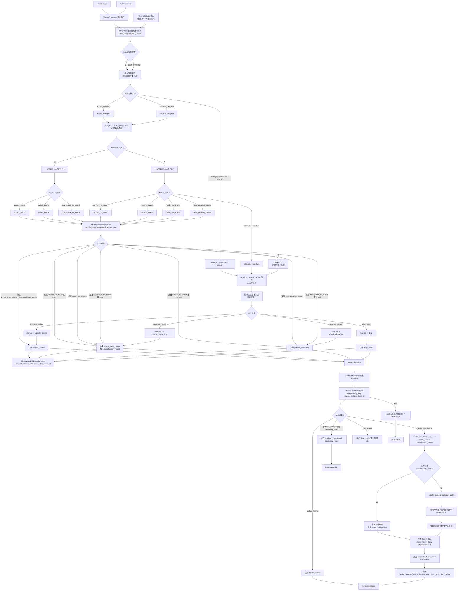

# FEATURE SPEC - P1.phase3

## 0. Meta
- Phase: `P1.phase3`
- 目标: 落地“语义粗筛 -> LLM 最终裁决”必经链路，并完成 10% 灰度、时延/成本门禁、真实调用证据闭环
- 统一约束: `docs/project_control/EXECUTION_GUARDRAILS.md`
- 真源文档:
  - `docs/project_control/PHASE_CONTRACT_P1.phase3.md`
  - `docs/project_control/ACCEPTANCE.md` (Phase P1.phase3)
  - `docs/project_control/prd_p1.md` (`PRD-P1-P3-R01~R10`)
  - `docs/project_control/PLAN_WBS.md` (`P1.phase3-T01~T04`)
  - `docs/project_control/TEST_CASE_SPEC_P1.phase3.md`
  - `docs/architecture/个人投资助理-项目架构设计-第一阶段.md`

## 0.1 冲突裁决说明
- 冲突项: `PRD.md` 对 phase3 仅给出概述，`prd_p1.md` 给出 R01~R10 可执行条款。
- 采用来源: `prd_p1.md` + `ACCEPTANCE.md` + `PHASE_CONTRACT_P1.phase3.md`
- 放弃来源: `PRD.md` 中不具备测试门禁粒度的概述条款
- 裁决理由: 本文档用于任务实施，必须以可测可验条款为准。

## 1. 核心模块设计（Core Modules）

### 1.1 `FinalJudgeOrchestrator`（新增，主编排）
- 职责:
  - 强制两阶段顺序（语义粗筛后才允许 LLM 裁判）
  - 对“分类命中后的每个候选结果”执行 LLM 复核（全量复核）
  - 输出统一裁决对象供 `theme_processor` 写入 decision
- 输入契约:
  - `event_id`, `trace_id`, `candidates`, `source_type`, `classification_context`
- 输出契约:
  - `final_theme_id`, `judge_applied`, `judge_reason`, `judge_source`, `arbiter_latency_ms`, `fallback_reason`
- 错误码:
  - `ARB_TIMEOUT`, `ARB_MODEL_UNAVAILABLE`, `ARB_INPUT_INVALID`, `ARB_BUDGET_EXCEEDED`

### 1.2 `LLMThemeArbiterClient`（新增，模型调用网关）
- 职责:
  - 固定模型栈 `Qwen2.5 + llama.cpp`
  - 统一超时、重试、熔断、预算控制
  - 输出 request-level 审计字段
- 输入:
  - `prompt`, `candidate_set`, `timeout_ms`, `request_meta`
- 输出:
  - `decision`, `confidence`, `request_id`, `model_name`, `timestamp`, `token_usage`
- 约束:
  - `allow_mock=false`（验收链路）
  - `execution_mode=real`
  - `critical_dependencies=redis,mysql,llm`

### 1.3 `ArbiterGovernanceGuard`（新增，治理门禁）
- 职责:
  - 10% 灰度分桶与路由
  - `llm_final_judged_ratio` 统计
  - `arbiter_p95_latency`、`arbiter_cost_per_1k` 门禁与自动降级
  - 动态2/8策略调节：基于质量指标动态控制 `manual_review_rate`
- 输入:
  - 运行指标、预算配置、灰度比例、人工复核容量
- 输出:
  - `gate_pass`, `degrade_action`, `alert_events`, `manual_review_rate`

### 1.4 `FinalJudgeEvidenceCollector`（新增，证据归档）
- 职责:
  - 汇总精度/时延/成本/误判归因报告
  - 生成 `ACC/TC` 可追溯证据清单
- 输入:
  - decision 流、更新流、模型调用日志
- 输出:
  - `phase3_final_judge_report.json/md`
  - `evidence_index`（`request_id/trace_id/decision_id`）

## 2. 任务级功能分解

## Task `P1.phase3-T01` — 定义“分类命中后全量LLM复核”与回退策略

### 1) 目标与边界
- 目标:
  - 固化可机读规则：分类命中后必须进入 LLM 复核（禁止仅歧义触发）
  - 固化回退策略：超时/异常不阻塞主链路
  - 固化必填审计字段
- 非目标:
  - 不实现灰度流量切换
  - 不实现成本门禁自动降级

### 2) 子功能分解
- `F-P1.phase3-T01-01` 全量复核分发器
  - 输入: `classification_result`, `candidate_count`
  - 处理逻辑: 当分类命中时，所有匹配候选均进入 `final_judge`
  - 输出: `need_judge=true`, `judge_trigger_reason=classification_matched_full_review`
  - 失败处理: 缺字段返回 `ARB_INPUT_INVALID`，回退阶段一
  - 可观测证据: `arbiter_trigger_rate`, `judge_trigger_reason_count`, `judge_full_review_ratio`
- `F-P1.phase3-T01-02` 回退策略定义器
  - 输入: `timeout_ms`, `error_type`
  - 处理逻辑: 超时/不可用统一降级到阶段一结果
  - 输出: `fallback_applied`, `fallback_reason`
  - 失败处理: 降级链路异常时写 dead-letter 并 ACK 原消息
  - 可观测证据: `timeout_fallback_count`, `model_unavailable_count`
- `F-P1.phase3-T01-03` 裁判契约字段冻结
  - 输入: decision envelope + arbiter result
  - 处理逻辑: 注入 `judge_source/judge_applied/request_id/model_name`
  - 输出: 合法 `DecisionEnvelope v1`
  - 失败处理: 字段缺失直接拒绝进入执行器
  - 可观测证据: `contract_validation_fail_count`

### 3) 接口与契约
- 输入: `event_id, trace_id, candidate_list, source_type, classification_result`
- 输出: `judge_plan{need_judge=true_if_classification_matched, fallback_policy, required_evidence_fields}`
- 幂等/重试/超时:
  - 幂等键沿用 `event_id+action+payload_hash`
  - 超时默认 800ms 门槛前置监控，实际调用超时独立配置
  - 重试仅限网络瞬断（最多 1 次）

### 4) 数据模型与状态变更
- 不新增数据库表；新增字段进入 decision payload:
  - `judge_applied`, `judge_source`, `fallback_reason`, `arbiter_mode`
- 状态流转:
  - `stage1_match -> judge_pending -> judge_applied|judge_fallback`
- 兼容策略:
  - 旧消息无 `judge_*` 字段时视为 `judge_applied=false`

### 5) 实现步骤（最小可执行序列）
1. 在编排层新增“分类命中 -> 全量复核”的硬规则判定。
2. 新增 `fallback_reason` 枚举与统一回退函数。
3. 扩展 decision payload schema 与校验器。
4. 增加结构化日志与指标上报。

### 6) 测试设计与命令
- 测试用例: `TC-P1-P3-IT-001`, `TC-P1-P3-ET-001`
- 必跑命令:
  - `.venv/bin/python -m pytest -q database_service/tests/streams/test_phase3_behavior_tests.py -k "stage1_then_llm_full_review_then_final_persist"`
  - `.venv/bin/python -m pytest -q database_service/tests/streams/test_phase3_behavior_tests.py -k "arbiter_timeout_fallback_to_stage1_without_blocking"`
- 失败定位入口:
  - `database_service/streams/handlers/theme_processor.py`
  - `theme_service/services/theme_service.py`

### 7) 风险与回滚
- 失败模式: 全量复核导致时延和成本上升
- 缓解策略: 并发池、请求级缓存、预算门禁、熔断与降级
- 回滚触发条件: `arbiter_p95_latency` 或 `arbiter_cost_per_1k` 连续超阈
- 回滚操作: 保留“全量复核”但切换为 shadow-only（不直接采用裁决）

### 8) 验收映射
- `ACC-P1-P3-01`
- `ACC-P1-P3-02`

## Task `P1.phase3-T02` — 裁判 shadow 接入与超时/不可用降级

### 1) 目标与边界
- 目标:
  - 接入真实 LLM 裁判客户端（shadow/final 两模式）
  - 完成超时回退 + model unavailable 降级 + 熔断
- 非目标:
  - 不做灰度扩量决策

### 2) 子功能分解
- `F-P1.phase3-T02-01` Arbiter 客户端接入
  - 输入: prompt + candidate list + trace meta
  - 处理逻辑: 调用 `Qwen2.5 + llama.cpp` 并解析结果
  - 输出: `decision/confidence/request_id/model_name`
  - 失败处理: 模型调用异常转 `model_unavailable`
  - 可观测证据: `arbiter_call_success_rate`, `arbiter_call_error_count`
- `F-P1.phase3-T02-02` 超时回退执行器
  - 输入: 调用超时信号
  - 处理逻辑: 立即回退 stage1，避免阻塞
  - 输出: `judge_applied=false`, `fallback_reason=timeout_fallback`
  - 失败处理: 回退失败进入 dead-letter
  - 可观测证据: `arbiter_timeout_rate`, `fallback_latency_ms`
- `F-P1.phase3-T02-03` 不可用熔断器
  - 输入: 分钟窗口错误率、连续失败次数
  - 处理逻辑: 触发熔断并短路 LLM 调用
  - 输出: `circuit_state=open|half_open|closed`
  - 失败处理: 熔断状态异常时强制 open 并告警
  - 可观测证据: `circuit_open_count`, `model_unavailable_count`

### 3) 接口与契约
- 输入: `arbiter_request{event_context,candidates,timeout_ms}`
- 输出: `arbiter_response{decision,confidence,request_id,model_name,timestamp}`
- 参数约束:
  - `candidates` 至少 1 个（分类命中后的候选集合）
  - `source_type=real` 才允许验收判定
- 超时策略:
  - 单次调用超时上限 `< 800ms` 预算约束下配置

### 4) 数据模型与状态变更
- 决策流新增审计字段:
  - `fallback_reason`, `circuit_state`, `arbiter_mode`
- 不改表结构；审计证据落日志/报告文件

### 5) 实现步骤（最小可执行序列）
1. 实现 `LLMThemeArbiterClient` 并注入服务层。
2. 对分类命中样本打通全量复核（先 shadow 记录）。
3. 按灰度策略切换“是否采用 LLM 裁决落库”。
4. 加入超时回退和熔断状态机。

### 6) 测试设计与命令
- 测试用例: `TC-P1-P3-ET-001`, `TC-P1-P3-ET-002`, `TC-P1-P3-IT-001`
- 必跑命令:
  - `.venv/bin/python -m pytest -q database_service/tests/streams/test_phase3_behavior_tests.py -k "arbiter_timeout_fallback_to_stage1_without_blocking"`
  - `.venv/bin/python -m pytest -q database_service/tests/streams/test_phase3_behavior_tests.py -k "model_unavailable_sets_reason_and_circuit_breaker"`
- 失败定位入口:
  - `theme_service/services/`
  - `database_service/streams/handlers/theme_processor.py`

### 7) 风险与回滚
- 失败模式: 模型波动导致高超时、高失败
- 缓解策略: 熔断、预算上限、失败快速回退
- 回滚触发条件: `arbiter_timeout_rate` 持续超阈
- 回滚操作: 强制 `arbiter_mode=shadow` 或关闭裁判

### 8) 验收映射
- `ACC-P1-P3-02`
- `ACC-P1-P3-03`

## Task `P1.phase3-T03` — 第12章验证体系落地（10%灰度/三方评估/真实证据）

### 1) 目标与边界
- 目标:
  - 灰度 10% 下验证 `llm_final_judged_ratio >= 95%`
  - 输出最终裁决报告（精度/时延/成本/误判归因）
  - 建立真实调用证据链
  - 建立“AI自动 + 人工复核兜底”的动态2/8执行策略（比例可调）
- 非目标:
  - 不做全量流量切换

### 2) 子功能分解
- `F-P1.phase3-T03-01` 灰度分桶与路由
  - 输入: 事件流 + `ab_gray_ratio=0.1`
  - 处理逻辑: 分类命中样本 100% 进入 LLM 复核；10% 采用裁决落库，90% shadow 对比
  - 输出: `ab_bucket`
  - 失败处理: 分桶异常时默认 shadow 并告警
  - 可观测证据: `ab_gray_traffic_ratio`, `bucket_distribution`
- `F-P1.phase3-T03-02` 裁决比例门禁
  - 输入: 分桶样本统计
  - 处理逻辑: 计算 `llm_final_judged_ratio`
  - 输出: `gate_result(pass/fail)`
  - 失败处理: 比例不足触发阻断，不允许扩大流量
  - 可观测证据: `llm_final_judged_ratio`
- `F-P1.phase3-T03-03` 真实调用证据采集器
  - 输入: LLM 调用返回与日志
  - 处理逻辑: 聚合 `request_id/timestamp/model_name/source_type`
  - 输出: `evidence_bundle`
  - 失败处理: 证据缺字段判定 gate fail
  - 可观测证据: `real_call_ratio`, `evidence_integrity_rate`
- `F-P1.phase3-T03-04` 人工复核分流器
  - 输入: `llm_confidence`, `abstain/category_uncertain`, 质量门禁状态
  - 处理逻辑: 中低置信与不确定样本进入 `pending_manual_review`
  - 输出: `review_status=pending_manual`, `llm_suggestion`
  - 失败处理: 分流异常时默认进入人工复核池，避免误自动落库
  - 可观测证据: `manual_review_rate`, `false_positive_rate`, `false_no_match_rate`

### 3) 接口与契约
- 输入: `phase3_eval_config{sample_set,ab_gray_ratio,allow_mock=false}`
- 输出: `phase3_eval_report{ratio,latency,cost,misjudge_root_causes,evidence_summary}`
- 参数约束:
  - `source_type=real` 才计入验收
  - 报告必须包含 `request_id/model_name/timestamp`
  - 报告必须包含 `manual_review_rate`（动态口径，非固定阈值）

### 4) 数据模型与状态变更
- 评估报告落盘:
  - `docs/project_control/reports/phase-P1.phase3.md`
  - `tmp/phase3_final_judge_report.json`
- 状态变更:
  - 仅当 gate pass 允许提升“采用裁决比例”，但复核调用保持全量
  - 不确定样本写入 `pending_manual_review`，等待分析师终审

### 5) 实现步骤（最小可执行序列）
1. 实现灰度分桶器并输出分桶审计字段。
2. 实现裁决比例统计器与门禁判定器。
3. 实现报告聚合器与证据导出。
4. 在 phase3 评审中固化输出模板。

### 6) 测试设计与命令
- 测试用例: `TC-P1-P3-ST-001`, `TC-P1-P3-RT-001`
- 必跑命令:
  - `.venv/bin/python -m pytest -q database_service/tests/streams/test_phase3_behavior_tests.py -k "full_review_ratio_and_gray_gate_and_model_evidence"`
  - `.venv/bin/python -m pytest -q database_service/tests/streams/test_phase3_behavior_tests.py -k "final_judge_report_contains_required_dimensions"`
- 失败定位入口:
  - `database_service/scripts/`
  - `docs/project_control/reports/`

### 9) 人工复核契约（新增）
- 审计字段:
  - `review_status`(`pending_manual/approved/rejected`)
  - `llm_suggestion`(`suggest_create/suggest_cluster/suggest_drop`)
  - `review_reason`
  - `reviewer_id`
  - `trace_id/request_id/model_name/timestamp`
- 决策回写:
  - 分析师审批后写回 `events:decision`，由 `DecisionExecutor` 执行最终动作。

### 7) 风险与回滚
- 失败模式: 证据链不完整导致验收不可证
- 缓解策略: 强制字段完整性校验，缺一即 fail
- 回滚触发条件: `real_call_ratio < 100%` 或报告缺关键字段
- 回滚操作: 保持 shadow，不执行扩量

### 8) 验收映射
- `ACC-P1-P3-01`

## Task `P1.phase3-T04` — 成本/时延/real_call_ratio 门禁配置与评审

### 1) 目标与边界
- 目标:
  - 门禁阈值配置化并纳入发布评审
  - 实现自动降级动作与告警
- 非目标:
  - 不做业务规则重写

### 2) 子功能分解
- `F-P1.phase3-T04-01` 时延门禁器
  - 输入: `arbiter_latency_ms` 时序数据
  - 处理逻辑: 计算 p95 与阈值比较
  - 输出: `latency_gate_pass`
  - 失败处理: 超阈自动降级到 stage1
  - 可观测证据: `arbiter_p95_latency`, `latency_gate_fail_count`
- `F-P1.phase3-T04-02` 成本门禁器
  - 输入: `token_usage`, `cost_per_1k`
  - 处理逻辑: 分钟/小时预算比较
  - 输出: `cost_gate_pass`
  - 失败处理: 超预算触发 `budget_fallback`
  - 可观测证据: `arbiter_cost_per_1k`, `budget_alert_count`
- `F-P1.phase3-T04-03` 真实调用占比门禁器
  - 输入: `source_type` 聚合数据
  - 处理逻辑: 计算 `real_call_ratio`
  - 输出: `real_call_gate_pass`
  - 失败处理: 比例不足阻断任务状态推进
  - 可观测证据: `real_call_ratio`, `gate_block_count`

## 2.5 集成系统逻辑图（Phase3更新）

### 3) 接口与契约
- 输入: `gate_inputs{latency,cost,real_ratio,window}`
- 输出: `gate_decision{pass,violations,degrade_action}`
- 超时/重试:
  - 门禁计算失败可重试 1 次，仍失败则按 fail close

### 4) 数据模型与状态变更
- 配置项:
  - `arbiter_p95_latency_limit_ms=800`
  - `llm_final_judged_ratio_min=0.95`
  - `real_call_ratio_min=1.0`
- 状态变更:
  - `gate_fail` 时禁止同步 `In review/done`

### 5) 实现步骤（最小可执行序列）
1. 门禁配置抽离到统一配置项。
2. 实现门禁判定与自动降级动作。
3. 实现告警与审计日志输出。
4. 将门禁结果接入 phase 评审脚本。

### 6) 测试设计与命令
- 测试用例: `TC-P1-P3-PT-001`, `TC-P1-P3-ET-002`, `TC-P1-P3-RT-001`
- 必跑命令:
  - `.venv/bin/python -m pytest -q database_service/tests/streams/test_phase3_behavior_tests.py -k "arbiter_p95_latency_under_800ms"`
  - `.venv/bin/python -m pytest -q database_service/tests/streams/test_phase3_behavior_tests.py -k "model_unavailable_sets_reason_and_circuit_breaker or final_judge_report_contains_required_dimensions"`
- 失败定位入口:
  - `theme_service/services/`
  - `database_service/scripts/`

### 7) 风险与回滚
- 失败模式: 门禁阈值配置错误导致误阻断/误放行
- 缓解策略: 阈值变更走评审 + 双人复核
- 回滚触发条件: 发布前验证与线上指标不一致
- 回滚操作: 回退至上一个门禁配置版本并重放验证

### 8) 验收映射
- `ACC-P1-P3-02`
- `ACC-P1-P3-03`

## 3. 统一测试规则（phase3）
- `execution_mode=real`
- `allow_mock=false`
- `critical_dependencies=redis,mysql,llm`
- 证据字段必须包含: `trace_id,decision_id,request_id,model_name,timestamp,source_type`
- 动态2/8策略必须产出: `manual_review_rate,false_positive_rate,false_no_match_rate`
- 测试脚本执行必须优先使用绝对路径，避免沙盒/当前目录差异导致误失败。
  - 推荐命令前缀：`cd /Users/admin/Desktop/ai_theme_app && /Users/admin/Desktop/ai_theme_app/.venv/bin/python -m pytest -q /Users/admin/Desktop/ai_theme_app/database_service/tests/streams/test_phase3_behavior_tests.py`

## 4. 实施编排索引（避免冗余）

说明：本节只做执行顺序与引用索引，任务细节以 `## 2. 任务级功能分解` 为唯一真源，不重复描述。

| WBS Task | 详细设计真源 | 推荐执行序 |
| --- | --- | --- |
| `P1.phase3-T01` | `Task P1.phase3-T01`（全量复核规则、契约字段、回退策略） | 1 |
| `P1.phase3-T02` | `Task P1.phase3-T02`（LLM客户端、超时回退、熔断） | 2 |
| `P1.phase3-T03` | `Task P1.phase3-T03`（动态2/8、人审分流、证据报告） | 3 |
| `P1.phase3-T04` | `Task P1.phase3-T04`（门禁配置化、发布前验证） | 4 |

执行顺序建议（串并行）：
- 串行主线：`T01 -> T02 -> T03 -> T04`
- 可并行：`T03` 内报告聚合可在分流契约冻结后并行；`T04` 门禁配置可与报告联调并行。

## 5. 交付清单
- 设计文档: `docs/project_control/FEATURE_SPEC_P1.phase3.md`
- 追踪映射: `tmp/feature_traceability_P1.phase3.json`
- 校验报告: `tmp/feature_validation_report_P1.phase3.json`
