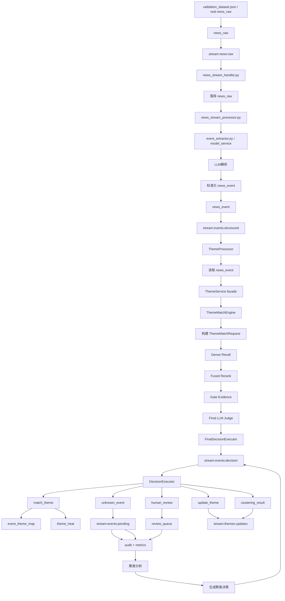
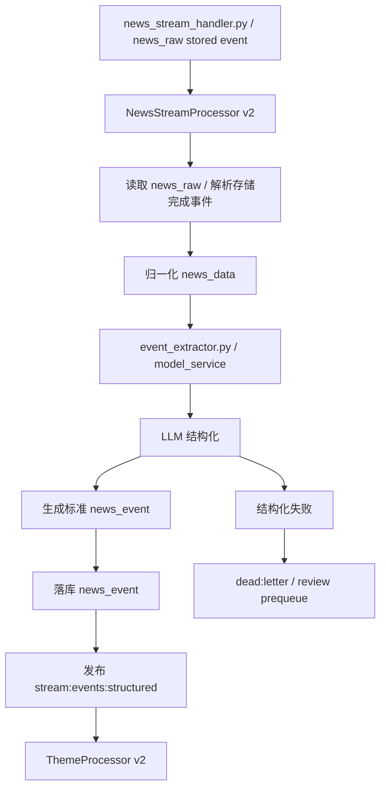
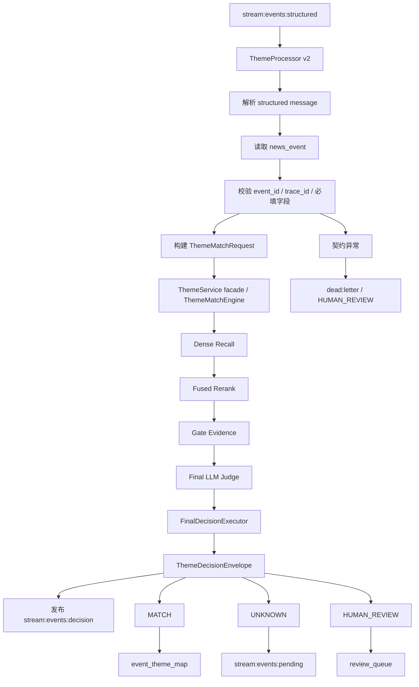
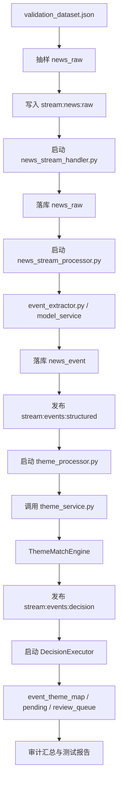

# FEATURE SPEC - P2.phase0

## 0. Meta
- Phase: `P2.phase0`
- 目标: 将 `final_theme_matcher.py` 沉淀为线上唯一题材判定内核，并把生产入口补齐到 `stream:news:raw -> news_stream_handler.py -> news_raw -> news_stream_processor.py -> event_extractor.py -> news_event -> theme_processor.py -> theme_service.py -> ThemeMatchEngine -> 三态决策`，完成单一结构化事件流接入、三态决策冻结、画像字段基线、降级与审计基线、性能灰度门禁。
- 约束: 不进入 `P2.phase1` 的 Unknown 聚类与草案审核；不进入 `P2.phase2` 的知识对象与接口产品化；不进入 `P2.phase3` 的热度与生命周期。
- 冲突裁决说明:
  - 采用 [prd_p2.md](/Users/admin/Desktop/ai_theme_app/docs/project_control/prd_p2.md) 与 [PHASE_CONTRACT_P2.phase0.md](/Users/admin/Desktop/ai_theme_app/docs/project_control/PHASE_CONTRACT_P2.phase0.md) 作为 phase 真源。
  - 采用单一结构化事件流，不再采用旧架构中的 `major / normal` 双流。
  - 兼容层保留现有 Redis Stream 与 `DecisionExecutor`，但最终题材判定只能由 `ThemeMatchEngine` 输出。
- 真源文档:
  - `docs/architecture/个人投资助理-项目架构设计-第二阶段（题材匹配重构版）.md`
  - `docs/project_control/prd_p2.md`
  - `docs/project_control/ACCEPTANCE.md`
  - `docs/project_control/PHASE_CONTRACT_P2.phase0.md`
  - `docs/project_control/PLAN_WBS.md`

## 1. 架构与代码基线

### 1.1 离线高精度裁决锚点
- `final_theme_matcher.py`
  - 向量召回: `retrieve_by_vector`
  - 轻特征融合精排: `rerank_candidates`
  - 题材名直命中保底: `ensure_direct_theme_hits`
  - gate 证据生成: `build_gate_evidence`
  - LLM 排他式裁决: `judge_with_llm`
  - 最终结果收敛: `build_final_decision`

### 1.2 线上主链路锚点
- `news_raw`
- `database_service/streams/handlers/news_stream_handler.py`
- `database_service/streams/handlers/news_stream_processor.py`
- `model_service` / `EventStructuringService`
- `model_service/services/event_extractor.py`
- `extract_structured_events_from_test_cases.py`（测试集结构化输出参考实现）
- `database_service/streams/handlers/theme_processor.py`
- `database_service/streams/handlers/DecisionExecutor.py`
- `theme_service/services/theme_service.py`
- 第二阶段目标新增:
  - `RawNewsStructuringGateway`
  - `ThemeMatchEngine`
  - `ThemeProfileRepository`
  - `ThemeDecisionEnvelope`
  - `ThemeAuditLogRecord`

### 1.3 生产入口补充约束
- `final_theme_matcher.py` 的输入前提是“事件已经结构化”，这是离线评测假设，不是生产入口假设。
- 线上必须显式补齐:
  - `news_raw` 清洗
  - `LLM` 结构化事件抽取
  - 结构化失败回退与人工复核
  - 结构化字段版本化
- `ThemeMatchEngine` 的输入对象必须来自线上 `EventStructuring`，不能依赖离线 JSON 文件直喂。
- `P2.phase0` 验证基线必须包含一条“生产入口回放”路径:
  - 输入集: `evaluate_service/data/raw/validation_dataset.json`
  - 样本规模: `100` 条 `news_raw`
  - 结构化实现: `model_service/services/event_extractor.py`
  - 参考实现: `extract_structured_events_from_test_cases.py`
  - 验证目标: `stream:news:raw -> news_stream_handler.py -> news_raw -> news_stream_processor.py -> structured_event -> theme_processor.py -> theme_service.py -> ThemeMatchEngine -> 三态出口`

### 1.4 phase0 测试基线（新增）
- 测试数据真源:
  - `evaluate_service/data/raw/validation_dataset.json`
- 生产入口模拟方式:
  - 从 `validation_dataset.json` 选取 `100` 条原始新闻，构造 `news_raw`
  - 将 `100` 条 `news_raw` 写入 Redis Stream
  - 必须先由 `news_stream_handler.py` 消费 `stream:news:raw` 并落库到 `news_raw`
  - 再由 `news_stream_processor.py` 基于已入库 `news_raw` 调用 `model_service/services/event_extractor.py` 重新生成结构化 `news_event`
  - 结构化结果必须先落库到 `news_event`，再进入后续匹配/执行链路
  - 结构化字段设计、失败清单、缓存/断点续跑策略可参考 `extract_structured_events_from_test_cases.py`
  - 结构化事件统一写入 `stream:events:structured`
  - 再由 `theme_processor.py` 通过 `theme_service.py` 门面进入 `ThemeMatchEngine -> MATCH / UNKNOWN / HUMAN_REVIEW`
- 验证重点:
  - 不允许跳过 `news_stream_handler.py` 或 `news_stream_processor.py` 直接拿处理后的 JSON 喂匹配器
  - 不允许跳过 `news_event` 落库直接把结构化结果当作纯内存对象透传
  - 不允许让 `theme_processor.py` 直接绕过 `theme_service.py` 调 `ThemeMatchEngine`
  - 必须保留 `raw_news_id -> event_id -> trace_id -> final_decision` 的链路证据
  - `100` 条样本是 phase0 最小回放基线，不是最终全量回归规模

### 1.5 phase0 架构逻辑流程图（新增）



### 1.6 当前 `event_extractor.py` 与新架构冲突点（新增）
- 现状代码仍输出 `theme_discovery_directive.action`，默认语义是 `CLUSTER / CREATE_NEW`。
- `MockEventExtractor` 仍按“重大事件 -> CREATE_NEW，普通事件 -> CLUSTER”模拟旧架构行为。
- 这与当前架构的核心裁决冲突：
  - 结构化阶段只负责生成标准 `news_event`
  - 不负责输出题材发现动作
  - 不允许在结构化阶段预判“是否建新题材”
- 因此 `P2.phase0` 必须将 `event_extractor.py` 重构为纯 `EventStructuring` 组件。
- 重构时可参考 `extract_structured_events_from_test_cases.py` 的这些优点：
  - 结构化字段更完整
  - 失败清单输出明确
  - 支持缓存与断点续跑
  - 明确区分原始文本与结构化结果
- 同时必须兼容现有 `news_event` 表结构，而不是重新发明一套脱离现网的事件存储协议。

### 1.7 `news_event` 落库协议（新增）
- 结构化结果必须落库到现有 `news_event` 表，再进入事件与题材匹配链。
- 当前表结构锚点:
  - 主键: `id`
  - 原始新闻外键: `news_id -> news_raw.id`
  - 基础字段:
    - `event_type varchar(100)`
    - `impact_industries text[]`
    - `direction varchar(50)`
    - `confidence numeric(5,2)`
    - `summary text`
    - `severity_score numeric(5,2)`
    - `source_weight numeric(8,4)`
    - `event_time timestamp`
  - 结构化扩展字段:
    - `entities jsonb`
    - `causal_claim jsonb`
    - `evidence_set jsonb`
    - `raw_event_json jsonb`
  - 兼容字段:
    - `theme_directive jsonb default '{}'`
    - `theme_directive_processed boolean default false`
- 新架构下的字段策略:
  - `theme_directive` 不再承载 `CREATE_NEW / CLUSTER` 旧动作语义。
  - 若表结构短期不改，`theme_directive` 仅作为兼容占位字段，写空对象 `{}` 或仅写版本化兼容信息，禁止写题材发现动作。
  - `raw_event_json` 作为结构化结果的完整快照，必须包含 `structuring_version`、`llm_request_id`、原始抽取结果与标准化结果映射。
  - `news_event.id` 是后续 `event_theme_map.event_id` 的正式上游键，不能绕过。
- 当前索引要求必须保留利用:
  - `idx_news_event_news_id`
  - `idx_news_event_event_time`
  - `idx_news_event_entities`
  - `idx_news_event_evidence_set`
  - `idx_news_event_raw_event_json`

### 1.8 当前 `theme_processor.py` 与新架构冲突点（新增）
- 当前 [theme_processor.py](/Users/admin/Desktop/ai_theme_app/database_service/streams/handlers/theme_processor.py) 仍以 `stream:events:major / stream:events:normal` 双流为核心入口。
- 仍保留 `enable_classification_first`、分类推断缓存、分类内匹配、分类失败回退全量匹配等旧架构主逻辑。
- `_get_action_for_decision_type()` 仍基于 `stream_type=major|normal` 做关键动作分叉：
  - `major -> create_new_theme`
  - `normal -> publish_clustering`
- `_build_decision()` 仍会为 `create_new_theme` 组装完整建题材数据，并调用 `theme_service.create_new_theme_by_rules()`。
- 这与当前新架构冲突：
  - `theme_processor.py` 不应再负责“分类优先 + 事件等级驱动建题材”
  - `theme_processor.py` 应退化为“结构化事件 -> 读取 news_event -> 调用 ThemeMatchEngine -> 发布统一决策”
  - 新题材创建必须后移到 `UNKNOWN -> phase1 聚类/草案/审核`

### 1.9 当前 `news_stream_processor.py` 与新架构冲突点（新增）
- 当前 [news_stream_processor.py](/Users/admin/Desktop/ai_theme_app/database_service/streams/handlers/news_stream_processor.py) 的定位仍是“监听 `news.stored / news.updated` 后触发 AI 分析”的旧业务处理器，而不是新架构下的 `news_raw -> EventStructuring -> news_event -> stream:events:structured` 前置网关。
- `theme_processor.py` 当前代码中并没有直接调用 `news_stream_processor.py`；两者关系是流式串联，不是函数调用关系：
  - `news_stream_processor.py` 负责消费 `news_raw` 或新闻存储完成事件
  - `theme_processor.py` 负责消费后续结构化事件流
- 当前代码引用盘点结果：
  - 未发现主运行链直接导入或实例化 `NewsStreamProcessor`
  - [start_stream_consumers.py](/Users/admin/Desktop/ai_theme_app/database_service/scripts/start_stream_consumers.py) 当前只启动 `NewsStreamConsumer / EventStreamConsumer / ThemeStreamConsumer`，没有接入 `NewsStreamProcessor`
  - [news_consumer.py](/Users/admin/Desktop/ai_theme_app/database_service/streams/consumers/news_consumer.py) 仍是 `TODO` 占位，没有把 `stream:news:raw` 转接到 `NewsStreamProcessor`
  - 当前能确认的直接调用点主要来自历史/测试脚本：
    - [day3_workflow_integration_test.py](/Users/admin/Desktop/ai_theme_app/database_service/scripts/day3_workflow_integration_test.py#L1230C1)
    - [day4_real_news_processor_integration_test_0123.py](/Users/admin/Desktop/ai_theme_app/database_service/scripts/day4_real_news_processor_integration_test_0123.py#L1098C1)
    - [day4_real_news_processor_integration_test.py](/Users/admin/Desktop/ai_theme_app/database_service/scripts/day4_real_news_processor_integration_test.py#L1457C1)
    - [day4_real_news_processor_integration_test.py](/Users/admin/Desktop/ai_theme_app/database_service/scripts/day4_real_news_processor_integration_test.py#L1687C1)
  - 这些脚本中的调用方式以“手工实例化 `NewsStreamProcessor`”或“直接调用 `process_stream_message()`”为主，不代表生产主链已接通
- 当前 `news_stream_processor.py` 的关键冲突包括：
  - 仍返回和透传 `theme_discovery_directive`
  - `MockAIService` 默认输出 `CLUSTER`
  - `process_stream_message()` 返回结果里仍携带 `theme_discovery_directive`
  - `_process_news_stored_event()` 仍把 `event_info + theme_discovery_directive + original_news` 视为核心产物
  - 没有把“结构化结果必须先落 `news_event`，再发布 `stream:events:structured`”作为固定职责
- 因此在新架构中：
  - `news_stream_processor.py` 不应再承载“题材发现动作建议”
  - 它应重构为 `NewsStructuringOrchestrator`
  - 只负责 `news_raw` 提取、调用 `event_extractor.py / model_service`、落 `news_event`、发布 `stream:events:structured`
  - 不负责题材匹配，不负责新题材创建判断，不负责 `major / normal` 分流
- 生产接入建议：
  - 推荐将 [news_consumer.py](/Users/admin/Desktop/ai_theme_app/database_service/streams/consumers/news_consumer.py) 作为 `stream:news:raw` 的轻量消费壳
  - 在 `news_consumer.py` 内组合或委托 `NewsStreamProcessor`
  - 由 `NewsStreamProcessor` 执行：
    - `process_stream_message()`
    - `event_extractor.py / model_service`
    - `news_event` 落库
    - `stream:events:structured` 发布
  - 这样可以尽量保持现有 `ConsumerManager / start_stream_consumers.py` 主骨架不变，只替换 `news_consumer` 的内部处理逻辑

### 1.9a 当前 `news_stream_handler.py` 与新架构链路位置（新增）
- [news_stream_handler.py](/Users/admin/Desktop/ai_theme_app/database_service/streams/handlers/news_stream_handler.py) 的职责是“从 `stream:news:raw` 消费原始消息并写入数据库”，它对应的是前置**入库层**，不是结构化层。
- 从代码看，它会：
  - 消费 `stream:news:raw`
  - 提取原始 payload
  - 校验新闻字段
  - 调 `database_gateway.create_news()` 落库到 `news_raw`
- 这意味着更准确的新架构前半段应当是：
  - `validation_dataset.json -> stream:news:raw -> news_stream_handler.py -> news_raw表 -> news_stream_processor.py -> news_event表 -> theme_processor.py`
- 当前文档里若把 `stream:news:raw` 直接交给 `news_stream_processor.py`，会丢掉现有系统里“原始新闻先入库”的这一层真实职责边界。
- 因此 phase0 的生产级测试框架必须显式区分：
  - `news_stream_handler.py`：原始新闻入库层
  - `news_stream_processor.py`：入库后结构化处理层
  - `theme_processor.py`：结构化事件匹配层

### 1.10 当前 `test_new_architecture_with_dataset` 与新架构冲突点（新增）
- 当前 [test_theme_processor.py](/Users/admin/Desktop/ai_theme_app/database_service/scripts/test_theme_processor.py#L2826C1) 中的 `test_new_architecture_with_dataset()` 并没有调用 [news_stream_processor.py](/Users/admin/Desktop/ai_theme_app/database_service/streams/handlers/news_stream_processor.py)。
- 它的实际路径是：
  - 加载数据集事件
  - 按 `event_type=major|normal` 选择流
  - 直接发布到 `stream:events:major / stream:events:normal`
  - 启动旧版 `ThemeProcessor + DecisionExecutor`
- 因此它验证的是“旧双流题材处理链”，不是新架构要求的生产级全链路。
- 它缺少的新架构关键环节包括：
  - `stream:news:raw`
  - `news_stream_processor.py`
  - `event_extractor.py / model_service`
  - `news_event` 落库
  - `stream:events:structured`
  - 新版 `theme_processor.py`
- 结论：
  - `test_new_architecture_with_dataset()` 可保留为历史对照或旧架构回归样例
  - 但 `P2.phase0` 必须新增一套独立的“生产级全链路测试脚本”，完整覆盖 `news_raw -> news_stream_handler.py -> news_raw表 -> news_stream_processor.py -> event_extractor.py -> news_event -> stream:events:structured -> theme_processor.py -> theme_service.py -> ThemeMatchEngine -> stream:events:decision`
  - 新测试框架必须先由 `news_stream_handler.py` 完成 `news_raw` 入库，再由 `news_stream_processor.py` 生成结构化 `news_event`，最后才允许 `theme_processor.py` 消费结构化事件，这是 phase0 全链路打通的硬约束

### 1.11 当前 `theme_service.py` 与新架构冲突点（新增）
- 当前 [theme_service.py](/Users/admin/Desktop/ai_theme_app/theme_service/services/theme_service.py) 仍是旧的题材发现服务门面，核心接口仍围绕：
  - `discover_theme()`
  - `discover_category_only()`
  - `discover_with_themes()`
  - `create_new_theme_by_rules()`
- 当前 [theme_processor.py](/Users/admin/Desktop/ai_theme_app/database_service/streams/handlers/theme_processor.py) 在初始化阶段通过 `get_theme_service()` 获取服务实例，并显式依赖上述旧接口作为主路径：
  - `get_theme_service()` 在 [theme_processor.py](/Users/admin/Desktop/ai_theme_app/database_service/streams/handlers/theme_processor.py#L201C1)
  - `discover_category_only()` 在 [theme_processor.py](/Users/admin/Desktop/ai_theme_app/database_service/streams/handlers/theme_processor.py#L516C1)
  - `discover_with_themes()` 在 [theme_processor.py](/Users/admin/Desktop/ai_theme_app/database_service/streams/handlers/theme_processor.py#L552C1) 和 [theme_processor.py](/Users/admin/Desktop/ai_theme_app/database_service/streams/handlers/theme_processor.py#L671C1)
  - `create_new_theme_by_rules()` 在 [theme_processor.py](/Users/admin/Desktop/ai_theme_app/database_service/streams/handlers/theme_processor.py#L906C1)
- 当前代码中没有现成的新服务门面接口，例如：
  - `match_event()`
  - `match_event_from_news_event()`
  - `build_theme_match_request()`
  - `to_decision_envelope()`
- 这意味着如果不重构 [theme_service.py](/Users/admin/Desktop/ai_theme_app/theme_service/services/theme_service.py)，`theme_processor.py` 即使改成单流，也仍然没有一个正式的服务层入口去调用 `ThemeMatchEngine`。
- 结论：
  - phase0 必须新增 `theme_service.py` 服务封装改造任务
  - 新架构模块边界应冻结为：`ThemeProcessor -> ThemeService facade -> ThemeMatchEngine`
  - 不应把 `ThemeMatchEngine` 的调用细节直接散落回 `theme_processor.py`

---

## Task P2.phase0-T02H — 接入 `news_stream_handler.py` 到生产级测试框架并冻结前置入库层

### 1) 目标与边界
- 目标:
  - 将 [news_stream_handler.py](/Users/admin/Desktop/ai_theme_app/database_service/streams/handlers/news_stream_handler.py) 纳入 `P2.phase0` 生产级测试框架
  - 冻结前置链路：`stream:news:raw -> news_stream_handler.py -> news_raw`
  - 为后续 `news_stream_processor.py` 提供真实的 `news_raw` 上游输入
- 非目标:
  - 不在 `news_stream_handler.py` 内做结构化事件提取
  - 不在 `news_stream_handler.py` 内做题材匹配

### 2) 接口与契约
- 输入:
  - `stream:news:raw`
- 输出:
  - `news_raw.id`
- 最小职责:
  - 消费原始新闻消息
  - 解析 payload
  - 校验原始新闻字段
  - 调用 `database_gateway.create_news()` 落库
- 禁止职责:
  - 调用 `ThemeMatchEngine`
  - 直接写 `news_event`
  - 直接发布 `stream:events:structured`

### 3) 数据模型与状态变更
- 新测试链前半段:
  - `validation_dataset.json -> stream:news:raw -> NewsStreamHandler -> news_raw`
- 上下游边界:
  - `NewsStreamHandler` 结束于 `news_raw`
  - `NewsStreamProcessor` 起始于 `news_raw`

### 4) 子功能分解
- `F-P2.phase0-T02H-01` 原始消息入库编排器
  - 输入: `stream:news:raw`
  - 处理逻辑: 调用 `NewsStreamHandler` 消费并落库原始新闻
  - 输出: `news_raw.id`
  - 失败处理: 入库失败则阻断全链路测试
  - 可观测证据: `news_raw` 入库成功率
- `F-P2.phase0-T02H-02` payload 格式兼容守卫
  - 输入: v1/v2/raw payload
  - 处理逻辑: 验证 `NewsStreamHandler` 的多格式提取能力
  - 输出: 标准原始新闻对象
  - 失败处理: 无法解析则进入 dead-letter 或失败清单
  - 可观测证据: payload 识别率、失败样本数
- `F-P2.phase0-T02H-03` 前后处理器分层守卫
  - 输入: `news_stream_handler.py`、`news_stream_processor.py`
  - 处理逻辑: 冻结“前者只入库、后者只结构化”的边界
  - 输出: 分层约束
  - 失败处理: 跨层职责即判定契约违规
  - 可观测证据: 结构扫描报告

### 5) 详细改造清单
1. 在生产级测试框架中显式启动 `NewsStreamHandler`。
2. 测试数据先写 `stream:news:raw`，不得直接插表绕过 handler。
3. 先验证 `news_raw` 入库，再启动/等待 `NewsStreamProcessor`。
4. 补 `news_stream_handler.py -> news_raw -> news_stream_processor.py` 的证据绑定。
5. 对 handler 的 payload 解析路径增加结构扫描与样本校验。

### 6) 验收映射
- `ACPT-P2.phase0-005`
- `ACPT-P2.phase0-008`
- `ACPT-P2.phase0-009`

---

## Task P2.phase0-T02S — 重构 `theme_service.py` 为 `ThemeMatchEngine` 服务封装层

### 1) 目标与边界
- 目标:
  - 将 [theme_service.py](/Users/admin/Desktop/ai_theme_app/theme_service/services/theme_service.py) 从旧 `ThemeDiscoveryEngine` 门面升级为新架构下的 `ThemeMatchEngine` 服务封装层
  - 为 [theme_processor.py](/Users/admin/Desktop/ai_theme_app/database_service/streams/handlers/theme_processor.py) 提供稳定服务入口
  - 冻结模块边界：`ThemeProcessor -> ThemeService facade -> ThemeMatchEngine`
- 非目标:
  - 不在本任务内恢复旧 `discover_* / create_new_theme_by_rules` 作为主路径
  - 不在服务层直接写 `event_theme_map`

### 2) 接口与契约
- 输入:
  - `news_event`
  - `news_raw` 补充字段
  - `ThemeMatchRequest`
- 输出:
  - `ThemeDecisionEnvelope`
- 最小职责:
  - 提供 `ThemeMatchEngine` 初始化与单例管理
  - 提供 `ThemeMatchRequest` 构建辅助
  - 提供统一的 `match_event()` 或等价异步服务接口
  - 将内核结果统一转换为 `ThemeDecisionEnvelope`
- 禁止职责:
  - 不再将 `discover_theme / discover_with_themes / discover_category_only / create_new_theme_by_rules` 作为线上主入口
  - 不在服务层做执行层持久化

### 3) 数据模型与状态变更
- 旧调用链:
  - `ThemeProcessor -> get_theme_service() -> discover_category_only/discover_with_themes/discover_theme/create_new_theme_by_rules`
- 新调用链:
  - `ThemeProcessor -> get_theme_service() -> build_theme_match_request() -> match_event() -> ThemeDecisionEnvelope`
- 核心服务对象:
  - `ThemeService`
  - `ThemeMatchEngine`
  - `ThemeMatchRequest`
  - `ThemeDecisionEnvelope`

### 4) 子功能分解
- `F-P2.phase0-T02S-01` 服务门面适配器
  - 输入: `theme_service.py`
  - 处理逻辑: 新增 `ThemeMatchEngine` 持有与异步调用入口
  - 输出: 可供 `ThemeProcessor` 调用的统一服务方法
  - 失败处理: 无新门面时阻断 `theme_processor.py` 重构交付
  - 可观测证据: 新服务接口定义与调用图
- `F-P2.phase0-T02S-02` 请求构建辅助器
  - 输入: `news_event`, `news_raw`
  - 处理逻辑: 在服务层统一构建 `ThemeMatchRequest`
  - 输出: 标准请求对象
  - 失败处理: 字段缺失则返回受控错误或 `HUMAN_REVIEW`
  - 可观测证据: 请求对象字段校验
- `F-P2.phase0-T02S-03` 决策封装器
  - 输入: 内核匹配结果
  - 处理逻辑: 统一转换为 `ThemeDecisionEnvelope`
  - 输出: 固定三态决策对象
  - 失败处理: 转换失败则进入受控降级
  - 可观测证据: envelope schema 校验
- `F-P2.phase0-T02S-04` 旧接口退役守卫
  - 输入: `theme_service.py`, `theme_processor.py`
  - 处理逻辑: 将旧 `discover_* / create_new_theme_by_rules` 从线上主路径移除
  - 输出: 新旧接口边界说明
  - 失败处理: 仍有主路径依赖时判定架构未收敛
  - 可观测证据: 代码扫描报告

### 5) 详细改造清单
1. 在 [theme_service.py](/Users/admin/Desktop/ai_theme_app/theme_service/services/theme_service.py) 内新增 `ThemeMatchEngine` 持有与初始化逻辑。
2. 保留 `get_theme_service()` 单例门面，但将其主能力切换到新匹配服务封装。
3. 新增统一服务方法，例如 `match_event()` 或等价异步接口，供 `ThemeProcessor` 调用。
4. 新增 `ThemeMatchRequest` 构建辅助，避免 `ThemeProcessor` 自己拼装复杂请求。
5. 新增 `ThemeDecisionEnvelope` 封装辅助，避免 `ThemeProcessor` 自己解释内核原始结果。
6. 清理 `theme_processor.py` 对 `discover_category_only / discover_with_themes / discover_theme / create_new_theme_by_rules` 的主路径依赖。
7. 保留旧接口仅用于兼容或过渡，不得作为 `P2.phase0` 线上主调用路径。
8. 为新服务门面补充单元测试和集成测试入口。

### 6) 验收映射
- `ACPT-P2.phase0-001`
- `ACPT-P2.phase0-002`
- `ACPT-P2.phase0-005`
- `ACPT-P2.phase0-009`

---

## Task P2.phase0-T01 — 冻结 `ThemeMatchEngine` 运行时契约与三态决策 envelope

### 1) 目标与边界
- 目标:
  - 冻结 `ThemeMatchRequest`、`ThemeDecisionEnvelope`、`ThemeAuditLogRecord`
  - 冻结三态决策: `MATCH / UNKNOWN / HUMAN_REVIEW`
  - 保证消费者只读取固定字段语义
- 非目标:
  - 不实现 Unknown 聚类与新题材草案
  - 不定义详情页和榜单接口

### 2) 接口与契约
- 输入:
  - `raw_news_id`, `event_id`, `trace_id`, `title`, `summary`, `entities`, `claims`, `tech_terms`, `impact_industries`
- 输出:
  - `decision`, `best_theme_id`, `confidence`, `reason`, `reason_code`, `evidence_summary`, `latency_ms`
- 参数约束:
  - `decision ∈ {MATCH, UNKNOWN, HUMAN_REVIEW}`
  - `MATCH` 必须带 `best_theme_id`
  - `UNKNOWN/HUMAN_REVIEW` 不得伪造 `best_theme_id`
- 错误码:
  - `invalid_request`
  - `candidate_exhausted`
  - `dependency_timeout`
  - `contract_violation`
- 幂等/重试/超时:
  - 幂等键: `raw_news_id + event_id + trace_id + engine_version`
  - 超时后仅允许返回 `HUMAN_REVIEW`
- 落库约束:
  - `ThemeMatchRequest.event_id` 必须来源于 `news_event.id`
  - 若 `news_event` 落库失败，不得进入 `ThemeMatchEngine`

### 3) 数据模型与状态变更
- 关键对象:
  - `ThemeMatchRequest`
  - `ThemeDecisionEnvelope`
  - `ThemeAuditLogRecord`
- 状态规则:
  - `news_raw` 先经 `EventStructuring` 生成标准 `news_event`
  - 标准 `news_event` 必须先写入 `news_event` 表并获得 `id`
  - 结构化事件进入 `ThemeMatchEngine`
  - 统一产出三态 envelope
  - 下游不得再扩展第四种隐式状态
- 兼容策略:
  - 旧消费者通过兼容层读取相同 `decision` 语义

### 4) 子功能分解
- `F-P2.phase0-T01-01` 请求契约冻结
  - 输入: `news_raw` 经 `LLM` 抽取后的结构化 `news_event`
  - 处理逻辑: 归一化事件文本、实体、行业、术语并组装请求，同时保留 `raw_news_id` 与 `news_event.id`
  - 输出: `ThemeMatchRequest`
  - 失败处理: 缺必填字段或结构化版本不匹配时返回 `invalid_request`
  - 可观测证据: 请求 schema 版本、结构化版本、字段缺失计数、`news_event.id`
- `F-P2.phase0-T01-02` 三态 envelope 归一化
  - 输入: 召回、精排、judge 结果
  - 处理逻辑: 收敛为 `MATCH / UNKNOWN / HUMAN_REVIEW`
  - 输出: `ThemeDecisionEnvelope`
  - 失败处理: 不允许输出未定义状态
  - 可观测证据: `decision`, `reason_code`, `confidence`
- `F-P2.phase0-T01-03` 最小审计对象冻结
  - 输入: 请求、决策、耗时、模型版本
  - 处理逻辑: 写标准审计结构
  - 输出: `ThemeAuditLogRecord`
  - 失败处理: 审计写失败则阻断最终写入
  - 可观测证据: `trace_id`, `model_version`, `prompt_version`, `latency_ms`

### 5) 实现步骤
- Step-1: 从 `final_theme_matcher.py` 提取请求、候选、裁决、审计四类字段。
- Step-2: 增补 `RawNewsStructuringGateway -> ThemeMatchRequest` 的输入契约。
- Step-2a: 明确 `news_event.id` 作为匹配链路正式 `event_id` 的约束。
- Step-3: 定义 `ThemeDecisionEnvelope` 固定字段与决策枚举。
- Step-4: 在 `theme_service -> DecisionExecutor` 之间插入兼容层 DTO。
- Step-5: 建立契约校验器，拒绝未定义状态或缺字段写入。
- Step-6: 基于 `validation_dataset.json` 设计 `100` 条 `news_raw` 回放样本。

### 6) 测试设计与命令
- 对应测试用例:
  - `TC-P2.phase0-00-raw-dataset-replay`
  - `TC-P2.phase0-00e-news-event-persisted-before-match`
  - `TC-P2.phase0-01-contract-shape`
  - `TC-P2.phase0-02-three-state-guard`
  - `TC-P2.phase0-03-audit-required`
- 必跑命令:
  - `rg -n "news_raw|model_service|EventStructuring|ThemeMatchEngine|ThemeDecisionEnvelope|ThemeAuditLogRecord|MATCH|UNKNOWN|HUMAN_REVIEW" .`
  - `.venv/bin/python -m pytest -q`
- 失败定位入口:
  - `theme_service/services/theme_service.py`
  - `database_service/streams/handlers/DecisionExecutor.py`

### 7) 风险与回滚
- 失败模式:
  - 同一事件出现多版本 envelope
  - 审计字段缺失但仍写最终题材
- 缓解策略:
  - 契约校验器 fail-fast
  - 审计写入与最终写入强绑定
- 回滚:
  - 触发条件: 出现旁路判定或字段漂移
  - 操作: 回切旧兼容入口，但保留统一审计结构

### 8) 验收映射
- `ACPT-P2.phase0-001`
- `ACPT-P2.phase0-002`
- `ACPT-P2.phase0-006`

---

## Task P2.phase0-T02 — 设计单一结构化事件流兼容层并完成 `theme_service -> DecisionExecutor` 接入基线

### 1) 目标与边界
- 目标:
  - 将 `news_raw` 经 `LLM` 结构化后统一写入 `stream:events:structured`
  - 将结构化事件统一写入 `stream:events:structured`
  - 完成 `ThemeMatchEngine -> DecisionExecutor` 单链路接入
  - 取消 `major / normal` 前置分流
  - 建立基于 `validation_dataset.json` 的 `100` 条原始新闻回放测试基线
  - 重构 `event_extractor.py`，移除旧架构中的 `CLUSTER / CREATE_NEW` 动作语义
- 非目标:
  - 不修改 Redis Stream 主架构
  - 不改造全部下游消费者
  - 不在结构化阶段做题材判定

### 2) 接口与契约
- 输入:
  - `news_raw`
  - `stream:events:structured` 标准事件消息
- 输出:
  - `MATCH` 写题材映射
  - `UNKNOWN` 写 `unknown_event_pool`
  - `HUMAN_REVIEW` 写 `review_queue`
- 结构化中间输出:
  - `news_event(title, summary, entities, claims, tech_terms, impact_industries, structuring_version)`
- 禁止输出:
  - `theme_discovery_directive.action`
  - `CREATE_NEW`
  - `CLUSTER`
- 幂等/重试/超时:
  - 原始新闻重复处理时按 `raw_news_id + trace_id` 去重
  - 结构化超时或解析失败仅允许落 `HUMAN_REVIEW`
  - 兼容层超时仅允许落 `HUMAN_REVIEW`

### 3) 数据模型与状态变更
- 流对象:
  - `news_raw`
  - `stream:events:structured`
  - `stream:events:unknown`
  - `stream:events:human_review`
- 状态流转:
  - `stream:news:raw -> news_stream_handler.py -> news_raw -> news_stream_processor.py -> EventStructuring(LLM) -> news_event -> theme_processor.py -> theme_service.py -> ThemeMatchEngine -> 三态出口`
- 兼容策略:
  - 保留 `DecisionExecutor` 消费协议
  - 移除以 `major / normal` 选择建题材路径的逻辑
  - `event_extractor.py` 仅输出结构化事件，不再输出题材动作 directive

### 4) 子功能分解
- `F-P2.phase0-T02-01` 原始新闻结构化网关
  - 输入: `stream:news:raw`、已入库 `news_raw`
  - 处理逻辑: 先由 `news_stream_handler.py` 完成 `news_raw` 入库，再由 `news_stream_processor.py` 调用 `LLM`/`model_service` 抽取标题、摘要、实体、claims、术语和影响行业
  - 输出: 标准 `news_event`
  - 失败处理: 结构化超时、解析失败或字段不完整时进入 `HUMAN_REVIEW`
  - 可观测证据: `raw_news_id`, `structuring_version`, `llm_request_id`, 结构化成功率
- `F-P2.phase0-T02-01b` `event_extractor.py` 旧语义清除器
  - 输入: 现有 `AIEventExtractor` 输出结构
  - 处理逻辑: 删除 `theme_discovery_directive`、`CREATE_NEW`、`CLUSTER` 等旧动作语义
  - 输出: 纯 `news_event` 结构
  - 失败处理: 若仍检测到旧动作字段，直接判定为契约违规
  - 可观测证据: 契约扫描结果、旧字段残留计数
- `F-P2.phase0-T02-01c` `event_extractor.py` 新结构重建器
  - 输入: `news_raw`, `LLM parser`
  - 处理逻辑: 参考 `extract_structured_events_from_test_cases.py` 的字段设计，重建为新架构要求的字段集合，补 `event_id`, `trace_id`, `structuring_version`
  - 输出: 可直接写入 `stream:events:structured` 的 `news_event`
  - 失败处理: 关键字段缺失时进入 `HUMAN_REVIEW`
  - 可观测证据: 新结构字段完整率
- `F-P2.phase0-T02-01e` `news_event` 落库映射器
  - 输入: 标准化结构化事件
  - 处理逻辑: 映射到 `news_event` 表字段，并写入 `raw_event_json`
  - 输出: 已落库的 `news_event.id`
  - 失败处理: 落库失败时不得入 `stream:events:structured`
  - 可观测证据: `news_event` 落库成功率、字段映射完整率
- `F-P2.phase0-T02-01d` 结构化测试参考对齐器
  - 输入: `event_extractor.py` 输出与 `extract_structured_events_from_test_cases.py` 输出样式
  - 处理逻辑: 对齐结构化字段命名、失败清单、缓存/断点续跑策略
  - 输出: 测试入口与生产入口共享的结构化基线
  - 失败处理: 字段偏差超出允许范围时阻断 phase0 测试定稿
  - 可观测证据: 字段对齐报告、失败样本清单
- `F-P2.phase0-T02-01a` 数据集回放注入器
  - 输入: `evaluate_service/data/raw/validation_dataset.json`
  - 处理逻辑: 抽取 `100` 条样本并模拟为 `news_raw` 写入 Redis Stream
  - 输出: `100` 条可追踪 `news_raw` 消息
  - 失败处理: 样本不足或写流失败时阻断 phase0 验证
  - 可观测证据: 样本数、入流成功率、`raw_news_id` 清单
- `F-P2.phase0-T02-02` 结构化事件单流入口
  - 输入: 标准 `news_event`
  - 处理逻辑: 统一写入 `stream:events:structured`
  - 输出: 单流事件消息
  - 失败处理: 写失败进入 dead-letter
  - 可观测证据: 流名、消息数、重试数
- `F-P2.phase0-T02-03` 三态出口分叉器
  - 输入: `ThemeDecisionEnvelope`
  - 处理逻辑: 按 `MATCH / UNKNOWN / HUMAN_REVIEW` 分叉
  - 输出: 下游执行消息
  - 失败处理: 未识别状态直接拒绝
  - 可观测证据: 各决策出口计数
- `F-P2.phase0-T02-04` 兼容层映射器
  - 输入: 新 envelope
  - 处理逻辑: 映射到 `DecisionExecutor` 可消费结构
  - 输出: 兼容后的执行 payload
  - 失败处理: 映射异常降级 `HUMAN_REVIEW`
  - 可观测证据: 兼容字段映射日志

### 4.1 详细任务分解过程（新增）
1. 盘点 `event_extractor.py` 当前输出字段，识别所有旧架构语义。
2. 冻结新架构下 `news_event` 最小字段集，只保留结构化职责。
3. 移除 `theme_discovery_directive` 与 `CREATE_NEW/CLUSTER` 相关逻辑。
4. 参考 `extract_structured_events_from_test_cases.py` 对齐结构化字段、失败清单和缓存策略。
5. 补齐 `raw_news_id/event_id/trace_id/structuring_version/llm_request_id`。
6. 将结构化字段映射到现有 `news_event` 表，并冻结 `theme_directive` 兼容写法。
7. 设计 `stream:news:raw -> news_stream_handler.py -> news_raw -> news_stream_processor.py -> event_extractor.py -> news_event -> stream:events:structured` 的单流写入协议。
8. 用 `validation_dataset.json` 抽取 `100` 条样本，模拟 `news_raw` 入 Redis Stream。
9. 验证 `100` 条样本的结构化成功率、落库成功率、字段完整率和旧字段残留率。
10. 验证 `theme_processor.py` 通过 `theme_service.py` 门面进入 `ThemeMatchEngine` 后的三态输出与审计链。

### 5) 实现步骤
- Step-1: 明确 `stream:news:raw -> news_stream_handler.py -> news_raw -> news_stream_processor.py -> EventStructuring -> structured_event` 的字段和版本契约。
- Step-2: 明确 `event_extractor.py` 中旧动作字段和旧双流语义的清理清单。
- Step-3: 参考 `extract_structured_events_from_test_cases.py` 对齐结构化字段、失败清单、缓存与断点续跑策略。
- Step-4: 重构 `event_extractor.py` 为纯 `EventStructuring` 组件。
- Step-5: 设计 `news_event` 字段映射与落库协议，明确 `theme_directive` 兼容占位策略。
- Step-6: 设计 `validation_dataset.json -> 100条news_raw -> Redis Stream` 回放注入器。
- Step-7: 增加单一结构化事件流消息协议。
- Step-8: 在 `theme_service` 中仅保留一个最终判定入口，并要求 `theme_processor.py` 通过该门面调用 `ThemeMatchEngine`。
- Step-9: 验证 `event_extractor.py` 对 100 条 `news_raw` 的结构化输出质量、落库成功率、字段完整率和旧字段残留率。
- Step-10: 验证 `DecisionExecutor` 对三态 envelope 的兼容消费。

### 6) 测试设计与命令
- 对应测试用例:
  - `TC-P2.phase0-00-raw-to-structured`
  - `TC-P2.phase0-00a-validation-dataset-100-news-raw`
  - `TC-P2.phase0-00b-event-extractor-no-directive`
  - `TC-P2.phase0-00c-event-extractor-new-schema`
  - `TC-P2.phase0-00d-structuring-reference-alignment`
  - `TC-P2.phase0-00f-news-event-field-mapping`
  - `TC-P2.phase0-00g-news-event-id-before-theme-match`
  - `TC-P2.phase0-04-single-stream-entry`
  - `TC-P2.phase0-05-decision-routing`
  - `TC-P2.phase0-06-no-major-normal-branch`
- 必跑命令:
  - `rg -n "theme_discovery_directive|CREATE_NEW|CLUSTER|news_raw|news_event|model_service|EventStructuring|stream:events:structured|stream:events:human_review|stream:events:unknown|events:major|events:normal" .`
  - `.venv/bin/python -m pytest -q`
- 失败定位入口:
  - `database_service/streams/handlers/theme_processor.py`
  - `database_service/streams/handlers/DecisionExecutor.py`

### 7) 风险与回滚
- 失败模式:
  - `news_raw` 结构化失败导致无法进入匹配链
  - `validation_dataset.json` 回放样本不能稳定覆盖生产入口
  - `event_extractor.py` 仍保留旧动作字段，导致结构化阶段污染匹配阶段
  - `event_extractor.py` 与 `extract_structured_events_from_test_cases.py` 的字段基线偏差过大，导致测试入口和生产入口脱节
  - `news_event` 落库失败或字段映射错误，导致 `event_theme_map` 上游键断裂
  - 旧双流仍被调用
  - 单流入口导致消费积压
- 缓解策略:
  - 结构化失败进入 `HUMAN_REVIEW`，保留 `raw_news_id` 和请求证据
  - 固定 `100` 条样本的回放清单和 trace 对账结果
  - 对 `theme_discovery_directive|CREATE_NEW|CLUSTER` 做结构扫描门禁
  - 产出结构化字段对齐报告，保证测试参考实现和生产实现字段语义一致
  - 对 `news_event.id -> event_theme_map.event_id` 做链路完整性校验
  - 结构扫描阻断旧流名
  - 分流后指标监控与回退阈值
- 回滚:
  - 触发条件: 单流接入造成主链路异常积压
  - 操作: 回切到接入前消息适配层，但不恢复双流语义

### 8) 验收映射
- `ACPT-P2.phase0-005`
- `ACPT-P2.phase0-008`
- `ACPT-P2.phase0-009`

---

## Task P2.phase0-T02N — 重构 `news_stream_processor.py` 为 `news_raw` 结构化编排器

### 1) 目标与边界
- 目标:
  - 将 [news_stream_processor.py](/Users/admin/Desktop/ai_theme_app/database_service/streams/handlers/news_stream_processor.py) 从“新闻存储后业务分析器”重构为“`news_raw(已入库) -> EventStructuring -> news_event -> stream:events:structured` 编排器”
  - 明确它是 `theme_processor.py` 的上游，不是被 `theme_processor.py` 直接调用
  - 保证结构化结果先落 `news_event`，后发布结构化事件流
  - 移除与题材发现动作相关的旧字段和旧语义
- 非目标:
  - 不在 `news_stream_processor.py` 内做题材匹配
  - 不在 `news_stream_processor.py` 内发布 `MATCH / UNKNOWN / HUMAN_REVIEW`
  - 不在 `news_stream_processor.py` 内参与 Unknown 聚类和新题材草案

### 2) 接口与契约
- 输入:
  - `news_raw` 入库后事件或 `news_raw` 记录
  - `news_raw.id / news_id / title / content / source / publish_date`
- 输出:
  - `news_event.id`
  - `stream:events:structured`
- 处理器最小职责:
  - 解析 `news_raw` 入库后事件或读取 `news_raw` 记录
  - 组装 `news_data`
  - 调用 `model_service / event_extractor.py`
  - 映射并落库到 `news_event`
  - 发布结构化事件消息给 `theme_processor.py`
- 禁止职责:
  - 返回 `theme_discovery_directive`
  - 返回 `CREATE_NEW / CLUSTER`
  - 直接调用 `ThemeService` 或 `ThemeMatchEngine`
- 幂等/重试/超时:
  - 幂等键: `news_raw.id + llm_request_id + structuring_version`
  - 结构化超时或解析失败时进入 `HUMAN_REVIEW` 前置池或 dead-letter，不得伪造 `news_event`

### 3) 数据模型与状态变更
- 旧状态机:
  - `news.stored / news.updated -> AI分析 -> event_info + theme_discovery_directive`
- 新状态机:
  - `stream:news:raw -> news_stream_handler.py -> news_raw -> news_data normalize -> event_extractor.py -> news_event persist -> stream:events:structured`
- 新处理器内部对象:
  - `RawNewsMessage`
  - `NormalizedNewsData`
  - `StructuredEventRecord`
  - `StructuredEventStreamMessage`
- 与 `theme_processor.py` 的边界:
  - `news_stream_processor.py` 只生成结构化事件
  - `theme_processor.py` 只消费结构化事件并执行匹配

### 4) 新架构改造流程图



### 5) 子功能分解
- `F-P2.phase0-T02N-01` 原始消息解析器
  - 输入: `news_raw` 入库后事件或 `news_raw` 记录
  - 处理逻辑: 兼容旧 `payload/v2/news_data` 或存储完成消息格式，归一化为统一 `news_data`
  - 输出: `NormalizedNewsData`
  - 失败处理: 无法识别消息体时进入 `dead_letter`
  - 可观测证据: 消息格式分布、解析失败率
- `F-P2.phase0-T02N-02` 结构化调用编排器
  - 输入: `news_data`
  - 处理逻辑: 调用 `model_service.extract_event` / `event_extractor.py`
  - 输出: 标准结构化结果
  - 失败处理: 结构化异常时阻断后续写流
  - 可观测证据: `llm_request_id`, 结构化耗时, 成功率
- `F-P2.phase0-T02N-03` 旧语义清除器
  - 输入: 结构化结果
  - 处理逻辑: 删除 `theme_discovery_directive`、`CREATE_NEW`、`CLUSTER`
  - 输出: 纯 `news_event` 语义对象
  - 失败处理: 发现旧字段残留则判定契约违规
  - 可观测证据: 旧字段残留数
- `F-P2.phase0-T02N-04` `news_event` 落库编排器
  - 输入: 标准结构化结果
  - 处理逻辑: 映射并写入 `news_event`
  - 输出: `news_event.id`
  - 失败处理: 落库失败不得发布 `stream:events:structured`
  - 可观测证据: 落库成功率、字段映射完整率
- `F-P2.phase0-T02N-05` 结构化事件发布器
  - 输入: 已落库 `news_event`
  - 处理逻辑: 发布 `event_id/news_id/trace_id/structuring_version` 到 `stream:events:structured`
  - 输出: 结构化事件消息
  - 失败处理: 发布失败进入重试或 dead-letter
  - 可观测证据: 发布成功率、重复发布率
- `F-P2.phase0-T02N-06` 前后处理器边界守卫
  - 输入: `news_stream_processor.py` 和 `theme_processor.py` 的接口约束
  - 处理逻辑: 固定“前者只做结构化，后者只做匹配”
  - 输出: 边界清单和结构扫描门禁
  - 失败处理: 出现跨边界职责时阻断 phase0 结项
  - 可观测证据: 结构扫描报告

### 6) 详细改造清单
1. 将 `processor_config.event_types` 从 `news.stored/news.updated` 事件语义收敛到“已入库 `news_raw` / 新闻存储完成事件”主入口语义。
2. 重写 `process_stream_message()`，输出不再包含 `theme_discovery_directive`，而是返回 `news_event.id / structuring_status / trace_id`。
3. 重写 `_process_news_stored_event()`，从“AI分析结果包装器”改为“结构化编排器”。
4. 删除 `MockAIService.analyze_news()` 中的 `theme_discovery_directive.action = CLUSTER` 默认语义。
5. 删除真实/模拟结果包装中的 `theme_discovery_directive` 透传逻辑。
6. 保留 `_extract_news_from_stream_message()` 的多格式兼容能力，但输出目标改为 `NormalizedNewsData`。
7. 在 `news_stream_processor.py` 内增加 `news_event` 落库步骤，明确先落库、后写 `stream:events:structured`。
8. 增加 `StructuredEventStreamMessage` 发布器，作为 `theme_processor.py` 的唯一上游消息格式。
9. 增加 `news_stream_processor.py -> theme_processor.py` 边界守卫，禁止前者调用 `ThemeService`，禁止后者再消费 `news_raw`。
10. 将业务统计从 `ai_analysis_count` 扩展为 `structuring_success / structuring_failed / persisted_events / published_structured_events`。

### 7) 实现步骤
- Step-1: 盘点 `news_stream_processor.py` 当前所有 `theme_discovery_directive`、`news.stored/news.updated`、模拟 AI 输出逻辑。
- Step-2: 冻结“已入库 `news_raw` / 存储完成事件”输入消息与 `stream:events:structured` 输出消息的最小 schema。
- Step-3: 重写 `process_stream_message()` 和 `_process_news_stored_event()` 的主路径。
- Step-4: 对接 `event_extractor.py / model_service.extract_event` 的新结构化结果。
- Step-5: 增加 `news_event` 持久化与 `stream:events:structured` 发布步骤。
- Step-6: 删除 `theme_discovery_directive` 及旧动作语义透传。
- Step-7: 重写业务统计与状态输出。
- Step-8: 用 `validation_dataset.json` 的 `100` 条 `news_raw` 回放跑通 `news_stream_processor.py -> news_event -> stream:events:structured`。

### 8) 测试设计与命令
- 对应测试用例:
  - `TC-P2.phase0-00h-news-stream-processor-consumes-news-raw`
  - `TC-P2.phase0-00i-news-stream-processor-no-theme-directive`
  - `TC-P2.phase0-00j-news-stream-processor-persist-then-publish`
  - `TC-P2.phase0-00k-news-stream-processor-structured-envelope`
  - `TC-P2.phase0-00l-news-stream-processor-theme-boundary-guard`
- 必跑命令:
  - `rg -n "theme_discovery_directive|CREATE_NEW|CLUSTER|news.stored|news.updated|process_stream_message|_process_news_stored_event" database_service/streams/handlers/news_stream_processor.py`
  - `rg -n "stream:news:raw|stream:events:structured|news_event|event_extractor|model_service" database_service/streams/handlers/news_stream_processor.py`
  - `.venv/bin/python -m pytest -q`
- 失败定位入口:
  - `database_service/streams/handlers/news_stream_processor.py`
  - `model_service/services/event_extractor.py`
  - `database_service/streams/handlers/theme_processor.py`

### 9) 风险与回滚
- 失败模式:
  - 结构化前置处理器仍输出旧 directive，污染后续匹配链
  - `news_event` 未落库就提前写 `stream:events:structured`
  - `news_stream_processor.py` 与 `theme_processor.py` 职责重叠
- 缓解策略:
  - 对旧字段做结构扫描门禁
  - 对 `persist-before-publish` 做集成测试
  - 固定上下游边界契约
- 回滚:
  - 触发条件: 前置结构化链稳定性不足或结构化发布异常
  - 操作: 回切到旧消费壳，但保留 `news_event` 落库优先与单流输出约束，不恢复旧 directive 语义

### 10) 验收映射
- `ACPT-P2.phase0-005`
- `ACPT-P2.phase0-008`
- `ACPT-P2.phase0-009`

---

## Task P2.phase0-T02R — 按新架构重构 `theme_processor.py` 为统一结构化事件处理器

### 1) 目标与边界
- 目标:
  - 将 [theme_processor.py](/Users/admin/Desktop/ai_theme_app/database_service/streams/handlers/theme_processor.py) 从“`major / normal` 双流 + 分类优先 + 建题材决策生成器”重构为“消费 `stream:events:structured` 的统一处理器”
  - 使 `theme_processor.py` 只负责 `news_event` 读取、请求构建、调用 `ThemeMatchEngine`、发布统一 `decision envelope`
  - 移除处理器内对 `create_new_theme`、`publish_clustering` 的事件等级驱动分叉
  - 保留 `DecisionExecutor`、`ClusteringListener`、`pending`、`themes:updates` 主骨架不变
- 非目标:
  - 不在 `theme_processor.py` 内直接创建新题材
  - 不在 `theme_processor.py` 内保留分类优先推断、分类回退全量匹配
  - 不改造 `P2.phase1` 的 Unknown 聚类与草案审核

### 2) 接口与契约
- 输入:
  - `stream:events:structured`
  - `news_event.id`
  - `trace_id`
- 输出:
  - `stream:events:decision`
- 处理器最小职责:
  - 读取 `news_event`
  - 校验结构化字段完整性
  - 组装 `ThemeMatchRequest`
  - 调用 `ThemeService facade / ThemeMatchEngine`
  - 统一发布 `MATCH / UNKNOWN / HUMAN_REVIEW`
- 禁止职责:
  - `enable_classification_first`
  - 分类缓存与分类回退
  - 基于 `stream_type=major|normal` 选择动作
  - 在处理器内部调用 `theme_service.create_new_theme_by_rules()`
- 幂等/重试/超时:
  - 幂等键: `event_id + trace_id + engine_version`
  - `ThemeMatchEngine` 调用超时仅允许发布 `HUMAN_REVIEW`
  - 读取 `news_event` 失败不得发布伪决策

### 3) 数据模型与状态变更
- 旧状态机:
  - `events:major / events:normal -> 分类推断 -> 分类内匹配/全量回退 -> create_new_theme / publish_clustering / update_theme`
- 新状态机:
  - `stream:events:structured -> 读取 news_event -> ThemeMatchEngine -> MATCH / UNKNOWN / HUMAN_REVIEW -> stream:events:decision`
- 新处理器内部对象:
  - `StructuredEventMessage`
  - `ThemeMatchRequest`
  - `ThemeDecisionEnvelope`
  - `ThemeProcessorStatsV2`
- 统计口径调整:
  - 从 `by_stream.normal / by_stream.major` 改为 `by_decision.MATCH / UNKNOWN / HUMAN_REVIEW`
  - 保留错误计数、耗时分位和 `dead_letter` 计数

### 4) 新架构改造流程图



### 5) 子功能分解
- `F-P2.phase0-T02R-01` 统一流消费器
  - 输入: `stream:events:structured`
  - 处理逻辑: 替换旧 `input_streams = {normal, major}`，只保留单流消费
  - 输出: `StructuredEventMessage`
  - 失败处理: 解析失败进入 `dead_letter`
  - 可观测证据: 单流消费计数、消费延迟
- `F-P2.phase0-T02R-02` `news_event` 读取与契约校验器
  - 输入: `event_id`, `trace_id`
  - 处理逻辑: 读取 `news_event`，校验 `summary/event_type/entities/evidence_set/raw_event_json`
  - 输出: 合法 `news_event` 对象
  - 失败处理: 缺记录或缺关键字段时发布 `HUMAN_REVIEW` 或 `dead_letter`
  - 可观测证据: `news_event` 命中率、字段缺失率
- `F-P2.phase0-T02R-03` `ThemeMatchRequest` 构建器
  - 输入: `news_event` 与关联 `news_raw`
  - 处理逻辑: 组装匹配请求，固定 `event_id = news_event.id`
  - 输出: `ThemeMatchRequest`
  - 失败处理: 契约违规直接阻断发布
  - 可观测证据: 请求构建成功率、schema 版本
- `F-P2.phase0-T02R-04` `ThemeMatchEngine` 调用适配器
  - 输入: `ThemeMatchRequest`
  - 处理逻辑: 替换旧 `discover_theme / discover_with_themes / discover_category_only`
  - 输出: `ThemeDecisionEnvelope`
  - 失败处理: 超时或依赖异常发布 `HUMAN_REVIEW`
  - 可观测证据: 调用耗时、异常分布、三态分布
- `F-P2.phase0-T02R-05` 新决策发布器
  - 输入: `ThemeDecisionEnvelope`
  - 处理逻辑: 替换旧 `_get_action_for_decision_type()` 和 `_build_decision()` 的旧动作语义，统一发布新 envelope
  - 输出: `stream:events:decision`
  - 失败处理: 未定义状态直接拒绝写流
  - 可观测证据: `decision` 类型计数、发布成功率
- `F-P2.phase0-T02R-06` 统计与监控迁移器
  - 输入: 消费、校验、匹配、发布过程指标
  - 处理逻辑: 将旧 `by_stream / classification_stats` 迁移为 `by_decision / contract_errors / match_latency`
  - 输出: `ThemeProcessorStatsV2`
  - 失败处理: 指标写失败不影响主判定，但必须打告警
  - 可观测证据: 新旧指标对照表

### 6) 详细改造清单
1. 删除 `self.input_streams = {normal, major}`，改为单一 `stream:events:structured`。
2. 删除 `processing_config.normal / processing_config.major` 双配置，改为统一消费批次和超时配置。
3. 移除 `enable_classification_first`、`classification_config`、`classification_stats`、`category_cache`、`category_match_cache`。
4. 删除 `_infer_category_with_cache()`、`_process_stage_two_match()`、`_process_stage_one_failed()`、`_process_message_traditional()` 的主路径依赖。
5. 删除 `_get_action_for_decision_type()` 中 `major -> create_new_theme`、`normal -> publish_clustering` 逻辑。
6. 删除 `_build_decision()` 中 `action == create_new_theme` 时调用 `theme_service.create_new_theme_by_rules()` 的逻辑。
7. 将 `_extract_event_data()` 从“解析旧消息 + stream_type”重写为“按 `event_id` 读取 `news_event` + 关联 `news_raw`”。
8. 将 `_process_message()` 重写为单一路径: `解析structured消息 -> 读取news_event -> 构建ThemeMatchRequest -> 调用ThemeMatchEngine -> 发布decision`。
9. 将 `_publish_decision()` 的 payload 从旧 `decision_type/action/event_type` 语义调整为新 `ThemeDecisionEnvelope` 语义，并保留 `DecisionExecutor` 兼容字段。
10. 重写 `stats` 结构，移除 `by_stream.normal / by_stream.major`，增加 `by_decision.MATCH / UNKNOWN / HUMAN_REVIEW`、`contract_errors`、`match_latency_ms`。
11. 保留 `dead_letter`、ACK、消费者组和重试骨架，避免扩大改造面。
12. 保留对 `DecisionExecutor` 的输出兼容层，不在 `theme_processor.py` 内执行建题材或聚类。

### 7) 实现步骤
- Step-1: 盘点旧 `theme_processor.py` 的双流、分类优先、直接建题材、pending 发布逻辑。
- Step-2: 冻结 `ThemeProcessor v2` 的唯一入口 `stream:events:structured` 与最小消息 schema。
- Step-3: 设计 `news_event` 读取器与 `news_raw` 关联读取逻辑。
- Step-4: 把 `_process_message()` 主路径重写为 `news_event -> ThemeMatchRequest -> ThemeMatchEngine`。
- Step-5: 清理 `DecisionType` 与 `_get_action_for_decision_type()` 中的旧动作映射。
- Step-6: 清理 `_build_decision()` 中的 `create_new_theme_by_rules()`、分类信息和 fallback 全量匹配组装逻辑。
- Step-7: 为 `DecisionExecutor` 增加最小兼容 envelope 映射层。
- Step-8: 重写处理器统计口径、日志字段和错误分流。
- Step-9: 对 `validation_dataset.json` 的 `100` 条样本跑通 `news_raw -> news_event -> theme_processor -> decision stream`。
- Step-10: 输出旧处理器与新处理器的行为差异清单与残留兼容风险。

### 8) 测试设计与命令
- 对应测试用例:
  - `TC-P2.phase0-05a-theme-processor-single-stream-only`
  - `TC-P2.phase0-05b-theme-processor-load-news-event`
  - `TC-P2.phase0-05c-theme-processor-no-create-new-theme`
  - `TC-P2.phase0-05d-theme-processor-envelope-publish`
  - `TC-P2.phase0-05e-theme-processor-stats-v2`
  - `TC-P2.phase0-06-no-major-normal-branch`
- 必跑命令:
  - `rg -n "stream:events:normal|stream:events:major|enable_classification_first|discover_category_only|discover_with_themes|create_new_theme_by_rules|publish_clustering|create_new_theme" database_service/streams/handlers/theme_processor.py`
  - `rg -n "stream:events:structured|ThemeMatchRequest|ThemeDecisionEnvelope|MATCH|UNKNOWN|HUMAN_REVIEW" database_service/streams/handlers/theme_processor.py`
  - `.venv/bin/python -m pytest -q`
- 失败定位入口:
  - `database_service/streams/handlers/theme_processor.py`
  - `theme_service/services/theme_service.py`
  - `database_service/streams/handlers/DecisionExecutor.py`

### 9) 风险与回滚
- 失败模式:
  - 旧双流消费者仍被启动，导致重复消费或旁路判定
  - `theme_processor.py` 仍残留旧 `create_new_theme` 动作
  - 新 envelope 与 `DecisionExecutor` 兼容失败
  - `news_event` 读取失败导致处理器空转
- 缓解策略:
  - 对旧流名和旧动作做结构扫描门禁
  - 用 `validation_dataset.json` 的 `100` 条样本做最小回放
  - 保留 `DecisionExecutor` 兼容映射层
  - 加入 `news_event` 缺失率和决策发布成功率指标
- 回滚:
  - 触发条件: 新处理器出现高比例契约异常或决策发布失败
  - 操作: 回切到旧消费者组外壳，但保留单流入口和 `news_event` 读取约束，不恢复 `major / normal` 业务语义

### 10) 验收映射
- `ACPT-P2.phase0-001`
- `ACPT-P2.phase0-005`
- `ACPT-P2.phase0-009`

---

## Task P2.phase0-T02E — 构建新架构生产级全链路测试框架与数据集回放脚本

### 1) 目标与边界
- 目标:
  - 参考 [test_theme_processor.py](/Users/admin/Desktop/ai_theme_app/database_service/scripts/test_theme_processor.py) 中 `test_new_architecture_with_dataset()` 的数据集回放思路，构建一套新的生产级全链路测试脚本
  - 测试脚本必须走完整新链路：
    - `validation_dataset.json -> stream:news:raw -> news_stream_handler.py -> news_raw表 -> news_stream_processor.py -> event_extractor.py / model_service -> news_event -> stream:events:structured -> theme_processor.py -> theme_service.py -> ThemeMatchEngine -> stream:events:decision`
  - 用于替代旧的“直接把事件塞到 `major/normal` 流里”的伪新架构测试
- 非目标:
  - 不再基于 `major / normal` 双流验证新架构
  - 不在测试脚本里绕过 `news_stream_handler.py`、`news_stream_processor.py` 或 `news_event` 落库
  - 不把离线 JSON 结构化结果直接喂给 `theme_processor.py`

### 2) 接口与契约
- 输入:
  - `evaluate_service/data/raw/validation_dataset.json`
  - `sample_size`
- 输出:
  - 全链路测试报告
  - `raw_news_id -> news_event.id -> decision_id -> final_decision` 证据链
- 测试脚本最小职责:
  - 抽样 `news_raw`
  - 写入 `stream:news:raw`
  - 显式启动 `news_stream_handler.py`
  - 等待其将原始新闻落库到 `news_raw`
  - 显式启动 `news_stream_processor.py`
  - 等待其基于已入库 `news_raw` 产出并落库 `news_event`
  - 显式启动 `theme_processor.py`
  - 让 `theme_processor.py` 只从 `stream:events:structured` 消费由前置处理器产出的结构化事件
  - 启动 `DecisionExecutor`
  - 汇总 `news_event / decision stream / event_theme_map / pending / review_queue`
- 禁止职责:
  - 直接把事件写到 `stream:events:normal / major`
  - 伪造结构化事件跳过 `news_stream_processor.py`
  - 用旧 `theme_processor.py` 统计口径评估新架构

### 3) 数据模型与状态变更
- 旧测试链:
  - `dataset events -> stream:events:major/normal -> old ThemeProcessor -> DecisionExecutor`
- 新测试链:
  - `validation_dataset.json -> stream:news:raw -> NewsStreamHandler -> news_raw -> NewsStreamProcessor v2 -> news_event -> stream:events:structured -> ThemeProcessor v2 -> ThemeService facade -> ThemeMatchEngine -> stream:events:decision -> DecisionExecutor`
- 核心测试对象:
  - `TestRawNewsReplayItem`
  - `StructuredEventEvidence`
  - `DecisionEvidence`
  - `PipelineAuditBundle`

### 4) 新测试框架流程图



### 4.1 测试框架模块功能分解（新增）

建议将新测试框架拆成 10 个显式模块，避免继续沿用旧 `test_theme_processor.py` 的“大而全单脚本”实现方式。

- `P2Phase0DatasetLoader`
  - 职责: 加载 `validation_dataset.json`，做字段合法性校验，输出原始新闻样本集。
  - 复用来源: 旧 `test_new_architecture_with_dataset()` 的数据集加载逻辑。
  - 禁止职责: 不做 Redis 写入，不做结构化，不做匹配。

- `P2Phase0SampleSelector`
  - 职责: 从原始新闻样本集中做去重、抽样、顺序冻结，生成本次测试的 `sample_batch`。
  - 复用来源: 旧脚本中的去重与样本选取逻辑。
  - 禁止职责: 不按 `major / normal` 拆流，不基于旧事件类型做分路。

- `P2Phase0RawNewsBuilder`
  - 职责: 把测试样本转成可写入 `stream:news:raw` 的标准消息，补齐 `run_id / trace_id / test_flag / source_tag`。
  - 输出: `RawNewsEnvelope[]`
  - 禁止职责: 不伪造 `news_event`。

- `P2Phase0RuntimeBootstrap`
  - 职责: 准备 Redis stream、消费者组、测试 run 上下文、临时证据目录。
  - 输出: `HarnessRuntimeContext`
  - 禁止职责: 不启动业务处理器，不执行业务断言。

- `P2Phase0NewsIngestRunner`
  - 职责: 编排 `news_stream_handler.py`，等待 `stream:news:raw -> news_raw` 落库完成。
  - 核心断言: handler 是唯一 `news_raw` 入库器。
  - 输出: `NewsRawPersistenceEvidence`

- `P2Phase0StructuringRunner`
  - 职责: 编排 `news_stream_processor.py`，等待 `news_raw -> news_event -> stream:events:structured` 完成。
  - 核心断言: 结构化事件必须由前置处理器生成，且先落库后发布。
  - 输出: `StructuredEventEvidence`

- `P2Phase0ThemeMatchRunner`
  - 职责: 编排 `theme_processor.py`，验证其消费 `stream:events:structured`，并通过 `theme_service.py` 门面进入 `ThemeMatchEngine`。
  - 核心断言: 不得绕过服务层，不得回退旧 `major / normal` 主路径。
  - 输出: `ThemeDecisionEvidence`

- `P2Phase0DecisionExecutorRunner`
  - 职责: 编排 `DecisionExecutor`，验证 `stream:events:decision -> event_theme_map / pending / review_queue` 落地。
  - 核心断言: 决策流被真实消费，最终执行结果可追溯。
  - 输出: `ExecutionEvidence`

- `P2Phase0EvidenceCollector`
  - 职责: 汇总 DB 与 stream 证据，绑定 `raw_news_id -> news_raw.id -> news_event.id -> decision_id -> final_state`。
  - 输出: `PipelineAuditBundle`
  - 核心断言: 任一主键链断裂即失败。

- `P2Phase0ReportBuilder`
  - 职责: 输出测试报告、失败样本清单、阶段统计、关键 trace 摘要。
  - 输出: `P2Phase0HarnessReport`
  - 禁止职责: 不代替断言逻辑本身，只消费上游 evidence。

### 4.2 模块依赖关系（新增）

- `P2Phase0DatasetLoader -> P2Phase0SampleSelector`
- `P2Phase0SampleSelector -> P2Phase0RawNewsBuilder`
- `P2Phase0RawNewsBuilder -> P2Phase0RuntimeBootstrap`
- `P2Phase0RuntimeBootstrap -> P2Phase0NewsIngestRunner`
- `P2Phase0NewsIngestRunner -> P2Phase0StructuringRunner`
- `P2Phase0StructuringRunner -> P2Phase0ThemeMatchRunner`
- `P2Phase0ThemeMatchRunner -> P2Phase0DecisionExecutorRunner`
- `P2Phase0NewsIngestRunner -> P2Phase0EvidenceCollector`
- `P2Phase0StructuringRunner -> P2Phase0EvidenceCollector`
- `P2Phase0ThemeMatchRunner -> P2Phase0EvidenceCollector`
- `P2Phase0DecisionExecutorRunner -> P2Phase0EvidenceCollector`
- `P2Phase0EvidenceCollector -> P2Phase0ReportBuilder`

### 4.3 测试框架代码骨架设计（新增）

建议按“`shared helpers + e2e harness + 分层测试文件`”组织代码，而不是继续把所有逻辑堆进单个测试脚本。

#### 建议文件布局

```text
database_service/tests/
  shared/
    phase0_harness_types.py
    phase0_dataset_loader.py
    phase0_sample_selector.py
    phase0_raw_news_builder.py
    phase0_runtime_bootstrap.py
    phase0_evidence_collector.py
    phase0_report_builder.py
  unit/
    test_p2_phase0_event_extractor_contract.py
    test_p2_phase0_news_stream_handler_boundaries.py
    test_p2_phase0_news_stream_processor_refactor.py
    test_p2_phase0_theme_processor_refactor.py
  integration/
    test_p2_phase0_event_structuring_alignment.py
    test_p2_phase0_news_event_persistence.py
    test_p2_phase0_news_stream_handler_integration.py
    test_p2_phase0_news_ingest_pipeline_order.py
    test_p2_phase0_news_stream_processor_refactor.py
    test_p2_phase0_theme_processor_refactor.py
    test_p2_phase0_theme_match_engine_db_input.py
    test_p2_phase0_decision_routing.py
    test_p2_phase0_fallbacks.py
    test_p2_phase0_audit_guard.py
    test_p2_phase0_news_raw_replay.py
  e2e/
    test_p2_phase0_production_harness.py
  perf/
    test_p2_phase0_latency_budget.py

theme_service/tests/
  unit/
    test_p2_phase0_theme_service_wrapper.py
  integration/
    test_p2_phase0_theme_service_wrapper.py
```

#### `shared` 层最小对象设计

- `phase0_harness_types.py`
  - `P2Phase0RunContext`
  - `RawNewsEnvelope`
  - `NewsRawPersistenceEvidence`
  - `StructuredEventEvidence`
  - `ThemeDecisionEvidence`
  - `ExecutionEvidence`
  - `PipelineAuditBundle`
  - `P2Phase0HarnessReport`

- `phase0_dataset_loader.py`
  - `load_validation_dataset(dataset_path: str) -> list[dict]`
  - 仅负责加载与基础 schema 校验

- `phase0_sample_selector.py`
  - `select_phase0_samples(events: list[dict], sample_size: int) -> list[dict]`
  - 复用旧脚本的去重/抽样思想，但不保留 `major/normal` 分流语义

- `phase0_raw_news_builder.py`
  - `build_raw_news_envelopes(samples: list[dict], run_ctx: P2Phase0RunContext) -> list[RawNewsEnvelope]`
  - 负责补齐 `run_id / trace_id / test_flag / source_tag`

- `phase0_runtime_bootstrap.py`
  - `prepare_phase0_runtime(redis_client, run_ctx) -> None`
  - `ensure_streams_and_groups(redis_client) -> None`
  - `cleanup_phase0_run(redis_client, run_ctx) -> None`

- `phase0_evidence_collector.py`
  - `collect_news_raw_evidence(...) -> NewsRawPersistenceEvidence`
  - `collect_news_event_evidence(...) -> StructuredEventEvidence`
  - `collect_decision_evidence(...) -> ThemeDecisionEvidence`
  - `collect_execution_evidence(...) -> ExecutionEvidence`
  - `build_pipeline_audit_bundle(...) -> PipelineAuditBundle`

- `phase0_report_builder.py`
  - `build_phase0_harness_report(bundle: PipelineAuditBundle) -> P2Phase0HarnessReport`
  - `render_phase0_harness_summary(report: P2Phase0HarnessReport) -> str`

#### `e2e` 主测试文件骨架

- 文件：
  - `database_service/tests/e2e/test_p2_phase0_production_harness.py`
- 建议结构：
  - `class TestP2Phase0ProductionHarness`
  - `async def test_production_harness_starts_from_validation_dataset_and_news_raw(...)`
  - `async def test_production_harness_runs_news_stream_handler_before_structuring(...)`
  - `async def test_production_harness_runs_news_stream_processor_before_match(...)`
  - `async def test_production_harness_runs_theme_processor_on_structured_stream(...)`
  - `async def test_production_harness_runs_decision_executor_and_materializes_outputs(...)`
  - `async def test_production_harness_produces_full_pipeline_audit_bundle(...)`
  - `async def test_legacy_dataset_script_is_not_accepted_as_phase0_primary_evidence(...)`

#### `e2e` 编排器函数骨架

- `async def _start_news_stream_handler(run_ctx, redis_client, db_gateway) -> object`
- `async def _start_news_stream_processor(run_ctx, redis_client, db_gateway) -> object`
- `async def _start_theme_processor(run_ctx, redis_client) -> object`
- `async def _start_decision_executor(run_ctx, redis_client, db_gateway) -> object`
- `async def _publish_raw_news_batch(redis_client, envelopes: list[RawNewsEnvelope]) -> list[str]`
- `async def _await_news_raw_persisted(run_ctx, expected_count: int) -> NewsRawPersistenceEvidence`
- `async def _await_news_event_persisted(run_ctx, expected_count: int) -> StructuredEventEvidence`
- `async def _await_decisions_materialized(run_ctx, expected_count: int) -> ThemeDecisionEvidence`
- `async def _await_execution_materialized(run_ctx) -> ExecutionEvidence`
- `async def _stop_runtime(components: list[object]) -> None`

#### 骨架约束

- 所有编排器函数必须只负责单阶段职责，不得把整条链路逻辑塞进一个 `test_*` 函数。
- `test_*` 主函数只做：
  - 准备输入
  - 调用编排器
  - 汇总 evidence
  - 断言结果
- Redis / Postgres / LLM 真实依赖的准备与清理必须收口在 `shared` 层 helper，不得在每个测试函数中重复实现。
- 旧 [test_theme_processor.py](/Users/admin/Desktop/ai_theme_app/database_service/scripts/test_theme_processor.py) 只允许复用数据筛选思想，不允许再复用其 `major / normal` 发布主路径。

### 4.4 核心组件代码实现任务分解（新增，MUST）

`P2.phase0` 的主实施路径必须先完成以下 7 个核心组件改造，再进入生产级测试框架打通：

1. `llm_parser` 提示词与输出协议重构
2. `event_extractor.py` 重构
3. `model_service.py` 封装重构
4. `ThemeMatchEngine` 入核
5. `news_stream_processor.py` 重构
6. `theme_service.py` 服务封装重构
7. `theme_processor.py` 重构

推荐编码顺序固定为：

`llm_parser -> event_extractor.py -> model_service.py -> ThemeMatchEngine -> news_stream_processor.py -> theme_service.py -> theme_processor.py -> tests/e2e`

组件级测试顺序固定为：

`测试集 JSON -> llm_parser UT -> event_extractor UT -> model_service UT -> 下游组件 IT`

#### 4.4.0 `llm_parser` 提示词与输出协议实现清单

- 目标文件：
  - [deepseek_parser.py](/Users/admin/Desktop/ai_theme_app/model_service/llm_parser/deepseek_parser.py)
  - [reliable_deepseek_parser.py](/Users/admin/Desktop/ai_theme_app/model_service/llm_parser/reliable_deepseek_parser.py)
  - [factory.py](/Users/admin/Desktop/ai_theme_app/model_service/llm_parser/factory.py)
- 必须新增/重构的对象：
  - `EventStructuringPromptTemplate`
  - `EventStructuringResponseAdapter`
  - `EventStructuringJsonRepairer`
- 必须重写的方法级内容：
  - `parse_news()` 内 prompt 构造逻辑
  - JSON 清洗与修复逻辑
  - 返回字段契约
- 必须参考的实现：
  - [extract_structured_events_from_test_cases.py](/Users/admin/Desktop/ai_theme_app/extract_structured_events_from_test_cases.py)
- 必须产出的最小结构：
  - `event_type`
  - `entities`
  - `summary`
  - `causal_claim`
  - `evidence_set`
  - `severity_score`
  - `confidence`
  - `source_weight`
  - `timestamp/event_time`
- 必须删除/退役的旧语义：
  - `theme_discovery_directive.action = MAJOR/NORMAL/IGNORE`
  - 旧 `ai_analysis + directive` 作为主输出协议

##### 4.4.0a `llm_parser` 单元测试成功标准

- 输入源必须使用测试集 JSON 文本，而不是手写最小字符串样例。
- 单元测试成功的判定标准不是“调用不报错”，而是：
  - 返回结构化 JSON 可被解析
  - 字段满足 phase0 新 schema
  - 不含旧动作语义
  - 可直接作为 `event_extractor.py` 的上游输入

#### 4.4.1 `event_extractor.py` 实现清单

- 目标文件：
  - [event_extractor.py](/Users/admin/Desktop/ai_theme_app/model_service/services/event_extractor.py)
- 必须新增/重构的对象：
  - `EventExtractionPromptBuilder`
  - `EventExtractionSchemaValidator`
  - `EventExtractionNormalizer`
  - `extract_event()` 主入口或等价异步入口
- 必须重写的方法级内容：
  - Prompt 组装逻辑
  - LLM 响应解析逻辑
  - 标准化 `news_event` 字段映射逻辑
  - `theme_discovery_directive` 清理逻辑
- 必须删除/退役的旧逻辑：
  - `CREATE_NEW`
  - `CLUSTER`
  - 结构化阶段直接输出题材动作建议
- 必须输出的最小结构：
  - `event_type`
  - `impact_industries`
  - `direction`
  - `confidence`
  - `summary`
  - `severity_score`
  - `source_weight`
  - `event_time`
  - `entities`
  - `causal_claim`
  - `evidence_set`
  - `raw_event_json`
  - `structuring_version`
  - `llm_request_id`
- 实现顺序依赖：
  - 先 prompt/schema
  - 再 parser/normalizer
  - 再 `news_event` 映射
  - 最后接入 `news_stream_processor.py`

##### 4.4.1a `event_extractor.py` 子模块分解

- `EventExtractionPromptBuilder`
  - 输入：`news_raw.title/content/source/publish_date`
  - 输出：结构化提取 prompt
  - 责任：
    - 冻结字段语义
    - 明确禁止输出题材动作建议
    - 强制模型返回可解析 JSON

- `EventExtractionSchemaValidator`
  - 输入：LLM 原始 JSON
  - 输出：字段完整的结构化对象或错误清单
  - 责任：
    - 检查必填字段
    - 检查 `entities/causal_claim/evidence_set` 类型
    - 拦截旧字段：`theme_discovery_directive/action/CREATE_NEW/CLUSTER`

- `EventExtractionNormalizer`
  - 输入：通过校验的结构化对象
  - 输出：可直接落 `news_event` 的标准字典
  - 责任：
    - 统一数值/时间格式
    - 统一空值策略
    - 生成 `raw_event_json/structuring_version/llm_request_id`

- `extract_event()` 主入口
  - 责任：
    - 调 prompt builder
    - 调模型
    - 调 validator
    - 调 normalizer
    - 返回标准结构化结果

##### 4.4.1b `event_extractor.py` 旧代码迁移点

- 现有入口：
  - [AIEventExtractor.extract_event()](/Users/admin/Desktop/ai_theme_app/model_service/services/event_extractor.py#L26C1)
  - [MockEventExtractor.extract_event()](/Users/admin/Desktop/ai_theme_app/model_service/services/event_extractor.py#L153C1)
- 必须处理的旧逻辑风险：
  - `MockEventExtractor` 仍带旧架构动作语义
  - 现有 prompt 未按 `news_event` 新 schema 冻结
  - 现有输出缺少 phase0 审计字段

##### 4.4.1c `event_extractor.py` 编码顺序

1. 先完成 `llm_parser` prompt 与输出协议重构
2. 再实现 validator，先让 UT 可跑
3. 再实现 normalizer 与 `news_event` 字段映射
4. 清理旧动作字段
5. 对测试集 JSON 产出新的结构化 JSON 文本
6. 单元测试通过后，才允许接入 `news_stream_processor.py`

#### 4.4.2 `ThemeMatchEngine` 实现清单

- 目标文件：
  - [final_theme_matcher.py](/Users/admin/Desktop/ai_theme_app/final_theme_matcher.py)
  - 推荐新增正式运行时模块：
    - `theme_service/services/theme_match_engine.py`
    - `theme_service/services/theme_match_types.py`
    - `theme_service/repositories/theme_profile_repository.py`
- 必须新增/抽取的对象：
  - `ThemeMatchEngine`
  - `ThemeMatchRequest`
  - `ThemeDecisionEnvelope`
  - `ThemeAuditLogRecord`
  - `ThemeProfileRepository`
- 数据层集成原则：
  - 不允许为 `ThemeMatchEngine` 新建一套平行数据库访问层。
  - 必须复用现有 `DatabaseGateway -> PostgresDatabaseManager` 主链。
  - `ThemeProfileRepository` 只能作为建在 `DatabaseGateway` 之上的领域适配层，不得直接管理数据库连接、缓存连接或替代 `DatabaseGateway`。
  - `stream_gateway.py` 继续负责消息发布与双写增强，不替代题材画像或事件读取职责。
- 必须从离线脚本沉淀的能力：
  - Dense recall
  - Rerank
  - Direct-hit reserve
  - Gate evidence
  - Final judge
  - Final decision normalization
- 必须解决的问题：
  - 离线 JSON 输入改为 `news_event/news_raw` 驱动
  - 运行时依赖初始化
  - 统一审计字段输出
  - 统一三态决策输出
- 必须避免：
  - 继续让处理器直接调用离线脚本函数拼装结果
  - 在多个模块重复实现 recall/rerank/judge

##### 4.4.2e `ThemeMatchEngine` 子模块分解

- `theme_match_types.py`
  - 定义：
    - `ThemeMatchRequest`
    - `ThemeMatchCandidate`
    - `ThemeDecisionEnvelope`
    - `ThemeAuditLogRecord`
  - 目标：冻结运行时输入输出契约

- `theme_match_engine.py`
  - 建议内部组件：
    - `EventQueryBuilder`
    - `CandidateRetriever`
    - `CandidateReranker`
    - `GateEvidenceBuilder`
    - `FinalJudge`
    - `DecisionNormalizer`
  - 目标：把 [final_theme_matcher.py](/Users/admin/Desktop/ai_theme_app/final_theme_matcher.py) 的离线流程沉淀成正式运行时类

- `theme_profile_repository.py`
  - 目标：读取并组装 `ThemeProfile`
  - 只能依赖 `DatabaseGateway`

##### 4.4.2f `ThemeMatchEngine` 迁移映射

- 从离线脚本迁移：
  - `build_event_query_text()`
  - Dense recall 主链
  - 候选 feature 收集
  - gate evidence 构建
  - prompt 构建与最终裁决
  - `FinalDecisionMaker`
- 运行时禁止保留：
  - 直接读取 JSONL 文件
  - 直接 `psycopg2.connect(...)`
  - 处理器层直接拼候选与判定结果

##### 4.4.2a 现有数据组件复用结论

- 已具备且可直接复用：
  - [create_news()](/Users/admin/Desktop/ai_theme_app/database_service/managers/postgres_manager.py#L1107C1)
    - 作用：`news_stream_handler.py` 将原始新闻落库到 `news_raw`
  - [get_theme_by_name()](/Users/admin/Desktop/ai_theme_app/database_service/gateway.py#L259C1)
  - [get_all_active_themes()](/Users/admin/Desktop/ai_theme_app/database_service/gateway.py#L271C1)
  - [search_themes()](/Users/admin/Desktop/ai_theme_app/database_service/gateway.py#L468C1)
    - 作用：主题主表基础访问能力已具备，可继续服务旧模块与兼容逻辑
  - [create_event_theme_relation()](/Users/admin/Desktop/ai_theme_app/database_service/gateway.py#L399C1)
    - 作用：`event_theme_map` 基础插入能力已具备，但不满足幂等 upsert 要求
  - [StreamEnhancedGateway](/Users/admin/Desktop/ai_theme_app/database_service/streams/stream_gateway.py#L33C1)
    - 作用：保留消息发布、双写、重试与统计骨架

- 已存在但不能直接复用，必须按新 schema 重构：
  - [get_unprocessed_events()](/Users/admin/Desktop/ai_theme_app/database_service/managers/postgres_manager.py#L953C1)
  - [get_event()](/Users/admin/Desktop/ai_theme_app/database_service/managers/postgres_manager.py#L976C1)
    - 问题：当前仍基于旧 `news_event` 字段假设，如 `title/content/processed/processing_status`
    - 结论：不得直接接入 `ThemeMatchEngine`

##### 4.4.2b 必须新增到现有数据组件的方法清单

- 必须新增到 [postgres_manager.py](/Users/admin/Desktop/ai_theme_app/database_service/managers/postgres_manager.py) 并在 [gateway.py](/Users/admin/Desktop/ai_theme_app/database_service/gateway.py) 暴露：
  - `get_news_event_for_match(event_id: int) -> dict | None`
    - 查询：`news_event + news_raw`
    - 字段至少包括：`news_event.id/news_id/event_type/summary/entities/causal_claim/evidence_set/raw_event_json` 与 `news_raw.title/content`
  - `list_matchable_news_events(limit: int = 0, event_id: int | None = None, only_unmapped: bool = False) -> list[dict]`
    - 直接承接 [load_events_from_db()](/Users/admin/Desktop/ai_theme_app/final_theme_matcher.py#L268C1) 的能力
  - `load_theme_match_profiles() -> list[dict]`
    - 查询源：`theme_gate_profile + theme_master + financial_categories`
    - 直接承接 [ThemeRepository.load_all_profiles()](/Users/admin/Desktop/ai_theme_app/final_theme_matcher.py#L373C1) 的核心 SQL 与字段组装
  - `resolve_theme_master_id_by_source_key(source_system: str, source_key: str) -> int | None`
    - 直接承接 [resolve_theme_master_id()](/Users/admin/Desktop/ai_theme_app/final_theme_matcher.py#L1218C1) 的能力
  - `upsert_event_theme_relation(event_id: int, theme_id: int, **kwargs) -> dict`
    - 要求：`ON CONFLICT (event_id, theme_id)`
    - 直接承接 [save_event_theme_mapping()](/Users/admin/Desktop/ai_theme_app/final_theme_matcher.py#L1243C1) 的幂等写入语义

- 可选新增到 [stream_gateway.py](/Users/admin/Desktop/ai_theme_app/database_service/streams/stream_gateway.py)：
  - `publish_structured_event(event_data: dict) -> str | None`
    - 目的：替代旧 `publish_event(event_data, is_major=False)` 的双流语义
    - 说明：消息层保留在 `stream_gateway.py`，但不应继续以 `major/normal` 作为生产主链入口

##### 4.4.2c `ThemeProfileRepository` 的定位约束

- `ThemeProfileRepository` 的职责：
  - 通过 `DatabaseGateway` 读取题材画像原始数据
  - 把 `theme_gate_profile / theme_master / financial_categories` 组装成 `ThemeProfile`
  - 向 `ThemeMatchEngine` 暴露稳定接口，如：
    - `load_active_profiles()`
    - `get_profile_by_subject_key()`
    - `get_profiles_by_subject_keys()`

- `ThemeProfileRepository` 的禁止职责：
  - 不直接维护 PostgreSQL 连接
  - 不直接维护 Redis 缓存连接
  - 不替代 `DatabaseGateway`
  - 不成为新的通用数据访问层

##### 4.4.2d 数据接入代码实现顺序表

推荐固定按以下顺序实施，避免先改服务层却没有底层数据接口可用：

1. [postgres_manager.py](/Users/admin/Desktop/ai_theme_app/database_service/managers/postgres_manager.py)
2. [gateway.py](/Users/admin/Desktop/ai_theme_app/database_service/gateway.py)
3. `theme_profile_repository.py`
4. `theme_match_engine.py`
5. [stream_gateway.py](/Users/admin/Desktop/ai_theme_app/database_service/streams/stream_gateway.py) 的结构化事件发布接口

###### 第 1 步：`postgres_manager.py` 新增 phase0 所需 SQL 能力

- `async def get_news_event_for_match(self, event_id: int) -> Optional[Dict[str, Any]]`
  - 目标：提供单事件匹配输入
  - 主要查询来源：
    - `news_event ne`
    - `LEFT JOIN news_raw nr ON nr.id = ne.news_id`
  - 最小返回字段：
    - `ne.id`
    - `ne.news_id`
    - `ne.event_type`
    - `ne.summary`
    - `ne.entities`
    - `ne.causal_claim`
    - `ne.evidence_set`
    - `ne.raw_event_json`
    - `nr.title`
    - `nr.content`
  - SQL 参考来源：
    - [load_events_from_db()](/Users/admin/Desktop/ai_theme_app/final_theme_matcher.py#L268C1)

- `async def list_matchable_news_events(self, limit: int = 0, event_id: Optional[int] = None, only_unmapped: bool = False) -> List[Dict[str, Any]]`
  - 目标：批量供 `ThemeMatchEngine` 拉取候选事件
  - 必须支持：
    - `event_id` 精确过滤
    - `only_unmapped=True` 时排除已存在于 `event_theme_map` 的事件
    - `ORDER BY ne.id ASC`
  - SQL 参考来源：
    - [load_events_from_db()](/Users/admin/Desktop/ai_theme_app/final_theme_matcher.py#L268C1)

- `async def load_theme_match_profiles(self) -> List[Dict[str, Any]]`
  - 目标：供 `ThemeProfileRepository` 批量读取题材画像原始数据
  - 查询源：
    - `theme_gate_profile`
    - `financial_categories`
    - `theme_master`
  - 必须返回的核心字段：
    - `subject_key`
    - `subject_name`
    - `concept`
    - `semantic_type`
    - `strategy_type`
    - `ontology_json`
    - `gate_json`
    - `must_terms`
    - `should_terms`
    - `not_terms`
    - `strong_terms`
    - `weak_terms`
    - `negative_terms`
    - `search_text`
    - `quality`
  - SQL 参考来源：
    - [ThemeRepository.load_all_profiles()](/Users/admin/Desktop/ai_theme_app/final_theme_matcher.py#L373C1)

- `async def resolve_theme_master_id_by_source_key(self, source_system: str, source_key: str) -> Optional[int]`
  - 目标：把 `subject_key` 解析为正式 `theme_master.id`
  - 首期约束：
    - `source_system='jyhf'`
    - `source_id::text = source_key`
  - SQL 参考来源：
    - [resolve_theme_master_id()](/Users/admin/Desktop/ai_theme_app/final_theme_matcher.py#L1218C1)

- `async def upsert_event_theme_relation(self, event_id: int, theme_id: int, **kwargs) -> Dict[str, Any]`
  - 目标：生产幂等写入 `event_theme_map`
  - 必须支持字段：
    - `confidence`
    - `confidence_level`
    - `confidence_weight`
    - `evidence`
    - `match_type`
    - `matched_keywords`
  - 必须语义：
    - `ON CONFLICT (event_id, theme_id) DO UPDATE`
  - SQL 参考来源：
    - [save_event_theme_mapping()](/Users/admin/Desktop/ai_theme_app/final_theme_matcher.py#L1243C1)

###### 第 2 步：`gateway.py` 暴露统一门面

- 必须新增与 `postgres_manager.py` 一一对应的异步门面：
  - `get_news_event_for_match()`
  - `list_matchable_news_events()`
  - `load_theme_match_profiles()`
  - `resolve_theme_master_id_by_source_key()`
  - `upsert_event_theme_relation()`
- 设计要求：
  - 保持与现有 [DatabaseGateway](/Users/admin/Desktop/ai_theme_app/database_service/gateway.py#L37C1) 风格一致
  - 记录请求统计、错误日志、耗时
  - 不在 `gateway.py` 内拼装题材画像业务对象，只转发底层结果

###### 第 3 步：`theme_profile_repository.py` 变成领域组装层

- 推荐文件：
  - `theme_service/repositories/theme_profile_repository.py`
- 只做两类事：
  - 调 `DatabaseGateway.load_theme_match_profiles()`
  - 把原始行组装成 `ThemeProfile`
- 必须从离线脚本迁移的逻辑：
  - `ontology_json` 提取 `aliases / entity_hints / core_objects`
  - `subject_name / concept / must_terms` 衍生自动 alias
  - 泛词过滤
  - `ThemeProfile.compact_text()` 所需字段基线
- 迁移来源：
  - [ThemeRepository.load_all_profiles()](/Users/admin/Desktop/ai_theme_app/final_theme_matcher.py#L373C1)

###### 第 4 步：`ThemeMatchEngine` 接入现有数据组件

- `ThemeMatchEngine` 不得直接写 SQL
- 它的数据依赖固定为：
  - 事件输入：`DatabaseGateway.get_news_event_for_match()` / `list_matchable_news_events()`
  - 题材画像：`ThemeProfileRepository`
  - 匹配落库：`DatabaseGateway.resolve_theme_master_id_by_source_key()` + `upsert_event_theme_relation()`

###### 第 5 步：`stream_gateway.py` 仅补结构化事件发布接口

- 推荐新增：
  - `async def publish_structured_event(self, event_data: Dict[str, Any]) -> Optional[str]`
- 作用：
  - 为 `news_stream_processor.py -> stream:events:structured` 提供统一发布门面
- 明确限制：
  - 不在 `stream_gateway.py` 中引入 `ThemeMatchEngine` 数据读取逻辑
  - 不继续扩散 `is_major` 为生产主链语义

#### 4.4.3 `news_stream_processor.py` 实现清单

- 目标文件：
  - [news_stream_processor.py](/Users/admin/Desktop/ai_theme_app/database_service/streams/handlers/news_stream_processor.py)
- 必须新增/重构的对象：
  - `NormalizedNewsData`
  - `StructuredEventStreamMessage`
  - `persist_news_event()`
  - `publish_structured_event()`
- 必须重写的方法级内容：
  - `process_stream_message()`
  - `_process_news_stored_event()`
  - 读取已入库 `news_raw` 的主路径
- 必须删除/退役的旧逻辑：
  - `theme_discovery_directive` 透传
  - `MockAIService` 默认 `CLUSTER`
  - `news.stored/news.updated -> AI分析包装结果` 主路径语义
- 必须固定的处理顺序：
  - 读取 `news_raw`
  - 调 `event_extractor.py`
  - 落库 `news_event`
  - 发布 `stream:events:structured`
- 数据组件接入要求：
  - 读取 `news_raw` 必须通过现有 `DatabaseGateway/PostgresDatabaseManager`
  - `news_event` 落库逻辑必须写入现有数据库组件，不允许在处理器中保留脚本式临时 SQL
  - 发布 `stream:events:structured` 应优先通过 `stream_gateway.py` 的统一消息出口

##### 4.4.3a `news_stream_processor.py` 子模块分解

- `NewsStoredEventResolver`
  - 输入：handler 完成后的消息或 `news_raw.id`
  - 输出：标准 `news_raw` 读取结果

- `StructuringOrchestrator`
  - 输入：标准 `news_raw`
  - 输出：结构化 `news_event`
  - 责任：
    - 调 `event_extractor.py`
    - 处理超时、解析失败、不完整字段

- `NewsEventPersistenceAdapter`
  - 责任：
    - 把结构化对象映射到 `news_event`
    - 先落库，再发布下游消息

- `StructuredEventPublisher`
  - 责任：
    - 发布 `stream:events:structured`
    - 携带 `news_event.id/news_id/trace_id`

##### 4.4.3b `news_stream_processor.py` 旧代码迁移点

- 现有入口：
  - [NewsStreamProcessor.process_stream_message()](/Users/admin/Desktop/ai_theme_app/database_service/streams/handlers/news_stream_processor.py#L252C1)
  - [_extract_news_from_stream_message()](/Users/admin/Desktop/ai_theme_app/database_service/streams/handlers/news_stream_processor.py#L314C1)
  - [_extract_v2_format_news()](/Users/admin/Desktop/ai_theme_app/database_service/streams/handlers/news_stream_processor.py#L394C1)
- 必须清理：
  - 旧 `news.stored/news.updated` 包装语义
  - 旧 AI 输出包装结果
  - 任何 `theme_discovery_directive` 透传

##### 4.4.3c `news_stream_processor.py` 编码顺序

1. 固定输入为已落库 `news_raw`
2. 前置门禁：`llm_parser` 与 `event_extractor.py` 单元测试必须通过
3. 接 `event_extractor.py` 标准输出
4. 新增 `news_event` 落库适配
5. 最后发布 `stream:events:structured`

#### 4.4.4 `theme_service.py` 实现清单

- 目标文件：
  - [theme_service.py](/Users/admin/Desktop/ai_theme_app/theme_service/services/theme_service.py)
- 必须新增/重构的对象：
  - `match_event()`
  - `build_theme_match_request()`
  - `to_theme_decision_envelope()`
  - `get_theme_match_engine()` 或等价初始化入口
- 必须重写的方法级内容：
  - `get_theme_service()` 返回的新门面能力
  - 服务初始化逻辑
  - `news_event/news_raw -> ThemeMatchRequest` 映射
- 必须删除/退役的旧主路径：
  - `discover_theme`
  - `discover_category_only`
  - `discover_with_themes`
  - `create_new_theme_by_rules`
- 必须固定的边界：
  - `ThemeProcessor -> ThemeService facade -> ThemeMatchEngine`
  - 服务层不做执行层持久化

##### 4.4.4a `theme_service.py` 子模块分解

- `ThemeMatchServiceFacade`
  - 对外唯一新入口：
    - `match_event()`
    - `build_theme_match_request()`
    - `to_theme_decision_envelope()`

- `ThemeMatchEngineProvider`
  - 责任：
    - 初始化单例 `ThemeMatchEngine`
    - 管理画像加载与运行时配置

- `ThemeMatchRequestMapper`
  - 输入：`news_event + news_raw`
  - 输出：`ThemeMatchRequest`
  - 责任：把 DB 行映射成 engine 契约对象

##### 4.4.4b `theme_service.py` 旧代码迁移点

- 现有旧主路径：
  - [discover_with_themes()](/Users/admin/Desktop/ai_theme_app/theme_service/services/theme_service.py#L1374C1)
  - [create_new_theme_by_rules()](/Users/admin/Desktop/ai_theme_app/theme_service/services/theme_service.py#L1664C1)
  - [get_theme_service()](/Users/admin/Desktop/ai_theme_app/theme_service/services/theme_service.py#L1838C1)
- phase0 要求：
  - `get_theme_service()` 继续保留为服务定位入口
  - 但返回对象必须新增 `ThemeMatchEngine` 正式门面
  - 旧 discovery/create 路径退出主链，保留仅限兼容或过渡

##### 4.4.4c `theme_service.py` 编码顺序

1. 先补 `ThemeMatchRequest` 映射
2. 再补 `ThemeMatchEngine` 初始化与持有
3. 再补 `match_event()` 正式入口
4. 最后标记旧 discovery 路径不再为主链

#### 4.4.4x `model_service.py` 封装实现清单

- 目标文件：
  - [model_service.py](/Users/admin/Desktop/ai_theme_app/model_service/services/model_service.py)
- 是否需要重构：
  - 需要。
  - 原因：当前 [extract_event()](/Users/admin/Desktop/ai_theme_app/model_service/services/model_service.py#L68C1) 的日志、响应理解和健康路径仍以 `event_info + theme_discovery_directive` 为中心，不符合 phase0 新结构化契约。
- 必须新增/重构的对象：
  - `extract_event()` 响应适配层
  - `batch_extract_events()` 批量结构化适配层
  - `extract_event_auto()` 的真实/模拟统一输出路径
- 必须重写的方法级内容：
  - 成功日志应改为围绕：
    - `event_type`
    - `summary`
    - `confidence`
    - `structuring_version`
  - 不再把 `theme_discovery_directive.action` 作为成功语义
  - 批量接口的成功结果必须是“可直接落库的结构化事件”
- 单元测试成功标准：
  - 输入测试集 JSON 文本新闻
  - 输出 `response` 可直接被 `news_stream_processor.py` 持久化为 `news_event`
  - 无旧动作语义
  - 保留兼容字段时，兼容字段不得驱动业务决策

##### 4.4.4x.a `model_service.py` 编码顺序

1. 前置门禁：`llm_parser` 和 `event_extractor.py` 单元测试通过
2. 重写 `extract_event()` 成功日志与响应契约
3. 重写 `batch_extract_events()` 批量返回结构
4. 再接入 `news_stream_processor.py`

#### 4.4.5 `theme_processor.py` 实现清单

- 目标文件：
  - [theme_processor.py](/Users/admin/Desktop/ai_theme_app/database_service/streams/handlers/theme_processor.py)
- 必须新增/重构的对象：
  - `StructuredEventMessage`
  - `ThemeProcessorStatsV2`
  - `_load_news_event()`
  - `_build_match_request_via_service()`
  - `_publish_decision_envelope()`
- 必须重写的方法级内容：
  - `_process_message()`
  - `_extract_event_data()`
  - `_publish_decision()`
  - 消费流配置
- 必须删除/退役的旧逻辑：
  - `events:major / events:normal`
  - `enable_classification_first`
  - 分类缓存与回退全量匹配
  - `create_new_theme_by_rules()`
  - `publish_clustering` 作为主处理器动作
- 必须固定的处理顺序：
  - 消费 `stream:events:structured`
  - 读取 `news_event`
  - 通过 `theme_service.py` 构建请求
  - 调 `ThemeMatchEngine`
  - 发布 `MATCH / UNKNOWN / HUMAN_REVIEW`

##### 4.4.5a `theme_processor.py` 子模块分解

- `StructuredEventMessageParser`
  - 输入：`stream:events:structured`
  - 输出：标准化 `news_event.id/news_id/trace_id`

- `NewsEventLoader`
  - 责任：
    - 调 `DatabaseGateway.get_news_event_for_match()`
    - 失败即进入 review/fail-fast 逻辑

- `ThemeDecisionPublisher`
  - 责任：
    - 把 `ThemeDecisionEnvelope` 写入 `stream:events:decision`
    - 不直接写 `event_theme_map`

- `ThemeProcessorStatsV2`
  - 统计：
    - `MATCH/UNKNOWN/HUMAN_REVIEW`
    - `service_timeout`
    - `event_load_fail`

##### 4.4.5b `theme_processor.py` 旧代码迁移点

- 现有旧入口与分叉：
  - [_process_message()](/Users/admin/Desktop/ai_theme_app/database_service/streams/handlers/theme_processor.py#L399C1)
  - [_process_message_classification_first()](/Users/admin/Desktop/ai_theme_app/database_service/streams/handlers/theme_processor.py#L411C1)
  - [discover_with_themes 调用链](/Users/admin/Desktop/ai_theme_app/database_service/streams/handlers/theme_processor.py#L552C1)
  - [create_new_theme_by_rules 调用链](/Users/admin/Desktop/ai_theme_app/database_service/streams/handlers/theme_processor.py#L906C1)
  - [_extract_event_data()](/Users/admin/Desktop/ai_theme_app/database_service/streams/handlers/theme_processor.py#L1406C1)
- 必须迁移结果：
  - 所有 `classification first` 路径退出主链
  - 所有 `create_new_theme_by_rules` 路径退出主链
  - `_process_message()` 收敛成单一路径

##### 4.4.5c `theme_processor.py` 编码顺序

1. 先重写 stream 输入解析
2. 再重写 `news_event` 读取
3. 再接 `theme_service.match_event()`
4. 最后只保留 `decision envelope` 发布

##### 4.4.6 核心组件依赖阻塞规则

- `llm_parser` 未完成前：
  - `event_extractor.py` 不得宣称完成
  - `event_extractor` 单元测试不得进入通过态
- `event_extractor.py` 未完成前：
  - `news_stream_processor.py` 不得进入真实联调
- `model_service.py` 未完成前：
  - `news_stream_processor.py` 不得以 `ModelService` 封装形态进入真实联调
- `ThemeMatchEngine` 未完成前：
  - `theme_service.py` 只能保留空门面或显式 `NotImplemented`
- `theme_service.py` 未完成前：
  - `theme_processor.py` 不得直接绕过服务层调用引擎
- `news_stream_processor.py` 与 `theme_processor.py` 任一未完成前：
  - `P2.phase0` 生产级 E2E harness 必须保持 `skip/blocked`

### 5) 子功能分解
- `F-P2.phase0-T02E-01` 数据集抽样与 `news_raw` 注入器
  - 输入: `validation_dataset.json`, `sample_size`
  - 处理逻辑: 抽取测试新闻并写入 `stream:news:raw`
  - 输出: 可追踪 `raw_news_id` 列表
  - 失败处理: 样本不足或写流失败则阻断测试
  - 可观测证据: 注入条数、消息 ID 清单
- `F-P2.phase0-T02E-02` 入库处理器编排器
  - 输入: `news_stream_handler.py`
  - 处理逻辑: 启动并监控 `stream:news:raw -> news_raw`
  - 输出: 原始新闻入库统计
  - 失败处理: 未产生 `news_raw` 入库记录时标记测试失败
  - 可观测证据: `news_raw.id` 清单、入库成功率
- `F-P2.phase0-T02E-03` 结构化处理器编排器
  - 输入: `news_stream_processor.py`
  - 处理逻辑: 启动并监控 `news_raw -> news_event -> stream:events:structured`
  - 输出: 结构化处理统计
  - 失败处理: 未产生 `news_event` 时标记测试失败
  - 可观测证据: `news_event.id` 清单、结构化成功率
- `F-P2.phase0-T02E-04` 匹配处理器编排器
  - 输入: `theme_processor.py`
  - 处理逻辑: 启动并监控 `structured -> theme_service.py -> ThemeMatchEngine -> decision`
  - 输出: 决策流统计
  - 失败处理: 无 decision 输出时标记失败
  - 可观测证据: `decision_id`, `final_decision`, `reason_code`
- `F-P2.phase0-T02E-05` 执行器编排器
  - 输入: `DecisionExecutor`
  - 处理逻辑: 消费 decision 流并落地最终执行结果
  - 输出: `event_theme_map / pending / review_queue`
  - 失败处理: 执行失败率超阈值则 gate fail
  - 可观测证据: 映射写入数、pending 数、review 数
- `F-P2.phase0-T02E-06` 全链路证据归档器
  - 输入: 全链路消息和数据库状态
  - 处理逻辑: 绑定 `raw_news_id -> news_event.id -> decision_id -> final state`
  - 输出: `PipelineAuditBundle`
  - 失败处理: 证据链断裂即判定失败
  - 可观测证据: 证据完整率
- `F-P2.phase0-T02E-07` 旧新测试框架差异守卫
  - 输入: 旧 `test_new_architecture_with_dataset()` 与新测试脚本
  - 处理逻辑: 明确旧脚本仅用于历史对照，新脚本才是 phase0 主测试真源
  - 输出: 差异说明和切换策略
  - 失败处理: 新测试仍复用旧双流路径则阻断
  - 可观测证据: 路径扫描报告

### 6) 详细改造清单
1. 保留 `test_new_architecture_with_dataset()` 作为旧架构对照，不再作为新架构主验证脚本。
2. 新增独立测试脚本，专门覆盖 `stream:news:raw -> news_stream_handler.py -> news_raw -> news_stream_processor.py -> news_event -> stream:events:structured -> theme_processor.py -> theme_service.py -> ThemeMatchEngine`。
3. 测试脚本输入从“事件数据集”改为“原始新闻数据集”。
4. 删除新脚本中对 `stream:events:major / normal` 的直接发布逻辑。
5. 增加 `news_stream_handler.py` 启动、等待、状态采集，并把其作为 `news_raw` 唯一入库器。
6. 增加 `news_stream_processor.py` 启动、等待、状态采集，并把其作为结构化事件唯一生成器。
7. 增加 `theme_processor.py` 启动、等待、状态采集，并强制其只消费前置处理器产出的 `news_event/structured stream`。
8. 增加 `theme_service.py` 门面调用证据采集，证明 `theme_processor.py` 没有直接绕过服务层调用 `ThemeMatchEngine`。
9. 增加 `DecisionExecutor` 启动、等待、状态采集。
10. 增加 `news_raw` 与 `news_event` 落库结果检查。
11. 增加 `decision stream` 与 `event_theme_map / pending / review_queue` 证据汇总。
12. 产出生产级全链路测试报告，而不再只看旧决策流数量。

### 7) 实现步骤
- Step-1: 复用 `test_new_architecture_with_dataset()` 的样本筛选逻辑，但改为生成 `news_raw`。
- Step-2: 新增 `stream:news:raw` 发布器，替代 `stream:events:major / normal` 发布器。
- Step-3: 接入 `news_stream_handler.py` 并等待原始新闻落库到 `news_raw`。
- Step-4: 接入 `news_stream_processor.py` 并等待 `news_event` 生成。
- Step-5: 接入 `theme_processor.py`，并验证其通过 `theme_service.py` 门面调用 `ThemeMatchEngine`。
- Step-6: 等待 `stream:events:decision` 输出。
- Step-7: 接入 `DecisionExecutor` 并等待最终执行落地。
- Step-7: 汇总数据库与 stream 证据，生成测试报告。
- Step-8: 对旧脚本和新脚本输出路径做差异校验。

### 8) 测试设计与命令
- 对应测试用例:
  - `TC-P2.phase0-13b-production-e2e-harness-from-news-raw`
  - `TC-P2.phase0-13c-production-e2e-harness-uses-news-stream-processor`
  - `TC-P2.phase0-13d-production-e2e-harness-persists-news-event`
  - `TC-P2.phase0-13e-production-e2e-harness-decision-chain`
  - `TC-P2.phase0-13f-production-e2e-harness-audit-bundle`
- 必跑命令:
  - `rg -n "test_new_architecture_with_dataset|stream:events:major|stream:events:normal|stream:news:raw|news_stream_processor|theme_processor|DecisionExecutor" database_service/scripts/test_theme_processor.py`
  - `.venv/bin/python -m pytest -q`
- 失败定位入口:
  - `database_service/scripts/test_theme_processor.py`
  - `database_service/streams/handlers/news_stream_processor.py`
  - `database_service/streams/handlers/theme_processor.py`

### 9) 风险与回滚
- 失败模式:
  - 新测试脚本仍沿用旧双流路径
  - 全链路测试只验证流数量，不验证数据库证据链
  - 前置处理器未纳入测试，导致假通过
- 缓解策略:
  - 对旧流名做门禁扫描
  - 强制检查 `news_event` 与最终执行结果
  - 固定全链路证据清单
- 回滚:
  - 触发条件: 新测试框架不稳定或阻塞阶段推进
  - 操作: 暂时保留旧脚本做对照，但不得把旧脚本结果作为 phase0 通过证据

### 10) 验收映射
- `ACPT-P2.phase0-005`
- `ACPT-P2.phase0-007`
- `ACPT-P2.phase0-008`
- `ACPT-P2.phase0-009`

---

## Task P2.phase0-T03 — 定义 `ThemeProfile` 首期画像字段与索引基线

### 1) 目标与边界
- 目标:
  - 形成在线裁决所需的首期 `ThemeProfile`
  - 冻结检索字段与索引更新基线
  - 明确与久赢展示长文解耦
- 非目标:
  - 不承载详情页长文和历史快照
  - 不直接复刻完整久赢详情对象

### 2) 接口与契约
- 输入:
  - 题材主档、别名、对象词、实体提示、负词、搜索文本
- 输出:
  - 在线画像对象与向量/文本索引内容
- 约束:
  - 必备字段: `aliases`, `core_objects`, `entity_hints`, `must_terms`, `strong_terms`, `negative_terms`, `search_text`
  - 禁止将 `detail_snapshot` 长文直接并入在线索引

### 3) 数据模型与状态变更
- 对象:
  - `theme_profile_v2`
- 索引:
  - dense embedding
  - direct-hit search text
- 兼容:
  - 可从现有 `theme_profile_ext` 迁移字段

### 4) 子功能分解
- `F-P2.phase0-T03-01` 画像字段裁剪器
  - 输入: 现有题材画像与久赢数据源
  - 处理逻辑: 仅保留在线匹配必要字段
  - 输出: `ThemeProfile`
  - 失败处理: 缺核心字段时标记不可索引
  - 可观测证据: 字段完整率
- `F-P2.phase0-T03-02` 检索文本生成器
  - 输入: 题材名、别名、对象词、实体提示
  - 处理逻辑: 生成 `search_text`
  - 输出: 稳定检索文本
  - 失败处理: 降级为题材名 + 别名
  - 可观测证据: 索引版本、文本长度分布
- `F-P2.phase0-T03-03` 展示层隔离器
  - 输入: 详情长文、历史快照、股票映射
  - 处理逻辑: 禁止写入在线画像索引
  - 输出: 对象边界规则
  - 失败处理: 发现混写直接拒绝发布
  - 可观测证据: 字段来源审计

### 5) 实现步骤
- Step-1: 从 `final_theme_matcher.py` 的画像字段组装逻辑提炼在线字段。
- Step-2: 定义 `ThemeProfile` schema 与索引版本。
- Step-3: 编写画像构建与回填规则。
- Step-4: 增加混写检测规则。

### 6) 测试设计与命令
- 对应测试用例:
  - `TC-P2.phase0-07-profile-required-fields`
  - `TC-P2.phase0-08-search-text-build`
  - `TC-P2.phase0-09-no-detail-mixing`
- 必跑命令:
  - `rg -n "aliases|core_objects|entity_hints|must_terms|strong_terms|negative_terms|search_text" .`
  - `.venv/bin/python -m pytest -q`

### 7) 风险与回滚
- 失败模式:
  - 画像字段过宽导致索引膨胀
  - 展示层和画像层混写
- 缓解策略:
  - 最小字段清单与字段来源审计
- 回滚:
  - 触发条件: 索引重建异常或字段污染
  - 操作: 回切上一版 `ThemeProfile` 索引

### 8) 验收映射
- `ACPT-P2.phase0-003`
- `ACPT-P2.phase0-010`

---

## Task P2.phase0-T04 — 固化降级策略、reason code 与最小审计字段

### 1) 目标与边界
- 目标:
  - 对 LLM、reranker、索引异常建立受控降级
  - 冻结 `reason_code`
  - 审计覆盖率达到 `100%`
- 非目标:
  - 不实现阶段外的完整运营分析

### 2) 接口与契约
- 输入:
  - 结构化阶段结果、依赖调用结果、超时信息、候选结果
- 输出:
  - `decision`, `reason_code`, `audit_record`
- 约束:
  - 不允许 silent fallback
  - 审计写失败时不得最终落题材

### 3) 数据模型与状态变更
- `reason_code` 建议最小集:
  - `event_structuring_timeout`
  - `event_structuring_parse_error`
  - `event_structuring_incomplete`
  - `llm_timeout`
  - `reranker_timeout`
  - `index_unavailable`
  - `candidate_low_confidence`
  - `contract_violation`
- 状态:
  - 依赖异常 -> `HUMAN_REVIEW`
  - 证据不足 -> `UNKNOWN`

### 4) 子功能分解
- `F-P2.phase0-T04-01` 降级决策器
  - 输入: 结构化异常、超时/异常/低置信信号
  - 处理逻辑: 根据结构化阶段或匹配阶段异常类型选择 `UNKNOWN` 或 `HUMAN_REVIEW`
  - 输出: 受控 fallback
  - 失败处理: 无法判定时默认 `HUMAN_REVIEW`
  - 可观测证据: 降级原因分布
- `F-P2.phase0-T04-02` reason code 标准化
  - 输入: 各模块异常与低置信状态
  - 处理逻辑: 映射到固定 `reason_code`
  - 输出: 稳定错误语义
  - 失败处理: 未映射原因归入 `contract_violation`
  - 可观测证据: `reason_code` 频次
- `F-P2.phase0-T04-03` 最小审计字段守卫
  - 输入: 决策与运行时元信息
  - 处理逻辑: 检查必填字段后写审计
  - 输出: 完整审计记录
  - 失败处理: 拒绝最终写入
  - 可观测证据: 审计覆盖率

### 5) 实现步骤
- Step-1: 定义覆盖结构化阶段和匹配阶段的 `reason_code` 枚举与映射表。
- Step-2: 将结构化失败、超时和异常处理集中到统一降级模块。
- Step-3: 在最终写入前加入审计必填校验。
- Step-4: 产出降级样例与审计样本。
- Step-5: 对 `100` 条 `news_raw` 回放样本输出结构化阶段失败分布报告。

### 6) 测试设计与命令
- 对应测试用例:
  - `TC-P2.phase0-10-timeout-to-review`
  - `TC-P2.phase0-11-low-confidence-to-unknown`
  - `TC-P2.phase0-12-audit-bind-write`
- 必跑命令:
  - `.venv/bin/python -m pytest -q`
  - `rg -n "reason_code|trace_id|model_version|prompt_version|latency_ms|raw_news_id|event_structuring" .`

### 7) 风险与回滚
- 失败模式:
  - 降级路径仍写出错误题材
  - `reason_code` 漂移
- 缓解策略:
  - 枚举冻结
  - 降级样例回归
- 回滚:
  - 触发条件: 无审计写入或降级路径异常增多
  - 操作: 关闭新降级策略并保留审计必填守卫

### 8) 验收映射
- `ACPT-P2.phase0-004`
- `ACPT-P2.phase0-006`

---

## Task P2.phase0-T05 — 完成性能预算灰度验证与 phase0 评审归档

### 1) 目标与边界
- 目标:
  - 验证 `P95 < 1200ms`, `P99 < 2500ms`
  - 保留灰度样本和阶段评审归档
  - 证明现网兼容未破坏
  - 用 `validation_dataset.json` 的 `100` 条 `news_raw` 回放作为最小生产入口验证批次
- 非目标:
  - 不做全量切流

### 2) 接口与契约
- 输入:
  - 灰度样本事件、链路耗时、审计日志
- 输出:
  - 灰度验证报告、性能指标、phase 归档结论
- 约束:
  - 真实依赖模式执行
  - 不允许用 mock 代替核心链路证据

### 3) 数据模型与状态变更
- 指标对象:
  - `latency_p95`
  - `latency_p99`
  - `audit_coverage`
  - `compat_error_count`

### 4) 子功能分解
- `F-P2.phase0-T05-01` 灰度样本采集器
  - 输入: `validation_dataset.json`
  - 处理逻辑: 抽取 `100` 条原始新闻并记录 trace
  - 输出: `100` 条 `news_raw` 回放样本集
  - 失败处理: 样本不足则阻断结项
  - 可观测证据: 回放样本数、`raw_news_id` 清单
- `F-P2.phase0-T05-02` 性能预算核验器
  - 输入: 从 `news_raw` 结构化到最终决策的全链路耗时
  - 处理逻辑: 计算结构化耗时、匹配耗时以及总链路 P95/P99
  - 输出: 性能结论
  - 失败处理: 超阈值则 gate fail
  - 可观测证据: `structuring_latency_p95`, `match_latency_p95`, `latency_p95`, `latency_p99`
- `F-P2.phase0-T05-03` phase 归档器
  - 输入: 契约、测试、灰度结论
  - 处理逻辑: 汇总评审结论和残留风险
  - 输出: phase 归档记录
  - 失败处理: 证据不全时不允许归档通过
  - 可观测证据: 评审记录、风险清单

### 5) 实现步骤
- Step-1: 固定 `validation_dataset.json` 的 `100` 条回放样本口径。
- Step-2: 绑定 `raw_news -> structured_event -> final_decision` 的全链路性能指标与审计日志。
- Step-3: 运行真实链路验证。
- Step-4: 输出结构化成功率、三态分布和 phase 归档与残留风险。

### 6) 测试设计与命令
- 对应测试用例:
  - `TC-P2.phase0-13-latency-budget`
  - `TC-P2.phase0-13a-validation-dataset-e2e-100`
  - `TC-P2.phase0-14-audit-coverage`
  - `TC-P2.phase0-15-phase-archive-ready`
- 必跑命令:
  - `.venv/bin/python -m pytest -q`
  - `rg -n "latency|audit|review|gray|phase0" docs/project_control tmp`

### 7) 风险与回滚
- 失败模式:
  - 性能指标仅在样本内好看
  - 归档结论缺真实依赖证据
- 缓解策略:
  - 固定样本口径
  - 审计日志与性能数据联查
- 回滚:
  - 触发条件: 性能灰度失败
  - 操作: 保持 shadow/兼容模式，不进入下一 phase

### 8) 验收映射
- `ACPT-P2.phase0-007`
- `ACPT-P2.phase0-008`
- `ACPT-P2.phase0-011`

## 10. 实施同步记录（2026-03-30）

### 10.1 已完成的核心代码收敛
- `llm_parser`
  - `deepseek_parser.py / reliable_deepseek_parser.py / factory.py` 已切换到新的结构化事件提示词与输出协议。
  - 不再以 `theme_discovery_directive / MAJOR / NORMAL / IGNORE` 作为主输出协议。
- `event_extractor.py`
  - 已重构为纯结构化组件，输出对齐 `news_event` 落库字段。
  - `theme_discovery_directive` 仅保留兼容壳，不再承载旧动作语义。
- `model_service.py`
  - 已切换为结构化事件服务语义，不再把题材动作建议作为主成功协议。
- `ThemeMatchEngine`
  - 已迁入 `final_theme_matcher.py` 风格的真实召回 / 重排 / gate evidence / final decision 主链。
  - 已接入 `theme_profile_ext.embedding` 的真实语义召回，要求在 `theme_matcher_env` 中运行。
- 数据层
  - `postgres_manager.py / gateway.py` 已补齐 `news_event` 读取、画像读取、`theme_master.id` 解析、`event_theme_map` 幂等写入等运行时接口。
- `news_stream_processor.py`
  - 已收敛为 `news_raw(已入库) -> model_service/event_extractor -> news_event -> stream:events:structured`。
- `theme_service.py`
  - 已提供 `ThemeMatchEngine` 正式服务门面，统一负责 `ThemeMatchRequest` 构建与 `ThemeDecisionEnvelope` 返回。
- `theme_processor.py`
  - 已切换到 `stream:events:structured -> news_event -> theme_service.py -> ThemeMatchEngine -> stream:events:decision` 的 phase0 主路径。

### 10.2 已通过的真实测试层级
- `ThemeMatchEngine` 单元层
  - `10` 条 `AI/AR眼镜`：`top1_accuracy = 1.0`
  - `30` 条 `AI/AR眼镜`：`top1_accuracy = 1.0`
- `theme_processor.py` 集成层
  - `5` 条样本：`top1_accuracy = 1.0`
  - `30` 条样本：`top1_accuracy = 1.0`
- `news_stream_processor.py -> theme_processor.py` 真实跨组件集成
  - `5` 条样本：`top1_accuracy = 1.0`
  - `10` 条样本：`top1_accuracy = 1.0`
- 从 `stream:news:raw` 起步的真实全链路预演
  - `10` 条样本：`top1_accuracy = 1.0`
  - 已提供 `[x/10]` 实时进度输出

### 10.3 本轮真实测试中暴露并已修复的问题
- `database_service/managers/redis_stream_bus.py`
  - 修复：`consume_from_stream()` 中遗漏 `datetime` 导入，导致真实 `stream:news:raw` 消费失败。
- `tmp/run_full_chain_10_to_decision_with_progress.py`
  - 修复：stream gateway 接线错误。
  - 修复：decision 等待计数逻辑错误。
  - 优化：增加 `[x/N]` 实时进度输出，覆盖 `news_raw injected / persisted / news_event persisted / structured published / decision received`。
- `tmp/run_full_chain_100_to_decision_with_progress.py`
  - 新增：基于 `test_cases.txt` 十个题材分段的 `100` 条真实全链路 QA 执行器。
  - 新增：按 `gt_subject_key` 输出整体 `top1` 与分题材统计。

### 10.4 进入 100 条最终 QA 前仍需关闭的项
- `news_stream_handler.py`
  - 组件本体缺口已修复：
    - `start_storage_service()` 已在组件本体内正式调用 `_ensure_consumer_group()`。
  - 已在无运行时补偿条件下完成 `10` 条真实全链路复测，可作为进入 `100` 条正式 Gate 的前置证据。
- `theme_processor.py`
  - 初始化阶段仍会打印旧 `ThemeDiscoveryEngine` 初始化日志，说明旧初始化结构还未完全下沉为真正的历史兼容层。

### 10.5 最终冻结要求
- 不允许重新引入 mock / fake / static service 作为主链路验证替代。
- `100` 条最终验证必须继续使用：
  - `test_cases.txt` 作为 `news_raw` 输入
  - 真实 `DeepSeek`
  - 真实 `stock_data_test`
  - 真实 `theme_matcher_env`
  - 真实 Redis Stream

## 10.6 2026-03-31 最新收口

### parser 默认入口已切换
- [factory.py](/Users/admin/Desktop/ai_theme_app/model_service/llm_parser/factory.py) 现在默认返回 [reliable_deepseek_parser.py](/Users/admin/Desktop/ai_theme_app/model_service/llm_parser/reliable_deepseek_parser.py)。
- 目标：
  - 保留 `DeepSeek` 真实调用
  - 增强重试、断路器、缓存和超时控制
  - 不改变 `P2.phase0` 的结构化 `news_event` 输出协议

### 真实全链路结果已回到基线
- `100` 条真实全链路：
  - `events = 100`
  - `processed = 100`
  - `top1_hits = 96`
  - `top1_accuracy = 0.96`
- 结果文件：
  - [p2_phase0_full_chain_100_to_decision.report.json](/Users/admin/Desktop/ai_theme_app/tmp/p2_phase0_full_chain_100_to_decision.report.json)
  - [p2_phase0_full_chain_100_match_detail.json](/Users/admin/Desktop/ai_theme_app/tmp/p2_phase0_full_chain_100_match_detail.json)
  - [p2_phase0_full_chain_100_mismatches.json](/Users/admin/Desktop/ai_theme_app/tmp/p2_phase0_full_chain_100_mismatches.json)

### 当前剩余误判集中点
- `海洋经济 9043698`
  - `2` 条
  - 模式：`publish_clustering / llm_need_new_theme`
- `液冷数据中心 9024880`
  - `2` 条
  - 模式：`llm_accept_match` 错接到其他题材

### 当前非阻断技术债
- 启动阶段仍会打印旧 `ThemeDiscoveryEngine` 初始化日志。
- 该问题当前不影响 `P2.phase0` 真实结果，但应在后续收敛为纯兼容层或移除。
