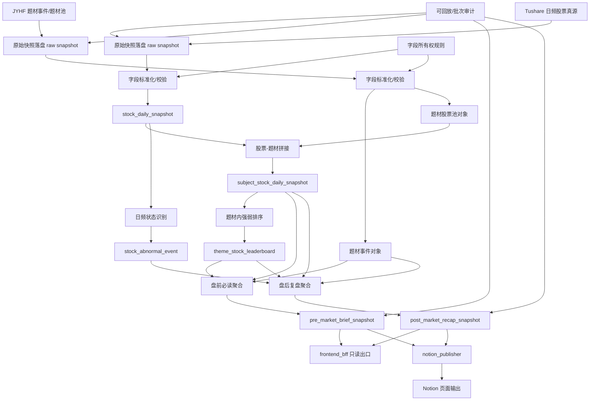
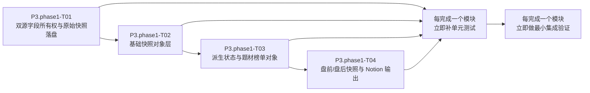

# FEATURE SPEC - P3.phase1

## 0. Meta
- Phase: `P3.phase1`
- 目标: 基于 `Tushare + JYHF` 建立第三阶段首批双源事实层、题材股票拼接、盘前必读/盘后复盘快照与 Notion 输出基础。
- 范围:
  - `stock_daily_snapshot`
  - `subject_stock_daily_snapshot`
  - `stock_abnormal_event`
  - `theme_stock_leaderboard`
  - `pre_market_brief_snapshot`
  - `post_market_recap_snapshot`
  - `notion_publisher`
- 非目标:
  - 不实现 `SSE`
  - 不实现分钟级异动
  - 不实现全量资金行为分析
- 冲突裁决说明:
  - 股票事实真源采用 `Tushare`，`JYHF` 负责题材事件和题材池。
  - `stock_service` 仅承担事实对象层；报告聚合不下沉到 `stock_service`。

## 0.1 架构逻辑流程图

## 0.2 模块开发顺序图

## Task `P3.phase1-T01` — 双源字段所有权与原始快照落盘

### 1) 目标与边界
- 目标:
  - 冻结 `Tushare + JYHF` 双源字段所有权。
  - 建立“原始响应先落盘，再标准化入库”的基线。
- 非目标:
  - 不在本任务中生成页面 DTO。
  - 不直接生成复盘结论。

### 1.1 子功能分解
- `F-P3.phase1-T01-01` `Tushare` 字段所有权冻结
  - 输入: 交易日、证券主数据、日线事实字段
  - 处理: 冻结股票事实字段来源
  - 输出: 字段映射表
  - 失败处理: 字段冲突阻断评审
  - 可观测证据: 字段所有权清单
- `F-P3.phase1-T01-02` `JYHF` 题材语义真源冻结
  - 输入: 题材事件、题材股票池、题材上下文
  - 处理: 冻结题材相关字段来源
  - 输出: 题材语义字段映射
  - 失败处理: 题材字段被股票源覆盖时阻断
  - 可观测证据: 双源冲突报告
- `F-P3.phase1-T01-03` 原始快照先落盘
  - 输入: 外部源原始响应
  - 处理: 本地快照落盘、批次标记
  - 输出: 可回放原始快照文件
  - 失败处理: 落盘失败则不得入库
  - 可观测证据: `source_name`, `batch_id`, `raw_snapshot_path`

### 2) 接口与契约
- 输入:
  - `trade_date`
  - `source_name=tushare|jyhf`
- 输出:
  - 原始快照文件
  - 字段所有权映射
- 幂等/重试:
  - 相同 `trade_date + source_name + batch_id` 幂等
  - 原始落盘失败不得自动写入半成品对象

### 3) 数据模型与状态变更
- 新增/冻结对象:
  - 原始快照清单
  - 双源字段映射配置
- 兼容策略:
  - 允许旧导入脚本继续存在，但不得绕开新所有权规则

### 4) 实现步骤（最小可执行序列）
- Step-1: 冻结双源字段所有权表。
- Step-2: 实现 `Tushare` 原始快照落盘。
- Step-3: 实现 `JYHF` 原始快照落盘。
- Step-4: 增加冲突检测与阻断规则。

### 5) 测试设计与命令
- 对应测试用例:
  - `TC-P3B-001-source-ownership`
  - `TC-P3B-002-raw-snapshot-fallback`
- 必跑命令:
  - `.venv/bin/python -m pytest -q`
  - `rg -n "Tushare|JYHF|raw_snapshot|ownership" /Users/admin/Desktop/ai_theme_app`

### 6) 风险与回滚
- 风险:
  - 双源同字段口径冲突
- 缓解:
  - 所有权冻结 + 冲突直接阻断
- 回滚触发条件:
  - 字段所有权策略引发入库结果大面积漂移
- 回滚操作:
  - 回退到上一版字段映射，保留原始快照

### 7) 验收映射
- `ACPT-P3B-001`
- `ACPT-P3B-002`

---

## Task `P3.phase1-T02` — 基础快照对象层

### 1) 目标与边界
- 目标:
  - 生成 `stock_daily_snapshot` 与 `subject_stock_daily_snapshot`
  - 支持股票与题材双向反查
- 非目标:
  - 不生成分钟级对象
  - 不引入实时推送

### 1.1 子功能分解
- `F-P3.phase1-T02-01` 股票日频快照标准化
  - 输入: `Tushare` 日频原始快照
  - 处理: 标准化字段、交易日校验
  - 输出: `stock_daily_snapshot`
  - 失败处理: 交易日不一致拒绝入库
  - 可观测证据: `stock_snapshot_rows`
- `F-P3.phase1-T02-02` 题材股票快照拼接
  - 输入: `JYHF` 题材池 + 股票快照
  - 处理: 股票到题材绑定
  - 输出: `subject_stock_daily_snapshot`
  - 失败处理: 无法绑定的股票记录异常清单
  - 可观测证据: `subject_stock_snapshot_rows`
- `F-P3.phase1-T02-03` 双向反查接口基线
  - 输入: `stock_id` 或 `subject_key`
  - 处理: 对象层查询
  - 输出: 股票/题材双向关系
  - 失败处理: 缺失对象返回空结果而不是伪造数据
  - 可观测证据: 反查命中率

### 2) 接口与契约
- 输入:
  - `trade_date`
  - `stock_id`
  - `subject_key`
- 输出:
  - `stock_daily_snapshot`
  - `subject_stock_daily_snapshot`
- 超时:
  - 单批标准化必须可在日常批任务窗口内完成

### 3) 数据模型与状态变更
- 对象:
  - `stock_daily_snapshot`
  - `subject_stock_daily_snapshot`
- 主键:
  - `trade_date + stock_id`
  - `trade_date + subject_key + stock_id`
- 兼容策略:
  - 旧股票快照表只读，不继续扩张字段语义

### 4) 实现步骤（最小可执行序列）
- Step-1: 定义两类基础对象 schema。
- Step-2: 标准化股票日频快照。
- Step-3: 执行题材股票拼接。
- Step-4: 建立双向反查查询路径。

### 5) 测试设计与命令
- 对应测试用例:
  - `TC-P3B-003-stock-daily-snapshot`
  - `TC-P3B-004-subject-stock-snapshot`
- 必跑命令:
  - `.venv/bin/python -m pytest -q`
  - `rg -n "stock_daily_snapshot|subject_stock_daily_snapshot" /Users/admin/Desktop/ai_theme_app`

### 6) 风险与回滚
- 风险:
  - 股票到题材绑定口径不稳定
- 缓解:
  - 绑定失败输出异常清单，不伪造映射
- 回滚触发条件:
  - 题材拼接结果大面积失真
- 回滚操作:
  - 回退到基础股票快照层，暂时停用题材拼接对象

### 7) 验收映射
- `ACPT-P3B-003`

---

## Task `P3.phase1-T03` — 派生状态与题材榜单对象

### 1) 目标与边界
- 目标:
  - 基于日频事实对象生成 `stock_abnormal_event`
  - 生成 `theme_stock_leaderboard`
- 非目标:
  - 不实现黑盒评分模型
  - 不做资金行为增强

### 1.1 子功能分解
- `F-P3.phase1-T03-01` 日频异常状态识别
  - 输入: `stock_daily_snapshot`
  - 处理: 涨停/跌停/连板/龙头候选/扩散股候选规则计算
  - 输出: `stock_abnormal_event`
  - 失败处理: 规则缺参数时拒绝生成
  - 可观测证据: `abnormal_event_count`
- `F-P3.phase1-T03-02` 题材股票强弱排序
  - 输入: `subject_stock_daily_snapshot` + 派生状态
  - 处理: 题材内排序与角色候选
  - 输出: `theme_stock_leaderboard`
  - 失败处理: 排序依据缺失时返回空榜并告警
  - 可观测证据: `leaderboard_rows`
- `F-P3.phase1-T03-03` 规则可解释性输出
  - 输入: 排序规则与派生状态
  - 处理: 输出解释字段
  - 输出: 角色说明与证据字段
  - 失败处理: 无解释字段时不进入正式对象
  - 可观测证据: 解释字段覆盖率

### 2) 接口与契约
- 输入:
  - `trade_date`
  - `stock_daily_snapshot`
  - `subject_stock_daily_snapshot`
- 输出:
  - `stock_abnormal_event`
  - `theme_stock_leaderboard`
- 约束:
  - 规则必须显式、可追溯

### 3) 数据模型与状态变更
- 对象:
  - `stock_abnormal_event`
  - `theme_stock_leaderboard`
- 状态变更:
  - 每个交易日按批重算
- 兼容策略:
  - 排序字段只增不改

### 4) 实现步骤（最小可执行序列）
- Step-1: 定义异常状态规则和对象 schema。
- Step-2: 生成日频异常对象。
- Step-3: 生成题材榜单对象。
- Step-4: 补齐解释字段与规则证据。

### 5) 测试设计与命令
- 对应测试用例:
  - `TC-P3B-005-abnormal-event`
  - `TC-P3B-006-theme-leaderboard`
- 必跑命令:
  - `.venv/bin/python -m pytest -q`
  - `rg -n "stock_abnormal_event|theme_stock_leaderboard" /Users/admin/Desktop/ai_theme_app`

### 6) 风险与回滚
- 风险:
  - 龙头/扩散规则解释不足
- 缓解:
  - 规则显式化，不允许黑盒输出
- 回滚触发条件:
  - 排序或角色结果严重不稳定
- 回滚操作:
  - 回退到仅保留基础异常对象，不输出角色榜单

### 7) 验收映射
- `ACPT-P3B-004`
- `ACPT-P3B-005`

---

## Task `P3.phase1-T04` — 盘前/盘后快照与 Notion 输出

### 1) 目标与边界
- 目标:
  - 生成 `pre_market_brief_snapshot` 与 `post_market_recap_snapshot`
  - 接入 `notion_publisher` 作为单向输出层
- 非目标:
  - 不将 Notion 作为业务真源
  - 不在本任务中引入 `/recap` 增强字段

### 1.1 子功能分解
- `F-P3.phase1-T04-01` 盘前快照生成
  - 输入: 隔夜题材事件、重点股票观察对象、必要新闻事实
  - 处理: 聚合盘前要点
  - 输出: `pre_market_brief_snapshot`
  - 失败处理: 关键输入缺失则报告不落正式快照
  - 可观测证据: `report_id`, `snapshot_type`
- `F-P3.phase1-T04-02` 盘后快照生成
  - 输入: 题材榜单、异常状态、题材事件
  - 处理: 聚合盘后复盘
  - 输出: `post_market_recap_snapshot`
  - 失败处理: 重复生成不一致时阻断发布
  - 可观测证据: 一致率校验报告
- `F-P3.phase1-T04-03` Notion 单向输出
  - 输入: 盘前/盘后快照
  - 处理: 同步到指定 Notion 页面
  - 输出: 发布结果与 publish log
  - 失败处理: 失败重试，不阻塞快照落库
  - 可观测证据: `publish_status`, `publish_error`

### 2) 接口与契约
- 输入:
  - `trade_date`
  - `report_type=pre|post`
- 输出:
  - `pre_market_brief_snapshot`
  - `post_market_recap_snapshot`
  - `notion_publish_result`
- 约束:
  - 前端和 Notion 必须读取同一份快照

### 3) 数据模型与状态变更
- 对象:
  - `pre_market_brief_snapshot`
  - `post_market_recap_snapshot`
  - `publish_log`
- 状态变更:
  - `generated -> published|publish_failed`
- 兼容策略:
  - Notion 模板字段只增不改

### 4) 实现步骤（最小可执行序列）
- Step-1: 定义盘前/盘后快照 schema。
- Step-2: 生成报告快照并固化重复生成一致性校验。
- Step-3: 接入 `notion_publisher` 输出层。
- Step-4: 建立失败重试和不阻塞主链策略。

### 5) 测试设计与命令
- 对应测试用例:
  - `TC-P3B-007-pre-market-snapshot`
  - `TC-P3B-008-post-market-recap`
  - `TC-P3B-009-notion-publish-nonblocking`
- 必跑命令:
  - `.venv/bin/python -m pytest -q`
  - `rg -n "pre_market_brief_snapshot|post_market_recap_snapshot|notion_publisher" /Users/admin/Desktop/ai_theme_app`

### 6) 风险与回滚
- 风险:
  - 前端与 Notion 输出漂移
  - Notion 失败阻塞主链
- 缓解:
  - 快照唯一真源 + 输出层隔离
- 回滚触发条件:
  - 报告一致性不达标或 Notion 发布链路反向影响主链
- 回滚操作:
  - 停用 Notion 发布，仅保留快照落库和前端读取

### 7) 验收映射
- `ACPT-P3B-006`
- `ACPT-P3B-007`
