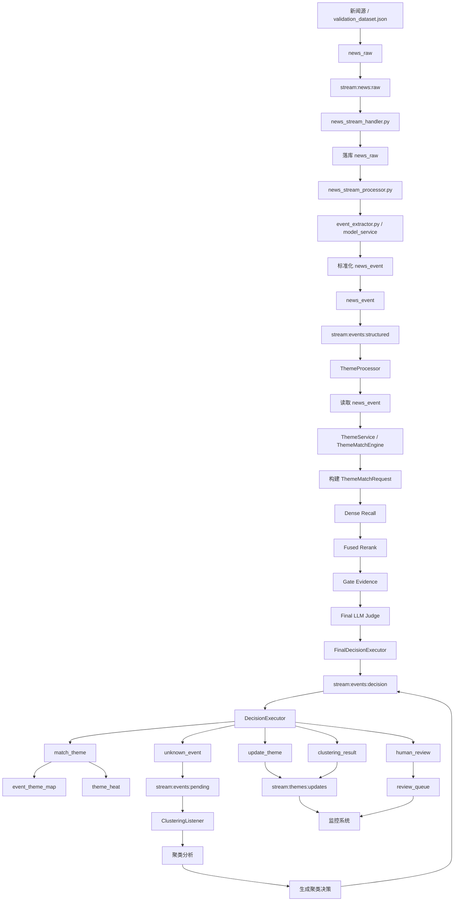

# Phase Execution Contract

## 1. Phase Identity

- Phase Name: ThemeMatchEngine 入核与边界收敛
- Phase Code: P2.phase0
- Parent Milestone: P2（第二阶段）
- Risk Level: P0
- Source Documents:
  - `docs/project_control/PRD.md`
  - `docs/project_control/prd_p1.md`
  - `docs/project_control/prd_p2.md`
  - `docs/project_control/ACCEPTANCE.md`
  - `docs/project_control/PLAN_WBS.md`
  - `docs/project_control/ARCH_REVIEW.md`
  - `docs/adrs/ADR_LIST.md`

---

## 1.1 Conflict Resolution

| 冲突项 | 采用来源 | 放弃来源 | 裁决理由 |
| --- | --- | --- | --- |
| 第二阶段需求真源 | `docs/project_control/prd_p2.md` | `docs/project_control/PRD.md` 中仅有的 `P2.phase0` 草案片段 | `prd_p2.md` 已覆盖 `P2.phase0~3`，粒度与第二阶段架构一致 |
| 验收边界 | `docs/project_control/ACCEPTANCE.md` 中 `P2.phase0` 段 | 架构文档中的完整目标态表述 | 合同必须只覆盖本 phase，不跨入 Unknown 聚类/知识库/热度完整能力 |
| 任务拆解 | 本合同内最小执行交付项 | `PLAN_WBS.md` 中仅存在 P1 拆解 | 仓库尚无 P2 正式 WBS，需在合同中定义最小可执行交付边界 |
| 风险基线 | `docs/project_control/ARCH_REVIEW.md` | 架构文档中的长期愿景描述 | 复评已明确 P2.phase0 的首期阻断项和非目标 |

---

## 2. Phase Objective（可量化）

1. 将 `ThemeMatchEngine` 作为唯一线上最终题材判定内核接入现有 Redis Stream 主链路。  
2. 冻结三态决策 `MATCH / UNKNOWN / HUMAN_REVIEW` 及最小运行时契约。  
3. 建立受控降级与最小审计协议，确保审计覆盖率 `100%`。  
4. 保证链路总时延满足 `P95 < 1200ms`、`P99 < 2500ms`。  
5. 保持现有 `DecisionExecutor` 与下游消费者兼容，不触发同步重构。  
6. 结构化事件统一进入单一事件流，不再区分 `major / normal`。  
7. 完成 `news_stream_handler.py` 与 `news_stream_processor.py` 的前后分层改造，使前者只负责 `stream:news:raw -> news_raw`，后者只负责 `news_raw -> news_event -> stream:events:structured`。  
8. 完成 `theme_processor.py` 重构，使其只消费 `stream:events:structured`、读取 `news_event`、调用 `ThemeMatchEngine` 并发布统一决策。  
9. 完成 `theme_service.py` 服务封装改造，使 `ThemeProcessor` 通过正式门面调用 `ThemeMatchEngine`，而不是继续走旧 discovery 接口。  

## 2.1 Phase Logic Flow（Mermaid）

---

## 3. Acceptance Targets（门禁条件）

- [ ] 所有最终题材判定必须通过统一 `ThemeMatchEngine` 输出，不允许存在第二条可落题材结果的旁路实现。
- [ ] `ThemeMatchEngine` 必须稳定输出三类决策：`MATCH`、`UNKNOWN`、`HUMAN_REVIEW`，且结果字段语义固定。
- [ ] 首期在线画像 `ThemeProfile` 必须包含 `aliases/core_objects/entity_hints/must_terms/strong_terms/negative_terms/search_text`，且不得直接混用久赢长文详情字段。
- [ ] 遇到 LLM/reranker/索引超时或不可用时，系统必须进入受控降级路径，不得无审计地产出最终题材。
- [ ] 所有 `UNKNOWN` 结果必须进入统一 Unknown 池，不得在本阶段直接自动创建新题材。
- [ ] 审计日志必须覆盖 `trace_id/model_version/prompt_version/final_decision/latency_ms` 等最小字段集合，覆盖率 100%。
- [ ] 匹配链路性能预算必须明确并经灰度验证：总时延 P95 < 1200ms、P99 < 2500ms。
- [ ] 必须保留现有 Redis Stream 与 `DecisionExecutor` 主链路兼容性，不得要求同步重构所有下游消费者。
- [ ] 结构化事件必须统一进入单一事件流，不得再以 `major / normal` 前置分流决定新题材处理路径。
- [ ] `news_stream_handler.py` 必须先完成 `stream:news:raw -> news_raw` 入库，且不得承载结构化或题材匹配职责。
- [ ] `news_stream_processor.py` 必须完成去 `theme_discovery_directive`、去 `CREATE_NEW/CLUSTER`、去“只做 AI 包装不落库”的旧逻辑改造，并只处理已入库 `news_raw`。
- [ ] `theme_processor.py` 必须完成去双流、去分类优先、去直接建题材逻辑改造，只允许发布 `MATCH / UNKNOWN / HUMAN_REVIEW` 决策。
- [ ] `theme_service.py` 必须提供 `ThemeMatchEngine` 正式服务门面，统一负责 `ThemeMatchRequest` 构建与 `ThemeDecisionEnvelope` 返回。
- [ ] 必须明确久赢展示层与在线画像层的存储边界，不得使用同一对象同时承担前端展示和在线检索索引职责。
- [ ] 本阶段必须形成清晰的非目标边界，明确不包含完整新题材聚类成团、久赢式详情页全量产品化、完整热度/生命周期状态机。

---

## 4. Required Commands（必须执行命令）

- `rg -n "ThemeMatchEngine|semantic_matcher|final decision|matched_theme" .`
- `rg -n "ThemeMatchEngine|DecisionExecutor|stream:events:structured|stream:events:human_review|stream:events:unknown" .`
- `rg -n "stream:news:raw|create_news|database_gateway|news_raw|process_storage_message|_extract_raw_data" database_service/streams/handlers/news_stream_handler.py`
- `rg -n "theme_discovery_directive|CREATE_NEW|CLUSTER|news.stored|news.updated|process_stream_message|_process_news_stored_event" database_service/streams/handlers/news_stream_processor.py`
- `rg -n "stream:news:raw|stream:events:structured|news_event|event_extractor|model_service" database_service/streams/handlers/news_stream_processor.py`
- `rg -n "stream:events:normal|stream:events:major|enable_classification_first|discover_category_only|discover_with_themes|create_new_theme_by_rules|publish_clustering|create_new_theme" database_service/streams/handlers/theme_processor.py`
- `rg -n "stream:events:structured|ThemeMatchRequest|ThemeDecisionEnvelope|MATCH|UNKNOWN|HUMAN_REVIEW" database_service/streams/handlers/theme_processor.py`
- `rg -n "get_theme_service|discover_category_only|discover_with_themes|discover_theme|create_new_theme_by_rules|ThemeDiscoveryEngine" theme_service/services/theme_service.py`
- `rg -n "ThemeMatchEngine|ThemeMatchRequest|ThemeDecisionEnvelope|match_event|build_theme_match_request" theme_service/services/theme_service.py`
- `rg -n "Out of Scope|Non-Goals|不验证|不在本阶段" docs/project_control/prd_p2.md docs/project_control/ACCEPTANCE.md`
- `.venv/bin/python -m pytest -q`

Acceptance-测试映射：
- `ACPT-P2.phase0-001` -> `ACC-P2.phase0-01` -> `rg -n "ThemeMatchEngine|semantic_matcher|final decision|matched_theme" .`
- `ACPT-P2.phase0-002` -> `ACC-P2.phase0-02` -> `.venv/bin/python -m pytest -q`
- `ACPT-P2.phase0-003` -> `ACC-P2.phase0-05` -> `.venv/bin/python -m pytest -q`
- `ACPT-P2.phase0-004` -> `ACC-P2.phase0-04` -> `.venv/bin/python -m pytest -q`
- `ACPT-P2.phase0-005` -> `ACC-P2.phase0-03` -> `.venv/bin/python -m pytest -q`
- `ACPT-P2.phase0-006` -> `ACC-P2.phase0-06` -> `.venv/bin/python -m pytest -q`
- `ACPT-P2.phase0-007` -> `ACC-P2.phase0-06` -> `.venv/bin/python -m pytest -q`
- `ACPT-P2.phase0-008` -> `ACC-P2.phase0-01` -> `rg -n "ThemeMatchEngine|DecisionExecutor|stream:events:structured|stream:events:human_review|stream:events:unknown" .`
- `ACPT-P2.phase0-009` -> `ACC-P2.phase0-07` -> `rg -n "stream:events:structured|stream:events:human_review|stream:events:unknown|events:major|events:normal" .`
- `ACPT-P2.phase0-009` -> `ACC-P2.phase0-07` -> `rg -n "theme_discovery_directive|CREATE_NEW|CLUSTER|news.stored|news.updated|process_stream_message|_process_news_stored_event" database_service/streams/handlers/news_stream_processor.py`
- `ACPT-P2.phase0-009` -> `ACC-P2.phase0-07` -> `rg -n "stream:events:normal|stream:events:major|enable_classification_first|discover_category_only|discover_with_themes|create_new_theme_by_rules|publish_clustering|create_new_theme" database_service/streams/handlers/theme_processor.py`
- `ACPT-P2.phase0-010` -> `ACC-P2.phase0-05` -> `.venv/bin/python -m pytest -q`
- `ACPT-P2.phase0-011` -> `ACC-P2.phase0-06` -> `rg -n "Out of Scope|Non-Goals|不验证|不在本阶段" docs/project_control/prd_p2.md docs/project_control/ACCEPTANCE.md`

---

## 5. Deliverables

- `theme_service` 接入 `ThemeMatchEngine` 的主链路改造说明。
- `database_service/streams/handlers/news_stream_handler.py` 分层接入说明与职责冻结清单。
- `database_service/streams/handlers/news_stream_processor.py` 重构说明与旧逻辑拆除清单。
- `database_service/streams/handlers/theme_processor.py` 重构说明与旧逻辑拆除清单。
- `theme_service/services/theme_service.py` 服务封装改造说明与旧 discovery 主路径退役清单。
- 结构化事件单流入口与裁决后分叉说明。
- 运行时契约文档：`ThemeMatchRequest / ThemeDecisionEnvelope / ThemeAuditLogRecord`。
- `ThemeProfile` 首期字段基线与构建说明。
- 受控降级策略与 reason code 约束。
- 审计日志最小字段协议与性能预算记录。
- 文档更新：
  - `docs/project_control/PHASE_CONTRACT_P2.phase0.md`
  - `tmp/phase_contract_P2.phase0.json`
  - `tmp/phase_contract_consistency_P2.phase0.json`

---

## 6. Risk Matrix

| Risk | Impact | Likelihood | Trigger | Owner | Mitigation |
| --- | --- | --- | --- | --- | --- |
| 运行时契约未冻结导致下游理解漂移 | High | High | 三态结构出现多版本解释 | 架构负责人 | 先冻结统一 envelope 与 audit schema |
| 接入后要求下游同步重构 | High | Medium | 新引擎输出结构与消费端不兼容 | 平台负责人 | 保留兼容层，限制破坏性改造 |
| 延续旧的 major/normal 双流假设 | Medium | Medium | 仍以前置事件等级决定新题材路径 | 架构负责人 | 改为统一结构化事件单流 + 裁决后分叉 |
| LLM/reranker 超时导致无审计误写入 | High | Medium | 依赖超时或异常 | 算法负责人 | 强制 fallback 到 `HUMAN_REVIEW` 并记录 reason code |
| 性能预算失控 | High | Medium | P95/P99 超阈值 | 匹配引擎负责人 | 分层预算、超时阈值、灰度验证 |
| 展示层和画像层混写 | Medium | Medium | 使用同一对象承担检索和展示 | 数据负责人 | Core/Profile/Knowledge 分层，禁止混表 |

---

## 7. Rollback Plan

- 代码回滚：
  - 触发条件：出现 `ThemeMatchEngine` 旁路写题材、核心消费者不兼容、主链路异常积压。
  - 方式：回切到接入前稳定入口，但保留审计逻辑与 trace 透传。
- 数据回滚：
  - 触发条件：错误题材映射批量落库或审计字段缺失。
  - 方式：按 `trace_id/event_id` 回滚本阶段新增映射与审计异常写入。
- 同步补偿回滚：
  - 触发条件：Unknown 池、审计日志、DecisionExecutor 状态不同步。
  - 方式：保留原始事件与 decision 记录，执行补偿重放。

---

## 8. Non-Goals

- 不实现 Unknown 聚类成团与新题材草案（P2.phase1）。
- 不实现久赢式详情/历史/股票/榜单完整产品化（P2.phase2）。
- 不实现热度模型和生命周期状态机（P2.phase3）。
- 不重做现有 Redis Stream 架构。
- 不恢复 `major / normal` 双流模式。

---

## 9. 状态同步与对账基线

- `Doing -> test-evidence -> In review/done -> milestone progress`
- `P0/P1` 任务进入 `In review/done` 前，必须带 `--test-files` 且测试文件出现在当前 `git diff`
- 阶段末对账必须使用 `--milestone-id` 全量拉取后本地筛 phase

---

## 10. 实施同步记录（2026-03-30）

### 10.1 已完成的真实验证
- `ThemeMatchEngine` 单元测试：
  - `10` 条 `AI/AR眼镜`：`top1_accuracy = 1.0`
  - `30` 条 `AI/AR眼镜`：`top1_accuracy = 1.0`
- `theme_processor.py` 真实集成：
  - `30` 条样本：`top1_accuracy = 1.0`
- `news_stream_processor.py -> theme_processor.py` 真实跨组件：
  - `10` 条样本：`top1_accuracy = 1.0`
- 从 `stream:news:raw` 起步的真实全链路：
  - `10` 条样本：`top1_accuracy = 1.0`
  - 已具备实时进度输出

### 10.2 当前 blocker 状态
- `news_stream_handler.py`
  - 组件本体已补齐 `_ensure_consumer_group()` 正式实现。
  - `10` 条真实全链路已在无运行时补偿条件下复测通过。
  - 当前不再构成组件 blocker，仅剩 `100` 条正式 Gate 待执行。

### 10.3 合同状态更新
- 当前阶段状态：可进入 `100` 条最终验收准备
- 正式 QA 入口脚本：`tmp/run_full_chain_100_to_decision_with_progress.py`
- 但在以下条件满足前，不得标记 `P2.phase0` 完全通过：
  1. 正式修复 `news_stream_handler.py` 组件本体缺口
  2. 完成 `100` 条真实全链路最终验收

## 10.4 合同状态更新（2026-03-31）

- `100` 条真实全链路最终验收已完成：
  - `events = 100`
  - `processed = 100`
  - `top1_hits = 96`
  - `top1_accuracy = 0.96`
- 结果文件：
  - [p2_phase0_full_chain_100_to_decision.report.json](/Users/admin/Desktop/ai_theme_app/tmp/p2_phase0_full_chain_100_to_decision.report.json)
  - [p2_phase0_full_chain_100_match_detail.json](/Users/admin/Desktop/ai_theme_app/tmp/p2_phase0_full_chain_100_match_detail.json)
- parser 默认入口已切换为 [reliable_deepseek_parser.py](/Users/admin/Desktop/ai_theme_app/model_service/llm_parser/reliable_deepseek_parser.py)，该切换属于 `P2.phase0` 的正式实现，不再是临时稳定性补丁。
- 当前合同状态：
  - `P2.phase0`：**CONDITIONAL PASS（核心结果达标，保留少量误判与旧初始化噪音观察项）**
