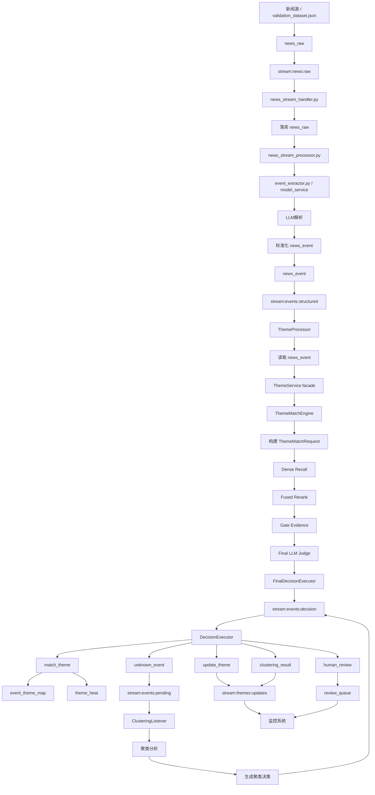

# 第二阶段需求文档（PRD_P2）

- 项目：个人投资助理（AI Theme App）
- 范围：第二阶段（P2.phase0 ~ P2.phase3）
- 依据文档：
  - `docs/architecture/个人投资助理-项目架构设计-第二阶段（题材匹配重构版）.md`
  - `docs/project_control/ARCH_REVIEW.md`
  - `docs/project_control/ACCEPTANCE.md`
  - `docs/project_control/PLAN_WBS.md`
- 风险等级：P1
- 文档状态：Draft
- 说明：本文件为第二阶段独立 PRD，不替代现有总表 `PRD.md`

## Change Log

- 2026-03-29
  - 首次新增第二阶段独立需求文档 `prd_p2.md`
  - 依据第二阶段架构文档，将范围拆分为 `P2.phase0 ~ P2.phase3`
  - 当前仅 `P2.phase0` 已有 Acceptance 基线，其余阶段为需求先行草案
- 2026-03-31
  - 调整阶段顺序：题材知识对象与 API 前移为 `P2.phase1`
  - 热度、生命周期与榜单运营化前移为 `P2.phase2`
  - Unknown 与新题材闭环后移为 `P2.phase3`
  - 补充与第三阶段/第四阶段前置工作的边界说明：`P2.phase1` 输出的题材知识对象与只读 API 可作为前端前置验证的数据基础，但不等同于最终产品输出层；后续前端统一出口应收敛到第三阶段的 `frontend_bff / api_gateway`

## 冲突裁决说明

- 冲突 1：
  - 第二阶段架构文档包含完整目标态，覆盖匹配内核、Unknown、新题材、知识库、榜单、热度与生命周期
  - 当前正式 Acceptance 只覆盖 `P2.phase0`
  - 裁决：本 PRD 仍按 `P2.phase0 ~ P2.phase3` 组织第二阶段全貌，但仅 `P2.phase0` 视为已有验收锚点，其余阶段标记为 Draft

- 冲突 2：
  - `PLAN_WBS.md` 目前只覆盖 P1
  - 第二阶段尚无正式 WBS / TEST_CASE / PHASE_CONTRACT
  - 裁决：保留第二阶段任务与测试占位 ID，用于后续 contract 化；当前 `gate_ready=false`

- 冲突 3：
  - 第二阶段架构文档存在“最终目标态”与“近期实施态”混写
  - 架构复评要求优先冻结运行时基线、兼容层、性能预算、审计协议
  - 裁决：`P2.phase0` 只覆盖入核与边界收敛；`题材知识对象与 API / 热度生命周期 / Unknown 聚类与新题材草案` 依次安排为 `P2.phase1 ~ P2.phase3`

- 冲突 4：
  - 当前已经前置了部分第四阶段前端设计与 `/intel/feed` 聚合接口
  - 但第二阶段 `theme_service` 的只读/聚合接口本质上仍是领域服务，不应被误认为最终产品 API
  - 裁决：`P2.phase1` 继续承担“题材知识对象层 + 过渡只读 API”职责；面向前端的统一产品出口由第三阶段 `frontend_bff / api_gateway` 收口

---

## Phase `P2.phase0` — ThemeMatchEngine 入核与边界收敛

### 1. 目标（Objective）

在不重做现有 Redis Stream 主链路的前提下，将高精度离线裁决方案沉淀为线上统一 `ThemeMatchEngine`，并冻结运行时契约、三态决策、降级策略和最小审计能力。上线后要求题材主链路总时延 `P95 < 1200ms`、`P99 < 2500ms`。

### 1.1 本阶段逻辑流程图（Mermaid）



### 2. 范围（Scope）

In Scope：
- `ThemeMatchEngine` 替换旧 `semantic_matcher` 成为唯一最终判定内核
- 结构化事件统一进入单一事件流，不再区分 `major / normal`
- 重构 `news_stream_handler.py` 与 `news_stream_processor.py`，使其适配 `stream:news:raw -> news_stream_handler.py -> news_raw -> news_stream_processor.py -> event_extractor.py -> news_event -> stream:events:structured` 新链路
- 重构 `theme_processor.py`，使其适配 `stream:events:structured -> news_event -> ThemeMatchEngine -> decision envelope` 新链路
- 冻结 `MATCH / UNKNOWN / HUMAN_REVIEW` 三态决策
- 冻结运行时契约、兼容层、审计日志最小字段、降级策略
- 建立在线 `ThemeProfile` 画像基线

Out of Scope：
- Unknown 聚类成团
- 新题材自动草案与合并审核
- 久赢式详情页、榜单、热度生命周期完整产品化

### 3. 功能需求（Functional Requirements）

#### `PRD-REQ-P2.phase0-001`
- 描述：所有最终题材判定必须统一通过 `ThemeMatchEngine` 输出。
- 触发条件：结构化 `news_event` 进入 `theme_service`
- 预期行为：旧匹配入口不得直接落最终题材；只能由统一判定内核产出结果
- 约束：保留现有 Redis Stream 与 `DecisionExecutor` 主链路兼容

#### `PRD-REQ-P2.phase0-005`
- 描述：结构化事件必须统一进入单一事件流。
- 触发条件：`news_stream_handler.py` 完成 `news_raw` 入库且 `news_stream_processor.py` 产出标准化 `news_event`
- 预期行为：事件统一写入结构化事件流，再进入 `ThemeMatchEngine`
- 约束：不得再以 `major / normal` 前置分流决定新题材处理路径

#### `PRD-REQ-P2.phase0-006`
- 描述：`news_stream_handler.py` 与 `news_stream_processor.py` 必须按新架构形成前后分层。
- 触发条件：`stream:news:raw` 中出现待处理原始新闻
- 预期行为：`news_stream_handler.py` 只负责消费 `stream:news:raw` 并落库 `news_raw`；`news_stream_processor.py` 只负责基于已入库 `news_raw` 调用 `event_extractor.py / model_service`、落库 `news_event`、发布 `stream:events:structured`
- 约束：`news_stream_handler.py` 不得做结构化或题材匹配；`news_stream_processor.py` 不得继续返回 `theme_discovery_directive`、`CREATE_NEW / CLUSTER`，不得直接参与题材匹配

#### `PRD-REQ-P2.phase0-007`
- 描述：`theme_processor.py` 必须按新架构重构为统一结构化事件处理器。
- 触发条件：`stream:events:structured` 中出现待处理事件
- 预期行为：处理器只负责读取 `news_event`、构建 `ThemeMatchRequest`、调用 `ThemeMatchEngine`、发布 `MATCH / UNKNOWN / HUMAN_REVIEW`
- 约束：不得继续保留 `enable_classification_first`、`events:major/events:normal` 双流、`create_new_theme_by_rules()` 直建题材路径

#### `PRD-REQ-P2.phase0-008`
- 描述：`theme_service.py` 必须作为 `ThemeMatchEngine` 的正式服务封装层，供 `theme_processor.py` 调用。
- 触发条件：`theme_processor.py` 需要对结构化 `news_event` 执行线上题材判定
- 预期行为：`get_theme_service()` 返回的新门面负责构建 `ThemeMatchRequest`、调用 `ThemeMatchEngine`、返回 `ThemeDecisionEnvelope`
- 约束：不得继续以 `discover_category_only / discover_with_themes / discover_theme / create_new_theme_by_rules` 作为 `P2.phase0` 线上主调用路径

#### `PRD-REQ-P2.phase0-002`
- 描述：`ThemeMatchEngine` 必须输出固定三态决策结构。
- 触发条件：候选召回、精排、门控、最终裁决完成
- 预期行为：返回 `MATCH`、`UNKNOWN` 或 `HUMAN_REVIEW`，并携带 `theme_id/reason/confidence/evidence_summary`
- 约束：字段语义固定，消费者不得自行扩展隐式状态

#### `PRD-REQ-P2.phase0-003`
- 描述：在线画像层必须基于标准化 `ThemeProfile` 提供检索和裁决输入。
- 触发条件：引擎构造候选题材索引
- 预期行为：画像至少包含 `aliases/core_objects/entity_hints/must_terms/strong_terms/negative_terms/search_text`
- 约束：不得直接将久赢长文详情字段混入在线索引对象

#### `PRD-REQ-P2.phase0-004`
- 描述：匹配主链路必须具备受控降级与最小审计能力。
- 触发条件：LLM、reranker、索引、外部依赖超时或不可用
- 预期行为：进入 `HUMAN_REVIEW` 或受控 fallback，且完整记录 `trace_id/model_version/prompt_version/final_decision/latency_ms/reason_code`
- 约束：不得无审计地产出最终题材

### 4. 非功能需求（NFR）

- 性能：总时延 `P95 < 1200ms`，`P99 < 2500ms`
- 可用性：核心依赖超时后必须进入受控降级，不得 silent fail
- 可观测性：三态决策审计覆盖率 `100%`
- 兼容性：不得要求同步重构现有 Redis Stream 全部下游消费者

### 5. 用例（Given/When/Then）

#### `PRD-UC-P2.phase0-01`
Given：
- 结构化事件进入 `theme_service`
When：
- 执行完整匹配主链路
Then：
- 最终题材仅能由 `ThemeMatchEngine` 产出

#### `PRD-UC-P2.phase0-04`
Given：
- `news_stream_handler.py` 已完成 `news_raw` 入库，且 `news_stream_processor.py` 已产出标准化 `news_event`
When：
- 事件进入线上主链路
Then：
- 事件统一进入单一结构化事件流
- 不存在 `major / normal` 双流分叉

#### `PRD-UC-P2.phase0-05`
Given：
- `stream:news:raw` 中存在一条原始新闻消息
When：
- `news_stream_handler.py` 先处理该消息，随后 `news_stream_processor.py` 处理入库后的 `news_raw`
Then：
- 必须先落 `news_raw`
- 必须调用 `event_extractor.py / model_service`
- 必须先落 `news_event`
- 只能发布结构化事件到 `stream:events:structured`

#### `PRD-UC-P2.phase0-06`
Given：
- `stream:events:structured` 中存在一条结构化事件消息
When：
- `theme_processor.py` 处理该消息
Then：
- 处理器必须读取 `news_event`
- 不得执行分类优先和直接建题材逻辑
- 只能发布统一 `decision envelope`

#### `PRD-UC-P2.phase0-07`
Given：
- `theme_processor.py` 需要对一条 `news_event` 执行题材判定
When：
- 通过 `get_theme_service()` 获取服务实例并发起匹配调用
Then：
- 服务层必须统一构建 `ThemeMatchRequest`
- 服务层必须统一返回 `ThemeDecisionEnvelope`
- 不允许回退到旧 `discover_* / create_new_theme_by_rules` 主路径

#### `PRD-UC-P2.phase0-02`
Given：
- 一个明确命中现有题材的事件
When：
- 候选召回、精排、裁决完成
Then：
- 返回 `MATCH(theme_id)` 且包含证据摘要

#### `PRD-UC-P2.phase0-03`
Given：
- LLM judge 或 reranker 超时
When：
- 执行匹配主链路
Then：
- 返回 `HUMAN_REVIEW` 或受控 fallback，并落审计日志

### 6. 验收映射（Acceptance Link）

- `PRD-REQ-P2.phase0-001 -> ACPT-P2.phase0-001`
- `PRD-REQ-P2.phase0-002 -> ACPT-P2.phase0-002`
- `PRD-REQ-P2.phase0-003 -> ACPT-P2.phase0-003`
- `PRD-REQ-P2.phase0-004 -> ACPT-P2.phase0-004 / ACPT-P2.phase0-006 / ACPT-P2.phase0-007 / ACPT-P2.phase0-008`
- `PRD-REQ-P2.phase0-005 -> ACPT-P2.phase0-008`
- `PRD-REQ-P2.phase0-006 -> ACPT-P2.phase0-005 / ACPT-P2.phase0-008 / ACPT-P2.phase0-009`
- `PRD-REQ-P2.phase0-007 -> ACPT-P2.phase0-001 / ACPT-P2.phase0-005 / ACPT-P2.phase0-009`
- `PRD-REQ-P2.phase0-008 -> ACPT-P2.phase0-001 / ACPT-P2.phase0-002 / ACPT-P2.phase0-009`

### 7. 数据与接口样例

请求事件样例：
```json
{
  "event_id": "evt_p2_0001",
  "title": "某纸企宣布 4 月起多品类纸张提价",
  "entities": ["玖龙纸业"],
  "tech_terms": ["瓦楞纸", "纸浆"],
  "impact_industries": ["造纸"],
  "trace_id": "trace_p2_0001"
}
```

决策响应样例：
```json
{
  "decision": "MATCH",
  "best_theme_id": "9010074",
  "confidence": 0.91,
  "reason": "事件主叙事与造纸涨价主线一致",
  "evidence_summary": {
    "theme_name_hits": ["造纸"],
    "object_hits": ["瓦楞纸", "纸浆"],
    "entity_hits": ["玖龙纸业"],
    "negative_hits": []
  }
}
```

### 8. 风险与假设（Risks/Assumptions）

- 风险等级：P0
- 风险：运行时契约不冻结会导致下游消费者理解漂移
- 缓解：先补 `ThemeMatchRequest / ThemeDecisionEnvelope / ThemeAuditLogRecord`

### 9. 发布与回滚约束（Release Constraints）

- 上线前置条件：三态决策、降级、审计、兼容层联调完成
- 回滚触发：P95/P99 超阈值或出现无审计最终题材写入

### 10. 通过判定（Exit Criteria）

- `ThemeMatchEngine` 成为唯一最终判定内核
- 三态决策结构固定且可回放
- 审计字段覆盖率 `100%`
- 性能指标满足阈值
- 不发生兼容性破坏

---

## Phase `P2.phase3` — Unknown 与新题材闭环

### 1. 目标（Objective）

建立 `UNKNOWN -> unknown_event_pool -> 聚类成团 -> new_theme_draft -> merge_review` 的可控闭环，降低未知事件被硬塞进旧题材和重复建题材的风险。要求 Unknown 事件 `100%` 入统一池，首版聚类产物不得直接自动上线。

### 2. 范围（Scope）

In Scope：
- `unknown_event_pool`
- Unknown 事件级入池
- 定时聚类成团
- `new_theme_draft`
- `theme_merge_review`

Out of Scope：
- 自动创建正式题材并直接对外展示
- 复杂生命周期联动

### 3. 功能需求（Functional Requirements）

#### `PRD-REQ-P2.phase3-001`
- 描述：所有 `UNKNOWN` 事件必须统一进入 `unknown_event_pool`
- 触发条件：`ThemeMatchEngine` 返回 `UNKNOWN`
- 预期行为：写入标准化未知事件记录，保留 `event_id/trace_id/reason/evidence`
- 约束：不得在本阶段直接自动建正式题材

#### `PRD-REQ-P2.phase3-002`
- 描述：系统必须支持基于时间窗与相似度的 Unknown 聚类成团
- 触发条件：定时任务扫描 Unknown 池
- 预期行为：按时间窗、相似度、对象词稳定性生成簇结果
- 约束：默认时间窗 `7 天`；簇规模阈值必须可配置

#### `PRD-REQ-P2.phase3-003`
- 描述：达到阈值的簇只能生成 `new_theme_draft`
- 触发条件：Unknown 簇满足成团阈值
- 预期行为：生成草案名称、摘要、代表事件、候选重复题材
- 约束：不得直接写入 `theme_master`

#### `PRD-REQ-P2.phase3-004`
- 描述：新题材草案必须进入合并审核流程
- 触发条件：`new_theme_draft` 创建完成
- 预期行为：支持 `create_theme / merge_to_existing_theme / defer_observation`
- 约束：所有审核动作必须保留审计记录

### 4. 非功能需求（NFR）

- 稳定性：Unknown 入池成功率 `100%`
- 可追溯性：每个草案可回溯到原始事件簇
- 安全性：未经审核不得对外发布正式新题材
- 可调参：时间窗、簇规模、相似度阈值可配置

### 5. 用例（Given/When/Then）

#### `PRD-UC-P2.phase3-01`
Given：
- 一条无法可信匹配现有题材的事件
When：
- 最终裁决返回 `UNKNOWN`
Then：
- 事件进入统一 Unknown 池，且保留原始证据链

#### `PRD-UC-P2.phase3-02`
Given：
- 7 天内多条 Unknown 事件在对象词与叙事上高度一致
When：
- 执行定时聚类
Then：
- 生成 `new_theme_draft`，但不直接创建正式题材

#### `PRD-UC-P2.phase3-03`
Given：
- 一个新题材草案与现有题材高度重合
When：
- 进入合并审核
Then：
- 输出 `merge_to_existing_theme` 并记录原因

### 6. 验收映射（Acceptance Link）

- `PRD-REQ-P2.phase3-001 -> ACPT-P2.phase3-001`
- `PRD-REQ-P2.phase3-002 -> ACPT-P2.phase3-002`
- `PRD-REQ-P2.phase3-003 -> ACPT-P2.phase3-003`
- `PRD-REQ-P2.phase3-004 -> ACPT-P2.phase3-004`

### 7. 数据与接口样例

Unknown 事件样例：
```json
{
  "unknown_id": "unk_0001",
  "event_id": "evt_unk_0001",
  "trace_id": "trace_unk_0001",
  "reason": "all_candidates_below_threshold",
  "core_objects": ["固态电池封装材料"]
}
```

### 8. 风险与假设（Risks/Assumptions）

- 风险等级：P1
- 风险：聚类阈值不当会造成草案爆炸或漏发现
- 缓解：先采用保守阈值并引入人工审核

### 9. 发布与回滚约束（Release Constraints）

- 上线前置条件：Unknown 池、聚类任务、草案审核链路联调完成
- 回滚触发：出现自动正式建题材、重复题材爆炸、Unknown 丢失

### 10. 通过判定（Exit Criteria）

- Unknown 入池覆盖率 `100%`
- 聚类仅产出草案，不直接上线
- 审核动作可回放、可审计
- 无重复建题材失控现象

---

## Phase `P2.phase1` — 久赢式题材知识库与产品输出

### 1. 目标（Objective）

在当前已复刻基础表和文件真源的前提下，完成久赢恒丰题材知识对象体系的 serving 化落地。当前数据库已具备 `theme_master / theme_profile_ext / subject_detail / stocks / subject_stock_map / subject_rank_daily` 六类真源输入表；文件侧已具备 `theme_data_complete/details / history / children / daily / stock_details / lists` 全量真源。本阶段新增并交付 `theme_detail_snapshot / theme_history_event / theme_tree_relation / theme_stock_map` 四类 serving 对象，以及榜单、详情、历史、子题材、股票联动 API。要求详情、历史、股票映射均具备可追溯来源。

### 2. 范围（Scope）

In Scope：
- 基于已复刻 `theme_master / theme_profile_ext / subject_detail / stocks / subject_stock_map / subject_rank_daily` 与 `theme_data_complete/*` 的 serving 对象构建
- 题材详情、历史、层级树、股票映射
- 题材榜单与详情 API
- 久赢恒丰增量同步链：`久赢恒丰 -> theme_data_complete -> 增量导库 -> serving 刷新`
- 展示层与在线画像层解耦
- `subject_key` 统一业务主键基线，`theme_id` 仅作为 `theme_master` L3 叶子实体引用
- `真源 -> staging -> serving` 的标准化落库链
- 数据整合策略：优先通过数据库视图整合真源；仅在需要版本冻结、审计、人工修订或性能兜底时落成 serving 表
- 当前标准化层已落地：`subject_node_staging / theme_hierarchy_staging / subject_history_staging / subject_children_staging / subject_stock_detail_staging`

Out of Scope：
- 复杂实时行情联动策略
- 细粒度推荐与个股交易策略

### 3. 功能需求（Functional Requirements）

#### `PRD-REQ-P2.phase1-001`
- 描述：系统必须建立三层题材对象模型
- 触发条件：第二阶段知识库建模启动
- 预期行为：至少区分 Core、Profile、Knowledge 三层，不混表；其中 `theme_master` 作为 Core 真源，`theme_profile_ext` 作为 Profile 真源，`subject_detail / stocks / subject_stock_map / subject_rank_daily / theme_data_complete/*` 作为 Knowledge 输入源
- 约束：展示快照不得直接承担在线检索索引职责

#### `PRD-REQ-P2.phase1-001a`
- 描述：系统必须先建立 `subject_key` 统一业务主键基线，树/榜单/历史/children 统一使用 `subject_key`
- 触发条件：开始回填 history / children / stock / rank 数据
- 预期行为：`theme_master.source_id`、`subject_rank_daily.subject_key`、`subject_stock_map.subject_key`、`theme_data_complete/lists/full_theme_list.jsonl.subjectId`、`theme_hierarchy.jsonl`、`children/*` 可稳定对齐；`theme_id` 仅在 L3 场景下引用
- 约束：未建立统一主键前，不得直接大规模回填 serving 表

#### `PRD-REQ-P2.phase1-001b`
- 描述：真源整合必须优先采用数据库视图验证关系正确性
- 触发条件：开始设计 rank/detail/history/children/stocks 查询接口
- 预期行为：优先建设 `vw_subject_theme_binding / vw_theme_rank_current / vw_theme_detail_joined / vw_theme_stock_map_candidate / vw_theme_tree_candidate / vw_theme_history_candidate`
- 约束：只有在需要版本冻结、审计、人工修订、回滚或性能兜底时，才允许从视图沉淀为 serving 表

#### `PRD-REQ-P2.phase1-002`
- 描述：系统必须沉淀题材详情与历史驱动能力
- 触发条件：题材知识对象被创建或更新
- 预期行为：可基于 `subject_detail`、`subject_rank_daily`、`theme_data_complete/history/*` 与 `news_event/event_theme_map` 存储长文详情、驱动说明、历史事件与来源
- 约束：每条历史驱动必须可回溯到 `event_id` 或明确外部来源

#### `PRD-REQ-P2.phase1-003`
- 描述：系统必须支持题材层级树与题材-股票映射
- 触发条件：题材主档或关系更新
- 预期行为：支持父子题材、龙头股/核心股/关联股关系，其中股票映射可利用 `theme_master.related_stocks / stock_count`、`subject_stock_map` 与 `theme_data_complete/children/* / stock_details/*` 作为基线并进一步沉淀为 `theme_stock_map`
- 约束：关系类型与证据来源必须结构化
- 当前实现说明：树关系已通过 `theme_hierarchy_staging + subject_children_staging` 进入候选视图并物化为 `theme_tree_relation`；股票详情增强已通过 `subject_stock_detail_staging` 落地，`subject_stock_map -> subject_stock_staging -> vw_theme_stock_map_candidate -> theme_stock_map` 第一版真实链路已打通

#### `PRD-REQ-P2.phase1-004`
- 描述：系统必须对外提供题材榜单与详情查询 API
- 触发条件：产品层调用题材服务
- 预期行为：至少提供 `/themes/rank`、`/themes/{subject_key}`、`/themes/{subject_key}/history`、`/themes/{subject_key}/children`、`/themes/{subject_key}/stocks`，且第一版 `theme_rank_api` 可直接基于 `subject_rank_daily`
- 约束：接口响应必须与知识对象模型一致
- 当前实现说明：已落真实只读接口 `/themes`、`/themes/rank`、`/themes/{subject_key}`、`/themes/{subject_key}/history`、`/themes/{subject_key}/children`、`/themes/{subject_key}/stocks`、`/stocks/{stock_id}/themes`

#### `PRD-REQ-P2.phase1-005`
- 描述：系统必须建立久赢恒丰数据的正式增量同步能力
- 触发条件：久赢恒丰新增或变更 `details / history / children / daily / stock_details / lists` 数据
- 预期行为：固定采用 `久赢恒丰 -> 本地 theme_data_complete -> 增量导库 -> serving 刷新` 路线，并建立批次 manifest、文件级增量判定、`subject_key` 级幂等重放
- 约束：不得继续依赖“清空后全量重建”作为日常同步主路径；日常同步不得绕过本地文件落盘直接写库
- 当前脚本盘点：现有 `import_jyhf_data_optimized.py / import_jyhf_full_theme_and_children_patch.py / import_jyhf_to_financial_and_theme.py` 及 `import_single_subject_knowledge.py / import_jyhf_gate_profile.py / import_jyhf_stock_facts_llm.py / theme_collector.py / audit_jyhf_subject_coverage.py` 需重新定位为“初始化 / 增量导库 / 单题材修复 / 审计”四类职责

### 4. 非功能需求（NFR）

- 一致性：展示层与在线画像层分离，避免写冲突
- 可追溯性：详情、历史、股票映射均保留来源字段
- 性能：详情/榜单 API 查询 P95 `< 500ms`
- 完整性：核心字段缺失率 `< 1%`
- 同步可靠性：增量同步必须具备 `batch_id`、文件指纹、`subject_key` 级处理状态与失败重试能力
- 基线约束：不得重复新建与现有 `theme_master / theme_profile_ext / subject_detail / stocks` 等价的平行主表
- 落地约束：必须先落真源/标准化层，再生成 serving 表，不允许 API 直接读取 `theme_data_complete/*` 原始文件
- 设计约束：能以视图满足需求的对象，不应过早复制为物化表

### 5. 用例（Given/When/Then）

#### `PRD-UC-P2.phase1-01`
Given：
- 一个已存在的正式题材
When：
- 查询题材详情
Then：
- 返回主档、摘要、详情、历史、子题材与股票映射

#### `PRD-UC-P2.phase1-02`
Given：
- 题材与股票关系已更新
When：
- 调用 `/stocks/{stock_id}/themes`
Then：
- 返回该股票关联的题材清单及关系类型

#### `PRD-UC-P2.phase1-03`
Given：
- 每日题材热度更新完成
When：
- 查询 `/themes/rank`
Then：
- 返回可解释的题材榜单结果

### 6. 验收映射（Acceptance Link）

- `PRD-REQ-P2.phase1-001 -> ACPT-P2.phase1-001`
- `PRD-REQ-P2.phase1-002 -> ACPT-P2.phase1-002`
- `PRD-REQ-P2.phase1-003 -> ACPT-P2.phase1-003`
- `PRD-REQ-P2.phase1-004 -> ACPT-P2.phase1-004`
- `PRD-REQ-P2.phase1-005 -> ACPT-P2.phase1-007`

### 7. 数据与接口样例

详情接口样例：
```json
{
  "theme_id": "9010074",
  "name": "造纸",
  "summary_reason": "纸浆价格波动与提价预期驱动板块走强",
  "history_count": 12,
  "children_count": 3,
  "stock_count": 18
}
```

### 8. 风险与假设（Risks/Assumptions）

- 风险等级：P1
- 风险：久赢复刻数据与自建画像数据混写导致职责混乱
- 缓解：坚持 Core/Profile/Knowledge 三层隔离
- 风险：增量同步继续依赖补丁脚本与全量重建，导致批次不可追溯、失败不可重试、日常同步成本失控
- 缓解：引入 `jyhf_sync_batch / jyhf_sync_file_manifest / jyhf_sync_subject_state`，并将采集入口与导库入口唯一化
- 假设：`theme_master / theme_profile_ext / subject_detail / stocks / subject_stock_map / subject_rank_daily` 已完成复刻，且 `theme_data_complete/history / children / details / daily / stock_details / lists` 可作为文件真源输入

### 9. 发布与回滚约束（Release Constraints）

- 上线前置条件：知识对象表结构、回填链路、API 契约完成
- 回滚触发：展示数据污染在线索引、接口响应与对象模型不一致

### 10. 通过判定（Exit Criteria）

- 已复刻基础表状态被文档化并作为真源固定：`theme_master / theme_profile_ext / subject_detail / stocks`
- `subject_stock_map / subject_rank_daily` 已作为库内真源固定，`theme_data_complete/history / children / details / daily / stock_details / lists` 已作为文件真源固定
- `subject_key -> theme_id` 映射基线落地
- 视图整合层先行可用：`vw_subject_theme_binding / vw_theme_rank_current / vw_theme_detail_joined / vw_theme_stock_map_candidate / vw_theme_tree_candidate / vw_theme_history_candidate`
- 四类新增 serving 对象落地：`theme_detail_snapshot / theme_history_event / theme_tree_relation / theme_stock_map`
- 核心 API 可用且响应结构稳定
- 详情/历史/股票映射均可追溯
- 展示层与画像层无混写
- 增量同步方案定稿：唯一采集入口、批次 manifest、4 条增量导库链与 `subject_key` 级幂等重放规则完成设计冻结

---

## Phase `P2.phase2` — 热度、生命周期与榜单运营化

### 1. 目标（Objective）

建立题材热度模型、生命周期状态机与榜单运营化能力，使系统不只“匹配对”，还能够稳定表达“当前为何热、热到什么程度、历史如何演进”。要求热榜更新链路稳定，生命周期状态机可回放。

### 2. 范围（Scope）

In Scope：
- `theme_heat_realtime`
- `theme_heat_daily`
- `theme_lifecycle`
- 榜单更新链路
- 热度曲线与生命周期接口

Out of Scope：
- 实时交易信号生成
- 自动投资建议

### 3. 功能需求（Functional Requirements）

#### `PRD-REQ-P2.phase2-001`
- 描述：系统必须建立可解释的题材热度模型
- 触发条件：事件、题材、股票联动数据更新
- 预期行为：热度至少综合事件数量、事件质量、新鲜度、股票联动、扩散度
- 约束：热度计算过程必须可回放

#### `PRD-REQ-P2.phase2-002`
- 描述：系统必须为每个题材维护生命周期状态
- 触发条件：每日热度与联动数据刷新
- 预期行为：状态至少支持 `seed/emerging/hot/diffusing/cooling/archive`
- 约束：状态迁移规则必须显式配置

#### `PRD-REQ-P2.phase2-003`
- 描述：系统必须输出榜单更新与热度曲线能力
- 触发条件：热度计算完成
- 预期行为：支持今日热榜、历史热度曲线、题材状态查询
- 约束：榜单刷新延迟必须可监控

#### `PRD-REQ-P2.phase2-004`
- 描述：系统必须支持热度与生命周期的审计回放
- 触发条件：题材热度或状态发生变更
- 预期行为：可回放某日某题材热度构成与状态迁移原因
- 约束：回放链必须关联 `event_id/theme_id/trace_id`

### 4. 非功能需求（NFR）

- 性能：榜单更新延迟 P95 `< 5 分钟`
- 可解释性：热度构成字段完整率 `100%`
- 可追溯性：生命周期状态变更均可回放
- 稳定性：榜单接口在热度刷新窗口内不得返回空榜

### 5. 用例（Given/When/Then）

#### `PRD-UC-P2.phase2-01`
Given：
- 某题材在当日收到多条高质量驱动事件
When：
- 执行热度计算
Then：
- 题材热度上升，并在榜单中体现

#### `PRD-UC-P2.phase2-02`
Given：
- 某题材连续多日热度下降且股票联动减弱
When：
- 执行生命周期刷新
Then：
- 状态从 `hot` 转入 `diffusing` 或 `cooling`

#### `PRD-UC-P2.phase2-03`
Given：
- 运营或审计需要追查某题材状态变化
When：
- 查询热度/生命周期回放
Then：
- 能看到构成因子、状态迁移前后值与原因

### 6. 验收映射（Acceptance Link）

- `PRD-REQ-P2.phase2-001 -> ACPT-P2.phase2-001`
- `PRD-REQ-P2.phase2-002 -> ACPT-P2.phase2-002`
- `PRD-REQ-P2.phase2-003 -> ACPT-P2.phase2-003`
- `PRD-REQ-P2.phase2-004 -> ACPT-P2.phase2-004`

### 7. 数据与接口样例

热度样例：
```json
{
  "theme_id": "9010074",
  "heat_value": 84.6,
  "heat_level": "hot",
  "lifecycle_state": "emerging",
  "as_of_date": "2026-03-29"
}
```

### 8. 风险与假设（Risks/Assumptions）

- 风险等级：P2
- 风险：热度模型不可解释会损害榜单可信度
- 缓解：强制输出热度因子和状态迁移原因

### 9. 发布与回滚约束（Release Constraints）

- 上线前置条件：热度公式、状态机规则、榜单接口与回放链完成
- 回滚触发：热榜异常抖动、空榜、状态不可回放

### 10. 通过判定（Exit Criteria）

- 热榜与热度曲线稳定输出
- 生命周期状态机可配置、可回放
- 热度构成与状态迁移可解释
- 榜单接口稳定满足阈值

---

## P2.phase0 实施结果回写（2026-03-31）

- `P2.phase0` 已完成真实 `100` 条全链路验证：
  - `events = 100`
  - `processed = 100`
  - `top1_accuracy = 0.96`
- 当前真实 parser 默认入口已切换为 [reliable_deepseek_parser.py](/Users/admin/Desktop/ai_theme_app/model_service/llm_parser/reliable_deepseek_parser.py)。
- 当前 `P2.phase0` 主要剩余问题不再是稳定性，而是 `4` 条失配样本的精度专项优化：
  - `海洋经济 9043698`
  - `液冷数据中心 9024880`
