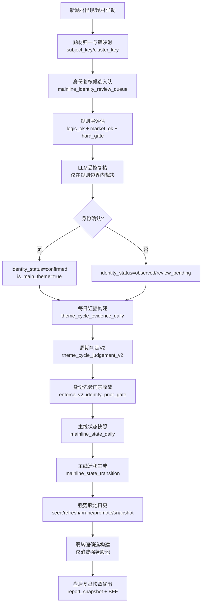

# 项目架构设计-股票服务模块（核心算法&流程）

> 目标：形成单一、可执行、可回放的股票服务架构规范，覆盖“主线识别 -> 周期跟踪 -> 强势股识别 -> 弱转强两阶段确认”。

---

## 目录

- 1. 文档定位与纠偏结论
- 2. 统一架构（四层主链）
- 3. Layer A 主线识别（身份层）
- 4. Layer B 周期跟踪（状态层）
- 5. Layer C 强势股识别与观察池（对象池）
- 6. Layer D 弱转强两阶段（候选+盘前确认）
- 7. 核心算法流程图（ASCII）
- 8. 关键数据表定义（DDL草案）
- 9. 服务接口与任务编排
- 10. 质量门禁与验收标准
- 11. 已废弃旧逻辑清单
- 12. 目录结构（代码/脚本/文档）
- 13. 跨文档汇总集成（已吸收项）
- 14. 参考来源（吸收后）
- 15. 模块功能说明总表（输入/输出/异常）
- 18. 系统工作流总览（新题材创建到每日复盘）

---

## 1. 文档定位与纠偏结论

### 1.1 文档定位

本文件是股票服务模块的统一主设计文档，替代分散文档的口径冲突。

### 1.1.1 文档治理规则（强制）

1. 自本版本起，股票服务模块的设计更新、规则修订、流程集成仅维护本文档。
2. 其他相关文档仅保留“历史归档/引用”属性，不再作为维护目标与执行口径来源。
3. 若本文档与其他文档存在冲突，以本文档为唯一准。
4. 后续评审、实现、验收均以本文档章节与版本为基线。

### 1.2 本次纠偏（核心）

1. 候选层不再重复主线状态硬筛选。
2. 候选层只消费强势股观察池，不做全市场静态扫源直入。
3. 主线身份与主线周期彻底解耦：
   - 身份：低频确认；
   - 周期：日更跟踪。
4. `fade_confirmed` 需多证据共振，不允许单日单因子触发。
5. 同股多题材导致重复扫描的问题，统一键归一与去重处理。

---

## 2. 统一架构（四层主链）

### 2.1 四层主链

1. Layer A：主线识别（身份层）
2. Layer B：周期跟踪（状态层）
3. Layer C：强势股识别与观察池（对象池）
4. Layer D：弱转强两阶段（盘后候选 + 盘前确认）

### 2.2 端到端链路

```text
[久赢恒丰题材/个股映射 + 日K/竞价数据]
                    |
                    v
 Layer A 主线识别 -> theme_mainline_identity_registry
                    |
                    v
 Layer B 周期跟踪 -> theme_cycle_evidence_daily / theme_cycle_judgement_v2
                    |
                    v
 Layer C 强势池   -> strong_stock_watch_pool / strong_stock_watch_history
                    |
                    v
 Layer D1 候选构建 -> weak_to_strong_candidate_pool
                    |
                    v
 Layer D2 盘前确认 -> weak_to_strong_auction_signal(A/B/C/X)
```

---

## 18. 系统工作流总览（新题材创建到每日复盘）

### 18.1 目标

用单一流程明确“主线身份判定”和“主线周期跟踪”的职责边界，并定义从新题材进入系统到盘后复盘输出的标准链路，避免团队在实现与消费层混用语义。

### 18.2 端到端工作流（系统架构视图）



### 18.3 四层语义与职责（强制）

1. 身份层（Identity）：回答“是不是主线”，真源是 `theme_mainline_identity_registry`。
2. 周期层（Cycle）：回答“今天处于什么周期”，真源是 `theme_cycle_judgement_v2`。
3. 迁移层（Transition）：回答“相对昨天怎么变”，真源是 `mainline_state_transition`。
4. 观察层（Observe）：边界样本跟踪，不得直接进入正式主链决策。

### 18.4 三条硬规则（强制）

1. 身份门禁先于周期门禁：`identity_confirmed=false` 样本不得进入正式主线决策流。
2. `state = final_cycle_state`：主状态只来自 `theme_cycle_judgement_v2`，快照层不得重判。
3. `transition_type` 仅表示迁移结果：不得反向替代主状态语义。

### 18.5 非主线升级主线的标准漏斗（强制）

1. 异动发现：识别“值得复核”的非主线强化信号（事件/板块/龙头/K线）。
2. 升级候选：写 `review_pending`，仅表示进入复核队列。
3. 身份确认：必须同时满足 `规则通过 + LLM通过 + 硬门禁通过` 才可 `confirmed`。

禁止路径：

1. `upgrade_trigger -> confirmed` 直通。

### 18.6 每日盘后标准编排顺序（唯一口径）

1. 行情与基础对象构建（龙虎榜、环境、龙头候选、资金增强等）。
2. 主线身份增量构建（仅新增/复核样本，不做全量重判）。
3. 周期数据可用性检查与自动补建（当日 `v2` 缺失则自动补建）。
4. 身份先验门禁收敛（周期结果与身份层对齐）。
5. 主线状态快照与迁移构建（snapshot + transition + report）。
6. 强势股池全链路（seed/refresh/prune/promote/snapshot）。
7. 弱转强候选构建（仅强势股来源）。
8. 盘后复盘快照生成与前端消费。

### 18.7 业务驱动的一句话定义

`Identity` 决定“能不能进主线”；`V2 Cycle` 决定“今天是什么状态”；`Transition` 决定“今天相对昨天怎么变”；`Strong Watch + W2S` 决定“可交易的弱转强候选有哪些”。

### 2.3 周期层与迁移层关系（强制）

1. 周期层是“状态生成层”，只回答“今天是什么状态”。
2. 迁移层是“轨迹监控层”，只回答“相对昨天怎么变”。
3. 执行顺序固定：先周期、后迁移，禁止并列重判。

### 2.4 四层消费语义（防混用）

1. Layer 0 身份层：`identity_confirmed`（是否正式主线身份）。
2. Layer 1 周期层：`final_cycle_state/final_mainline_alive`（当日状态）。
3. Layer 2 迁移层：`transition_type`（昨日到今日变化）。
4. Layer 3 观察层：边界样本，仅观察，不可进入正式策略决策。

---

## 3. Layer A 主线识别（身份层）

### 3.1 目标

回答题材“是不是主线”，不回答“今天强不强”。

### 3.2 程序核心定义（代码口径）

来源：`stock_service/scripts/build_mainline_identity_registry.py`

1. `rule_is_main_theme`：规则层是否通过（`logic_ok && market_ok`）。
2. `llm_is_main_theme`：LLM复核结论（结构化JSON返回）。
3. `is_main_theme`：最终结论（硬门禁：必须规则通过且LLM通过）。
4. `identity_status`：`observed/review_pending/confirmed/manual_override/inactive`。

硬规则（目标口径）：

1. `is_main_theme = rule_is_main_theme AND llm_applied AND llm_is_main_theme=true`。
2. 任一失败则降为 `observed`，不能进入正式主线身份。
3. `upgrade_trigger` 仅允许触发复核，不允许直接写 `confirmed`。

补充语义（消歧）：

1. 上述公式适用于“自动确认路径”。
2. `manual_override` 属于人工覆盖路径，必须显式标注来源、原因与审批痕迹。
3. `manual_override` 样本默认不参与自动指标统计，报表需单独分桶展示。

### 3.2.1 非主线升级漏斗（强制）

非主线升级为主线必须经过三步，不允许旁路：

1. Step1 异动发现：识别非主线题材的强化信号（事件/板块/龙头/K线）。
2. Step2 升级候选：写入 `review_pending`（仅表示“值得复核”）。
3. Step3 身份确认：仅当 `规则通过 + LLM通过 + 硬门禁通过` 才进入 `confirmed`。

执行约束：

1. 禁止 `upgrade_trigger -> confirmed` 直通。
2. `review_pending` 不能进入正式主线决策流。
3. `manual_override` 必须显式打标并与自动确认分离展示。

### 3.3 评分体系与公式（实现级）

#### 3.3.1 逻辑维度（logic_score）

1. `novelty_score = min(100, strong_event_count_7d*18 + event_strength_score*0.35)`
2. `timing_score = min(100, max(0, 100 - (event_recency_days-1)*15))`
3. `impact_score = min(100, front_row_strength_score*0.55 + limit_up_count*9 + front_row_alive_ratio*25 + platform_breakout_bonus)`

合成：

`logic_score = novelty_score*0.4 + timing_score*0.3 + impact_score*0.3`

#### 3.3.2 市场维度（market_score）

1. `heat_score = min(100, heat_latest*0.65 + avg_heat_5d*0.35)`
2. `board_score = min(100, limit_up_count*9 + limit_up_ratio_today*600 + board_boom_days_5d*15 + front_row_strength_score*0.30)`
3. `flow_score = min(100, max(0, net_inflow_sum_5d/1e8)*12 + net_inflow_days_5d*14)`
4. `fermentation_score = min(100, event_continuity_score*0.7 + event_count_3d*8 + hot_days_5d*6)`

合成：

`market_score = heat_score*0.25 + board_score*0.30 + flow_score*0.25 + fermentation_score*0.20`

综合分：

`composite_score = logic_score*0.45 + market_score*0.55`

### 3.4 一日游与K线形态判定（关键细节）

主线识别脚本已引入开源技术分析库（优先 `pandas_ta`，fallback `ta`）构建题材K线证据：

1. 计算：`ema10/ema20/rsi14/bollinger_lower`。
2. `one_day_tour_kline_flag`：单日脉冲后5日显著回撤 + 失守短均 + RSI弱。
3. `kline_support_hold`：未明显跌破中期均线/布林下轨，且RSI不过弱。
4. `platform_breakout_flag`：20日平台压缩后有效突破前高（平台突破加分）。

风险与连续性：

1. `one_day_tour_risk_score`（脉冲风险、资金掉速、板块掉速、K线破位风险、深跌风险）。
2. `mainline_continuity_score = fund_continuity*0.35 + board_continuity*0.35 + kline_continuity*0.30`。

结论：

1. `one_day_tour_flag=true` 为市场维度硬否决项之一。
2. `kline_support_hold=true` 可作为“资金短期波动下的主线存续豁免”证据。
3. `platform_breakout_flag=true` 是主线晋级的重要结构加分项。

### 3.5 主线判定门禁（实现阈值）

`logic_ok` 当前前置校验：

1. `strong_event_count_7d >= 1`
2. `event_count_3d >= 1`
3. `event_recency_days <= 5`

`market_ok` 当前核心门槛（节选）：

1. `not one_day_tour_flag`
2. `mainline_continuity_score >= 50`
3. `heat_score >= 58`
4. `limit_up_count >= 2`
5. `limit_up_ratio_today >= 0.02`
6. `board_boom_days_5d >= 1`
7. 资金条件三选一：持续流入 / 支撑豁免 / 平台突破豁免
8. `fermentation_ok` + `strong_event_count_7d>=1`

### 3.6 LLM受控复核规则（不是自由发挥）

1. 只对规则通过样本和边界样本触发复核。
2. 边界样本允许纠偏，但必须满足“非一日游 + 连续性达标”。
3. 最终硬门禁仍要求“规则通过 + LLM通过”。

### 3.7 运行机制

1. 初始化：按近期热点窗口建立主线基线（非全历史600+全量）。
2. 日常：仅新题材增量评估，避免日重判污染。
3. 生命周期降级：连续退潮后降级为 `inactive`。
4. 非主线异动允许频繁触发 `review_pending`，但确认仍按双门禁执行。

### 3.8 关键表

1. `theme_mainline_identity_registry`
2. `mainline_identity_review_queue`

### 3.9 模块流程图（主线识别）

```text
[Input]
  - subject_rank_daily热点题材
  - theme_cycle_evidence_daily证据
  - 资金/热度/板块扩散统计
        |
        v
[M1] 规则评分器
  -> 计算 logic_score/market_score/composite_score
        |
        v
[M2] 硬门禁
  -> logic_ok / market_ok / one_day_tour_flag
        |
        v
[M3] 升级触发器(仅异动发现)
  -> 写入 review_queue / 标记 review_pending
        |
        v
[M4] LLM复核器(规则通过样本 + review_pending样本)
  -> 返回结构化 verdict
        |
        v
[M5] 身份决策器
  -> confirmed/observed/review_pending/manual_override/inactive
        |
        v
[Output]
  - 写入 theme_mainline_identity_registry
  - 写入 mainline_identity_review_queue
```

### 3.10 模块功能说明（主线识别）

1. 模块：规则评分器  
输入：事件、热度、资金、板块、K线连续性证据。  
处理：计算`logic_score/market_score/composite_score`。  
输出：规则分与证据字段。  
异常：缺分时默认降级，禁止直通confirmed。

2. 模块：一日游风险判定器  
输入：题材30日涨跌幅序列 + TA指标。  
处理：识别`one_day_tour_kline_flag`与`one_day_tour_risk_score`。  
输出：一日游硬风险标签。  
异常：TA不可用时仅保留规则分，增加风险标记。

3. 模块：LLM复核器  
输入：规则结论+硬证据+风险标记。  
处理：受控提示词复核，输出JSON。  
输出：`llm_is_main_theme/llm_confidence/reasons/risk_flags`。  
异常：LLM失败时按配置阻断或降级observed。

4. 模块：升级触发器  
输入：非主线样本 + 状态迁移 + 事件/板块/龙头/K线强化证据。  
处理：只判断“是否值得身份复核”，不做主线确认。  
输出：`review_pending`状态与`mainline_identity_review_queue`记录。  
异常：证据不足保持`observed`，不得旁路进入`confirmed`。

5. 模块：身份持久化器  
输入：最终身份判定对象。  
处理：upsert注册表、维护首次确认日与版本号。  
输出：`theme_mainline_identity_registry`快照。  
异常：写库失败阻断本模块下游。

---

## 4. Layer B 周期跟踪（状态层）

### 4.1 目标

对已确认主线做日更状态跟踪。

### 4.2 状态集合

`start / fermentation / acceleration / divergence / repair / fade_watch / fade_confirmed`

### 4.3 周期判定核心定义（代码口径）

来源：`stock_service/services/theme_cycle_judgement_service_v2.py`

核心输出：

1. `final_cycle_state`
2. `final_mainline_alive`
3. `fade_watch` / `fade_confirmed`
4. `decision_path`（可审计路径）

### 4.4 周期评分公式（实现级）

#### 4.4.1 mainline_strength_score

`event*0.22 + continuity*0.12 + leader*0.26 + relay*0.16 + board*0.14 + support*0.10`

#### 4.4.2 fade_watch_score

`leader_break*0.35 + (1-red_ratio)*45 + big_drop_ratio*35 + min(limit_down*10,20)`

#### 4.4.3 fade_confirmed_score

`leader_break*0.45 + min(limit_down*14,35) + (1-red_ratio)*28 + max(0,40-relay)*0.45`

#### 4.4.4 divergence_score

`leader*0.30 + relay*0.25 + front_row_survival_ratio*20 + support*0.20 + (1-red_ratio)*15`

#### 4.4.5 repair_score

`continuity*0.22 + relay*0.24 + support*0.20 + red_ratio*18 + leader*0.16`

### 4.5 周期阈值（实现级）

1. `mainline_alive_min = 60`
2. `mainline_alive_leader_min = 40`
3. `mainline_alive_event_continuity_min = 40`
4. `fade_watch_min = 50`
5. `fade_confirmed_min = 60`
6. `repair_min = 65`
7. `divergence_min = 60`
8. `acceleration_min = 75`
9. `fermentation_min = 60`

### 4.6 判定顺序（优先级）

1. `fade_confirmed`（且证据计数>=3）
2. `repair`（且前一状态允许：`divergence/fade_watch`）
3. `divergence`
4. `fade_watch`
5. `acceleration`
6. `fermentation`
7. `start`

说明：这套优先级保证“有延续证据的分歧不被过早判为退潮”。

### 4.7 mainline_alive_rule 计算

同时满足：

1. `mainline_strength_score >= 60`
2. `leader_alive_score >= 40`
3. `strong_event_count_7d > 0` 或 `event_continuity_score >= 40`
4. `not fade_confirmed`

### 4.8 K线证据在周期中的作用

周期层使用 `theme_cycle_evidence_builder` 的K线证据输入：

1. `above_ma5/10/20`
2. `break_start_pivot`
3. `volume_breakdown_flag`
4. `theme_support_score`
5. `theme_ret_3d/5d/10d`

K线贡献路径：

1. 直接进入 `theme_support_score`，参与 `mainline_strength_score/divergence_score/repair_score`。
2. 通过 `volume_breakdown_flag` 与支撑结构影响 `fade_risk`。
3. 在主线识别层与周期层共同构成“存续/退潮”证据闭环。

### 4.9 迁移监控

1. 快照：`mainline_state_daily`（state=final_cycle_state）
2. 迁移：`mainline_state_transition`（flat/upgrade/downgrade/fade）
3. 语义分离：状态是状态，迁移是迁移，禁止混用
4. 快照分流：`snapshot_scope=confirmed_mainline/observe_only`
5. 决策放行：`eligible_for_decision=true` 才可进入正式主线决策流

### 4.10 模块流程图（周期跟踪）

```text
[Input]
  - theme_cycle_evidence_daily
  - previous_cycle_state
        |
        v
[C1] 评分计算器
  -> mainline_strength/fade_watch/fade_confirmed/divergence/repair
        |
        v
[C2] 证据计数器
  -> fade_confirmed_evidence_count
        |
        v
[C3] 状态机裁决器
  -> final_cycle_state + final_mainline_alive
        |
        v
[C4] 迁移生成器
  -> from_state/to_state/transition_type
        |
        v
[Output]
  - theme_cycle_judgement_v2
  - mainline_state_daily
  - mainline_state_transition
```

### 4.11 模块功能说明（周期跟踪）

1. 模块：评分计算器  
输入：四层证据（事件/龙头/板块/K线）。  
处理：按权重计算5类状态分。  
输出：状态分集合。  
异常：证据缺失时写入`score_flags`并降级状态。

2. 模块：状态机裁决器  
输入：状态分、阈值、前一状态。  
处理：按优先级决策状态（含repair转移限制）。  
输出：`final_cycle_state`。  
异常：前态缺失时禁止直接repair。

3. 模块：主线存活判定器  
输入：mainline_strength/leader/event连续性/fade_confirmed。  
处理：计算`final_mainline_alive`。  
输出：主线存活布尔值。  
异常：退潮确认时强制false。

4. 模块：迁移监控器  
输入：昨日快照+今日快照。  
处理：生成`flat/upgrade/downgrade/fade`。  
输出：迁移表与统计。  
异常：昨日缺失则仅写今日快照。

---

## 5. Layer C 强势股识别与观察池（对象池）

### 5.1 目标

构建高质量对象池，承接“前期强势 -> 回踩 -> 再转强”路径。

### 5.2 强势股硬准入（4选3）

至少满足以下4条中的3条：

1. 涨停基因：近6日>=1涨停，或近7日2连板，或近7日3天2板。
2. 题材合力：题材内有2-3只前排助攻。
3. 量价健康：放量涨、回落缩量、承接稳定。
4. 结构健康：关键支撑不破，非高位破位退潮。

### 5.3 硬剔除

1. 无涨停基因。
2. 题材孤立无板块效应。
3. 连续放量下跌且关键支撑失守。
4. 明显杂毛跟风。

### 5.4 评分分级

100分分级：

1. `S >= 80`
2. `A 65-79`
3. `B 50-64`
4. `<50` 淘汰

维度：强势基因、题材扩散、龙头地位、量价结构、技术结构。

### 5.5 关键表

- `strong_stock_watch_pool`
- `strong_stock_watch_history`

### 5.6 模块流程图（强势股识别与观察池）

```text
[Input]
  - subject_stock_daily_snapshot
  - 主线/周期上下文
  - 量价与技术结构特征
        |
        v
[S1] 准入门禁器(4选3)
  -> pass/reject
        |
        v
[S2] 评分分级器
  -> watch_score + strong_grade(S/A/B/REJECT)
        |
        v
[S3] 池维护器
  -> seed / refresh / promote / prune
        |
        v
[Output]
  - strong_stock_watch_pool
  - strong_stock_watch_history
```

### 5.7 模块功能说明（强势股识别与观察池）

1. 模块：准入门禁器  
输入：涨停基因、题材扩散、量价、结构。  
处理：4选3准入 + 硬剔除。  
输出：是否入池。  
异常：关键字段缺失时默认不入池。

2. 模块：评分分级器  
输入：通过门禁样本。  
处理：100分评分 + S/A/B分级。  
输出：`watch_score/strong_grade/labels_json`。  
异常：评分异常时降为B或REJECT。

3. 模块：池维护器  
输入：当前池 + 今日增量。  
处理：状态更新、优先级刷新、历史快照写入。  
输出：活动池与历史池。  
异常：维护失败时回滚事务，保留前一版本。

### 5.8 正式定位（治理口径）

强势股池是弱转强系统的“高质量白名单层”，不是直接买点决策层。  
职责是：持续保留真强股、及时剔除失效股、为候选层提供稳定上游对象池。

硬约束：

1. 候选层禁止全市场静态扫源直入，只能消费强势股池。
2. 强势股池必须每日滚动更新，不允许“当天临时构建一次后直接丢弃”。
3. 强势股池输出必须包含角色、结构、支撑、题材状态等可解释标签。

### 5.9 从“能跑”到“稳定日更”的六个收口点

1. 交易日语义统一（P0）  
所有窗口统一按交易日计算：`seed` 7交易日、`prune` 低分持续窗口、`watch_window_days`。  
禁止自然日窗口混用。

2. 入池状态语义清洗（P0）  
种子阶段先写 `pending_seed`，不得直接写 `active + observe_only`。  
正式状态必须在 `refresh` 评分后落地：`active/weakening/removed`。

3. 支撑/结构位纳入日更（P1）  
`refresh` 必须接入支撑评分器，实算并回写：  
`support_type/support_level/support_score/support_refs`。  
避免“字段存在但逻辑空心”。

4. 强制接入盘后主编排（P0）  
强势股池步骤必须固定嵌入主流程，不得依赖外层手工调度。  
确保候选层始终消费“当日刷新后”的观察池状态。

5. promote 与候选协议强耦合（P1）  
`promote` 不能只有布尔打标，需同时满足可晋级门槛并输出完整协议字段，  
与候选层消费契约保持一致。

6. 剔除改两段式（P1）  
立即剔除：`fade_confirmed`、硬破位且无承接等。  
延迟剔除：`weakening` + 连续低分 + 无修复证据。

### 5.10 滚动池机制（每日动态更新核心）

强势股池不是“每日临时池”，而是“滚动延续池”。

标准机制：

1. `roll_forward_active_pool(trade_date)`  
将上一交易日 `active/weakening` 对象滚动继承到当日（初始 `pending_refresh`）。

2. `seed_new_strong_stocks(trade_date)`  
追加新种子（2连板/3天2板/龙头龙二卡位/复盘异动强势股）。

3. `refresh_watch_pool(trade_date)`  
统一评分（强势基因、题材、地位、量价、K线、支撑），更新状态与优先级。

4. `prune_watch_pool(trade_date)`  
按两段式剔除策略更新 `removed_reason`。

5. `snapshot_watch_history(trade_date)`  
写入轨迹快照，保证可回放与审计。

6. `mark_promotable_candidates(trade_date)`  
输出与候选层一致的晋级语义与字段。

### 5.11 角色漂移跟踪（增强项）

为支持“龙二卡位成龙头”等路径，强势池需维护角色迁移字段：

1. `relay_role_prev`
2. `relay_role_today`
3. `role_transition`

典型迁移示例：

1. `sub_dragon -> dragon_head`
2. `follow_up -> card_position_candidate`
3. `dragon_head -> weakening_dragon`

### 5.12 每日执行顺序（Layer C强制）

```text
周期层完成
 -> 状态迁移层完成
 -> 强势池 roll-forward
 -> 强势池 seed
 -> 强势池 refresh
 -> 强势池 prune
 -> 强势池 promote
 -> 强势池 snapshot
 -> 弱转强候选构建
```

约束：

1. CandidateBuilder 只读取当日 refresh 后的强势池。
2. 任一步失败需阻断候选构建，防止“读到旧池”。

### 5.13 可验收清单（Layer C）

以下清单用于验证“强势股池已从能跑收口到稳定日更”。

1. 交易日窗口一致性（P0）  
验收标准：seed/prune/watch_window_days 均按交易日计算，无自然日窗口残留。  
检查方式：  
`rg -n "INTERVAL '7 days'|INTERVAL '3 days'" stock_service/services/strong_stock_tracking_service.py`  
通过条件：服务核心逻辑不再出现自然日窗口。

2. 入池状态语义（P0）  
验收标准：seed 后对象状态为 `pending_seed/pending_refresh`，非直接 `active`。  
检查方式：查询当日 seed 后、refresh 前的池状态分布。  
通过条件：seed 阶段不存在“默认 active + observe_only”直写。

3. refresh 完整回写（P0）  
验收标准：`watch_status/watch_score/pool_entry_type/cycle_state` 每日都有更新。  
检查方式（SQL 示例）：  
`SELECT watch_status, COUNT(*) FROM strong_stock_watch_pool WHERE last_trade_date=$trade_date GROUP BY 1;`  
通过条件：状态分布非空，且有 `active/weakening/removed` 合法分层。

4. 支撑位日更有效（P1）  
验收标准：`support_type/support_score` 非空覆盖达到阈值（建议 >60%）。  
检查方式（SQL 示例）：  
`SELECT COUNT(*) FILTER (WHERE support_score>0)::float/NULLIF(COUNT(*),0) FROM strong_stock_watch_pool WHERE last_trade_date=$trade_date;`  
通过条件：覆盖率达标，且 evidence 中有支撑来源。

5. promote 协议一致（P1）  
验收标准：被 promote 对象必须可被候选层消费（状态/入口类型一致）。  
检查方式：对比 `candidate_promoted=true` 与候选层输入集交集占比。  
通过条件：交集占比高且无大量“已 promote 但不可消费”对象。

6. prune 两段式有效（P1）  
验收标准：`removed_reason` 可区分“立即剔除/延迟剔除”。  
检查方式（SQL 示例）：  
`SELECT removed_reason, COUNT(*) FROM strong_stock_watch_history WHERE trade_date=$trade_date GROUP BY 1;`  
通过条件：剔除原因可解释，且不存在单一原因异常占比。

7. 滚动池连续性（P0）  
验收标准：昨日 `active/weakening` 到今日有合理延续，不是每天“全新重建”。  
检查方式：比较连续两日同 stock_id 保留率。  
通过条件：保留率在预期区间（策略可配置阈值）。

8. 主编排接入（P0）  
验收标准：盘后总流程中强势池步骤固定执行（seed/refresh/prune/promote/snapshot）。  
检查方式：主编排日志中存在对应 step 与计数输出。  
通过条件：无漏跑，无候选先于 refresh 执行。

9. 候选层消费边界（P0）  
验收标准：弱转强候选 100% 来自强势池（无全市场直扫旁路）。  
检查方式：候选 evidence/source_tag 抽样核验。  
通过条件：来源一致性 100%。

10. 轨迹可回放（P1）  
验收标准：当日池对象在 history 表均有快照。  
检查方式（SQL 示例）：  
`SELECT COUNT(*) FROM strong_stock_watch_history WHERE trade_date=$trade_date;`  
通过条件：快照数量与活动池规模匹配（允许微小误差仅限事务重试窗口）。

---

## 6. Layer D 弱转强两阶段（候选+盘前确认）

### 6.1 阶段一：盘后候选

输入：仅强势股观察池。  
输出：`weak_to_strong_candidate_pool(formal/observe_only/reject)`。

候选本体规则：

1. 当日必须走弱（先弱后强前提）。
2. 支撑位命中且评分达标。
3. 近7日强势历史成立（`prior7_strong_days>=1`）。
4. 涨停基因成立（`prior7_limitup_days>=1`）。

### 6.2 阶段二：盘前确认

输入：仅 `formal` 候选 + 9:20~9:25竞价数据。  
输出：`A/B/C/X`。

硬规则：

1. 非候选不得输出A/B。
2. 硬规则失败不得被高分补偿绕过。
3. 输出必须可解释（命中/扣分/证据）。

评分框架（100分）：

1. 价格强度（30）
2. 形态稳定（25）
3. 抢筹承接（25）
4. 板块联动（20）

风险扣分（0-30）：尾段急跌、红盘失守、冲高回落、板块转弱。

### 6.3 模块流程图（弱转强两阶段）

```text
阶段一 盘后候选:
[Input] strong_stock_watch_pool(active/weakening)
    -> [W1] 弱势判定器(day<0, weak_type)
    -> [W2] 支撑判定器(support_type/support_strength)
    -> [W3] prior7强势基因门禁
    -> [W4] formal/observe/reject 分类
    -> [Output] weak_to_strong_candidate_pool

阶段二 盘前确认:
[Input] candidate_pool(formal) + 09:20~09:25竞价
    -> [A1] 硬规则校验器
    -> [A2] 四维评分器 + 风险扣分器
    -> [A3] 分级决策器(A/B/C/X)
    -> [Output] weak_to_strong_auction_signal
```

### 6.4 模块功能说明（弱转强两阶段）

1. 模块：弱势判定器（阶段一）  
输入：当日K线与前日状态。  
处理：识别`weak_type/day_weak_score`。  
输出：弱势成立/失败。  
异常：缺K线直接reject。

2. 模块：支撑判定器（阶段一）  
输入：低点/收盘/均线/枢轴/前低等。  
处理：计算`support_type/support_strength`。  
输出：支撑是否有效。  
异常：支撑无效直接reject。

3. 模块：强势历史门禁器（阶段一）  
输入：prior7统计。  
处理：校验`prior7_strong_days>=1 && prior7_limitup_days>=1`。  
输出：门禁通过/失败。  
异常：统计缺失视为失败。

4. 模块：候选分类器（阶段一）  
输入：弱势、支撑、背景特征。  
处理：`formal/observe_only/reject`分类。  
输出：候选池记录。  
异常：分类异常降级reject。

5. 模块：竞价硬规则校验器（阶段二）  
输入：竞价切片数据。  
处理：过滤尾段急跌/承接失效等硬风险。  
输出：是否进入评分。  
异常：数据异常输出X。

6. 模块：竞价评分与分级器（阶段二）  
输入：通过硬规则样本。  
处理：四维评分+风险扣分并映射A/B/C。  
输出：确认信号。  
异常：关键字段缺失输出X。

---

## 7. 核心算法流程图（ASCII）

### 7.1 主线识别流程

```text
输入题材证据
 -> 逻辑维度评分
 -> 市场维度评分
 -> 双门禁判定
 -> 异动发现(非主线强化信号)
 -> review_pending复核队列
 -> (规则通过样本 + review_pending样本) LLM受控复核
 -> 身份裁决(confirmed / observed / review_pending / manual_override / inactive)
 -> 写入identity_registry + review_queue
```

### 7.2 周期跟踪流程

```text
输入evidence_daily
 -> 计算状态分
 -> 状态机判定
 -> 生成final_cycle_state/final_mainline_alive
 -> 写入judgement_v2
 -> 身份分流(confirmed_mainline / observe_only)
 -> 生成snapshot/transition
 -> 输出正式主线清单 + 观察样本清单
```

### 7.3 强势股识别流程

```text
输入股票+题材证据
 -> roll-forward(昨日active/weakening继承)
 -> 新种子追加(seed_new_strong_stocks)
 -> 硬准入(4选3)
 -> 100分打分(含支撑位日更)
 -> S/A/B/REJECT分级
 -> refresh -> 两段式prune -> promote -> snapshot
 -> 写入watch_pool/history
```

### 7.4 弱转强两阶段流程

```text
D1 盘后: watch_pool
 -> 弱+支撑+prior7强势
 -> formal/observe/reject
 -> 写入candidate_pool

D2 盘前: formal候选 + 竞价
 -> 硬规则
 -> 四维评分+风险扣分
 -> A/B/C/X
 -> 写入auction_signal
```

---

## 8. 关键数据表定义（DDL草案）

### 8.1 主线身份注册表

```sql
CREATE TABLE IF NOT EXISTS theme_mainline_identity_registry (
  subject_key VARCHAR(64) PRIMARY KEY,
  theme_name VARCHAR(128),
  is_main_theme BOOLEAN NOT NULL DEFAULT FALSE,
  identity_status VARCHAR(16) NOT NULL,
  identity_score NUMERIC(8,3) DEFAULT 0,
  logic_score NUMERIC(8,3) DEFAULT 0,
  market_score NUMERIC(8,3) DEFAULT 0,
  llm_decision VARCHAR(16),
  llm_confidence NUMERIC(6,3),
  decision_reasons JSONB NOT NULL DEFAULT '[]'::jsonb,
  first_confirmed_date DATE,
  last_reviewed_date DATE,
  updated_at TIMESTAMP NOT NULL DEFAULT NOW(),
  created_at TIMESTAMP NOT NULL DEFAULT NOW()
);
```

### 8.1.1 主线身份复核队列（新增）

```sql
CREATE TABLE IF NOT EXISTS mainline_identity_review_queue (
  id BIGSERIAL PRIMARY KEY,
  trade_date DATE NOT NULL,
  subject_key VARCHAR(64) NOT NULL,
  theme_name VARCHAR(128),
  review_source VARCHAR(32) NOT NULL,
  review_status VARCHAR(24) NOT NULL DEFAULT 'pending',
  priority_score NUMERIC(8,3) NOT NULL DEFAULT 0,
  trigger_flags JSONB NOT NULL DEFAULT '[]'::jsonb,
  evidence_json JSONB NOT NULL DEFAULT '{}'::jsonb,
  created_at TIMESTAMP NOT NULL DEFAULT NOW(),
  reviewed_at TIMESTAMP,
  UNIQUE (trade_date, subject_key, review_source)
);
```

### 8.2 周期判定表

```sql
CREATE TABLE IF NOT EXISTS theme_cycle_judgement_v2 (
  trade_date DATE NOT NULL,
  subject_key VARCHAR(64) NOT NULL,
  theme_name VARCHAR(128),
  final_cycle_state VARCHAR(32) NOT NULL,
  final_mainline_alive BOOLEAN NOT NULL DEFAULT FALSE,
  fade_watch BOOLEAN NOT NULL DEFAULT FALSE,
  fade_confirmed BOOLEAN NOT NULL DEFAULT FALSE,
  mainline_strength_score NUMERIC(8,3) DEFAULT 0,
  divergence_score NUMERIC(8,3) DEFAULT 0,
  repair_score NUMERIC(8,3) DEFAULT 0,
  fade_watch_score NUMERIC(8,3) DEFAULT 0,
  fade_confirmed_score NUMERIC(8,3) DEFAULT 0,
  rule_reasons JSONB NOT NULL DEFAULT '[]'::jsonb,
  llm_decision VARCHAR(16),
  llm_reason TEXT,
  updated_at TIMESTAMP NOT NULL DEFAULT NOW(),
  created_at TIMESTAMP NOT NULL DEFAULT NOW(),
  PRIMARY KEY (trade_date, subject_key)
);
```

### 8.3 主线快照与迁移

```sql
CREATE TABLE IF NOT EXISTS mainline_state_daily (
  trade_date DATE NOT NULL,
  subject_key VARCHAR(64) NOT NULL,
  theme_name VARCHAR(128),
  state VARCHAR(32) NOT NULL,
  is_mainline BOOLEAN NOT NULL DEFAULT FALSE,
  snapshot_scope VARCHAR(32) NOT NULL DEFAULT 'observe_only',
  eligible_for_decision BOOLEAN NOT NULL DEFAULT FALSE,
  state_score NUMERIC(8,3) DEFAULT 0,
  evidence_json JSONB NOT NULL DEFAULT '{}'::jsonb,
  created_at TIMESTAMP NOT NULL DEFAULT NOW(),
  PRIMARY KEY (trade_date, subject_key)
);

CREATE TABLE IF NOT EXISTS mainline_state_transition (
  trade_date DATE NOT NULL,
  subject_key VARCHAR(64) NOT NULL,
  theme_name VARCHAR(128),
  from_state VARCHAR(32),
  to_state VARCHAR(32) NOT NULL,
  transition_type VARCHAR(16) NOT NULL,
  trigger_flags JSONB NOT NULL DEFAULT '[]'::jsonb,
  confidence NUMERIC(6,3) DEFAULT 0,
  created_at TIMESTAMP NOT NULL DEFAULT NOW(),
  PRIMARY KEY (trade_date, subject_key)
);
```

### 8.4 强势股观察池

```sql
CREATE TABLE IF NOT EXISTS strong_stock_watch_pool (
  stock_id VARCHAR(16) PRIMARY KEY,
  stock_name VARCHAR(64) NOT NULL,
  subject_key VARCHAR(64),
  theme_name VARCHAR(128),
  watch_status VARCHAR(16) NOT NULL,
  pool_entry_type VARCHAR(16) NOT NULL,
  watch_score NUMERIC(8,2) NOT NULL DEFAULT 0,
  watch_priority NUMERIC(8,2) NOT NULL DEFAULT 0,
  strong_grade VARCHAR(16),
  labels_json JSONB NOT NULL DEFAULT '{}'::jsonb,
  cycle_state VARCHAR(32),
  mainline_strength_score NUMERIC(8,3) DEFAULT 0,
  fade_watch BOOLEAN NOT NULL DEFAULT FALSE,
  fade_confirmed BOOLEAN NOT NULL DEFAULT FALSE,
  last_trade_date DATE,
  updated_at TIMESTAMP NOT NULL DEFAULT NOW(),
  created_at TIMESTAMP NOT NULL DEFAULT NOW()
);
```

`watch_status` 推荐状态集（强制语义）：

1. `pending_seed`：仅入种子，未完成正式评分
2. `pending_refresh`：滚动继承待刷新
3. `active`：正式强势跟踪
4. `weakening`：弱化观察
5. `removed`：剔除出池

### 8.5 弱转强候选池

```sql
CREATE TABLE IF NOT EXISTS weak_to_strong_candidate_pool (
  id BIGSERIAL PRIMARY KEY,
  trade_date DATE NOT NULL,
  next_trade_date DATE NOT NULL,
  stock_id VARCHAR(16) NOT NULL,
  stock_name VARCHAR(64) NOT NULL,
  subject_key VARCHAR(64),
  theme_name VARCHAR(128),
  candidate_score NUMERIC(6,2) NOT NULL,
  pool_entry_type VARCHAR(16) NOT NULL,
  weak_type VARCHAR(32) NOT NULL,
  support_type VARCHAR(32),
  support_level NUMERIC(12,3),
  support_strength NUMERIC(6,2) DEFAULT 0,
  evidence_json JSONB NOT NULL DEFAULT '{}'::jsonb,
  created_at TIMESTAMP NOT NULL DEFAULT NOW(),
  UNIQUE (next_trade_date, stock_id)
);
```

### 8.6 盘前确认结果表

```sql
CREATE TABLE IF NOT EXISTS weak_to_strong_auction_signal (
  id BIGSERIAL PRIMARY KEY,
  trade_date DATE NOT NULL,
  stock_id VARCHAR(16) NOT NULL,
  stock_name VARCHAR(64) NOT NULL,
  candidate_id BIGINT NOT NULL,
  confirmation_score NUMERIC(6,2) NOT NULL,
  signal_level VARCHAR(1) NOT NULL,
  decision VARCHAR(16) NOT NULL,
  risk_penalty NUMERIC(6,2) DEFAULT 0,
  auction_pattern VARCHAR(32),
  evidence_json JSONB NOT NULL DEFAULT '{}'::jsonb,
  created_at TIMESTAMP NOT NULL DEFAULT NOW()
);
```

---

## 9. 服务接口与任务编排

### 9.1 核心服务

1. `build_mainline_identity_registry.py`
2. `theme_cycle_judgement_service_v2`
3. `mainline_state_transition_service.py`
4. `UpgradeTriggerDetector`（内嵌于 `build_mainline_identity_registry.py` 的异动发现/复核触发阶段）
5. `StrongStockTrackingService`
6. `WeakToStrongCandidateBuilder`
7. `WeakToStrongAuctionService`

### 9.2 候选构建接口契约

```python
build(trade_date: date, next_trade_date: Optional[date], max_candidates: int=10) -> CandidateBuildResult
```

返回：`trade_date/next_trade_date/total_scanned/total_inserted/candidates[]`。

补充消费契约（强制）：

1. 正式主线决策流必须消费 `eligible_for_decision=true` 样本。
2. 观察样本只允许出现在观察/告警端，不允许进入正式候选主链。
3. 禁止返回“主线+观察混合列表由前端自行区分”的接口。

### 9.3 盘后编排顺序（强制）

```text
数据采集 -> 主线评分 -> 身份增量 -> 周期判定 -> 状态快照迁移
-> 正式主线/观察样本双清单
-> 强势池roll-forward -> 强势池seed -> 强势池refresh -> 强势池prune -> 强势池promote -> 强势池snapshot
-> 候选构建 -> 门禁检查 -> 对外快照
```

---

## 10. 质量门禁与验收标准

### 10.1 门禁

1. 旧入口门禁（legacy禁止回流）。
2. 身份/周期冲突门禁。
3. 迁移分布异常门禁。
4. 候选规模门禁。
5. 上涨票混入门禁（候选日应为弱势）。

### 10.2 固定回放样本

1. 神剑股份：4/3、4/7、4/8（仅4/7命中）。
2. 联德股份：4/15（应命中且次日验证）。

### 10.3 验收指标

1. 单日候选规模维持小池。
2. 候选来源100%来自强势池。
3. 次日成功率与盘前确认后成功率稳定提升。

---

## 11. 已废弃旧逻辑清单

1. 候选层“主线身份+周期状态重复硬筛”逻辑（废弃）。
2. 候选层“全市场静态扫描直入”逻辑（废弃）。
3. 用`final_mainline_alive`替代`is_main_theme`的语义混用（废弃）。
4. 单日单因子触发`fade_confirmed`（废弃）。

---

## 12. 目录结构（代码/脚本/文档）

### 12.1 文档目录结构

```text
/Users/admin/Desktop/ai_theme_app
├── 项目架构设计-股票服务模块（核心算法&流程）.md      # 本文档（总架构）
├── 主线判定与周期跟踪及弱转强联动设计方案.md            # 历史归档（不维护）
├── 主线判定与周期跟踪及弱转强联动实施附录.md            # 历史归档（不维护）
├── 盘后任务编排清单.md                                  # 历史归档（不维护）
└── 交易体系文档总览_统一入口.md                          # 历史归档（不维护）
```

### 12.2 核心代码目录结构

```text
/Users/admin/Desktop/ai_theme_app/stock_service
├── services
│   ├── theme_cycle_judgement_service_v2.py
│   ├── theme_cycle_evidence_builder.py
│   ├── mainline_state_transition_service.py
│   ├── strong_stock_tracking_service.py
│   ├── weak_to_strong_candidate_builder.py
│   ├── weak_to_strong_auction_service.py
│   └── weak_to_strong_auction_scorer.py
├── scripts
│   ├── build_mainline_identity_registry.py
│   ├── build_mainline_state_tracking.py
│   ├── run_mainline_hard_gate.py
│   ├── check_mainline_cycle_consistency.py
│   └── check_mainline_transition_distribution.py
└── database/migrations
    ├── add_mainline_state_tracking_tables.sql
    └── add_strong_stock_watch_tables.sql
```

### 12.3 运行入口目录结构

```text
/Users/admin/Desktop/ai_theme_app/scripts
├── build_post_market_recap.py                  # 盘后总编排入口
└── build_weak_to_strong_candidate_pool.py      # 候选构建入口
```

### 12.4 数据域与表归属目录

```text
身份层: theme_mainline_identity_registry, mainline_identity_review_queue
周期层: theme_cycle_evidence_daily, theme_cycle_judgement_v2
迁移层: mainline_state_daily, mainline_state_transition
对象池: strong_stock_watch_pool, strong_stock_watch_history
候选层: weak_to_strong_candidate_pool
确认层: weak_to_strong_auction_signal
```

### 12.5 按执行顺序的目录结构图（入口 -> 服务 -> 数据表）

```text
入口1: scripts/build_post_market_recap.py
  ├─ 调用: stock_service/scripts/build_mainline_identity_registry.py
  │    └─ 写表: theme_mainline_identity_registry
  ├─ 调用: stock_service/services/theme_cycle_evidence_builder.py
  │    └─ 写表: theme_cycle_evidence_daily
  ├─ 调用: stock_service/services/theme_cycle_judgement_service_v2.py
  │    └─ 写表: theme_cycle_judgement_v2
  ├─ 调用: stock_service/services/mainline_state_transition_service.py
  │    ├─ 写表: mainline_state_daily
  │    └─ 写表: mainline_state_transition
  ├─ 调用: stock_service/services/strong_stock_tracking_service.py
  │    ├─ 写表: strong_stock_watch_pool
  │    └─ 写表: strong_stock_watch_history
  └─ 调用: scripts/build_weak_to_strong_candidate_pool.py
       └─ 服务: stock_service/services/weak_to_strong_candidate_builder.py
            └─ 写表: weak_to_strong_candidate_pool

入口2: 盘前确认任务（交易日09:20~09:25）
  └─ 服务: stock_service/services/weak_to_strong_auction_service.py
       ├─ 读取: weak_to_strong_candidate_pool(formal)
       ├─ 评分: stock_service/services/weak_to_strong_auction_scorer.py
       └─ 写表: weak_to_strong_auction_signal
```

## 13. 跨文档汇总集成（已吸收项）

本章用于把以下文档中的稳定约束统一折叠到本架构文档，避免执行时多文档跳转导致口径漂移：

1. `主线判定与周期跟踪及弱转强联动设计方案.md`
2. `盘后任务编排清单.md`
3. `主线判定执行时序图.md`

### 13.1 已吸收的一级约束

1. 身份门禁先于周期门禁先于个股门禁。
2. 周期层与迁移层是严格前后关系（先周期，后迁移）。
3. 状态与迁移语义分离：`state != transition_type`。
4. 快照消费隔离：`snapshot_scope` 必须区分 `confirmed_mainline/observe_only`。
5. 正式决策放行：`eligible_for_decision=true` 才能进入正式主线策略流。
6. 升级触发只允许进入身份复核队列（`review_pending`），禁止 `upgrade_trigger -> confirmed` 旁路。

### 13.2 已吸收的执行顺序

1. 身份增量 -> 周期判定 -> 状态快照迁移 -> 正式/观察双清单 -> 强势池 -> 弱转强候选。
2. 门禁在对外快照前执行，且包含迁移分布与混流检测。
3. 非主线升级遵循三步漏斗：异动发现 -> `review_pending` -> 规则+LLM+硬门禁确认。

### 13.3 已吸收的接口展示边界

1. 报表/API 必须拆分为：
   - `confirmed_mainlines[]`
   - `observe_only_samples[]`
2. 禁止把观察样本混入正式主线列表后交给前端二次区分。

### 13.4 已吸收的数据契约

1. `mainline_state_daily.state = theme_cycle_judgement_v2.final_cycle_state`。
2. `mainline_state_transition.transition_type` 仅表示迁移结果。
3. `is_mainline` 仅是展示语义字段，不承担上游判定职责。
4. 上游判定以 `identity_confirmed + final_mainline_alive + eligible_for_decision` 为准。

---

## 14. 参考来源（吸收后）

1. `docs/architecture/弱转强两阶段系统设计_v1.md`
2. `docs/architecture/选股器功能详细设计规范.md`
3. `主线判定与周期跟踪及弱转强联动设计方案.md`
4. `弱转强系统扩展设计方案_完整版_含SQL与服务骨架.md`
5. `docs/architecture/如何建立正确的交易体系.pdf`
6. `docs/architecture/如何找出牛股.pdf`
7. `docs/architecture/如何抓涨停股？.pdf`
8. `docs/architecture/弱转强买入法.pdf`

---

## 15. 模块功能说明总表（输入/输出/异常）

| 模块 | 输入 | 核心处理 | 输出 | 异常策略 |
|---|---|---|---|---|
| 主线识别规则评分器 | 热点/事件/资金/板块/K线 | 计算logic/market/composite | 规则分+证据 | 缺证据降级 |
| 主线识别LLM复核器 | 规则结论+硬证据 | 受控复核JSON | llm verdict | 失败按配置阻断/降级 |
| 周期评分计算器 | evidence_daily | 5类状态分 | 分值集合 | 标记缺失并降级 |
| 周期状态机裁决器 | 状态分+前一状态 | 判final_cycle_state | 状态结果 | 禁止非法repair |
| 强势股准入门禁器 | 涨停/题材/量价/结构 | 4选3+硬剔除 | 入池资格 | 缺字段不入池 |
| 强势股评分分级器 | 准入样本 | 100分+S/A/B | grade/score | 异常降级 |
| 弱势判定器 | 日K与前态 | weak_type/day_weak_score | 弱势通过 | 缺K线reject |
| 支撑判定器 | K线+技术位 | support_strength | 支撑通过 | 无支撑reject |
| prior7门禁器 | 历史统计 | 强势+涨停基因校验 | 通过/失败 | 缺统计失败 |
| 竞价硬规则校验器 | 竞价切片 | 风险硬过滤 | pass/fail | 数据异常X |
| 竞价评分分级器 | 通过样本 | 四维评分+扣分 | A/B/C/X | 关键字段缺失X |

---

## 16. 核心模块详细设计（按实际代码覆盖）

### 16.1 主链模块清单（当前生产口径）

1. `stock_service/scripts/build_mainline_identity_registry.py`
2. `stock_service/services/theme_cycle_evidence_builder.py`
3. `stock_service/services/theme_cycle_judgement_service_v2.py`
4. `stock_service/services/mainline_state_transition_service.py`
5. `stock_service/services/strong_stock_tracking_service.py`
6. `stock_service/services/weak_to_strong_support_scorer.py`
7. `stock_service/services/weak_to_strong_candidate_builder.py`
8. `stock_service/services/weak_to_strong_auction_data_adapter.py`
9. `stock_service/services/weak_to_strong_auction_scorer.py`
10. `stock_service/services/weak_to_strong_auction_service.py`
11. `scripts/build_post_market_recap.py`
12. `stock_service/scripts/run_mainline_hard_gate.py`

### 16.2 模块1：主线身份构建脚本

路径：`stock_service/scripts/build_mainline_identity_registry.py`

1. 职责  
构建/更新`theme_mainline_identity_registry`，输出`is_main_theme/identity_status`。

2. 核心输入  
`subject_rank_daily`热点、`theme_cycle_evidence_daily`、资金与板块统计、K线序列。

3. 核心处理  
`logic_score + market_score`、一日游风险识别、开源TA形态分析、LLM受控复核、集群补偿。

4. 核心输出  
`theme_mainline_identity_registry`（含规则结论、LLM结论、证据JSON、版本号）。

5. 失败处理  
LLM不可用时按`--allow-llm-fallback`策略降级；默认不允许规则直通confirmed。

### 16.3 模块2：周期证据构建器

路径：`stock_service/services/theme_cycle_evidence_builder.py`

1. 职责  
按交易日构建四层证据：事件、龙头、板块结构、题材K线。

2. 核心输入  
`subject_stock_daily_snapshot`、事件统计、龙头统计、板块统计。

3. 核心处理  
计算`event_strength_score/event_continuity_score/leader_alive_score/relay_strength_score/front_row_strength_score/theme_support_score`，并汇总`mainline_strength_score/fade_risk_score`。

4. 核心输出  
`theme_cycle_evidence_daily` + `evidence_json` + `*_evidence_refs`。

5. 失败处理  
分层证据缺失保留默认值并落`evidence_refs`，不静默吞错。

### 16.4 模块3：周期判定V2服务

路径：`stock_service/services/theme_cycle_judgement_service_v2.py`

1. 职责  
把证据映射为周期状态与主线存活。

2. 核心输入  
`theme_cycle_evidence_daily`单题材证据 + `previous_cycle_state`。

3. 核心处理  
计算5类状态分、`fade_confirmed_evidence_count`、状态机裁决、`decision_path`构建。

4. 核心输出  
`final_cycle_state/final_mainline_alive/fade_watch/fade_confirmed/rule_reasons/score_flags`。

5. 失败处理  
前态缺失不允许直接repair；证据不足保守回落到弱状态。

### 16.5 模块4：主线状态快照与迁移服务

路径：`stock_service/services/mainline_state_transition_service.py`

1. 职责  
把`judgement_v2`转换为`mainline_state_daily`与`mainline_state_transition`。

2. 核心输入  
今日`theme_cycle_judgement_v2` + 昨日`mainline_state_daily`。

3. 核心处理  
映射`state`、计算`transition_type`、产出升级/降级/退潮清单。

4. 核心输出  
`mainline_state_daily`、`mainline_state_transition`、日报统计。

5. 失败处理  
缺昨日快照时仅写今日快照并标记首日迁移。

### 16.6 模块5：强势股跟踪服务

路径：`stock_service/services/strong_stock_tracking_service.py`

1. 职责  
维护活动观察池与历史快照，执行入池/刷新/晋级/剔除。

2. 核心输入  
个股日线、题材上下文、主线身份与周期状态、强势标签。

3. 核心处理  
强势硬准入、watch_score计算、S/A/B分级、pool_entry_type管理。

4. 核心输出  
`strong_stock_watch_pool`、`strong_stock_watch_history`。

5. 失败处理  
事务回滚；不允许把无涨停基因样本写入正式池。

### 16.7 模块6：弱转强支撑评分器

路径：`stock_service/services/weak_to_strong_support_scorer.py`

1. 职责  
提供候选层独立支撑识别与评分。

2. 核心输入  
个股当日/前日K线、缺口、均线、枢轴、前低/前收等。

3. 核心处理  
多支撑类型融合评分，输出`support_type/support_level/support_strength/support_breakdown`。

4. 核心输出  
`SupportScoreResult`用于候选构建器。

5. 失败处理  
数据不足返回低置信评分并附原因，不做乐观默认。

### 16.8 模块7：弱转强候选构建器

路径：`stock_service/services/weak_to_strong_candidate_builder.py`

1. 职责  
盘后生成弱转强候选池（formal/observe_only/reject）。

2. 核心输入  
`strong_stock_watch_pool` + 支撑评分结果 + prior7强势统计。

3. 核心处理  
弱势判定、支撑门禁、prior7门禁、候选分类、去重合并、上限截断（10）。

4. 核心输出  
`weak_to_strong_candidate_pool`。

5. 失败处理  
next_trade_date非法即抛错；候选异常默认reject。

### 16.9 模块8：竞价数据适配器

路径：`stock_service/services/weak_to_strong_auction_data_adapter.py`

1. 职责  
为盘前确认统一装配竞价特征与板块联动上下文。

2. 核心输入  
竞价快照、候选池、板块环境特征。

3. 核心处理  
标准化`AuctionFeatureRow`，补齐数据状态与缺失标记。

4. 核心输出  
评分器可消费的结构化特征行。

5. 失败处理  
关键数据缺失标记`data_status!=ok`，下游可输出X。

### 16.10 模块9：竞价评分器

路径：`stock_service/services/weak_to_strong_auction_scorer.py`

1. 职责  
执行四维评分+风险扣分并给出分级建议。

2. 核心输入  
候选特征、竞价特征、板块上下文。

3. 核心处理  
价格/稳定/抢筹/联动打分 + 风险扣分。

4. 核心输出  
`AuctionScoreBreakdown`与信号等级建议。

5. 失败处理  
关键字段不足时返回X并保留诊断信息。

### 16.11 模块10：竞价确认服务

路径：`stock_service/services/weak_to_strong_auction_service.py`

1. 职责  
对formal候选进行盘前最终确认，写入结果表。

2. 核心输入  
候选池formal、竞价适配器输出、评分结果。

3. 核心处理  
硬规则校验、评分分级、证据拼装、结果落库。

4. 核心输出  
`weak_to_strong_auction_signal(A/B/C/X)`。

5. 失败处理  
硬规则失败降级C/X，不允许高分绕过。

### 16.12 模块11：盘后总编排入口

路径：`scripts/build_post_market_recap.py`

1. 职责  
串行编排盘后主链任务，统一执行与发布。

2. 核心输入  
`--trade-date`及门禁参数。

3. 核心处理  
按顺序调用身份、周期、迁移、强势池、候选、门禁脚本。

4. 核心输出  
盘后快照、运行日志、门禁结论。

5. 失败处理  
关键步骤失败可阻断后续发布。

### 16.13 模块12：主线硬门禁入口

路径：`stock_service/scripts/run_mainline_hard_gate.py`

1. 职责  
执行旧入口扫描、冲突检测、迁移分布异常检测。

2. 核心输入  
交易日与阈值参数。

3. 核心处理  
聚合多项检查，产出通过/告警/阻断结论。

4. 核心输出  
门禁状态码与诊断日志。

5. 失败处理  
strict模式直接阻断；非strict模式告警继续。

### 16.14 遗留模块（非主链）

以下模块保留兼容或历史用途，不作为当前主链判定口径：

1. `stock_service/services/theme_cycle_judgement_service.py`
2. `stock_service/services/weak_to_strong_service.py`
3. 其他`enhanced_*`与旧实验模块（仅专项实验使用）

约束：生产链路禁止直接调用遗留模块。

---

## 17. 问题状态跟踪 Checklist（代码收口执行面板）

用途：作为“文档口径 vs 当前代码实现”差异的唯一跟踪清单。  
执行规则：

1. 新发现差异必须先登记为 `OPEN`。
2. 每完成一项代码修复并通过验收，状态改为 `CLOSED`。
3. `CLOSED` 需补充“验收证据”（脚本/SQL/回放结果）。

状态字段：

- `OPEN`：未完成或未验收
- `IN_PROGRESS`：开发中
- `CLOSED`：已完成并验收

### 17.1 当前差异条目（滚动更新）

| ID | 优先级 | 问题描述 | 目标口径 | 当前状态 | 验收标准 | 验收证据 |
|---|---|---|---|---|---|---|
| CHK-001 | P0 | `upgrade_trigger` 可直通 `confirmed` | 仅允许 `review_pending -> 规则+LLM+hard_gate -> confirmed` | CLOSED | 不存在 `upgrade_trigger -> confirmed` 旁路 | 见 17.3 CHK-001 关闭记录 |
| CHK-002 | P0 | 强势池窗口使用自然日（7/3 days） | 全部改为交易日窗口 | CLOSED | 强势池核心逻辑无 `INTERVAL '7 days'/'3 days'` | 见 17.3 CHK-002 关闭记录 |
| CHK-003 | P0 | seed 阶段直接写 `active+observe_only` | seed 写 `pending_seed/pending_refresh`，refresh 后落正式状态 | CLOSED | seed 后状态分布不出现默认直写 active | 见 17.3 CHK-003 关闭记录 |
| CHK-004 | P0 | 盘后总编排未强制接入强势池全链路 | 主编排固定执行 `roll-forward->seed->refresh->prune->promote->snapshot` | CLOSED | 主流程日志含全部 step 且顺序正确 | 见 17.3 CHK-004 关闭记录 |
| CHK-005 | P1 | 强势池支撑字段未实算（多为默认值） | refresh 接入支撑评分并回写 `support_*` | CLOSED | `support_score>0` 覆盖率达标，evidence 含来源 | 见 17.3 CHK-005 关闭记录 |
| CHK-006 | P0 | 强势池执行顺序与文档不一致（`promote` 早于 `prune`） | 执行顺序固定为 `seed->refresh->prune->promote->snapshot` | CLOSED | 运行日志中 `prune` 先于 `promote` | 见 17.3 CHK-006 关闭记录 |
| CHK-007 | P0 | 盘后总编排缺失“弱转强候选构建”步骤 | 主编排包含 `build_weak_to_strong_candidate_pool.py` 且位于门禁前 | CLOSED | 日志出现 `weak_to_strong_candidate_pool` step | 见 17.3 CHK-007 关闭记录 |
| CHK-008 | P0 | 周期判定入口仍含 legacy `build_theme_cycle_judgement.py` 语义 | 收口到 v2-only 周期判定入口，避免口径回退 | CLOSED | 主编排不再调用 legacy 周期判定脚本 | 见 17.3 CHK-008 关闭记录 |
| CHK-009 | P0 | 主编排仍存在 legacy 周期服务兜底（`ThemeCycleJudgementService(allow_legacy=True)`） | 生产主链彻底移除 legacy service import/call，仅保留 v2 构建入口 | CLOSED | `build_post_market_recap.py` 不再出现 `ThemeCycleJudgementService`；legacy 门禁默认对 allow_legacy 也阻断 | 见 17.3 CHK-009 关闭记录 |
| CHK-010 | P0 | `mainline_identity_review_queue` 仅在文档定义，代码未落地（建表/写入缺失） | 落地 review_queue：迁移建表+唯一键+索引+身份脚本写入 | IN_PROGRESS | 当日 `review_pending` 样本可在 queue 中追踪 `review_source/review_status/priority/evidence` | 进行中：建表+写入链路已落地，待业务日触发首批 review_pending 样本 |
| CHK-011 | P1 | 架构文档状态仍为 `Draft`，与当前代码治理状态不一致 | 发布 v3.2（Approved）并冻结执行口径/兼容窗口/废弃时点 | OPEN | 文档元数据升级为 Approved，Checklist 与代码入口一致 | 待补（本轮评审） |
| CHK-012 | P1 | 迁移入口分散，缺统一 schema 收敛与差异检查 | 建立统一 migration orchestrator + schema diff 验真 | OPEN | 一键检查输出“缺表/缺列/缺索引”并纳入盘后门禁或CI | 待补（本轮评审） |

### 17.2 关闭模板（每项必填）

```text
[CLOSED] CHK-XXX
- 完成日期：
- 代码改动：
- 验收命令：
- 验收结果：
- 回归影响：
```

### 17.3 已关闭记录

```text
[CLOSED] CHK-001
- 完成日期：2026-04-19
- 代码改动：stock_service/scripts/build_mainline_identity_registry.py
  1) _apply_upgrade_trigger: 由“直通confirmed”改为“标记review_pending”
  2) 输出统计由 upgrade_confirmed 改为 upgrade_review_pending
  3) rule_version 映射改为识别 upgrade_trigger_review_pending
- 验收命令：
  1) rg -n "upgrade_trigger_mainline|upgrade_trigger_review_pending|identity_status = \"confirmed\"" stock_service/scripts/build_mainline_identity_registry.py
  2) python -m py_compile stock_service/scripts/build_mainline_identity_registry.py
- 验收结果：
  1) upgrade_trigger 路径仅写 review_pending，不再写 confirmed
  2) 脚本语法检查通过
- 回归影响：
  1) 非主线异动题材将进入 review_pending，等待规则+LLM+hard_gate 完整确认
  2) 主线数量短期可能更保守，需在后续回放观察

[CLOSED] CHK-002
- 完成日期：2026-04-19
- 代码改动：stock_service/services/strong_stock_tracking_service.py
  1) seed 窗口改为最近 7 个交易日（CTE: recent_trade_days）
  2) prune 低分超时改为交易日截止日（_resolve_cutoff_trade_date）
  3) watch_window_days 改为交易日口径回填（_recompute_watch_window_days）
  4) 移除 upsert/update 内自然日窗口计算语义（改为统一回填）
- 验收命令：
  1) rg -n "INTERVAL '7 days'|INTERVAL '3 days'" stock_service/services/strong_stock_tracking_service.py
  2) python -m py_compile stock_service/services/strong_stock_tracking_service.py
- 验收结果：
  1) 强势池核心服务无自然日窗口残留
  2) 脚本语法检查通过
- 回归影响：
  1) 节假日/周末不再扭曲强势跟踪窗口
  2) watch_window_days 更贴近真实交易节奏

[CLOSED] CHK-003
- 完成日期：2026-04-19
- 代码改动：stock_service/services/strong_stock_tracking_service.py
  1) seed 入池默认状态改为 `pending_seed`
  2) 对已在池股票，seed 冲突更新状态改为 `pending_refresh`（不再直写 active）
  3) refresh 消费集合改为：`pending_seed/pending_refresh/active/weakening`
  4) snapshot 覆盖 pending 状态，确保日轨迹可审计
- 验收命令：
  1) rg -n "'pending_seed'|'pending_refresh'|watch_status IN \\('pending_seed', 'pending_refresh', 'active', 'weakening'\\)" stock_service/services/strong_stock_tracking_service.py
  2) python -m py_compile stock_service/services/strong_stock_tracking_service.py
- 验收结果：
  1) seed 阶段不再默认直写 `active+observe_only`
  2) refresh 阶段显式承接 pending 状态并落正式状态
  3) 语法检查通过
- 回归影响：
  1) 入池语义更干净，避免“先激活后纠偏”的状态污染
  2) 若 refresh 步骤漏跑，池内将保留 pending 状态（可用于编排门禁检测）

[CLOSED] CHK-004
- 完成日期：2026-04-19
- 代码改动：scripts/build_post_market_recap.py
  1) 新增参数：--skip-strong-watch-pipeline（仅排障使用）
  2) 主编排新增强势池全链路步骤：
     strong_stock_watch_pipeline -> stock_service/scripts/build_strong_stock_watch_pool.py --trade-date
  3) 执行位置：mainline_state_tracking 之后、后续步骤之前，保证候选构建前完成强势池日更
- 验收命令：
  1) rg -n "skip-strong-watch-pipeline|strong_stock_watch_pipeline|build_strong_stock_watch_pool.py" scripts/build_post_market_recap.py
  2) python -m py_compile scripts/build_post_market_recap.py
- 验收结果：
  1) 盘后总编排固定包含强势池全链路入口
  2) 脚本语法检查通过
- 回归影响：
  1) 候选构建前置依赖更完整，减少“读到旧池”的风险
  2) 排障时可显式 skip，默认生产链路不跳过

[CLOSED] CHK-005
- 完成日期：2026-04-19
- 代码改动：stock_service/services/strong_stock_tracking_service.py
  1) 接入开源支撑评分器：`WeakToStrongSupportScorer`
  2) refresh 评分中新增 `_fetch_support_bars` 读取当前/前一交易日K线，调用 scorer 计算支撑位
  3) 回写 `support_type/support_level/support_score` 到观察池，并写入 `labels` / `evidence.support`
  4) 顺带修复 prune SQL 参数错误（避免盘后链路在 prune 阶段中断）
- 验收命令：
  1) `python -m py_compile stock_service/services/strong_stock_tracking_service.py stock_service/scripts/build_strong_stock_watch_pool.py`
  2) `.venv/bin/python stock_service/scripts/build_strong_stock_watch_pool.py --trade-date 2026-04-16`
  3) `.venv/bin/python -c "<query strong_stock_watch_pool support_score coverage>"`
- 验收结果：
  1) 强势池构建链路成功执行：`seed=59 refresh=81 promote=56 prune=0 snapshot=89`
  2) `active+weakening` 样本 `support_score>0` 覆盖率：`100% (78/78)`
  3) 全池 `support_score>0` 覆盖率：`88.76% (79/89)`（其余主要为 removed 样本）
- 回归影响：
  1) 强势池支撑字段从“默认值占主导”变为“实算值为主”，可支撑后续弱转强联动
  2) 盘后主编排稳定性提升（prune 参数错误已消除）

[CLOSED] CHK-006
- 完成日期：2026-04-19
- 代码改动：stock_service/scripts/build_strong_stock_watch_pool.py
  1) 执行顺序由 `seed->refresh->promote->prune->snapshot` 调整为 `seed->refresh->prune->promote->snapshot`
- 验收命令：
  1) `rg -n "strong_watch\\.prune|strong_watch\\.promote" stock_service/scripts/build_strong_stock_watch_pool.py`
  2) `python -m py_compile stock_service/scripts/build_strong_stock_watch_pool.py`
- 验收结果：
  1) `prune` 调用位置早于 `promote`
  2) 脚本语法检查通过
- 回归影响：
  1) 先剔除失效样本，再做候选升级，避免“先升级后剔除”的脏状态

[CLOSED] CHK-007
- 完成日期：2026-04-19
- 代码改动：scripts/build_post_market_recap.py
  1) 新增主编排步骤 `weak_to_strong_candidate_pool`
  2) 新增参数：`--skip-w2s-candidate-build`、`--w2s-max-candidates`
  3) 候选构建步骤放置于强势池全链路之后、主线门禁之前
- 验收命令：
  1) `rg -n "weak_to_strong_candidate_pool|skip-w2s-candidate-build|w2s-max-candidates" scripts/build_post_market_recap.py`
  2) `python -m py_compile scripts/build_post_market_recap.py`
- 验收结果：
  1) 盘后总编排包含弱转强候选构建 step
  2) 语法检查通过
- 回归影响：
  1) 盘后复盘快照与候选池数据口径对齐，不再依赖外部单独触发候选构建

[CLOSED] CHK-008
- 完成日期：2026-04-19
- 代码改动：scripts/build_post_market_recap.py
  1) 移除 legacy `database_service/scripts/build_theme_cycle_judgement.py` 的主编排调用
  2) 新增 v2 就绪检查：`_ensure_v2_cycle_data_ready(trade_date)`，当日 `theme_cycle_judgement_v2` 无数据则直接失败
  3) `--skip-theme-cycle-judgement` 改为兼容保留参数（deprecated no-op），避免旧调用方崩溃
- 验收命令：
  1) `rg -n "build_theme_cycle_judgement\\.py|v2_cycle_data_ready|skip-theme-cycle-judgement deprecated" scripts/build_post_market_recap.py`
  2) `python -m py_compile scripts/build_post_market_recap.py`
- 验收结果：
  1) 主编排已不存在 legacy 周期判定脚本调用
  2) 主编排对 v2 数据前置可用性有硬检查
  3) 脚本语法检查通过
- 回归影响：
  1) 周期口径收口到 v2-only，避免 legacy 汇总层造成语义混用
  2) 若 v2 当日数据缺失将快速失败，避免生成“伪完整”复盘快照

[CLOSED] CHK-009
- 完成日期：2026-04-22
- 代码改动：
  1) `scripts/build_post_market_recap.py` 移除 legacy 周期服务导入与自动补建逻辑（禁用 `ThemeCycleJudgementService(allow_legacy=True)` 路径）
  2) `--skip-theme-cycle-judgement` 调整为 deprecated no-op（兼容保留）
  3) `stock_service/scripts/check_legacy_cycle_entrypoints.py` 默认对 `allow_legacy=True` 严格阻断（新增 `--allow-legacy-warn-only` 仅告警开关）
- 验收命令：
  1) `python -m py_compile scripts/build_post_market_recap.py stock_service/scripts/check_legacy_cycle_entrypoints.py`
  2) `rg -n "ThemeCycleJudgementService|allow_legacy|_build_v2_cycle_data_if_missing" scripts/build_post_market_recap.py`
  3) `python stock_service/scripts/check_legacy_cycle_entrypoints.py`
- 验收结果：
  1) 主编排不再包含 legacy 周期服务调用
  2) legacy 入口扫描门禁通过（无回流入口）
  3) 语法检查通过
- 回归影响：
  1) 当日 v2 数据缺失将直接失败，不再依赖 legacy 自动兜底
  2) 生产主链周期口径一致性进一步收口
```

### 17.4 本轮新增差异分析与优化计划（2026-04-22）

本轮评审结论（对照：`项目架构设计-股票服务模块（核心算法&流程）.md` v3.1）：

1. 已对齐主链：身份 -> 周期v2 -> 状态迁移 -> 强势池 -> 弱转强候选。
2. 需优先收口：legacy 周期服务兜底路径（CHK-009）、身份复核队列表落地（CHK-010）。
3. 需治理完善：文档发布态升级（CHK-011）、迁移入口统一与 schema 验真（CHK-012）。

分阶段推进（与 CHK 映射）：

1. Phase A（P0，1-2天）
   - A1: 移除主编排 legacy service 兜底，仅保留 v2 构建入口（CHK-009）
   - A2: 新增 `mainline_identity_review_queue` migration（表+唯一键+索引）（CHK-010）
   - A3: 身份增量脚本写入 review_queue，补充来源/优先级/证据/状态字段（CHK-010）
   - A4: 旧入口门禁升级为“allow_legacy 亦阻断生产链路”（CHK-009）

2. Phase B（P1，2-4天）
   - B1: 增加 review_queue 回放报表（入队->复核->回写）并接入盘后审计（CHK-010）
   - B2: 收敛 migration 执行入口并加入 schema diff 检查（CHK-012）
   - B3: 文档发布 v3.2（Approved），冻结契约与验收SQL（CHK-011）

3. Phase C（P2，持续）
   - C1: 每日一致性巡检（legacy 入口扫描 + schema 完整性 + 迁移分布）
   - C2: 关键门禁纳入 CI，失败阻断盘后主链

本面板维护要求（新增）：

1. CHK-009~CHK-012 每日更新一次状态与验收证据链接。
2. 每个 `IN_PROGRESS` 条目必须标注责任脚本与预计完成日期。
3. 关闭时必须在 17.3 追加 `CLOSED` 记录，不允许仅改表格状态。
